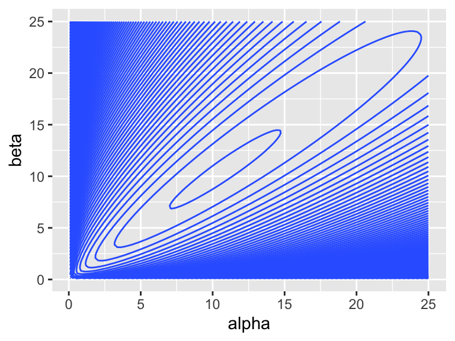

---
output:
  pdf_document: default
  html_document: default
---


As I see it, "regression modeling" in political science is a several-step process:

You begin with a substantive understanding of the way the world works.

1. Choose a regression model. I introduce many.
1. Fit a regression model. Maximum likelihood and Markov chain Monte Carlo methods are powerful and general.
1. Evaluate the fit. What are the properties of the procedure? How well does the model match the data?
1. Interpret the model. I emphasize quantities of interest and confidence intervals, but also discuss hypothesis tests.

You then update your understanding of the world.

This week, I introduce our first "engine": maximum likelihood. As a starting point, we use ML to estimate the parameters of Bernoulli, Poisson, and beta distributions (without covariates). I introduce the parametric bootstrap as a tool to obtain confidence intervals. I introduce the invariance property and show how we can use the invariance property to transform the estimated parameters into other quantities of interest. To evaluate the models, we use the predictive distribution.

## Maximum Likelihood

Suppose we have a random sample from a distribution $f(x; \theta)$. We find the maximum likelihood (ML) estimator $\hat{\theta}$ of $\theta$ by maximizing the likelihood of the observed data with respect to $\theta$.

In short, we take the likelihood of the data (given the model and a particular $\theta$) and find the parameter $\theta$ that maximizes it. 

In practice, to make the math and/or computation a bit easier, we manipulate the likelihood function in two ways:

1. Relabel the likelihood function $f(x; \theta) = L(\theta)$, since it's weird to maximize with respect to a "conditioning variable"fixed" variable. (The notation $f(x; \theta)$ suggests $x$ varies for a particular $\theta$.)
1. Work with $\log L(\theta)$ rather than $L(\theta)$. Because $\log()$ is a monotonically increasing function, the $\theta$ that maximizes $L(\theta)$ also maximizes $\log L(\theta)$. 

Suppose we have samples $x_1, x_2, ..., x_N$ from $f(x; \theta)$. Then the joint density/probability is $f(x; \theta) = \prod_{n = 1}^N f(x_n; \theta)$ and $\log L(\theta) = \sum_{n = 1}^N \log \left[ f(x_n; \theta) \right]$. The ML estimator $\hat{\theta}$ of $\theta$ is $\arg \max \log L(\theta)$.

In applied problems, we might be able to simplify $\log L$ substantially. Occasionally, we can find a nice analytical maximum. In many cases, we have a computer find the parameter that maximizes $\log L$.

### Example: Bernoulli Distribution

As a running example, we use the **toothpaste cap problem**:

> We have a toothpaste cap--one with a wide bottom and a narrow top. We're going to toss the toothpaste cap. It can either end up lying on its side, its (wide) bottom, or its (narrow) top. 

> We want to estimate the probability of the toothpaste cap landing on its top.

> We can model each toss as a Bernoulli trial, thinking of each toss as a random variable $X$ where $X \sim \text{Bernoulli}(\pi)$. If the cap lands on its top, we think of the outcome as 1. If not, as 0. 

Suppose we toss the cap $N$ times and observe $k$ tops. What is the ML estimate $\hat{\pi}$ of $\pi$?

According to the model $f(x_i; \pi) = \pi^{x_i} (1 - \pi)^{(1 - x_i)}$. Because the samples are iid, we can find the *joint* distribution $f(x) = f(x_1) \times ... \times f(x_N) = \prod_{i = 1}^N f(x_i)$. We're just multiplying $k$ $\pi$s (i.e., each of the $k$ ones has probability $\pi$) and $(N - k)$ $(1 - \pi)$s (i.e., each of the $N - k$ zeros has probability $1 - \pi$), so that the $f(x; \pi) = \pi^{k} (1 - \pi)^{(N - k)}$.
$$
\text{the likelihood:  } f(x; \pi) =  \pi^{k} (1 - \pi)^{(N - k)}, \text{where } k = \sum_{n = 1}^N x_n \\
$$
Then, we relabel. 
$$
\text{the likelihood:  } L(\pi) = \pi^{k} (1 - \pi)^{(N - k)}\\
$$
Then, we take the log and simplify. 
$$
\text{the log-likelihood:  } \log L(\pi) = k \log (\pi) + (N - k) \log(1 - \pi)\\
$$
To find the ML estimator, we find $\hat{\pi}$ that maximizes $\log L$. 

The code below plots the log-likelihood function using the 8/150 data.


```r
pi <- seq(0.01, 0.99, length.out = 1000)
data <- tibble(pi = pi) %>%
  mutate(log_lik = 18*log(pi) + (150 - 8)*log(1 - pi))
ggplot(data, aes(x = pi, y = log_lik)) + 
  geom_vline(xintercept = 8/150, color = "green") + 
  geom_line() + 
  theme_minimal()
```


In this case, the analytical optimum is easy.

$$
\begin{aligned}
\frac{d \log L}{d\hat{\pi}} = k \left( \frac{1}{\hat{\pi}}\right) + (N - k) \left( \frac{1}{1 - \hat{\pi}}\right)(-1) &= 0\\
\frac{k}{\hat{\pi}} - \frac{N - y}{1 - \hat{\pi}} &= 0 \\
\frac{k}{\hat{\pi}} &= \frac{N - y}{1 - \hat{\pi}} \\
k(1 - \hat{\pi}) &= (N - y)\hat{\pi} \\
k - y\hat{\pi} &= N\hat{\pi} - y\hat{\pi} \\
k  &= N\hat{\pi} \\
\hat{\pi} &= \frac{k}{N} = \text{avg}(x)\\
\end{aligned}
$$
The ML estimator of $\pi$ is the average of the $N$ Bernoulli trials, or, equivalently, the fraction of successes. 

The collected data consist of 150 trials and 8 successes, so the ML estimate of $\pi$ is $\frac{8}{150} \approx 0.053$.

### Example: Poisson Distribution

Suppose we collect $N$ random samples $x = \{x_1, x_2, ..., x_N\}$ and model each draw as a random variable $X \sim \text{Poisson}(\lambda)$. Find the ML estimator of $\lambda$.

$$
\begin{aligned}
\text{Poisson likelihood: } f(x; \lambda) &= \prod_{n = 1}^N \frac{\lambda^{x_n} e^{-\lambda}}{x_n!} \\
L(\lambda) &= \prod_{n = 1}^N \frac{\lambda^{x_n} e^{-\lambda}}{x_n!} \\
\log L(\lambda) &= \sum_{n = 1}^N \log \left[ \frac{\lambda^{x_n} e^{-\lambda}}{x_n!} \right]\\
&= \sum_{n = 1}^N \left[ x_n \log \lambda + (-\lambda) \log e - \log x_n! \right]\\
&= \log \lambda \left[ \sum_{n = 1}^N x_n \right]  -N\lambda + \sum_{n = 1}^N \log (x_n!) \\
\end{aligned}
$$

To find the ML estimator, we find $\hat{\lambda}$ that maximizes $\log L$. In this case, the analytical optimum is easy.

$$
\begin{aligned}
\frac{d \log L}{d\hat{\lambda}} = \frac{1}{\hat{\lambda}} \left[ \sum_{n = 1}^N x_n \right] - N &= 0\\
\frac{1}{\hat{\lambda}} \left[ \sum_{n = 1}^N x_n \right] &= N \\
\left[ \sum_{n = 1}^N x_n \right] &= N \hat{\lambda} \\
\hat{\lambda} &= \frac{ \sum_{n = 1}^N x_n }{N} = \text{avg}(x)  \\
\end{aligned}
$$
The ML estimator for the Poisson distribution is just the average of the samples. 

### Remarks

The ML estimator is extremely common in political science because they are general, fast, and work extremely well. Lots of models that you've heard of, such as logistic regression, are estimated with ML.

We can even obtain ML estimates for the linear regression model. We assume that the observed data are samples from a normal distribution with mean $\mu_n = \alpha + \beta x_n$ and variance $\sigma^2$. For this model, the least-squares estimate that we learned earlier is also the ML estimate. 

### Example: Beta Distribution

Questions:

1.  What is the \textit{support} of the beta distribution? $[0, 1]$
1. Is $y$ a discrete random variable or a continuous random variable? Continuous.
1. What is the pdf/pmf? $f(y_i; \alpha, \beta) = \dfrac{y_i^{\alpha - 1}(1 - y_i)^{\beta - 1}}{B(\alpha, \beta)}$, where $B(\alpha, \beta) = \displaystyle \int_0^1 t^{\alpha - 1}(1 - t)^{\beta - 1}dt$.

With the beta distribution, we add two complications that typically occur when using ML.

1. multiple parameters
1. an intractable log-likelihood

Start with the probability model $Y_i \sim f(y_i; \theta)$. In the case of the beta model, we have $Y_i \sim \text{beta}(y_i; \alpha, \beta)$. The $\alpha$ and $\beta$ here don't have a convenient interpretation. They are "shape" parameters. You can think of $\alpha$ as pushing the distribution to the right and $\beta$ as pushing the distribution to the left.


```r
alphas <- c(0.8, 1, 2, 5, 25)
betas <- c(0.8, 1, 2, 5, 25)

x <- seq(0, 1, length.out = 100)

pdfs <- crossing(alpha = alphas, 
                 beta = betas, 
                 x = x) %>%
  mutate(pdf = dbeta(x, alpha, beta)) %>%
  mutate(alpha_lbl = paste0("alpha == ", alpha),
         beta_lbl = paste0("beta == ", beta)) 

ggplot(pdfs, aes(x = x, y = pdf)) + 
  facet_grid(rows = vars(beta_lbl), cols = vars(alpha_lbl), 
             labeller = "label_parsed", scales = "free") + 
  geom_line()
```


We now have two parameters to estimate and we're going to assume that we have multiple observations, so that $y = [y_1, y_2, ,..., y_n]$.

In general, this is how we do ML:

**Step 1** Write down the likelihood function. Recall that we can obtain the joint density of $y_1$ AND $y_2$ AND ... AND $y_n$ by multiplying the probabilities of each (assuming independence).
$$
\begin{aligned}
L(\alpha, \beta) = \displaystyle\prod_{i = 1}^n \overbrace{f(y_i;\alpha, \beta)}^{\text{density}} = \displaystyle\prod_{i = 1}^n \dfrac{y_i^{\alpha - 1}(1 - y_i)^{\beta - 1}}{B(\alpha, \beta)}
\end{aligned}
$$
We see again, as will be usual, that we have this complicated product that will make our lives difficult.

**Step 2** Take the log and simplify.
$$
\begin{aligned}
L(\alpha, \beta) &= \displaystyle\prod_{i = 1}^n \dfrac{y_i^{\alpha - 1}(1 - y_i)^{\beta - 1}}{B(\alpha, \beta)}\\
\log L(\alpha, \beta) &= \displaystyle\sum_{i = 1}^n \log \dfrac{y_i^{\alpha - 1}(1 - y_i)^{\beta - 1}}{B(\alpha, \beta)}\\
&= \displaystyle\sum_{i = 1}^n \left[ \log y_i^{\alpha - 1} + \log (1 - y_i)^{\beta - 1} - \log B(\alpha, \beta)\right]\\
&= \displaystyle\sum_{i = 1}^n \left[ (\alpha - 1)\log y_i + (\beta - 1)\log (1 - y_i) - \log B(\alpha, \beta)\right]\\
&= \displaystyle\sum_{i = 1}^n \left[ (\alpha - 1)\log y_i + (\beta - 1)\log (1 - y_i)\right] - n \log B(\alpha, \beta)\\
\log L(\alpha, \beta) &= (\alpha - 1) \sum_{i = 1}^n \log y_i + (\beta - 1) \sum_{i = 1}^n \log (1 - y_i) - n \log B(\alpha, \beta)
\end{aligned}
$$
**Step 3** Maximize

If we wanted, we could work on this one analytically. 

1. Take the derivative w.r.t. $\alpha$.
1. Take the derivative w.r.t. $\beta$.
1. Set both equal to zero and solve. (Two equations and two unknowns.)

But the last term $B(\alpha, \beta) = \int_0^1 t^{\alpha - 1}(1 - t)^{\beta - 1}dt$ is tricky! So let's do it numerically.

To perform the optimization, we need a data set. For now, let's simulate a fake data set with known parameters


```r
y <- rbeta(1000, shape1 = 10, shape2 = 10)
```

Let's plot the log-likelihood function to see what we're dealing with.


```r
library(plotly)

alpha <- seq(0.1, 25, length.out = 100)
beta  <- seq(0.1, 25, length.out = 100)
data <- crossing(alpha, beta) %>%
  mutate(log_lik = alpha*sum(log(y)) + beta*sum(log(1 - y)) - 
           length(y)*log(beta(alpha, beta)))

plot_ly(x = ~alpha, y = ~beta, z = ~log_lik, data = data) %>%
  add_mesh(labels = c("alpha", "beta", "log-likelihood"))
```

```{=html}
<div id="htmlwidget-7b8429ee80ce32cb26cf" style="width:672px;height:480px;" class="plotly html-widget"></div>
<script type="application/json" data-for="htmlwidget-7b8429ee80ce32cb26cf">{"x":{"visdat":{"448a7e95caa3":["function () ","plotlyVisDat"]},"cur_data":"448a7e95caa3","attrs":{"448a7e95caa3":{"x":{},"y":{},"z":{},"alpha_stroke":1,"sizes":[10,100],"spans":[1,20],"type":"mesh3d","labels":["alpha","beta","log-likelihood"],"inherit":true}},"layout":{"margin":{"b":40,"l":60,"t":25,"r":10},"scene":{"xaxis":{"title":"alpha"},"yaxis":{"title":"beta"},"zaxis":{"title":"log_lik"}},"hovermode":"closest","showlegend":false,"legend":{"yanchor":"top","y":0.5}},"source":"A","config":{"modeBarButtonsToAdd":["hoverclosest","hovercompare"],"showSendToCloud":false},"data":[{"colorbar":{"title":"log_lik","ticklen":2,"len":0.5,"lenmode":"fraction","y":1,"yanchor":"top"},"colorscale":[["0","rgba(68,1,84,1)"],["0.0416666666666667","rgba(70,19,97,1)"],["0.0833333333333334","rgba(72,32,111,1)"],["0.125","rgba(71,45,122,1)"],["0.166666666666667","rgba(68,58,128,1)"],["0.208333333333333","rgba(64,70,135,1)"],["0.25","rgba(60,82,138,1)"],["0.291666666666667","rgba(56,93,140,1)"],["0.333333333333333","rgba(49,104,142,1)"],["0.375","rgba(46,114,142,1)"],["0.416666666666667","rgba(42,123,142,1)"],["0.458333333333333","rgba(38,133,141,1)"],["0.5","rgba(37,144,140,1)"],["0.541666666666667","rgba(33,154,138,1)"],["0.583333333333333","rgba(39,164,133,1)"],["0.625","rgba(47,174,127,1)"],["0.666666666666667","rgba(53,183,121,1)"],["0.708333333333333","rgba(79,191,110,1)"],["0.75","rgba(98,199,98,1)"],["0.791666666666667","rgba(119,207,85,1)"],["0.833333333333333","rgba(147,214,70,1)"],["0.875","rgba(172,220,52,1)"],["0.916666666666667","rgba(199,225,42,1)"],["0.958333333333333","rgba(226,228,40,1)"],["1","rgba(253,231,37,1)"]],"showscale":true,"x":[0.1,0.1,0.1,0.1,0.1,0.1,0.1,0.1,0.1,0.1,0.1,0.1,0.1,0.1,0.1,0.1,0.1,0.1,0.1,0.1,0.1,0.1,0.1,0.1,0.1,0.1,0.1,0.1,0.1,0.1,0.1,0.1,0.1,0.1,0.1,0.1,0.1,0.1,0.1,0.1,0.1,0.1,0.1,0.1,0.1,0.1,0.1,0.1,0.1,0.1,0.1,0.1,0.1,0.1,0.1,0.1,0.1,0.1,0.1,0.1,0.1,0.1,0.1,0.1,0.1,0.1,0.1,0.1,0.1,0.1,0.1,0.1,0.1,0.1,0.1,0.1,0.1,0.1,0.1,0.1,0.1,0.1,0.1,0.1,0.1,0.1,0.1,0.1,0.1,0.1,0.1,0.1,0.1,0.1,0.1,0.1,0.1,0.1,0.1,0.1,0.351515151515152,0.351515151515152,0.351515151515152,0.351515151515152,0.351515151515152,0.351515151515152,0.351515151515152,0.351515151515152,0.351515151515152,0.351515151515152,0.351515151515152,0.351515151515152,0.351515151515152,0.351515151515152,0.351515151515152,0.351515151515152,0.351515151515152,0.351515151515152,0.351515151515152,0.351515151515152,0.351515151515152,0.351515151515152,0.351515151515152,0.351515151515152,0.351515151515152,0.351515151515152,0.351515151515152,0.351515151515152,0.351515151515152,0.351515151515152,0.351515151515152,0.351515151515152,0.351515151515152,0.351515151515152,0.351515151515152,0.351515151515152,0.351515151515152,0.351515151515152,0.351515151515152,0.351515151515152,0.351515151515152,0.351515151515152,0.351515151515152,0.351515151515152,0.351515151515152,0.351515151515152,0.351515151515152,0.351515151515152,0.351515151515152,0.351515151515152,0.351515151515152,0.351515151515152,0.351515151515152,0.351515151515152,0.351515151515152,0.351515151515152,0.351515151515152,0.351515151515152,0.351515151515152,0.351515151515152,0.351515151515152,0.351515151515152,0.351515151515152,0.351515151515152,0.351515151515152,0.351515151515152,0.351515151515152,0.351515151515152,0.351515151515152,0.351515151515152,0.351515151515152,0.351515151515152,0.351515151515152,0.351515151515152,0.351515151515152,0.351515151515152,0.351515151515152,0.351515151515152,0.351515151515152,0.351515151515152,0.351515151515152,0.351515151515152,0.351515151515152,0.351515151515152,0.351515151515152,0.351515151515152,0.351515151515152,0.351515151515152,0.351515151515152,0.351515151515152,0.351515151515152,0.351515151515152,0.351515151515152,0.351515151515152,0.351515151515152,0.351515151515152,0.351515151515152,0.351515151515152,0.351515151515152,0.351515151515152,0.603030303030303,0.603030303030303,0.603030303030303,0.603030303030303,0.603030303030303,0.603030303030303,0.603030303030303,0.603030303030303,0.603030303030303,0.603030303030303,0.603030303030303,0.603030303030303,0.603030303030303,0.603030303030303,0.603030303030303,0.603030303030303,0.603030303030303,0.603030303030303,0.603030303030303,0.603030303030303,0.603030303030303,0.603030303030303,0.603030303030303,0.603030303030303,0.603030303030303,0.603030303030303,0.603030303030303,0.603030303030303,0.603030303030303,0.603030303030303,0.603030303030303,0.603030303030303,0.603030303030303,0.603030303030303,0.603030303030303,0.603030303030303,0.603030303030303,0.603030303030303,0.603030303030303,0.603030303030303,0.603030303030303,0.603030303030303,0.603030303030303,0.603030303030303,0.603030303030303,0.603030303030303,0.603030303030303,0.603030303030303,0.603030303030303,0.603030303030303,0.603030303030303,0.603030303030303,0.603030303030303,0.603030303030303,0.603030303030303,0.603030303030303,0.603030303030303,0.603030303030303,0.603030303030303,0.603030303030303,0.603030303030303,0.603030303030303,0.603030303030303,0.603030303030303,0.603030303030303,0.603030303030303,0.603030303030303,0.603030303030303,0.603030303030303,0.603030303030303,0.603030303030303,0.603030303030303,0.603030303030303,0.603030303030303,0.603030303030303,0.603030303030303,0.603030303030303,0.603030303030303,0.603030303030303,0.603030303030303,0.603030303030303,0.603030303030303,0.603030303030303,0.603030303030303,0.603030303030303,0.603030303030303,0.603030303030303,0.603030303030303,0.603030303030303,0.603030303030303,0.603030303030303,0.603030303030303,0.603030303030303,0.603030303030303,0.603030303030303,0.603030303030303,0.603030303030303,0.603030303030303,0.603030303030303,0.603030303030303,0.854545454545455,0.854545454545455,0.854545454545455,0.854545454545455,0.854545454545455,0.854545454545455,0.854545454545455,0.854545454545455,0.854545454545455,0.854545454545455,0.854545454545455,0.854545454545455,0.854545454545455,0.854545454545455,0.854545454545455,0.854545454545455,0.854545454545455,0.854545454545455,0.854545454545455,0.854545454545455,0.854545454545455,0.854545454545455,0.854545454545455,0.854545454545455,0.854545454545455,0.854545454545455,0.854545454545455,0.854545454545455,0.854545454545455,0.854545454545455,0.854545454545455,0.854545454545455,0.854545454545455,0.854545454545455,0.854545454545455,0.854545454545455,0.854545454545455,0.854545454545455,0.854545454545455,0.854545454545455,0.854545454545455,0.854545454545455,0.854545454545455,0.854545454545455,0.854545454545455,0.854545454545455,0.854545454545455,0.854545454545455,0.854545454545455,0.854545454545455,0.854545454545455,0.854545454545455,0.854545454545455,0.854545454545455,0.854545454545455,0.854545454545455,0.854545454545455,0.854545454545455,0.854545454545455,0.854545454545455,0.854545454545455,0.854545454545455,0.854545454545455,0.854545454545455,0.854545454545455,0.854545454545455,0.854545454545455,0.854545454545455,0.854545454545455,0.854545454545455,0.854545454545455,0.854545454545455,0.854545454545455,0.854545454545455,0.854545454545455,0.854545454545455,0.854545454545455,0.854545454545455,0.854545454545455,0.854545454545455,0.854545454545455,0.854545454545455,0.854545454545455,0.854545454545455,0.854545454545455,0.854545454545455,0.854545454545455,0.854545454545455,0.854545454545455,0.854545454545455,0.854545454545455,0.854545454545455,0.854545454545455,0.854545454545455,0.854545454545455,0.854545454545455,0.854545454545455,0.854545454545455,0.854545454545455,0.854545454545455,1.10606060606061,1.10606060606061,1.10606060606061,1.10606060606061,1.10606060606061,1.10606060606061,1.10606060606061,1.10606060606061,1.10606060606061,1.10606060606061,1.10606060606061,1.10606060606061,1.10606060606061,1.10606060606061,1.10606060606061,1.10606060606061,1.10606060606061,1.10606060606061,1.10606060606061,1.10606060606061,1.10606060606061,1.10606060606061,1.10606060606061,1.10606060606061,1.10606060606061,1.10606060606061,1.10606060606061,1.10606060606061,1.10606060606061,1.10606060606061,1.10606060606061,1.10606060606061,1.10606060606061,1.10606060606061,1.10606060606061,1.10606060606061,1.10606060606061,1.10606060606061,1.10606060606061,1.10606060606061,1.10606060606061,1.10606060606061,1.10606060606061,1.10606060606061,1.10606060606061,1.10606060606061,1.10606060606061,1.10606060606061,1.10606060606061,1.10606060606061,1.10606060606061,1.10606060606061,1.10606060606061,1.10606060606061,1.10606060606061,1.10606060606061,1.10606060606061,1.10606060606061,1.10606060606061,1.10606060606061,1.10606060606061,1.10606060606061,1.10606060606061,1.10606060606061,1.10606060606061,1.10606060606061,1.10606060606061,1.10606060606061,1.10606060606061,1.10606060606061,1.10606060606061,1.10606060606061,1.10606060606061,1.10606060606061,1.10606060606061,1.10606060606061,1.10606060606061,1.10606060606061,1.10606060606061,1.10606060606061,1.10606060606061,1.10606060606061,1.10606060606061,1.10606060606061,1.10606060606061,1.10606060606061,1.10606060606061,1.10606060606061,1.10606060606061,1.10606060606061,1.10606060606061,1.10606060606061,1.10606060606061,1.10606060606061,1.10606060606061,1.10606060606061,1.10606060606061,1.10606060606061,1.10606060606061,1.10606060606061,1.35757575757576,1.35757575757576,1.35757575757576,1.35757575757576,1.35757575757576,1.35757575757576,1.35757575757576,1.35757575757576,1.35757575757576,1.35757575757576,1.35757575757576,1.35757575757576,1.35757575757576,1.35757575757576,1.35757575757576,1.35757575757576,1.35757575757576,1.35757575757576,1.35757575757576,1.35757575757576,1.35757575757576,1.35757575757576,1.35757575757576,1.35757575757576,1.35757575757576,1.35757575757576,1.35757575757576,1.35757575757576,1.35757575757576,1.35757575757576,1.35757575757576,1.35757575757576,1.35757575757576,1.35757575757576,1.35757575757576,1.35757575757576,1.35757575757576,1.35757575757576,1.35757575757576,1.35757575757576,1.35757575757576,1.35757575757576,1.35757575757576,1.35757575757576,1.35757575757576,1.35757575757576,1.35757575757576,1.35757575757576,1.35757575757576,1.35757575757576,1.35757575757576,1.35757575757576,1.35757575757576,1.35757575757576,1.35757575757576,1.35757575757576,1.35757575757576,1.35757575757576,1.35757575757576,1.35757575757576,1.35757575757576,1.35757575757576,1.35757575757576,1.35757575757576,1.35757575757576,1.35757575757576,1.35757575757576,1.35757575757576,1.35757575757576,1.35757575757576,1.35757575757576,1.35757575757576,1.35757575757576,1.35757575757576,1.35757575757576,1.35757575757576,1.35757575757576,1.35757575757576,1.35757575757576,1.35757575757576,1.35757575757576,1.35757575757576,1.35757575757576,1.35757575757576,1.35757575757576,1.35757575757576,1.35757575757576,1.35757575757576,1.35757575757576,1.35757575757576,1.35757575757576,1.35757575757576,1.35757575757576,1.35757575757576,1.35757575757576,1.35757575757576,1.35757575757576,1.35757575757576,1.35757575757576,1.35757575757576,1.60909090909091,1.60909090909091,1.60909090909091,1.60909090909091,1.60909090909091,1.60909090909091,1.60909090909091,1.60909090909091,1.60909090909091,1.60909090909091,1.60909090909091,1.60909090909091,1.60909090909091,1.60909090909091,1.60909090909091,1.60909090909091,1.60909090909091,1.60909090909091,1.60909090909091,1.60909090909091,1.60909090909091,1.60909090909091,1.60909090909091,1.60909090909091,1.60909090909091,1.60909090909091,1.60909090909091,1.60909090909091,1.60909090909091,1.60909090909091,1.60909090909091,1.60909090909091,1.60909090909091,1.60909090909091,1.60909090909091,1.60909090909091,1.60909090909091,1.60909090909091,1.60909090909091,1.60909090909091,1.60909090909091,1.60909090909091,1.60909090909091,1.60909090909091,1.60909090909091,1.60909090909091,1.60909090909091,1.60909090909091,1.60909090909091,1.60909090909091,1.60909090909091,1.60909090909091,1.60909090909091,1.60909090909091,1.60909090909091,1.60909090909091,1.60909090909091,1.60909090909091,1.60909090909091,1.60909090909091,1.60909090909091,1.60909090909091,1.60909090909091,1.60909090909091,1.60909090909091,1.60909090909091,1.60909090909091,1.60909090909091,1.60909090909091,1.60909090909091,1.60909090909091,1.60909090909091,1.60909090909091,1.60909090909091,1.60909090909091,1.60909090909091,1.60909090909091,1.60909090909091,1.60909090909091,1.60909090909091,1.60909090909091,1.60909090909091,1.60909090909091,1.60909090909091,1.60909090909091,1.60909090909091,1.60909090909091,1.60909090909091,1.60909090909091,1.60909090909091,1.60909090909091,1.60909090909091,1.60909090909091,1.60909090909091,1.60909090909091,1.60909090909091,1.60909090909091,1.60909090909091,1.60909090909091,1.60909090909091,1.86060606060606,1.86060606060606,1.86060606060606,1.86060606060606,1.86060606060606,1.86060606060606,1.86060606060606,1.86060606060606,1.86060606060606,1.86060606060606,1.86060606060606,1.86060606060606,1.86060606060606,1.86060606060606,1.86060606060606,1.86060606060606,1.86060606060606,1.86060606060606,1.86060606060606,1.86060606060606,1.86060606060606,1.86060606060606,1.86060606060606,1.86060606060606,1.86060606060606,1.86060606060606,1.86060606060606,1.86060606060606,1.86060606060606,1.86060606060606,1.86060606060606,1.86060606060606,1.86060606060606,1.86060606060606,1.86060606060606,1.86060606060606,1.86060606060606,1.86060606060606,1.86060606060606,1.86060606060606,1.86060606060606,1.86060606060606,1.86060606060606,1.86060606060606,1.86060606060606,1.86060606060606,1.86060606060606,1.86060606060606,1.86060606060606,1.86060606060606,1.86060606060606,1.86060606060606,1.86060606060606,1.86060606060606,1.86060606060606,1.86060606060606,1.86060606060606,1.86060606060606,1.86060606060606,1.86060606060606,1.86060606060606,1.86060606060606,1.86060606060606,1.86060606060606,1.86060606060606,1.86060606060606,1.86060606060606,1.86060606060606,1.86060606060606,1.86060606060606,1.86060606060606,1.86060606060606,1.86060606060606,1.86060606060606,1.86060606060606,1.86060606060606,1.86060606060606,1.86060606060606,1.86060606060606,1.86060606060606,1.86060606060606,1.86060606060606,1.86060606060606,1.86060606060606,1.86060606060606,1.86060606060606,1.86060606060606,1.86060606060606,1.86060606060606,1.86060606060606,1.86060606060606,1.86060606060606,1.86060606060606,1.86060606060606,1.86060606060606,1.86060606060606,1.86060606060606,1.86060606060606,1.86060606060606,1.86060606060606,2.11212121212121,2.11212121212121,2.11212121212121,2.11212121212121,2.11212121212121,2.11212121212121,2.11212121212121,2.11212121212121,2.11212121212121,2.11212121212121,2.11212121212121,2.11212121212121,2.11212121212121,2.11212121212121,2.11212121212121,2.11212121212121,2.11212121212121,2.11212121212121,2.11212121212121,2.11212121212121,2.11212121212121,2.11212121212121,2.11212121212121,2.11212121212121,2.11212121212121,2.11212121212121,2.11212121212121,2.11212121212121,2.11212121212121,2.11212121212121,2.11212121212121,2.11212121212121,2.11212121212121,2.11212121212121,2.11212121212121,2.11212121212121,2.11212121212121,2.11212121212121,2.11212121212121,2.11212121212121,2.11212121212121,2.11212121212121,2.11212121212121,2.11212121212121,2.11212121212121,2.11212121212121,2.11212121212121,2.11212121212121,2.11212121212121,2.11212121212121,2.11212121212121,2.11212121212121,2.11212121212121,2.11212121212121,2.11212121212121,2.11212121212121,2.11212121212121,2.11212121212121,2.11212121212121,2.11212121212121,2.11212121212121,2.11212121212121,2.11212121212121,2.11212121212121,2.11212121212121,2.11212121212121,2.11212121212121,2.11212121212121,2.11212121212121,2.11212121212121,2.11212121212121,2.11212121212121,2.11212121212121,2.11212121212121,2.11212121212121,2.11212121212121,2.11212121212121,2.11212121212121,2.11212121212121,2.11212121212121,2.11212121212121,2.11212121212121,2.11212121212121,2.11212121212121,2.11212121212121,2.11212121212121,2.11212121212121,2.11212121212121,2.11212121212121,2.11212121212121,2.11212121212121,2.11212121212121,2.11212121212121,2.11212121212121,2.11212121212121,2.11212121212121,2.11212121212121,2.11212121212121,2.11212121212121,2.11212121212121,2.36363636363636,2.36363636363636,2.36363636363636,2.36363636363636,2.36363636363636,2.36363636363636,2.36363636363636,2.36363636363636,2.36363636363636,2.36363636363636,2.36363636363636,2.36363636363636,2.36363636363636,2.36363636363636,2.36363636363636,2.36363636363636,2.36363636363636,2.36363636363636,2.36363636363636,2.36363636363636,2.36363636363636,2.36363636363636,2.36363636363636,2.36363636363636,2.36363636363636,2.36363636363636,2.36363636363636,2.36363636363636,2.36363636363636,2.36363636363636,2.36363636363636,2.36363636363636,2.36363636363636,2.36363636363636,2.36363636363636,2.36363636363636,2.36363636363636,2.36363636363636,2.36363636363636,2.36363636363636,2.36363636363636,2.36363636363636,2.36363636363636,2.36363636363636,2.36363636363636,2.36363636363636,2.36363636363636,2.36363636363636,2.36363636363636,2.36363636363636,2.36363636363636,2.36363636363636,2.36363636363636,2.36363636363636,2.36363636363636,2.36363636363636,2.36363636363636,2.36363636363636,2.36363636363636,2.36363636363636,2.36363636363636,2.36363636363636,2.36363636363636,2.36363636363636,2.36363636363636,2.36363636363636,2.36363636363636,2.36363636363636,2.36363636363636,2.36363636363636,2.36363636363636,2.36363636363636,2.36363636363636,2.36363636363636,2.36363636363636,2.36363636363636,2.36363636363636,2.36363636363636,2.36363636363636,2.36363636363636,2.36363636363636,2.36363636363636,2.36363636363636,2.36363636363636,2.36363636363636,2.36363636363636,2.36363636363636,2.36363636363636,2.36363636363636,2.36363636363636,2.36363636363636,2.36363636363636,2.36363636363636,2.36363636363636,2.36363636363636,2.36363636363636,2.36363636363636,2.36363636363636,2.36363636363636,2.36363636363636,2.61515151515152,2.61515151515152,2.61515151515152,2.61515151515152,2.61515151515152,2.61515151515152,2.61515151515152,2.61515151515152,2.61515151515152,2.61515151515152,2.61515151515152,2.61515151515152,2.61515151515152,2.61515151515152,2.61515151515152,2.61515151515152,2.61515151515152,2.61515151515152,2.61515151515152,2.61515151515152,2.61515151515152,2.61515151515152,2.61515151515152,2.61515151515152,2.61515151515152,2.61515151515152,2.61515151515152,2.61515151515152,2.61515151515152,2.61515151515152,2.61515151515152,2.61515151515152,2.61515151515152,2.61515151515152,2.61515151515152,2.61515151515152,2.61515151515152,2.61515151515152,2.61515151515152,2.61515151515152,2.61515151515152,2.61515151515152,2.61515151515152,2.61515151515152,2.61515151515152,2.61515151515152,2.61515151515152,2.61515151515152,2.61515151515152,2.61515151515152,2.61515151515152,2.61515151515152,2.61515151515152,2.61515151515152,2.61515151515152,2.61515151515152,2.61515151515152,2.61515151515152,2.61515151515152,2.61515151515152,2.61515151515152,2.61515151515152,2.61515151515152,2.61515151515152,2.61515151515152,2.61515151515152,2.61515151515152,2.61515151515152,2.61515151515152,2.61515151515152,2.61515151515152,2.61515151515152,2.61515151515152,2.61515151515152,2.61515151515152,2.61515151515152,2.61515151515152,2.61515151515152,2.61515151515152,2.61515151515152,2.61515151515152,2.61515151515152,2.61515151515152,2.61515151515152,2.61515151515152,2.61515151515152,2.61515151515152,2.61515151515152,2.61515151515152,2.61515151515152,2.61515151515152,2.61515151515152,2.61515151515152,2.61515151515152,2.61515151515152,2.61515151515152,2.61515151515152,2.61515151515152,2.61515151515152,2.61515151515152,2.86666666666667,2.86666666666667,2.86666666666667,2.86666666666667,2.86666666666667,2.86666666666667,2.86666666666667,2.86666666666667,2.86666666666667,2.86666666666667,2.86666666666667,2.86666666666667,2.86666666666667,2.86666666666667,2.86666666666667,2.86666666666667,2.86666666666667,2.86666666666667,2.86666666666667,2.86666666666667,2.86666666666667,2.86666666666667,2.86666666666667,2.86666666666667,2.86666666666667,2.86666666666667,2.86666666666667,2.86666666666667,2.86666666666667,2.86666666666667,2.86666666666667,2.86666666666667,2.86666666666667,2.86666666666667,2.86666666666667,2.86666666666667,2.86666666666667,2.86666666666667,2.86666666666667,2.86666666666667,2.86666666666667,2.86666666666667,2.86666666666667,2.86666666666667,2.86666666666667,2.86666666666667,2.86666666666667,2.86666666666667,2.86666666666667,2.86666666666667,2.86666666666667,2.86666666666667,2.86666666666667,2.86666666666667,2.86666666666667,2.86666666666667,2.86666666666667,2.86666666666667,2.86666666666667,2.86666666666667,2.86666666666667,2.86666666666667,2.86666666666667,2.86666666666667,2.86666666666667,2.86666666666667,2.86666666666667,2.86666666666667,2.86666666666667,2.86666666666667,2.86666666666667,2.86666666666667,2.86666666666667,2.86666666666667,2.86666666666667,2.86666666666667,2.86666666666667,2.86666666666667,2.86666666666667,2.86666666666667,2.86666666666667,2.86666666666667,2.86666666666667,2.86666666666667,2.86666666666667,2.86666666666667,2.86666666666667,2.86666666666667,2.86666666666667,2.86666666666667,2.86666666666667,2.86666666666667,2.86666666666667,2.86666666666667,2.86666666666667,2.86666666666667,2.86666666666667,2.86666666666667,2.86666666666667,2.86666666666667,3.11818181818182,3.11818181818182,3.11818181818182,3.11818181818182,3.11818181818182,3.11818181818182,3.11818181818182,3.11818181818182,3.11818181818182,3.11818181818182,3.11818181818182,3.11818181818182,3.11818181818182,3.11818181818182,3.11818181818182,3.11818181818182,3.11818181818182,3.11818181818182,3.11818181818182,3.11818181818182,3.11818181818182,3.11818181818182,3.11818181818182,3.11818181818182,3.11818181818182,3.11818181818182,3.11818181818182,3.11818181818182,3.11818181818182,3.11818181818182,3.11818181818182,3.11818181818182,3.11818181818182,3.11818181818182,3.11818181818182,3.11818181818182,3.11818181818182,3.11818181818182,3.11818181818182,3.11818181818182,3.11818181818182,3.11818181818182,3.11818181818182,3.11818181818182,3.11818181818182,3.11818181818182,3.11818181818182,3.11818181818182,3.11818181818182,3.11818181818182,3.11818181818182,3.11818181818182,3.11818181818182,3.11818181818182,3.11818181818182,3.11818181818182,3.11818181818182,3.11818181818182,3.11818181818182,3.11818181818182,3.11818181818182,3.11818181818182,3.11818181818182,3.11818181818182,3.11818181818182,3.11818181818182,3.11818181818182,3.11818181818182,3.11818181818182,3.11818181818182,3.11818181818182,3.11818181818182,3.11818181818182,3.11818181818182,3.11818181818182,3.11818181818182,3.11818181818182,3.11818181818182,3.11818181818182,3.11818181818182,3.11818181818182,3.11818181818182,3.11818181818182,3.11818181818182,3.11818181818182,3.11818181818182,3.11818181818182,3.11818181818182,3.11818181818182,3.11818181818182,3.11818181818182,3.11818181818182,3.11818181818182,3.11818181818182,3.11818181818182,3.11818181818182,3.11818181818182,3.11818181818182,3.11818181818182,3.11818181818182,3.36969696969697,3.36969696969697,3.36969696969697,3.36969696969697,3.36969696969697,3.36969696969697,3.36969696969697,3.36969696969697,3.36969696969697,3.36969696969697,3.36969696969697,3.36969696969697,3.36969696969697,3.36969696969697,3.36969696969697,3.36969696969697,3.36969696969697,3.36969696969697,3.36969696969697,3.36969696969697,3.36969696969697,3.36969696969697,3.36969696969697,3.36969696969697,3.36969696969697,3.36969696969697,3.36969696969697,3.36969696969697,3.36969696969697,3.36969696969697,3.36969696969697,3.36969696969697,3.36969696969697,3.36969696969697,3.36969696969697,3.36969696969697,3.36969696969697,3.36969696969697,3.36969696969697,3.36969696969697,3.36969696969697,3.36969696969697,3.36969696969697,3.36969696969697,3.36969696969697,3.36969696969697,3.36969696969697,3.36969696969697,3.36969696969697,3.36969696969697,3.36969696969697,3.36969696969697,3.36969696969697,3.36969696969697,3.36969696969697,3.36969696969697,3.36969696969697,3.36969696969697,3.36969696969697,3.36969696969697,3.36969696969697,3.36969696969697,3.36969696969697,3.36969696969697,3.36969696969697,3.36969696969697,3.36969696969697,3.36969696969697,3.36969696969697,3.36969696969697,3.36969696969697,3.36969696969697,3.36969696969697,3.36969696969697,3.36969696969697,3.36969696969697,3.36969696969697,3.36969696969697,3.36969696969697,3.36969696969697,3.36969696969697,3.36969696969697,3.36969696969697,3.36969696969697,3.36969696969697,3.36969696969697,3.36969696969697,3.36969696969697,3.36969696969697,3.36969696969697,3.36969696969697,3.36969696969697,3.36969696969697,3.36969696969697,3.36969696969697,3.36969696969697,3.36969696969697,3.36969696969697,3.36969696969697,3.36969696969697,3.62121212121212,3.62121212121212,3.62121212121212,3.62121212121212,3.62121212121212,3.62121212121212,3.62121212121212,3.62121212121212,3.62121212121212,3.62121212121212,3.62121212121212,3.62121212121212,3.62121212121212,3.62121212121212,3.62121212121212,3.62121212121212,3.62121212121212,3.62121212121212,3.62121212121212,3.62121212121212,3.62121212121212,3.62121212121212,3.62121212121212,3.62121212121212,3.62121212121212,3.62121212121212,3.62121212121212,3.62121212121212,3.62121212121212,3.62121212121212,3.62121212121212,3.62121212121212,3.62121212121212,3.62121212121212,3.62121212121212,3.62121212121212,3.62121212121212,3.62121212121212,3.62121212121212,3.62121212121212,3.62121212121212,3.62121212121212,3.62121212121212,3.62121212121212,3.62121212121212,3.62121212121212,3.62121212121212,3.62121212121212,3.62121212121212,3.62121212121212,3.62121212121212,3.62121212121212,3.62121212121212,3.62121212121212,3.62121212121212,3.62121212121212,3.62121212121212,3.62121212121212,3.62121212121212,3.62121212121212,3.62121212121212,3.62121212121212,3.62121212121212,3.62121212121212,3.62121212121212,3.62121212121212,3.62121212121212,3.62121212121212,3.62121212121212,3.62121212121212,3.62121212121212,3.62121212121212,3.62121212121212,3.62121212121212,3.62121212121212,3.62121212121212,3.62121212121212,3.62121212121212,3.62121212121212,3.62121212121212,3.62121212121212,3.62121212121212,3.62121212121212,3.62121212121212,3.62121212121212,3.62121212121212,3.62121212121212,3.62121212121212,3.62121212121212,3.62121212121212,3.62121212121212,3.62121212121212,3.62121212121212,3.62121212121212,3.62121212121212,3.62121212121212,3.62121212121212,3.62121212121212,3.62121212121212,3.62121212121212,3.87272727272727,3.87272727272727,3.87272727272727,3.87272727272727,3.87272727272727,3.87272727272727,3.87272727272727,3.87272727272727,3.87272727272727,3.87272727272727,3.87272727272727,3.87272727272727,3.87272727272727,3.87272727272727,3.87272727272727,3.87272727272727,3.87272727272727,3.87272727272727,3.87272727272727,3.87272727272727,3.87272727272727,3.87272727272727,3.87272727272727,3.87272727272727,3.87272727272727,3.87272727272727,3.87272727272727,3.87272727272727,3.87272727272727,3.87272727272727,3.87272727272727,3.87272727272727,3.87272727272727,3.87272727272727,3.87272727272727,3.87272727272727,3.87272727272727,3.87272727272727,3.87272727272727,3.87272727272727,3.87272727272727,3.87272727272727,3.87272727272727,3.87272727272727,3.87272727272727,3.87272727272727,3.87272727272727,3.87272727272727,3.87272727272727,3.87272727272727,3.87272727272727,3.87272727272727,3.87272727272727,3.87272727272727,3.87272727272727,3.87272727272727,3.87272727272727,3.87272727272727,3.87272727272727,3.87272727272727,3.87272727272727,3.87272727272727,3.87272727272727,3.87272727272727,3.87272727272727,3.87272727272727,3.87272727272727,3.87272727272727,3.87272727272727,3.87272727272727,3.87272727272727,3.87272727272727,3.87272727272727,3.87272727272727,3.87272727272727,3.87272727272727,3.87272727272727,3.87272727272727,3.87272727272727,3.87272727272727,3.87272727272727,3.87272727272727,3.87272727272727,3.87272727272727,3.87272727272727,3.87272727272727,3.87272727272727,3.87272727272727,3.87272727272727,3.87272727272727,3.87272727272727,3.87272727272727,3.87272727272727,3.87272727272727,3.87272727272727,3.87272727272727,3.87272727272727,3.87272727272727,3.87272727272727,3.87272727272727,4.12424242424242,4.12424242424242,4.12424242424242,4.12424242424242,4.12424242424242,4.12424242424242,4.12424242424242,4.12424242424242,4.12424242424242,4.12424242424242,4.12424242424242,4.12424242424242,4.12424242424242,4.12424242424242,4.12424242424242,4.12424242424242,4.12424242424242,4.12424242424242,4.12424242424242,4.12424242424242,4.12424242424242,4.12424242424242,4.12424242424242,4.12424242424242,4.12424242424242,4.12424242424242,4.12424242424242,4.12424242424242,4.12424242424242,4.12424242424242,4.12424242424242,4.12424242424242,4.12424242424242,4.12424242424242,4.12424242424242,4.12424242424242,4.12424242424242,4.12424242424242,4.12424242424242,4.12424242424242,4.12424242424242,4.12424242424242,4.12424242424242,4.12424242424242,4.12424242424242,4.12424242424242,4.12424242424242,4.12424242424242,4.12424242424242,4.12424242424242,4.12424242424242,4.12424242424242,4.12424242424242,4.12424242424242,4.12424242424242,4.12424242424242,4.12424242424242,4.12424242424242,4.12424242424242,4.12424242424242,4.12424242424242,4.12424242424242,4.12424242424242,4.12424242424242,4.12424242424242,4.12424242424242,4.12424242424242,4.12424242424242,4.12424242424242,4.12424242424242,4.12424242424242,4.12424242424242,4.12424242424242,4.12424242424242,4.12424242424242,4.12424242424242,4.12424242424242,4.12424242424242,4.12424242424242,4.12424242424242,4.12424242424242,4.12424242424242,4.12424242424242,4.12424242424242,4.12424242424242,4.12424242424242,4.12424242424242,4.12424242424242,4.12424242424242,4.12424242424242,4.12424242424242,4.12424242424242,4.12424242424242,4.12424242424242,4.12424242424242,4.12424242424242,4.12424242424242,4.12424242424242,4.12424242424242,4.12424242424242,4.37575757575758,4.37575757575758,4.37575757575758,4.37575757575758,4.37575757575758,4.37575757575758,4.37575757575758,4.37575757575758,4.37575757575758,4.37575757575758,4.37575757575758,4.37575757575758,4.37575757575758,4.37575757575758,4.37575757575758,4.37575757575758,4.37575757575758,4.37575757575758,4.37575757575758,4.37575757575758,4.37575757575758,4.37575757575758,4.37575757575758,4.37575757575758,4.37575757575758,4.37575757575758,4.37575757575758,4.37575757575758,4.37575757575758,4.37575757575758,4.37575757575758,4.37575757575758,4.37575757575758,4.37575757575758,4.37575757575758,4.37575757575758,4.37575757575758,4.37575757575758,4.37575757575758,4.37575757575758,4.37575757575758,4.37575757575758,4.37575757575758,4.37575757575758,4.37575757575758,4.37575757575758,4.37575757575758,4.37575757575758,4.37575757575758,4.37575757575758,4.37575757575758,4.37575757575758,4.37575757575758,4.37575757575758,4.37575757575758,4.37575757575758,4.37575757575758,4.37575757575758,4.37575757575758,4.37575757575758,4.37575757575758,4.37575757575758,4.37575757575758,4.37575757575758,4.37575757575758,4.37575757575758,4.37575757575758,4.37575757575758,4.37575757575758,4.37575757575758,4.37575757575758,4.37575757575758,4.37575757575758,4.37575757575758,4.37575757575758,4.37575757575758,4.37575757575758,4.37575757575758,4.37575757575758,4.37575757575758,4.37575757575758,4.37575757575758,4.37575757575758,4.37575757575758,4.37575757575758,4.37575757575758,4.37575757575758,4.37575757575758,4.37575757575758,4.37575757575758,4.37575757575758,4.37575757575758,4.37575757575758,4.37575757575758,4.37575757575758,4.37575757575758,4.37575757575758,4.37575757575758,4.37575757575758,4.37575757575758,4.62727272727273,4.62727272727273,4.62727272727273,4.62727272727273,4.62727272727273,4.62727272727273,4.62727272727273,4.62727272727273,4.62727272727273,4.62727272727273,4.62727272727273,4.62727272727273,4.62727272727273,4.62727272727273,4.62727272727273,4.62727272727273,4.62727272727273,4.62727272727273,4.62727272727273,4.62727272727273,4.62727272727273,4.62727272727273,4.62727272727273,4.62727272727273,4.62727272727273,4.62727272727273,4.62727272727273,4.62727272727273,4.62727272727273,4.62727272727273,4.62727272727273,4.62727272727273,4.62727272727273,4.62727272727273,4.62727272727273,4.62727272727273,4.62727272727273,4.62727272727273,4.62727272727273,4.62727272727273,4.62727272727273,4.62727272727273,4.62727272727273,4.62727272727273,4.62727272727273,4.62727272727273,4.62727272727273,4.62727272727273,4.62727272727273,4.62727272727273,4.62727272727273,4.62727272727273,4.62727272727273,4.62727272727273,4.62727272727273,4.62727272727273,4.62727272727273,4.62727272727273,4.62727272727273,4.62727272727273,4.62727272727273,4.62727272727273,4.62727272727273,4.62727272727273,4.62727272727273,4.62727272727273,4.62727272727273,4.62727272727273,4.62727272727273,4.62727272727273,4.62727272727273,4.62727272727273,4.62727272727273,4.62727272727273,4.62727272727273,4.62727272727273,4.62727272727273,4.62727272727273,4.62727272727273,4.62727272727273,4.62727272727273,4.62727272727273,4.62727272727273,4.62727272727273,4.62727272727273,4.62727272727273,4.62727272727273,4.62727272727273,4.62727272727273,4.62727272727273,4.62727272727273,4.62727272727273,4.62727272727273,4.62727272727273,4.62727272727273,4.62727272727273,4.62727272727273,4.62727272727273,4.62727272727273,4.62727272727273,4.87878787878788,4.87878787878788,4.87878787878788,4.87878787878788,4.87878787878788,4.87878787878788,4.87878787878788,4.87878787878788,4.87878787878788,4.87878787878788,4.87878787878788,4.87878787878788,4.87878787878788,4.87878787878788,4.87878787878788,4.87878787878788,4.87878787878788,4.87878787878788,4.87878787878788,4.87878787878788,4.87878787878788,4.87878787878788,4.87878787878788,4.87878787878788,4.87878787878788,4.87878787878788,4.87878787878788,4.87878787878788,4.87878787878788,4.87878787878788,4.87878787878788,4.87878787878788,4.87878787878788,4.87878787878788,4.87878787878788,4.87878787878788,4.87878787878788,4.87878787878788,4.87878787878788,4.87878787878788,4.87878787878788,4.87878787878788,4.87878787878788,4.87878787878788,4.87878787878788,4.87878787878788,4.87878787878788,4.87878787878788,4.87878787878788,4.87878787878788,4.87878787878788,4.87878787878788,4.87878787878788,4.87878787878788,4.87878787878788,4.87878787878788,4.87878787878788,4.87878787878788,4.87878787878788,4.87878787878788,4.87878787878788,4.87878787878788,4.87878787878788,4.87878787878788,4.87878787878788,4.87878787878788,4.87878787878788,4.87878787878788,4.87878787878788,4.87878787878788,4.87878787878788,4.87878787878788,4.87878787878788,4.87878787878788,4.87878787878788,4.87878787878788,4.87878787878788,4.87878787878788,4.87878787878788,4.87878787878788,4.87878787878788,4.87878787878788,4.87878787878788,4.87878787878788,4.87878787878788,4.87878787878788,4.87878787878788,4.87878787878788,4.87878787878788,4.87878787878788,4.87878787878788,4.87878787878788,4.87878787878788,4.87878787878788,4.87878787878788,4.87878787878788,4.87878787878788,4.87878787878788,4.87878787878788,4.87878787878788,5.13030303030303,5.13030303030303,5.13030303030303,5.13030303030303,5.13030303030303,5.13030303030303,5.13030303030303,5.13030303030303,5.13030303030303,5.13030303030303,5.13030303030303,5.13030303030303,5.13030303030303,5.13030303030303,5.13030303030303,5.13030303030303,5.13030303030303,5.13030303030303,5.13030303030303,5.13030303030303,5.13030303030303,5.13030303030303,5.13030303030303,5.13030303030303,5.13030303030303,5.13030303030303,5.13030303030303,5.13030303030303,5.13030303030303,5.13030303030303,5.13030303030303,5.13030303030303,5.13030303030303,5.13030303030303,5.13030303030303,5.13030303030303,5.13030303030303,5.13030303030303,5.13030303030303,5.13030303030303,5.13030303030303,5.13030303030303,5.13030303030303,5.13030303030303,5.13030303030303,5.13030303030303,5.13030303030303,5.13030303030303,5.13030303030303,5.13030303030303,5.13030303030303,5.13030303030303,5.13030303030303,5.13030303030303,5.13030303030303,5.13030303030303,5.13030303030303,5.13030303030303,5.13030303030303,5.13030303030303,5.13030303030303,5.13030303030303,5.13030303030303,5.13030303030303,5.13030303030303,5.13030303030303,5.13030303030303,5.13030303030303,5.13030303030303,5.13030303030303,5.13030303030303,5.13030303030303,5.13030303030303,5.13030303030303,5.13030303030303,5.13030303030303,5.13030303030303,5.13030303030303,5.13030303030303,5.13030303030303,5.13030303030303,5.13030303030303,5.13030303030303,5.13030303030303,5.13030303030303,5.13030303030303,5.13030303030303,5.13030303030303,5.13030303030303,5.13030303030303,5.13030303030303,5.13030303030303,5.13030303030303,5.13030303030303,5.13030303030303,5.13030303030303,5.13030303030303,5.13030303030303,5.13030303030303,5.13030303030303,5.38181818181818,5.38181818181818,5.38181818181818,5.38181818181818,5.38181818181818,5.38181818181818,5.38181818181818,5.38181818181818,5.38181818181818,5.38181818181818,5.38181818181818,5.38181818181818,5.38181818181818,5.38181818181818,5.38181818181818,5.38181818181818,5.38181818181818,5.38181818181818,5.38181818181818,5.38181818181818,5.38181818181818,5.38181818181818,5.38181818181818,5.38181818181818,5.38181818181818,5.38181818181818,5.38181818181818,5.38181818181818,5.38181818181818,5.38181818181818,5.38181818181818,5.38181818181818,5.38181818181818,5.38181818181818,5.38181818181818,5.38181818181818,5.38181818181818,5.38181818181818,5.38181818181818,5.38181818181818,5.38181818181818,5.38181818181818,5.38181818181818,5.38181818181818,5.38181818181818,5.38181818181818,5.38181818181818,5.38181818181818,5.38181818181818,5.38181818181818,5.38181818181818,5.38181818181818,5.38181818181818,5.38181818181818,5.38181818181818,5.38181818181818,5.38181818181818,5.38181818181818,5.38181818181818,5.38181818181818,5.38181818181818,5.38181818181818,5.38181818181818,5.38181818181818,5.38181818181818,5.38181818181818,5.38181818181818,5.38181818181818,5.38181818181818,5.38181818181818,5.38181818181818,5.38181818181818,5.38181818181818,5.38181818181818,5.38181818181818,5.38181818181818,5.38181818181818,5.38181818181818,5.38181818181818,5.38181818181818,5.38181818181818,5.38181818181818,5.38181818181818,5.38181818181818,5.38181818181818,5.38181818181818,5.38181818181818,5.38181818181818,5.38181818181818,5.38181818181818,5.38181818181818,5.38181818181818,5.38181818181818,5.38181818181818,5.38181818181818,5.38181818181818,5.38181818181818,5.38181818181818,5.38181818181818,5.38181818181818,5.63333333333333,5.63333333333333,5.63333333333333,5.63333333333333,5.63333333333333,5.63333333333333,5.63333333333333,5.63333333333333,5.63333333333333,5.63333333333333,5.63333333333333,5.63333333333333,5.63333333333333,5.63333333333333,5.63333333333333,5.63333333333333,5.63333333333333,5.63333333333333,5.63333333333333,5.63333333333333,5.63333333333333,5.63333333333333,5.63333333333333,5.63333333333333,5.63333333333333,5.63333333333333,5.63333333333333,5.63333333333333,5.63333333333333,5.63333333333333,5.63333333333333,5.63333333333333,5.63333333333333,5.63333333333333,5.63333333333333,5.63333333333333,5.63333333333333,5.63333333333333,5.63333333333333,5.63333333333333,5.63333333333333,5.63333333333333,5.63333333333333,5.63333333333333,5.63333333333333,5.63333333333333,5.63333333333333,5.63333333333333,5.63333333333333,5.63333333333333,5.63333333333333,5.63333333333333,5.63333333333333,5.63333333333333,5.63333333333333,5.63333333333333,5.63333333333333,5.63333333333333,5.63333333333333,5.63333333333333,5.63333333333333,5.63333333333333,5.63333333333333,5.63333333333333,5.63333333333333,5.63333333333333,5.63333333333333,5.63333333333333,5.63333333333333,5.63333333333333,5.63333333333333,5.63333333333333,5.63333333333333,5.63333333333333,5.63333333333333,5.63333333333333,5.63333333333333,5.63333333333333,5.63333333333333,5.63333333333333,5.63333333333333,5.63333333333333,5.63333333333333,5.63333333333333,5.63333333333333,5.63333333333333,5.63333333333333,5.63333333333333,5.63333333333333,5.63333333333333,5.63333333333333,5.63333333333333,5.63333333333333,5.63333333333333,5.63333333333333,5.63333333333333,5.63333333333333,5.63333333333333,5.63333333333333,5.63333333333333,5.88484848484848,5.88484848484848,5.88484848484848,5.88484848484848,5.88484848484848,5.88484848484848,5.88484848484848,5.88484848484848,5.88484848484848,5.88484848484848,5.88484848484848,5.88484848484848,5.88484848484848,5.88484848484848,5.88484848484848,5.88484848484848,5.88484848484848,5.88484848484848,5.88484848484848,5.88484848484848,5.88484848484848,5.88484848484848,5.88484848484848,5.88484848484848,5.88484848484848,5.88484848484848,5.88484848484848,5.88484848484848,5.88484848484848,5.88484848484848,5.88484848484848,5.88484848484848,5.88484848484848,5.88484848484848,5.88484848484848,5.88484848484848,5.88484848484848,5.88484848484848,5.88484848484848,5.88484848484848,5.88484848484848,5.88484848484848,5.88484848484848,5.88484848484848,5.88484848484848,5.88484848484848,5.88484848484848,5.88484848484848,5.88484848484848,5.88484848484848,5.88484848484848,5.88484848484848,5.88484848484848,5.88484848484848,5.88484848484848,5.88484848484848,5.88484848484848,5.88484848484848,5.88484848484848,5.88484848484848,5.88484848484848,5.88484848484848,5.88484848484848,5.88484848484848,5.88484848484848,5.88484848484848,5.88484848484848,5.88484848484848,5.88484848484848,5.88484848484848,5.88484848484848,5.88484848484848,5.88484848484848,5.88484848484848,5.88484848484848,5.88484848484848,5.88484848484848,5.88484848484848,5.88484848484848,5.88484848484848,5.88484848484848,5.88484848484848,5.88484848484848,5.88484848484848,5.88484848484848,5.88484848484848,5.88484848484848,5.88484848484848,5.88484848484848,5.88484848484848,5.88484848484848,5.88484848484848,5.88484848484848,5.88484848484848,5.88484848484848,5.88484848484848,5.88484848484848,5.88484848484848,5.88484848484848,5.88484848484848,6.13636363636364,6.13636363636364,6.13636363636364,6.13636363636364,6.13636363636364,6.13636363636364,6.13636363636364,6.13636363636364,6.13636363636364,6.13636363636364,6.13636363636364,6.13636363636364,6.13636363636364,6.13636363636364,6.13636363636364,6.13636363636364,6.13636363636364,6.13636363636364,6.13636363636364,6.13636363636364,6.13636363636364,6.13636363636364,6.13636363636364,6.13636363636364,6.13636363636364,6.13636363636364,6.13636363636364,6.13636363636364,6.13636363636364,6.13636363636364,6.13636363636364,6.13636363636364,6.13636363636364,6.13636363636364,6.13636363636364,6.13636363636364,6.13636363636364,6.13636363636364,6.13636363636364,6.13636363636364,6.13636363636364,6.13636363636364,6.13636363636364,6.13636363636364,6.13636363636364,6.13636363636364,6.13636363636364,6.13636363636364,6.13636363636364,6.13636363636364,6.13636363636364,6.13636363636364,6.13636363636364,6.13636363636364,6.13636363636364,6.13636363636364,6.13636363636364,6.13636363636364,6.13636363636364,6.13636363636364,6.13636363636364,6.13636363636364,6.13636363636364,6.13636363636364,6.13636363636364,6.13636363636364,6.13636363636364,6.13636363636364,6.13636363636364,6.13636363636364,6.13636363636364,6.13636363636364,6.13636363636364,6.13636363636364,6.13636363636364,6.13636363636364,6.13636363636364,6.13636363636364,6.13636363636364,6.13636363636364,6.13636363636364,6.13636363636364,6.13636363636364,6.13636363636364,6.13636363636364,6.13636363636364,6.13636363636364,6.13636363636364,6.13636363636364,6.13636363636364,6.13636363636364,6.13636363636364,6.13636363636364,6.13636363636364,6.13636363636364,6.13636363636364,6.13636363636364,6.13636363636364,6.13636363636364,6.13636363636364,6.38787878787879,6.38787878787879,6.38787878787879,6.38787878787879,6.38787878787879,6.38787878787879,6.38787878787879,6.38787878787879,6.38787878787879,6.38787878787879,6.38787878787879,6.38787878787879,6.38787878787879,6.38787878787879,6.38787878787879,6.38787878787879,6.38787878787879,6.38787878787879,6.38787878787879,6.38787878787879,6.38787878787879,6.38787878787879,6.38787878787879,6.38787878787879,6.38787878787879,6.38787878787879,6.38787878787879,6.38787878787879,6.38787878787879,6.38787878787879,6.38787878787879,6.38787878787879,6.38787878787879,6.38787878787879,6.38787878787879,6.38787878787879,6.38787878787879,6.38787878787879,6.38787878787879,6.38787878787879,6.38787878787879,6.38787878787879,6.38787878787879,6.38787878787879,6.38787878787879,6.38787878787879,6.38787878787879,6.38787878787879,6.38787878787879,6.38787878787879,6.38787878787879,6.38787878787879,6.38787878787879,6.38787878787879,6.38787878787879,6.38787878787879,6.38787878787879,6.38787878787879,6.38787878787879,6.38787878787879,6.38787878787879,6.38787878787879,6.38787878787879,6.38787878787879,6.38787878787879,6.38787878787879,6.38787878787879,6.38787878787879,6.38787878787879,6.38787878787879,6.38787878787879,6.38787878787879,6.38787878787879,6.38787878787879,6.38787878787879,6.38787878787879,6.38787878787879,6.38787878787879,6.38787878787879,6.38787878787879,6.38787878787879,6.38787878787879,6.38787878787879,6.38787878787879,6.38787878787879,6.38787878787879,6.38787878787879,6.38787878787879,6.38787878787879,6.38787878787879,6.38787878787879,6.38787878787879,6.38787878787879,6.38787878787879,6.38787878787879,6.38787878787879,6.38787878787879,6.38787878787879,6.38787878787879,6.38787878787879,6.63939393939394,6.63939393939394,6.63939393939394,6.63939393939394,6.63939393939394,6.63939393939394,6.63939393939394,6.63939393939394,6.63939393939394,6.63939393939394,6.63939393939394,6.63939393939394,6.63939393939394,6.63939393939394,6.63939393939394,6.63939393939394,6.63939393939394,6.63939393939394,6.63939393939394,6.63939393939394,6.63939393939394,6.63939393939394,6.63939393939394,6.63939393939394,6.63939393939394,6.63939393939394,6.63939393939394,6.63939393939394,6.63939393939394,6.63939393939394,6.63939393939394,6.63939393939394,6.63939393939394,6.63939393939394,6.63939393939394,6.63939393939394,6.63939393939394,6.63939393939394,6.63939393939394,6.63939393939394,6.63939393939394,6.63939393939394,6.63939393939394,6.63939393939394,6.63939393939394,6.63939393939394,6.63939393939394,6.63939393939394,6.63939393939394,6.63939393939394,6.63939393939394,6.63939393939394,6.63939393939394,6.63939393939394,6.63939393939394,6.63939393939394,6.63939393939394,6.63939393939394,6.63939393939394,6.63939393939394,6.63939393939394,6.63939393939394,6.63939393939394,6.63939393939394,6.63939393939394,6.63939393939394,6.63939393939394,6.63939393939394,6.63939393939394,6.63939393939394,6.63939393939394,6.63939393939394,6.63939393939394,6.63939393939394,6.63939393939394,6.63939393939394,6.63939393939394,6.63939393939394,6.63939393939394,6.63939393939394,6.63939393939394,6.63939393939394,6.63939393939394,6.63939393939394,6.63939393939394,6.63939393939394,6.63939393939394,6.63939393939394,6.63939393939394,6.63939393939394,6.63939393939394,6.63939393939394,6.63939393939394,6.63939393939394,6.63939393939394,6.63939393939394,6.63939393939394,6.63939393939394,6.63939393939394,6.63939393939394,6.89090909090909,6.89090909090909,6.89090909090909,6.89090909090909,6.89090909090909,6.89090909090909,6.89090909090909,6.89090909090909,6.89090909090909,6.89090909090909,6.89090909090909,6.89090909090909,6.89090909090909,6.89090909090909,6.89090909090909,6.89090909090909,6.89090909090909,6.89090909090909,6.89090909090909,6.89090909090909,6.89090909090909,6.89090909090909,6.89090909090909,6.89090909090909,6.89090909090909,6.89090909090909,6.89090909090909,6.89090909090909,6.89090909090909,6.89090909090909,6.89090909090909,6.89090909090909,6.89090909090909,6.89090909090909,6.89090909090909,6.89090909090909,6.89090909090909,6.89090909090909,6.89090909090909,6.89090909090909,6.89090909090909,6.89090909090909,6.89090909090909,6.89090909090909,6.89090909090909,6.89090909090909,6.89090909090909,6.89090909090909,6.89090909090909,6.89090909090909,6.89090909090909,6.89090909090909,6.89090909090909,6.89090909090909,6.89090909090909,6.89090909090909,6.89090909090909,6.89090909090909,6.89090909090909,6.89090909090909,6.89090909090909,6.89090909090909,6.89090909090909,6.89090909090909,6.89090909090909,6.89090909090909,6.89090909090909,6.89090909090909,6.89090909090909,6.89090909090909,6.89090909090909,6.89090909090909,6.89090909090909,6.89090909090909,6.89090909090909,6.89090909090909,6.89090909090909,6.89090909090909,6.89090909090909,6.89090909090909,6.89090909090909,6.89090909090909,6.89090909090909,6.89090909090909,6.89090909090909,6.89090909090909,6.89090909090909,6.89090909090909,6.89090909090909,6.89090909090909,6.89090909090909,6.89090909090909,6.89090909090909,6.89090909090909,6.89090909090909,6.89090909090909,6.89090909090909,6.89090909090909,6.89090909090909,6.89090909090909,7.14242424242424,7.14242424242424,7.14242424242424,7.14242424242424,7.14242424242424,7.14242424242424,7.14242424242424,7.14242424242424,7.14242424242424,7.14242424242424,7.14242424242424,7.14242424242424,7.14242424242424,7.14242424242424,7.14242424242424,7.14242424242424,7.14242424242424,7.14242424242424,7.14242424242424,7.14242424242424,7.14242424242424,7.14242424242424,7.14242424242424,7.14242424242424,7.14242424242424,7.14242424242424,7.14242424242424,7.14242424242424,7.14242424242424,7.14242424242424,7.14242424242424,7.14242424242424,7.14242424242424,7.14242424242424,7.14242424242424,7.14242424242424,7.14242424242424,7.14242424242424,7.14242424242424,7.14242424242424,7.14242424242424,7.14242424242424,7.14242424242424,7.14242424242424,7.14242424242424,7.14242424242424,7.14242424242424,7.14242424242424,7.14242424242424,7.14242424242424,7.14242424242424,7.14242424242424,7.14242424242424,7.14242424242424,7.14242424242424,7.14242424242424,7.14242424242424,7.14242424242424,7.14242424242424,7.14242424242424,7.14242424242424,7.14242424242424,7.14242424242424,7.14242424242424,7.14242424242424,7.14242424242424,7.14242424242424,7.14242424242424,7.14242424242424,7.14242424242424,7.14242424242424,7.14242424242424,7.14242424242424,7.14242424242424,7.14242424242424,7.14242424242424,7.14242424242424,7.14242424242424,7.14242424242424,7.14242424242424,7.14242424242424,7.14242424242424,7.14242424242424,7.14242424242424,7.14242424242424,7.14242424242424,7.14242424242424,7.14242424242424,7.14242424242424,7.14242424242424,7.14242424242424,7.14242424242424,7.14242424242424,7.14242424242424,7.14242424242424,7.14242424242424,7.14242424242424,7.14242424242424,7.14242424242424,7.14242424242424,7.39393939393939,7.39393939393939,7.39393939393939,7.39393939393939,7.39393939393939,7.39393939393939,7.39393939393939,7.39393939393939,7.39393939393939,7.39393939393939,7.39393939393939,7.39393939393939,7.39393939393939,7.39393939393939,7.39393939393939,7.39393939393939,7.39393939393939,7.39393939393939,7.39393939393939,7.39393939393939,7.39393939393939,7.39393939393939,7.39393939393939,7.39393939393939,7.39393939393939,7.39393939393939,7.39393939393939,7.39393939393939,7.39393939393939,7.39393939393939,7.39393939393939,7.39393939393939,7.39393939393939,7.39393939393939,7.39393939393939,7.39393939393939,7.39393939393939,7.39393939393939,7.39393939393939,7.39393939393939,7.39393939393939,7.39393939393939,7.39393939393939,7.39393939393939,7.39393939393939,7.39393939393939,7.39393939393939,7.39393939393939,7.39393939393939,7.39393939393939,7.39393939393939,7.39393939393939,7.39393939393939,7.39393939393939,7.39393939393939,7.39393939393939,7.39393939393939,7.39393939393939,7.39393939393939,7.39393939393939,7.39393939393939,7.39393939393939,7.39393939393939,7.39393939393939,7.39393939393939,7.39393939393939,7.39393939393939,7.39393939393939,7.39393939393939,7.39393939393939,7.39393939393939,7.39393939393939,7.39393939393939,7.39393939393939,7.39393939393939,7.39393939393939,7.39393939393939,7.39393939393939,7.39393939393939,7.39393939393939,7.39393939393939,7.39393939393939,7.39393939393939,7.39393939393939,7.39393939393939,7.39393939393939,7.39393939393939,7.39393939393939,7.39393939393939,7.39393939393939,7.39393939393939,7.39393939393939,7.39393939393939,7.39393939393939,7.39393939393939,7.39393939393939,7.39393939393939,7.39393939393939,7.39393939393939,7.39393939393939,7.64545454545455,7.64545454545455,7.64545454545455,7.64545454545455,7.64545454545455,7.64545454545455,7.64545454545455,7.64545454545455,7.64545454545455,7.64545454545455,7.64545454545455,7.64545454545455,7.64545454545455,7.64545454545455,7.64545454545455,7.64545454545455,7.64545454545455,7.64545454545455,7.64545454545455,7.64545454545455,7.64545454545455,7.64545454545455,7.64545454545455,7.64545454545455,7.64545454545455,7.64545454545455,7.64545454545455,7.64545454545455,7.64545454545455,7.64545454545455,7.64545454545455,7.64545454545455,7.64545454545455,7.64545454545455,7.64545454545455,7.64545454545455,7.64545454545455,7.64545454545455,7.64545454545455,7.64545454545455,7.64545454545455,7.64545454545455,7.64545454545455,7.64545454545455,7.64545454545455,7.64545454545455,7.64545454545455,7.64545454545455,7.64545454545455,7.64545454545455,7.64545454545455,7.64545454545455,7.64545454545455,7.64545454545455,7.64545454545455,7.64545454545455,7.64545454545455,7.64545454545455,7.64545454545455,7.64545454545455,7.64545454545455,7.64545454545455,7.64545454545455,7.64545454545455,7.64545454545455,7.64545454545455,7.64545454545455,7.64545454545455,7.64545454545455,7.64545454545455,7.64545454545455,7.64545454545455,7.64545454545455,7.64545454545455,7.64545454545455,7.64545454545455,7.64545454545455,7.64545454545455,7.64545454545455,7.64545454545455,7.64545454545455,7.64545454545455,7.64545454545455,7.64545454545455,7.64545454545455,7.64545454545455,7.64545454545455,7.64545454545455,7.64545454545455,7.64545454545455,7.64545454545455,7.64545454545455,7.64545454545455,7.64545454545455,7.64545454545455,7.64545454545455,7.64545454545455,7.64545454545455,7.64545454545455,7.64545454545455,7.8969696969697,7.8969696969697,7.8969696969697,7.8969696969697,7.8969696969697,7.8969696969697,7.8969696969697,7.8969696969697,7.8969696969697,7.8969696969697,7.8969696969697,7.8969696969697,7.8969696969697,7.8969696969697,7.8969696969697,7.8969696969697,7.8969696969697,7.8969696969697,7.8969696969697,7.8969696969697,7.8969696969697,7.8969696969697,7.8969696969697,7.8969696969697,7.8969696969697,7.8969696969697,7.8969696969697,7.8969696969697,7.8969696969697,7.8969696969697,7.8969696969697,7.8969696969697,7.8969696969697,7.8969696969697,7.8969696969697,7.8969696969697,7.8969696969697,7.8969696969697,7.8969696969697,7.8969696969697,7.8969696969697,7.8969696969697,7.8969696969697,7.8969696969697,7.8969696969697,7.8969696969697,7.8969696969697,7.8969696969697,7.8969696969697,7.8969696969697,7.8969696969697,7.8969696969697,7.8969696969697,7.8969696969697,7.8969696969697,7.8969696969697,7.8969696969697,7.8969696969697,7.8969696969697,7.8969696969697,7.8969696969697,7.8969696969697,7.8969696969697,7.8969696969697,7.8969696969697,7.8969696969697,7.8969696969697,7.8969696969697,7.8969696969697,7.8969696969697,7.8969696969697,7.8969696969697,7.8969696969697,7.8969696969697,7.8969696969697,7.8969696969697,7.8969696969697,7.8969696969697,7.8969696969697,7.8969696969697,7.8969696969697,7.8969696969697,7.8969696969697,7.8969696969697,7.8969696969697,7.8969696969697,7.8969696969697,7.8969696969697,7.8969696969697,7.8969696969697,7.8969696969697,7.8969696969697,7.8969696969697,7.8969696969697,7.8969696969697,7.8969696969697,7.8969696969697,7.8969696969697,7.8969696969697,7.8969696969697,8.14848484848485,8.14848484848485,8.14848484848485,8.14848484848485,8.14848484848485,8.14848484848485,8.14848484848485,8.14848484848485,8.14848484848485,8.14848484848485,8.14848484848485,8.14848484848485,8.14848484848485,8.14848484848485,8.14848484848485,8.14848484848485,8.14848484848485,8.14848484848485,8.14848484848485,8.14848484848485,8.14848484848485,8.14848484848485,8.14848484848485,8.14848484848485,8.14848484848485,8.14848484848485,8.14848484848485,8.14848484848485,8.14848484848485,8.14848484848485,8.14848484848485,8.14848484848485,8.14848484848485,8.14848484848485,8.14848484848485,8.14848484848485,8.14848484848485,8.14848484848485,8.14848484848485,8.14848484848485,8.14848484848485,8.14848484848485,8.14848484848485,8.14848484848485,8.14848484848485,8.14848484848485,8.14848484848485,8.14848484848485,8.14848484848485,8.14848484848485,8.14848484848485,8.14848484848485,8.14848484848485,8.14848484848485,8.14848484848485,8.14848484848485,8.14848484848485,8.14848484848485,8.14848484848485,8.14848484848485,8.14848484848485,8.14848484848485,8.14848484848485,8.14848484848485,8.14848484848485,8.14848484848485,8.14848484848485,8.14848484848485,8.14848484848485,8.14848484848485,8.14848484848485,8.14848484848485,8.14848484848485,8.14848484848485,8.14848484848485,8.14848484848485,8.14848484848485,8.14848484848485,8.14848484848485,8.14848484848485,8.14848484848485,8.14848484848485,8.14848484848485,8.14848484848485,8.14848484848485,8.14848484848485,8.14848484848485,8.14848484848485,8.14848484848485,8.14848484848485,8.14848484848485,8.14848484848485,8.14848484848485,8.14848484848485,8.14848484848485,8.14848484848485,8.14848484848485,8.14848484848485,8.14848484848485,8.14848484848485,8.4,8.4,8.4,8.4,8.4,8.4,8.4,8.4,8.4,8.4,8.4,8.4,8.4,8.4,8.4,8.4,8.4,8.4,8.4,8.4,8.4,8.4,8.4,8.4,8.4,8.4,8.4,8.4,8.4,8.4,8.4,8.4,8.4,8.4,8.4,8.4,8.4,8.4,8.4,8.4,8.4,8.4,8.4,8.4,8.4,8.4,8.4,8.4,8.4,8.4,8.4,8.4,8.4,8.4,8.4,8.4,8.4,8.4,8.4,8.4,8.4,8.4,8.4,8.4,8.4,8.4,8.4,8.4,8.4,8.4,8.4,8.4,8.4,8.4,8.4,8.4,8.4,8.4,8.4,8.4,8.4,8.4,8.4,8.4,8.4,8.4,8.4,8.4,8.4,8.4,8.4,8.4,8.4,8.4,8.4,8.4,8.4,8.4,8.4,8.4,8.65151515151515,8.65151515151515,8.65151515151515,8.65151515151515,8.65151515151515,8.65151515151515,8.65151515151515,8.65151515151515,8.65151515151515,8.65151515151515,8.65151515151515,8.65151515151515,8.65151515151515,8.65151515151515,8.65151515151515,8.65151515151515,8.65151515151515,8.65151515151515,8.65151515151515,8.65151515151515,8.65151515151515,8.65151515151515,8.65151515151515,8.65151515151515,8.65151515151515,8.65151515151515,8.65151515151515,8.65151515151515,8.65151515151515,8.65151515151515,8.65151515151515,8.65151515151515,8.65151515151515,8.65151515151515,8.65151515151515,8.65151515151515,8.65151515151515,8.65151515151515,8.65151515151515,8.65151515151515,8.65151515151515,8.65151515151515,8.65151515151515,8.65151515151515,8.65151515151515,8.65151515151515,8.65151515151515,8.65151515151515,8.65151515151515,8.65151515151515,8.65151515151515,8.65151515151515,8.65151515151515,8.65151515151515,8.65151515151515,8.65151515151515,8.65151515151515,8.65151515151515,8.65151515151515,8.65151515151515,8.65151515151515,8.65151515151515,8.65151515151515,8.65151515151515,8.65151515151515,8.65151515151515,8.65151515151515,8.65151515151515,8.65151515151515,8.65151515151515,8.65151515151515,8.65151515151515,8.65151515151515,8.65151515151515,8.65151515151515,8.65151515151515,8.65151515151515,8.65151515151515,8.65151515151515,8.65151515151515,8.65151515151515,8.65151515151515,8.65151515151515,8.65151515151515,8.65151515151515,8.65151515151515,8.65151515151515,8.65151515151515,8.65151515151515,8.65151515151515,8.65151515151515,8.65151515151515,8.65151515151515,8.65151515151515,8.65151515151515,8.65151515151515,8.65151515151515,8.65151515151515,8.65151515151515,8.65151515151515,8.9030303030303,8.9030303030303,8.9030303030303,8.9030303030303,8.9030303030303,8.9030303030303,8.9030303030303,8.9030303030303,8.9030303030303,8.9030303030303,8.9030303030303,8.9030303030303,8.9030303030303,8.9030303030303,8.9030303030303,8.9030303030303,8.9030303030303,8.9030303030303,8.9030303030303,8.9030303030303,8.9030303030303,8.9030303030303,8.9030303030303,8.9030303030303,8.9030303030303,8.9030303030303,8.9030303030303,8.9030303030303,8.9030303030303,8.9030303030303,8.9030303030303,8.9030303030303,8.9030303030303,8.9030303030303,8.9030303030303,8.9030303030303,8.9030303030303,8.9030303030303,8.9030303030303,8.9030303030303,8.9030303030303,8.9030303030303,8.9030303030303,8.9030303030303,8.9030303030303,8.9030303030303,8.9030303030303,8.9030303030303,8.9030303030303,8.9030303030303,8.9030303030303,8.9030303030303,8.9030303030303,8.9030303030303,8.9030303030303,8.9030303030303,8.9030303030303,8.9030303030303,8.9030303030303,8.9030303030303,8.9030303030303,8.9030303030303,8.9030303030303,8.9030303030303,8.9030303030303,8.9030303030303,8.9030303030303,8.9030303030303,8.9030303030303,8.9030303030303,8.9030303030303,8.9030303030303,8.9030303030303,8.9030303030303,8.9030303030303,8.9030303030303,8.9030303030303,8.9030303030303,8.9030303030303,8.9030303030303,8.9030303030303,8.9030303030303,8.9030303030303,8.9030303030303,8.9030303030303,8.9030303030303,8.9030303030303,8.9030303030303,8.9030303030303,8.9030303030303,8.9030303030303,8.9030303030303,8.9030303030303,8.9030303030303,8.9030303030303,8.9030303030303,8.9030303030303,8.9030303030303,8.9030303030303,8.9030303030303,9.15454545454545,9.15454545454545,9.15454545454545,9.15454545454545,9.15454545454545,9.15454545454545,9.15454545454545,9.15454545454545,9.15454545454545,9.15454545454545,9.15454545454545,9.15454545454545,9.15454545454545,9.15454545454545,9.15454545454545,9.15454545454545,9.15454545454545,9.15454545454545,9.15454545454545,9.15454545454545,9.15454545454545,9.15454545454545,9.15454545454545,9.15454545454545,9.15454545454545,9.15454545454545,9.15454545454545,9.15454545454545,9.15454545454545,9.15454545454545,9.15454545454545,9.15454545454545,9.15454545454545,9.15454545454545,9.15454545454545,9.15454545454545,9.15454545454545,9.15454545454545,9.15454545454545,9.15454545454545,9.15454545454545,9.15454545454545,9.15454545454545,9.15454545454545,9.15454545454545,9.15454545454545,9.15454545454545,9.15454545454545,9.15454545454545,9.15454545454545,9.15454545454545,9.15454545454545,9.15454545454545,9.15454545454545,9.15454545454545,9.15454545454545,9.15454545454545,9.15454545454545,9.15454545454545,9.15454545454545,9.15454545454545,9.15454545454545,9.15454545454545,9.15454545454545,9.15454545454545,9.15454545454545,9.15454545454545,9.15454545454545,9.15454545454545,9.15454545454545,9.15454545454545,9.15454545454545,9.15454545454545,9.15454545454545,9.15454545454545,9.15454545454545,9.15454545454545,9.15454545454545,9.15454545454545,9.15454545454545,9.15454545454545,9.15454545454545,9.15454545454545,9.15454545454545,9.15454545454545,9.15454545454545,9.15454545454545,9.15454545454545,9.15454545454545,9.15454545454545,9.15454545454545,9.15454545454545,9.15454545454545,9.15454545454545,9.15454545454545,9.15454545454545,9.15454545454545,9.15454545454545,9.15454545454545,9.15454545454545,9.40606060606061,9.40606060606061,9.40606060606061,9.40606060606061,9.40606060606061,9.40606060606061,9.40606060606061,9.40606060606061,9.40606060606061,9.40606060606061,9.40606060606061,9.40606060606061,9.40606060606061,9.40606060606061,9.40606060606061,9.40606060606061,9.40606060606061,9.40606060606061,9.40606060606061,9.40606060606061,9.40606060606061,9.40606060606061,9.40606060606061,9.40606060606061,9.40606060606061,9.40606060606061,9.40606060606061,9.40606060606061,9.40606060606061,9.40606060606061,9.40606060606061,9.40606060606061,9.40606060606061,9.40606060606061,9.40606060606061,9.40606060606061,9.40606060606061,9.40606060606061,9.40606060606061,9.40606060606061,9.40606060606061,9.40606060606061,9.40606060606061,9.40606060606061,9.40606060606061,9.40606060606061,9.40606060606061,9.40606060606061,9.40606060606061,9.40606060606061,9.40606060606061,9.40606060606061,9.40606060606061,9.40606060606061,9.40606060606061,9.40606060606061,9.40606060606061,9.40606060606061,9.40606060606061,9.40606060606061,9.40606060606061,9.40606060606061,9.40606060606061,9.40606060606061,9.40606060606061,9.40606060606061,9.40606060606061,9.40606060606061,9.40606060606061,9.40606060606061,9.40606060606061,9.40606060606061,9.40606060606061,9.40606060606061,9.40606060606061,9.40606060606061,9.40606060606061,9.40606060606061,9.40606060606061,9.40606060606061,9.40606060606061,9.40606060606061,9.40606060606061,9.40606060606061,9.40606060606061,9.40606060606061,9.40606060606061,9.40606060606061,9.40606060606061,9.40606060606061,9.40606060606061,9.40606060606061,9.40606060606061,9.40606060606061,9.40606060606061,9.40606060606061,9.40606060606061,9.40606060606061,9.40606060606061,9.40606060606061,9.65757575757576,9.65757575757576,9.65757575757576,9.65757575757576,9.65757575757576,9.65757575757576,9.65757575757576,9.65757575757576,9.65757575757576,9.65757575757576,9.65757575757576,9.65757575757576,9.65757575757576,9.65757575757576,9.65757575757576,9.65757575757576,9.65757575757576,9.65757575757576,9.65757575757576,9.65757575757576,9.65757575757576,9.65757575757576,9.65757575757576,9.65757575757576,9.65757575757576,9.65757575757576,9.65757575757576,9.65757575757576,9.65757575757576,9.65757575757576,9.65757575757576,9.65757575757576,9.65757575757576,9.65757575757576,9.65757575757576,9.65757575757576,9.65757575757576,9.65757575757576,9.65757575757576,9.65757575757576,9.65757575757576,9.65757575757576,9.65757575757576,9.65757575757576,9.65757575757576,9.65757575757576,9.65757575757576,9.65757575757576,9.65757575757576,9.65757575757576,9.65757575757576,9.65757575757576,9.65757575757576,9.65757575757576,9.65757575757576,9.65757575757576,9.65757575757576,9.65757575757576,9.65757575757576,9.65757575757576,9.65757575757576,9.65757575757576,9.65757575757576,9.65757575757576,9.65757575757576,9.65757575757576,9.65757575757576,9.65757575757576,9.65757575757576,9.65757575757576,9.65757575757576,9.65757575757576,9.65757575757576,9.65757575757576,9.65757575757576,9.65757575757576,9.65757575757576,9.65757575757576,9.65757575757576,9.65757575757576,9.65757575757576,9.65757575757576,9.65757575757576,9.65757575757576,9.65757575757576,9.65757575757576,9.65757575757576,9.65757575757576,9.65757575757576,9.65757575757576,9.65757575757576,9.65757575757576,9.65757575757576,9.65757575757576,9.65757575757576,9.65757575757576,9.65757575757576,9.65757575757576,9.65757575757576,9.65757575757576,9.90909090909091,9.90909090909091,9.90909090909091,9.90909090909091,9.90909090909091,9.90909090909091,9.90909090909091,9.90909090909091,9.90909090909091,9.90909090909091,9.90909090909091,9.90909090909091,9.90909090909091,9.90909090909091,9.90909090909091,9.90909090909091,9.90909090909091,9.90909090909091,9.90909090909091,9.90909090909091,9.90909090909091,9.90909090909091,9.90909090909091,9.90909090909091,9.90909090909091,9.90909090909091,9.90909090909091,9.90909090909091,9.90909090909091,9.90909090909091,9.90909090909091,9.90909090909091,9.90909090909091,9.90909090909091,9.90909090909091,9.90909090909091,9.90909090909091,9.90909090909091,9.90909090909091,9.90909090909091,9.90909090909091,9.90909090909091,9.90909090909091,9.90909090909091,9.90909090909091,9.90909090909091,9.90909090909091,9.90909090909091,9.90909090909091,9.90909090909091,9.90909090909091,9.90909090909091,9.90909090909091,9.90909090909091,9.90909090909091,9.90909090909091,9.90909090909091,9.90909090909091,9.90909090909091,9.90909090909091,9.90909090909091,9.90909090909091,9.90909090909091,9.90909090909091,9.90909090909091,9.90909090909091,9.90909090909091,9.90909090909091,9.90909090909091,9.90909090909091,9.90909090909091,9.90909090909091,9.90909090909091,9.90909090909091,9.90909090909091,9.90909090909091,9.90909090909091,9.90909090909091,9.90909090909091,9.90909090909091,9.90909090909091,9.90909090909091,9.90909090909091,9.90909090909091,9.90909090909091,9.90909090909091,9.90909090909091,9.90909090909091,9.90909090909091,9.90909090909091,9.90909090909091,9.90909090909091,9.90909090909091,9.90909090909091,9.90909090909091,9.90909090909091,9.90909090909091,9.90909090909091,9.90909090909091,9.90909090909091,10.1606060606061,10.1606060606061,10.1606060606061,10.1606060606061,10.1606060606061,10.1606060606061,10.1606060606061,10.1606060606061,10.1606060606061,10.1606060606061,10.1606060606061,10.1606060606061,10.1606060606061,10.1606060606061,10.1606060606061,10.1606060606061,10.1606060606061,10.1606060606061,10.1606060606061,10.1606060606061,10.1606060606061,10.1606060606061,10.1606060606061,10.1606060606061,10.1606060606061,10.1606060606061,10.1606060606061,10.1606060606061,10.1606060606061,10.1606060606061,10.1606060606061,10.1606060606061,10.1606060606061,10.1606060606061,10.1606060606061,10.1606060606061,10.1606060606061,10.1606060606061,10.1606060606061,10.1606060606061,10.1606060606061,10.1606060606061,10.1606060606061,10.1606060606061,10.1606060606061,10.1606060606061,10.1606060606061,10.1606060606061,10.1606060606061,10.1606060606061,10.1606060606061,10.1606060606061,10.1606060606061,10.1606060606061,10.1606060606061,10.1606060606061,10.1606060606061,10.1606060606061,10.1606060606061,10.1606060606061,10.1606060606061,10.1606060606061,10.1606060606061,10.1606060606061,10.1606060606061,10.1606060606061,10.1606060606061,10.1606060606061,10.1606060606061,10.1606060606061,10.1606060606061,10.1606060606061,10.1606060606061,10.1606060606061,10.1606060606061,10.1606060606061,10.1606060606061,10.1606060606061,10.1606060606061,10.1606060606061,10.1606060606061,10.1606060606061,10.1606060606061,10.1606060606061,10.1606060606061,10.1606060606061,10.1606060606061,10.1606060606061,10.1606060606061,10.1606060606061,10.1606060606061,10.1606060606061,10.1606060606061,10.1606060606061,10.1606060606061,10.1606060606061,10.1606060606061,10.1606060606061,10.1606060606061,10.1606060606061,10.4121212121212,10.4121212121212,10.4121212121212,10.4121212121212,10.4121212121212,10.4121212121212,10.4121212121212,10.4121212121212,10.4121212121212,10.4121212121212,10.4121212121212,10.4121212121212,10.4121212121212,10.4121212121212,10.4121212121212,10.4121212121212,10.4121212121212,10.4121212121212,10.4121212121212,10.4121212121212,10.4121212121212,10.4121212121212,10.4121212121212,10.4121212121212,10.4121212121212,10.4121212121212,10.4121212121212,10.4121212121212,10.4121212121212,10.4121212121212,10.4121212121212,10.4121212121212,10.4121212121212,10.4121212121212,10.4121212121212,10.4121212121212,10.4121212121212,10.4121212121212,10.4121212121212,10.4121212121212,10.4121212121212,10.4121212121212,10.4121212121212,10.4121212121212,10.4121212121212,10.4121212121212,10.4121212121212,10.4121212121212,10.4121212121212,10.4121212121212,10.4121212121212,10.4121212121212,10.4121212121212,10.4121212121212,10.4121212121212,10.4121212121212,10.4121212121212,10.4121212121212,10.4121212121212,10.4121212121212,10.4121212121212,10.4121212121212,10.4121212121212,10.4121212121212,10.4121212121212,10.4121212121212,10.4121212121212,10.4121212121212,10.4121212121212,10.4121212121212,10.4121212121212,10.4121212121212,10.4121212121212,10.4121212121212,10.4121212121212,10.4121212121212,10.4121212121212,10.4121212121212,10.4121212121212,10.4121212121212,10.4121212121212,10.4121212121212,10.4121212121212,10.4121212121212,10.4121212121212,10.4121212121212,10.4121212121212,10.4121212121212,10.4121212121212,10.4121212121212,10.4121212121212,10.4121212121212,10.4121212121212,10.4121212121212,10.4121212121212,10.4121212121212,10.4121212121212,10.4121212121212,10.4121212121212,10.4121212121212,10.6636363636364,10.6636363636364,10.6636363636364,10.6636363636364,10.6636363636364,10.6636363636364,10.6636363636364,10.6636363636364,10.6636363636364,10.6636363636364,10.6636363636364,10.6636363636364,10.6636363636364,10.6636363636364,10.6636363636364,10.6636363636364,10.6636363636364,10.6636363636364,10.6636363636364,10.6636363636364,10.6636363636364,10.6636363636364,10.6636363636364,10.6636363636364,10.6636363636364,10.6636363636364,10.6636363636364,10.6636363636364,10.6636363636364,10.6636363636364,10.6636363636364,10.6636363636364,10.6636363636364,10.6636363636364,10.6636363636364,10.6636363636364,10.6636363636364,10.6636363636364,10.6636363636364,10.6636363636364,10.6636363636364,10.6636363636364,10.6636363636364,10.6636363636364,10.6636363636364,10.6636363636364,10.6636363636364,10.6636363636364,10.6636363636364,10.6636363636364,10.6636363636364,10.6636363636364,10.6636363636364,10.6636363636364,10.6636363636364,10.6636363636364,10.6636363636364,10.6636363636364,10.6636363636364,10.6636363636364,10.6636363636364,10.6636363636364,10.6636363636364,10.6636363636364,10.6636363636364,10.6636363636364,10.6636363636364,10.6636363636364,10.6636363636364,10.6636363636364,10.6636363636364,10.6636363636364,10.6636363636364,10.6636363636364,10.6636363636364,10.6636363636364,10.6636363636364,10.6636363636364,10.6636363636364,10.6636363636364,10.6636363636364,10.6636363636364,10.6636363636364,10.6636363636364,10.6636363636364,10.6636363636364,10.6636363636364,10.6636363636364,10.6636363636364,10.6636363636364,10.6636363636364,10.6636363636364,10.6636363636364,10.6636363636364,10.6636363636364,10.6636363636364,10.6636363636364,10.6636363636364,10.6636363636364,10.6636363636364,10.9151515151515,10.9151515151515,10.9151515151515,10.9151515151515,10.9151515151515,10.9151515151515,10.9151515151515,10.9151515151515,10.9151515151515,10.9151515151515,10.9151515151515,10.9151515151515,10.9151515151515,10.9151515151515,10.9151515151515,10.9151515151515,10.9151515151515,10.9151515151515,10.9151515151515,10.9151515151515,10.9151515151515,10.9151515151515,10.9151515151515,10.9151515151515,10.9151515151515,10.9151515151515,10.9151515151515,10.9151515151515,10.9151515151515,10.9151515151515,10.9151515151515,10.9151515151515,10.9151515151515,10.9151515151515,10.9151515151515,10.9151515151515,10.9151515151515,10.9151515151515,10.9151515151515,10.9151515151515,10.9151515151515,10.9151515151515,10.9151515151515,10.9151515151515,10.9151515151515,10.9151515151515,10.9151515151515,10.9151515151515,10.9151515151515,10.9151515151515,10.9151515151515,10.9151515151515,10.9151515151515,10.9151515151515,10.9151515151515,10.9151515151515,10.9151515151515,10.9151515151515,10.9151515151515,10.9151515151515,10.9151515151515,10.9151515151515,10.9151515151515,10.9151515151515,10.9151515151515,10.9151515151515,10.9151515151515,10.9151515151515,10.9151515151515,10.9151515151515,10.9151515151515,10.9151515151515,10.9151515151515,10.9151515151515,10.9151515151515,10.9151515151515,10.9151515151515,10.9151515151515,10.9151515151515,10.9151515151515,10.9151515151515,10.9151515151515,10.9151515151515,10.9151515151515,10.9151515151515,10.9151515151515,10.9151515151515,10.9151515151515,10.9151515151515,10.9151515151515,10.9151515151515,10.9151515151515,10.9151515151515,10.9151515151515,10.9151515151515,10.9151515151515,10.9151515151515,10.9151515151515,10.9151515151515,10.9151515151515,11.1666666666667,11.1666666666667,11.1666666666667,11.1666666666667,11.1666666666667,11.1666666666667,11.1666666666667,11.1666666666667,11.1666666666667,11.1666666666667,11.1666666666667,11.1666666666667,11.1666666666667,11.1666666666667,11.1666666666667,11.1666666666667,11.1666666666667,11.1666666666667,11.1666666666667,11.1666666666667,11.1666666666667,11.1666666666667,11.1666666666667,11.1666666666667,11.1666666666667,11.1666666666667,11.1666666666667,11.1666666666667,11.1666666666667,11.1666666666667,11.1666666666667,11.1666666666667,11.1666666666667,11.1666666666667,11.1666666666667,11.1666666666667,11.1666666666667,11.1666666666667,11.1666666666667,11.1666666666667,11.1666666666667,11.1666666666667,11.1666666666667,11.1666666666667,11.1666666666667,11.1666666666667,11.1666666666667,11.1666666666667,11.1666666666667,11.1666666666667,11.1666666666667,11.1666666666667,11.1666666666667,11.1666666666667,11.1666666666667,11.1666666666667,11.1666666666667,11.1666666666667,11.1666666666667,11.1666666666667,11.1666666666667,11.1666666666667,11.1666666666667,11.1666666666667,11.1666666666667,11.1666666666667,11.1666666666667,11.1666666666667,11.1666666666667,11.1666666666667,11.1666666666667,11.1666666666667,11.1666666666667,11.1666666666667,11.1666666666667,11.1666666666667,11.1666666666667,11.1666666666667,11.1666666666667,11.1666666666667,11.1666666666667,11.1666666666667,11.1666666666667,11.1666666666667,11.1666666666667,11.1666666666667,11.1666666666667,11.1666666666667,11.1666666666667,11.1666666666667,11.1666666666667,11.1666666666667,11.1666666666667,11.1666666666667,11.1666666666667,11.1666666666667,11.1666666666667,11.1666666666667,11.1666666666667,11.1666666666667,11.4181818181818,11.4181818181818,11.4181818181818,11.4181818181818,11.4181818181818,11.4181818181818,11.4181818181818,11.4181818181818,11.4181818181818,11.4181818181818,11.4181818181818,11.4181818181818,11.4181818181818,11.4181818181818,11.4181818181818,11.4181818181818,11.4181818181818,11.4181818181818,11.4181818181818,11.4181818181818,11.4181818181818,11.4181818181818,11.4181818181818,11.4181818181818,11.4181818181818,11.4181818181818,11.4181818181818,11.4181818181818,11.4181818181818,11.4181818181818,11.4181818181818,11.4181818181818,11.4181818181818,11.4181818181818,11.4181818181818,11.4181818181818,11.4181818181818,11.4181818181818,11.4181818181818,11.4181818181818,11.4181818181818,11.4181818181818,11.4181818181818,11.4181818181818,11.4181818181818,11.4181818181818,11.4181818181818,11.4181818181818,11.4181818181818,11.4181818181818,11.4181818181818,11.4181818181818,11.4181818181818,11.4181818181818,11.4181818181818,11.4181818181818,11.4181818181818,11.4181818181818,11.4181818181818,11.4181818181818,11.4181818181818,11.4181818181818,11.4181818181818,11.4181818181818,11.4181818181818,11.4181818181818,11.4181818181818,11.4181818181818,11.4181818181818,11.4181818181818,11.4181818181818,11.4181818181818,11.4181818181818,11.4181818181818,11.4181818181818,11.4181818181818,11.4181818181818,11.4181818181818,11.4181818181818,11.4181818181818,11.4181818181818,11.4181818181818,11.4181818181818,11.4181818181818,11.4181818181818,11.4181818181818,11.4181818181818,11.4181818181818,11.4181818181818,11.4181818181818,11.4181818181818,11.4181818181818,11.4181818181818,11.4181818181818,11.4181818181818,11.4181818181818,11.4181818181818,11.4181818181818,11.4181818181818,11.4181818181818,11.669696969697,11.669696969697,11.669696969697,11.669696969697,11.669696969697,11.669696969697,11.669696969697,11.669696969697,11.669696969697,11.669696969697,11.669696969697,11.669696969697,11.669696969697,11.669696969697,11.669696969697,11.669696969697,11.669696969697,11.669696969697,11.669696969697,11.669696969697,11.669696969697,11.669696969697,11.669696969697,11.669696969697,11.669696969697,11.669696969697,11.669696969697,11.669696969697,11.669696969697,11.669696969697,11.669696969697,11.669696969697,11.669696969697,11.669696969697,11.669696969697,11.669696969697,11.669696969697,11.669696969697,11.669696969697,11.669696969697,11.669696969697,11.669696969697,11.669696969697,11.669696969697,11.669696969697,11.669696969697,11.669696969697,11.669696969697,11.669696969697,11.669696969697,11.669696969697,11.669696969697,11.669696969697,11.669696969697,11.669696969697,11.669696969697,11.669696969697,11.669696969697,11.669696969697,11.669696969697,11.669696969697,11.669696969697,11.669696969697,11.669696969697,11.669696969697,11.669696969697,11.669696969697,11.669696969697,11.669696969697,11.669696969697,11.669696969697,11.669696969697,11.669696969697,11.669696969697,11.669696969697,11.669696969697,11.669696969697,11.669696969697,11.669696969697,11.669696969697,11.669696969697,11.669696969697,11.669696969697,11.669696969697,11.669696969697,11.669696969697,11.669696969697,11.669696969697,11.669696969697,11.669696969697,11.669696969697,11.669696969697,11.669696969697,11.669696969697,11.669696969697,11.669696969697,11.669696969697,11.669696969697,11.669696969697,11.669696969697,11.9212121212121,11.9212121212121,11.9212121212121,11.9212121212121,11.9212121212121,11.9212121212121,11.9212121212121,11.9212121212121,11.9212121212121,11.9212121212121,11.9212121212121,11.9212121212121,11.9212121212121,11.9212121212121,11.9212121212121,11.9212121212121,11.9212121212121,11.9212121212121,11.9212121212121,11.9212121212121,11.9212121212121,11.9212121212121,11.9212121212121,11.9212121212121,11.9212121212121,11.9212121212121,11.9212121212121,11.9212121212121,11.9212121212121,11.9212121212121,11.9212121212121,11.9212121212121,11.9212121212121,11.9212121212121,11.9212121212121,11.9212121212121,11.9212121212121,11.9212121212121,11.9212121212121,11.9212121212121,11.9212121212121,11.9212121212121,11.9212121212121,11.9212121212121,11.9212121212121,11.9212121212121,11.9212121212121,11.9212121212121,11.9212121212121,11.9212121212121,11.9212121212121,11.9212121212121,11.9212121212121,11.9212121212121,11.9212121212121,11.9212121212121,11.9212121212121,11.9212121212121,11.9212121212121,11.9212121212121,11.9212121212121,11.9212121212121,11.9212121212121,11.9212121212121,11.9212121212121,11.9212121212121,11.9212121212121,11.9212121212121,11.9212121212121,11.9212121212121,11.9212121212121,11.9212121212121,11.9212121212121,11.9212121212121,11.9212121212121,11.9212121212121,11.9212121212121,11.9212121212121,11.9212121212121,11.9212121212121,11.9212121212121,11.9212121212121,11.9212121212121,11.9212121212121,11.9212121212121,11.9212121212121,11.9212121212121,11.9212121212121,11.9212121212121,11.9212121212121,11.9212121212121,11.9212121212121,11.9212121212121,11.9212121212121,11.9212121212121,11.9212121212121,11.9212121212121,11.9212121212121,11.9212121212121,11.9212121212121,12.1727272727273,12.1727272727273,12.1727272727273,12.1727272727273,12.1727272727273,12.1727272727273,12.1727272727273,12.1727272727273,12.1727272727273,12.1727272727273,12.1727272727273,12.1727272727273,12.1727272727273,12.1727272727273,12.1727272727273,12.1727272727273,12.1727272727273,12.1727272727273,12.1727272727273,12.1727272727273,12.1727272727273,12.1727272727273,12.1727272727273,12.1727272727273,12.1727272727273,12.1727272727273,12.1727272727273,12.1727272727273,12.1727272727273,12.1727272727273,12.1727272727273,12.1727272727273,12.1727272727273,12.1727272727273,12.1727272727273,12.1727272727273,12.1727272727273,12.1727272727273,12.1727272727273,12.1727272727273,12.1727272727273,12.1727272727273,12.1727272727273,12.1727272727273,12.1727272727273,12.1727272727273,12.1727272727273,12.1727272727273,12.1727272727273,12.1727272727273,12.1727272727273,12.1727272727273,12.1727272727273,12.1727272727273,12.1727272727273,12.1727272727273,12.1727272727273,12.1727272727273,12.1727272727273,12.1727272727273,12.1727272727273,12.1727272727273,12.1727272727273,12.1727272727273,12.1727272727273,12.1727272727273,12.1727272727273,12.1727272727273,12.1727272727273,12.1727272727273,12.1727272727273,12.1727272727273,12.1727272727273,12.1727272727273,12.1727272727273,12.1727272727273,12.1727272727273,12.1727272727273,12.1727272727273,12.1727272727273,12.1727272727273,12.1727272727273,12.1727272727273,12.1727272727273,12.1727272727273,12.1727272727273,12.1727272727273,12.1727272727273,12.1727272727273,12.1727272727273,12.1727272727273,12.1727272727273,12.1727272727273,12.1727272727273,12.1727272727273,12.1727272727273,12.1727272727273,12.1727272727273,12.1727272727273,12.1727272727273,12.4242424242424,12.4242424242424,12.4242424242424,12.4242424242424,12.4242424242424,12.4242424242424,12.4242424242424,12.4242424242424,12.4242424242424,12.4242424242424,12.4242424242424,12.4242424242424,12.4242424242424,12.4242424242424,12.4242424242424,12.4242424242424,12.4242424242424,12.4242424242424,12.4242424242424,12.4242424242424,12.4242424242424,12.4242424242424,12.4242424242424,12.4242424242424,12.4242424242424,12.4242424242424,12.4242424242424,12.4242424242424,12.4242424242424,12.4242424242424,12.4242424242424,12.4242424242424,12.4242424242424,12.4242424242424,12.4242424242424,12.4242424242424,12.4242424242424,12.4242424242424,12.4242424242424,12.4242424242424,12.4242424242424,12.4242424242424,12.4242424242424,12.4242424242424,12.4242424242424,12.4242424242424,12.4242424242424,12.4242424242424,12.4242424242424,12.4242424242424,12.4242424242424,12.4242424242424,12.4242424242424,12.4242424242424,12.4242424242424,12.4242424242424,12.4242424242424,12.4242424242424,12.4242424242424,12.4242424242424,12.4242424242424,12.4242424242424,12.4242424242424,12.4242424242424,12.4242424242424,12.4242424242424,12.4242424242424,12.4242424242424,12.4242424242424,12.4242424242424,12.4242424242424,12.4242424242424,12.4242424242424,12.4242424242424,12.4242424242424,12.4242424242424,12.4242424242424,12.4242424242424,12.4242424242424,12.4242424242424,12.4242424242424,12.4242424242424,12.4242424242424,12.4242424242424,12.4242424242424,12.4242424242424,12.4242424242424,12.4242424242424,12.4242424242424,12.4242424242424,12.4242424242424,12.4242424242424,12.4242424242424,12.4242424242424,12.4242424242424,12.4242424242424,12.4242424242424,12.4242424242424,12.4242424242424,12.4242424242424,12.6757575757576,12.6757575757576,12.6757575757576,12.6757575757576,12.6757575757576,12.6757575757576,12.6757575757576,12.6757575757576,12.6757575757576,12.6757575757576,12.6757575757576,12.6757575757576,12.6757575757576,12.6757575757576,12.6757575757576,12.6757575757576,12.6757575757576,12.6757575757576,12.6757575757576,12.6757575757576,12.6757575757576,12.6757575757576,12.6757575757576,12.6757575757576,12.6757575757576,12.6757575757576,12.6757575757576,12.6757575757576,12.6757575757576,12.6757575757576,12.6757575757576,12.6757575757576,12.6757575757576,12.6757575757576,12.6757575757576,12.6757575757576,12.6757575757576,12.6757575757576,12.6757575757576,12.6757575757576,12.6757575757576,12.6757575757576,12.6757575757576,12.6757575757576,12.6757575757576,12.6757575757576,12.6757575757576,12.6757575757576,12.6757575757576,12.6757575757576,12.6757575757576,12.6757575757576,12.6757575757576,12.6757575757576,12.6757575757576,12.6757575757576,12.6757575757576,12.6757575757576,12.6757575757576,12.6757575757576,12.6757575757576,12.6757575757576,12.6757575757576,12.6757575757576,12.6757575757576,12.6757575757576,12.6757575757576,12.6757575757576,12.6757575757576,12.6757575757576,12.6757575757576,12.6757575757576,12.6757575757576,12.6757575757576,12.6757575757576,12.6757575757576,12.6757575757576,12.6757575757576,12.6757575757576,12.6757575757576,12.6757575757576,12.6757575757576,12.6757575757576,12.6757575757576,12.6757575757576,12.6757575757576,12.6757575757576,12.6757575757576,12.6757575757576,12.6757575757576,12.6757575757576,12.6757575757576,12.6757575757576,12.6757575757576,12.6757575757576,12.6757575757576,12.6757575757576,12.6757575757576,12.6757575757576,12.6757575757576,12.9272727272727,12.9272727272727,12.9272727272727,12.9272727272727,12.9272727272727,12.9272727272727,12.9272727272727,12.9272727272727,12.9272727272727,12.9272727272727,12.9272727272727,12.9272727272727,12.9272727272727,12.9272727272727,12.9272727272727,12.9272727272727,12.9272727272727,12.9272727272727,12.9272727272727,12.9272727272727,12.9272727272727,12.9272727272727,12.9272727272727,12.9272727272727,12.9272727272727,12.9272727272727,12.9272727272727,12.9272727272727,12.9272727272727,12.9272727272727,12.9272727272727,12.9272727272727,12.9272727272727,12.9272727272727,12.9272727272727,12.9272727272727,12.9272727272727,12.9272727272727,12.9272727272727,12.9272727272727,12.9272727272727,12.9272727272727,12.9272727272727,12.9272727272727,12.9272727272727,12.9272727272727,12.9272727272727,12.9272727272727,12.9272727272727,12.9272727272727,12.9272727272727,12.9272727272727,12.9272727272727,12.9272727272727,12.9272727272727,12.9272727272727,12.9272727272727,12.9272727272727,12.9272727272727,12.9272727272727,12.9272727272727,12.9272727272727,12.9272727272727,12.9272727272727,12.9272727272727,12.9272727272727,12.9272727272727,12.9272727272727,12.9272727272727,12.9272727272727,12.9272727272727,12.9272727272727,12.9272727272727,12.9272727272727,12.9272727272727,12.9272727272727,12.9272727272727,12.9272727272727,12.9272727272727,12.9272727272727,12.9272727272727,12.9272727272727,12.9272727272727,12.9272727272727,12.9272727272727,12.9272727272727,12.9272727272727,12.9272727272727,12.9272727272727,12.9272727272727,12.9272727272727,12.9272727272727,12.9272727272727,12.9272727272727,12.9272727272727,12.9272727272727,12.9272727272727,12.9272727272727,12.9272727272727,12.9272727272727,13.1787878787879,13.1787878787879,13.1787878787879,13.1787878787879,13.1787878787879,13.1787878787879,13.1787878787879,13.1787878787879,13.1787878787879,13.1787878787879,13.1787878787879,13.1787878787879,13.1787878787879,13.1787878787879,13.1787878787879,13.1787878787879,13.1787878787879,13.1787878787879,13.1787878787879,13.1787878787879,13.1787878787879,13.1787878787879,13.1787878787879,13.1787878787879,13.1787878787879,13.1787878787879,13.1787878787879,13.1787878787879,13.1787878787879,13.1787878787879,13.1787878787879,13.1787878787879,13.1787878787879,13.1787878787879,13.1787878787879,13.1787878787879,13.1787878787879,13.1787878787879,13.1787878787879,13.1787878787879,13.1787878787879,13.1787878787879,13.1787878787879,13.1787878787879,13.1787878787879,13.1787878787879,13.1787878787879,13.1787878787879,13.1787878787879,13.1787878787879,13.1787878787879,13.1787878787879,13.1787878787879,13.1787878787879,13.1787878787879,13.1787878787879,13.1787878787879,13.1787878787879,13.1787878787879,13.1787878787879,13.1787878787879,13.1787878787879,13.1787878787879,13.1787878787879,13.1787878787879,13.1787878787879,13.1787878787879,13.1787878787879,13.1787878787879,13.1787878787879,13.1787878787879,13.1787878787879,13.1787878787879,13.1787878787879,13.1787878787879,13.1787878787879,13.1787878787879,13.1787878787879,13.1787878787879,13.1787878787879,13.1787878787879,13.1787878787879,13.1787878787879,13.1787878787879,13.1787878787879,13.1787878787879,13.1787878787879,13.1787878787879,13.1787878787879,13.1787878787879,13.1787878787879,13.1787878787879,13.1787878787879,13.1787878787879,13.1787878787879,13.1787878787879,13.1787878787879,13.1787878787879,13.1787878787879,13.1787878787879,13.430303030303,13.430303030303,13.430303030303,13.430303030303,13.430303030303,13.430303030303,13.430303030303,13.430303030303,13.430303030303,13.430303030303,13.430303030303,13.430303030303,13.430303030303,13.430303030303,13.430303030303,13.430303030303,13.430303030303,13.430303030303,13.430303030303,13.430303030303,13.430303030303,13.430303030303,13.430303030303,13.430303030303,13.430303030303,13.430303030303,13.430303030303,13.430303030303,13.430303030303,13.430303030303,13.430303030303,13.430303030303,13.430303030303,13.430303030303,13.430303030303,13.430303030303,13.430303030303,13.430303030303,13.430303030303,13.430303030303,13.430303030303,13.430303030303,13.430303030303,13.430303030303,13.430303030303,13.430303030303,13.430303030303,13.430303030303,13.430303030303,13.430303030303,13.430303030303,13.430303030303,13.430303030303,13.430303030303,13.430303030303,13.430303030303,13.430303030303,13.430303030303,13.430303030303,13.430303030303,13.430303030303,13.430303030303,13.430303030303,13.430303030303,13.430303030303,13.430303030303,13.430303030303,13.430303030303,13.430303030303,13.430303030303,13.430303030303,13.430303030303,13.430303030303,13.430303030303,13.430303030303,13.430303030303,13.430303030303,13.430303030303,13.430303030303,13.430303030303,13.430303030303,13.430303030303,13.430303030303,13.430303030303,13.430303030303,13.430303030303,13.430303030303,13.430303030303,13.430303030303,13.430303030303,13.430303030303,13.430303030303,13.430303030303,13.430303030303,13.430303030303,13.430303030303,13.430303030303,13.430303030303,13.430303030303,13.430303030303,13.6818181818182,13.6818181818182,13.6818181818182,13.6818181818182,13.6818181818182,13.6818181818182,13.6818181818182,13.6818181818182,13.6818181818182,13.6818181818182,13.6818181818182,13.6818181818182,13.6818181818182,13.6818181818182,13.6818181818182,13.6818181818182,13.6818181818182,13.6818181818182,13.6818181818182,13.6818181818182,13.6818181818182,13.6818181818182,13.6818181818182,13.6818181818182,13.6818181818182,13.6818181818182,13.6818181818182,13.6818181818182,13.6818181818182,13.6818181818182,13.6818181818182,13.6818181818182,13.6818181818182,13.6818181818182,13.6818181818182,13.6818181818182,13.6818181818182,13.6818181818182,13.6818181818182,13.6818181818182,13.6818181818182,13.6818181818182,13.6818181818182,13.6818181818182,13.6818181818182,13.6818181818182,13.6818181818182,13.6818181818182,13.6818181818182,13.6818181818182,13.6818181818182,13.6818181818182,13.6818181818182,13.6818181818182,13.6818181818182,13.6818181818182,13.6818181818182,13.6818181818182,13.6818181818182,13.6818181818182,13.6818181818182,13.6818181818182,13.6818181818182,13.6818181818182,13.6818181818182,13.6818181818182,13.6818181818182,13.6818181818182,13.6818181818182,13.6818181818182,13.6818181818182,13.6818181818182,13.6818181818182,13.6818181818182,13.6818181818182,13.6818181818182,13.6818181818182,13.6818181818182,13.6818181818182,13.6818181818182,13.6818181818182,13.6818181818182,13.6818181818182,13.6818181818182,13.6818181818182,13.6818181818182,13.6818181818182,13.6818181818182,13.6818181818182,13.6818181818182,13.6818181818182,13.6818181818182,13.6818181818182,13.6818181818182,13.6818181818182,13.6818181818182,13.6818181818182,13.6818181818182,13.6818181818182,13.6818181818182,13.9333333333333,13.9333333333333,13.9333333333333,13.9333333333333,13.9333333333333,13.9333333333333,13.9333333333333,13.9333333333333,13.9333333333333,13.9333333333333,13.9333333333333,13.9333333333333,13.9333333333333,13.9333333333333,13.9333333333333,13.9333333333333,13.9333333333333,13.9333333333333,13.9333333333333,13.9333333333333,13.9333333333333,13.9333333333333,13.9333333333333,13.9333333333333,13.9333333333333,13.9333333333333,13.9333333333333,13.9333333333333,13.9333333333333,13.9333333333333,13.9333333333333,13.9333333333333,13.9333333333333,13.9333333333333,13.9333333333333,13.9333333333333,13.9333333333333,13.9333333333333,13.9333333333333,13.9333333333333,13.9333333333333,13.9333333333333,13.9333333333333,13.9333333333333,13.9333333333333,13.9333333333333,13.9333333333333,13.9333333333333,13.9333333333333,13.9333333333333,13.9333333333333,13.9333333333333,13.9333333333333,13.9333333333333,13.9333333333333,13.9333333333333,13.9333333333333,13.9333333333333,13.9333333333333,13.9333333333333,13.9333333333333,13.9333333333333,13.9333333333333,13.9333333333333,13.9333333333333,13.9333333333333,13.9333333333333,13.9333333333333,13.9333333333333,13.9333333333333,13.9333333333333,13.9333333333333,13.9333333333333,13.9333333333333,13.9333333333333,13.9333333333333,13.9333333333333,13.9333333333333,13.9333333333333,13.9333333333333,13.9333333333333,13.9333333333333,13.9333333333333,13.9333333333333,13.9333333333333,13.9333333333333,13.9333333333333,13.9333333333333,13.9333333333333,13.9333333333333,13.9333333333333,13.9333333333333,13.9333333333333,13.9333333333333,13.9333333333333,13.9333333333333,13.9333333333333,13.9333333333333,13.9333333333333,13.9333333333333,14.1848484848485,14.1848484848485,14.1848484848485,14.1848484848485,14.1848484848485,14.1848484848485,14.1848484848485,14.1848484848485,14.1848484848485,14.1848484848485,14.1848484848485,14.1848484848485,14.1848484848485,14.1848484848485,14.1848484848485,14.1848484848485,14.1848484848485,14.1848484848485,14.1848484848485,14.1848484848485,14.1848484848485,14.1848484848485,14.1848484848485,14.1848484848485,14.1848484848485,14.1848484848485,14.1848484848485,14.1848484848485,14.1848484848485,14.1848484848485,14.1848484848485,14.1848484848485,14.1848484848485,14.1848484848485,14.1848484848485,14.1848484848485,14.1848484848485,14.1848484848485,14.1848484848485,14.1848484848485,14.1848484848485,14.1848484848485,14.1848484848485,14.1848484848485,14.1848484848485,14.1848484848485,14.1848484848485,14.1848484848485,14.1848484848485,14.1848484848485,14.1848484848485,14.1848484848485,14.1848484848485,14.1848484848485,14.1848484848485,14.1848484848485,14.1848484848485,14.1848484848485,14.1848484848485,14.1848484848485,14.1848484848485,14.1848484848485,14.1848484848485,14.1848484848485,14.1848484848485,14.1848484848485,14.1848484848485,14.1848484848485,14.1848484848485,14.1848484848485,14.1848484848485,14.1848484848485,14.1848484848485,14.1848484848485,14.1848484848485,14.1848484848485,14.1848484848485,14.1848484848485,14.1848484848485,14.1848484848485,14.1848484848485,14.1848484848485,14.1848484848485,14.1848484848485,14.1848484848485,14.1848484848485,14.1848484848485,14.1848484848485,14.1848484848485,14.1848484848485,14.1848484848485,14.1848484848485,14.1848484848485,14.1848484848485,14.1848484848485,14.1848484848485,14.1848484848485,14.1848484848485,14.1848484848485,14.1848484848485,14.4363636363636,14.4363636363636,14.4363636363636,14.4363636363636,14.4363636363636,14.4363636363636,14.4363636363636,14.4363636363636,14.4363636363636,14.4363636363636,14.4363636363636,14.4363636363636,14.4363636363636,14.4363636363636,14.4363636363636,14.4363636363636,14.4363636363636,14.4363636363636,14.4363636363636,14.4363636363636,14.4363636363636,14.4363636363636,14.4363636363636,14.4363636363636,14.4363636363636,14.4363636363636,14.4363636363636,14.4363636363636,14.4363636363636,14.4363636363636,14.4363636363636,14.4363636363636,14.4363636363636,14.4363636363636,14.4363636363636,14.4363636363636,14.4363636363636,14.4363636363636,14.4363636363636,14.4363636363636,14.4363636363636,14.4363636363636,14.4363636363636,14.4363636363636,14.4363636363636,14.4363636363636,14.4363636363636,14.4363636363636,14.4363636363636,14.4363636363636,14.4363636363636,14.4363636363636,14.4363636363636,14.4363636363636,14.4363636363636,14.4363636363636,14.4363636363636,14.4363636363636,14.4363636363636,14.4363636363636,14.4363636363636,14.4363636363636,14.4363636363636,14.4363636363636,14.4363636363636,14.4363636363636,14.4363636363636,14.4363636363636,14.4363636363636,14.4363636363636,14.4363636363636,14.4363636363636,14.4363636363636,14.4363636363636,14.4363636363636,14.4363636363636,14.4363636363636,14.4363636363636,14.4363636363636,14.4363636363636,14.4363636363636,14.4363636363636,14.4363636363636,14.4363636363636,14.4363636363636,14.4363636363636,14.4363636363636,14.4363636363636,14.4363636363636,14.4363636363636,14.4363636363636,14.4363636363636,14.4363636363636,14.4363636363636,14.4363636363636,14.4363636363636,14.4363636363636,14.4363636363636,14.4363636363636,14.4363636363636,14.6878787878788,14.6878787878788,14.6878787878788,14.6878787878788,14.6878787878788,14.6878787878788,14.6878787878788,14.6878787878788,14.6878787878788,14.6878787878788,14.6878787878788,14.6878787878788,14.6878787878788,14.6878787878788,14.6878787878788,14.6878787878788,14.6878787878788,14.6878787878788,14.6878787878788,14.6878787878788,14.6878787878788,14.6878787878788,14.6878787878788,14.6878787878788,14.6878787878788,14.6878787878788,14.6878787878788,14.6878787878788,14.6878787878788,14.6878787878788,14.6878787878788,14.6878787878788,14.6878787878788,14.6878787878788,14.6878787878788,14.6878787878788,14.6878787878788,14.6878787878788,14.6878787878788,14.6878787878788,14.6878787878788,14.6878787878788,14.6878787878788,14.6878787878788,14.6878787878788,14.6878787878788,14.6878787878788,14.6878787878788,14.6878787878788,14.6878787878788,14.6878787878788,14.6878787878788,14.6878787878788,14.6878787878788,14.6878787878788,14.6878787878788,14.6878787878788,14.6878787878788,14.6878787878788,14.6878787878788,14.6878787878788,14.6878787878788,14.6878787878788,14.6878787878788,14.6878787878788,14.6878787878788,14.6878787878788,14.6878787878788,14.6878787878788,14.6878787878788,14.6878787878788,14.6878787878788,14.6878787878788,14.6878787878788,14.6878787878788,14.6878787878788,14.6878787878788,14.6878787878788,14.6878787878788,14.6878787878788,14.6878787878788,14.6878787878788,14.6878787878788,14.6878787878788,14.6878787878788,14.6878787878788,14.6878787878788,14.6878787878788,14.6878787878788,14.6878787878788,14.6878787878788,14.6878787878788,14.6878787878788,14.6878787878788,14.6878787878788,14.6878787878788,14.6878787878788,14.6878787878788,14.6878787878788,14.6878787878788,14.9393939393939,14.9393939393939,14.9393939393939,14.9393939393939,14.9393939393939,14.9393939393939,14.9393939393939,14.9393939393939,14.9393939393939,14.9393939393939,14.9393939393939,14.9393939393939,14.9393939393939,14.9393939393939,14.9393939393939,14.9393939393939,14.9393939393939,14.9393939393939,14.9393939393939,14.9393939393939,14.9393939393939,14.9393939393939,14.9393939393939,14.9393939393939,14.9393939393939,14.9393939393939,14.9393939393939,14.9393939393939,14.9393939393939,14.9393939393939,14.9393939393939,14.9393939393939,14.9393939393939,14.9393939393939,14.9393939393939,14.9393939393939,14.9393939393939,14.9393939393939,14.9393939393939,14.9393939393939,14.9393939393939,14.9393939393939,14.9393939393939,14.9393939393939,14.9393939393939,14.9393939393939,14.9393939393939,14.9393939393939,14.9393939393939,14.9393939393939,14.9393939393939,14.9393939393939,14.9393939393939,14.9393939393939,14.9393939393939,14.9393939393939,14.9393939393939,14.9393939393939,14.9393939393939,14.9393939393939,14.9393939393939,14.9393939393939,14.9393939393939,14.9393939393939,14.9393939393939,14.9393939393939,14.9393939393939,14.9393939393939,14.9393939393939,14.9393939393939,14.9393939393939,14.9393939393939,14.9393939393939,14.9393939393939,14.9393939393939,14.9393939393939,14.9393939393939,14.9393939393939,14.9393939393939,14.9393939393939,14.9393939393939,14.9393939393939,14.9393939393939,14.9393939393939,14.9393939393939,14.9393939393939,14.9393939393939,14.9393939393939,14.9393939393939,14.9393939393939,14.9393939393939,14.9393939393939,14.9393939393939,14.9393939393939,14.9393939393939,14.9393939393939,14.9393939393939,14.9393939393939,14.9393939393939,14.9393939393939,15.1909090909091,15.1909090909091,15.1909090909091,15.1909090909091,15.1909090909091,15.1909090909091,15.1909090909091,15.1909090909091,15.1909090909091,15.1909090909091,15.1909090909091,15.1909090909091,15.1909090909091,15.1909090909091,15.1909090909091,15.1909090909091,15.1909090909091,15.1909090909091,15.1909090909091,15.1909090909091,15.1909090909091,15.1909090909091,15.1909090909091,15.1909090909091,15.1909090909091,15.1909090909091,15.1909090909091,15.1909090909091,15.1909090909091,15.1909090909091,15.1909090909091,15.1909090909091,15.1909090909091,15.1909090909091,15.1909090909091,15.1909090909091,15.1909090909091,15.1909090909091,15.1909090909091,15.1909090909091,15.1909090909091,15.1909090909091,15.1909090909091,15.1909090909091,15.1909090909091,15.1909090909091,15.1909090909091,15.1909090909091,15.1909090909091,15.1909090909091,15.1909090909091,15.1909090909091,15.1909090909091,15.1909090909091,15.1909090909091,15.1909090909091,15.1909090909091,15.1909090909091,15.1909090909091,15.1909090909091,15.1909090909091,15.1909090909091,15.1909090909091,15.1909090909091,15.1909090909091,15.1909090909091,15.1909090909091,15.1909090909091,15.1909090909091,15.1909090909091,15.1909090909091,15.1909090909091,15.1909090909091,15.1909090909091,15.1909090909091,15.1909090909091,15.1909090909091,15.1909090909091,15.1909090909091,15.1909090909091,15.1909090909091,15.1909090909091,15.1909090909091,15.1909090909091,15.1909090909091,15.1909090909091,15.1909090909091,15.1909090909091,15.1909090909091,15.1909090909091,15.1909090909091,15.1909090909091,15.1909090909091,15.1909090909091,15.1909090909091,15.1909090909091,15.1909090909091,15.1909090909091,15.1909090909091,15.1909090909091,15.4424242424242,15.4424242424242,15.4424242424242,15.4424242424242,15.4424242424242,15.4424242424242,15.4424242424242,15.4424242424242,15.4424242424242,15.4424242424242,15.4424242424242,15.4424242424242,15.4424242424242,15.4424242424242,15.4424242424242,15.4424242424242,15.4424242424242,15.4424242424242,15.4424242424242,15.4424242424242,15.4424242424242,15.4424242424242,15.4424242424242,15.4424242424242,15.4424242424242,15.4424242424242,15.4424242424242,15.4424242424242,15.4424242424242,15.4424242424242,15.4424242424242,15.4424242424242,15.4424242424242,15.4424242424242,15.4424242424242,15.4424242424242,15.4424242424242,15.4424242424242,15.4424242424242,15.4424242424242,15.4424242424242,15.4424242424242,15.4424242424242,15.4424242424242,15.4424242424242,15.4424242424242,15.4424242424242,15.4424242424242,15.4424242424242,15.4424242424242,15.4424242424242,15.4424242424242,15.4424242424242,15.4424242424242,15.4424242424242,15.4424242424242,15.4424242424242,15.4424242424242,15.4424242424242,15.4424242424242,15.4424242424242,15.4424242424242,15.4424242424242,15.4424242424242,15.4424242424242,15.4424242424242,15.4424242424242,15.4424242424242,15.4424242424242,15.4424242424242,15.4424242424242,15.4424242424242,15.4424242424242,15.4424242424242,15.4424242424242,15.4424242424242,15.4424242424242,15.4424242424242,15.4424242424242,15.4424242424242,15.4424242424242,15.4424242424242,15.4424242424242,15.4424242424242,15.4424242424242,15.4424242424242,15.4424242424242,15.4424242424242,15.4424242424242,15.4424242424242,15.4424242424242,15.4424242424242,15.4424242424242,15.4424242424242,15.4424242424242,15.4424242424242,15.4424242424242,15.4424242424242,15.4424242424242,15.4424242424242,15.6939393939394,15.6939393939394,15.6939393939394,15.6939393939394,15.6939393939394,15.6939393939394,15.6939393939394,15.6939393939394,15.6939393939394,15.6939393939394,15.6939393939394,15.6939393939394,15.6939393939394,15.6939393939394,15.6939393939394,15.6939393939394,15.6939393939394,15.6939393939394,15.6939393939394,15.6939393939394,15.6939393939394,15.6939393939394,15.6939393939394,15.6939393939394,15.6939393939394,15.6939393939394,15.6939393939394,15.6939393939394,15.6939393939394,15.6939393939394,15.6939393939394,15.6939393939394,15.6939393939394,15.6939393939394,15.6939393939394,15.6939393939394,15.6939393939394,15.6939393939394,15.6939393939394,15.6939393939394,15.6939393939394,15.6939393939394,15.6939393939394,15.6939393939394,15.6939393939394,15.6939393939394,15.6939393939394,15.6939393939394,15.6939393939394,15.6939393939394,15.6939393939394,15.6939393939394,15.6939393939394,15.6939393939394,15.6939393939394,15.6939393939394,15.6939393939394,15.6939393939394,15.6939393939394,15.6939393939394,15.6939393939394,15.6939393939394,15.6939393939394,15.6939393939394,15.6939393939394,15.6939393939394,15.6939393939394,15.6939393939394,15.6939393939394,15.6939393939394,15.6939393939394,15.6939393939394,15.6939393939394,15.6939393939394,15.6939393939394,15.6939393939394,15.6939393939394,15.6939393939394,15.6939393939394,15.6939393939394,15.6939393939394,15.6939393939394,15.6939393939394,15.6939393939394,15.6939393939394,15.6939393939394,15.6939393939394,15.6939393939394,15.6939393939394,15.6939393939394,15.6939393939394,15.6939393939394,15.6939393939394,15.6939393939394,15.6939393939394,15.6939393939394,15.6939393939394,15.6939393939394,15.6939393939394,15.6939393939394,15.9454545454545,15.9454545454545,15.9454545454545,15.9454545454545,15.9454545454545,15.9454545454545,15.9454545454545,15.9454545454545,15.9454545454545,15.9454545454545,15.9454545454545,15.9454545454545,15.9454545454545,15.9454545454545,15.9454545454545,15.9454545454545,15.9454545454545,15.9454545454545,15.9454545454545,15.9454545454545,15.9454545454545,15.9454545454545,15.9454545454545,15.9454545454545,15.9454545454545,15.9454545454545,15.9454545454545,15.9454545454545,15.9454545454545,15.9454545454545,15.9454545454545,15.9454545454545,15.9454545454545,15.9454545454545,15.9454545454545,15.9454545454545,15.9454545454545,15.9454545454545,15.9454545454545,15.9454545454545,15.9454545454545,15.9454545454545,15.9454545454545,15.9454545454545,15.9454545454545,15.9454545454545,15.9454545454545,15.9454545454545,15.9454545454545,15.9454545454545,15.9454545454545,15.9454545454545,15.9454545454545,15.9454545454545,15.9454545454545,15.9454545454545,15.9454545454545,15.9454545454545,15.9454545454545,15.9454545454545,15.9454545454545,15.9454545454545,15.9454545454545,15.9454545454545,15.9454545454545,15.9454545454545,15.9454545454545,15.9454545454545,15.9454545454545,15.9454545454545,15.9454545454545,15.9454545454545,15.9454545454545,15.9454545454545,15.9454545454545,15.9454545454545,15.9454545454545,15.9454545454545,15.9454545454545,15.9454545454545,15.9454545454545,15.9454545454545,15.9454545454545,15.9454545454545,15.9454545454545,15.9454545454545,15.9454545454545,15.9454545454545,15.9454545454545,15.9454545454545,15.9454545454545,15.9454545454545,15.9454545454545,15.9454545454545,15.9454545454545,15.9454545454545,15.9454545454545,15.9454545454545,15.9454545454545,15.9454545454545,16.1969696969697,16.1969696969697,16.1969696969697,16.1969696969697,16.1969696969697,16.1969696969697,16.1969696969697,16.1969696969697,16.1969696969697,16.1969696969697,16.1969696969697,16.1969696969697,16.1969696969697,16.1969696969697,16.1969696969697,16.1969696969697,16.1969696969697,16.1969696969697,16.1969696969697,16.1969696969697,16.1969696969697,16.1969696969697,16.1969696969697,16.1969696969697,16.1969696969697,16.1969696969697,16.1969696969697,16.1969696969697,16.1969696969697,16.1969696969697,16.1969696969697,16.1969696969697,16.1969696969697,16.1969696969697,16.1969696969697,16.1969696969697,16.1969696969697,16.1969696969697,16.1969696969697,16.1969696969697,16.1969696969697,16.1969696969697,16.1969696969697,16.1969696969697,16.1969696969697,16.1969696969697,16.1969696969697,16.1969696969697,16.1969696969697,16.1969696969697,16.1969696969697,16.1969696969697,16.1969696969697,16.1969696969697,16.1969696969697,16.1969696969697,16.1969696969697,16.1969696969697,16.1969696969697,16.1969696969697,16.1969696969697,16.1969696969697,16.1969696969697,16.1969696969697,16.1969696969697,16.1969696969697,16.1969696969697,16.1969696969697,16.1969696969697,16.1969696969697,16.1969696969697,16.1969696969697,16.1969696969697,16.1969696969697,16.1969696969697,16.1969696969697,16.1969696969697,16.1969696969697,16.1969696969697,16.1969696969697,16.1969696969697,16.1969696969697,16.1969696969697,16.1969696969697,16.1969696969697,16.1969696969697,16.1969696969697,16.1969696969697,16.1969696969697,16.1969696969697,16.1969696969697,16.1969696969697,16.1969696969697,16.1969696969697,16.1969696969697,16.1969696969697,16.1969696969697,16.1969696969697,16.1969696969697,16.1969696969697,16.4484848484848,16.4484848484848,16.4484848484848,16.4484848484848,16.4484848484848,16.4484848484848,16.4484848484848,16.4484848484848,16.4484848484848,16.4484848484848,16.4484848484848,16.4484848484848,16.4484848484848,16.4484848484848,16.4484848484848,16.4484848484848,16.4484848484848,16.4484848484848,16.4484848484848,16.4484848484848,16.4484848484848,16.4484848484848,16.4484848484848,16.4484848484848,16.4484848484848,16.4484848484848,16.4484848484848,16.4484848484848,16.4484848484848,16.4484848484848,16.4484848484848,16.4484848484848,16.4484848484848,16.4484848484848,16.4484848484848,16.4484848484848,16.4484848484848,16.4484848484848,16.4484848484848,16.4484848484848,16.4484848484848,16.4484848484848,16.4484848484848,16.4484848484848,16.4484848484848,16.4484848484848,16.4484848484848,16.4484848484848,16.4484848484848,16.4484848484848,16.4484848484848,16.4484848484848,16.4484848484848,16.4484848484848,16.4484848484848,16.4484848484848,16.4484848484848,16.4484848484848,16.4484848484848,16.4484848484848,16.4484848484848,16.4484848484848,16.4484848484848,16.4484848484848,16.4484848484848,16.4484848484848,16.4484848484848,16.4484848484848,16.4484848484848,16.4484848484848,16.4484848484848,16.4484848484848,16.4484848484848,16.4484848484848,16.4484848484848,16.4484848484848,16.4484848484848,16.4484848484848,16.4484848484848,16.4484848484848,16.4484848484848,16.4484848484848,16.4484848484848,16.4484848484848,16.4484848484848,16.4484848484848,16.4484848484848,16.4484848484848,16.4484848484848,16.4484848484848,16.4484848484848,16.4484848484848,16.4484848484848,16.4484848484848,16.4484848484848,16.4484848484848,16.4484848484848,16.4484848484848,16.4484848484848,16.4484848484848,16.7,16.7,16.7,16.7,16.7,16.7,16.7,16.7,16.7,16.7,16.7,16.7,16.7,16.7,16.7,16.7,16.7,16.7,16.7,16.7,16.7,16.7,16.7,16.7,16.7,16.7,16.7,16.7,16.7,16.7,16.7,16.7,16.7,16.7,16.7,16.7,16.7,16.7,16.7,16.7,16.7,16.7,16.7,16.7,16.7,16.7,16.7,16.7,16.7,16.7,16.7,16.7,16.7,16.7,16.7,16.7,16.7,16.7,16.7,16.7,16.7,16.7,16.7,16.7,16.7,16.7,16.7,16.7,16.7,16.7,16.7,16.7,16.7,16.7,16.7,16.7,16.7,16.7,16.7,16.7,16.7,16.7,16.7,16.7,16.7,16.7,16.7,16.7,16.7,16.7,16.7,16.7,16.7,16.7,16.7,16.7,16.7,16.7,16.7,16.7,16.9515151515152,16.9515151515152,16.9515151515152,16.9515151515152,16.9515151515152,16.9515151515152,16.9515151515152,16.9515151515152,16.9515151515152,16.9515151515152,16.9515151515152,16.9515151515152,16.9515151515152,16.9515151515152,16.9515151515152,16.9515151515152,16.9515151515152,16.9515151515152,16.9515151515152,16.9515151515152,16.9515151515152,16.9515151515152,16.9515151515152,16.9515151515152,16.9515151515152,16.9515151515152,16.9515151515152,16.9515151515152,16.9515151515152,16.9515151515152,16.9515151515152,16.9515151515152,16.9515151515152,16.9515151515152,16.9515151515152,16.9515151515152,16.9515151515152,16.9515151515152,16.9515151515152,16.9515151515152,16.9515151515152,16.9515151515152,16.9515151515152,16.9515151515152,16.9515151515152,16.9515151515152,16.9515151515152,16.9515151515152,16.9515151515152,16.9515151515152,16.9515151515152,16.9515151515152,16.9515151515152,16.9515151515152,16.9515151515152,16.9515151515152,16.9515151515152,16.9515151515152,16.9515151515152,16.9515151515152,16.9515151515152,16.9515151515152,16.9515151515152,16.9515151515152,16.9515151515152,16.9515151515152,16.9515151515152,16.9515151515152,16.9515151515152,16.9515151515152,16.9515151515152,16.9515151515152,16.9515151515152,16.9515151515152,16.9515151515152,16.9515151515152,16.9515151515152,16.9515151515152,16.9515151515152,16.9515151515152,16.9515151515152,16.9515151515152,16.9515151515152,16.9515151515152,16.9515151515152,16.9515151515152,16.9515151515152,16.9515151515152,16.9515151515152,16.9515151515152,16.9515151515152,16.9515151515152,16.9515151515152,16.9515151515152,16.9515151515152,16.9515151515152,16.9515151515152,16.9515151515152,16.9515151515152,16.9515151515152,17.2030303030303,17.2030303030303,17.2030303030303,17.2030303030303,17.2030303030303,17.2030303030303,17.2030303030303,17.2030303030303,17.2030303030303,17.2030303030303,17.2030303030303,17.2030303030303,17.2030303030303,17.2030303030303,17.2030303030303,17.2030303030303,17.2030303030303,17.2030303030303,17.2030303030303,17.2030303030303,17.2030303030303,17.2030303030303,17.2030303030303,17.2030303030303,17.2030303030303,17.2030303030303,17.2030303030303,17.2030303030303,17.2030303030303,17.2030303030303,17.2030303030303,17.2030303030303,17.2030303030303,17.2030303030303,17.2030303030303,17.2030303030303,17.2030303030303,17.2030303030303,17.2030303030303,17.2030303030303,17.2030303030303,17.2030303030303,17.2030303030303,17.2030303030303,17.2030303030303,17.2030303030303,17.2030303030303,17.2030303030303,17.2030303030303,17.2030303030303,17.2030303030303,17.2030303030303,17.2030303030303,17.2030303030303,17.2030303030303,17.2030303030303,17.2030303030303,17.2030303030303,17.2030303030303,17.2030303030303,17.2030303030303,17.2030303030303,17.2030303030303,17.2030303030303,17.2030303030303,17.2030303030303,17.2030303030303,17.2030303030303,17.2030303030303,17.2030303030303,17.2030303030303,17.2030303030303,17.2030303030303,17.2030303030303,17.2030303030303,17.2030303030303,17.2030303030303,17.2030303030303,17.2030303030303,17.2030303030303,17.2030303030303,17.2030303030303,17.2030303030303,17.2030303030303,17.2030303030303,17.2030303030303,17.2030303030303,17.2030303030303,17.2030303030303,17.2030303030303,17.2030303030303,17.2030303030303,17.2030303030303,17.2030303030303,17.2030303030303,17.2030303030303,17.2030303030303,17.2030303030303,17.2030303030303,17.2030303030303,17.4545454545455,17.4545454545455,17.4545454545455,17.4545454545455,17.4545454545455,17.4545454545455,17.4545454545455,17.4545454545455,17.4545454545455,17.4545454545455,17.4545454545455,17.4545454545455,17.4545454545455,17.4545454545455,17.4545454545455,17.4545454545455,17.4545454545455,17.4545454545455,17.4545454545455,17.4545454545455,17.4545454545455,17.4545454545455,17.4545454545455,17.4545454545455,17.4545454545455,17.4545454545455,17.4545454545455,17.4545454545455,17.4545454545455,17.4545454545455,17.4545454545455,17.4545454545455,17.4545454545455,17.4545454545455,17.4545454545455,17.4545454545455,17.4545454545455,17.4545454545455,17.4545454545455,17.4545454545455,17.4545454545455,17.4545454545455,17.4545454545455,17.4545454545455,17.4545454545455,17.4545454545455,17.4545454545455,17.4545454545455,17.4545454545455,17.4545454545455,17.4545454545455,17.4545454545455,17.4545454545455,17.4545454545455,17.4545454545455,17.4545454545455,17.4545454545455,17.4545454545455,17.4545454545455,17.4545454545455,17.4545454545455,17.4545454545455,17.4545454545455,17.4545454545455,17.4545454545455,17.4545454545455,17.4545454545455,17.4545454545455,17.4545454545455,17.4545454545455,17.4545454545455,17.4545454545455,17.4545454545455,17.4545454545455,17.4545454545455,17.4545454545455,17.4545454545455,17.4545454545455,17.4545454545455,17.4545454545455,17.4545454545455,17.4545454545455,17.4545454545455,17.4545454545455,17.4545454545455,17.4545454545455,17.4545454545455,17.4545454545455,17.4545454545455,17.4545454545455,17.4545454545455,17.4545454545455,17.4545454545455,17.4545454545455,17.4545454545455,17.4545454545455,17.4545454545455,17.4545454545455,17.4545454545455,17.4545454545455,17.7060606060606,17.7060606060606,17.7060606060606,17.7060606060606,17.7060606060606,17.7060606060606,17.7060606060606,17.7060606060606,17.7060606060606,17.7060606060606,17.7060606060606,17.7060606060606,17.7060606060606,17.7060606060606,17.7060606060606,17.7060606060606,17.7060606060606,17.7060606060606,17.7060606060606,17.7060606060606,17.7060606060606,17.7060606060606,17.7060606060606,17.7060606060606,17.7060606060606,17.7060606060606,17.7060606060606,17.7060606060606,17.7060606060606,17.7060606060606,17.7060606060606,17.7060606060606,17.7060606060606,17.7060606060606,17.7060606060606,17.7060606060606,17.7060606060606,17.7060606060606,17.7060606060606,17.7060606060606,17.7060606060606,17.7060606060606,17.7060606060606,17.7060606060606,17.7060606060606,17.7060606060606,17.7060606060606,17.7060606060606,17.7060606060606,17.7060606060606,17.7060606060606,17.7060606060606,17.7060606060606,17.7060606060606,17.7060606060606,17.7060606060606,17.7060606060606,17.7060606060606,17.7060606060606,17.7060606060606,17.7060606060606,17.7060606060606,17.7060606060606,17.7060606060606,17.7060606060606,17.7060606060606,17.7060606060606,17.7060606060606,17.7060606060606,17.7060606060606,17.7060606060606,17.7060606060606,17.7060606060606,17.7060606060606,17.7060606060606,17.7060606060606,17.7060606060606,17.7060606060606,17.7060606060606,17.7060606060606,17.7060606060606,17.7060606060606,17.7060606060606,17.7060606060606,17.7060606060606,17.7060606060606,17.7060606060606,17.7060606060606,17.7060606060606,17.7060606060606,17.7060606060606,17.7060606060606,17.7060606060606,17.7060606060606,17.7060606060606,17.7060606060606,17.7060606060606,17.7060606060606,17.7060606060606,17.7060606060606,17.9575757575758,17.9575757575758,17.9575757575758,17.9575757575758,17.9575757575758,17.9575757575758,17.9575757575758,17.9575757575758,17.9575757575758,17.9575757575758,17.9575757575758,17.9575757575758,17.9575757575758,17.9575757575758,17.9575757575758,17.9575757575758,17.9575757575758,17.9575757575758,17.9575757575758,17.9575757575758,17.9575757575758,17.9575757575758,17.9575757575758,17.9575757575758,17.9575757575758,17.9575757575758,17.9575757575758,17.9575757575758,17.9575757575758,17.9575757575758,17.9575757575758,17.9575757575758,17.9575757575758,17.9575757575758,17.9575757575758,17.9575757575758,17.9575757575758,17.9575757575758,17.9575757575758,17.9575757575758,17.9575757575758,17.9575757575758,17.9575757575758,17.9575757575758,17.9575757575758,17.9575757575758,17.9575757575758,17.9575757575758,17.9575757575758,17.9575757575758,17.9575757575758,17.9575757575758,17.9575757575758,17.9575757575758,17.9575757575758,17.9575757575758,17.9575757575758,17.9575757575758,17.9575757575758,17.9575757575758,17.9575757575758,17.9575757575758,17.9575757575758,17.9575757575758,17.9575757575758,17.9575757575758,17.9575757575758,17.9575757575758,17.9575757575758,17.9575757575758,17.9575757575758,17.9575757575758,17.9575757575758,17.9575757575758,17.9575757575758,17.9575757575758,17.9575757575758,17.9575757575758,17.9575757575758,17.9575757575758,17.9575757575758,17.9575757575758,17.9575757575758,17.9575757575758,17.9575757575758,17.9575757575758,17.9575757575758,17.9575757575758,17.9575757575758,17.9575757575758,17.9575757575758,17.9575757575758,17.9575757575758,17.9575757575758,17.9575757575758,17.9575757575758,17.9575757575758,17.9575757575758,17.9575757575758,17.9575757575758,18.2090909090909,18.2090909090909,18.2090909090909,18.2090909090909,18.2090909090909,18.2090909090909,18.2090909090909,18.2090909090909,18.2090909090909,18.2090909090909,18.2090909090909,18.2090909090909,18.2090909090909,18.2090909090909,18.2090909090909,18.2090909090909,18.2090909090909,18.2090909090909,18.2090909090909,18.2090909090909,18.2090909090909,18.2090909090909,18.2090909090909,18.2090909090909,18.2090909090909,18.2090909090909,18.2090909090909,18.2090909090909,18.2090909090909,18.2090909090909,18.2090909090909,18.2090909090909,18.2090909090909,18.2090909090909,18.2090909090909,18.2090909090909,18.2090909090909,18.2090909090909,18.2090909090909,18.2090909090909,18.2090909090909,18.2090909090909,18.2090909090909,18.2090909090909,18.2090909090909,18.2090909090909,18.2090909090909,18.2090909090909,18.2090909090909,18.2090909090909,18.2090909090909,18.2090909090909,18.2090909090909,18.2090909090909,18.2090909090909,18.2090909090909,18.2090909090909,18.2090909090909,18.2090909090909,18.2090909090909,18.2090909090909,18.2090909090909,18.2090909090909,18.2090909090909,18.2090909090909,18.2090909090909,18.2090909090909,18.2090909090909,18.2090909090909,18.2090909090909,18.2090909090909,18.2090909090909,18.2090909090909,18.2090909090909,18.2090909090909,18.2090909090909,18.2090909090909,18.2090909090909,18.2090909090909,18.2090909090909,18.2090909090909,18.2090909090909,18.2090909090909,18.2090909090909,18.2090909090909,18.2090909090909,18.2090909090909,18.2090909090909,18.2090909090909,18.2090909090909,18.2090909090909,18.2090909090909,18.2090909090909,18.2090909090909,18.2090909090909,18.2090909090909,18.2090909090909,18.2090909090909,18.2090909090909,18.2090909090909,18.4606060606061,18.4606060606061,18.4606060606061,18.4606060606061,18.4606060606061,18.4606060606061,18.4606060606061,18.4606060606061,18.4606060606061,18.4606060606061,18.4606060606061,18.4606060606061,18.4606060606061,18.4606060606061,18.4606060606061,18.4606060606061,18.4606060606061,18.4606060606061,18.4606060606061,18.4606060606061,18.4606060606061,18.4606060606061,18.4606060606061,18.4606060606061,18.4606060606061,18.4606060606061,18.4606060606061,18.4606060606061,18.4606060606061,18.4606060606061,18.4606060606061,18.4606060606061,18.4606060606061,18.4606060606061,18.4606060606061,18.4606060606061,18.4606060606061,18.4606060606061,18.4606060606061,18.4606060606061,18.4606060606061,18.4606060606061,18.4606060606061,18.4606060606061,18.4606060606061,18.4606060606061,18.4606060606061,18.4606060606061,18.4606060606061,18.4606060606061,18.4606060606061,18.4606060606061,18.4606060606061,18.4606060606061,18.4606060606061,18.4606060606061,18.4606060606061,18.4606060606061,18.4606060606061,18.4606060606061,18.4606060606061,18.4606060606061,18.4606060606061,18.4606060606061,18.4606060606061,18.4606060606061,18.4606060606061,18.4606060606061,18.4606060606061,18.4606060606061,18.4606060606061,18.4606060606061,18.4606060606061,18.4606060606061,18.4606060606061,18.4606060606061,18.4606060606061,18.4606060606061,18.4606060606061,18.4606060606061,18.4606060606061,18.4606060606061,18.4606060606061,18.4606060606061,18.4606060606061,18.4606060606061,18.4606060606061,18.4606060606061,18.4606060606061,18.4606060606061,18.4606060606061,18.4606060606061,18.4606060606061,18.4606060606061,18.4606060606061,18.4606060606061,18.4606060606061,18.4606060606061,18.4606060606061,18.4606060606061,18.7121212121212,18.7121212121212,18.7121212121212,18.7121212121212,18.7121212121212,18.7121212121212,18.7121212121212,18.7121212121212,18.7121212121212,18.7121212121212,18.7121212121212,18.7121212121212,18.7121212121212,18.7121212121212,18.7121212121212,18.7121212121212,18.7121212121212,18.7121212121212,18.7121212121212,18.7121212121212,18.7121212121212,18.7121212121212,18.7121212121212,18.7121212121212,18.7121212121212,18.7121212121212,18.7121212121212,18.7121212121212,18.7121212121212,18.7121212121212,18.7121212121212,18.7121212121212,18.7121212121212,18.7121212121212,18.7121212121212,18.7121212121212,18.7121212121212,18.7121212121212,18.7121212121212,18.7121212121212,18.7121212121212,18.7121212121212,18.7121212121212,18.7121212121212,18.7121212121212,18.7121212121212,18.7121212121212,18.7121212121212,18.7121212121212,18.7121212121212,18.7121212121212,18.7121212121212,18.7121212121212,18.7121212121212,18.7121212121212,18.7121212121212,18.7121212121212,18.7121212121212,18.7121212121212,18.7121212121212,18.7121212121212,18.7121212121212,18.7121212121212,18.7121212121212,18.7121212121212,18.7121212121212,18.7121212121212,18.7121212121212,18.7121212121212,18.7121212121212,18.7121212121212,18.7121212121212,18.7121212121212,18.7121212121212,18.7121212121212,18.7121212121212,18.7121212121212,18.7121212121212,18.7121212121212,18.7121212121212,18.7121212121212,18.7121212121212,18.7121212121212,18.7121212121212,18.7121212121212,18.7121212121212,18.7121212121212,18.7121212121212,18.7121212121212,18.7121212121212,18.7121212121212,18.7121212121212,18.7121212121212,18.7121212121212,18.7121212121212,18.7121212121212,18.7121212121212,18.7121212121212,18.7121212121212,18.7121212121212,18.9636363636364,18.9636363636364,18.9636363636364,18.9636363636364,18.9636363636364,18.9636363636364,18.9636363636364,18.9636363636364,18.9636363636364,18.9636363636364,18.9636363636364,18.9636363636364,18.9636363636364,18.9636363636364,18.9636363636364,18.9636363636364,18.9636363636364,18.9636363636364,18.9636363636364,18.9636363636364,18.9636363636364,18.9636363636364,18.9636363636364,18.9636363636364,18.9636363636364,18.9636363636364,18.9636363636364,18.9636363636364,18.9636363636364,18.9636363636364,18.9636363636364,18.9636363636364,18.9636363636364,18.9636363636364,18.9636363636364,18.9636363636364,18.9636363636364,18.9636363636364,18.9636363636364,18.9636363636364,18.9636363636364,18.9636363636364,18.9636363636364,18.9636363636364,18.9636363636364,18.9636363636364,18.9636363636364,18.9636363636364,18.9636363636364,18.9636363636364,18.9636363636364,18.9636363636364,18.9636363636364,18.9636363636364,18.9636363636364,18.9636363636364,18.9636363636364,18.9636363636364,18.9636363636364,18.9636363636364,18.9636363636364,18.9636363636364,18.9636363636364,18.9636363636364,18.9636363636364,18.9636363636364,18.9636363636364,18.9636363636364,18.9636363636364,18.9636363636364,18.9636363636364,18.9636363636364,18.9636363636364,18.9636363636364,18.9636363636364,18.9636363636364,18.9636363636364,18.9636363636364,18.9636363636364,18.9636363636364,18.9636363636364,18.9636363636364,18.9636363636364,18.9636363636364,18.9636363636364,18.9636363636364,18.9636363636364,18.9636363636364,18.9636363636364,18.9636363636364,18.9636363636364,18.9636363636364,18.9636363636364,18.9636363636364,18.9636363636364,18.9636363636364,18.9636363636364,18.9636363636364,18.9636363636364,18.9636363636364,19.2151515151515,19.2151515151515,19.2151515151515,19.2151515151515,19.2151515151515,19.2151515151515,19.2151515151515,19.2151515151515,19.2151515151515,19.2151515151515,19.2151515151515,19.2151515151515,19.2151515151515,19.2151515151515,19.2151515151515,19.2151515151515,19.2151515151515,19.2151515151515,19.2151515151515,19.2151515151515,19.2151515151515,19.2151515151515,19.2151515151515,19.2151515151515,19.2151515151515,19.2151515151515,19.2151515151515,19.2151515151515,19.2151515151515,19.2151515151515,19.2151515151515,19.2151515151515,19.2151515151515,19.2151515151515,19.2151515151515,19.2151515151515,19.2151515151515,19.2151515151515,19.2151515151515,19.2151515151515,19.2151515151515,19.2151515151515,19.2151515151515,19.2151515151515,19.2151515151515,19.2151515151515,19.2151515151515,19.2151515151515,19.2151515151515,19.2151515151515,19.2151515151515,19.2151515151515,19.2151515151515,19.2151515151515,19.2151515151515,19.2151515151515,19.2151515151515,19.2151515151515,19.2151515151515,19.2151515151515,19.2151515151515,19.2151515151515,19.2151515151515,19.2151515151515,19.2151515151515,19.2151515151515,19.2151515151515,19.2151515151515,19.2151515151515,19.2151515151515,19.2151515151515,19.2151515151515,19.2151515151515,19.2151515151515,19.2151515151515,19.2151515151515,19.2151515151515,19.2151515151515,19.2151515151515,19.2151515151515,19.2151515151515,19.2151515151515,19.2151515151515,19.2151515151515,19.2151515151515,19.2151515151515,19.2151515151515,19.2151515151515,19.2151515151515,19.2151515151515,19.2151515151515,19.2151515151515,19.2151515151515,19.2151515151515,19.2151515151515,19.2151515151515,19.2151515151515,19.2151515151515,19.2151515151515,19.2151515151515,19.4666666666667,19.4666666666667,19.4666666666667,19.4666666666667,19.4666666666667,19.4666666666667,19.4666666666667,19.4666666666667,19.4666666666667,19.4666666666667,19.4666666666667,19.4666666666667,19.4666666666667,19.4666666666667,19.4666666666667,19.4666666666667,19.4666666666667,19.4666666666667,19.4666666666667,19.4666666666667,19.4666666666667,19.4666666666667,19.4666666666667,19.4666666666667,19.4666666666667,19.4666666666667,19.4666666666667,19.4666666666667,19.4666666666667,19.4666666666667,19.4666666666667,19.4666666666667,19.4666666666667,19.4666666666667,19.4666666666667,19.4666666666667,19.4666666666667,19.4666666666667,19.4666666666667,19.4666666666667,19.4666666666667,19.4666666666667,19.4666666666667,19.4666666666667,19.4666666666667,19.4666666666667,19.4666666666667,19.4666666666667,19.4666666666667,19.4666666666667,19.4666666666667,19.4666666666667,19.4666666666667,19.4666666666667,19.4666666666667,19.4666666666667,19.4666666666667,19.4666666666667,19.4666666666667,19.4666666666667,19.4666666666667,19.4666666666667,19.4666666666667,19.4666666666667,19.4666666666667,19.4666666666667,19.4666666666667,19.4666666666667,19.4666666666667,19.4666666666667,19.4666666666667,19.4666666666667,19.4666666666667,19.4666666666667,19.4666666666667,19.4666666666667,19.4666666666667,19.4666666666667,19.4666666666667,19.4666666666667,19.4666666666667,19.4666666666667,19.4666666666667,19.4666666666667,19.4666666666667,19.4666666666667,19.4666666666667,19.4666666666667,19.4666666666667,19.4666666666667,19.4666666666667,19.4666666666667,19.4666666666667,19.4666666666667,19.4666666666667,19.4666666666667,19.4666666666667,19.4666666666667,19.4666666666667,19.4666666666667,19.7181818181818,19.7181818181818,19.7181818181818,19.7181818181818,19.7181818181818,19.7181818181818,19.7181818181818,19.7181818181818,19.7181818181818,19.7181818181818,19.7181818181818,19.7181818181818,19.7181818181818,19.7181818181818,19.7181818181818,19.7181818181818,19.7181818181818,19.7181818181818,19.7181818181818,19.7181818181818,19.7181818181818,19.7181818181818,19.7181818181818,19.7181818181818,19.7181818181818,19.7181818181818,19.7181818181818,19.7181818181818,19.7181818181818,19.7181818181818,19.7181818181818,19.7181818181818,19.7181818181818,19.7181818181818,19.7181818181818,19.7181818181818,19.7181818181818,19.7181818181818,19.7181818181818,19.7181818181818,19.7181818181818,19.7181818181818,19.7181818181818,19.7181818181818,19.7181818181818,19.7181818181818,19.7181818181818,19.7181818181818,19.7181818181818,19.7181818181818,19.7181818181818,19.7181818181818,19.7181818181818,19.7181818181818,19.7181818181818,19.7181818181818,19.7181818181818,19.7181818181818,19.7181818181818,19.7181818181818,19.7181818181818,19.7181818181818,19.7181818181818,19.7181818181818,19.7181818181818,19.7181818181818,19.7181818181818,19.7181818181818,19.7181818181818,19.7181818181818,19.7181818181818,19.7181818181818,19.7181818181818,19.7181818181818,19.7181818181818,19.7181818181818,19.7181818181818,19.7181818181818,19.7181818181818,19.7181818181818,19.7181818181818,19.7181818181818,19.7181818181818,19.7181818181818,19.7181818181818,19.7181818181818,19.7181818181818,19.7181818181818,19.7181818181818,19.7181818181818,19.7181818181818,19.7181818181818,19.7181818181818,19.7181818181818,19.7181818181818,19.7181818181818,19.7181818181818,19.7181818181818,19.7181818181818,19.7181818181818,19.969696969697,19.969696969697,19.969696969697,19.969696969697,19.969696969697,19.969696969697,19.969696969697,19.969696969697,19.969696969697,19.969696969697,19.969696969697,19.969696969697,19.969696969697,19.969696969697,19.969696969697,19.969696969697,19.969696969697,19.969696969697,19.969696969697,19.969696969697,19.969696969697,19.969696969697,19.969696969697,19.969696969697,19.969696969697,19.969696969697,19.969696969697,19.969696969697,19.969696969697,19.969696969697,19.969696969697,19.969696969697,19.969696969697,19.969696969697,19.969696969697,19.969696969697,19.969696969697,19.969696969697,19.969696969697,19.969696969697,19.969696969697,19.969696969697,19.969696969697,19.969696969697,19.969696969697,19.969696969697,19.969696969697,19.969696969697,19.969696969697,19.969696969697,19.969696969697,19.969696969697,19.969696969697,19.969696969697,19.969696969697,19.969696969697,19.969696969697,19.969696969697,19.969696969697,19.969696969697,19.969696969697,19.969696969697,19.969696969697,19.969696969697,19.969696969697,19.969696969697,19.969696969697,19.969696969697,19.969696969697,19.969696969697,19.969696969697,19.969696969697,19.969696969697,19.969696969697,19.969696969697,19.969696969697,19.969696969697,19.969696969697,19.969696969697,19.969696969697,19.969696969697,19.969696969697,19.969696969697,19.969696969697,19.969696969697,19.969696969697,19.969696969697,19.969696969697,19.969696969697,19.969696969697,19.969696969697,19.969696969697,19.969696969697,19.969696969697,19.969696969697,19.969696969697,19.969696969697,19.969696969697,19.969696969697,19.969696969697,20.2212121212121,20.2212121212121,20.2212121212121,20.2212121212121,20.2212121212121,20.2212121212121,20.2212121212121,20.2212121212121,20.2212121212121,20.2212121212121,20.2212121212121,20.2212121212121,20.2212121212121,20.2212121212121,20.2212121212121,20.2212121212121,20.2212121212121,20.2212121212121,20.2212121212121,20.2212121212121,20.2212121212121,20.2212121212121,20.2212121212121,20.2212121212121,20.2212121212121,20.2212121212121,20.2212121212121,20.2212121212121,20.2212121212121,20.2212121212121,20.2212121212121,20.2212121212121,20.2212121212121,20.2212121212121,20.2212121212121,20.2212121212121,20.2212121212121,20.2212121212121,20.2212121212121,20.2212121212121,20.2212121212121,20.2212121212121,20.2212121212121,20.2212121212121,20.2212121212121,20.2212121212121,20.2212121212121,20.2212121212121,20.2212121212121,20.2212121212121,20.2212121212121,20.2212121212121,20.2212121212121,20.2212121212121,20.2212121212121,20.2212121212121,20.2212121212121,20.2212121212121,20.2212121212121,20.2212121212121,20.2212121212121,20.2212121212121,20.2212121212121,20.2212121212121,20.2212121212121,20.2212121212121,20.2212121212121,20.2212121212121,20.2212121212121,20.2212121212121,20.2212121212121,20.2212121212121,20.2212121212121,20.2212121212121,20.2212121212121,20.2212121212121,20.2212121212121,20.2212121212121,20.2212121212121,20.2212121212121,20.2212121212121,20.2212121212121,20.2212121212121,20.2212121212121,20.2212121212121,20.2212121212121,20.2212121212121,20.2212121212121,20.2212121212121,20.2212121212121,20.2212121212121,20.2212121212121,20.2212121212121,20.2212121212121,20.2212121212121,20.2212121212121,20.2212121212121,20.2212121212121,20.2212121212121,20.2212121212121,20.4727272727273,20.4727272727273,20.4727272727273,20.4727272727273,20.4727272727273,20.4727272727273,20.4727272727273,20.4727272727273,20.4727272727273,20.4727272727273,20.4727272727273,20.4727272727273,20.4727272727273,20.4727272727273,20.4727272727273,20.4727272727273,20.4727272727273,20.4727272727273,20.4727272727273,20.4727272727273,20.4727272727273,20.4727272727273,20.4727272727273,20.4727272727273,20.4727272727273,20.4727272727273,20.4727272727273,20.4727272727273,20.4727272727273,20.4727272727273,20.4727272727273,20.4727272727273,20.4727272727273,20.4727272727273,20.4727272727273,20.4727272727273,20.4727272727273,20.4727272727273,20.4727272727273,20.4727272727273,20.4727272727273,20.4727272727273,20.4727272727273,20.4727272727273,20.4727272727273,20.4727272727273,20.4727272727273,20.4727272727273,20.4727272727273,20.4727272727273,20.4727272727273,20.4727272727273,20.4727272727273,20.4727272727273,20.4727272727273,20.4727272727273,20.4727272727273,20.4727272727273,20.4727272727273,20.4727272727273,20.4727272727273,20.4727272727273,20.4727272727273,20.4727272727273,20.4727272727273,20.4727272727273,20.4727272727273,20.4727272727273,20.4727272727273,20.4727272727273,20.4727272727273,20.4727272727273,20.4727272727273,20.4727272727273,20.4727272727273,20.4727272727273,20.4727272727273,20.4727272727273,20.4727272727273,20.4727272727273,20.4727272727273,20.4727272727273,20.4727272727273,20.4727272727273,20.4727272727273,20.4727272727273,20.4727272727273,20.4727272727273,20.4727272727273,20.4727272727273,20.4727272727273,20.4727272727273,20.4727272727273,20.4727272727273,20.4727272727273,20.4727272727273,20.4727272727273,20.4727272727273,20.4727272727273,20.4727272727273,20.7242424242424,20.7242424242424,20.7242424242424,20.7242424242424,20.7242424242424,20.7242424242424,20.7242424242424,20.7242424242424,20.7242424242424,20.7242424242424,20.7242424242424,20.7242424242424,20.7242424242424,20.7242424242424,20.7242424242424,20.7242424242424,20.7242424242424,20.7242424242424,20.7242424242424,20.7242424242424,20.7242424242424,20.7242424242424,20.7242424242424,20.7242424242424,20.7242424242424,20.7242424242424,20.7242424242424,20.7242424242424,20.7242424242424,20.7242424242424,20.7242424242424,20.7242424242424,20.7242424242424,20.7242424242424,20.7242424242424,20.7242424242424,20.7242424242424,20.7242424242424,20.7242424242424,20.7242424242424,20.7242424242424,20.7242424242424,20.7242424242424,20.7242424242424,20.7242424242424,20.7242424242424,20.7242424242424,20.7242424242424,20.7242424242424,20.7242424242424,20.7242424242424,20.7242424242424,20.7242424242424,20.7242424242424,20.7242424242424,20.7242424242424,20.7242424242424,20.7242424242424,20.7242424242424,20.7242424242424,20.7242424242424,20.7242424242424,20.7242424242424,20.7242424242424,20.7242424242424,20.7242424242424,20.7242424242424,20.7242424242424,20.7242424242424,20.7242424242424,20.7242424242424,20.7242424242424,20.7242424242424,20.7242424242424,20.7242424242424,20.7242424242424,20.7242424242424,20.7242424242424,20.7242424242424,20.7242424242424,20.7242424242424,20.7242424242424,20.7242424242424,20.7242424242424,20.7242424242424,20.7242424242424,20.7242424242424,20.7242424242424,20.7242424242424,20.7242424242424,20.7242424242424,20.7242424242424,20.7242424242424,20.7242424242424,20.7242424242424,20.7242424242424,20.7242424242424,20.7242424242424,20.7242424242424,20.7242424242424,20.9757575757576,20.9757575757576,20.9757575757576,20.9757575757576,20.9757575757576,20.9757575757576,20.9757575757576,20.9757575757576,20.9757575757576,20.9757575757576,20.9757575757576,20.9757575757576,20.9757575757576,20.9757575757576,20.9757575757576,20.9757575757576,20.9757575757576,20.9757575757576,20.9757575757576,20.9757575757576,20.9757575757576,20.9757575757576,20.9757575757576,20.9757575757576,20.9757575757576,20.9757575757576,20.9757575757576,20.9757575757576,20.9757575757576,20.9757575757576,20.9757575757576,20.9757575757576,20.9757575757576,20.9757575757576,20.9757575757576,20.9757575757576,20.9757575757576,20.9757575757576,20.9757575757576,20.9757575757576,20.9757575757576,20.9757575757576,20.9757575757576,20.9757575757576,20.9757575757576,20.9757575757576,20.9757575757576,20.9757575757576,20.9757575757576,20.9757575757576,20.9757575757576,20.9757575757576,20.9757575757576,20.9757575757576,20.9757575757576,20.9757575757576,20.9757575757576,20.9757575757576,20.9757575757576,20.9757575757576,20.9757575757576,20.9757575757576,20.9757575757576,20.9757575757576,20.9757575757576,20.9757575757576,20.9757575757576,20.9757575757576,20.9757575757576,20.9757575757576,20.9757575757576,20.9757575757576,20.9757575757576,20.9757575757576,20.9757575757576,20.9757575757576,20.9757575757576,20.9757575757576,20.9757575757576,20.9757575757576,20.9757575757576,20.9757575757576,20.9757575757576,20.9757575757576,20.9757575757576,20.9757575757576,20.9757575757576,20.9757575757576,20.9757575757576,20.9757575757576,20.9757575757576,20.9757575757576,20.9757575757576,20.9757575757576,20.9757575757576,20.9757575757576,20.9757575757576,20.9757575757576,20.9757575757576,20.9757575757576,21.2272727272727,21.2272727272727,21.2272727272727,21.2272727272727,21.2272727272727,21.2272727272727,21.2272727272727,21.2272727272727,21.2272727272727,21.2272727272727,21.2272727272727,21.2272727272727,21.2272727272727,21.2272727272727,21.2272727272727,21.2272727272727,21.2272727272727,21.2272727272727,21.2272727272727,21.2272727272727,21.2272727272727,21.2272727272727,21.2272727272727,21.2272727272727,21.2272727272727,21.2272727272727,21.2272727272727,21.2272727272727,21.2272727272727,21.2272727272727,21.2272727272727,21.2272727272727,21.2272727272727,21.2272727272727,21.2272727272727,21.2272727272727,21.2272727272727,21.2272727272727,21.2272727272727,21.2272727272727,21.2272727272727,21.2272727272727,21.2272727272727,21.2272727272727,21.2272727272727,21.2272727272727,21.2272727272727,21.2272727272727,21.2272727272727,21.2272727272727,21.2272727272727,21.2272727272727,21.2272727272727,21.2272727272727,21.2272727272727,21.2272727272727,21.2272727272727,21.2272727272727,21.2272727272727,21.2272727272727,21.2272727272727,21.2272727272727,21.2272727272727,21.2272727272727,21.2272727272727,21.2272727272727,21.2272727272727,21.2272727272727,21.2272727272727,21.2272727272727,21.2272727272727,21.2272727272727,21.2272727272727,21.2272727272727,21.2272727272727,21.2272727272727,21.2272727272727,21.2272727272727,21.2272727272727,21.2272727272727,21.2272727272727,21.2272727272727,21.2272727272727,21.2272727272727,21.2272727272727,21.2272727272727,21.2272727272727,21.2272727272727,21.2272727272727,21.2272727272727,21.2272727272727,21.2272727272727,21.2272727272727,21.2272727272727,21.2272727272727,21.2272727272727,21.2272727272727,21.2272727272727,21.2272727272727,21.2272727272727,21.4787878787879,21.4787878787879,21.4787878787879,21.4787878787879,21.4787878787879,21.4787878787879,21.4787878787879,21.4787878787879,21.4787878787879,21.4787878787879,21.4787878787879,21.4787878787879,21.4787878787879,21.4787878787879,21.4787878787879,21.4787878787879,21.4787878787879,21.4787878787879,21.4787878787879,21.4787878787879,21.4787878787879,21.4787878787879,21.4787878787879,21.4787878787879,21.4787878787879,21.4787878787879,21.4787878787879,21.4787878787879,21.4787878787879,21.4787878787879,21.4787878787879,21.4787878787879,21.4787878787879,21.4787878787879,21.4787878787879,21.4787878787879,21.4787878787879,21.4787878787879,21.4787878787879,21.4787878787879,21.4787878787879,21.4787878787879,21.4787878787879,21.4787878787879,21.4787878787879,21.4787878787879,21.4787878787879,21.4787878787879,21.4787878787879,21.4787878787879,21.4787878787879,21.4787878787879,21.4787878787879,21.4787878787879,21.4787878787879,21.4787878787879,21.4787878787879,21.4787878787879,21.4787878787879,21.4787878787879,21.4787878787879,21.4787878787879,21.4787878787879,21.4787878787879,21.4787878787879,21.4787878787879,21.4787878787879,21.4787878787879,21.4787878787879,21.4787878787879,21.4787878787879,21.4787878787879,21.4787878787879,21.4787878787879,21.4787878787879,21.4787878787879,21.4787878787879,21.4787878787879,21.4787878787879,21.4787878787879,21.4787878787879,21.4787878787879,21.4787878787879,21.4787878787879,21.4787878787879,21.4787878787879,21.4787878787879,21.4787878787879,21.4787878787879,21.4787878787879,21.4787878787879,21.4787878787879,21.4787878787879,21.4787878787879,21.4787878787879,21.4787878787879,21.4787878787879,21.4787878787879,21.4787878787879,21.4787878787879,21.730303030303,21.730303030303,21.730303030303,21.730303030303,21.730303030303,21.730303030303,21.730303030303,21.730303030303,21.730303030303,21.730303030303,21.730303030303,21.730303030303,21.730303030303,21.730303030303,21.730303030303,21.730303030303,21.730303030303,21.730303030303,21.730303030303,21.730303030303,21.730303030303,21.730303030303,21.730303030303,21.730303030303,21.730303030303,21.730303030303,21.730303030303,21.730303030303,21.730303030303,21.730303030303,21.730303030303,21.730303030303,21.730303030303,21.730303030303,21.730303030303,21.730303030303,21.730303030303,21.730303030303,21.730303030303,21.730303030303,21.730303030303,21.730303030303,21.730303030303,21.730303030303,21.730303030303,21.730303030303,21.730303030303,21.730303030303,21.730303030303,21.730303030303,21.730303030303,21.730303030303,21.730303030303,21.730303030303,21.730303030303,21.730303030303,21.730303030303,21.730303030303,21.730303030303,21.730303030303,21.730303030303,21.730303030303,21.730303030303,21.730303030303,21.730303030303,21.730303030303,21.730303030303,21.730303030303,21.730303030303,21.730303030303,21.730303030303,21.730303030303,21.730303030303,21.730303030303,21.730303030303,21.730303030303,21.730303030303,21.730303030303,21.730303030303,21.730303030303,21.730303030303,21.730303030303,21.730303030303,21.730303030303,21.730303030303,21.730303030303,21.730303030303,21.730303030303,21.730303030303,21.730303030303,21.730303030303,21.730303030303,21.730303030303,21.730303030303,21.730303030303,21.730303030303,21.730303030303,21.730303030303,21.730303030303,21.730303030303,21.9818181818182,21.9818181818182,21.9818181818182,21.9818181818182,21.9818181818182,21.9818181818182,21.9818181818182,21.9818181818182,21.9818181818182,21.9818181818182,21.9818181818182,21.9818181818182,21.9818181818182,21.9818181818182,21.9818181818182,21.9818181818182,21.9818181818182,21.9818181818182,21.9818181818182,21.9818181818182,21.9818181818182,21.9818181818182,21.9818181818182,21.9818181818182,21.9818181818182,21.9818181818182,21.9818181818182,21.9818181818182,21.9818181818182,21.9818181818182,21.9818181818182,21.9818181818182,21.9818181818182,21.9818181818182,21.9818181818182,21.9818181818182,21.9818181818182,21.9818181818182,21.9818181818182,21.9818181818182,21.9818181818182,21.9818181818182,21.9818181818182,21.9818181818182,21.9818181818182,21.9818181818182,21.9818181818182,21.9818181818182,21.9818181818182,21.9818181818182,21.9818181818182,21.9818181818182,21.9818181818182,21.9818181818182,21.9818181818182,21.9818181818182,21.9818181818182,21.9818181818182,21.9818181818182,21.9818181818182,21.9818181818182,21.9818181818182,21.9818181818182,21.9818181818182,21.9818181818182,21.9818181818182,21.9818181818182,21.9818181818182,21.9818181818182,21.9818181818182,21.9818181818182,21.9818181818182,21.9818181818182,21.9818181818182,21.9818181818182,21.9818181818182,21.9818181818182,21.9818181818182,21.9818181818182,21.9818181818182,21.9818181818182,21.9818181818182,21.9818181818182,21.9818181818182,21.9818181818182,21.9818181818182,21.9818181818182,21.9818181818182,21.9818181818182,21.9818181818182,21.9818181818182,21.9818181818182,21.9818181818182,21.9818181818182,21.9818181818182,21.9818181818182,21.9818181818182,21.9818181818182,21.9818181818182,21.9818181818182,22.2333333333333,22.2333333333333,22.2333333333333,22.2333333333333,22.2333333333333,22.2333333333333,22.2333333333333,22.2333333333333,22.2333333333333,22.2333333333333,22.2333333333333,22.2333333333333,22.2333333333333,22.2333333333333,22.2333333333333,22.2333333333333,22.2333333333333,22.2333333333333,22.2333333333333,22.2333333333333,22.2333333333333,22.2333333333333,22.2333333333333,22.2333333333333,22.2333333333333,22.2333333333333,22.2333333333333,22.2333333333333,22.2333333333333,22.2333333333333,22.2333333333333,22.2333333333333,22.2333333333333,22.2333333333333,22.2333333333333,22.2333333333333,22.2333333333333,22.2333333333333,22.2333333333333,22.2333333333333,22.2333333333333,22.2333333333333,22.2333333333333,22.2333333333333,22.2333333333333,22.2333333333333,22.2333333333333,22.2333333333333,22.2333333333333,22.2333333333333,22.2333333333333,22.2333333333333,22.2333333333333,22.2333333333333,22.2333333333333,22.2333333333333,22.2333333333333,22.2333333333333,22.2333333333333,22.2333333333333,22.2333333333333,22.2333333333333,22.2333333333333,22.2333333333333,22.2333333333333,22.2333333333333,22.2333333333333,22.2333333333333,22.2333333333333,22.2333333333333,22.2333333333333,22.2333333333333,22.2333333333333,22.2333333333333,22.2333333333333,22.2333333333333,22.2333333333333,22.2333333333333,22.2333333333333,22.2333333333333,22.2333333333333,22.2333333333333,22.2333333333333,22.2333333333333,22.2333333333333,22.2333333333333,22.2333333333333,22.2333333333333,22.2333333333333,22.2333333333333,22.2333333333333,22.2333333333333,22.2333333333333,22.2333333333333,22.2333333333333,22.2333333333333,22.2333333333333,22.2333333333333,22.2333333333333,22.2333333333333,22.4848484848485,22.4848484848485,22.4848484848485,22.4848484848485,22.4848484848485,22.4848484848485,22.4848484848485,22.4848484848485,22.4848484848485,22.4848484848485,22.4848484848485,22.4848484848485,22.4848484848485,22.4848484848485,22.4848484848485,22.4848484848485,22.4848484848485,22.4848484848485,22.4848484848485,22.4848484848485,22.4848484848485,22.4848484848485,22.4848484848485,22.4848484848485,22.4848484848485,22.4848484848485,22.4848484848485,22.4848484848485,22.4848484848485,22.4848484848485,22.4848484848485,22.4848484848485,22.4848484848485,22.4848484848485,22.4848484848485,22.4848484848485,22.4848484848485,22.4848484848485,22.4848484848485,22.4848484848485,22.4848484848485,22.4848484848485,22.4848484848485,22.4848484848485,22.4848484848485,22.4848484848485,22.4848484848485,22.4848484848485,22.4848484848485,22.4848484848485,22.4848484848485,22.4848484848485,22.4848484848485,22.4848484848485,22.4848484848485,22.4848484848485,22.4848484848485,22.4848484848485,22.4848484848485,22.4848484848485,22.4848484848485,22.4848484848485,22.4848484848485,22.4848484848485,22.4848484848485,22.4848484848485,22.4848484848485,22.4848484848485,22.4848484848485,22.4848484848485,22.4848484848485,22.4848484848485,22.4848484848485,22.4848484848485,22.4848484848485,22.4848484848485,22.4848484848485,22.4848484848485,22.4848484848485,22.4848484848485,22.4848484848485,22.4848484848485,22.4848484848485,22.4848484848485,22.4848484848485,22.4848484848485,22.4848484848485,22.4848484848485,22.4848484848485,22.4848484848485,22.4848484848485,22.4848484848485,22.4848484848485,22.4848484848485,22.4848484848485,22.4848484848485,22.4848484848485,22.4848484848485,22.4848484848485,22.4848484848485,22.7363636363636,22.7363636363636,22.7363636363636,22.7363636363636,22.7363636363636,22.7363636363636,22.7363636363636,22.7363636363636,22.7363636363636,22.7363636363636,22.7363636363636,22.7363636363636,22.7363636363636,22.7363636363636,22.7363636363636,22.7363636363636,22.7363636363636,22.7363636363636,22.7363636363636,22.7363636363636,22.7363636363636,22.7363636363636,22.7363636363636,22.7363636363636,22.7363636363636,22.7363636363636,22.7363636363636,22.7363636363636,22.7363636363636,22.7363636363636,22.7363636363636,22.7363636363636,22.7363636363636,22.7363636363636,22.7363636363636,22.7363636363636,22.7363636363636,22.7363636363636,22.7363636363636,22.7363636363636,22.7363636363636,22.7363636363636,22.7363636363636,22.7363636363636,22.7363636363636,22.7363636363636,22.7363636363636,22.7363636363636,22.7363636363636,22.7363636363636,22.7363636363636,22.7363636363636,22.7363636363636,22.7363636363636,22.7363636363636,22.7363636363636,22.7363636363636,22.7363636363636,22.7363636363636,22.7363636363636,22.7363636363636,22.7363636363636,22.7363636363636,22.7363636363636,22.7363636363636,22.7363636363636,22.7363636363636,22.7363636363636,22.7363636363636,22.7363636363636,22.7363636363636,22.7363636363636,22.7363636363636,22.7363636363636,22.7363636363636,22.7363636363636,22.7363636363636,22.7363636363636,22.7363636363636,22.7363636363636,22.7363636363636,22.7363636363636,22.7363636363636,22.7363636363636,22.7363636363636,22.7363636363636,22.7363636363636,22.7363636363636,22.7363636363636,22.7363636363636,22.7363636363636,22.7363636363636,22.7363636363636,22.7363636363636,22.7363636363636,22.7363636363636,22.7363636363636,22.7363636363636,22.7363636363636,22.7363636363636,22.9878787878788,22.9878787878788,22.9878787878788,22.9878787878788,22.9878787878788,22.9878787878788,22.9878787878788,22.9878787878788,22.9878787878788,22.9878787878788,22.9878787878788,22.9878787878788,22.9878787878788,22.9878787878788,22.9878787878788,22.9878787878788,22.9878787878788,22.9878787878788,22.9878787878788,22.9878787878788,22.9878787878788,22.9878787878788,22.9878787878788,22.9878787878788,22.9878787878788,22.9878787878788,22.9878787878788,22.9878787878788,22.9878787878788,22.9878787878788,22.9878787878788,22.9878787878788,22.9878787878788,22.9878787878788,22.9878787878788,22.9878787878788,22.9878787878788,22.9878787878788,22.9878787878788,22.9878787878788,22.9878787878788,22.9878787878788,22.9878787878788,22.9878787878788,22.9878787878788,22.9878787878788,22.9878787878788,22.9878787878788,22.9878787878788,22.9878787878788,22.9878787878788,22.9878787878788,22.9878787878788,22.9878787878788,22.9878787878788,22.9878787878788,22.9878787878788,22.9878787878788,22.9878787878788,22.9878787878788,22.9878787878788,22.9878787878788,22.9878787878788,22.9878787878788,22.9878787878788,22.9878787878788,22.9878787878788,22.9878787878788,22.9878787878788,22.9878787878788,22.9878787878788,22.9878787878788,22.9878787878788,22.9878787878788,22.9878787878788,22.9878787878788,22.9878787878788,22.9878787878788,22.9878787878788,22.9878787878788,22.9878787878788,22.9878787878788,22.9878787878788,22.9878787878788,22.9878787878788,22.9878787878788,22.9878787878788,22.9878787878788,22.9878787878788,22.9878787878788,22.9878787878788,22.9878787878788,22.9878787878788,22.9878787878788,22.9878787878788,22.9878787878788,22.9878787878788,22.9878787878788,22.9878787878788,22.9878787878788,23.2393939393939,23.2393939393939,23.2393939393939,23.2393939393939,23.2393939393939,23.2393939393939,23.2393939393939,23.2393939393939,23.2393939393939,23.2393939393939,23.2393939393939,23.2393939393939,23.2393939393939,23.2393939393939,23.2393939393939,23.2393939393939,23.2393939393939,23.2393939393939,23.2393939393939,23.2393939393939,23.2393939393939,23.2393939393939,23.2393939393939,23.2393939393939,23.2393939393939,23.2393939393939,23.2393939393939,23.2393939393939,23.2393939393939,23.2393939393939,23.2393939393939,23.2393939393939,23.2393939393939,23.2393939393939,23.2393939393939,23.2393939393939,23.2393939393939,23.2393939393939,23.2393939393939,23.2393939393939,23.2393939393939,23.2393939393939,23.2393939393939,23.2393939393939,23.2393939393939,23.2393939393939,23.2393939393939,23.2393939393939,23.2393939393939,23.2393939393939,23.2393939393939,23.2393939393939,23.2393939393939,23.2393939393939,23.2393939393939,23.2393939393939,23.2393939393939,23.2393939393939,23.2393939393939,23.2393939393939,23.2393939393939,23.2393939393939,23.2393939393939,23.2393939393939,23.2393939393939,23.2393939393939,23.2393939393939,23.2393939393939,23.2393939393939,23.2393939393939,23.2393939393939,23.2393939393939,23.2393939393939,23.2393939393939,23.2393939393939,23.2393939393939,23.2393939393939,23.2393939393939,23.2393939393939,23.2393939393939,23.2393939393939,23.2393939393939,23.2393939393939,23.2393939393939,23.2393939393939,23.2393939393939,23.2393939393939,23.2393939393939,23.2393939393939,23.2393939393939,23.2393939393939,23.2393939393939,23.2393939393939,23.2393939393939,23.2393939393939,23.2393939393939,23.2393939393939,23.2393939393939,23.2393939393939,23.2393939393939,23.4909090909091,23.4909090909091,23.4909090909091,23.4909090909091,23.4909090909091,23.4909090909091,23.4909090909091,23.4909090909091,23.4909090909091,23.4909090909091,23.4909090909091,23.4909090909091,23.4909090909091,23.4909090909091,23.4909090909091,23.4909090909091,23.4909090909091,23.4909090909091,23.4909090909091,23.4909090909091,23.4909090909091,23.4909090909091,23.4909090909091,23.4909090909091,23.4909090909091,23.4909090909091,23.4909090909091,23.4909090909091,23.4909090909091,23.4909090909091,23.4909090909091,23.4909090909091,23.4909090909091,23.4909090909091,23.4909090909091,23.4909090909091,23.4909090909091,23.4909090909091,23.4909090909091,23.4909090909091,23.4909090909091,23.4909090909091,23.4909090909091,23.4909090909091,23.4909090909091,23.4909090909091,23.4909090909091,23.4909090909091,23.4909090909091,23.4909090909091,23.4909090909091,23.4909090909091,23.4909090909091,23.4909090909091,23.4909090909091,23.4909090909091,23.4909090909091,23.4909090909091,23.4909090909091,23.4909090909091,23.4909090909091,23.4909090909091,23.4909090909091,23.4909090909091,23.4909090909091,23.4909090909091,23.4909090909091,23.4909090909091,23.4909090909091,23.4909090909091,23.4909090909091,23.4909090909091,23.4909090909091,23.4909090909091,23.4909090909091,23.4909090909091,23.4909090909091,23.4909090909091,23.4909090909091,23.4909090909091,23.4909090909091,23.4909090909091,23.4909090909091,23.4909090909091,23.4909090909091,23.4909090909091,23.4909090909091,23.4909090909091,23.4909090909091,23.4909090909091,23.4909090909091,23.4909090909091,23.4909090909091,23.4909090909091,23.4909090909091,23.4909090909091,23.4909090909091,23.4909090909091,23.4909090909091,23.4909090909091,23.7424242424242,23.7424242424242,23.7424242424242,23.7424242424242,23.7424242424242,23.7424242424242,23.7424242424242,23.7424242424242,23.7424242424242,23.7424242424242,23.7424242424242,23.7424242424242,23.7424242424242,23.7424242424242,23.7424242424242,23.7424242424242,23.7424242424242,23.7424242424242,23.7424242424242,23.7424242424242,23.7424242424242,23.7424242424242,23.7424242424242,23.7424242424242,23.7424242424242,23.7424242424242,23.7424242424242,23.7424242424242,23.7424242424242,23.7424242424242,23.7424242424242,23.7424242424242,23.7424242424242,23.7424242424242,23.7424242424242,23.7424242424242,23.7424242424242,23.7424242424242,23.7424242424242,23.7424242424242,23.7424242424242,23.7424242424242,23.7424242424242,23.7424242424242,23.7424242424242,23.7424242424242,23.7424242424242,23.7424242424242,23.7424242424242,23.7424242424242,23.7424242424242,23.7424242424242,23.7424242424242,23.7424242424242,23.7424242424242,23.7424242424242,23.7424242424242,23.7424242424242,23.7424242424242,23.7424242424242,23.7424242424242,23.7424242424242,23.7424242424242,23.7424242424242,23.7424242424242,23.7424242424242,23.7424242424242,23.7424242424242,23.7424242424242,23.7424242424242,23.7424242424242,23.7424242424242,23.7424242424242,23.7424242424242,23.7424242424242,23.7424242424242,23.7424242424242,23.7424242424242,23.7424242424242,23.7424242424242,23.7424242424242,23.7424242424242,23.7424242424242,23.7424242424242,23.7424242424242,23.7424242424242,23.7424242424242,23.7424242424242,23.7424242424242,23.7424242424242,23.7424242424242,23.7424242424242,23.7424242424242,23.7424242424242,23.7424242424242,23.7424242424242,23.7424242424242,23.7424242424242,23.7424242424242,23.7424242424242,23.9939393939394,23.9939393939394,23.9939393939394,23.9939393939394,23.9939393939394,23.9939393939394,23.9939393939394,23.9939393939394,23.9939393939394,23.9939393939394,23.9939393939394,23.9939393939394,23.9939393939394,23.9939393939394,23.9939393939394,23.9939393939394,23.9939393939394,23.9939393939394,23.9939393939394,23.9939393939394,23.9939393939394,23.9939393939394,23.9939393939394,23.9939393939394,23.9939393939394,23.9939393939394,23.9939393939394,23.9939393939394,23.9939393939394,23.9939393939394,23.9939393939394,23.9939393939394,23.9939393939394,23.9939393939394,23.9939393939394,23.9939393939394,23.9939393939394,23.9939393939394,23.9939393939394,23.9939393939394,23.9939393939394,23.9939393939394,23.9939393939394,23.9939393939394,23.9939393939394,23.9939393939394,23.9939393939394,23.9939393939394,23.9939393939394,23.9939393939394,23.9939393939394,23.9939393939394,23.9939393939394,23.9939393939394,23.9939393939394,23.9939393939394,23.9939393939394,23.9939393939394,23.9939393939394,23.9939393939394,23.9939393939394,23.9939393939394,23.9939393939394,23.9939393939394,23.9939393939394,23.9939393939394,23.9939393939394,23.9939393939394,23.9939393939394,23.9939393939394,23.9939393939394,23.9939393939394,23.9939393939394,23.9939393939394,23.9939393939394,23.9939393939394,23.9939393939394,23.9939393939394,23.9939393939394,23.9939393939394,23.9939393939394,23.9939393939394,23.9939393939394,23.9939393939394,23.9939393939394,23.9939393939394,23.9939393939394,23.9939393939394,23.9939393939394,23.9939393939394,23.9939393939394,23.9939393939394,23.9939393939394,23.9939393939394,23.9939393939394,23.9939393939394,23.9939393939394,23.9939393939394,23.9939393939394,23.9939393939394,24.2454545454545,24.2454545454545,24.2454545454545,24.2454545454545,24.2454545454545,24.2454545454545,24.2454545454545,24.2454545454545,24.2454545454545,24.2454545454545,24.2454545454545,24.2454545454545,24.2454545454545,24.2454545454545,24.2454545454545,24.2454545454545,24.2454545454545,24.2454545454545,24.2454545454545,24.2454545454545,24.2454545454545,24.2454545454545,24.2454545454545,24.2454545454545,24.2454545454545,24.2454545454545,24.2454545454545,24.2454545454545,24.2454545454545,24.2454545454545,24.2454545454545,24.2454545454545,24.2454545454545,24.2454545454545,24.2454545454545,24.2454545454545,24.2454545454545,24.2454545454545,24.2454545454545,24.2454545454545,24.2454545454545,24.2454545454545,24.2454545454545,24.2454545454545,24.2454545454545,24.2454545454545,24.2454545454545,24.2454545454545,24.2454545454545,24.2454545454545,24.2454545454545,24.2454545454545,24.2454545454545,24.2454545454545,24.2454545454545,24.2454545454545,24.2454545454545,24.2454545454545,24.2454545454545,24.2454545454545,24.2454545454545,24.2454545454545,24.2454545454545,24.2454545454545,24.2454545454545,24.2454545454545,24.2454545454545,24.2454545454545,24.2454545454545,24.2454545454545,24.2454545454545,24.2454545454545,24.2454545454545,24.2454545454545,24.2454545454545,24.2454545454545,24.2454545454545,24.2454545454545,24.2454545454545,24.2454545454545,24.2454545454545,24.2454545454545,24.2454545454545,24.2454545454545,24.2454545454545,24.2454545454545,24.2454545454545,24.2454545454545,24.2454545454545,24.2454545454545,24.2454545454545,24.2454545454545,24.2454545454545,24.2454545454545,24.2454545454545,24.2454545454545,24.2454545454545,24.2454545454545,24.2454545454545,24.2454545454545,24.4969696969697,24.4969696969697,24.4969696969697,24.4969696969697,24.4969696969697,24.4969696969697,24.4969696969697,24.4969696969697,24.4969696969697,24.4969696969697,24.4969696969697,24.4969696969697,24.4969696969697,24.4969696969697,24.4969696969697,24.4969696969697,24.4969696969697,24.4969696969697,24.4969696969697,24.4969696969697,24.4969696969697,24.4969696969697,24.4969696969697,24.4969696969697,24.4969696969697,24.4969696969697,24.4969696969697,24.4969696969697,24.4969696969697,24.4969696969697,24.4969696969697,24.4969696969697,24.4969696969697,24.4969696969697,24.4969696969697,24.4969696969697,24.4969696969697,24.4969696969697,24.4969696969697,24.4969696969697,24.4969696969697,24.4969696969697,24.4969696969697,24.4969696969697,24.4969696969697,24.4969696969697,24.4969696969697,24.4969696969697,24.4969696969697,24.4969696969697,24.4969696969697,24.4969696969697,24.4969696969697,24.4969696969697,24.4969696969697,24.4969696969697,24.4969696969697,24.4969696969697,24.4969696969697,24.4969696969697,24.4969696969697,24.4969696969697,24.4969696969697,24.4969696969697,24.4969696969697,24.4969696969697,24.4969696969697,24.4969696969697,24.4969696969697,24.4969696969697,24.4969696969697,24.4969696969697,24.4969696969697,24.4969696969697,24.4969696969697,24.4969696969697,24.4969696969697,24.4969696969697,24.4969696969697,24.4969696969697,24.4969696969697,24.4969696969697,24.4969696969697,24.4969696969697,24.4969696969697,24.4969696969697,24.4969696969697,24.4969696969697,24.4969696969697,24.4969696969697,24.4969696969697,24.4969696969697,24.4969696969697,24.4969696969697,24.4969696969697,24.4969696969697,24.4969696969697,24.4969696969697,24.4969696969697,24.4969696969697,24.7484848484848,24.7484848484848,24.7484848484848,24.7484848484848,24.7484848484848,24.7484848484848,24.7484848484848,24.7484848484848,24.7484848484848,24.7484848484848,24.7484848484848,24.7484848484848,24.7484848484848,24.7484848484848,24.7484848484848,24.7484848484848,24.7484848484848,24.7484848484848,24.7484848484848,24.7484848484848,24.7484848484848,24.7484848484848,24.7484848484848,24.7484848484848,24.7484848484848,24.7484848484848,24.7484848484848,24.7484848484848,24.7484848484848,24.7484848484848,24.7484848484848,24.7484848484848,24.7484848484848,24.7484848484848,24.7484848484848,24.7484848484848,24.7484848484848,24.7484848484848,24.7484848484848,24.7484848484848,24.7484848484848,24.7484848484848,24.7484848484848,24.7484848484848,24.7484848484848,24.7484848484848,24.7484848484848,24.7484848484848,24.7484848484848,24.7484848484848,24.7484848484848,24.7484848484848,24.7484848484848,24.7484848484848,24.7484848484848,24.7484848484848,24.7484848484848,24.7484848484848,24.7484848484848,24.7484848484848,24.7484848484848,24.7484848484848,24.7484848484848,24.7484848484848,24.7484848484848,24.7484848484848,24.7484848484848,24.7484848484848,24.7484848484848,24.7484848484848,24.7484848484848,24.7484848484848,24.7484848484848,24.7484848484848,24.7484848484848,24.7484848484848,24.7484848484848,24.7484848484848,24.7484848484848,24.7484848484848,24.7484848484848,24.7484848484848,24.7484848484848,24.7484848484848,24.7484848484848,24.7484848484848,24.7484848484848,24.7484848484848,24.7484848484848,24.7484848484848,24.7484848484848,24.7484848484848,24.7484848484848,24.7484848484848,24.7484848484848,24.7484848484848,24.7484848484848,24.7484848484848,24.7484848484848,24.7484848484848,25,25,25,25,25,25,25,25,25,25,25,25,25,25,25,25,25,25,25,25,25,25,25,25,25,25,25,25,25,25,25,25,25,25,25,25,25,25,25,25,25,25,25,25,25,25,25,25,25,25,25,25,25,25,25,25,25,25,25,25,25,25,25,25,25,25,25,25,25,25,25,25,25,25,25,25,25,25,25,25,25,25,25,25,25,25,25,25,25,25,25,25,25,25,25,25,25,25,25,25],"y":[0.1,0.351515151515152,0.603030303030303,0.854545454545455,1.10606060606061,1.35757575757576,1.60909090909091,1.86060606060606,2.11212121212121,2.36363636363636,2.61515151515152,2.86666666666667,3.11818181818182,3.36969696969697,3.62121212121212,3.87272727272727,4.12424242424242,4.37575757575758,4.62727272727273,4.87878787878788,5.13030303030303,5.38181818181818,5.63333333333333,5.88484848484848,6.13636363636364,6.38787878787879,6.63939393939394,6.89090909090909,7.14242424242424,7.39393939393939,7.64545454545455,7.8969696969697,8.14848484848485,8.4,8.65151515151515,8.9030303030303,9.15454545454545,9.40606060606061,9.65757575757576,9.90909090909091,10.1606060606061,10.4121212121212,10.6636363636364,10.9151515151515,11.1666666666667,11.4181818181818,11.669696969697,11.9212121212121,12.1727272727273,12.4242424242424,12.6757575757576,12.9272727272727,13.1787878787879,13.430303030303,13.6818181818182,13.9333333333333,14.1848484848485,14.4363636363636,14.6878787878788,14.9393939393939,15.1909090909091,15.4424242424242,15.6939393939394,15.9454545454545,16.1969696969697,16.4484848484848,16.7,16.9515151515152,17.2030303030303,17.4545454545455,17.7060606060606,17.9575757575758,18.2090909090909,18.4606060606061,18.7121212121212,18.9636363636364,19.2151515151515,19.4666666666667,19.7181818181818,19.969696969697,20.2212121212121,20.4727272727273,20.7242424242424,20.9757575757576,21.2272727272727,21.4787878787879,21.730303030303,21.9818181818182,22.2333333333333,22.4848484848485,22.7363636363636,22.9878787878788,23.2393939393939,23.4909090909091,23.7424242424242,23.9939393939394,24.2454545454545,24.4969696969697,24.7484848484848,25,0.1,0.351515151515152,0.603030303030303,0.854545454545455,1.10606060606061,1.35757575757576,1.60909090909091,1.86060606060606,2.11212121212121,2.36363636363636,2.61515151515152,2.86666666666667,3.11818181818182,3.36969696969697,3.62121212121212,3.87272727272727,4.12424242424242,4.37575757575758,4.62727272727273,4.87878787878788,5.13030303030303,5.38181818181818,5.63333333333333,5.88484848484848,6.13636363636364,6.38787878787879,6.63939393939394,6.89090909090909,7.14242424242424,7.39393939393939,7.64545454545455,7.8969696969697,8.14848484848485,8.4,8.65151515151515,8.9030303030303,9.15454545454545,9.40606060606061,9.65757575757576,9.90909090909091,10.1606060606061,10.4121212121212,10.6636363636364,10.9151515151515,11.1666666666667,11.4181818181818,11.669696969697,11.9212121212121,12.1727272727273,12.4242424242424,12.6757575757576,12.9272727272727,13.1787878787879,13.430303030303,13.6818181818182,13.9333333333333,14.1848484848485,14.4363636363636,14.6878787878788,14.9393939393939,15.1909090909091,15.4424242424242,15.6939393939394,15.9454545454545,16.1969696969697,16.4484848484848,16.7,16.9515151515152,17.2030303030303,17.4545454545455,17.7060606060606,17.9575757575758,18.2090909090909,18.4606060606061,18.7121212121212,18.9636363636364,19.2151515151515,19.4666666666667,19.7181818181818,19.969696969697,20.2212121212121,20.4727272727273,20.7242424242424,20.9757575757576,21.2272727272727,21.4787878787879,21.730303030303,21.9818181818182,22.2333333333333,22.4848484848485,22.7363636363636,22.9878787878788,23.2393939393939,23.4909090909091,23.7424242424242,23.9939393939394,24.2454545454545,24.4969696969697,24.7484848484848,25,0.1,0.351515151515152,0.603030303030303,0.854545454545455,1.10606060606061,1.35757575757576,1.60909090909091,1.86060606060606,2.11212121212121,2.36363636363636,2.61515151515152,2.86666666666667,3.11818181818182,3.36969696969697,3.62121212121212,3.87272727272727,4.12424242424242,4.37575757575758,4.62727272727273,4.87878787878788,5.13030303030303,5.38181818181818,5.63333333333333,5.88484848484848,6.13636363636364,6.38787878787879,6.63939393939394,6.89090909090909,7.14242424242424,7.39393939393939,7.64545454545455,7.8969696969697,8.14848484848485,8.4,8.65151515151515,8.9030303030303,9.15454545454545,9.40606060606061,9.65757575757576,9.90909090909091,10.1606060606061,10.4121212121212,10.6636363636364,10.9151515151515,11.1666666666667,11.4181818181818,11.669696969697,11.9212121212121,12.1727272727273,12.4242424242424,12.6757575757576,12.9272727272727,13.1787878787879,13.430303030303,13.6818181818182,13.9333333333333,14.1848484848485,14.4363636363636,14.6878787878788,14.9393939393939,15.1909090909091,15.4424242424242,15.6939393939394,15.9454545454545,16.1969696969697,16.4484848484848,16.7,16.9515151515152,17.2030303030303,17.4545454545455,17.7060606060606,17.9575757575758,18.2090909090909,18.4606060606061,18.7121212121212,18.9636363636364,19.2151515151515,19.4666666666667,19.7181818181818,19.969696969697,20.2212121212121,20.4727272727273,20.7242424242424,20.9757575757576,21.2272727272727,21.4787878787879,21.730303030303,21.9818181818182,22.2333333333333,22.4848484848485,22.7363636363636,22.9878787878788,23.2393939393939,23.4909090909091,23.7424242424242,23.9939393939394,24.2454545454545,24.4969696969697,24.7484848484848,25,0.1,0.351515151515152,0.603030303030303,0.854545454545455,1.10606060606061,1.35757575757576,1.60909090909091,1.86060606060606,2.11212121212121,2.36363636363636,2.61515151515152,2.86666666666667,3.11818181818182,3.36969696969697,3.62121212121212,3.87272727272727,4.12424242424242,4.37575757575758,4.62727272727273,4.87878787878788,5.13030303030303,5.38181818181818,5.63333333333333,5.88484848484848,6.13636363636364,6.38787878787879,6.63939393939394,6.89090909090909,7.14242424242424,7.39393939393939,7.64545454545455,7.8969696969697,8.14848484848485,8.4,8.65151515151515,8.9030303030303,9.15454545454545,9.40606060606061,9.65757575757576,9.90909090909091,10.1606060606061,10.4121212121212,10.6636363636364,10.9151515151515,11.1666666666667,11.4181818181818,11.669696969697,11.9212121212121,12.1727272727273,12.4242424242424,12.6757575757576,12.9272727272727,13.1787878787879,13.430303030303,13.6818181818182,13.9333333333333,14.1848484848485,14.4363636363636,14.6878787878788,14.9393939393939,15.1909090909091,15.4424242424242,15.6939393939394,15.9454545454545,16.1969696969697,16.4484848484848,16.7,16.9515151515152,17.2030303030303,17.4545454545455,17.7060606060606,17.9575757575758,18.2090909090909,18.4606060606061,18.7121212121212,18.9636363636364,19.2151515151515,19.4666666666667,19.7181818181818,19.969696969697,20.2212121212121,20.4727272727273,20.7242424242424,20.9757575757576,21.2272727272727,21.4787878787879,21.730303030303,21.9818181818182,22.2333333333333,22.4848484848485,22.7363636363636,22.9878787878788,23.2393939393939,23.4909090909091,23.7424242424242,23.9939393939394,24.2454545454545,24.4969696969697,24.7484848484848,25,0.1,0.351515151515152,0.603030303030303,0.854545454545455,1.10606060606061,1.35757575757576,1.60909090909091,1.86060606060606,2.11212121212121,2.36363636363636,2.61515151515152,2.86666666666667,3.11818181818182,3.36969696969697,3.62121212121212,3.87272727272727,4.12424242424242,4.37575757575758,4.62727272727273,4.87878787878788,5.13030303030303,5.38181818181818,5.63333333333333,5.88484848484848,6.13636363636364,6.38787878787879,6.63939393939394,6.89090909090909,7.14242424242424,7.39393939393939,7.64545454545455,7.8969696969697,8.14848484848485,8.4,8.65151515151515,8.9030303030303,9.15454545454545,9.40606060606061,9.65757575757576,9.90909090909091,10.1606060606061,10.4121212121212,10.6636363636364,10.9151515151515,11.1666666666667,11.4181818181818,11.669696969697,11.9212121212121,12.1727272727273,12.4242424242424,12.6757575757576,12.9272727272727,13.1787878787879,13.430303030303,13.6818181818182,13.9333333333333,14.1848484848485,14.4363636363636,14.6878787878788,14.9393939393939,15.1909090909091,15.4424242424242,15.6939393939394,15.9454545454545,16.1969696969697,16.4484848484848,16.7,16.9515151515152,17.2030303030303,17.4545454545455,17.7060606060606,17.9575757575758,18.2090909090909,18.4606060606061,18.7121212121212,18.9636363636364,19.2151515151515,19.4666666666667,19.7181818181818,19.969696969697,20.2212121212121,20.4727272727273,20.7242424242424,20.9757575757576,21.2272727272727,21.4787878787879,21.730303030303,21.9818181818182,22.2333333333333,22.4848484848485,22.7363636363636,22.9878787878788,23.2393939393939,23.4909090909091,23.7424242424242,23.9939393939394,24.2454545454545,24.4969696969697,24.7484848484848,25,0.1,0.351515151515152,0.603030303030303,0.854545454545455,1.10606060606061,1.35757575757576,1.60909090909091,1.86060606060606,2.11212121212121,2.36363636363636,2.61515151515152,2.86666666666667,3.11818181818182,3.36969696969697,3.62121212121212,3.87272727272727,4.12424242424242,4.37575757575758,4.62727272727273,4.87878787878788,5.13030303030303,5.38181818181818,5.63333333333333,5.88484848484848,6.13636363636364,6.38787878787879,6.63939393939394,6.89090909090909,7.14242424242424,7.39393939393939,7.64545454545455,7.8969696969697,8.14848484848485,8.4,8.65151515151515,8.9030303030303,9.15454545454545,9.40606060606061,9.65757575757576,9.90909090909091,10.1606060606061,10.4121212121212,10.6636363636364,10.9151515151515,11.1666666666667,11.4181818181818,11.669696969697,11.9212121212121,12.1727272727273,12.4242424242424,12.6757575757576,12.9272727272727,13.1787878787879,13.430303030303,13.6818181818182,13.9333333333333,14.1848484848485,14.4363636363636,14.6878787878788,14.9393939393939,15.1909090909091,15.4424242424242,15.6939393939394,15.9454545454545,16.1969696969697,16.4484848484848,16.7,16.9515151515152,17.2030303030303,17.4545454545455,17.7060606060606,17.9575757575758,18.2090909090909,18.4606060606061,18.7121212121212,18.9636363636364,19.2151515151515,19.4666666666667,19.7181818181818,19.969696969697,20.2212121212121,20.4727272727273,20.7242424242424,20.9757575757576,21.2272727272727,21.4787878787879,21.730303030303,21.9818181818182,22.2333333333333,22.4848484848485,22.7363636363636,22.9878787878788,23.2393939393939,23.4909090909091,23.7424242424242,23.9939393939394,24.2454545454545,24.4969696969697,24.7484848484848,25,0.1,0.351515151515152,0.603030303030303,0.854545454545455,1.10606060606061,1.35757575757576,1.60909090909091,1.86060606060606,2.11212121212121,2.36363636363636,2.61515151515152,2.86666666666667,3.11818181818182,3.36969696969697,3.62121212121212,3.87272727272727,4.12424242424242,4.37575757575758,4.62727272727273,4.87878787878788,5.13030303030303,5.38181818181818,5.63333333333333,5.88484848484848,6.13636363636364,6.38787878787879,6.63939393939394,6.89090909090909,7.14242424242424,7.39393939393939,7.64545454545455,7.8969696969697,8.14848484848485,8.4,8.65151515151515,8.9030303030303,9.15454545454545,9.40606060606061,9.65757575757576,9.90909090909091,10.1606060606061,10.4121212121212,10.6636363636364,10.9151515151515,11.1666666666667,11.4181818181818,11.669696969697,11.9212121212121,12.1727272727273,12.4242424242424,12.6757575757576,12.9272727272727,13.1787878787879,13.430303030303,13.6818181818182,13.9333333333333,14.1848484848485,14.4363636363636,14.6878787878788,14.9393939393939,15.1909090909091,15.4424242424242,15.6939393939394,15.9454545454545,16.1969696969697,16.4484848484848,16.7,16.9515151515152,17.2030303030303,17.4545454545455,17.7060606060606,17.9575757575758,18.2090909090909,18.4606060606061,18.7121212121212,18.9636363636364,19.2151515151515,19.4666666666667,19.7181818181818,19.969696969697,20.2212121212121,20.4727272727273,20.7242424242424,20.9757575757576,21.2272727272727,21.4787878787879,21.730303030303,21.9818181818182,22.2333333333333,22.4848484848485,22.7363636363636,22.9878787878788,23.2393939393939,23.4909090909091,23.7424242424242,23.9939393939394,24.2454545454545,24.4969696969697,24.7484848484848,25,0.1,0.351515151515152,0.603030303030303,0.854545454545455,1.10606060606061,1.35757575757576,1.60909090909091,1.86060606060606,2.11212121212121,2.36363636363636,2.61515151515152,2.86666666666667,3.11818181818182,3.36969696969697,3.62121212121212,3.87272727272727,4.12424242424242,4.37575757575758,4.62727272727273,4.87878787878788,5.13030303030303,5.38181818181818,5.63333333333333,5.88484848484848,6.13636363636364,6.38787878787879,6.63939393939394,6.89090909090909,7.14242424242424,7.39393939393939,7.64545454545455,7.8969696969697,8.14848484848485,8.4,8.65151515151515,8.9030303030303,9.15454545454545,9.40606060606061,9.65757575757576,9.90909090909091,10.1606060606061,10.4121212121212,10.6636363636364,10.9151515151515,11.1666666666667,11.4181818181818,11.669696969697,11.9212121212121,12.1727272727273,12.4242424242424,12.6757575757576,12.9272727272727,13.1787878787879,13.430303030303,13.6818181818182,13.9333333333333,14.1848484848485,14.4363636363636,14.6878787878788,14.9393939393939,15.1909090909091,15.4424242424242,15.6939393939394,15.9454545454545,16.1969696969697,16.4484848484848,16.7,16.9515151515152,17.2030303030303,17.4545454545455,17.7060606060606,17.9575757575758,18.2090909090909,18.4606060606061,18.7121212121212,18.9636363636364,19.2151515151515,19.4666666666667,19.7181818181818,19.969696969697,20.2212121212121,20.4727272727273,20.7242424242424,20.9757575757576,21.2272727272727,21.4787878787879,21.730303030303,21.9818181818182,22.2333333333333,22.4848484848485,22.7363636363636,22.9878787878788,23.2393939393939,23.4909090909091,23.7424242424242,23.9939393939394,24.2454545454545,24.4969696969697,24.7484848484848,25,0.1,0.351515151515152,0.603030303030303,0.854545454545455,1.10606060606061,1.35757575757576,1.60909090909091,1.86060606060606,2.11212121212121,2.36363636363636,2.61515151515152,2.86666666666667,3.11818181818182,3.36969696969697,3.62121212121212,3.87272727272727,4.12424242424242,4.37575757575758,4.62727272727273,4.87878787878788,5.13030303030303,5.38181818181818,5.63333333333333,5.88484848484848,6.13636363636364,6.38787878787879,6.63939393939394,6.89090909090909,7.14242424242424,7.39393939393939,7.64545454545455,7.8969696969697,8.14848484848485,8.4,8.65151515151515,8.9030303030303,9.15454545454545,9.40606060606061,9.65757575757576,9.90909090909091,10.1606060606061,10.4121212121212,10.6636363636364,10.9151515151515,11.1666666666667,11.4181818181818,11.669696969697,11.9212121212121,12.1727272727273,12.4242424242424,12.6757575757576,12.9272727272727,13.1787878787879,13.430303030303,13.6818181818182,13.9333333333333,14.1848484848485,14.4363636363636,14.6878787878788,14.9393939393939,15.1909090909091,15.4424242424242,15.6939393939394,15.9454545454545,16.1969696969697,16.4484848484848,16.7,16.9515151515152,17.2030303030303,17.4545454545455,17.7060606060606,17.9575757575758,18.2090909090909,18.4606060606061,18.7121212121212,18.9636363636364,19.2151515151515,19.4666666666667,19.7181818181818,19.969696969697,20.2212121212121,20.4727272727273,20.7242424242424,20.9757575757576,21.2272727272727,21.4787878787879,21.730303030303,21.9818181818182,22.2333333333333,22.4848484848485,22.7363636363636,22.9878787878788,23.2393939393939,23.4909090909091,23.7424242424242,23.9939393939394,24.2454545454545,24.4969696969697,24.7484848484848,25,0.1,0.351515151515152,0.603030303030303,0.854545454545455,1.10606060606061,1.35757575757576,1.60909090909091,1.86060606060606,2.11212121212121,2.36363636363636,2.61515151515152,2.86666666666667,3.11818181818182,3.36969696969697,3.62121212121212,3.87272727272727,4.12424242424242,4.37575757575758,4.62727272727273,4.87878787878788,5.13030303030303,5.38181818181818,5.63333333333333,5.88484848484848,6.13636363636364,6.38787878787879,6.63939393939394,6.89090909090909,7.14242424242424,7.39393939393939,7.64545454545455,7.8969696969697,8.14848484848485,8.4,8.65151515151515,8.9030303030303,9.15454545454545,9.40606060606061,9.65757575757576,9.90909090909091,10.1606060606061,10.4121212121212,10.6636363636364,10.9151515151515,11.1666666666667,11.4181818181818,11.669696969697,11.9212121212121,12.1727272727273,12.4242424242424,12.6757575757576,12.9272727272727,13.1787878787879,13.430303030303,13.6818181818182,13.9333333333333,14.1848484848485,14.4363636363636,14.6878787878788,14.9393939393939,15.1909090909091,15.4424242424242,15.6939393939394,15.9454545454545,16.1969696969697,16.4484848484848,16.7,16.9515151515152,17.2030303030303,17.4545454545455,17.7060606060606,17.9575757575758,18.2090909090909,18.4606060606061,18.7121212121212,18.9636363636364,19.2151515151515,19.4666666666667,19.7181818181818,19.969696969697,20.2212121212121,20.4727272727273,20.7242424242424,20.9757575757576,21.2272727272727,21.4787878787879,21.730303030303,21.9818181818182,22.2333333333333,22.4848484848485,22.7363636363636,22.9878787878788,23.2393939393939,23.4909090909091,23.7424242424242,23.9939393939394,24.2454545454545,24.4969696969697,24.7484848484848,25,0.1,0.351515151515152,0.603030303030303,0.854545454545455,1.10606060606061,1.35757575757576,1.60909090909091,1.86060606060606,2.11212121212121,2.36363636363636,2.61515151515152,2.86666666666667,3.11818181818182,3.36969696969697,3.62121212121212,3.87272727272727,4.12424242424242,4.37575757575758,4.62727272727273,4.87878787878788,5.13030303030303,5.38181818181818,5.63333333333333,5.88484848484848,6.13636363636364,6.38787878787879,6.63939393939394,6.89090909090909,7.14242424242424,7.39393939393939,7.64545454545455,7.8969696969697,8.14848484848485,8.4,8.65151515151515,8.9030303030303,9.15454545454545,9.40606060606061,9.65757575757576,9.90909090909091,10.1606060606061,10.4121212121212,10.6636363636364,10.9151515151515,11.1666666666667,11.4181818181818,11.669696969697,11.9212121212121,12.1727272727273,12.4242424242424,12.6757575757576,12.9272727272727,13.1787878787879,13.430303030303,13.6818181818182,13.9333333333333,14.1848484848485,14.4363636363636,14.6878787878788,14.9393939393939,15.1909090909091,15.4424242424242,15.6939393939394,15.9454545454545,16.1969696969697,16.4484848484848,16.7,16.9515151515152,17.2030303030303,17.4545454545455,17.7060606060606,17.9575757575758,18.2090909090909,18.4606060606061,18.7121212121212,18.9636363636364,19.2151515151515,19.4666666666667,19.7181818181818,19.969696969697,20.2212121212121,20.4727272727273,20.7242424242424,20.9757575757576,21.2272727272727,21.4787878787879,21.730303030303,21.9818181818182,22.2333333333333,22.4848484848485,22.7363636363636,22.9878787878788,23.2393939393939,23.4909090909091,23.7424242424242,23.9939393939394,24.2454545454545,24.4969696969697,24.7484848484848,25,0.1,0.351515151515152,0.603030303030303,0.854545454545455,1.10606060606061,1.35757575757576,1.60909090909091,1.86060606060606,2.11212121212121,2.36363636363636,2.61515151515152,2.86666666666667,3.11818181818182,3.36969696969697,3.62121212121212,3.87272727272727,4.12424242424242,4.37575757575758,4.62727272727273,4.87878787878788,5.13030303030303,5.38181818181818,5.63333333333333,5.88484848484848,6.13636363636364,6.38787878787879,6.63939393939394,6.89090909090909,7.14242424242424,7.39393939393939,7.64545454545455,7.8969696969697,8.14848484848485,8.4,8.65151515151515,8.9030303030303,9.15454545454545,9.40606060606061,9.65757575757576,9.90909090909091,10.1606060606061,10.4121212121212,10.6636363636364,10.9151515151515,11.1666666666667,11.4181818181818,11.669696969697,11.9212121212121,12.1727272727273,12.4242424242424,12.6757575757576,12.9272727272727,13.1787878787879,13.430303030303,13.6818181818182,13.9333333333333,14.1848484848485,14.4363636363636,14.6878787878788,14.9393939393939,15.1909090909091,15.4424242424242,15.6939393939394,15.9454545454545,16.1969696969697,16.4484848484848,16.7,16.9515151515152,17.2030303030303,17.4545454545455,17.7060606060606,17.9575757575758,18.2090909090909,18.4606060606061,18.7121212121212,18.9636363636364,19.2151515151515,19.4666666666667,19.7181818181818,19.969696969697,20.2212121212121,20.4727272727273,20.7242424242424,20.9757575757576,21.2272727272727,21.4787878787879,21.730303030303,21.9818181818182,22.2333333333333,22.4848484848485,22.7363636363636,22.9878787878788,23.2393939393939,23.4909090909091,23.7424242424242,23.9939393939394,24.2454545454545,24.4969696969697,24.7484848484848,25,0.1,0.351515151515152,0.603030303030303,0.854545454545455,1.10606060606061,1.35757575757576,1.60909090909091,1.86060606060606,2.11212121212121,2.36363636363636,2.61515151515152,2.86666666666667,3.11818181818182,3.36969696969697,3.62121212121212,3.87272727272727,4.12424242424242,4.37575757575758,4.62727272727273,4.87878787878788,5.13030303030303,5.38181818181818,5.63333333333333,5.88484848484848,6.13636363636364,6.38787878787879,6.63939393939394,6.89090909090909,7.14242424242424,7.39393939393939,7.64545454545455,7.8969696969697,8.14848484848485,8.4,8.65151515151515,8.9030303030303,9.15454545454545,9.40606060606061,9.65757575757576,9.90909090909091,10.1606060606061,10.4121212121212,10.6636363636364,10.9151515151515,11.1666666666667,11.4181818181818,11.669696969697,11.9212121212121,12.1727272727273,12.4242424242424,12.6757575757576,12.9272727272727,13.1787878787879,13.430303030303,13.6818181818182,13.9333333333333,14.1848484848485,14.4363636363636,14.6878787878788,14.9393939393939,15.1909090909091,15.4424242424242,15.6939393939394,15.9454545454545,16.1969696969697,16.4484848484848,16.7,16.9515151515152,17.2030303030303,17.4545454545455,17.7060606060606,17.9575757575758,18.2090909090909,18.4606060606061,18.7121212121212,18.9636363636364,19.2151515151515,19.4666666666667,19.7181818181818,19.969696969697,20.2212121212121,20.4727272727273,20.7242424242424,20.9757575757576,21.2272727272727,21.4787878787879,21.730303030303,21.9818181818182,22.2333333333333,22.4848484848485,22.7363636363636,22.9878787878788,23.2393939393939,23.4909090909091,23.7424242424242,23.9939393939394,24.2454545454545,24.4969696969697,24.7484848484848,25,0.1,0.351515151515152,0.603030303030303,0.854545454545455,1.10606060606061,1.35757575757576,1.60909090909091,1.86060606060606,2.11212121212121,2.36363636363636,2.61515151515152,2.86666666666667,3.11818181818182,3.36969696969697,3.62121212121212,3.87272727272727,4.12424242424242,4.37575757575758,4.62727272727273,4.87878787878788,5.13030303030303,5.38181818181818,5.63333333333333,5.88484848484848,6.13636363636364,6.38787878787879,6.63939393939394,6.89090909090909,7.14242424242424,7.39393939393939,7.64545454545455,7.8969696969697,8.14848484848485,8.4,8.65151515151515,8.9030303030303,9.15454545454545,9.40606060606061,9.65757575757576,9.90909090909091,10.1606060606061,10.4121212121212,10.6636363636364,10.9151515151515,11.1666666666667,11.4181818181818,11.669696969697,11.9212121212121,12.1727272727273,12.4242424242424,12.6757575757576,12.9272727272727,13.1787878787879,13.430303030303,13.6818181818182,13.9333333333333,14.1848484848485,14.4363636363636,14.6878787878788,14.9393939393939,15.1909090909091,15.4424242424242,15.6939393939394,15.9454545454545,16.1969696969697,16.4484848484848,16.7,16.9515151515152,17.2030303030303,17.4545454545455,17.7060606060606,17.9575757575758,18.2090909090909,18.4606060606061,18.7121212121212,18.9636363636364,19.2151515151515,19.4666666666667,19.7181818181818,19.969696969697,20.2212121212121,20.4727272727273,20.7242424242424,20.9757575757576,21.2272727272727,21.4787878787879,21.730303030303,21.9818181818182,22.2333333333333,22.4848484848485,22.7363636363636,22.9878787878788,23.2393939393939,23.4909090909091,23.7424242424242,23.9939393939394,24.2454545454545,24.4969696969697,24.7484848484848,25,0.1,0.351515151515152,0.603030303030303,0.854545454545455,1.10606060606061,1.35757575757576,1.60909090909091,1.86060606060606,2.11212121212121,2.36363636363636,2.61515151515152,2.86666666666667,3.11818181818182,3.36969696969697,3.62121212121212,3.87272727272727,4.12424242424242,4.37575757575758,4.62727272727273,4.87878787878788,5.13030303030303,5.38181818181818,5.63333333333333,5.88484848484848,6.13636363636364,6.38787878787879,6.63939393939394,6.89090909090909,7.14242424242424,7.39393939393939,7.64545454545455,7.8969696969697,8.14848484848485,8.4,8.65151515151515,8.9030303030303,9.15454545454545,9.40606060606061,9.65757575757576,9.90909090909091,10.1606060606061,10.4121212121212,10.6636363636364,10.9151515151515,11.1666666666667,11.4181818181818,11.669696969697,11.9212121212121,12.1727272727273,12.4242424242424,12.6757575757576,12.9272727272727,13.1787878787879,13.430303030303,13.6818181818182,13.9333333333333,14.1848484848485,14.4363636363636,14.6878787878788,14.9393939393939,15.1909090909091,15.4424242424242,15.6939393939394,15.9454545454545,16.1969696969697,16.4484848484848,16.7,16.9515151515152,17.2030303030303,17.4545454545455,17.7060606060606,17.9575757575758,18.2090909090909,18.4606060606061,18.7121212121212,18.9636363636364,19.2151515151515,19.4666666666667,19.7181818181818,19.969696969697,20.2212121212121,20.4727272727273,20.7242424242424,20.9757575757576,21.2272727272727,21.4787878787879,21.730303030303,21.9818181818182,22.2333333333333,22.4848484848485,22.7363636363636,22.9878787878788,23.2393939393939,23.4909090909091,23.7424242424242,23.9939393939394,24.2454545454545,24.4969696969697,24.7484848484848,25,0.1,0.351515151515152,0.603030303030303,0.854545454545455,1.10606060606061,1.35757575757576,1.60909090909091,1.86060606060606,2.11212121212121,2.36363636363636,2.61515151515152,2.86666666666667,3.11818181818182,3.36969696969697,3.62121212121212,3.87272727272727,4.12424242424242,4.37575757575758,4.62727272727273,4.87878787878788,5.13030303030303,5.38181818181818,5.63333333333333,5.88484848484848,6.13636363636364,6.38787878787879,6.63939393939394,6.89090909090909,7.14242424242424,7.39393939393939,7.64545454545455,7.8969696969697,8.14848484848485,8.4,8.65151515151515,8.9030303030303,9.15454545454545,9.40606060606061,9.65757575757576,9.90909090909091,10.1606060606061,10.4121212121212,10.6636363636364,10.9151515151515,11.1666666666667,11.4181818181818,11.669696969697,11.9212121212121,12.1727272727273,12.4242424242424,12.6757575757576,12.9272727272727,13.1787878787879,13.430303030303,13.6818181818182,13.9333333333333,14.1848484848485,14.4363636363636,14.6878787878788,14.9393939393939,15.1909090909091,15.4424242424242,15.6939393939394,15.9454545454545,16.1969696969697,16.4484848484848,16.7,16.9515151515152,17.2030303030303,17.4545454545455,17.7060606060606,17.9575757575758,18.2090909090909,18.4606060606061,18.7121212121212,18.9636363636364,19.2151515151515,19.4666666666667,19.7181818181818,19.969696969697,20.2212121212121,20.4727272727273,20.7242424242424,20.9757575757576,21.2272727272727,21.4787878787879,21.730303030303,21.9818181818182,22.2333333333333,22.4848484848485,22.7363636363636,22.9878787878788,23.2393939393939,23.4909090909091,23.7424242424242,23.9939393939394,24.2454545454545,24.4969696969697,24.7484848484848,25,0.1,0.351515151515152,0.603030303030303,0.854545454545455,1.10606060606061,1.35757575757576,1.60909090909091,1.86060606060606,2.11212121212121,2.36363636363636,2.61515151515152,2.86666666666667,3.11818181818182,3.36969696969697,3.62121212121212,3.87272727272727,4.12424242424242,4.37575757575758,4.62727272727273,4.87878787878788,5.13030303030303,5.38181818181818,5.63333333333333,5.88484848484848,6.13636363636364,6.38787878787879,6.63939393939394,6.89090909090909,7.14242424242424,7.39393939393939,7.64545454545455,7.8969696969697,8.14848484848485,8.4,8.65151515151515,8.9030303030303,9.15454545454545,9.40606060606061,9.65757575757576,9.90909090909091,10.1606060606061,10.4121212121212,10.6636363636364,10.9151515151515,11.1666666666667,11.4181818181818,11.669696969697,11.9212121212121,12.1727272727273,12.4242424242424,12.6757575757576,12.9272727272727,13.1787878787879,13.430303030303,13.6818181818182,13.9333333333333,14.1848484848485,14.4363636363636,14.6878787878788,14.9393939393939,15.1909090909091,15.4424242424242,15.6939393939394,15.9454545454545,16.1969696969697,16.4484848484848,16.7,16.9515151515152,17.2030303030303,17.4545454545455,17.7060606060606,17.9575757575758,18.2090909090909,18.4606060606061,18.7121212121212,18.9636363636364,19.2151515151515,19.4666666666667,19.7181818181818,19.969696969697,20.2212121212121,20.4727272727273,20.7242424242424,20.9757575757576,21.2272727272727,21.4787878787879,21.730303030303,21.9818181818182,22.2333333333333,22.4848484848485,22.7363636363636,22.9878787878788,23.2393939393939,23.4909090909091,23.7424242424242,23.9939393939394,24.2454545454545,24.4969696969697,24.7484848484848,25,0.1,0.351515151515152,0.603030303030303,0.854545454545455,1.10606060606061,1.35757575757576,1.60909090909091,1.86060606060606,2.11212121212121,2.36363636363636,2.61515151515152,2.86666666666667,3.11818181818182,3.36969696969697,3.62121212121212,3.87272727272727,4.12424242424242,4.37575757575758,4.62727272727273,4.87878787878788,5.13030303030303,5.38181818181818,5.63333333333333,5.88484848484848,6.13636363636364,6.38787878787879,6.63939393939394,6.89090909090909,7.14242424242424,7.39393939393939,7.64545454545455,7.8969696969697,8.14848484848485,8.4,8.65151515151515,8.9030303030303,9.15454545454545,9.40606060606061,9.65757575757576,9.90909090909091,10.1606060606061,10.4121212121212,10.6636363636364,10.9151515151515,11.1666666666667,11.4181818181818,11.669696969697,11.9212121212121,12.1727272727273,12.4242424242424,12.6757575757576,12.9272727272727,13.1787878787879,13.430303030303,13.6818181818182,13.9333333333333,14.1848484848485,14.4363636363636,14.6878787878788,14.9393939393939,15.1909090909091,15.4424242424242,15.6939393939394,15.9454545454545,16.1969696969697,16.4484848484848,16.7,16.9515151515152,17.2030303030303,17.4545454545455,17.7060606060606,17.9575757575758,18.2090909090909,18.4606060606061,18.7121212121212,18.9636363636364,19.2151515151515,19.4666666666667,19.7181818181818,19.969696969697,20.2212121212121,20.4727272727273,20.7242424242424,20.9757575757576,21.2272727272727,21.4787878787879,21.730303030303,21.9818181818182,22.2333333333333,22.4848484848485,22.7363636363636,22.9878787878788,23.2393939393939,23.4909090909091,23.7424242424242,23.9939393939394,24.2454545454545,24.4969696969697,24.7484848484848,25,0.1,0.351515151515152,0.603030303030303,0.854545454545455,1.10606060606061,1.35757575757576,1.60909090909091,1.86060606060606,2.11212121212121,2.36363636363636,2.61515151515152,2.86666666666667,3.11818181818182,3.36969696969697,3.62121212121212,3.87272727272727,4.12424242424242,4.37575757575758,4.62727272727273,4.87878787878788,5.13030303030303,5.38181818181818,5.63333333333333,5.88484848484848,6.13636363636364,6.38787878787879,6.63939393939394,6.89090909090909,7.14242424242424,7.39393939393939,7.64545454545455,7.8969696969697,8.14848484848485,8.4,8.65151515151515,8.9030303030303,9.15454545454545,9.40606060606061,9.65757575757576,9.90909090909091,10.1606060606061,10.4121212121212,10.6636363636364,10.9151515151515,11.1666666666667,11.4181818181818,11.669696969697,11.9212121212121,12.1727272727273,12.4242424242424,12.6757575757576,12.9272727272727,13.1787878787879,13.430303030303,13.6818181818182,13.9333333333333,14.1848484848485,14.4363636363636,14.6878787878788,14.9393939393939,15.1909090909091,15.4424242424242,15.6939393939394,15.9454545454545,16.1969696969697,16.4484848484848,16.7,16.9515151515152,17.2030303030303,17.4545454545455,17.7060606060606,17.9575757575758,18.2090909090909,18.4606060606061,18.7121212121212,18.9636363636364,19.2151515151515,19.4666666666667,19.7181818181818,19.969696969697,20.2212121212121,20.4727272727273,20.7242424242424,20.9757575757576,21.2272727272727,21.4787878787879,21.730303030303,21.9818181818182,22.2333333333333,22.4848484848485,22.7363636363636,22.9878787878788,23.2393939393939,23.4909090909091,23.7424242424242,23.9939393939394,24.2454545454545,24.4969696969697,24.7484848484848,25,0.1,0.351515151515152,0.603030303030303,0.854545454545455,1.10606060606061,1.35757575757576,1.60909090909091,1.86060606060606,2.11212121212121,2.36363636363636,2.61515151515152,2.86666666666667,3.11818181818182,3.36969696969697,3.62121212121212,3.87272727272727,4.12424242424242,4.37575757575758,4.62727272727273,4.87878787878788,5.13030303030303,5.38181818181818,5.63333333333333,5.88484848484848,6.13636363636364,6.38787878787879,6.63939393939394,6.89090909090909,7.14242424242424,7.39393939393939,7.64545454545455,7.8969696969697,8.14848484848485,8.4,8.65151515151515,8.9030303030303,9.15454545454545,9.40606060606061,9.65757575757576,9.90909090909091,10.1606060606061,10.4121212121212,10.6636363636364,10.9151515151515,11.1666666666667,11.4181818181818,11.669696969697,11.9212121212121,12.1727272727273,12.4242424242424,12.6757575757576,12.9272727272727,13.1787878787879,13.430303030303,13.6818181818182,13.9333333333333,14.1848484848485,14.4363636363636,14.6878787878788,14.9393939393939,15.1909090909091,15.4424242424242,15.6939393939394,15.9454545454545,16.1969696969697,16.4484848484848,16.7,16.9515151515152,17.2030303030303,17.4545454545455,17.7060606060606,17.9575757575758,18.2090909090909,18.4606060606061,18.7121212121212,18.9636363636364,19.2151515151515,19.4666666666667,19.7181818181818,19.969696969697,20.2212121212121,20.4727272727273,20.7242424242424,20.9757575757576,21.2272727272727,21.4787878787879,21.730303030303,21.9818181818182,22.2333333333333,22.4848484848485,22.7363636363636,22.9878787878788,23.2393939393939,23.4909090909091,23.7424242424242,23.9939393939394,24.2454545454545,24.4969696969697,24.7484848484848,25,0.1,0.351515151515152,0.603030303030303,0.854545454545455,1.10606060606061,1.35757575757576,1.60909090909091,1.86060606060606,2.11212121212121,2.36363636363636,2.61515151515152,2.86666666666667,3.11818181818182,3.36969696969697,3.62121212121212,3.87272727272727,4.12424242424242,4.37575757575758,4.62727272727273,4.87878787878788,5.13030303030303,5.38181818181818,5.63333333333333,5.88484848484848,6.13636363636364,6.38787878787879,6.63939393939394,6.89090909090909,7.14242424242424,7.39393939393939,7.64545454545455,7.8969696969697,8.14848484848485,8.4,8.65151515151515,8.9030303030303,9.15454545454545,9.40606060606061,9.65757575757576,9.90909090909091,10.1606060606061,10.4121212121212,10.6636363636364,10.9151515151515,11.1666666666667,11.4181818181818,11.669696969697,11.9212121212121,12.1727272727273,12.4242424242424,12.6757575757576,12.9272727272727,13.1787878787879,13.430303030303,13.6818181818182,13.9333333333333,14.1848484848485,14.4363636363636,14.6878787878788,14.9393939393939,15.1909090909091,15.4424242424242,15.6939393939394,15.9454545454545,16.1969696969697,16.4484848484848,16.7,16.9515151515152,17.2030303030303,17.4545454545455,17.7060606060606,17.9575757575758,18.2090909090909,18.4606060606061,18.7121212121212,18.9636363636364,19.2151515151515,19.4666666666667,19.7181818181818,19.969696969697,20.2212121212121,20.4727272727273,20.7242424242424,20.9757575757576,21.2272727272727,21.4787878787879,21.730303030303,21.9818181818182,22.2333333333333,22.4848484848485,22.7363636363636,22.9878787878788,23.2393939393939,23.4909090909091,23.7424242424242,23.9939393939394,24.2454545454545,24.4969696969697,24.7484848484848,25,0.1,0.351515151515152,0.603030303030303,0.854545454545455,1.10606060606061,1.35757575757576,1.60909090909091,1.86060606060606,2.11212121212121,2.36363636363636,2.61515151515152,2.86666666666667,3.11818181818182,3.36969696969697,3.62121212121212,3.87272727272727,4.12424242424242,4.37575757575758,4.62727272727273,4.87878787878788,5.13030303030303,5.38181818181818,5.63333333333333,5.88484848484848,6.13636363636364,6.38787878787879,6.63939393939394,6.89090909090909,7.14242424242424,7.39393939393939,7.64545454545455,7.8969696969697,8.14848484848485,8.4,8.65151515151515,8.9030303030303,9.15454545454545,9.40606060606061,9.65757575757576,9.90909090909091,10.1606060606061,10.4121212121212,10.6636363636364,10.9151515151515,11.1666666666667,11.4181818181818,11.669696969697,11.9212121212121,12.1727272727273,12.4242424242424,12.6757575757576,12.9272727272727,13.1787878787879,13.430303030303,13.6818181818182,13.9333333333333,14.1848484848485,14.4363636363636,14.6878787878788,14.9393939393939,15.1909090909091,15.4424242424242,15.6939393939394,15.9454545454545,16.1969696969697,16.4484848484848,16.7,16.9515151515152,17.2030303030303,17.4545454545455,17.7060606060606,17.9575757575758,18.2090909090909,18.4606060606061,18.7121212121212,18.9636363636364,19.2151515151515,19.4666666666667,19.7181818181818,19.969696969697,20.2212121212121,20.4727272727273,20.7242424242424,20.9757575757576,21.2272727272727,21.4787878787879,21.730303030303,21.9818181818182,22.2333333333333,22.4848484848485,22.7363636363636,22.9878787878788,23.2393939393939,23.4909090909091,23.7424242424242,23.9939393939394,24.2454545454545,24.4969696969697,24.7484848484848,25,0.1,0.351515151515152,0.603030303030303,0.854545454545455,1.10606060606061,1.35757575757576,1.60909090909091,1.86060606060606,2.11212121212121,2.36363636363636,2.61515151515152,2.86666666666667,3.11818181818182,3.36969696969697,3.62121212121212,3.87272727272727,4.12424242424242,4.37575757575758,4.62727272727273,4.87878787878788,5.13030303030303,5.38181818181818,5.63333333333333,5.88484848484848,6.13636363636364,6.38787878787879,6.63939393939394,6.89090909090909,7.14242424242424,7.39393939393939,7.64545454545455,7.8969696969697,8.14848484848485,8.4,8.65151515151515,8.9030303030303,9.15454545454545,9.40606060606061,9.65757575757576,9.90909090909091,10.1606060606061,10.4121212121212,10.6636363636364,10.9151515151515,11.1666666666667,11.4181818181818,11.669696969697,11.9212121212121,12.1727272727273,12.4242424242424,12.6757575757576,12.9272727272727,13.1787878787879,13.430303030303,13.6818181818182,13.9333333333333,14.1848484848485,14.4363636363636,14.6878787878788,14.9393939393939,15.1909090909091,15.4424242424242,15.6939393939394,15.9454545454545,16.1969696969697,16.4484848484848,16.7,16.9515151515152,17.2030303030303,17.4545454545455,17.7060606060606,17.9575757575758,18.2090909090909,18.4606060606061,18.7121212121212,18.9636363636364,19.2151515151515,19.4666666666667,19.7181818181818,19.969696969697,20.2212121212121,20.4727272727273,20.7242424242424,20.9757575757576,21.2272727272727,21.4787878787879,21.730303030303,21.9818181818182,22.2333333333333,22.4848484848485,22.7363636363636,22.9878787878788,23.2393939393939,23.4909090909091,23.7424242424242,23.9939393939394,24.2454545454545,24.4969696969697,24.7484848484848,25,0.1,0.351515151515152,0.603030303030303,0.854545454545455,1.10606060606061,1.35757575757576,1.60909090909091,1.86060606060606,2.11212121212121,2.36363636363636,2.61515151515152,2.86666666666667,3.11818181818182,3.36969696969697,3.62121212121212,3.87272727272727,4.12424242424242,4.37575757575758,4.62727272727273,4.87878787878788,5.13030303030303,5.38181818181818,5.63333333333333,5.88484848484848,6.13636363636364,6.38787878787879,6.63939393939394,6.89090909090909,7.14242424242424,7.39393939393939,7.64545454545455,7.8969696969697,8.14848484848485,8.4,8.65151515151515,8.9030303030303,9.15454545454545,9.40606060606061,9.65757575757576,9.90909090909091,10.1606060606061,10.4121212121212,10.6636363636364,10.9151515151515,11.1666666666667,11.4181818181818,11.669696969697,11.9212121212121,12.1727272727273,12.4242424242424,12.6757575757576,12.9272727272727,13.1787878787879,13.430303030303,13.6818181818182,13.9333333333333,14.1848484848485,14.4363636363636,14.6878787878788,14.9393939393939,15.1909090909091,15.4424242424242,15.6939393939394,15.9454545454545,16.1969696969697,16.4484848484848,16.7,16.9515151515152,17.2030303030303,17.4545454545455,17.7060606060606,17.9575757575758,18.2090909090909,18.4606060606061,18.7121212121212,18.9636363636364,19.2151515151515,19.4666666666667,19.7181818181818,19.969696969697,20.2212121212121,20.4727272727273,20.7242424242424,20.9757575757576,21.2272727272727,21.4787878787879,21.730303030303,21.9818181818182,22.2333333333333,22.4848484848485,22.7363636363636,22.9878787878788,23.2393939393939,23.4909090909091,23.7424242424242,23.9939393939394,24.2454545454545,24.4969696969697,24.7484848484848,25,0.1,0.351515151515152,0.603030303030303,0.854545454545455,1.10606060606061,1.35757575757576,1.60909090909091,1.86060606060606,2.11212121212121,2.36363636363636,2.61515151515152,2.86666666666667,3.11818181818182,3.36969696969697,3.62121212121212,3.87272727272727,4.12424242424242,4.37575757575758,4.62727272727273,4.87878787878788,5.13030303030303,5.38181818181818,5.63333333333333,5.88484848484848,6.13636363636364,6.38787878787879,6.63939393939394,6.89090909090909,7.14242424242424,7.39393939393939,7.64545454545455,7.8969696969697,8.14848484848485,8.4,8.65151515151515,8.9030303030303,9.15454545454545,9.40606060606061,9.65757575757576,9.90909090909091,10.1606060606061,10.4121212121212,10.6636363636364,10.9151515151515,11.1666666666667,11.4181818181818,11.669696969697,11.9212121212121,12.1727272727273,12.4242424242424,12.6757575757576,12.9272727272727,13.1787878787879,13.430303030303,13.6818181818182,13.9333333333333,14.1848484848485,14.4363636363636,14.6878787878788,14.9393939393939,15.1909090909091,15.4424242424242,15.6939393939394,15.9454545454545,16.1969696969697,16.4484848484848,16.7,16.9515151515152,17.2030303030303,17.4545454545455,17.7060606060606,17.9575757575758,18.2090909090909,18.4606060606061,18.7121212121212,18.9636363636364,19.2151515151515,19.4666666666667,19.7181818181818,19.969696969697,20.2212121212121,20.4727272727273,20.7242424242424,20.9757575757576,21.2272727272727,21.4787878787879,21.730303030303,21.9818181818182,22.2333333333333,22.4848484848485,22.7363636363636,22.9878787878788,23.2393939393939,23.4909090909091,23.7424242424242,23.9939393939394,24.2454545454545,24.4969696969697,24.7484848484848,25,0.1,0.351515151515152,0.603030303030303,0.854545454545455,1.10606060606061,1.35757575757576,1.60909090909091,1.86060606060606,2.11212121212121,2.36363636363636,2.61515151515152,2.86666666666667,3.11818181818182,3.36969696969697,3.62121212121212,3.87272727272727,4.12424242424242,4.37575757575758,4.62727272727273,4.87878787878788,5.13030303030303,5.38181818181818,5.63333333333333,5.88484848484848,6.13636363636364,6.38787878787879,6.63939393939394,6.89090909090909,7.14242424242424,7.39393939393939,7.64545454545455,7.8969696969697,8.14848484848485,8.4,8.65151515151515,8.9030303030303,9.15454545454545,9.40606060606061,9.65757575757576,9.90909090909091,10.1606060606061,10.4121212121212,10.6636363636364,10.9151515151515,11.1666666666667,11.4181818181818,11.669696969697,11.9212121212121,12.1727272727273,12.4242424242424,12.6757575757576,12.9272727272727,13.1787878787879,13.430303030303,13.6818181818182,13.9333333333333,14.1848484848485,14.4363636363636,14.6878787878788,14.9393939393939,15.1909090909091,15.4424242424242,15.6939393939394,15.9454545454545,16.1969696969697,16.4484848484848,16.7,16.9515151515152,17.2030303030303,17.4545454545455,17.7060606060606,17.9575757575758,18.2090909090909,18.4606060606061,18.7121212121212,18.9636363636364,19.2151515151515,19.4666666666667,19.7181818181818,19.969696969697,20.2212121212121,20.4727272727273,20.7242424242424,20.9757575757576,21.2272727272727,21.4787878787879,21.730303030303,21.9818181818182,22.2333333333333,22.4848484848485,22.7363636363636,22.9878787878788,23.2393939393939,23.4909090909091,23.7424242424242,23.9939393939394,24.2454545454545,24.4969696969697,24.7484848484848,25,0.1,0.351515151515152,0.603030303030303,0.854545454545455,1.10606060606061,1.35757575757576,1.60909090909091,1.86060606060606,2.11212121212121,2.36363636363636,2.61515151515152,2.86666666666667,3.11818181818182,3.36969696969697,3.62121212121212,3.87272727272727,4.12424242424242,4.37575757575758,4.62727272727273,4.87878787878788,5.13030303030303,5.38181818181818,5.63333333333333,5.88484848484848,6.13636363636364,6.38787878787879,6.63939393939394,6.89090909090909,7.14242424242424,7.39393939393939,7.64545454545455,7.8969696969697,8.14848484848485,8.4,8.65151515151515,8.9030303030303,9.15454545454545,9.40606060606061,9.65757575757576,9.90909090909091,10.1606060606061,10.4121212121212,10.6636363636364,10.9151515151515,11.1666666666667,11.4181818181818,11.669696969697,11.9212121212121,12.1727272727273,12.4242424242424,12.6757575757576,12.9272727272727,13.1787878787879,13.430303030303,13.6818181818182,13.9333333333333,14.1848484848485,14.4363636363636,14.6878787878788,14.9393939393939,15.1909090909091,15.4424242424242,15.6939393939394,15.9454545454545,16.1969696969697,16.4484848484848,16.7,16.9515151515152,17.2030303030303,17.4545454545455,17.7060606060606,17.9575757575758,18.2090909090909,18.4606060606061,18.7121212121212,18.9636363636364,19.2151515151515,19.4666666666667,19.7181818181818,19.969696969697,20.2212121212121,20.4727272727273,20.7242424242424,20.9757575757576,21.2272727272727,21.4787878787879,21.730303030303,21.9818181818182,22.2333333333333,22.4848484848485,22.7363636363636,22.9878787878788,23.2393939393939,23.4909090909091,23.7424242424242,23.9939393939394,24.2454545454545,24.4969696969697,24.7484848484848,25,0.1,0.351515151515152,0.603030303030303,0.854545454545455,1.10606060606061,1.35757575757576,1.60909090909091,1.86060606060606,2.11212121212121,2.36363636363636,2.61515151515152,2.86666666666667,3.11818181818182,3.36969696969697,3.62121212121212,3.87272727272727,4.12424242424242,4.37575757575758,4.62727272727273,4.87878787878788,5.13030303030303,5.38181818181818,5.63333333333333,5.88484848484848,6.13636363636364,6.38787878787879,6.63939393939394,6.89090909090909,7.14242424242424,7.39393939393939,7.64545454545455,7.8969696969697,8.14848484848485,8.4,8.65151515151515,8.9030303030303,9.15454545454545,9.40606060606061,9.65757575757576,9.90909090909091,10.1606060606061,10.4121212121212,10.6636363636364,10.9151515151515,11.1666666666667,11.4181818181818,11.669696969697,11.9212121212121,12.1727272727273,12.4242424242424,12.6757575757576,12.9272727272727,13.1787878787879,13.430303030303,13.6818181818182,13.9333333333333,14.1848484848485,14.4363636363636,14.6878787878788,14.9393939393939,15.1909090909091,15.4424242424242,15.6939393939394,15.9454545454545,16.1969696969697,16.4484848484848,16.7,16.9515151515152,17.2030303030303,17.4545454545455,17.7060606060606,17.9575757575758,18.2090909090909,18.4606060606061,18.7121212121212,18.9636363636364,19.2151515151515,19.4666666666667,19.7181818181818,19.969696969697,20.2212121212121,20.4727272727273,20.7242424242424,20.9757575757576,21.2272727272727,21.4787878787879,21.730303030303,21.9818181818182,22.2333333333333,22.4848484848485,22.7363636363636,22.9878787878788,23.2393939393939,23.4909090909091,23.7424242424242,23.9939393939394,24.2454545454545,24.4969696969697,24.7484848484848,25,0.1,0.351515151515152,0.603030303030303,0.854545454545455,1.10606060606061,1.35757575757576,1.60909090909091,1.86060606060606,2.11212121212121,2.36363636363636,2.61515151515152,2.86666666666667,3.11818181818182,3.36969696969697,3.62121212121212,3.87272727272727,4.12424242424242,4.37575757575758,4.62727272727273,4.87878787878788,5.13030303030303,5.38181818181818,5.63333333333333,5.88484848484848,6.13636363636364,6.38787878787879,6.63939393939394,6.89090909090909,7.14242424242424,7.39393939393939,7.64545454545455,7.8969696969697,8.14848484848485,8.4,8.65151515151515,8.9030303030303,9.15454545454545,9.40606060606061,9.65757575757576,9.90909090909091,10.1606060606061,10.4121212121212,10.6636363636364,10.9151515151515,11.1666666666667,11.4181818181818,11.669696969697,11.9212121212121,12.1727272727273,12.4242424242424,12.6757575757576,12.9272727272727,13.1787878787879,13.430303030303,13.6818181818182,13.9333333333333,14.1848484848485,14.4363636363636,14.6878787878788,14.9393939393939,15.1909090909091,15.4424242424242,15.6939393939394,15.9454545454545,16.1969696969697,16.4484848484848,16.7,16.9515151515152,17.2030303030303,17.4545454545455,17.7060606060606,17.9575757575758,18.2090909090909,18.4606060606061,18.7121212121212,18.9636363636364,19.2151515151515,19.4666666666667,19.7181818181818,19.969696969697,20.2212121212121,20.4727272727273,20.7242424242424,20.9757575757576,21.2272727272727,21.4787878787879,21.730303030303,21.9818181818182,22.2333333333333,22.4848484848485,22.7363636363636,22.9878787878788,23.2393939393939,23.4909090909091,23.7424242424242,23.9939393939394,24.2454545454545,24.4969696969697,24.7484848484848,25,0.1,0.351515151515152,0.603030303030303,0.854545454545455,1.10606060606061,1.35757575757576,1.60909090909091,1.86060606060606,2.11212121212121,2.36363636363636,2.61515151515152,2.86666666666667,3.11818181818182,3.36969696969697,3.62121212121212,3.87272727272727,4.12424242424242,4.37575757575758,4.62727272727273,4.87878787878788,5.13030303030303,5.38181818181818,5.63333333333333,5.88484848484848,6.13636363636364,6.38787878787879,6.63939393939394,6.89090909090909,7.14242424242424,7.39393939393939,7.64545454545455,7.8969696969697,8.14848484848485,8.4,8.65151515151515,8.9030303030303,9.15454545454545,9.40606060606061,9.65757575757576,9.90909090909091,10.1606060606061,10.4121212121212,10.6636363636364,10.9151515151515,11.1666666666667,11.4181818181818,11.669696969697,11.9212121212121,12.1727272727273,12.4242424242424,12.6757575757576,12.9272727272727,13.1787878787879,13.430303030303,13.6818181818182,13.9333333333333,14.1848484848485,14.4363636363636,14.6878787878788,14.9393939393939,15.1909090909091,15.4424242424242,15.6939393939394,15.9454545454545,16.1969696969697,16.4484848484848,16.7,16.9515151515152,17.2030303030303,17.4545454545455,17.7060606060606,17.9575757575758,18.2090909090909,18.4606060606061,18.7121212121212,18.9636363636364,19.2151515151515,19.4666666666667,19.7181818181818,19.969696969697,20.2212121212121,20.4727272727273,20.7242424242424,20.9757575757576,21.2272727272727,21.4787878787879,21.730303030303,21.9818181818182,22.2333333333333,22.4848484848485,22.7363636363636,22.9878787878788,23.2393939393939,23.4909090909091,23.7424242424242,23.9939393939394,24.2454545454545,24.4969696969697,24.7484848484848,25,0.1,0.351515151515152,0.603030303030303,0.854545454545455,1.10606060606061,1.35757575757576,1.60909090909091,1.86060606060606,2.11212121212121,2.36363636363636,2.61515151515152,2.86666666666667,3.11818181818182,3.36969696969697,3.62121212121212,3.87272727272727,4.12424242424242,4.37575757575758,4.62727272727273,4.87878787878788,5.13030303030303,5.38181818181818,5.63333333333333,5.88484848484848,6.13636363636364,6.38787878787879,6.63939393939394,6.89090909090909,7.14242424242424,7.39393939393939,7.64545454545455,7.8969696969697,8.14848484848485,8.4,8.65151515151515,8.9030303030303,9.15454545454545,9.40606060606061,9.65757575757576,9.90909090909091,10.1606060606061,10.4121212121212,10.6636363636364,10.9151515151515,11.1666666666667,11.4181818181818,11.669696969697,11.9212121212121,12.1727272727273,12.4242424242424,12.6757575757576,12.9272727272727,13.1787878787879,13.430303030303,13.6818181818182,13.9333333333333,14.1848484848485,14.4363636363636,14.6878787878788,14.9393939393939,15.1909090909091,15.4424242424242,15.6939393939394,15.9454545454545,16.1969696969697,16.4484848484848,16.7,16.9515151515152,17.2030303030303,17.4545454545455,17.7060606060606,17.9575757575758,18.2090909090909,18.4606060606061,18.7121212121212,18.9636363636364,19.2151515151515,19.4666666666667,19.7181818181818,19.969696969697,20.2212121212121,20.4727272727273,20.7242424242424,20.9757575757576,21.2272727272727,21.4787878787879,21.730303030303,21.9818181818182,22.2333333333333,22.4848484848485,22.7363636363636,22.9878787878788,23.2393939393939,23.4909090909091,23.7424242424242,23.9939393939394,24.2454545454545,24.4969696969697,24.7484848484848,25,0.1,0.351515151515152,0.603030303030303,0.854545454545455,1.10606060606061,1.35757575757576,1.60909090909091,1.86060606060606,2.11212121212121,2.36363636363636,2.61515151515152,2.86666666666667,3.11818181818182,3.36969696969697,3.62121212121212,3.87272727272727,4.12424242424242,4.37575757575758,4.62727272727273,4.87878787878788,5.13030303030303,5.38181818181818,5.63333333333333,5.88484848484848,6.13636363636364,6.38787878787879,6.63939393939394,6.89090909090909,7.14242424242424,7.39393939393939,7.64545454545455,7.8969696969697,8.14848484848485,8.4,8.65151515151515,8.9030303030303,9.15454545454545,9.40606060606061,9.65757575757576,9.90909090909091,10.1606060606061,10.4121212121212,10.6636363636364,10.9151515151515,11.1666666666667,11.4181818181818,11.669696969697,11.9212121212121,12.1727272727273,12.4242424242424,12.6757575757576,12.9272727272727,13.1787878787879,13.430303030303,13.6818181818182,13.9333333333333,14.1848484848485,14.4363636363636,14.6878787878788,14.9393939393939,15.1909090909091,15.4424242424242,15.6939393939394,15.9454545454545,16.1969696969697,16.4484848484848,16.7,16.9515151515152,17.2030303030303,17.4545454545455,17.7060606060606,17.9575757575758,18.2090909090909,18.4606060606061,18.7121212121212,18.9636363636364,19.2151515151515,19.4666666666667,19.7181818181818,19.969696969697,20.2212121212121,20.4727272727273,20.7242424242424,20.9757575757576,21.2272727272727,21.4787878787879,21.730303030303,21.9818181818182,22.2333333333333,22.4848484848485,22.7363636363636,22.9878787878788,23.2393939393939,23.4909090909091,23.7424242424242,23.9939393939394,24.2454545454545,24.4969696969697,24.7484848484848,25,0.1,0.351515151515152,0.603030303030303,0.854545454545455,1.10606060606061,1.35757575757576,1.60909090909091,1.86060606060606,2.11212121212121,2.36363636363636,2.61515151515152,2.86666666666667,3.11818181818182,3.36969696969697,3.62121212121212,3.87272727272727,4.12424242424242,4.37575757575758,4.62727272727273,4.87878787878788,5.13030303030303,5.38181818181818,5.63333333333333,5.88484848484848,6.13636363636364,6.38787878787879,6.63939393939394,6.89090909090909,7.14242424242424,7.39393939393939,7.64545454545455,7.8969696969697,8.14848484848485,8.4,8.65151515151515,8.9030303030303,9.15454545454545,9.40606060606061,9.65757575757576,9.90909090909091,10.1606060606061,10.4121212121212,10.6636363636364,10.9151515151515,11.1666666666667,11.4181818181818,11.669696969697,11.9212121212121,12.1727272727273,12.4242424242424,12.6757575757576,12.9272727272727,13.1787878787879,13.430303030303,13.6818181818182,13.9333333333333,14.1848484848485,14.4363636363636,14.6878787878788,14.9393939393939,15.1909090909091,15.4424242424242,15.6939393939394,15.9454545454545,16.1969696969697,16.4484848484848,16.7,16.9515151515152,17.2030303030303,17.4545454545455,17.7060606060606,17.9575757575758,18.2090909090909,18.4606060606061,18.7121212121212,18.9636363636364,19.2151515151515,19.4666666666667,19.7181818181818,19.969696969697,20.2212121212121,20.4727272727273,20.7242424242424,20.9757575757576,21.2272727272727,21.4787878787879,21.730303030303,21.9818181818182,22.2333333333333,22.4848484848485,22.7363636363636,22.9878787878788,23.2393939393939,23.4909090909091,23.7424242424242,23.9939393939394,24.2454545454545,24.4969696969697,24.7484848484848,25,0.1,0.351515151515152,0.603030303030303,0.854545454545455,1.10606060606061,1.35757575757576,1.60909090909091,1.86060606060606,2.11212121212121,2.36363636363636,2.61515151515152,2.86666666666667,3.11818181818182,3.36969696969697,3.62121212121212,3.87272727272727,4.12424242424242,4.37575757575758,4.62727272727273,4.87878787878788,5.13030303030303,5.38181818181818,5.63333333333333,5.88484848484848,6.13636363636364,6.38787878787879,6.63939393939394,6.89090909090909,7.14242424242424,7.39393939393939,7.64545454545455,7.8969696969697,8.14848484848485,8.4,8.65151515151515,8.9030303030303,9.15454545454545,9.40606060606061,9.65757575757576,9.90909090909091,10.1606060606061,10.4121212121212,10.6636363636364,10.9151515151515,11.1666666666667,11.4181818181818,11.669696969697,11.9212121212121,12.1727272727273,12.4242424242424,12.6757575757576,12.9272727272727,13.1787878787879,13.430303030303,13.6818181818182,13.9333333333333,14.1848484848485,14.4363636363636,14.6878787878788,14.9393939393939,15.1909090909091,15.4424242424242,15.6939393939394,15.9454545454545,16.1969696969697,16.4484848484848,16.7,16.9515151515152,17.2030303030303,17.4545454545455,17.7060606060606,17.9575757575758,18.2090909090909,18.4606060606061,18.7121212121212,18.9636363636364,19.2151515151515,19.4666666666667,19.7181818181818,19.969696969697,20.2212121212121,20.4727272727273,20.7242424242424,20.9757575757576,21.2272727272727,21.4787878787879,21.730303030303,21.9818181818182,22.2333333333333,22.4848484848485,22.7363636363636,22.9878787878788,23.2393939393939,23.4909090909091,23.7424242424242,23.9939393939394,24.2454545454545,24.4969696969697,24.7484848484848,25,0.1,0.351515151515152,0.603030303030303,0.854545454545455,1.10606060606061,1.35757575757576,1.60909090909091,1.86060606060606,2.11212121212121,2.36363636363636,2.61515151515152,2.86666666666667,3.11818181818182,3.36969696969697,3.62121212121212,3.87272727272727,4.12424242424242,4.37575757575758,4.62727272727273,4.87878787878788,5.13030303030303,5.38181818181818,5.63333333333333,5.88484848484848,6.13636363636364,6.38787878787879,6.63939393939394,6.89090909090909,7.14242424242424,7.39393939393939,7.64545454545455,7.8969696969697,8.14848484848485,8.4,8.65151515151515,8.9030303030303,9.15454545454545,9.40606060606061,9.65757575757576,9.90909090909091,10.1606060606061,10.4121212121212,10.6636363636364,10.9151515151515,11.1666666666667,11.4181818181818,11.669696969697,11.9212121212121,12.1727272727273,12.4242424242424,12.6757575757576,12.9272727272727,13.1787878787879,13.430303030303,13.6818181818182,13.9333333333333,14.1848484848485,14.4363636363636,14.6878787878788,14.9393939393939,15.1909090909091,15.4424242424242,15.6939393939394,15.9454545454545,16.1969696969697,16.4484848484848,16.7,16.9515151515152,17.2030303030303,17.4545454545455,17.7060606060606,17.9575757575758,18.2090909090909,18.4606060606061,18.7121212121212,18.9636363636364,19.2151515151515,19.4666666666667,19.7181818181818,19.969696969697,20.2212121212121,20.4727272727273,20.7242424242424,20.9757575757576,21.2272727272727,21.4787878787879,21.730303030303,21.9818181818182,22.2333333333333,22.4848484848485,22.7363636363636,22.9878787878788,23.2393939393939,23.4909090909091,23.7424242424242,23.9939393939394,24.2454545454545,24.4969696969697,24.7484848484848,25,0.1,0.351515151515152,0.603030303030303,0.854545454545455,1.10606060606061,1.35757575757576,1.60909090909091,1.86060606060606,2.11212121212121,2.36363636363636,2.61515151515152,2.86666666666667,3.11818181818182,3.36969696969697,3.62121212121212,3.87272727272727,4.12424242424242,4.37575757575758,4.62727272727273,4.87878787878788,5.13030303030303,5.38181818181818,5.63333333333333,5.88484848484848,6.13636363636364,6.38787878787879,6.63939393939394,6.89090909090909,7.14242424242424,7.39393939393939,7.64545454545455,7.8969696969697,8.14848484848485,8.4,8.65151515151515,8.9030303030303,9.15454545454545,9.40606060606061,9.65757575757576,9.90909090909091,10.1606060606061,10.4121212121212,10.6636363636364,10.9151515151515,11.1666666666667,11.4181818181818,11.669696969697,11.9212121212121,12.1727272727273,12.4242424242424,12.6757575757576,12.9272727272727,13.1787878787879,13.430303030303,13.6818181818182,13.9333333333333,14.1848484848485,14.4363636363636,14.6878787878788,14.9393939393939,15.1909090909091,15.4424242424242,15.6939393939394,15.9454545454545,16.1969696969697,16.4484848484848,16.7,16.9515151515152,17.2030303030303,17.4545454545455,17.7060606060606,17.9575757575758,18.2090909090909,18.4606060606061,18.7121212121212,18.9636363636364,19.2151515151515,19.4666666666667,19.7181818181818,19.969696969697,20.2212121212121,20.4727272727273,20.7242424242424,20.9757575757576,21.2272727272727,21.4787878787879,21.730303030303,21.9818181818182,22.2333333333333,22.4848484848485,22.7363636363636,22.9878787878788,23.2393939393939,23.4909090909091,23.7424242424242,23.9939393939394,24.2454545454545,24.4969696969697,24.7484848484848,25,0.1,0.351515151515152,0.603030303030303,0.854545454545455,1.10606060606061,1.35757575757576,1.60909090909091,1.86060606060606,2.11212121212121,2.36363636363636,2.61515151515152,2.86666666666667,3.11818181818182,3.36969696969697,3.62121212121212,3.87272727272727,4.12424242424242,4.37575757575758,4.62727272727273,4.87878787878788,5.13030303030303,5.38181818181818,5.63333333333333,5.88484848484848,6.13636363636364,6.38787878787879,6.63939393939394,6.89090909090909,7.14242424242424,7.39393939393939,7.64545454545455,7.8969696969697,8.14848484848485,8.4,8.65151515151515,8.9030303030303,9.15454545454545,9.40606060606061,9.65757575757576,9.90909090909091,10.1606060606061,10.4121212121212,10.6636363636364,10.9151515151515,11.1666666666667,11.4181818181818,11.669696969697,11.9212121212121,12.1727272727273,12.4242424242424,12.6757575757576,12.9272727272727,13.1787878787879,13.430303030303,13.6818181818182,13.9333333333333,14.1848484848485,14.4363636363636,14.6878787878788,14.9393939393939,15.1909090909091,15.4424242424242,15.6939393939394,15.9454545454545,16.1969696969697,16.4484848484848,16.7,16.9515151515152,17.2030303030303,17.4545454545455,17.7060606060606,17.9575757575758,18.2090909090909,18.4606060606061,18.7121212121212,18.9636363636364,19.2151515151515,19.4666666666667,19.7181818181818,19.969696969697,20.2212121212121,20.4727272727273,20.7242424242424,20.9757575757576,21.2272727272727,21.4787878787879,21.730303030303,21.9818181818182,22.2333333333333,22.4848484848485,22.7363636363636,22.9878787878788,23.2393939393939,23.4909090909091,23.7424242424242,23.9939393939394,24.2454545454545,24.4969696969697,24.7484848484848,25,0.1,0.351515151515152,0.603030303030303,0.854545454545455,1.10606060606061,1.35757575757576,1.60909090909091,1.86060606060606,2.11212121212121,2.36363636363636,2.61515151515152,2.86666666666667,3.11818181818182,3.36969696969697,3.62121212121212,3.87272727272727,4.12424242424242,4.37575757575758,4.62727272727273,4.87878787878788,5.13030303030303,5.38181818181818,5.63333333333333,5.88484848484848,6.13636363636364,6.38787878787879,6.63939393939394,6.89090909090909,7.14242424242424,7.39393939393939,7.64545454545455,7.8969696969697,8.14848484848485,8.4,8.65151515151515,8.9030303030303,9.15454545454545,9.40606060606061,9.65757575757576,9.90909090909091,10.1606060606061,10.4121212121212,10.6636363636364,10.9151515151515,11.1666666666667,11.4181818181818,11.669696969697,11.9212121212121,12.1727272727273,12.4242424242424,12.6757575757576,12.9272727272727,13.1787878787879,13.430303030303,13.6818181818182,13.9333333333333,14.1848484848485,14.4363636363636,14.6878787878788,14.9393939393939,15.1909090909091,15.4424242424242,15.6939393939394,15.9454545454545,16.1969696969697,16.4484848484848,16.7,16.9515151515152,17.2030303030303,17.4545454545455,17.7060606060606,17.9575757575758,18.2090909090909,18.4606060606061,18.7121212121212,18.9636363636364,19.2151515151515,19.4666666666667,19.7181818181818,19.969696969697,20.2212121212121,20.4727272727273,20.7242424242424,20.9757575757576,21.2272727272727,21.4787878787879,21.730303030303,21.9818181818182,22.2333333333333,22.4848484848485,22.7363636363636,22.9878787878788,23.2393939393939,23.4909090909091,23.7424242424242,23.9939393939394,24.2454545454545,24.4969696969697,24.7484848484848,25,0.1,0.351515151515152,0.603030303030303,0.854545454545455,1.10606060606061,1.35757575757576,1.60909090909091,1.86060606060606,2.11212121212121,2.36363636363636,2.61515151515152,2.86666666666667,3.11818181818182,3.36969696969697,3.62121212121212,3.87272727272727,4.12424242424242,4.37575757575758,4.62727272727273,4.87878787878788,5.13030303030303,5.38181818181818,5.63333333333333,5.88484848484848,6.13636363636364,6.38787878787879,6.63939393939394,6.89090909090909,7.14242424242424,7.39393939393939,7.64545454545455,7.8969696969697,8.14848484848485,8.4,8.65151515151515,8.9030303030303,9.15454545454545,9.40606060606061,9.65757575757576,9.90909090909091,10.1606060606061,10.4121212121212,10.6636363636364,10.9151515151515,11.1666666666667,11.4181818181818,11.669696969697,11.9212121212121,12.1727272727273,12.4242424242424,12.6757575757576,12.9272727272727,13.1787878787879,13.430303030303,13.6818181818182,13.9333333333333,14.1848484848485,14.4363636363636,14.6878787878788,14.9393939393939,15.1909090909091,15.4424242424242,15.6939393939394,15.9454545454545,16.1969696969697,16.4484848484848,16.7,16.9515151515152,17.2030303030303,17.4545454545455,17.7060606060606,17.9575757575758,18.2090909090909,18.4606060606061,18.7121212121212,18.9636363636364,19.2151515151515,19.4666666666667,19.7181818181818,19.969696969697,20.2212121212121,20.4727272727273,20.7242424242424,20.9757575757576,21.2272727272727,21.4787878787879,21.730303030303,21.9818181818182,22.2333333333333,22.4848484848485,22.7363636363636,22.9878787878788,23.2393939393939,23.4909090909091,23.7424242424242,23.9939393939394,24.2454545454545,24.4969696969697,24.7484848484848,25,0.1,0.351515151515152,0.603030303030303,0.854545454545455,1.10606060606061,1.35757575757576,1.60909090909091,1.86060606060606,2.11212121212121,2.36363636363636,2.61515151515152,2.86666666666667,3.11818181818182,3.36969696969697,3.62121212121212,3.87272727272727,4.12424242424242,4.37575757575758,4.62727272727273,4.87878787878788,5.13030303030303,5.38181818181818,5.63333333333333,5.88484848484848,6.13636363636364,6.38787878787879,6.63939393939394,6.89090909090909,7.14242424242424,7.39393939393939,7.64545454545455,7.8969696969697,8.14848484848485,8.4,8.65151515151515,8.9030303030303,9.15454545454545,9.40606060606061,9.65757575757576,9.90909090909091,10.1606060606061,10.4121212121212,10.6636363636364,10.9151515151515,11.1666666666667,11.4181818181818,11.669696969697,11.9212121212121,12.1727272727273,12.4242424242424,12.6757575757576,12.9272727272727,13.1787878787879,13.430303030303,13.6818181818182,13.9333333333333,14.1848484848485,14.4363636363636,14.6878787878788,14.9393939393939,15.1909090909091,15.4424242424242,15.6939393939394,15.9454545454545,16.1969696969697,16.4484848484848,16.7,16.9515151515152,17.2030303030303,17.4545454545455,17.7060606060606,17.9575757575758,18.2090909090909,18.4606060606061,18.7121212121212,18.9636363636364,19.2151515151515,19.4666666666667,19.7181818181818,19.969696969697,20.2212121212121,20.4727272727273,20.7242424242424,20.9757575757576,21.2272727272727,21.4787878787879,21.730303030303,21.9818181818182,22.2333333333333,22.4848484848485,22.7363636363636,22.9878787878788,23.2393939393939,23.4909090909091,23.7424242424242,23.9939393939394,24.2454545454545,24.4969696969697,24.7484848484848,25,0.1,0.351515151515152,0.603030303030303,0.854545454545455,1.10606060606061,1.35757575757576,1.60909090909091,1.86060606060606,2.11212121212121,2.36363636363636,2.61515151515152,2.86666666666667,3.11818181818182,3.36969696969697,3.62121212121212,3.87272727272727,4.12424242424242,4.37575757575758,4.62727272727273,4.87878787878788,5.13030303030303,5.38181818181818,5.63333333333333,5.88484848484848,6.13636363636364,6.38787878787879,6.63939393939394,6.89090909090909,7.14242424242424,7.39393939393939,7.64545454545455,7.8969696969697,8.14848484848485,8.4,8.65151515151515,8.9030303030303,9.15454545454545,9.40606060606061,9.65757575757576,9.90909090909091,10.1606060606061,10.4121212121212,10.6636363636364,10.9151515151515,11.1666666666667,11.4181818181818,11.669696969697,11.9212121212121,12.1727272727273,12.4242424242424,12.6757575757576,12.9272727272727,13.1787878787879,13.430303030303,13.6818181818182,13.9333333333333,14.1848484848485,14.4363636363636,14.6878787878788,14.9393939393939,15.1909090909091,15.4424242424242,15.6939393939394,15.9454545454545,16.1969696969697,16.4484848484848,16.7,16.9515151515152,17.2030303030303,17.4545454545455,17.7060606060606,17.9575757575758,18.2090909090909,18.4606060606061,18.7121212121212,18.9636363636364,19.2151515151515,19.4666666666667,19.7181818181818,19.969696969697,20.2212121212121,20.4727272727273,20.7242424242424,20.9757575757576,21.2272727272727,21.4787878787879,21.730303030303,21.9818181818182,22.2333333333333,22.4848484848485,22.7363636363636,22.9878787878788,23.2393939393939,23.4909090909091,23.7424242424242,23.9939393939394,24.2454545454545,24.4969696969697,24.7484848484848,25,0.1,0.351515151515152,0.603030303030303,0.854545454545455,1.10606060606061,1.35757575757576,1.60909090909091,1.86060606060606,2.11212121212121,2.36363636363636,2.61515151515152,2.86666666666667,3.11818181818182,3.36969696969697,3.62121212121212,3.87272727272727,4.12424242424242,4.37575757575758,4.62727272727273,4.87878787878788,5.13030303030303,5.38181818181818,5.63333333333333,5.88484848484848,6.13636363636364,6.38787878787879,6.63939393939394,6.89090909090909,7.14242424242424,7.39393939393939,7.64545454545455,7.8969696969697,8.14848484848485,8.4,8.65151515151515,8.9030303030303,9.15454545454545,9.40606060606061,9.65757575757576,9.90909090909091,10.1606060606061,10.4121212121212,10.6636363636364,10.9151515151515,11.1666666666667,11.4181818181818,11.669696969697,11.9212121212121,12.1727272727273,12.4242424242424,12.6757575757576,12.9272727272727,13.1787878787879,13.430303030303,13.6818181818182,13.9333333333333,14.1848484848485,14.4363636363636,14.6878787878788,14.9393939393939,15.1909090909091,15.4424242424242,15.6939393939394,15.9454545454545,16.1969696969697,16.4484848484848,16.7,16.9515151515152,17.2030303030303,17.4545454545455,17.7060606060606,17.9575757575758,18.2090909090909,18.4606060606061,18.7121212121212,18.9636363636364,19.2151515151515,19.4666666666667,19.7181818181818,19.969696969697,20.2212121212121,20.4727272727273,20.7242424242424,20.9757575757576,21.2272727272727,21.4787878787879,21.730303030303,21.9818181818182,22.2333333333333,22.4848484848485,22.7363636363636,22.9878787878788,23.2393939393939,23.4909090909091,23.7424242424242,23.9939393939394,24.2454545454545,24.4969696969697,24.7484848484848,25,0.1,0.351515151515152,0.603030303030303,0.854545454545455,1.10606060606061,1.35757575757576,1.60909090909091,1.86060606060606,2.11212121212121,2.36363636363636,2.61515151515152,2.86666666666667,3.11818181818182,3.36969696969697,3.62121212121212,3.87272727272727,4.12424242424242,4.37575757575758,4.62727272727273,4.87878787878788,5.13030303030303,5.38181818181818,5.63333333333333,5.88484848484848,6.13636363636364,6.38787878787879,6.63939393939394,6.89090909090909,7.14242424242424,7.39393939393939,7.64545454545455,7.8969696969697,8.14848484848485,8.4,8.65151515151515,8.9030303030303,9.15454545454545,9.40606060606061,9.65757575757576,9.90909090909091,10.1606060606061,10.4121212121212,10.6636363636364,10.9151515151515,11.1666666666667,11.4181818181818,11.669696969697,11.9212121212121,12.1727272727273,12.4242424242424,12.6757575757576,12.9272727272727,13.1787878787879,13.430303030303,13.6818181818182,13.9333333333333,14.1848484848485,14.4363636363636,14.6878787878788,14.9393939393939,15.1909090909091,15.4424242424242,15.6939393939394,15.9454545454545,16.1969696969697,16.4484848484848,16.7,16.9515151515152,17.2030303030303,17.4545454545455,17.7060606060606,17.9575757575758,18.2090909090909,18.4606060606061,18.7121212121212,18.9636363636364,19.2151515151515,19.4666666666667,19.7181818181818,19.969696969697,20.2212121212121,20.4727272727273,20.7242424242424,20.9757575757576,21.2272727272727,21.4787878787879,21.730303030303,21.9818181818182,22.2333333333333,22.4848484848485,22.7363636363636,22.9878787878788,23.2393939393939,23.4909090909091,23.7424242424242,23.9939393939394,24.2454545454545,24.4969696969697,24.7484848484848,25,0.1,0.351515151515152,0.603030303030303,0.854545454545455,1.10606060606061,1.35757575757576,1.60909090909091,1.86060606060606,2.11212121212121,2.36363636363636,2.61515151515152,2.86666666666667,3.11818181818182,3.36969696969697,3.62121212121212,3.87272727272727,4.12424242424242,4.37575757575758,4.62727272727273,4.87878787878788,5.13030303030303,5.38181818181818,5.63333333333333,5.88484848484848,6.13636363636364,6.38787878787879,6.63939393939394,6.89090909090909,7.14242424242424,7.39393939393939,7.64545454545455,7.8969696969697,8.14848484848485,8.4,8.65151515151515,8.9030303030303,9.15454545454545,9.40606060606061,9.65757575757576,9.90909090909091,10.1606060606061,10.4121212121212,10.6636363636364,10.9151515151515,11.1666666666667,11.4181818181818,11.669696969697,11.9212121212121,12.1727272727273,12.4242424242424,12.6757575757576,12.9272727272727,13.1787878787879,13.430303030303,13.6818181818182,13.9333333333333,14.1848484848485,14.4363636363636,14.6878787878788,14.9393939393939,15.1909090909091,15.4424242424242,15.6939393939394,15.9454545454545,16.1969696969697,16.4484848484848,16.7,16.9515151515152,17.2030303030303,17.4545454545455,17.7060606060606,17.9575757575758,18.2090909090909,18.4606060606061,18.7121212121212,18.9636363636364,19.2151515151515,19.4666666666667,19.7181818181818,19.969696969697,20.2212121212121,20.4727272727273,20.7242424242424,20.9757575757576,21.2272727272727,21.4787878787879,21.730303030303,21.9818181818182,22.2333333333333,22.4848484848485,22.7363636363636,22.9878787878788,23.2393939393939,23.4909090909091,23.7424242424242,23.9939393939394,24.2454545454545,24.4969696969697,24.7484848484848,25,0.1,0.351515151515152,0.603030303030303,0.854545454545455,1.10606060606061,1.35757575757576,1.60909090909091,1.86060606060606,2.11212121212121,2.36363636363636,2.61515151515152,2.86666666666667,3.11818181818182,3.36969696969697,3.62121212121212,3.87272727272727,4.12424242424242,4.37575757575758,4.62727272727273,4.87878787878788,5.13030303030303,5.38181818181818,5.63333333333333,5.88484848484848,6.13636363636364,6.38787878787879,6.63939393939394,6.89090909090909,7.14242424242424,7.39393939393939,7.64545454545455,7.8969696969697,8.14848484848485,8.4,8.65151515151515,8.9030303030303,9.15454545454545,9.40606060606061,9.65757575757576,9.90909090909091,10.1606060606061,10.4121212121212,10.6636363636364,10.9151515151515,11.1666666666667,11.4181818181818,11.669696969697,11.9212121212121,12.1727272727273,12.4242424242424,12.6757575757576,12.9272727272727,13.1787878787879,13.430303030303,13.6818181818182,13.9333333333333,14.1848484848485,14.4363636363636,14.6878787878788,14.9393939393939,15.1909090909091,15.4424242424242,15.6939393939394,15.9454545454545,16.1969696969697,16.4484848484848,16.7,16.9515151515152,17.2030303030303,17.4545454545455,17.7060606060606,17.9575757575758,18.2090909090909,18.4606060606061,18.7121212121212,18.9636363636364,19.2151515151515,19.4666666666667,19.7181818181818,19.969696969697,20.2212121212121,20.4727272727273,20.7242424242424,20.9757575757576,21.2272727272727,21.4787878787879,21.730303030303,21.9818181818182,22.2333333333333,22.4848484848485,22.7363636363636,22.9878787878788,23.2393939393939,23.4909090909091,23.7424242424242,23.9939393939394,24.2454545454545,24.4969696969697,24.7484848484848,25,0.1,0.351515151515152,0.603030303030303,0.854545454545455,1.10606060606061,1.35757575757576,1.60909090909091,1.86060606060606,2.11212121212121,2.36363636363636,2.61515151515152,2.86666666666667,3.11818181818182,3.36969696969697,3.62121212121212,3.87272727272727,4.12424242424242,4.37575757575758,4.62727272727273,4.87878787878788,5.13030303030303,5.38181818181818,5.63333333333333,5.88484848484848,6.13636363636364,6.38787878787879,6.63939393939394,6.89090909090909,7.14242424242424,7.39393939393939,7.64545454545455,7.8969696969697,8.14848484848485,8.4,8.65151515151515,8.9030303030303,9.15454545454545,9.40606060606061,9.65757575757576,9.90909090909091,10.1606060606061,10.4121212121212,10.6636363636364,10.9151515151515,11.1666666666667,11.4181818181818,11.669696969697,11.9212121212121,12.1727272727273,12.4242424242424,12.6757575757576,12.9272727272727,13.1787878787879,13.430303030303,13.6818181818182,13.9333333333333,14.1848484848485,14.4363636363636,14.6878787878788,14.9393939393939,15.1909090909091,15.4424242424242,15.6939393939394,15.9454545454545,16.1969696969697,16.4484848484848,16.7,16.9515151515152,17.2030303030303,17.4545454545455,17.7060606060606,17.9575757575758,18.2090909090909,18.4606060606061,18.7121212121212,18.9636363636364,19.2151515151515,19.4666666666667,19.7181818181818,19.969696969697,20.2212121212121,20.4727272727273,20.7242424242424,20.9757575757576,21.2272727272727,21.4787878787879,21.730303030303,21.9818181818182,22.2333333333333,22.4848484848485,22.7363636363636,22.9878787878788,23.2393939393939,23.4909090909091,23.7424242424242,23.9939393939394,24.2454545454545,24.4969696969697,24.7484848484848,25,0.1,0.351515151515152,0.603030303030303,0.854545454545455,1.10606060606061,1.35757575757576,1.60909090909091,1.86060606060606,2.11212121212121,2.36363636363636,2.61515151515152,2.86666666666667,3.11818181818182,3.36969696969697,3.62121212121212,3.87272727272727,4.12424242424242,4.37575757575758,4.62727272727273,4.87878787878788,5.13030303030303,5.38181818181818,5.63333333333333,5.88484848484848,6.13636363636364,6.38787878787879,6.63939393939394,6.89090909090909,7.14242424242424,7.39393939393939,7.64545454545455,7.8969696969697,8.14848484848485,8.4,8.65151515151515,8.9030303030303,9.15454545454545,9.40606060606061,9.65757575757576,9.90909090909091,10.1606060606061,10.4121212121212,10.6636363636364,10.9151515151515,11.1666666666667,11.4181818181818,11.669696969697,11.9212121212121,12.1727272727273,12.4242424242424,12.6757575757576,12.9272727272727,13.1787878787879,13.430303030303,13.6818181818182,13.9333333333333,14.1848484848485,14.4363636363636,14.6878787878788,14.9393939393939,15.1909090909091,15.4424242424242,15.6939393939394,15.9454545454545,16.1969696969697,16.4484848484848,16.7,16.9515151515152,17.2030303030303,17.4545454545455,17.7060606060606,17.9575757575758,18.2090909090909,18.4606060606061,18.7121212121212,18.9636363636364,19.2151515151515,19.4666666666667,19.7181818181818,19.969696969697,20.2212121212121,20.4727272727273,20.7242424242424,20.9757575757576,21.2272727272727,21.4787878787879,21.730303030303,21.9818181818182,22.2333333333333,22.4848484848485,22.7363636363636,22.9878787878788,23.2393939393939,23.4909090909091,23.7424242424242,23.9939393939394,24.2454545454545,24.4969696969697,24.7484848484848,25,0.1,0.351515151515152,0.603030303030303,0.854545454545455,1.10606060606061,1.35757575757576,1.60909090909091,1.86060606060606,2.11212121212121,2.36363636363636,2.61515151515152,2.86666666666667,3.11818181818182,3.36969696969697,3.62121212121212,3.87272727272727,4.12424242424242,4.37575757575758,4.62727272727273,4.87878787878788,5.13030303030303,5.38181818181818,5.63333333333333,5.88484848484848,6.13636363636364,6.38787878787879,6.63939393939394,6.89090909090909,7.14242424242424,7.39393939393939,7.64545454545455,7.8969696969697,8.14848484848485,8.4,8.65151515151515,8.9030303030303,9.15454545454545,9.40606060606061,9.65757575757576,9.90909090909091,10.1606060606061,10.4121212121212,10.6636363636364,10.9151515151515,11.1666666666667,11.4181818181818,11.669696969697,11.9212121212121,12.1727272727273,12.4242424242424,12.6757575757576,12.9272727272727,13.1787878787879,13.430303030303,13.6818181818182,13.9333333333333,14.1848484848485,14.4363636363636,14.6878787878788,14.9393939393939,15.1909090909091,15.4424242424242,15.6939393939394,15.9454545454545,16.1969696969697,16.4484848484848,16.7,16.9515151515152,17.2030303030303,17.4545454545455,17.7060606060606,17.9575757575758,18.2090909090909,18.4606060606061,18.7121212121212,18.9636363636364,19.2151515151515,19.4666666666667,19.7181818181818,19.969696969697,20.2212121212121,20.4727272727273,20.7242424242424,20.9757575757576,21.2272727272727,21.4787878787879,21.730303030303,21.9818181818182,22.2333333333333,22.4848484848485,22.7363636363636,22.9878787878788,23.2393939393939,23.4909090909091,23.7424242424242,23.9939393939394,24.2454545454545,24.4969696969697,24.7484848484848,25,0.1,0.351515151515152,0.603030303030303,0.854545454545455,1.10606060606061,1.35757575757576,1.60909090909091,1.86060606060606,2.11212121212121,2.36363636363636,2.61515151515152,2.86666666666667,3.11818181818182,3.36969696969697,3.62121212121212,3.87272727272727,4.12424242424242,4.37575757575758,4.62727272727273,4.87878787878788,5.13030303030303,5.38181818181818,5.63333333333333,5.88484848484848,6.13636363636364,6.38787878787879,6.63939393939394,6.89090909090909,7.14242424242424,7.39393939393939,7.64545454545455,7.8969696969697,8.14848484848485,8.4,8.65151515151515,8.9030303030303,9.15454545454545,9.40606060606061,9.65757575757576,9.90909090909091,10.1606060606061,10.4121212121212,10.6636363636364,10.9151515151515,11.1666666666667,11.4181818181818,11.669696969697,11.9212121212121,12.1727272727273,12.4242424242424,12.6757575757576,12.9272727272727,13.1787878787879,13.430303030303,13.6818181818182,13.9333333333333,14.1848484848485,14.4363636363636,14.6878787878788,14.9393939393939,15.1909090909091,15.4424242424242,15.6939393939394,15.9454545454545,16.1969696969697,16.4484848484848,16.7,16.9515151515152,17.2030303030303,17.4545454545455,17.7060606060606,17.9575757575758,18.2090909090909,18.4606060606061,18.7121212121212,18.9636363636364,19.2151515151515,19.4666666666667,19.7181818181818,19.969696969697,20.2212121212121,20.4727272727273,20.7242424242424,20.9757575757576,21.2272727272727,21.4787878787879,21.730303030303,21.9818181818182,22.2333333333333,22.4848484848485,22.7363636363636,22.9878787878788,23.2393939393939,23.4909090909091,23.7424242424242,23.9939393939394,24.2454545454545,24.4969696969697,24.7484848484848,25,0.1,0.351515151515152,0.603030303030303,0.854545454545455,1.10606060606061,1.35757575757576,1.60909090909091,1.86060606060606,2.11212121212121,2.36363636363636,2.61515151515152,2.86666666666667,3.11818181818182,3.36969696969697,3.62121212121212,3.87272727272727,4.12424242424242,4.37575757575758,4.62727272727273,4.87878787878788,5.13030303030303,5.38181818181818,5.63333333333333,5.88484848484848,6.13636363636364,6.38787878787879,6.63939393939394,6.89090909090909,7.14242424242424,7.39393939393939,7.64545454545455,7.8969696969697,8.14848484848485,8.4,8.65151515151515,8.9030303030303,9.15454545454545,9.40606060606061,9.65757575757576,9.90909090909091,10.1606060606061,10.4121212121212,10.6636363636364,10.9151515151515,11.1666666666667,11.4181818181818,11.669696969697,11.9212121212121,12.1727272727273,12.4242424242424,12.6757575757576,12.9272727272727,13.1787878787879,13.430303030303,13.6818181818182,13.9333333333333,14.1848484848485,14.4363636363636,14.6878787878788,14.9393939393939,15.1909090909091,15.4424242424242,15.6939393939394,15.9454545454545,16.1969696969697,16.4484848484848,16.7,16.9515151515152,17.2030303030303,17.4545454545455,17.7060606060606,17.9575757575758,18.2090909090909,18.4606060606061,18.7121212121212,18.9636363636364,19.2151515151515,19.4666666666667,19.7181818181818,19.969696969697,20.2212121212121,20.4727272727273,20.7242424242424,20.9757575757576,21.2272727272727,21.4787878787879,21.730303030303,21.9818181818182,22.2333333333333,22.4848484848485,22.7363636363636,22.9878787878788,23.2393939393939,23.4909090909091,23.7424242424242,23.9939393939394,24.2454545454545,24.4969696969697,24.7484848484848,25,0.1,0.351515151515152,0.603030303030303,0.854545454545455,1.10606060606061,1.35757575757576,1.60909090909091,1.86060606060606,2.11212121212121,2.36363636363636,2.61515151515152,2.86666666666667,3.11818181818182,3.36969696969697,3.62121212121212,3.87272727272727,4.12424242424242,4.37575757575758,4.62727272727273,4.87878787878788,5.13030303030303,5.38181818181818,5.63333333333333,5.88484848484848,6.13636363636364,6.38787878787879,6.63939393939394,6.89090909090909,7.14242424242424,7.39393939393939,7.64545454545455,7.8969696969697,8.14848484848485,8.4,8.65151515151515,8.9030303030303,9.15454545454545,9.40606060606061,9.65757575757576,9.90909090909091,10.1606060606061,10.4121212121212,10.6636363636364,10.9151515151515,11.1666666666667,11.4181818181818,11.669696969697,11.9212121212121,12.1727272727273,12.4242424242424,12.6757575757576,12.9272727272727,13.1787878787879,13.430303030303,13.6818181818182,13.9333333333333,14.1848484848485,14.4363636363636,14.6878787878788,14.9393939393939,15.1909090909091,15.4424242424242,15.6939393939394,15.9454545454545,16.1969696969697,16.4484848484848,16.7,16.9515151515152,17.2030303030303,17.4545454545455,17.7060606060606,17.9575757575758,18.2090909090909,18.4606060606061,18.7121212121212,18.9636363636364,19.2151515151515,19.4666666666667,19.7181818181818,19.969696969697,20.2212121212121,20.4727272727273,20.7242424242424,20.9757575757576,21.2272727272727,21.4787878787879,21.730303030303,21.9818181818182,22.2333333333333,22.4848484848485,22.7363636363636,22.9878787878788,23.2393939393939,23.4909090909091,23.7424242424242,23.9939393939394,24.2454545454545,24.4969696969697,24.7484848484848,25,0.1,0.351515151515152,0.603030303030303,0.854545454545455,1.10606060606061,1.35757575757576,1.60909090909091,1.86060606060606,2.11212121212121,2.36363636363636,2.61515151515152,2.86666666666667,3.11818181818182,3.36969696969697,3.62121212121212,3.87272727272727,4.12424242424242,4.37575757575758,4.62727272727273,4.87878787878788,5.13030303030303,5.38181818181818,5.63333333333333,5.88484848484848,6.13636363636364,6.38787878787879,6.63939393939394,6.89090909090909,7.14242424242424,7.39393939393939,7.64545454545455,7.8969696969697,8.14848484848485,8.4,8.65151515151515,8.9030303030303,9.15454545454545,9.40606060606061,9.65757575757576,9.90909090909091,10.1606060606061,10.4121212121212,10.6636363636364,10.9151515151515,11.1666666666667,11.4181818181818,11.669696969697,11.9212121212121,12.1727272727273,12.4242424242424,12.6757575757576,12.9272727272727,13.1787878787879,13.430303030303,13.6818181818182,13.9333333333333,14.1848484848485,14.4363636363636,14.6878787878788,14.9393939393939,15.1909090909091,15.4424242424242,15.6939393939394,15.9454545454545,16.1969696969697,16.4484848484848,16.7,16.9515151515152,17.2030303030303,17.4545454545455,17.7060606060606,17.9575757575758,18.2090909090909,18.4606060606061,18.7121212121212,18.9636363636364,19.2151515151515,19.4666666666667,19.7181818181818,19.969696969697,20.2212121212121,20.4727272727273,20.7242424242424,20.9757575757576,21.2272727272727,21.4787878787879,21.730303030303,21.9818181818182,22.2333333333333,22.4848484848485,22.7363636363636,22.9878787878788,23.2393939393939,23.4909090909091,23.7424242424242,23.9939393939394,24.2454545454545,24.4969696969697,24.7484848484848,25,0.1,0.351515151515152,0.603030303030303,0.854545454545455,1.10606060606061,1.35757575757576,1.60909090909091,1.86060606060606,2.11212121212121,2.36363636363636,2.61515151515152,2.86666666666667,3.11818181818182,3.36969696969697,3.62121212121212,3.87272727272727,4.12424242424242,4.37575757575758,4.62727272727273,4.87878787878788,5.13030303030303,5.38181818181818,5.63333333333333,5.88484848484848,6.13636363636364,6.38787878787879,6.63939393939394,6.89090909090909,7.14242424242424,7.39393939393939,7.64545454545455,7.8969696969697,8.14848484848485,8.4,8.65151515151515,8.9030303030303,9.15454545454545,9.40606060606061,9.65757575757576,9.90909090909091,10.1606060606061,10.4121212121212,10.6636363636364,10.9151515151515,11.1666666666667,11.4181818181818,11.669696969697,11.9212121212121,12.1727272727273,12.4242424242424,12.6757575757576,12.9272727272727,13.1787878787879,13.430303030303,13.6818181818182,13.9333333333333,14.1848484848485,14.4363636363636,14.6878787878788,14.9393939393939,15.1909090909091,15.4424242424242,15.6939393939394,15.9454545454545,16.1969696969697,16.4484848484848,16.7,16.9515151515152,17.2030303030303,17.4545454545455,17.7060606060606,17.9575757575758,18.2090909090909,18.4606060606061,18.7121212121212,18.9636363636364,19.2151515151515,19.4666666666667,19.7181818181818,19.969696969697,20.2212121212121,20.4727272727273,20.7242424242424,20.9757575757576,21.2272727272727,21.4787878787879,21.730303030303,21.9818181818182,22.2333333333333,22.4848484848485,22.7363636363636,22.9878787878788,23.2393939393939,23.4909090909091,23.7424242424242,23.9939393939394,24.2454545454545,24.4969696969697,24.7484848484848,25,0.1,0.351515151515152,0.603030303030303,0.854545454545455,1.10606060606061,1.35757575757576,1.60909090909091,1.86060606060606,2.11212121212121,2.36363636363636,2.61515151515152,2.86666666666667,3.11818181818182,3.36969696969697,3.62121212121212,3.87272727272727,4.12424242424242,4.37575757575758,4.62727272727273,4.87878787878788,5.13030303030303,5.38181818181818,5.63333333333333,5.88484848484848,6.13636363636364,6.38787878787879,6.63939393939394,6.89090909090909,7.14242424242424,7.39393939393939,7.64545454545455,7.8969696969697,8.14848484848485,8.4,8.65151515151515,8.9030303030303,9.15454545454545,9.40606060606061,9.65757575757576,9.90909090909091,10.1606060606061,10.4121212121212,10.6636363636364,10.9151515151515,11.1666666666667,11.4181818181818,11.669696969697,11.9212121212121,12.1727272727273,12.4242424242424,12.6757575757576,12.9272727272727,13.1787878787879,13.430303030303,13.6818181818182,13.9333333333333,14.1848484848485,14.4363636363636,14.6878787878788,14.9393939393939,15.1909090909091,15.4424242424242,15.6939393939394,15.9454545454545,16.1969696969697,16.4484848484848,16.7,16.9515151515152,17.2030303030303,17.4545454545455,17.7060606060606,17.9575757575758,18.2090909090909,18.4606060606061,18.7121212121212,18.9636363636364,19.2151515151515,19.4666666666667,19.7181818181818,19.969696969697,20.2212121212121,20.4727272727273,20.7242424242424,20.9757575757576,21.2272727272727,21.4787878787879,21.730303030303,21.9818181818182,22.2333333333333,22.4848484848485,22.7363636363636,22.9878787878788,23.2393939393939,23.4909090909091,23.7424242424242,23.9939393939394,24.2454545454545,24.4969696969697,24.7484848484848,25,0.1,0.351515151515152,0.603030303030303,0.854545454545455,1.10606060606061,1.35757575757576,1.60909090909091,1.86060606060606,2.11212121212121,2.36363636363636,2.61515151515152,2.86666666666667,3.11818181818182,3.36969696969697,3.62121212121212,3.87272727272727,4.12424242424242,4.37575757575758,4.62727272727273,4.87878787878788,5.13030303030303,5.38181818181818,5.63333333333333,5.88484848484848,6.13636363636364,6.38787878787879,6.63939393939394,6.89090909090909,7.14242424242424,7.39393939393939,7.64545454545455,7.8969696969697,8.14848484848485,8.4,8.65151515151515,8.9030303030303,9.15454545454545,9.40606060606061,9.65757575757576,9.90909090909091,10.1606060606061,10.4121212121212,10.6636363636364,10.9151515151515,11.1666666666667,11.4181818181818,11.669696969697,11.9212121212121,12.1727272727273,12.4242424242424,12.6757575757576,12.9272727272727,13.1787878787879,13.430303030303,13.6818181818182,13.9333333333333,14.1848484848485,14.4363636363636,14.6878787878788,14.9393939393939,15.1909090909091,15.4424242424242,15.6939393939394,15.9454545454545,16.1969696969697,16.4484848484848,16.7,16.9515151515152,17.2030303030303,17.4545454545455,17.7060606060606,17.9575757575758,18.2090909090909,18.4606060606061,18.7121212121212,18.9636363636364,19.2151515151515,19.4666666666667,19.7181818181818,19.969696969697,20.2212121212121,20.4727272727273,20.7242424242424,20.9757575757576,21.2272727272727,21.4787878787879,21.730303030303,21.9818181818182,22.2333333333333,22.4848484848485,22.7363636363636,22.9878787878788,23.2393939393939,23.4909090909091,23.7424242424242,23.9939393939394,24.2454545454545,24.4969696969697,24.7484848484848,25,0.1,0.351515151515152,0.603030303030303,0.854545454545455,1.10606060606061,1.35757575757576,1.60909090909091,1.86060606060606,2.11212121212121,2.36363636363636,2.61515151515152,2.86666666666667,3.11818181818182,3.36969696969697,3.62121212121212,3.87272727272727,4.12424242424242,4.37575757575758,4.62727272727273,4.87878787878788,5.13030303030303,5.38181818181818,5.63333333333333,5.88484848484848,6.13636363636364,6.38787878787879,6.63939393939394,6.89090909090909,7.14242424242424,7.39393939393939,7.64545454545455,7.8969696969697,8.14848484848485,8.4,8.65151515151515,8.9030303030303,9.15454545454545,9.40606060606061,9.65757575757576,9.90909090909091,10.1606060606061,10.4121212121212,10.6636363636364,10.9151515151515,11.1666666666667,11.4181818181818,11.669696969697,11.9212121212121,12.1727272727273,12.4242424242424,12.6757575757576,12.9272727272727,13.1787878787879,13.430303030303,13.6818181818182,13.9333333333333,14.1848484848485,14.4363636363636,14.6878787878788,14.9393939393939,15.1909090909091,15.4424242424242,15.6939393939394,15.9454545454545,16.1969696969697,16.4484848484848,16.7,16.9515151515152,17.2030303030303,17.4545454545455,17.7060606060606,17.9575757575758,18.2090909090909,18.4606060606061,18.7121212121212,18.9636363636364,19.2151515151515,19.4666666666667,19.7181818181818,19.969696969697,20.2212121212121,20.4727272727273,20.7242424242424,20.9757575757576,21.2272727272727,21.4787878787879,21.730303030303,21.9818181818182,22.2333333333333,22.4848484848485,22.7363636363636,22.9878787878788,23.2393939393939,23.4909090909091,23.7424242424242,23.9939393939394,24.2454545454545,24.4969696969697,24.7484848484848,25,0.1,0.351515151515152,0.603030303030303,0.854545454545455,1.10606060606061,1.35757575757576,1.60909090909091,1.86060606060606,2.11212121212121,2.36363636363636,2.61515151515152,2.86666666666667,3.11818181818182,3.36969696969697,3.62121212121212,3.87272727272727,4.12424242424242,4.37575757575758,4.62727272727273,4.87878787878788,5.13030303030303,5.38181818181818,5.63333333333333,5.88484848484848,6.13636363636364,6.38787878787879,6.63939393939394,6.89090909090909,7.14242424242424,7.39393939393939,7.64545454545455,7.8969696969697,8.14848484848485,8.4,8.65151515151515,8.9030303030303,9.15454545454545,9.40606060606061,9.65757575757576,9.90909090909091,10.1606060606061,10.4121212121212,10.6636363636364,10.9151515151515,11.1666666666667,11.4181818181818,11.669696969697,11.9212121212121,12.1727272727273,12.4242424242424,12.6757575757576,12.9272727272727,13.1787878787879,13.430303030303,13.6818181818182,13.9333333333333,14.1848484848485,14.4363636363636,14.6878787878788,14.9393939393939,15.1909090909091,15.4424242424242,15.6939393939394,15.9454545454545,16.1969696969697,16.4484848484848,16.7,16.9515151515152,17.2030303030303,17.4545454545455,17.7060606060606,17.9575757575758,18.2090909090909,18.4606060606061,18.7121212121212,18.9636363636364,19.2151515151515,19.4666666666667,19.7181818181818,19.969696969697,20.2212121212121,20.4727272727273,20.7242424242424,20.9757575757576,21.2272727272727,21.4787878787879,21.730303030303,21.9818181818182,22.2333333333333,22.4848484848485,22.7363636363636,22.9878787878788,23.2393939393939,23.4909090909091,23.7424242424242,23.9939393939394,24.2454545454545,24.4969696969697,24.7484848484848,25,0.1,0.351515151515152,0.603030303030303,0.854545454545455,1.10606060606061,1.35757575757576,1.60909090909091,1.86060606060606,2.11212121212121,2.36363636363636,2.61515151515152,2.86666666666667,3.11818181818182,3.36969696969697,3.62121212121212,3.87272727272727,4.12424242424242,4.37575757575758,4.62727272727273,4.87878787878788,5.13030303030303,5.38181818181818,5.63333333333333,5.88484848484848,6.13636363636364,6.38787878787879,6.63939393939394,6.89090909090909,7.14242424242424,7.39393939393939,7.64545454545455,7.8969696969697,8.14848484848485,8.4,8.65151515151515,8.9030303030303,9.15454545454545,9.40606060606061,9.65757575757576,9.90909090909091,10.1606060606061,10.4121212121212,10.6636363636364,10.9151515151515,11.1666666666667,11.4181818181818,11.669696969697,11.9212121212121,12.1727272727273,12.4242424242424,12.6757575757576,12.9272727272727,13.1787878787879,13.430303030303,13.6818181818182,13.9333333333333,14.1848484848485,14.4363636363636,14.6878787878788,14.9393939393939,15.1909090909091,15.4424242424242,15.6939393939394,15.9454545454545,16.1969696969697,16.4484848484848,16.7,16.9515151515152,17.2030303030303,17.4545454545455,17.7060606060606,17.9575757575758,18.2090909090909,18.4606060606061,18.7121212121212,18.9636363636364,19.2151515151515,19.4666666666667,19.7181818181818,19.969696969697,20.2212121212121,20.4727272727273,20.7242424242424,20.9757575757576,21.2272727272727,21.4787878787879,21.730303030303,21.9818181818182,22.2333333333333,22.4848484848485,22.7363636363636,22.9878787878788,23.2393939393939,23.4909090909091,23.7424242424242,23.9939393939394,24.2454545454545,24.4969696969697,24.7484848484848,25,0.1,0.351515151515152,0.603030303030303,0.854545454545455,1.10606060606061,1.35757575757576,1.60909090909091,1.86060606060606,2.11212121212121,2.36363636363636,2.61515151515152,2.86666666666667,3.11818181818182,3.36969696969697,3.62121212121212,3.87272727272727,4.12424242424242,4.37575757575758,4.62727272727273,4.87878787878788,5.13030303030303,5.38181818181818,5.63333333333333,5.88484848484848,6.13636363636364,6.38787878787879,6.63939393939394,6.89090909090909,7.14242424242424,7.39393939393939,7.64545454545455,7.8969696969697,8.14848484848485,8.4,8.65151515151515,8.9030303030303,9.15454545454545,9.40606060606061,9.65757575757576,9.90909090909091,10.1606060606061,10.4121212121212,10.6636363636364,10.9151515151515,11.1666666666667,11.4181818181818,11.669696969697,11.9212121212121,12.1727272727273,12.4242424242424,12.6757575757576,12.9272727272727,13.1787878787879,13.430303030303,13.6818181818182,13.9333333333333,14.1848484848485,14.4363636363636,14.6878787878788,14.9393939393939,15.1909090909091,15.4424242424242,15.6939393939394,15.9454545454545,16.1969696969697,16.4484848484848,16.7,16.9515151515152,17.2030303030303,17.4545454545455,17.7060606060606,17.9575757575758,18.2090909090909,18.4606060606061,18.7121212121212,18.9636363636364,19.2151515151515,19.4666666666667,19.7181818181818,19.969696969697,20.2212121212121,20.4727272727273,20.7242424242424,20.9757575757576,21.2272727272727,21.4787878787879,21.730303030303,21.9818181818182,22.2333333333333,22.4848484848485,22.7363636363636,22.9878787878788,23.2393939393939,23.4909090909091,23.7424242424242,23.9939393939394,24.2454545454545,24.4969696969697,24.7484848484848,25,0.1,0.351515151515152,0.603030303030303,0.854545454545455,1.10606060606061,1.35757575757576,1.60909090909091,1.86060606060606,2.11212121212121,2.36363636363636,2.61515151515152,2.86666666666667,3.11818181818182,3.36969696969697,3.62121212121212,3.87272727272727,4.12424242424242,4.37575757575758,4.62727272727273,4.87878787878788,5.13030303030303,5.38181818181818,5.63333333333333,5.88484848484848,6.13636363636364,6.38787878787879,6.63939393939394,6.89090909090909,7.14242424242424,7.39393939393939,7.64545454545455,7.8969696969697,8.14848484848485,8.4,8.65151515151515,8.9030303030303,9.15454545454545,9.40606060606061,9.65757575757576,9.90909090909091,10.1606060606061,10.4121212121212,10.6636363636364,10.9151515151515,11.1666666666667,11.4181818181818,11.669696969697,11.9212121212121,12.1727272727273,12.4242424242424,12.6757575757576,12.9272727272727,13.1787878787879,13.430303030303,13.6818181818182,13.9333333333333,14.1848484848485,14.4363636363636,14.6878787878788,14.9393939393939,15.1909090909091,15.4424242424242,15.6939393939394,15.9454545454545,16.1969696969697,16.4484848484848,16.7,16.9515151515152,17.2030303030303,17.4545454545455,17.7060606060606,17.9575757575758,18.2090909090909,18.4606060606061,18.7121212121212,18.9636363636364,19.2151515151515,19.4666666666667,19.7181818181818,19.969696969697,20.2212121212121,20.4727272727273,20.7242424242424,20.9757575757576,21.2272727272727,21.4787878787879,21.730303030303,21.9818181818182,22.2333333333333,22.4848484848485,22.7363636363636,22.9878787878788,23.2393939393939,23.4909090909091,23.7424242424242,23.9939393939394,24.2454545454545,24.4969696969697,24.7484848484848,25,0.1,0.351515151515152,0.603030303030303,0.854545454545455,1.10606060606061,1.35757575757576,1.60909090909091,1.86060606060606,2.11212121212121,2.36363636363636,2.61515151515152,2.86666666666667,3.11818181818182,3.36969696969697,3.62121212121212,3.87272727272727,4.12424242424242,4.37575757575758,4.62727272727273,4.87878787878788,5.13030303030303,5.38181818181818,5.63333333333333,5.88484848484848,6.13636363636364,6.38787878787879,6.63939393939394,6.89090909090909,7.14242424242424,7.39393939393939,7.64545454545455,7.8969696969697,8.14848484848485,8.4,8.65151515151515,8.9030303030303,9.15454545454545,9.40606060606061,9.65757575757576,9.90909090909091,10.1606060606061,10.4121212121212,10.6636363636364,10.9151515151515,11.1666666666667,11.4181818181818,11.669696969697,11.9212121212121,12.1727272727273,12.4242424242424,12.6757575757576,12.9272727272727,13.1787878787879,13.430303030303,13.6818181818182,13.9333333333333,14.1848484848485,14.4363636363636,14.6878787878788,14.9393939393939,15.1909090909091,15.4424242424242,15.6939393939394,15.9454545454545,16.1969696969697,16.4484848484848,16.7,16.9515151515152,17.2030303030303,17.4545454545455,17.7060606060606,17.9575757575758,18.2090909090909,18.4606060606061,18.7121212121212,18.9636363636364,19.2151515151515,19.4666666666667,19.7181818181818,19.969696969697,20.2212121212121,20.4727272727273,20.7242424242424,20.9757575757576,21.2272727272727,21.4787878787879,21.730303030303,21.9818181818182,22.2333333333333,22.4848484848485,22.7363636363636,22.9878787878788,23.2393939393939,23.4909090909091,23.7424242424242,23.9939393939394,24.2454545454545,24.4969696969697,24.7484848484848,25,0.1,0.351515151515152,0.603030303030303,0.854545454545455,1.10606060606061,1.35757575757576,1.60909090909091,1.86060606060606,2.11212121212121,2.36363636363636,2.61515151515152,2.86666666666667,3.11818181818182,3.36969696969697,3.62121212121212,3.87272727272727,4.12424242424242,4.37575757575758,4.62727272727273,4.87878787878788,5.13030303030303,5.38181818181818,5.63333333333333,5.88484848484848,6.13636363636364,6.38787878787879,6.63939393939394,6.89090909090909,7.14242424242424,7.39393939393939,7.64545454545455,7.8969696969697,8.14848484848485,8.4,8.65151515151515,8.9030303030303,9.15454545454545,9.40606060606061,9.65757575757576,9.90909090909091,10.1606060606061,10.4121212121212,10.6636363636364,10.9151515151515,11.1666666666667,11.4181818181818,11.669696969697,11.9212121212121,12.1727272727273,12.4242424242424,12.6757575757576,12.9272727272727,13.1787878787879,13.430303030303,13.6818181818182,13.9333333333333,14.1848484848485,14.4363636363636,14.6878787878788,14.9393939393939,15.1909090909091,15.4424242424242,15.6939393939394,15.9454545454545,16.1969696969697,16.4484848484848,16.7,16.9515151515152,17.2030303030303,17.4545454545455,17.7060606060606,17.9575757575758,18.2090909090909,18.4606060606061,18.7121212121212,18.9636363636364,19.2151515151515,19.4666666666667,19.7181818181818,19.969696969697,20.2212121212121,20.4727272727273,20.7242424242424,20.9757575757576,21.2272727272727,21.4787878787879,21.730303030303,21.9818181818182,22.2333333333333,22.4848484848485,22.7363636363636,22.9878787878788,23.2393939393939,23.4909090909091,23.7424242424242,23.9939393939394,24.2454545454545,24.4969696969697,24.7484848484848,25,0.1,0.351515151515152,0.603030303030303,0.854545454545455,1.10606060606061,1.35757575757576,1.60909090909091,1.86060606060606,2.11212121212121,2.36363636363636,2.61515151515152,2.86666666666667,3.11818181818182,3.36969696969697,3.62121212121212,3.87272727272727,4.12424242424242,4.37575757575758,4.62727272727273,4.87878787878788,5.13030303030303,5.38181818181818,5.63333333333333,5.88484848484848,6.13636363636364,6.38787878787879,6.63939393939394,6.89090909090909,7.14242424242424,7.39393939393939,7.64545454545455,7.8969696969697,8.14848484848485,8.4,8.65151515151515,8.9030303030303,9.15454545454545,9.40606060606061,9.65757575757576,9.90909090909091,10.1606060606061,10.4121212121212,10.6636363636364,10.9151515151515,11.1666666666667,11.4181818181818,11.669696969697,11.9212121212121,12.1727272727273,12.4242424242424,12.6757575757576,12.9272727272727,13.1787878787879,13.430303030303,13.6818181818182,13.9333333333333,14.1848484848485,14.4363636363636,14.6878787878788,14.9393939393939,15.1909090909091,15.4424242424242,15.6939393939394,15.9454545454545,16.1969696969697,16.4484848484848,16.7,16.9515151515152,17.2030303030303,17.4545454545455,17.7060606060606,17.9575757575758,18.2090909090909,18.4606060606061,18.7121212121212,18.9636363636364,19.2151515151515,19.4666666666667,19.7181818181818,19.969696969697,20.2212121212121,20.4727272727273,20.7242424242424,20.9757575757576,21.2272727272727,21.4787878787879,21.730303030303,21.9818181818182,22.2333333333333,22.4848484848485,22.7363636363636,22.9878787878788,23.2393939393939,23.4909090909091,23.7424242424242,23.9939393939394,24.2454545454545,24.4969696969697,24.7484848484848,25,0.1,0.351515151515152,0.603030303030303,0.854545454545455,1.10606060606061,1.35757575757576,1.60909090909091,1.86060606060606,2.11212121212121,2.36363636363636,2.61515151515152,2.86666666666667,3.11818181818182,3.36969696969697,3.62121212121212,3.87272727272727,4.12424242424242,4.37575757575758,4.62727272727273,4.87878787878788,5.13030303030303,5.38181818181818,5.63333333333333,5.88484848484848,6.13636363636364,6.38787878787879,6.63939393939394,6.89090909090909,7.14242424242424,7.39393939393939,7.64545454545455,7.8969696969697,8.14848484848485,8.4,8.65151515151515,8.9030303030303,9.15454545454545,9.40606060606061,9.65757575757576,9.90909090909091,10.1606060606061,10.4121212121212,10.6636363636364,10.9151515151515,11.1666666666667,11.4181818181818,11.669696969697,11.9212121212121,12.1727272727273,12.4242424242424,12.6757575757576,12.9272727272727,13.1787878787879,13.430303030303,13.6818181818182,13.9333333333333,14.1848484848485,14.4363636363636,14.6878787878788,14.9393939393939,15.1909090909091,15.4424242424242,15.6939393939394,15.9454545454545,16.1969696969697,16.4484848484848,16.7,16.9515151515152,17.2030303030303,17.4545454545455,17.7060606060606,17.9575757575758,18.2090909090909,18.4606060606061,18.7121212121212,18.9636363636364,19.2151515151515,19.4666666666667,19.7181818181818,19.969696969697,20.2212121212121,20.4727272727273,20.7242424242424,20.9757575757576,21.2272727272727,21.4787878787879,21.730303030303,21.9818181818182,22.2333333333333,22.4848484848485,22.7363636363636,22.9878787878788,23.2393939393939,23.4909090909091,23.7424242424242,23.9939393939394,24.2454545454545,24.4969696969697,24.7484848484848,25,0.1,0.351515151515152,0.603030303030303,0.854545454545455,1.10606060606061,1.35757575757576,1.60909090909091,1.86060606060606,2.11212121212121,2.36363636363636,2.61515151515152,2.86666666666667,3.11818181818182,3.36969696969697,3.62121212121212,3.87272727272727,4.12424242424242,4.37575757575758,4.62727272727273,4.87878787878788,5.13030303030303,5.38181818181818,5.63333333333333,5.88484848484848,6.13636363636364,6.38787878787879,6.63939393939394,6.89090909090909,7.14242424242424,7.39393939393939,7.64545454545455,7.8969696969697,8.14848484848485,8.4,8.65151515151515,8.9030303030303,9.15454545454545,9.40606060606061,9.65757575757576,9.90909090909091,10.1606060606061,10.4121212121212,10.6636363636364,10.9151515151515,11.1666666666667,11.4181818181818,11.669696969697,11.9212121212121,12.1727272727273,12.4242424242424,12.6757575757576,12.9272727272727,13.1787878787879,13.430303030303,13.6818181818182,13.9333333333333,14.1848484848485,14.4363636363636,14.6878787878788,14.9393939393939,15.1909090909091,15.4424242424242,15.6939393939394,15.9454545454545,16.1969696969697,16.4484848484848,16.7,16.9515151515152,17.2030303030303,17.4545454545455,17.7060606060606,17.9575757575758,18.2090909090909,18.4606060606061,18.7121212121212,18.9636363636364,19.2151515151515,19.4666666666667,19.7181818181818,19.969696969697,20.2212121212121,20.4727272727273,20.7242424242424,20.9757575757576,21.2272727272727,21.4787878787879,21.730303030303,21.9818181818182,22.2333333333333,22.4848484848485,22.7363636363636,22.9878787878788,23.2393939393939,23.4909090909091,23.7424242424242,23.9939393939394,24.2454545454545,24.4969696969697,24.7484848484848,25,0.1,0.351515151515152,0.603030303030303,0.854545454545455,1.10606060606061,1.35757575757576,1.60909090909091,1.86060606060606,2.11212121212121,2.36363636363636,2.61515151515152,2.86666666666667,3.11818181818182,3.36969696969697,3.62121212121212,3.87272727272727,4.12424242424242,4.37575757575758,4.62727272727273,4.87878787878788,5.13030303030303,5.38181818181818,5.63333333333333,5.88484848484848,6.13636363636364,6.38787878787879,6.63939393939394,6.89090909090909,7.14242424242424,7.39393939393939,7.64545454545455,7.8969696969697,8.14848484848485,8.4,8.65151515151515,8.9030303030303,9.15454545454545,9.40606060606061,9.65757575757576,9.90909090909091,10.1606060606061,10.4121212121212,10.6636363636364,10.9151515151515,11.1666666666667,11.4181818181818,11.669696969697,11.9212121212121,12.1727272727273,12.4242424242424,12.6757575757576,12.9272727272727,13.1787878787879,13.430303030303,13.6818181818182,13.9333333333333,14.1848484848485,14.4363636363636,14.6878787878788,14.9393939393939,15.1909090909091,15.4424242424242,15.6939393939394,15.9454545454545,16.1969696969697,16.4484848484848,16.7,16.9515151515152,17.2030303030303,17.4545454545455,17.7060606060606,17.9575757575758,18.2090909090909,18.4606060606061,18.7121212121212,18.9636363636364,19.2151515151515,19.4666666666667,19.7181818181818,19.969696969697,20.2212121212121,20.4727272727273,20.7242424242424,20.9757575757576,21.2272727272727,21.4787878787879,21.730303030303,21.9818181818182,22.2333333333333,22.4848484848485,22.7363636363636,22.9878787878788,23.2393939393939,23.4909090909091,23.7424242424242,23.9939393939394,24.2454545454545,24.4969696969697,24.7484848484848,25,0.1,0.351515151515152,0.603030303030303,0.854545454545455,1.10606060606061,1.35757575757576,1.60909090909091,1.86060606060606,2.11212121212121,2.36363636363636,2.61515151515152,2.86666666666667,3.11818181818182,3.36969696969697,3.62121212121212,3.87272727272727,4.12424242424242,4.37575757575758,4.62727272727273,4.87878787878788,5.13030303030303,5.38181818181818,5.63333333333333,5.88484848484848,6.13636363636364,6.38787878787879,6.63939393939394,6.89090909090909,7.14242424242424,7.39393939393939,7.64545454545455,7.8969696969697,8.14848484848485,8.4,8.65151515151515,8.9030303030303,9.15454545454545,9.40606060606061,9.65757575757576,9.90909090909091,10.1606060606061,10.4121212121212,10.6636363636364,10.9151515151515,11.1666666666667,11.4181818181818,11.669696969697,11.9212121212121,12.1727272727273,12.4242424242424,12.6757575757576,12.9272727272727,13.1787878787879,13.430303030303,13.6818181818182,13.9333333333333,14.1848484848485,14.4363636363636,14.6878787878788,14.9393939393939,15.1909090909091,15.4424242424242,15.6939393939394,15.9454545454545,16.1969696969697,16.4484848484848,16.7,16.9515151515152,17.2030303030303,17.4545454545455,17.7060606060606,17.9575757575758,18.2090909090909,18.4606060606061,18.7121212121212,18.9636363636364,19.2151515151515,19.4666666666667,19.7181818181818,19.969696969697,20.2212121212121,20.4727272727273,20.7242424242424,20.9757575757576,21.2272727272727,21.4787878787879,21.730303030303,21.9818181818182,22.2333333333333,22.4848484848485,22.7363636363636,22.9878787878788,23.2393939393939,23.4909090909091,23.7424242424242,23.9939393939394,24.2454545454545,24.4969696969697,24.7484848484848,25,0.1,0.351515151515152,0.603030303030303,0.854545454545455,1.10606060606061,1.35757575757576,1.60909090909091,1.86060606060606,2.11212121212121,2.36363636363636,2.61515151515152,2.86666666666667,3.11818181818182,3.36969696969697,3.62121212121212,3.87272727272727,4.12424242424242,4.37575757575758,4.62727272727273,4.87878787878788,5.13030303030303,5.38181818181818,5.63333333333333,5.88484848484848,6.13636363636364,6.38787878787879,6.63939393939394,6.89090909090909,7.14242424242424,7.39393939393939,7.64545454545455,7.8969696969697,8.14848484848485,8.4,8.65151515151515,8.9030303030303,9.15454545454545,9.40606060606061,9.65757575757576,9.90909090909091,10.1606060606061,10.4121212121212,10.6636363636364,10.9151515151515,11.1666666666667,11.4181818181818,11.669696969697,11.9212121212121,12.1727272727273,12.4242424242424,12.6757575757576,12.9272727272727,13.1787878787879,13.430303030303,13.6818181818182,13.9333333333333,14.1848484848485,14.4363636363636,14.6878787878788,14.9393939393939,15.1909090909091,15.4424242424242,15.6939393939394,15.9454545454545,16.1969696969697,16.4484848484848,16.7,16.9515151515152,17.2030303030303,17.4545454545455,17.7060606060606,17.9575757575758,18.2090909090909,18.4606060606061,18.7121212121212,18.9636363636364,19.2151515151515,19.4666666666667,19.7181818181818,19.969696969697,20.2212121212121,20.4727272727273,20.7242424242424,20.9757575757576,21.2272727272727,21.4787878787879,21.730303030303,21.9818181818182,22.2333333333333,22.4848484848485,22.7363636363636,22.9878787878788,23.2393939393939,23.4909090909091,23.7424242424242,23.9939393939394,24.2454545454545,24.4969696969697,24.7484848484848,25,0.1,0.351515151515152,0.603030303030303,0.854545454545455,1.10606060606061,1.35757575757576,1.60909090909091,1.86060606060606,2.11212121212121,2.36363636363636,2.61515151515152,2.86666666666667,3.11818181818182,3.36969696969697,3.62121212121212,3.87272727272727,4.12424242424242,4.37575757575758,4.62727272727273,4.87878787878788,5.13030303030303,5.38181818181818,5.63333333333333,5.88484848484848,6.13636363636364,6.38787878787879,6.63939393939394,6.89090909090909,7.14242424242424,7.39393939393939,7.64545454545455,7.8969696969697,8.14848484848485,8.4,8.65151515151515,8.9030303030303,9.15454545454545,9.40606060606061,9.65757575757576,9.90909090909091,10.1606060606061,10.4121212121212,10.6636363636364,10.9151515151515,11.1666666666667,11.4181818181818,11.669696969697,11.9212121212121,12.1727272727273,12.4242424242424,12.6757575757576,12.9272727272727,13.1787878787879,13.430303030303,13.6818181818182,13.9333333333333,14.1848484848485,14.4363636363636,14.6878787878788,14.9393939393939,15.1909090909091,15.4424242424242,15.6939393939394,15.9454545454545,16.1969696969697,16.4484848484848,16.7,16.9515151515152,17.2030303030303,17.4545454545455,17.7060606060606,17.9575757575758,18.2090909090909,18.4606060606061,18.7121212121212,18.9636363636364,19.2151515151515,19.4666666666667,19.7181818181818,19.969696969697,20.2212121212121,20.4727272727273,20.7242424242424,20.9757575757576,21.2272727272727,21.4787878787879,21.730303030303,21.9818181818182,22.2333333333333,22.4848484848485,22.7363636363636,22.9878787878788,23.2393939393939,23.4909090909091,23.7424242424242,23.9939393939394,24.2454545454545,24.4969696969697,24.7484848484848,25,0.1,0.351515151515152,0.603030303030303,0.854545454545455,1.10606060606061,1.35757575757576,1.60909090909091,1.86060606060606,2.11212121212121,2.36363636363636,2.61515151515152,2.86666666666667,3.11818181818182,3.36969696969697,3.62121212121212,3.87272727272727,4.12424242424242,4.37575757575758,4.62727272727273,4.87878787878788,5.13030303030303,5.38181818181818,5.63333333333333,5.88484848484848,6.13636363636364,6.38787878787879,6.63939393939394,6.89090909090909,7.14242424242424,7.39393939393939,7.64545454545455,7.8969696969697,8.14848484848485,8.4,8.65151515151515,8.9030303030303,9.15454545454545,9.40606060606061,9.65757575757576,9.90909090909091,10.1606060606061,10.4121212121212,10.6636363636364,10.9151515151515,11.1666666666667,11.4181818181818,11.669696969697,11.9212121212121,12.1727272727273,12.4242424242424,12.6757575757576,12.9272727272727,13.1787878787879,13.430303030303,13.6818181818182,13.9333333333333,14.1848484848485,14.4363636363636,14.6878787878788,14.9393939393939,15.1909090909091,15.4424242424242,15.6939393939394,15.9454545454545,16.1969696969697,16.4484848484848,16.7,16.9515151515152,17.2030303030303,17.4545454545455,17.7060606060606,17.9575757575758,18.2090909090909,18.4606060606061,18.7121212121212,18.9636363636364,19.2151515151515,19.4666666666667,19.7181818181818,19.969696969697,20.2212121212121,20.4727272727273,20.7242424242424,20.9757575757576,21.2272727272727,21.4787878787879,21.730303030303,21.9818181818182,22.2333333333333,22.4848484848485,22.7363636363636,22.9878787878788,23.2393939393939,23.4909090909091,23.7424242424242,23.9939393939394,24.2454545454545,24.4969696969697,24.7484848484848,25,0.1,0.351515151515152,0.603030303030303,0.854545454545455,1.10606060606061,1.35757575757576,1.60909090909091,1.86060606060606,2.11212121212121,2.36363636363636,2.61515151515152,2.86666666666667,3.11818181818182,3.36969696969697,3.62121212121212,3.87272727272727,4.12424242424242,4.37575757575758,4.62727272727273,4.87878787878788,5.13030303030303,5.38181818181818,5.63333333333333,5.88484848484848,6.13636363636364,6.38787878787879,6.63939393939394,6.89090909090909,7.14242424242424,7.39393939393939,7.64545454545455,7.8969696969697,8.14848484848485,8.4,8.65151515151515,8.9030303030303,9.15454545454545,9.40606060606061,9.65757575757576,9.90909090909091,10.1606060606061,10.4121212121212,10.6636363636364,10.9151515151515,11.1666666666667,11.4181818181818,11.669696969697,11.9212121212121,12.1727272727273,12.4242424242424,12.6757575757576,12.9272727272727,13.1787878787879,13.430303030303,13.6818181818182,13.9333333333333,14.1848484848485,14.4363636363636,14.6878787878788,14.9393939393939,15.1909090909091,15.4424242424242,15.6939393939394,15.9454545454545,16.1969696969697,16.4484848484848,16.7,16.9515151515152,17.2030303030303,17.4545454545455,17.7060606060606,17.9575757575758,18.2090909090909,18.4606060606061,18.7121212121212,18.9636363636364,19.2151515151515,19.4666666666667,19.7181818181818,19.969696969697,20.2212121212121,20.4727272727273,20.7242424242424,20.9757575757576,21.2272727272727,21.4787878787879,21.730303030303,21.9818181818182,22.2333333333333,22.4848484848485,22.7363636363636,22.9878787878788,23.2393939393939,23.4909090909091,23.7424242424242,23.9939393939394,24.2454545454545,24.4969696969697,24.7484848484848,25,0.1,0.351515151515152,0.603030303030303,0.854545454545455,1.10606060606061,1.35757575757576,1.60909090909091,1.86060606060606,2.11212121212121,2.36363636363636,2.61515151515152,2.86666666666667,3.11818181818182,3.36969696969697,3.62121212121212,3.87272727272727,4.12424242424242,4.37575757575758,4.62727272727273,4.87878787878788,5.13030303030303,5.38181818181818,5.63333333333333,5.88484848484848,6.13636363636364,6.38787878787879,6.63939393939394,6.89090909090909,7.14242424242424,7.39393939393939,7.64545454545455,7.8969696969697,8.14848484848485,8.4,8.65151515151515,8.9030303030303,9.15454545454545,9.40606060606061,9.65757575757576,9.90909090909091,10.1606060606061,10.4121212121212,10.6636363636364,10.9151515151515,11.1666666666667,11.4181818181818,11.669696969697,11.9212121212121,12.1727272727273,12.4242424242424,12.6757575757576,12.9272727272727,13.1787878787879,13.430303030303,13.6818181818182,13.9333333333333,14.1848484848485,14.4363636363636,14.6878787878788,14.9393939393939,15.1909090909091,15.4424242424242,15.6939393939394,15.9454545454545,16.1969696969697,16.4484848484848,16.7,16.9515151515152,17.2030303030303,17.4545454545455,17.7060606060606,17.9575757575758,18.2090909090909,18.4606060606061,18.7121212121212,18.9636363636364,19.2151515151515,19.4666666666667,19.7181818181818,19.969696969697,20.2212121212121,20.4727272727273,20.7242424242424,20.9757575757576,21.2272727272727,21.4787878787879,21.730303030303,21.9818181818182,22.2333333333333,22.4848484848485,22.7363636363636,22.9878787878788,23.2393939393939,23.4909090909091,23.7424242424242,23.9939393939394,24.2454545454545,24.4969696969697,24.7484848484848,25,0.1,0.351515151515152,0.603030303030303,0.854545454545455,1.10606060606061,1.35757575757576,1.60909090909091,1.86060606060606,2.11212121212121,2.36363636363636,2.61515151515152,2.86666666666667,3.11818181818182,3.36969696969697,3.62121212121212,3.87272727272727,4.12424242424242,4.37575757575758,4.62727272727273,4.87878787878788,5.13030303030303,5.38181818181818,5.63333333333333,5.88484848484848,6.13636363636364,6.38787878787879,6.63939393939394,6.89090909090909,7.14242424242424,7.39393939393939,7.64545454545455,7.8969696969697,8.14848484848485,8.4,8.65151515151515,8.9030303030303,9.15454545454545,9.40606060606061,9.65757575757576,9.90909090909091,10.1606060606061,10.4121212121212,10.6636363636364,10.9151515151515,11.1666666666667,11.4181818181818,11.669696969697,11.9212121212121,12.1727272727273,12.4242424242424,12.6757575757576,12.9272727272727,13.1787878787879,13.430303030303,13.6818181818182,13.9333333333333,14.1848484848485,14.4363636363636,14.6878787878788,14.9393939393939,15.1909090909091,15.4424242424242,15.6939393939394,15.9454545454545,16.1969696969697,16.4484848484848,16.7,16.9515151515152,17.2030303030303,17.4545454545455,17.7060606060606,17.9575757575758,18.2090909090909,18.4606060606061,18.7121212121212,18.9636363636364,19.2151515151515,19.4666666666667,19.7181818181818,19.969696969697,20.2212121212121,20.4727272727273,20.7242424242424,20.9757575757576,21.2272727272727,21.4787878787879,21.730303030303,21.9818181818182,22.2333333333333,22.4848484848485,22.7363636363636,22.9878787878788,23.2393939393939,23.4909090909091,23.7424242424242,23.9939393939394,24.2454545454545,24.4969696969697,24.7484848484848,25,0.1,0.351515151515152,0.603030303030303,0.854545454545455,1.10606060606061,1.35757575757576,1.60909090909091,1.86060606060606,2.11212121212121,2.36363636363636,2.61515151515152,2.86666666666667,3.11818181818182,3.36969696969697,3.62121212121212,3.87272727272727,4.12424242424242,4.37575757575758,4.62727272727273,4.87878787878788,5.13030303030303,5.38181818181818,5.63333333333333,5.88484848484848,6.13636363636364,6.38787878787879,6.63939393939394,6.89090909090909,7.14242424242424,7.39393939393939,7.64545454545455,7.8969696969697,8.14848484848485,8.4,8.65151515151515,8.9030303030303,9.15454545454545,9.40606060606061,9.65757575757576,9.90909090909091,10.1606060606061,10.4121212121212,10.6636363636364,10.9151515151515,11.1666666666667,11.4181818181818,11.669696969697,11.9212121212121,12.1727272727273,12.4242424242424,12.6757575757576,12.9272727272727,13.1787878787879,13.430303030303,13.6818181818182,13.9333333333333,14.1848484848485,14.4363636363636,14.6878787878788,14.9393939393939,15.1909090909091,15.4424242424242,15.6939393939394,15.9454545454545,16.1969696969697,16.4484848484848,16.7,16.9515151515152,17.2030303030303,17.4545454545455,17.7060606060606,17.9575757575758,18.2090909090909,18.4606060606061,18.7121212121212,18.9636363636364,19.2151515151515,19.4666666666667,19.7181818181818,19.969696969697,20.2212121212121,20.4727272727273,20.7242424242424,20.9757575757576,21.2272727272727,21.4787878787879,21.730303030303,21.9818181818182,22.2333333333333,22.4848484848485,22.7363636363636,22.9878787878788,23.2393939393939,23.4909090909091,23.7424242424242,23.9939393939394,24.2454545454545,24.4969696969697,24.7484848484848,25,0.1,0.351515151515152,0.603030303030303,0.854545454545455,1.10606060606061,1.35757575757576,1.60909090909091,1.86060606060606,2.11212121212121,2.36363636363636,2.61515151515152,2.86666666666667,3.11818181818182,3.36969696969697,3.62121212121212,3.87272727272727,4.12424242424242,4.37575757575758,4.62727272727273,4.87878787878788,5.13030303030303,5.38181818181818,5.63333333333333,5.88484848484848,6.13636363636364,6.38787878787879,6.63939393939394,6.89090909090909,7.14242424242424,7.39393939393939,7.64545454545455,7.8969696969697,8.14848484848485,8.4,8.65151515151515,8.9030303030303,9.15454545454545,9.40606060606061,9.65757575757576,9.90909090909091,10.1606060606061,10.4121212121212,10.6636363636364,10.9151515151515,11.1666666666667,11.4181818181818,11.669696969697,11.9212121212121,12.1727272727273,12.4242424242424,12.6757575757576,12.9272727272727,13.1787878787879,13.430303030303,13.6818181818182,13.9333333333333,14.1848484848485,14.4363636363636,14.6878787878788,14.9393939393939,15.1909090909091,15.4424242424242,15.6939393939394,15.9454545454545,16.1969696969697,16.4484848484848,16.7,16.9515151515152,17.2030303030303,17.4545454545455,17.7060606060606,17.9575757575758,18.2090909090909,18.4606060606061,18.7121212121212,18.9636363636364,19.2151515151515,19.4666666666667,19.7181818181818,19.969696969697,20.2212121212121,20.4727272727273,20.7242424242424,20.9757575757576,21.2272727272727,21.4787878787879,21.730303030303,21.9818181818182,22.2333333333333,22.4848484848485,22.7363636363636,22.9878787878788,23.2393939393939,23.4909090909091,23.7424242424242,23.9939393939394,24.2454545454545,24.4969696969697,24.7484848484848,25,0.1,0.351515151515152,0.603030303030303,0.854545454545455,1.10606060606061,1.35757575757576,1.60909090909091,1.86060606060606,2.11212121212121,2.36363636363636,2.61515151515152,2.86666666666667,3.11818181818182,3.36969696969697,3.62121212121212,3.87272727272727,4.12424242424242,4.37575757575758,4.62727272727273,4.87878787878788,5.13030303030303,5.38181818181818,5.63333333333333,5.88484848484848,6.13636363636364,6.38787878787879,6.63939393939394,6.89090909090909,7.14242424242424,7.39393939393939,7.64545454545455,7.8969696969697,8.14848484848485,8.4,8.65151515151515,8.9030303030303,9.15454545454545,9.40606060606061,9.65757575757576,9.90909090909091,10.1606060606061,10.4121212121212,10.6636363636364,10.9151515151515,11.1666666666667,11.4181818181818,11.669696969697,11.9212121212121,12.1727272727273,12.4242424242424,12.6757575757576,12.9272727272727,13.1787878787879,13.430303030303,13.6818181818182,13.9333333333333,14.1848484848485,14.4363636363636,14.6878787878788,14.9393939393939,15.1909090909091,15.4424242424242,15.6939393939394,15.9454545454545,16.1969696969697,16.4484848484848,16.7,16.9515151515152,17.2030303030303,17.4545454545455,17.7060606060606,17.9575757575758,18.2090909090909,18.4606060606061,18.7121212121212,18.9636363636364,19.2151515151515,19.4666666666667,19.7181818181818,19.969696969697,20.2212121212121,20.4727272727273,20.7242424242424,20.9757575757576,21.2272727272727,21.4787878787879,21.730303030303,21.9818181818182,22.2333333333333,22.4848484848485,22.7363636363636,22.9878787878788,23.2393939393939,23.4909090909091,23.7424242424242,23.9939393939394,24.2454545454545,24.4969696969697,24.7484848484848,25,0.1,0.351515151515152,0.603030303030303,0.854545454545455,1.10606060606061,1.35757575757576,1.60909090909091,1.86060606060606,2.11212121212121,2.36363636363636,2.61515151515152,2.86666666666667,3.11818181818182,3.36969696969697,3.62121212121212,3.87272727272727,4.12424242424242,4.37575757575758,4.62727272727273,4.87878787878788,5.13030303030303,5.38181818181818,5.63333333333333,5.88484848484848,6.13636363636364,6.38787878787879,6.63939393939394,6.89090909090909,7.14242424242424,7.39393939393939,7.64545454545455,7.8969696969697,8.14848484848485,8.4,8.65151515151515,8.9030303030303,9.15454545454545,9.40606060606061,9.65757575757576,9.90909090909091,10.1606060606061,10.4121212121212,10.6636363636364,10.9151515151515,11.1666666666667,11.4181818181818,11.669696969697,11.9212121212121,12.1727272727273,12.4242424242424,12.6757575757576,12.9272727272727,13.1787878787879,13.430303030303,13.6818181818182,13.9333333333333,14.1848484848485,14.4363636363636,14.6878787878788,14.9393939393939,15.1909090909091,15.4424242424242,15.6939393939394,15.9454545454545,16.1969696969697,16.4484848484848,16.7,16.9515151515152,17.2030303030303,17.4545454545455,17.7060606060606,17.9575757575758,18.2090909090909,18.4606060606061,18.7121212121212,18.9636363636364,19.2151515151515,19.4666666666667,19.7181818181818,19.969696969697,20.2212121212121,20.4727272727273,20.7242424242424,20.9757575757576,21.2272727272727,21.4787878787879,21.730303030303,21.9818181818182,22.2333333333333,22.4848484848485,22.7363636363636,22.9878787878788,23.2393939393939,23.4909090909091,23.7424242424242,23.9939393939394,24.2454545454545,24.4969696969697,24.7484848484848,25,0.1,0.351515151515152,0.603030303030303,0.854545454545455,1.10606060606061,1.35757575757576,1.60909090909091,1.86060606060606,2.11212121212121,2.36363636363636,2.61515151515152,2.86666666666667,3.11818181818182,3.36969696969697,3.62121212121212,3.87272727272727,4.12424242424242,4.37575757575758,4.62727272727273,4.87878787878788,5.13030303030303,5.38181818181818,5.63333333333333,5.88484848484848,6.13636363636364,6.38787878787879,6.63939393939394,6.89090909090909,7.14242424242424,7.39393939393939,7.64545454545455,7.8969696969697,8.14848484848485,8.4,8.65151515151515,8.9030303030303,9.15454545454545,9.40606060606061,9.65757575757576,9.90909090909091,10.1606060606061,10.4121212121212,10.6636363636364,10.9151515151515,11.1666666666667,11.4181818181818,11.669696969697,11.9212121212121,12.1727272727273,12.4242424242424,12.6757575757576,12.9272727272727,13.1787878787879,13.430303030303,13.6818181818182,13.9333333333333,14.1848484848485,14.4363636363636,14.6878787878788,14.9393939393939,15.1909090909091,15.4424242424242,15.6939393939394,15.9454545454545,16.1969696969697,16.4484848484848,16.7,16.9515151515152,17.2030303030303,17.4545454545455,17.7060606060606,17.9575757575758,18.2090909090909,18.4606060606061,18.7121212121212,18.9636363636364,19.2151515151515,19.4666666666667,19.7181818181818,19.969696969697,20.2212121212121,20.4727272727273,20.7242424242424,20.9757575757576,21.2272727272727,21.4787878787879,21.730303030303,21.9818181818182,22.2333333333333,22.4848484848485,22.7363636363636,22.9878787878788,23.2393939393939,23.4909090909091,23.7424242424242,23.9939393939394,24.2454545454545,24.4969696969697,24.7484848484848,25,0.1,0.351515151515152,0.603030303030303,0.854545454545455,1.10606060606061,1.35757575757576,1.60909090909091,1.86060606060606,2.11212121212121,2.36363636363636,2.61515151515152,2.86666666666667,3.11818181818182,3.36969696969697,3.62121212121212,3.87272727272727,4.12424242424242,4.37575757575758,4.62727272727273,4.87878787878788,5.13030303030303,5.38181818181818,5.63333333333333,5.88484848484848,6.13636363636364,6.38787878787879,6.63939393939394,6.89090909090909,7.14242424242424,7.39393939393939,7.64545454545455,7.8969696969697,8.14848484848485,8.4,8.65151515151515,8.9030303030303,9.15454545454545,9.40606060606061,9.65757575757576,9.90909090909091,10.1606060606061,10.4121212121212,10.6636363636364,10.9151515151515,11.1666666666667,11.4181818181818,11.669696969697,11.9212121212121,12.1727272727273,12.4242424242424,12.6757575757576,12.9272727272727,13.1787878787879,13.430303030303,13.6818181818182,13.9333333333333,14.1848484848485,14.4363636363636,14.6878787878788,14.9393939393939,15.1909090909091,15.4424242424242,15.6939393939394,15.9454545454545,16.1969696969697,16.4484848484848,16.7,16.9515151515152,17.2030303030303,17.4545454545455,17.7060606060606,17.9575757575758,18.2090909090909,18.4606060606061,18.7121212121212,18.9636363636364,19.2151515151515,19.4666666666667,19.7181818181818,19.969696969697,20.2212121212121,20.4727272727273,20.7242424242424,20.9757575757576,21.2272727272727,21.4787878787879,21.730303030303,21.9818181818182,22.2333333333333,22.4848484848485,22.7363636363636,22.9878787878788,23.2393939393939,23.4909090909091,23.7424242424242,23.9939393939394,24.2454545454545,24.4969696969697,24.7484848484848,25,0.1,0.351515151515152,0.603030303030303,0.854545454545455,1.10606060606061,1.35757575757576,1.60909090909091,1.86060606060606,2.11212121212121,2.36363636363636,2.61515151515152,2.86666666666667,3.11818181818182,3.36969696969697,3.62121212121212,3.87272727272727,4.12424242424242,4.37575757575758,4.62727272727273,4.87878787878788,5.13030303030303,5.38181818181818,5.63333333333333,5.88484848484848,6.13636363636364,6.38787878787879,6.63939393939394,6.89090909090909,7.14242424242424,7.39393939393939,7.64545454545455,7.8969696969697,8.14848484848485,8.4,8.65151515151515,8.9030303030303,9.15454545454545,9.40606060606061,9.65757575757576,9.90909090909091,10.1606060606061,10.4121212121212,10.6636363636364,10.9151515151515,11.1666666666667,11.4181818181818,11.669696969697,11.9212121212121,12.1727272727273,12.4242424242424,12.6757575757576,12.9272727272727,13.1787878787879,13.430303030303,13.6818181818182,13.9333333333333,14.1848484848485,14.4363636363636,14.6878787878788,14.9393939393939,15.1909090909091,15.4424242424242,15.6939393939394,15.9454545454545,16.1969696969697,16.4484848484848,16.7,16.9515151515152,17.2030303030303,17.4545454545455,17.7060606060606,17.9575757575758,18.2090909090909,18.4606060606061,18.7121212121212,18.9636363636364,19.2151515151515,19.4666666666667,19.7181818181818,19.969696969697,20.2212121212121,20.4727272727273,20.7242424242424,20.9757575757576,21.2272727272727,21.4787878787879,21.730303030303,21.9818181818182,22.2333333333333,22.4848484848485,22.7363636363636,22.9878787878788,23.2393939393939,23.4909090909091,23.7424242424242,23.9939393939394,24.2454545454545,24.4969696969697,24.7484848484848,25,0.1,0.351515151515152,0.603030303030303,0.854545454545455,1.10606060606061,1.35757575757576,1.60909090909091,1.86060606060606,2.11212121212121,2.36363636363636,2.61515151515152,2.86666666666667,3.11818181818182,3.36969696969697,3.62121212121212,3.87272727272727,4.12424242424242,4.37575757575758,4.62727272727273,4.87878787878788,5.13030303030303,5.38181818181818,5.63333333333333,5.88484848484848,6.13636363636364,6.38787878787879,6.63939393939394,6.89090909090909,7.14242424242424,7.39393939393939,7.64545454545455,7.8969696969697,8.14848484848485,8.4,8.65151515151515,8.9030303030303,9.15454545454545,9.40606060606061,9.65757575757576,9.90909090909091,10.1606060606061,10.4121212121212,10.6636363636364,10.9151515151515,11.1666666666667,11.4181818181818,11.669696969697,11.9212121212121,12.1727272727273,12.4242424242424,12.6757575757576,12.9272727272727,13.1787878787879,13.430303030303,13.6818181818182,13.9333333333333,14.1848484848485,14.4363636363636,14.6878787878788,14.9393939393939,15.1909090909091,15.4424242424242,15.6939393939394,15.9454545454545,16.1969696969697,16.4484848484848,16.7,16.9515151515152,17.2030303030303,17.4545454545455,17.7060606060606,17.9575757575758,18.2090909090909,18.4606060606061,18.7121212121212,18.9636363636364,19.2151515151515,19.4666666666667,19.7181818181818,19.969696969697,20.2212121212121,20.4727272727273,20.7242424242424,20.9757575757576,21.2272727272727,21.4787878787879,21.730303030303,21.9818181818182,22.2333333333333,22.4848484848485,22.7363636363636,22.9878787878788,23.2393939393939,23.4909090909091,23.7424242424242,23.9939393939394,24.2454545454545,24.4969696969697,24.7484848484848,25,0.1,0.351515151515152,0.603030303030303,0.854545454545455,1.10606060606061,1.35757575757576,1.60909090909091,1.86060606060606,2.11212121212121,2.36363636363636,2.61515151515152,2.86666666666667,3.11818181818182,3.36969696969697,3.62121212121212,3.87272727272727,4.12424242424242,4.37575757575758,4.62727272727273,4.87878787878788,5.13030303030303,5.38181818181818,5.63333333333333,5.88484848484848,6.13636363636364,6.38787878787879,6.63939393939394,6.89090909090909,7.14242424242424,7.39393939393939,7.64545454545455,7.8969696969697,8.14848484848485,8.4,8.65151515151515,8.9030303030303,9.15454545454545,9.40606060606061,9.65757575757576,9.90909090909091,10.1606060606061,10.4121212121212,10.6636363636364,10.9151515151515,11.1666666666667,11.4181818181818,11.669696969697,11.9212121212121,12.1727272727273,12.4242424242424,12.6757575757576,12.9272727272727,13.1787878787879,13.430303030303,13.6818181818182,13.9333333333333,14.1848484848485,14.4363636363636,14.6878787878788,14.9393939393939,15.1909090909091,15.4424242424242,15.6939393939394,15.9454545454545,16.1969696969697,16.4484848484848,16.7,16.9515151515152,17.2030303030303,17.4545454545455,17.7060606060606,17.9575757575758,18.2090909090909,18.4606060606061,18.7121212121212,18.9636363636364,19.2151515151515,19.4666666666667,19.7181818181818,19.969696969697,20.2212121212121,20.4727272727273,20.7242424242424,20.9757575757576,21.2272727272727,21.4787878787879,21.730303030303,21.9818181818182,22.2333333333333,22.4848484848485,22.7363636363636,22.9878787878788,23.2393939393939,23.4909090909091,23.7424242424242,23.9939393939394,24.2454545454545,24.4969696969697,24.7484848484848,25,0.1,0.351515151515152,0.603030303030303,0.854545454545455,1.10606060606061,1.35757575757576,1.60909090909091,1.86060606060606,2.11212121212121,2.36363636363636,2.61515151515152,2.86666666666667,3.11818181818182,3.36969696969697,3.62121212121212,3.87272727272727,4.12424242424242,4.37575757575758,4.62727272727273,4.87878787878788,5.13030303030303,5.38181818181818,5.63333333333333,5.88484848484848,6.13636363636364,6.38787878787879,6.63939393939394,6.89090909090909,7.14242424242424,7.39393939393939,7.64545454545455,7.8969696969697,8.14848484848485,8.4,8.65151515151515,8.9030303030303,9.15454545454545,9.40606060606061,9.65757575757576,9.90909090909091,10.1606060606061,10.4121212121212,10.6636363636364,10.9151515151515,11.1666666666667,11.4181818181818,11.669696969697,11.9212121212121,12.1727272727273,12.4242424242424,12.6757575757576,12.9272727272727,13.1787878787879,13.430303030303,13.6818181818182,13.9333333333333,14.1848484848485,14.4363636363636,14.6878787878788,14.9393939393939,15.1909090909091,15.4424242424242,15.6939393939394,15.9454545454545,16.1969696969697,16.4484848484848,16.7,16.9515151515152,17.2030303030303,17.4545454545455,17.7060606060606,17.9575757575758,18.2090909090909,18.4606060606061,18.7121212121212,18.9636363636364,19.2151515151515,19.4666666666667,19.7181818181818,19.969696969697,20.2212121212121,20.4727272727273,20.7242424242424,20.9757575757576,21.2272727272727,21.4787878787879,21.730303030303,21.9818181818182,22.2333333333333,22.4848484848485,22.7363636363636,22.9878787878788,23.2393939393939,23.4909090909091,23.7424242424242,23.9939393939394,24.2454545454545,24.4969696969697,24.7484848484848,25,0.1,0.351515151515152,0.603030303030303,0.854545454545455,1.10606060606061,1.35757575757576,1.60909090909091,1.86060606060606,2.11212121212121,2.36363636363636,2.61515151515152,2.86666666666667,3.11818181818182,3.36969696969697,3.62121212121212,3.87272727272727,4.12424242424242,4.37575757575758,4.62727272727273,4.87878787878788,5.13030303030303,5.38181818181818,5.63333333333333,5.88484848484848,6.13636363636364,6.38787878787879,6.63939393939394,6.89090909090909,7.14242424242424,7.39393939393939,7.64545454545455,7.8969696969697,8.14848484848485,8.4,8.65151515151515,8.9030303030303,9.15454545454545,9.40606060606061,9.65757575757576,9.90909090909091,10.1606060606061,10.4121212121212,10.6636363636364,10.9151515151515,11.1666666666667,11.4181818181818,11.669696969697,11.9212121212121,12.1727272727273,12.4242424242424,12.6757575757576,12.9272727272727,13.1787878787879,13.430303030303,13.6818181818182,13.9333333333333,14.1848484848485,14.4363636363636,14.6878787878788,14.9393939393939,15.1909090909091,15.4424242424242,15.6939393939394,15.9454545454545,16.1969696969697,16.4484848484848,16.7,16.9515151515152,17.2030303030303,17.4545454545455,17.7060606060606,17.9575757575758,18.2090909090909,18.4606060606061,18.7121212121212,18.9636363636364,19.2151515151515,19.4666666666667,19.7181818181818,19.969696969697,20.2212121212121,20.4727272727273,20.7242424242424,20.9757575757576,21.2272727272727,21.4787878787879,21.730303030303,21.9818181818182,22.2333333333333,22.4848484848485,22.7363636363636,22.9878787878788,23.2393939393939,23.4909090909091,23.7424242424242,23.9939393939394,24.2454545454545,24.4969696969697,24.7484848484848,25,0.1,0.351515151515152,0.603030303030303,0.854545454545455,1.10606060606061,1.35757575757576,1.60909090909091,1.86060606060606,2.11212121212121,2.36363636363636,2.61515151515152,2.86666666666667,3.11818181818182,3.36969696969697,3.62121212121212,3.87272727272727,4.12424242424242,4.37575757575758,4.62727272727273,4.87878787878788,5.13030303030303,5.38181818181818,5.63333333333333,5.88484848484848,6.13636363636364,6.38787878787879,6.63939393939394,6.89090909090909,7.14242424242424,7.39393939393939,7.64545454545455,7.8969696969697,8.14848484848485,8.4,8.65151515151515,8.9030303030303,9.15454545454545,9.40606060606061,9.65757575757576,9.90909090909091,10.1606060606061,10.4121212121212,10.6636363636364,10.9151515151515,11.1666666666667,11.4181818181818,11.669696969697,11.9212121212121,12.1727272727273,12.4242424242424,12.6757575757576,12.9272727272727,13.1787878787879,13.430303030303,13.6818181818182,13.9333333333333,14.1848484848485,14.4363636363636,14.6878787878788,14.9393939393939,15.1909090909091,15.4424242424242,15.6939393939394,15.9454545454545,16.1969696969697,16.4484848484848,16.7,16.9515151515152,17.2030303030303,17.4545454545455,17.7060606060606,17.9575757575758,18.2090909090909,18.4606060606061,18.7121212121212,18.9636363636364,19.2151515151515,19.4666666666667,19.7181818181818,19.969696969697,20.2212121212121,20.4727272727273,20.7242424242424,20.9757575757576,21.2272727272727,21.4787878787879,21.730303030303,21.9818181818182,22.2333333333333,22.4848484848485,22.7363636363636,22.9878787878788,23.2393939393939,23.4909090909091,23.7424242424242,23.9939393939394,24.2454545454545,24.4969696969697,24.7484848484848,25,0.1,0.351515151515152,0.603030303030303,0.854545454545455,1.10606060606061,1.35757575757576,1.60909090909091,1.86060606060606,2.11212121212121,2.36363636363636,2.61515151515152,2.86666666666667,3.11818181818182,3.36969696969697,3.62121212121212,3.87272727272727,4.12424242424242,4.37575757575758,4.62727272727273,4.87878787878788,5.13030303030303,5.38181818181818,5.63333333333333,5.88484848484848,6.13636363636364,6.38787878787879,6.63939393939394,6.89090909090909,7.14242424242424,7.39393939393939,7.64545454545455,7.8969696969697,8.14848484848485,8.4,8.65151515151515,8.9030303030303,9.15454545454545,9.40606060606061,9.65757575757576,9.90909090909091,10.1606060606061,10.4121212121212,10.6636363636364,10.9151515151515,11.1666666666667,11.4181818181818,11.669696969697,11.9212121212121,12.1727272727273,12.4242424242424,12.6757575757576,12.9272727272727,13.1787878787879,13.430303030303,13.6818181818182,13.9333333333333,14.1848484848485,14.4363636363636,14.6878787878788,14.9393939393939,15.1909090909091,15.4424242424242,15.6939393939394,15.9454545454545,16.1969696969697,16.4484848484848,16.7,16.9515151515152,17.2030303030303,17.4545454545455,17.7060606060606,17.9575757575758,18.2090909090909,18.4606060606061,18.7121212121212,18.9636363636364,19.2151515151515,19.4666666666667,19.7181818181818,19.969696969697,20.2212121212121,20.4727272727273,20.7242424242424,20.9757575757576,21.2272727272727,21.4787878787879,21.730303030303,21.9818181818182,22.2333333333333,22.4848484848485,22.7363636363636,22.9878787878788,23.2393939393939,23.4909090909091,23.7424242424242,23.9939393939394,24.2454545454545,24.4969696969697,24.7484848484848,25,0.1,0.351515151515152,0.603030303030303,0.854545454545455,1.10606060606061,1.35757575757576,1.60909090909091,1.86060606060606,2.11212121212121,2.36363636363636,2.61515151515152,2.86666666666667,3.11818181818182,3.36969696969697,3.62121212121212,3.87272727272727,4.12424242424242,4.37575757575758,4.62727272727273,4.87878787878788,5.13030303030303,5.38181818181818,5.63333333333333,5.88484848484848,6.13636363636364,6.38787878787879,6.63939393939394,6.89090909090909,7.14242424242424,7.39393939393939,7.64545454545455,7.8969696969697,8.14848484848485,8.4,8.65151515151515,8.9030303030303,9.15454545454545,9.40606060606061,9.65757575757576,9.90909090909091,10.1606060606061,10.4121212121212,10.6636363636364,10.9151515151515,11.1666666666667,11.4181818181818,11.669696969697,11.9212121212121,12.1727272727273,12.4242424242424,12.6757575757576,12.9272727272727,13.1787878787879,13.430303030303,13.6818181818182,13.9333333333333,14.1848484848485,14.4363636363636,14.6878787878788,14.9393939393939,15.1909090909091,15.4424242424242,15.6939393939394,15.9454545454545,16.1969696969697,16.4484848484848,16.7,16.9515151515152,17.2030303030303,17.4545454545455,17.7060606060606,17.9575757575758,18.2090909090909,18.4606060606061,18.7121212121212,18.9636363636364,19.2151515151515,19.4666666666667,19.7181818181818,19.969696969697,20.2212121212121,20.4727272727273,20.7242424242424,20.9757575757576,21.2272727272727,21.4787878787879,21.730303030303,21.9818181818182,22.2333333333333,22.4848484848485,22.7363636363636,22.9878787878788,23.2393939393939,23.4909090909091,23.7424242424242,23.9939393939394,24.2454545454545,24.4969696969697,24.7484848484848,25,0.1,0.351515151515152,0.603030303030303,0.854545454545455,1.10606060606061,1.35757575757576,1.60909090909091,1.86060606060606,2.11212121212121,2.36363636363636,2.61515151515152,2.86666666666667,3.11818181818182,3.36969696969697,3.62121212121212,3.87272727272727,4.12424242424242,4.37575757575758,4.62727272727273,4.87878787878788,5.13030303030303,5.38181818181818,5.63333333333333,5.88484848484848,6.13636363636364,6.38787878787879,6.63939393939394,6.89090909090909,7.14242424242424,7.39393939393939,7.64545454545455,7.8969696969697,8.14848484848485,8.4,8.65151515151515,8.9030303030303,9.15454545454545,9.40606060606061,9.65757575757576,9.90909090909091,10.1606060606061,10.4121212121212,10.6636363636364,10.9151515151515,11.1666666666667,11.4181818181818,11.669696969697,11.9212121212121,12.1727272727273,12.4242424242424,12.6757575757576,12.9272727272727,13.1787878787879,13.430303030303,13.6818181818182,13.9333333333333,14.1848484848485,14.4363636363636,14.6878787878788,14.9393939393939,15.1909090909091,15.4424242424242,15.6939393939394,15.9454545454545,16.1969696969697,16.4484848484848,16.7,16.9515151515152,17.2030303030303,17.4545454545455,17.7060606060606,17.9575757575758,18.2090909090909,18.4606060606061,18.7121212121212,18.9636363636364,19.2151515151515,19.4666666666667,19.7181818181818,19.969696969697,20.2212121212121,20.4727272727273,20.7242424242424,20.9757575757576,21.2272727272727,21.4787878787879,21.730303030303,21.9818181818182,22.2333333333333,22.4848484848485,22.7363636363636,22.9878787878788,23.2393939393939,23.4909090909091,23.7424242424242,23.9939393939394,24.2454545454545,24.4969696969697,24.7484848484848,25,0.1,0.351515151515152,0.603030303030303,0.854545454545455,1.10606060606061,1.35757575757576,1.60909090909091,1.86060606060606,2.11212121212121,2.36363636363636,2.61515151515152,2.86666666666667,3.11818181818182,3.36969696969697,3.62121212121212,3.87272727272727,4.12424242424242,4.37575757575758,4.62727272727273,4.87878787878788,5.13030303030303,5.38181818181818,5.63333333333333,5.88484848484848,6.13636363636364,6.38787878787879,6.63939393939394,6.89090909090909,7.14242424242424,7.39393939393939,7.64545454545455,7.8969696969697,8.14848484848485,8.4,8.65151515151515,8.9030303030303,9.15454545454545,9.40606060606061,9.65757575757576,9.90909090909091,10.1606060606061,10.4121212121212,10.6636363636364,10.9151515151515,11.1666666666667,11.4181818181818,11.669696969697,11.9212121212121,12.1727272727273,12.4242424242424,12.6757575757576,12.9272727272727,13.1787878787879,13.430303030303,13.6818181818182,13.9333333333333,14.1848484848485,14.4363636363636,14.6878787878788,14.9393939393939,15.1909090909091,15.4424242424242,15.6939393939394,15.9454545454545,16.1969696969697,16.4484848484848,16.7,16.9515151515152,17.2030303030303,17.4545454545455,17.7060606060606,17.9575757575758,18.2090909090909,18.4606060606061,18.7121212121212,18.9636363636364,19.2151515151515,19.4666666666667,19.7181818181818,19.969696969697,20.2212121212121,20.4727272727273,20.7242424242424,20.9757575757576,21.2272727272727,21.4787878787879,21.730303030303,21.9818181818182,22.2333333333333,22.4848484848485,22.7363636363636,22.9878787878788,23.2393939393939,23.4909090909091,23.7424242424242,23.9939393939394,24.2454545454545,24.4969696969697,24.7484848484848,25,0.1,0.351515151515152,0.603030303030303,0.854545454545455,1.10606060606061,1.35757575757576,1.60909090909091,1.86060606060606,2.11212121212121,2.36363636363636,2.61515151515152,2.86666666666667,3.11818181818182,3.36969696969697,3.62121212121212,3.87272727272727,4.12424242424242,4.37575757575758,4.62727272727273,4.87878787878788,5.13030303030303,5.38181818181818,5.63333333333333,5.88484848484848,6.13636363636364,6.38787878787879,6.63939393939394,6.89090909090909,7.14242424242424,7.39393939393939,7.64545454545455,7.8969696969697,8.14848484848485,8.4,8.65151515151515,8.9030303030303,9.15454545454545,9.40606060606061,9.65757575757576,9.90909090909091,10.1606060606061,10.4121212121212,10.6636363636364,10.9151515151515,11.1666666666667,11.4181818181818,11.669696969697,11.9212121212121,12.1727272727273,12.4242424242424,12.6757575757576,12.9272727272727,13.1787878787879,13.430303030303,13.6818181818182,13.9333333333333,14.1848484848485,14.4363636363636,14.6878787878788,14.9393939393939,15.1909090909091,15.4424242424242,15.6939393939394,15.9454545454545,16.1969696969697,16.4484848484848,16.7,16.9515151515152,17.2030303030303,17.4545454545455,17.7060606060606,17.9575757575758,18.2090909090909,18.4606060606061,18.7121212121212,18.9636363636364,19.2151515151515,19.4666666666667,19.7181818181818,19.969696969697,20.2212121212121,20.4727272727273,20.7242424242424,20.9757575757576,21.2272727272727,21.4787878787879,21.730303030303,21.9818181818182,22.2333333333333,22.4848484848485,22.7363636363636,22.9878787878788,23.2393939393939,23.4909090909091,23.7424242424242,23.9939393939394,24.2454545454545,24.4969696969697,24.7484848484848,25,0.1,0.351515151515152,0.603030303030303,0.854545454545455,1.10606060606061,1.35757575757576,1.60909090909091,1.86060606060606,2.11212121212121,2.36363636363636,2.61515151515152,2.86666666666667,3.11818181818182,3.36969696969697,3.62121212121212,3.87272727272727,4.12424242424242,4.37575757575758,4.62727272727273,4.87878787878788,5.13030303030303,5.38181818181818,5.63333333333333,5.88484848484848,6.13636363636364,6.38787878787879,6.63939393939394,6.89090909090909,7.14242424242424,7.39393939393939,7.64545454545455,7.8969696969697,8.14848484848485,8.4,8.65151515151515,8.9030303030303,9.15454545454545,9.40606060606061,9.65757575757576,9.90909090909091,10.1606060606061,10.4121212121212,10.6636363636364,10.9151515151515,11.1666666666667,11.4181818181818,11.669696969697,11.9212121212121,12.1727272727273,12.4242424242424,12.6757575757576,12.9272727272727,13.1787878787879,13.430303030303,13.6818181818182,13.9333333333333,14.1848484848485,14.4363636363636,14.6878787878788,14.9393939393939,15.1909090909091,15.4424242424242,15.6939393939394,15.9454545454545,16.1969696969697,16.4484848484848,16.7,16.9515151515152,17.2030303030303,17.4545454545455,17.7060606060606,17.9575757575758,18.2090909090909,18.4606060606061,18.7121212121212,18.9636363636364,19.2151515151515,19.4666666666667,19.7181818181818,19.969696969697,20.2212121212121,20.4727272727273,20.7242424242424,20.9757575757576,21.2272727272727,21.4787878787879,21.730303030303,21.9818181818182,22.2333333333333,22.4848484848485,22.7363636363636,22.9878787878788,23.2393939393939,23.4909090909091,23.7424242424242,23.9939393939394,24.2454545454545,24.4969696969697,24.7484848484848,25,0.1,0.351515151515152,0.603030303030303,0.854545454545455,1.10606060606061,1.35757575757576,1.60909090909091,1.86060606060606,2.11212121212121,2.36363636363636,2.61515151515152,2.86666666666667,3.11818181818182,3.36969696969697,3.62121212121212,3.87272727272727,4.12424242424242,4.37575757575758,4.62727272727273,4.87878787878788,5.13030303030303,5.38181818181818,5.63333333333333,5.88484848484848,6.13636363636364,6.38787878787879,6.63939393939394,6.89090909090909,7.14242424242424,7.39393939393939,7.64545454545455,7.8969696969697,8.14848484848485,8.4,8.65151515151515,8.9030303030303,9.15454545454545,9.40606060606061,9.65757575757576,9.90909090909091,10.1606060606061,10.4121212121212,10.6636363636364,10.9151515151515,11.1666666666667,11.4181818181818,11.669696969697,11.9212121212121,12.1727272727273,12.4242424242424,12.6757575757576,12.9272727272727,13.1787878787879,13.430303030303,13.6818181818182,13.9333333333333,14.1848484848485,14.4363636363636,14.6878787878788,14.9393939393939,15.1909090909091,15.4424242424242,15.6939393939394,15.9454545454545,16.1969696969697,16.4484848484848,16.7,16.9515151515152,17.2030303030303,17.4545454545455,17.7060606060606,17.9575757575758,18.2090909090909,18.4606060606061,18.7121212121212,18.9636363636364,19.2151515151515,19.4666666666667,19.7181818181818,19.969696969697,20.2212121212121,20.4727272727273,20.7242424242424,20.9757575757576,21.2272727272727,21.4787878787879,21.730303030303,21.9818181818182,22.2333333333333,22.4848484848485,22.7363636363636,22.9878787878788,23.2393939393939,23.4909090909091,23.7424242424242,23.9939393939394,24.2454545454545,24.4969696969697,24.7484848484848,25,0.1,0.351515151515152,0.603030303030303,0.854545454545455,1.10606060606061,1.35757575757576,1.60909090909091,1.86060606060606,2.11212121212121,2.36363636363636,2.61515151515152,2.86666666666667,3.11818181818182,3.36969696969697,3.62121212121212,3.87272727272727,4.12424242424242,4.37575757575758,4.62727272727273,4.87878787878788,5.13030303030303,5.38181818181818,5.63333333333333,5.88484848484848,6.13636363636364,6.38787878787879,6.63939393939394,6.89090909090909,7.14242424242424,7.39393939393939,7.64545454545455,7.8969696969697,8.14848484848485,8.4,8.65151515151515,8.9030303030303,9.15454545454545,9.40606060606061,9.65757575757576,9.90909090909091,10.1606060606061,10.4121212121212,10.6636363636364,10.9151515151515,11.1666666666667,11.4181818181818,11.669696969697,11.9212121212121,12.1727272727273,12.4242424242424,12.6757575757576,12.9272727272727,13.1787878787879,13.430303030303,13.6818181818182,13.9333333333333,14.1848484848485,14.4363636363636,14.6878787878788,14.9393939393939,15.1909090909091,15.4424242424242,15.6939393939394,15.9454545454545,16.1969696969697,16.4484848484848,16.7,16.9515151515152,17.2030303030303,17.4545454545455,17.7060606060606,17.9575757575758,18.2090909090909,18.4606060606061,18.7121212121212,18.9636363636364,19.2151515151515,19.4666666666667,19.7181818181818,19.969696969697,20.2212121212121,20.4727272727273,20.7242424242424,20.9757575757576,21.2272727272727,21.4787878787879,21.730303030303,21.9818181818182,22.2333333333333,22.4848484848485,22.7363636363636,22.9878787878788,23.2393939393939,23.4909090909091,23.7424242424242,23.9939393939394,24.2454545454545,24.4969696969697,24.7484848484848,25,0.1,0.351515151515152,0.603030303030303,0.854545454545455,1.10606060606061,1.35757575757576,1.60909090909091,1.86060606060606,2.11212121212121,2.36363636363636,2.61515151515152,2.86666666666667,3.11818181818182,3.36969696969697,3.62121212121212,3.87272727272727,4.12424242424242,4.37575757575758,4.62727272727273,4.87878787878788,5.13030303030303,5.38181818181818,5.63333333333333,5.88484848484848,6.13636363636364,6.38787878787879,6.63939393939394,6.89090909090909,7.14242424242424,7.39393939393939,7.64545454545455,7.8969696969697,8.14848484848485,8.4,8.65151515151515,8.9030303030303,9.15454545454545,9.40606060606061,9.65757575757576,9.90909090909091,10.1606060606061,10.4121212121212,10.6636363636364,10.9151515151515,11.1666666666667,11.4181818181818,11.669696969697,11.9212121212121,12.1727272727273,12.4242424242424,12.6757575757576,12.9272727272727,13.1787878787879,13.430303030303,13.6818181818182,13.9333333333333,14.1848484848485,14.4363636363636,14.6878787878788,14.9393939393939,15.1909090909091,15.4424242424242,15.6939393939394,15.9454545454545,16.1969696969697,16.4484848484848,16.7,16.9515151515152,17.2030303030303,17.4545454545455,17.7060606060606,17.9575757575758,18.2090909090909,18.4606060606061,18.7121212121212,18.9636363636364,19.2151515151515,19.4666666666667,19.7181818181818,19.969696969697,20.2212121212121,20.4727272727273,20.7242424242424,20.9757575757576,21.2272727272727,21.4787878787879,21.730303030303,21.9818181818182,22.2333333333333,22.4848484848485,22.7363636363636,22.9878787878788,23.2393939393939,23.4909090909091,23.7424242424242,23.9939393939394,24.2454545454545,24.4969696969697,24.7484848484848,25,0.1,0.351515151515152,0.603030303030303,0.854545454545455,1.10606060606061,1.35757575757576,1.60909090909091,1.86060606060606,2.11212121212121,2.36363636363636,2.61515151515152,2.86666666666667,3.11818181818182,3.36969696969697,3.62121212121212,3.87272727272727,4.12424242424242,4.37575757575758,4.62727272727273,4.87878787878788,5.13030303030303,5.38181818181818,5.63333333333333,5.88484848484848,6.13636363636364,6.38787878787879,6.63939393939394,6.89090909090909,7.14242424242424,7.39393939393939,7.64545454545455,7.8969696969697,8.14848484848485,8.4,8.65151515151515,8.9030303030303,9.15454545454545,9.40606060606061,9.65757575757576,9.90909090909091,10.1606060606061,10.4121212121212,10.6636363636364,10.9151515151515,11.1666666666667,11.4181818181818,11.669696969697,11.9212121212121,12.1727272727273,12.4242424242424,12.6757575757576,12.9272727272727,13.1787878787879,13.430303030303,13.6818181818182,13.9333333333333,14.1848484848485,14.4363636363636,14.6878787878788,14.9393939393939,15.1909090909091,15.4424242424242,15.6939393939394,15.9454545454545,16.1969696969697,16.4484848484848,16.7,16.9515151515152,17.2030303030303,17.4545454545455,17.7060606060606,17.9575757575758,18.2090909090909,18.4606060606061,18.7121212121212,18.9636363636364,19.2151515151515,19.4666666666667,19.7181818181818,19.969696969697,20.2212121212121,20.4727272727273,20.7242424242424,20.9757575757576,21.2272727272727,21.4787878787879,21.730303030303,21.9818181818182,22.2333333333333,22.4848484848485,22.7363636363636,22.9878787878788,23.2393939393939,23.4909090909091,23.7424242424242,23.9939393939394,24.2454545454545,24.4969696969697,24.7484848484848,25,0.1,0.351515151515152,0.603030303030303,0.854545454545455,1.10606060606061,1.35757575757576,1.60909090909091,1.86060606060606,2.11212121212121,2.36363636363636,2.61515151515152,2.86666666666667,3.11818181818182,3.36969696969697,3.62121212121212,3.87272727272727,4.12424242424242,4.37575757575758,4.62727272727273,4.87878787878788,5.13030303030303,5.38181818181818,5.63333333333333,5.88484848484848,6.13636363636364,6.38787878787879,6.63939393939394,6.89090909090909,7.14242424242424,7.39393939393939,7.64545454545455,7.8969696969697,8.14848484848485,8.4,8.65151515151515,8.9030303030303,9.15454545454545,9.40606060606061,9.65757575757576,9.90909090909091,10.1606060606061,10.4121212121212,10.6636363636364,10.9151515151515,11.1666666666667,11.4181818181818,11.669696969697,11.9212121212121,12.1727272727273,12.4242424242424,12.6757575757576,12.9272727272727,13.1787878787879,13.430303030303,13.6818181818182,13.9333333333333,14.1848484848485,14.4363636363636,14.6878787878788,14.9393939393939,15.1909090909091,15.4424242424242,15.6939393939394,15.9454545454545,16.1969696969697,16.4484848484848,16.7,16.9515151515152,17.2030303030303,17.4545454545455,17.7060606060606,17.9575757575758,18.2090909090909,18.4606060606061,18.7121212121212,18.9636363636364,19.2151515151515,19.4666666666667,19.7181818181818,19.969696969697,20.2212121212121,20.4727272727273,20.7242424242424,20.9757575757576,21.2272727272727,21.4787878787879,21.730303030303,21.9818181818182,22.2333333333333,22.4848484848485,22.7363636363636,22.9878787878788,23.2393939393939,23.4909090909091,23.7424242424242,23.9939393939394,24.2454545454545,24.4969696969697,24.7484848484848,25,0.1,0.351515151515152,0.603030303030303,0.854545454545455,1.10606060606061,1.35757575757576,1.60909090909091,1.86060606060606,2.11212121212121,2.36363636363636,2.61515151515152,2.86666666666667,3.11818181818182,3.36969696969697,3.62121212121212,3.87272727272727,4.12424242424242,4.37575757575758,4.62727272727273,4.87878787878788,5.13030303030303,5.38181818181818,5.63333333333333,5.88484848484848,6.13636363636364,6.38787878787879,6.63939393939394,6.89090909090909,7.14242424242424,7.39393939393939,7.64545454545455,7.8969696969697,8.14848484848485,8.4,8.65151515151515,8.9030303030303,9.15454545454545,9.40606060606061,9.65757575757576,9.90909090909091,10.1606060606061,10.4121212121212,10.6636363636364,10.9151515151515,11.1666666666667,11.4181818181818,11.669696969697,11.9212121212121,12.1727272727273,12.4242424242424,12.6757575757576,12.9272727272727,13.1787878787879,13.430303030303,13.6818181818182,13.9333333333333,14.1848484848485,14.4363636363636,14.6878787878788,14.9393939393939,15.1909090909091,15.4424242424242,15.6939393939394,15.9454545454545,16.1969696969697,16.4484848484848,16.7,16.9515151515152,17.2030303030303,17.4545454545455,17.7060606060606,17.9575757575758,18.2090909090909,18.4606060606061,18.7121212121212,18.9636363636364,19.2151515151515,19.4666666666667,19.7181818181818,19.969696969697,20.2212121212121,20.4727272727273,20.7242424242424,20.9757575757576,21.2272727272727,21.4787878787879,21.730303030303,21.9818181818182,22.2333333333333,22.4848484848485,22.7363636363636,22.9878787878788,23.2393939393939,23.4909090909091,23.7424242424242,23.9939393939394,24.2454545454545,24.4969696969697,24.7484848484848,25,0.1,0.351515151515152,0.603030303030303,0.854545454545455,1.10606060606061,1.35757575757576,1.60909090909091,1.86060606060606,2.11212121212121,2.36363636363636,2.61515151515152,2.86666666666667,3.11818181818182,3.36969696969697,3.62121212121212,3.87272727272727,4.12424242424242,4.37575757575758,4.62727272727273,4.87878787878788,5.13030303030303,5.38181818181818,5.63333333333333,5.88484848484848,6.13636363636364,6.38787878787879,6.63939393939394,6.89090909090909,7.14242424242424,7.39393939393939,7.64545454545455,7.8969696969697,8.14848484848485,8.4,8.65151515151515,8.9030303030303,9.15454545454545,9.40606060606061,9.65757575757576,9.90909090909091,10.1606060606061,10.4121212121212,10.6636363636364,10.9151515151515,11.1666666666667,11.4181818181818,11.669696969697,11.9212121212121,12.1727272727273,12.4242424242424,12.6757575757576,12.9272727272727,13.1787878787879,13.430303030303,13.6818181818182,13.9333333333333,14.1848484848485,14.4363636363636,14.6878787878788,14.9393939393939,15.1909090909091,15.4424242424242,15.6939393939394,15.9454545454545,16.1969696969697,16.4484848484848,16.7,16.9515151515152,17.2030303030303,17.4545454545455,17.7060606060606,17.9575757575758,18.2090909090909,18.4606060606061,18.7121212121212,18.9636363636364,19.2151515151515,19.4666666666667,19.7181818181818,19.969696969697,20.2212121212121,20.4727272727273,20.7242424242424,20.9757575757576,21.2272727272727,21.4787878787879,21.730303030303,21.9818181818182,22.2333333333333,22.4848484848485,22.7363636363636,22.9878787878788,23.2393939393939,23.4909090909091,23.7424242424242,23.9939393939394,24.2454545454545,24.4969696969697,24.7484848484848,25,0.1,0.351515151515152,0.603030303030303,0.854545454545455,1.10606060606061,1.35757575757576,1.60909090909091,1.86060606060606,2.11212121212121,2.36363636363636,2.61515151515152,2.86666666666667,3.11818181818182,3.36969696969697,3.62121212121212,3.87272727272727,4.12424242424242,4.37575757575758,4.62727272727273,4.87878787878788,5.13030303030303,5.38181818181818,5.63333333333333,5.88484848484848,6.13636363636364,6.38787878787879,6.63939393939394,6.89090909090909,7.14242424242424,7.39393939393939,7.64545454545455,7.8969696969697,8.14848484848485,8.4,8.65151515151515,8.9030303030303,9.15454545454545,9.40606060606061,9.65757575757576,9.90909090909091,10.1606060606061,10.4121212121212,10.6636363636364,10.9151515151515,11.1666666666667,11.4181818181818,11.669696969697,11.9212121212121,12.1727272727273,12.4242424242424,12.6757575757576,12.9272727272727,13.1787878787879,13.430303030303,13.6818181818182,13.9333333333333,14.1848484848485,14.4363636363636,14.6878787878788,14.9393939393939,15.1909090909091,15.4424242424242,15.6939393939394,15.9454545454545,16.1969696969697,16.4484848484848,16.7,16.9515151515152,17.2030303030303,17.4545454545455,17.7060606060606,17.9575757575758,18.2090909090909,18.4606060606061,18.7121212121212,18.9636363636364,19.2151515151515,19.4666666666667,19.7181818181818,19.969696969697,20.2212121212121,20.4727272727273,20.7242424242424,20.9757575757576,21.2272727272727,21.4787878787879,21.730303030303,21.9818181818182,22.2333333333333,22.4848484848485,22.7363636363636,22.9878787878788,23.2393939393939,23.4909090909091,23.7424242424242,23.9939393939394,24.2454545454545,24.4969696969697,24.7484848484848,25,0.1,0.351515151515152,0.603030303030303,0.854545454545455,1.10606060606061,1.35757575757576,1.60909090909091,1.86060606060606,2.11212121212121,2.36363636363636,2.61515151515152,2.86666666666667,3.11818181818182,3.36969696969697,3.62121212121212,3.87272727272727,4.12424242424242,4.37575757575758,4.62727272727273,4.87878787878788,5.13030303030303,5.38181818181818,5.63333333333333,5.88484848484848,6.13636363636364,6.38787878787879,6.63939393939394,6.89090909090909,7.14242424242424,7.39393939393939,7.64545454545455,7.8969696969697,8.14848484848485,8.4,8.65151515151515,8.9030303030303,9.15454545454545,9.40606060606061,9.65757575757576,9.90909090909091,10.1606060606061,10.4121212121212,10.6636363636364,10.9151515151515,11.1666666666667,11.4181818181818,11.669696969697,11.9212121212121,12.1727272727273,12.4242424242424,12.6757575757576,12.9272727272727,13.1787878787879,13.430303030303,13.6818181818182,13.9333333333333,14.1848484848485,14.4363636363636,14.6878787878788,14.9393939393939,15.1909090909091,15.4424242424242,15.6939393939394,15.9454545454545,16.1969696969697,16.4484848484848,16.7,16.9515151515152,17.2030303030303,17.4545454545455,17.7060606060606,17.9575757575758,18.2090909090909,18.4606060606061,18.7121212121212,18.9636363636364,19.2151515151515,19.4666666666667,19.7181818181818,19.969696969697,20.2212121212121,20.4727272727273,20.7242424242424,20.9757575757576,21.2272727272727,21.4787878787879,21.730303030303,21.9818181818182,22.2333333333333,22.4848484848485,22.7363636363636,22.9878787878788,23.2393939393939,23.4909090909091,23.7424242424242,23.9939393939394,24.2454545454545,24.4969696969697,24.7484848484848,25],"z":[-3124.91473450795,-2831.81118689507,-2890.99434528448,-3008.51430081307,-3147.61345984642,-3297.49522863108,-3453.72350630296,-3614.09305328344,-3777.36267679424,-3942.76990462089,-4109.814922187,-4278.15328268101,-4447.53800280335,-4617.78618934068,-4788.75875335105,-4960.34752565567,-5132.46676559618,-5305.04738641382,-5478.03292032294,-5651.37663193381,-5825.03941002226,-5998.98819931396,-6173.19481477126,-6347.63503187626,-6522.28787940247,-6697.13508299601,-6872.16062262186,-7047.35037705837,-7222.69183570292,-7398.17386297467,-7573.78650421668,-7749.52082463482,-7925.36877475615,-8101.32307733961,-8277.37713176579,-8453.5249327642,-8629.76100097573,-8806.0803233424,-8982.47830170281,-9158.95070827535,-9335.49364695123,-9512.10351951147,-9688.77699603525,-9865.51098889123,-10042.3026298037,-10219.1492495682,-10396.0483600566,-10572.9976382107,-10749.994911764,-10927.0381464743,-11104.1254346791,-11281.2549850122,-11458.4251131434,-11635.6342334214,-11812.8808513165,-11990.1635565731,-12167.4810169928,-12344.8319727803,-12522.2152313923,-12699.6296628361,-12877.0741953716,-13054.5478115763,-13232.0495447372,-13409.5784755368,-13587.1337290059,-13764.7144717167,-13942.319909195,-14119.9492835308,-14297.6018711687,-14475.2769808635,-14652.9739517845,-14830.6921517582,-15008.4309756349,-15186.1898437703,-15363.9682006129,-15541.7655133868,-15719.5812708642,-15897.4149822186,-16075.2661759545,-16253.1343989048,-16431.0192152937,-16608.9202058581,-16786.8369670239,-16964.7691101327,-17142.7162607164,-17320.6780578142,-17498.6541533314,-17676.6442114348,-17854.6479079837,-18032.6649299936,-18210.6949751299,-18388.7377512303,-18566.7929758536,-18744.8603758532,-18922.9396869738,-19101.0306534696,-19279.1330277432,-19457.2465700025,-19635.3710479366,-19813.5062364079,-2834.53970605128,-2107.6086158103,-1979.47320138149,-1982.86302411051,-2041.26003666148,-2129.16689689742,-2235.265826137,-2353.62643767112,-2480.78086562155,-2614.53619359522,-2753.42198207359,-2896.40628302726,-3042.73803942346,-3191.8541400883,-3343.32182518291,-3496.80150151048,-3652.02188941175,-3808.76291297833,-3966.84361597322,-4126.11343460976,-4286.44576960485,-4447.73316849456,-4609.88365818559,-4772.817913811,-4936.46704541003,-5100.77084766312,-5265.67640126911,-5431.1369445787,-5597.11095523039,-5763.56139662795,-5930.45509502438,-6097.76222098625,-6265.45585495128,-6433.51162104355,-6601.90737668083,-6770.62294808376,-6939.63990378166,-7108.94135975277,-7278.51181104465,-7448.33698567404,-7618.40371736197,-7788.69983426543,-7959.21406135336,-8129.93593446845,-8300.85572443626,-8471.96436984506,-8643.25341733481,-8814.71496841103,-8986.34163194682,-9158.12648165839,-9330.06301794265,-9502.14513355045,-9674.36708264254,-9846.723452836,-10019.2091399009,-10191.8193248115,-10364.5494528941,-10537.3952148459,-10710.3525294262,-10883.4175276479,-11056.5865383141,-11229.8560747661,-11403.2228227228,-11576.683629105,-11750.2354917506,-11923.8755499375,-12097.6010756381,-12271.4094654393,-12445.298233069,-12619.2650024735,-12793.3075013988,-12967.4235554331,-13141.6110824697,-13315.8680875566,-13490.1926581001,-13664.5829593938,-13839.0372304471,-14013.5537800888,-14188.1309833249,-14362.7672779316,-14537.461161263,-14712.211187261,-14887.0159636493,-15061.8741492993,-15236.7844517558,-15411.74562491,-15586.75646681,-15761.8158175993,-15936.9225575741,-16112.0756053509,-16287.2739161384,-16462.5164801049,-16637.8023208358,-16813.1304938758,-16988.5000853493,-17163.9102106544,-17339.3600132257,-17514.8486633626,-17690.3753571173,-17865.9393152403,-2896.4513835969,-1982.2017205377,-1739.93617330932,-1662.62384955595,-1659.0459535582,-1696.82346536183,-1760.91345915506,-1843.15887512882,-1938.66140322627,-2044.2575021122,-2157.78923105022,-2277.72056827775,-2402.92023880147,-2532.53146055055,-2665.89004966811,-2802.47087395644,-2941.85166460665,-3083.68785725899,-3227.69466727955,-3373.63404282274,-3521.30498741583,-3670.53626053928,-3821.18078875071,-3973.11132844895,-4126.21705870752,-4280.40087494076,-4435.57721741983,-4591.67031273656,-4748.61273751405,-4906.34423606603,-5064.8107400062,-5223.96354981177,-5383.7586472856,-5544.15611458897,-5705.11964063077,-5866.61609952007,-6028.61518882242,-6191.08911772499,-6354.01233707372,-6517.36130471517,-6681.11428074631,-6845.25114821392,-7009.75325556097,-7174.60327773136,-7339.78509334354,-7505.28367575362,-7671.0849961655,-7837.17593722425,-8003.54421576133,-8170.17831355233,-8337.06741511125,-8504.20135167997,-8671.57055068758,-8839.16599005074,-9006.97915676959,-9175.00200934316,-9343.22694359011,-9511.64676151019,-9680.25464286843,-9849.04411922081,-10018.0090501342,-10187.143601382,-10356.4422249213,-10525.8996404801,-10695.5108186019,-10865.270965011,-11035.1755061769,-11205.22007597,-11375.4005033094,-11545.7128007181,-11716.153153704,-11886.7179108982,-12057.4035748863,-12228.2067936741,-12399.1243527375,-12570.1531676072,-12741.2902769477,-12912.5328360896,-13083.8781109822,-13255.3234725313,-13426.8663912963,-13598.5044325169,-13770.2352514463,-13942.0565889692,-14113.966267482,-14285.962187019,-14458.0423216049,-14630.2047158201,-14802.4474815618,-14974.7687949898,-15147.1668936434,-15319.6400737175,-15492.1866874888,-15664.8051408818,-15837.4938911644,-16010.2514447672,-16183.0763552161,-16355.9672211737,-16528.9226845801,-16701.9414288899,-3016.69985828169,-1988.32006242293,-1665.35236871216,-1526.06513641008,-1472.35789198002,-1468.1264683373,-1496.10126657017,-1546.69478269094,-1614.03808170065,-1694.28012104623,-1784.75888625811,-1883.55813761316,-1989.25292922112,-2100.75505499315,-2217.21479207147,-2337.95601910874,-2462.43197884471,-2590.19427852272,-2720.87064544993,-2854.14863059112,-2989.76344941795,-3127.4887610618,-3267.12957334606,-3408.51671170383,-3551.50245594256,-3695.95706104887,-3841.76595553509,-3988.82746497762,-4137.05094690953,-4286.35525100525,-4436.66743878912,-4587.92171210349,-4740.05851078843,-4893.02374849631,-5046.76816202448,-5201.24675451822,-5356.41831675204,-5512.24501371146,-5668.69202607225,-5825.72723805691,-5983.3209646522,-6141.44571237893,-6300.07596878128,-6459.18801659605,-6618.75976920951,-6778.77062454171,-6939.20133493612,-7100.03389099616,-7261.25141761265,-7422.83808067833,-7584.77900319817,-7747.06018968242,-7909.66845785974,-8072.59137687687,-8235.8172112587,-8399.33486999656,-8563.13386021181,-8727.20424490979,-8891.53660439872,-9056.12200099838,-9220.95194670761,-9386.01837353794,-9551.31360625379,-9716.83033728873,-9882.56160363273,-10048.5007655073,-10214.641486665,-10380.9777161678,-10547.5036715115,-10714.2138229807,-10881.1028791265,-11048.1657732722,-11215.3976509612,-11382.7938582689,-11550.3499309082,-11718.0615840651,-11885.9247029059,-12053.9353337042,-12222.0896755393,-12390.384072522,-12558.8150065095,-12727.3790902712,-12896.0730610735,-13064.8937746527,-13233.8381995484,-13402.9034117713,-13572.0865897831,-13741.3850097651,-13910.796041158,-14080.3171424522,-14249.9458572134,-14419.6798103279,-14589.5167044522,-14759.4543166543,-14929.4904952347,-15099.6231567151,-15269.8502829846,-15440.1699185938,-15610.5801681871,-15781.0791940655,-3158.52753647125,-2049.4455941301,-1664.50299187062,-1475.08641113623,-1379.37023125981,-1339.02361205674,-1335.34651043661,-1357.78079746965,-1399.77003693901,-1456.95911255846,-1526.30579189785,-1605.60016433714,-1693.18585996805,-1787.78913370084,-1888.4092735281,-1994.24566965113,-2104.64773641277,-2219.07959299743,-2337.09456952265,-2458.31642889757,-2582.42528624481,-2709.14688196148,-2838.24429290528,-2969.5114452432,-3102.76797835501,-3237.85513546846,-3374.63244408048,-3512.97501067744,-3652.77129815308,-3793.9212860925,-3936.33493738517,-4079.93091191065,-4224.6354810001,-4370.38160619436,-4517.10815332697,-4664.75921875218,-4813.28354904285,-4962.63403901432,-5112.76729571832,-5263.64325826713,-5415.22486512155,-5567.47776190357,-5720.3700439503,-5873.87202876635,-6027.95605430194,-6182.59629961667,-6337.76862501235,-6493.45042915182,-6649.62052104299,-6806.25900506961,-6963.34717750496,-7120.8674331589,-7278.80318099019,-7437.13876767033,-7595.85940821644,-7754.9511229226,-7914.40067991574,-8074.19554274441,-8234.32382248063,-8394.77423387609,-8555.53605516786,-8716.59909117477,-8877.95363936678,-9039.59045862392,-9201.50074043336,-9363.67608229969,-9526.10846316715,-9688.79022067413,-9851.71403007841,-10014.8728847076,-10178.2600778049,-10341.8691856515,-10505.6940518603,-10669.728772744,-10833.9676836705,-10998.4053463277,-11163.0365368249,-11327.8562345657,-11492.8596118343,-11658.0420240395,-11823.3990005682,-11988.9262362028,-12154.6195830615,-12320.4750430235,-12486.4887606051,-12652.6570162538,-12818.9762200325,-12985.4429056658,-13152.0537249247,-13318.8054423265,-13485.6949301281,-13652.7191635956,-13819.875216529,-13987.1602570289,-14154.5715434869,-14322.1064207879,-14489.7623167091,-14657.5367385052,-14825.4272696671,-14993.4315668446,-3311.13782441212,-2140.08097352225,-1705.00902283046,-1473.58350664972,-1341.75213121294,-1269.75361215688,-1237.91728144902,-1234.99750894171,-1253.93378468493,-1289.99077443189,-1339.83257485553,-1401.01785131777,-1471.70469490944,-1550.46837139116,-1636.18368030419,-1727.94618345289,-1825.01780712118,-1926.78827330384,-2032.74712406279,-2142.46302195813,-2255.56816337819,-2371.7463577544,-2490.72378267835,-2612.26172388935,-2736.15080900829,-2862.20638024755,-2990.26474601399,-3120.18011815468,-3251.82208947403,-3385.07354092225,-3519.82889342602,-3655.99263835602,-3793.47809493184,-3932.20635373054,-4072.10537379462,-4213.10920727668,-4355.1573305794,-4498.19406489409,-4642.16807216224,-4787.03191497017,-4932.74167087988,-5079.25659330629,-5226.53881235429,-5374.55307009246,-5523.26648561058,-5672.64834592659,-5822.66991940171,-5973.30428881585,-6124.52620166794,-6276.31193561006,-6428.63917721512,-6581.48691252305,-6734.83532801733,-6888.66572086175,-7042.96041737617,-7197.70269886022,-7352.87673398405,-7508.46751706001,-7664.46081159203,-7820.84309857003,-7977.60152903837,-8134.72388052146,-8292.19851693566,-8450.01435165822,-8608.16081345947,-8766.62781503551,-8925.40572390721,-9084.48533547476,-9243.85784803896,-9403.51483961963,-9563.44824641782,-9723.6503427843,-9884.11372256911,-10044.8312817399,-10205.7962021668,-10367.0019364803,-10528.44219392,-10690.1109270944,-10852.0023195855,-11014.1107743319,-11176.4309027335,-11338.9575144244,-11501.6856076659,-11664.6103603138,-11827.7271213212,-11991.0314027369,-12154.5188721668,-12318.1853456661,-12482.0267810327,-12646.0392714749,-12810.2190396295,-12974.5624319061,-13139.0659131373,-13303.7260615148,-13468.5395637934,-13633.5032107461,-13798.6138928541,-13963.8685962188,-14129.2643986798,-14294.7984661294,-3470.09462124021,-2248.90842191804,-1771.82753577989,-1504.28682403879,-1340.80354874903,-1240.64580060522,-1183.45541035702,-1157.48267412357,-1155.28686399431,-1171.83897482551,-1203.5716792721,-1247.8581036951,-1302.7053500357,-1366.56419560319,-1438.20561154189,-1516.63767159724,-1601.04790486353,-1690.76224527993,-1785.21513455929,-1883.92731652744,-1986.48905660704,-2092.5472649634,-2201.79547876043,-2313.96597197858,-2428.82347122332,-2546.160099617,-2665.79127092717,-2787.55232691157,-2911.29576173972,-3036.88891439904,-3164.21203730733,-3293.1566697237,-3423.62425990396,-3555.52499163413,-3688.77677975506,-3823.30440624918,-3959.03877389511,-4095.91625877395,-4233.87814630122,-4372.87013816445,-4512.84191971854,-4653.74677914622,-4795.54127111635,-4938.18491883705,-5081.63994935644,-5225.8710577519,-5370.84519650168,-5516.53138687674,-5662.90054964435,-5809.92535275617,-5957.58007401522,-6105.84047698613,-6254.6836986447,-6404.08814745742,-6554.03341074973,-6704.50017036448,-6855.4701257356,-7006.92592360736,-7158.85109372191,-7311.2299898765,-7464.04773582101,-7617.29017552628,-7770.94382740591,-7924.99584212028,-8079.43396363123,-8234.24649321152,-8389.42225614379,-8544.95057087127,-8700.82122038695,-8857.02442566855,-9013.55082098659,-9170.39143092904,-9327.537649001,-9484.98121767218,-9642.71420975535,-9800.72901101142,-9959.01830388466,-10117.5750522816,-10276.3924873139,-10435.4640939332,-10594.7835983911,-10754.3449564648,-10914.1423423922,-11074.1701384659,-11234.4229252403,-11394.8954723072,-11555.5827296031,-11716.4798192101,-11877.5820276171,-12038.8847984123,-12200.383725376,-12362.0745459503,-12523.9531350592,-12686.0154992572,-12848.2577711875,-13010.6762043271,-13173.2671680037,-13336.0271426675,-13498.9527154007,-13662.0405756521,-3633.1926873769,-2369.99755260837,-1856.80147090987,-1557.60885931577,-1365.96635493827,-1240.45454725413,-1160.21119327978,-1113.10637117385,-1091.40568212883,-1089.84869698298,-1104.68254939033,-1133.12937656226,-1173.07179198863,-1222.85674458179,-1281.16771742714,-1346.93838708049,-1419.29249458052,-1497.50087351732,-1580.9500468695,-1669.1188274972,-1761.56058155695,-1857.88957878639,-1957.77034459056,-2060.9092519345,-2167.04780833367,-2275.95724227109,-2387.43409742496,-2501.29661691816,-2617.38175295741,-2735.54267602125,-2855.64668641591,-2977.57345243672,-3101.21351554845,-3226.46701533547,-3353.24259646846,-3481.45646730578,-3611.03158551587,-3741.89695065383,-3873.9869872364,-4007.241004744,-4141.60272329937,-4277.01985564917,-4413.44373760184,-4550.82900032383,-4689.13327892265,-4828.31695259276,-4968.34291230347,-5109.17635259405,-5250.78458453138,-5393.13686729717,-5536.2042562192,-5679.9594653544,-5824.37674298128,-5969.43175857188,-6115.10149999489,-6261.36417985693,-6408.19915002385,-6555.58682347814,-6703.50860276928,-6851.94681440003,-7000.88464856674,-7150.30610373744,-7300.19593560886,-7450.53961003295,-7601.32325954814,-7752.53364318899,-7904.1581092812,-8056.18456096015,-8208.60142417677,-8361.39761797821,-8514.56252687222,-8668.08597510183,-8821.95820267413,-8976.16984300165,-9130.71190202732,-9285.57573871699,-9440.75304681274,-9596.23583775083,-9752.01642465601,-9908.08740733162,-10064.4416581723,-10221.072308932,-10377.9727382852,-10535.1365601259,-10692.5576125514,-10850.2299474844,-11008.1478208879,-11166.3056835354,-11324.6981722954,-11483.3201018996,-11642.1664571611,-11801.2323856131,-11960.5131905425,-12120.0043243923,-12279.7013825094,-12439.6000972176,-12599.6963321933,-12759.9860771293,-12920.4654426643,-13081.1306555672,-3799.1908300439,-2499.88049971501,-1955.03251816352,-1627.68067748169,-1410.68411356385,-1262.11934215356,-1160.74390230673,-1094.13420128503,-1054.32441626296,-1035.86857907788,-1034.86283423416,-1048.40483049186,-1074.2733529439,-1110.72786244371,-1156.37744488705,-1210.09198877415,-1270.94013479458,-1338.14479780421,-1411.05056981593,-1489.09936442378,-1571.8119073566,-1658.77345659319,-1749.62263652316,-1844.04260102153,-1941.75396296443,-2042.50908074555,-2146.08739940822,-2252.29162011252,-2360.94452655629,-2471.8863371065,-2584.9724811056,-2700.07172005789,-2817.06455122647,-2935.84184402554,-3056.30366950173,-3178.35829090321,-3301.92128937242,-3426.91480356568,-3553.26686579263,-3680.91082030151,-3809.784811779,-3939.83133411134,-4070.99683106528,-4203.2313418667,-4336.48818574019,-4470.72368037123,-4605.89688999747,-4741.96939945775,-4878.90511104904,-5016.67006147783,-5155.23225656414,-5294.56152166765,-5434.6293660724,-5575.40885979371,-5716.874521464,-5859.00221612184,-6001.76906187129,-6145.15334450217,-6289.13443926948,-6433.69273912242,-6578.80958875456,-6724.46722391706,-6870.64871549821,-7017.33791792652,-7164.51942150228,-7312.17850830307,-7460.30111134674,-7608.87377672663,-7757.8836284631,-7907.31833584051,-8057.16608302167,-8207.41554075162,-8358.05583998028,-8509.07654725029,-8660.46764170956,-8812.21949362174,-8964.32284425866,-9116.7687870696,-9269.54875003112,-9422.65447908954,-9576.0780226162,-9729.81171680167,-9883.8481719218,-10038.1802594137,-10192.8010997053,-10347.7040507459,-10502.8826971899,-10658.3308401903,-10814.0424877594,-10970.0118456614,-11126.2333088005,-11282.7014530731,-11439.4110276542,-11596.3569476908,-11753.5342873766,-11910.9382733838,-12068.5642786317,-12226.4078163695,-12384.464534556,-12542.7302105182,-3967.32657702677,-2636.36434684489,-2063.35713620566,-1710.65123598348,-1470.6017083395,-1300.90485105672,-1180.02453229413,-1095.30573529539,-1038.59709823408,-1004.30166379793,-988.391088039978,-987.859191323352,-1000.39727068204,-1024.19038977985,-1057.78384645693,-1099.99242886443,-1149.83685895769,-1206.49812062685,-1269.28390661873,-1337.60349009965,-1410.94858503962,-1488.87854840201,-1571.0087854864,-1657.00155552851,-1746.55860131511,-1839.41518260503,-1935.3352024788,-2034.10719358762,-2135.54098751776,-2239.46493167241,-2345.72354860298,-2454.17555561212,-2564.69217979276,-2677.15571693504,-2791.45829297539,-2907.50079463599,-3025.19194216049,-3144.44748199812,-3265.18948122635,-3387.34570865736,-3510.84909011738,-3635.63722745099,-3761.65197248437,-3888.83904856045,-4017.14771339489,-4146.53045794144,-4276.94273673736,-4408.34272585163,-4540.69110510591,-4673.95086169899,-4808.08711275361,-4943.066944635,-5078.85926717046,-5215.43468113905,-5352.76535760514,-5490.82492784551,-5629.58838277155,-5769.0319808786,-5909.13316386809,-6049.87047918646,-6191.2235088104,-6333.17280368261,-6475.69982326799,-6618.78687975688,-6762.41708649258,-6906.57431024484,-7051.24312698944,-7196.40878088918,-7342.05714620162,-7488.17469186619,-7634.74844854769,-7781.76597793399,-7929.21534410514,-8077.08508680876,-8225.36419649054,-8374.04209094388,-8523.10859345366,-8672.55391232096,-8822.36862166528,-8972.54364340964,-9123.0702303621,-9273.9399503145,-9425.14467108586,-9576.67654644382,-9728.52800284305,-9880.69172692408,-10033.1606537211,-10185.9279555306,-10338.9870313974,-10492.3314971771,-10645.9551761368,-10799.852090061,-10954.016450829,-11108.4426524342,-11263.1252634191,-11418.0590196985,-11573.2388177482,-11728.6597081375,-11884.3168893832,-12040.2057021082,-4137.10011374908,-2777.97865447946,-2179.61738429989,-1803.85852035157,-1542.6769068351,-1353.47517063657,-1214.48575589693,-1112.86810685895,-1040.31987254658,-991.119607196187,-961.135138463909,-947.272798653928,-947.149487610614,-958.886480942163,-980.973976139657,-1012.17884261998,-1051.47987137277,-1098.02114702209,-1151.07772188704,-1210.02985737511,-1274.34336644088,-1343.55438695769,-1417.25742958582,-1495.09588347162,-1576.75439276702,-1661.95267526805,-1750.44046554634,-1841.99334414153,-1936.40927167611,-2033.50568876224,-2133.11707374965,-2235.09287377084,-2339.29574229469,-2445.60003000113,-2553.89048630059,-2664.06113701649,-2776.01431018537,-2889.65978702429,-3004.91405917463,-3121.69967658817,-3239.94467304947,-3359.58205846253,-3480.54936877057,-3602.78826580758,-3726.24418055752,-3850.86599427377,-3976.60575272369,-4103.41840950094,-4231.26159491951,-4360.09540748089,-4489.8822253134,-4620.58653532549,-4752.17477810823,-4884.61520687262,-5017.87775892125,-5151.93393833821,-5286.75670874041,-5422.32039506964,-5558.60059352457,-5695.57408883475,-5833.2187781684,-5971.51360104485,-6110.4384746908,-6249.97423433962,-6390.10257802679,-6530.80601547999,-6672.06782074443,-6813.87198822014,-6956.20319181974,-7099.04674698465,-7242.3885753225,-7386.21517165128,-7530.51357325604,-7675.27133118217,-7820.47648340512,-7966.11752973134,-8112.18340829744,-8258.66347354753,-8405.5474755778,-8552.82554074798,-8700.48815346737,-8848.52613907098,-8996.93064770839,-9145.69313917398,-9294.8053686137,-9444.25937304766,-9594.04745865376,-9744.162188761,-9894.59637250549,-10045.3430541057,-10196.3955027171,-10347.7472028282,-10499.3918451648,-10651.3233180691,-10803.5356993261,-10956.0232484074,-11108.7803991087,-11261.8017525571,-11415.0820705656,-11568.6162693141,-4308.1669933993,-2923.69147458935,-2302.27724068363,-1905.38629086283,-1624.6997984306,-1417.38896625502,-1261.50069947614,-1144.04345318709,-1056.59038796048,-993.316229635769,-950.001317810136,-923.477587598157,-911.298150788582,-911.529182640541,-922.612961910853,-943.274427050711,-972.455469783661,-1009.26753430606,-1052.95666117815,-1102.87721079201,-1158.47177701221,-1219.25560307276,-1284.80432954458,-1354.74424693919,-1428.7444574457,-1506.51051035124,-1587.7791881159,-1672.31420031553,-1759.90260078158,-1850.35178592455,-1943.48696392403,-2039.14900828843,-2137.19262737643,-2237.48479534199,-2339.90340069675,-2444.33607705703,-2550.67918722718,-2658.83693698822,-2768.7205991211,-2880.24783153591,-2993.34207607666,-3107.93202676437,-3223.95115803334,-3341.33730498586,-3460.03228890551,-3579.98158227575,-3701.13400838865,-3823.44147133019,-3946.85871271706,-4071.34309205633,-4196.85438801954,-4323.35461827891,-4450.80787585745,-4579.18018020438,-4708.4393414296,-4838.55483632272,-4969.49769494712,-5101.24039674178,-5233.75677518851,-5367.0219302084,-5501.01214754628,-5635.70482448331,-5771.07840128919,-5907.11229788948,-6043.78685527757,-6181.08328125062,-6318.98360009104,-6457.4706058539,-6596.52781895384,-6736.1394457751,-6876.29034105545,-7016.96597281784,-7158.1523896451,-7299.8361901124,-7442.0044942082,-7584.64491659076,-7727.74554153968,-7871.29489947573,-8015.28194493179,-8159.69603586889,-8304.52691423951,-8449.76468770918,-8595.39981245421,-8741.42307696027,-8887.8255867529,-9034.59874999598,-9181.73426389985,-9329.22410188473,-9477.06050144982,-9625.23595270175,-9773.7431875,-9922.57516917969,-10071.7250828154,-10221.1863259918,-10370.9525000507,-10521.0174017835,-10671.3750155439,-10822.0195057552,-10972.9452097872,-11124.1466311835,-4480.28023267785,-3072.75175014175,-2430.20543036355,-2013.80960162699,-1715.01401321772,-1490.8043290029,-1319.07646497295,-1186.71438776967,-1085.18742956874,-1008.58282815066,-952.606525923032,-914.02666994479,-890.341271655626,-879.568587580405,-880.108965510255,-890.650444630267,-910.102276236295,-937.546892765831,-972.204433763722,-1013.40604053202,-1060.57341229595,-1113.20292220019,-1170.85311218082,-1233.13473078653,-1299.70271169755,-1370.24965208947,-1444.50046345857,-1522.20794858967,-1603.14911711257,-1687.1220952676,-1773.94351761029,-1863.44631253884,-1955.47781188596,-2049.89812890681,-2146.57875990596,-2245.40137326751,-2346.25675635979,-2449.04389610336,-2553.66917323753,-2660.04565373177,-2768.09246354717,-2877.73423519581,-2988.9006163803,-3101.52583250254,-3215.54829607615,-3330.91025710938,-3447.55748938657,-3565.43900829641,-3684.50681646117,-3804.71567393113,-3926.02289014163,-4048.38813519681,-4171.77326835788,-4296.1421818814,-4421.46065858277,-4547.69624169809,-4674.81811578791,-4802.79699757438,-4931.60503573083,-5061.21571875494,-5191.6037901534,-5322.74517025036,-5454.61688400771,-5587.19699430895,-5720.46454021689,-5854.3994797659,-5988.98263689348,-6124.19565215669,-6260.02093691297,-6396.44163067673,-6533.44156139067,-6671.00520837558,-6809.11766774401,-6947.76462008416,-7086.93230023631,-7226.60746900168,-7366.77738663654,-7507.42978799839,-7648.55285922138,-7790.13521580971,-7932.16588204638,-8074.63427162367,-8217.53016940918,-8360.84371426818,-8504.56538286992,-8648.68597441076,-8793.19659619225,-8938.08864999773,-9083.35381921451,-9228.98405665329,-9374.97157302012,-9521.30882599896,-9667.98850990676,-9815.0035458851,-9962.34707259547,-10110.0124373874,-10257.9931879107,-10406.2830641455,-10554.8759908253,-10703.7660702296,-4653.25693837139,-3224.5963699628,-2562.54517126884,-2128.04024655523,-1812.34580610672,-1572.29652464083,-1385.66382969665,-1239.22785951904,-1124.37045822475,-1035.10446640468,-967.072038410789,-916.986220952958,-882.297106736613,-860.981021320929,-851.401413230933,-852.213681224023,-862.29806483719,-880.711095492527,-906.649693644848,-939.424105956872,-978.437161564504,-1023.16813497755,-1073.16002616928,-1128.00941517951,-1187.3582835769,-1250.88735757326,-1318.31064187384,-1389.37089506178,-1463.83585659674,-1541.49507909498,-1622.15725200182,-1705.64792718949,-1791.80757559191,-1880.48991825714,-1971.56048625756,-2064.89537254123,-2160.38014561605,-2257.9089003609,-2357.3834255745,-2458.71247134341,-2561.81110211974,-2666.6001236839,-2773.00557403809,-2880.9582698143,-2990.39340105091,-3101.25016824842,-3213.47145649391,-3327.00354218164,-3441.7958284771,-3557.80060619435,-3674.97283720065,-3793.26995783836,-3912.65170017601,-4033.07992917569,-4154.51849409927,-4276.93309268001,-4400.29114676164,-4524.56168825781,-4649.71525441849,-4775.72379150319,-4902.56056606157,-5030.20008311001,-5158.6180105683,-5287.79110938937,-5417.69716887328,-5548.31494670945,-5679.62411333738,-5811.60520025693,-5944.2395519557,-6077.50928115306,-6211.39722708952,-6345.88691661559,-6480.96252785688,-6616.60885625339,-6752.81128278833,-6889.55574423963,-7026.82870530032,-7164.61713242909,-7302.90846930331,-7441.69061375768,-7580.95189610197,-7720.68105871976,-7860.86723685818,-8001.49994052629,-8142.5690374258,-8284.06473684427,-8425.97757444638,-8568.29839790353,-8711.01835330716,-8854.12887231452,-8997.62165998049,-9141.48868323147,-9285.72215994112,-9430.31454857096,-9575.25853834052,-9720.54703989528,-9866.17317644207,-10012.1302753246,-10158.4118600125,-10305.0116424799,-4826.95802153797,-3378.79257421362,-2698.63227954261,-2247.22850278976,-1915.69446509018,-1660.74035271006,-1460.03376479156,-1300.26735152059,-1172.7485598243,-1071.42644223797,-991.88805276449,-930.798519379478,-885.566003822672,-854.129932387141,-834.821113170224,-826.265933170454,-827.318730909421,-837.012818719187,-854.52422241524,-879.144318570966,-910.258837687396,-947.331512311545,-989.891173907798,-1037.5214504044,-1089.85245240623,-1146.55399933405,-1207.33005169148,-1271.91409789149,-1340.06530376965,-1411.56527683204,-1486.215329998,-1563.83415424097,-1644.25582828777,-1727.32810795428,-1812.91094887682,-1900.87522514303,-1991.10161321912,-2083.47961604341,-2177.90670653167,-2274.28757326153,-2372.53345395336,-2472.56154468721,-2574.29447469539,-2677.65983813458,-2782.58977553548,-2889.0205987013,-2996.89245372468,-3106.1490175431,-3216.73722408585,-3328.6070165989,-3441.71112318773,-3556.00485300202,-3671.44591081586,-3787.99422803773,-3905.61180842672,-4024.26258699927,-4143.9123007906,-4264.52837029102,-4386.07979051227,-4508.5370307569,-4631.87194226677,-4756.05767301612,-4881.06858899425,-5006.8802013913,-5133.46909916237,-5260.81288649889,-5388.89012478316,-5517.68027864521,-5647.16366577759,-5777.32141019745,-5908.13539867508,-6039.588240074,-6171.66322737165,-6304.34430215094,-6437.61602137184,-6571.46352624895,-6705.87251307656,-6840.82920585656,-6976.32033059683,-7112.33309115883,-7248.8551465436,-7385.87458951429,-7523.37992646185,-7661.36005842773,-7799.80426320486,-7938.70217844392,-8078.04378569771,-8217.81939534173,-8358.01963231393,-8498.63542262044,-8639.65798055854,-8781.07879661136,-8922.88962597253,-9065.08247766156,-9207.64960419394,-9350.58349177221,-9493.87685096676,-9637.52260785739,-9781.51389560832,-9925.84404645157,-5001.2753129988,-3535.0007696974,-2837.94162298715,-2370.69824898324,-2024.25938036942,-1755.23137501498,-1541.19434400312,-1368.76654033015,-1229.1916228676,-1116.36354380168,-1025.82143840102,-954.188503675544,-898.836002098891,-857.670719536441,-828.994452326663,-811.407686452695,-803.741541346089,-805.008434699585,-814.365522239338,-831.087081903866,-854.543302231401,-884.183747260068,-919.524296342691,-960.13670644373,-1005.64018137704,-1055.69449636171,-1109.99434173119,-1168.26463227441,-1230.25658871673,-1295.74444203824,-1364.52264425949,-1436.40349414684,-1511.21510519491,-1588.79965778354,-1669.01188868862,-1751.71777995611,-1836.79341611164,-1924.12398421058,-2013.60289565977,-2105.13101230514,-2198.61596216668,-2293.97153255453,-2391.11713022568,-2489.97729982917,-2590.48129319837,-2692.56268314208,-2796.15901629615,-2901.21150036186,-3007.66472170041,-3115.46638979599,-3224.56710556141,-3334.92015085187,-3446.48129688788,-3559.20862957518,-3673.06238995599,-3788.00482823826,-3904.00007003382,-4021.01399359481,-4139.01411697599,-4257.96949417209,-4377.85061938289,-4498.6293386521,-4620.2787682062,-4742.7732188904,-4866.08812616182,-4990.19998515468,-5115.08629038143,-5240.72547967709,-5367.09688203198,-5494.18066899302,-5621.95780934352,-5750.41002679878,-5879.51976047921,-6009.27012794447,-6139.64489059117,-6270.62842123521,-6402.20567371403,-6534.36215436008,-6667.08389520798,-6800.35742881046,-6934.16976454817,-7068.50836632798,-7203.36113157328,-7338.71637141678,-7474.56279201453,-7610.88947690528,-7747.6858703459,-7884.9417615585,-8022.64726982985,-8160.79283040849,-8299.36918114846,-8438.36734985278,-8577.77864227312,-8717.59463072498,-8857.80714328087,-8998.40825350689,-9139.39027070951,-9280.74573066321,-9422.46738679,-9564.54820176508,-5176.12307209551,-3692.94967675488,-2980.05093279357,-2497.90272787542,-2137.38996628728,-1855.03151783947,-1628.33309642561,-1443.84916698639,-1292.76828804425,-1168.93649305115,-1067.85098631002,-986.098065564704,-921.016352861128,-870.483622305816,-832.775769221837,-806.470060502299,-790.376720939425,-783.489298136623,-784.947849185178,-794.011110060807,-810.035100792858,-832.456433307897,-860.779115994961,-894.563999027474,-933.420242017625,-976.998350014356,-1024.98443972705,-1077.09548083441,-1133.07531753586,-1192.69131991266,-1255.7315477783,-1322.00233466692,-1391.32621863712,-1463.54016120829,-1538.49400711464,-1616.04914646156,-1696.07734789176,-1778.45973695163,-1863.08589831634,-1949.85308413141,-2038.66551364693,-2129.43375169776,-2222.0741555332,-2316.50838110499,-2412.66294125208,-2510.46880932648,-2609.86106272784,-2710.77856158936,-2813.16365851043,-2916.96193578261,-3022.12196702419,-3128.59510053684,-3236.33526203829,-3345.29877471739,-3455.44419480791,-3566.7321610944,-3679.12525695055,-3792.58788367147,-3907.08614400412,-4022.58773490116,-4139.06184863179,-4256.47908147698,-4374.81134931825,-4494.03180950278,-4614.11478843054,-4735.0357143659,-4856.77105502627,-4979.29825954442,-5102.59570444048,-5226.64264327436,-5351.41915968121,-5476.90612351928,-5603.08514988567,-5729.93856077672,-5857.44934919036,-5985.60114548561,-6114.37818583049,-6243.76528258417,-6373.74779647254,-6504.31161042794,-6635.44310497475,-6767.12913505233,-6899.35700817528,-7032.11446383937,-7165.38965408881,-7299.17112516641,-7433.44780017561,-7568.20896268737,-7703.44424123084,-7839.14359461133,-7975.2972980028,-8111.89592976632,-8248.93035894948,-8386.39173342485,-8524.27146862849,-8662.56123686259,-8801.25295712828,-8940.33878545785,-9079.81110571645,-9219.66252084694,-5351.43221206936,-3852.41921947766,-3124.61564460211,-2628.39354670964,-2254.55034202814,-1959.53050317834,-1720.77595599822,-1524.78606507941,-1362.70147021008,-1228.32627387652,-1117.12078111555,-1025.63864924331,-951.189488546873,-891.625172117361,-845.198376187812,-810.465473012003,-786.217817292831,-771.43185799883,-765.232110258485,-766.863141538637,-775.668019757059,-791.07148587654,-812.566641495077,-839.704292584429,-872.084328586645,-909.348680926581,-951.175521203426,-997.274442569917,-1047.38242832665,-1101.26045634783,-1158.69062121475,-1219.47368102549,-1283.42695497823,-1350.38251255068,-1420.18560653647,-1492.69331115805,-1567.77333354916,-1645.30297252457,-1725.16820305897,-1807.26286852801,-1891.48796570654,-1977.75100992165,-2065.9654697254,-2156.05026207507,-2247.92930035285,-2341.53108867455,-2436.78835687171,-2533.63773131575,-2632.01943741342,-2731.87703016175,-2833.15714962553,-2935.80929860361,-3039.78564009686,-3145.04081248568,-3251.53176058042,-3359.21758092749,-3468.05937994357,-3578.02014361597,-3689.06461764955,-3801.15919706643,-3914.27182437304,-4028.37189550538,-4143.43017284698,-4259.41870468788,-4376.31075055814,-4494.08071192709,-4612.70406780997,-4732.15731486929,-4852.4179116382,-4973.46422652845,-5095.2754893181,-5217.83174584211,-5341.1138156343,-5465.10325229228,-5589.78230635714,-5715.13389051845,-5841.14154697095,-5967.78941676511,-6095.06221100642,-6222.94518377093,-6351.42410661551,-6480.48524457071,-6610.11533351425,-6740.30155883003,-6871.03153526631,-7002.29328791249,-7134.07523422085,-7266.36616700472,-7399.15523835006,-7532.43194438206,-7666.18611083271,-7800.40787935905,-7935.08769456573,-8070.21629168884,-8205.78468490056,-8341.78415619774,-8478.20624483929,-8615.04273730067,-8752.28565771469,-8889.92725877108,-5527.1462651347,-4013.22844162876,-3271.35097377889,-2761.79843279306,-2375.29383770956,-2068.2178730935,-1817.95736443379,-1610.96375758779,-1438.33576137801,-1293.8405790246,-1172.90587513671,-1072.05629527161,-988.575548700972,-920.292289425889,-865.438299040073,-822.551079707963,-790.404887497595,-767.960629414693,-754.328652078868,-748.740570845391,-750.527582668255,-759.103521719208,-773.951445394586,-794.612889496002,-820.679169841424,-851.784272745513,-887.598993281485,-927.826063703264,-972.19607510438,-1020.46404012685,-1072.40647791588,-1127.81892770916,-1186.51381666317,-1248.31862231505,-1313.0742815755,-1380.63380715803,-1450.86107946466,-1523.62978760974,-1598.82249779814,-1676.32983093017,-1756.04973427298,-1837.88683445639,-1921.75186103803,-2007.5611315184,-2095.23609004347,-2184.70289316096,-2275.89203694066,-2368.7380205613,-2463.17904213513,-2559.15672310565,-2656.61585803485,-2755.50418700474,-2855.77218820771,-2957.37288860076,-3060.26169075607,-3164.39621426307,-3269.73615023063,-3376.24312760396,-3483.88059015739,-3592.61368315023,-3702.409148744,-3813.23522937668,-3925.06157837463,-4037.85917715802,-4151.60025846187,-4266.25823505334,-4381.80763347739,-4498.22403240959,-4615.48400523484,-4733.56506650787,-4852.44562198346,-4972.10492193329,-5092.52301749241,-5213.68071980161,-5335.55956173252,-5458.14176200145,-5581.41019149445,-5705.34834164154,-5829.94029469196,-5955.17069575421,-6081.02472647641,-6207.48808025223,-6334.54693884746,-6462.18795035008,-6590.39820835494,-6719.16523230027,-6848.47694888077,-6978.3216744665,-7108.68809846334,-7239.56526755451,-7370.94257076799,-7502.80972531784,-7635.15676317227,-7767.97401830347,-7901.25211457824,-8034.98195425128,-8169.15470702466,-8303.76179964146,-8438.79490598137,-8574.2459376301,-5703.21849590177,-4175.22677942151,-3420.01886847828,-2897.80493709046,-2499.2442162407,-2180.66229014504,-1919.39806555815,-1701.8610573717,-1519.11307514207,-1364.88868166174,-1234.58652978098,-1124.70536404168,-1032.50567462547,-955.795220894122,-892.786914352008,-842.001158528701,-802.196667529432,-772.320179851054,-751.469090001598,-738.863142372562,-733.822627126899,-735.751334234693,-744.123050922135,-758.470739366758,-778.377770276333,-803.470753439548,-833.413623030805,-867.902719096969,-906.662667499362,-949.442905443945,-996.01473321552,-1046.16879801007,-1099.71293504352,-1156.47030597006,-1216.27778619145,-1278.98456168948,-1344.45090316581,-1412.54709096489,-1483.15246881627,-1556.15460811259,-1631.44856742369,-1708.93623438501,-1788.52573909733,-1870.13092982499,-1953.67090314587,-2039.06958184589,-2126.25533480218,-2215.16063389897,-2305.72174369499,-2397.87844013095,-2491.57375505196,-2586.75374373156,-2683.36727293875,-2781.36582739237,-2880.70333270762,-2981.3359931661,-3083.22214283459,-3186.32210872776,-3290.59808485716,-3396.01401613716,-3502.53549123128,-3610.12964352031,-3718.76505946076,-3828.41169367774,-3939.04079020411,-4050.62480933674,-4163.13735963365,-4276.55313462218,-4390.84785383024,-4505.99820778923,-4621.98180669062,-4738.77713240738,-4856.36349361772,-4974.72098379298,-5093.83044183151,-5213.67341514092,-5334.23212498682,-5455.48943394302,-5577.42881529122,-5700.03432423112,-5823.29057077391,-5947.18269420142,-6071.69633898349,-6196.81763205471,-6322.53316135872,-6448.82995557616,-6575.69546495851,-6703.11754319575,-6831.08443025177,-6959.58473610578,-7088.60742534276,-7218.14180254036,-7348.17749840287,-7478.70445659714,-7609.71292124778,-7741.19342505263,-7873.13677798142,-8005.53405652409,-8138.37659345636,-8271.65596809322,-5879.60979314643,-4338.28763357281,-3570.41833222758,-3036.14827507349,-2626.08159274415,-2296.49595072131,-2024.68832479396,-1797.03133058766,-1604.55413723111,-1440.96229575791,-1301.62855800296,-1183.02844941809,-1082.40156554561,-997.536795657962,-926.629952624647,-868.185898012443,-820.949177417692,-783.853577225684,-755.984620980672,-736.551146283108,-724.863399094288,-720.315899214143,-722.373860244797,-730.562299253566,-744.457210422269,-763.678342640772,-787.883237876414,-816.762270943857,-850.034492268366,-887.444120195491,-928.757562968332,-973.760875842328,-1022.25757815044,-1074.06677003791,-1129.02150017481,-1186.96734484256,-1247.76116597286,-1311.27002143494,-1377.37020545059,-1445.94640071521,-1516.89092680421,-1590.10307189621,-1665.48849685583,-1742.95870237929,-1822.43055128269,-1903.82583915931,-1987.07090759176,-2072.09629491075,-2158.8364201722,-2247.22929659995,-2337.21627123068,-2428.74178791451,-2521.75317118228,-2616.20042879583,-2712.03607106256,-2809.21494522197,-2907.69408341029,-3007.43256287944,-3108.39137729601,-3210.53331807635,-3313.82286482681,-3418.22608405833,-3523.71053543238,-3630.24518487187,-3737.80032393941,-3846.34749494492,-3955.85942129816,-4066.3099426695,-4177.6739545635,-4289.92735194829,-4403.04697661661,-4517.01056798459,-4631.79671706099,-4747.38482334387,-4863.75505442288,-4980.88830808523,-5098.76617674024,-5217.37091399421,-5336.68540322001,-5456.69312798052,-5577.378144175,-5698.72505378935,-5820.71898014001,-5943.34554451038,-6066.5908440865,-6190.44143110582,-6314.88429313966,-6439.90683443609,-6565.49685825492,-6691.64255013245,-6818.33246201718,-6945.55549722286,-7073.30089614845,-7201.55822271856,-7330.31735150103,-7459.5684554613,-7589.30199431596,-7719.50870345101,-7850.17958337139,-7981.30588965236,-6056.28710159434,-4502.30355161873,-3722.37812450724,-3176.60210587356,-2755.53170761703,-2415.40266425373,-2133.47505230653,-1896.08884697331,-1694.2442056239,-1521.62077827651,-1373.56809767598,-1246.54079463484,-1137.75959460607,-1044.99628822722,-966.431146405004,-900.554862197319,-846.099029088939,-801.985562501373,-767.289079187834,-741.20837254711,-723.044418370351,-712.183162833415,-708.081874428215,-710.25819369612,-718.281253920106,-731.764411782993,-750.359244019913,-773.750550009471,-801.652161316529,-833.803404244916,-869.966095097207,-909.92197324586,-953.470496514896,-1000.42693831789,-1050.62073762449,-1103.8940619462,-1160.10055073952,-1219.10421236586,-1280.77845234983,-1345.00521439234,-1411.67421861203,-1480.68228395132,-1551.93272370674,-1625.33480481274,-1700.80326289273,-1778.25786624551,-1857.62302290015,-1938.82742568456,-2021.80373093782,-2106.48826707529,-2192.82076971024,-2280.74414045465,-2370.20422688235,-2461.14962144738,-2553.53147741504,-2647.30334009429,-2742.42099185859,-2838.84230961489,-2936.52713353179,-3035.43714596849,-3135.53575966144,-3236.78801432657,-3339.16048092312,-3442.62117290379,-3547.13946384418,-3652.68601090603,-3759.23268364207,-3866.75249769936,-3975.21955301917,-4084.6089761709,-4194.89686649044,-4306.06024572447,-4418.07701090848,-4530.92589023185,-4644.58640166377,-4759.03881413523,-4874.26411108802,-4990.24395621961,-5106.96066126601,-5224.39715567821,-5342.53695805955,-5461.36414924247,-5580.86334689228,-5701.01968153477,-5821.81877391276,-5943.24671358358,-6065.29003867661,-6187.93571673586,-6311.17112657821,-6434.98404110349,-6559.36261099629,-6684.29534926504,-6809.77111656649,-6935.77910726842,-7062.3088362063,-7189.35012609245,-7316.89309553948,-7444.92814766265,-7573.44595922716,-7702.43747030977,-6233.22223620784,-4667.18256046596,-3875.75117187488,-3318.97143731402,-2887.35763771703,-2537.10860833389,-2245.45178525977,-1998.69813193368,-1787.82190471007,-1606.47953451711,-1449.99965946032,-1314.81804026288,-1198.1383037429,-1097.71669857516,-1011.71932715747,-938.62393043615,-877.150230932211,-826.209237276118,-784.86552201942,-752.30860839076,-727.830898557215,-710.810393584424,-700.696985438351,-697.001453761544,-699.286539629911,-707.159634494082,-720.266739653118,-738.287435625216,-760.930661933538,-787.931152941375,-819.046409068324,-854.054108177925,-892.749881362466,-934.94539233515,-980.466671295737,-1029.15266328044,-1080.85395823804,-1135.43167583269,-1192.75648259454,-1252.70772276774,-1315.17264723473,-1380.04572736982,-1447.22804270777,-1516.62673299036,-1588.15450654653,-1661.72919812148,-1737.27337024154,-1814.71395301777,-1893.98191798074,-1975.01198212245,-2057.74233881797,-2142.1144127223,-2228.07263610148,-2315.56424436744,-2404.53908885496,-2494.94946511017,-2586.74995516162,-2679.89728241827,-2774.35017799152,-2870.06925737072,-2967.01690649727,-3065.1571763849,-3164.45568552262,-3264.87952937617,-3366.3971963729,-3468.97848981755,-3572.59445523954,-3677.21731272262,-3782.82039380936,-3889.37808261231,-3996.86576079791,-4105.25975613955,-4214.53729436405,-4324.67645404033,-4435.65612428139,-4547.45596505062,-4660.05636988103,-4773.43843083321,-4887.5839055313,-5002.47518613035,-5118.09527008027,-5234.42773256235,-5351.45670048427,-5469.16682792862,-5587.54327295812,-5706.57167568812,-5826.23813754398,-5946.52920162673,-6067.43183411683,-6188.93340665019,-6311.02167960607,-6433.68478625068,-6556.91121768394,-6680.68980854129,-6805.00972340505,-6929.86044388356,-7055.23175631871,-7181.11374008601,-7307.49675645214,-7434.37143795959,-6410.39097246905,-4832.84533524758,-4030.41023072932,-3463.087094828,-3021.35330921116,-2661.3750687011,-2360.35079763412,-2104.56555843384,-1884.97038836465,-1695.20082371542,-1530.56663250233,-1387.48647681369,-1263.14844150482,-1155.29460674159,-1062.07812281027,-981.964859693398,-913.663633120933,-856.075407521679,-808.255485277044,-769.384815991591,-738.747856722192,-715.715232008536,-699.729972917752,-690.296466885321,-686.971489754972,-689.356857541257,-697.093352682836,-709.855663656203,-727.348138043973,-749.301194326468,-775.468271414338,-805.623220439449,-839.558062793698,-877.081053420374,-918.015000043941,-962.195798192937,-1009.47114911883,-1059.69943349137,-1112.74871838392,-1168.49587880442,-1226.8258180672,-1287.63077378482,-1350.80969829937,-1416.26770405811,-1483.91556583646,-1553.66927287685,-1625.44962498873,-1699.18186747467,-1774.79536044186,-1852.22327864414,-1931.4023384996,-2012.27254935541,-2094.77698643553,-2178.86158322133,-2264.4749412848,-2351.56815582718,-2440.09465537898,-2530.01005429197,-2621.27201680772,-2713.84013162051,-2807.67579596957,-2902.74210839838,-2999.00376940898,-3096.42698931885,-3194.97940269837,-3294.62998882896,-3395.34899767677,-3497.10788092679,-3599.87922766474,-3703.63670433374,-3808.35499862696,-3914.0097670091,-4020.57758558654,-4128.03590407193,-4236.36300261073,-4345.53795125758,-4455.5405719086,-4566.35140251248,-4677.95166339741,-4790.32322556503,-4903.44858081411,-5017.31081356831,-5131.8935742921,-5247.18105438796,-5363.15796247662,-5479.80950196945,-5597.12134984883,-5715.07963657933,-5833.67092707752,-5952.88220267393,-6072.70084400567,-6193.1146147821,-6314.11164637078,-6435.68042315403,-6557.80976861013,-6680.48883207676,-6803.70707615606,-6927.45426472496,-7051.72045151594,-7176.49596923514,-6587.77233915147,-4999.22298600282,-4186.2444801441,-3608.80135822293,-3157.33836147917,-2787.99267297625,-2477.93681603507,-2213.43263398921,-1985.41026946376,-1787.48638865823,-1614.95366095394,-1464.21520647641,-1332.44494157205,-1217.37199429519,-1117.13764396832,-1030.19685378291,-955.248395267292,-891.183962680103,-837.050284778674,-792.020366057374,-755.371287047103,-726.466811388729,-704.743577942329,-689.70000891118,-680.887304702948,-677.902062471772,-680.38017261463,-687.991731667435,-700.436771329858,-717.441648573284,-738.755975576685,-764.14999377148,-793.41231577972,-826.347974069378,-862.776726857235,-902.53158097453,-945.457498678315,-991.410261181552,-1040.25546632139,-1091.86764153768,-1146.129456383,-1202.93102127722,-1262.16926126792,-1323.74735524885,-1387.57423249263,-1453.56411952483,-1521.63613134642,-1591.71390183659,-1663.72524886435,-1737.60187022656,-1813.2790670335,-1890.69549159025,-1969.7929171902,-2050.51602755197,-2132.81222390261,-2216.63144794533,-2301.92601915348,-2388.65048500897,-2476.76148295831,-2566.21761299361,-2656.97931988385,-2749.00878418553,-2842.26982125245,-2936.72778754512,-3032.3494936106,-3129.103123167,-3226.95815778173,-3325.88530668297,-3425.85644128698,-3526.8445340636,-3628.8236013973,-3731.76865013235,-3835.6556275189,-3940.46137430206,-4046.16358071851,-4152.74074518595,-4260.17213548866,-4368.43775227938,-4477.5182947329,-4587.39512819968,-4698.05025372086,-4809.46627927692,-4921.62639265222,-5034.51433580725,-5148.11438065876,-5262.41130617509,-5377.39037670221,-5493.0373214408,-5609.33831500206,-5726.27995897433,-5843.84926443789,-5962.03363536973,-6080.82085288429,-6200.19906025989,-6320.15674870413,-6440.6827438149,-6561.7661926958,-6683.39655168954,-6805.56357469228,-6928.25730201753,-6765.34806190123,-5166.25530741212,-4343.15681553355,-3755.98448248546,-3295.15403774884,-2916.77676337172,-2598.00196358496,-2325.07058708284,-2088.89390640109,-1883.07148910436,-1702.88046261117,-1544.70977853815,-1405.72040112018,-1283.62958744776,-1176.56771005235,-1082.97968792379,-1001.55502242023,-931.176834176249,-870.883906838973,-819.8418683768,-777.320938421816,-742.678488407828,-715.345191962709,-694.813895853673,-680.630581627984,-672.386954398076,-669.714312620368,-672.278436947841,-679.775297571196,-691.927424730144,-708.480820903229,-729.202318752019,-753.877308423253,-782.307772877186,-814.310581633352,-849.71600252853,-888.36639836301,-930.115081113538,-974.825301049179,-1022.369351848,-1072.62777586991,-1125.48865624028,-1180.84698445318,-1238.60409389954,-1298.66715113512,-1360.94869787705,-1425.36623770286,-1491.8418622536,-1560.30191244131,-1630.67667075499,-1702.90008126286,-1776.90949433944,-1852.64543351537,-1930.05138216432,-2009.07358801528,-2089.66088371435,-2171.76452186499,-2255.33802315408,-2340.33703632593,-2426.7192089024,-2514.44406766552,-2603.47290802351,-2693.76869147324,-2785.29595045187,-2878.02069994315,-2971.91035526648,-3066.93365553244,-3163.06059229973,-3260.26234301137,-3358.51120882847,-3457.7805565151,-3558.04476405926,-3659.27916974357,-3761.46002440435,-3864.5644466414,-3968.57038076053,-4073.45655725008,-4179.20245560939,-4285.78826936206,-4393.19487310096,-4501.40379142401,-4610.39716963157,-4720.15774606605,-4830.6688259839,-4941.91425685892,-5053.878405023,-5166.54613355821,-5279.90278135987,-5393.93414329697,-5508.62645140107,-5623.96635702005,-5739.94091387777,-5856.5375619847,-5973.74411234842,-6091.54873243679,-6209.93993234917,-6328.9065516549,-6448.43774686042,-6568.52297946919,-6689.1520046011,-6943.10212068327,-5333.88938017432,-4501.06167716883,-3904.52189612788,-3434.65986551706,-3047.56364829437,-2720.36165405134,-2439.27596139292,-2195.20074421997,-1981.72002813435,-1794.09677204568,-1628.70697545903,-1482.69973164549,-1353.78139090454,-1240.07228156598,-1140.00805244949,-1052.26963128913,-975.732193609302,-909.427146531153,-852.513257124265,-804.254352813664,-764.001839800953,-731.180816277951,-705.278910151463,-685.837210927046,-672.442831776576,-664.722755273528,-662.338700561926,-664.982811100808,-672.374007429442,-684.254883256523,-700.389048768302,-720.558844603804,-744.563365026057,-772.216740560103,-803.34663958598,-837.792955667754,-875.406653214079,-916.048748732248,-959.589408707667,-1005.90714820573,-1054.8881167983,-1106.42546047662,-1160.41874991479,-1216.77346686009,-1275.40054160623,-1336.21593549262,-1399.1402632033,-1464.09845034248,-1531.0194223571,-1599.8358213848,-1670.48374803737,-1742.90252550044,-1817.03448364972,-1892.82476115705,-1970.22112379861,-2049.17379738286,-2129.63531389445,-2211.56036960748,-2294.90569405682,-2379.62992887625,-2465.69351561707,-2553.05859175275,-2641.68889415716,-2731.54966941538,-2822.60759038993,-2914.83067852194,-3008.18823139685,-3102.65075514898,-3198.18990131898,-3294.77840781473,-3392.39004365666,-3490.9995572186,-3590.58262770001,-3691.11581958873,-3792.57653989471,-3894.94299795283,-3998.19416761129,-4102.30975163608,-4207.27014817684,-4313.0564191514,-4419.65026041815,-4527.03397361545,-4635.19043955681,-4744.10309307959,-4853.75589925175,-4964.13333085001,-5075.22034702753,-5187.00237309646,-5299.46528135597,-5412.59537290083,-5526.37936035092,-5640.80435144596,-5755.85783345381,-5871.52765834381,-5987.80202868102,-6104.66948419852,-6222.11888901007,-6340.1394194255,-6458.7205523358,-7121.020394276,-5502.07844264012,-4659.88329164177,-4054.31192472662,-3575.73095127023,-3180.20753959127,-2844.85122919194,-2555.86700004232,-2304.13348408048,-2083.22053839937,-1888.37816979707,-1715.97050681487,-1563.13573593279,-1427.5701632487,-1307.38484692219,-1201.00686214891,-1107.1091915527,-1024.559634132,-952.38273610914,-889.730872346634,-835.861905037315,-790.121664946721,-751.930031406258,-720.769740281035,-696.17728913606,-677.735475260257,-665.067219718134,-657.830414922058,-655.713594630628,-658.432270613257,-665.725814103325,-677.35478577938,-693.098637583193,-712.753724783333,-736.131578448074,-763.057397721239,-793.368728598813,-826.914301727667,-863.553006422435,-903.152981874024,-945.590809594267,-990.75079365226,-1038.52431732239,-1088.80926647028,-1141.50951141981,-1196.53444022652,-1253.79853727284,-1313.221001935,-1374.72540277511,-1438.23936330958,-1503.69427591325,-1571.02504085296,-1640.16982781639,-1711.06985762201,-1783.66920207184,-1857.914600147,-1933.75528895375,-2011.14284800652,-2090.03105559242,-2170.37575609809,-2252.13473730033,-2335.26761672707,-2419.73573628855,-2505.50206445991,-2592.53110536936,-2680.78881420996,-2770.24251844959,-2860.86084436498,-2952.61364847002,-3045.47195344917,-3139.40788824268,-3234.39463196223,-3330.40636134477,-3427.41820147785,-3525.40617955343,-3624.34718142799,-3724.21891078527,-3824.99985071584,-3926.6692275425,-4029.20697673476,-4132.5937107685,-4236.81068879807,-4341.83978801888,-4447.663476608,-4554.26478813885,-4661.62729737409,-4769.73509734822,-4878.57277765754,-4988.1254038819,-5098.37849806729,-5209.31802020451,-5320.93035064271,-5433.20227338188,-5546.12096019135,-5659.67395550618,-5773.84916205516,-5888.6348271787,-6004.01952979691,-6119.99216799073,-6236.54194716199,-7299.09037207675,-5670.78097244801,-4819.55423557546,-4205.26392581474,-3718.25575790209,-3314.57803006682,-2971.3231831763,-2674.68065523778,-2415.51490968046,-2187.38285148572,-1985.52261648786,-1806.28742643713,-1646.80542361191,-1504.76364393987,-1378.26457195657,-1265.72733774744,-1165.81754741036,-1077.39613904494,-999.481266666463,-931.219339905238,-871.862645518034,-820.751795409987,-777.301776870789,-740.990733825014,-711.350847954693,-687.960855039819,-670.439849413226,-658.442113786838,-651.652773149397,-649.784116795016,-652.572466449355,-659.775494093721,-671.169912675427,-686.549478006256,-705.723251918291,-728.514085987255,-754.757292447355,-784.299474752812,-816.997494923731,-852.7175585975,-891.334401783182,-932.730565832988,-976.795749212835,-1023.42622636494,-1072.52432537505,-1123.9979573417,-1177.7601913395,-1233.72886970258,-1291.82625906253,-1351.97873317297,-1414.1164840638,-1478.17325850386,-1544.08611712364,-1611.79521387176,-1681.24359375517,-1752.37700705285,-1825.14373840077,-1899.49444932642,-1975.38203296864,-2052.76147985712,-2131.58975374529,-2211.82567659785,-2293.42982192627,-2376.36441574885,-2460.59324452434,-2546.08156947256,-2632.79604675268,-2720.70465302101,-2809.77661593516,-2899.98234921205,-2991.29339188318,-3083.68235142335,-3177.12285045757,-3271.58947677749,-3367.05773642165,-3463.50400959537,-3560.90550922478,-3659.24024195722,-3758.48697143538,-3858.62518368681,-3959.63505448338,-4061.49741853647,-4164.19374040502,-4267.70608700223,-4372.01710159614,-4477.10997920723,-4582.96844331318,-4689.57672377793,-4796.91953592818,-4904.98206070591,-5013.74992583125,-5123.2091879136,-5233.34631545439,-5344.14817268869,-5455.60200421528,-5567.69542037029,-5680.4163833005,-5793.7531936971,-5907.69447815188,-6022.2291771014,-7477.30091850471,-5839.95993300178,-4980.01425328366,-4357.29674906667,-3862.13426499771,-3450.55800067125,-3099.64485499183,-2795.57009745783,-2529.18523938688,-2294.03531479658,-2085.3475527302,-1899.46513073631,-1733.50692092314,-1585.15138559431,-1452.49306417517,-1333.94371022516,-1228.16206894337,-1134.00268622234,-1050.47775084514,-976.72809700603,-912.000792601366,-855.631557494584,-807.030787034835,-765.672309263718,-731.084244354326,-702.841501354977,-680.559564898067,-663.889308925673,-652.512635951225,-646.138785761121,-644.501191383768,-647.354785806017,-654.473682518417,-665.649168096543,-680.687956804373,-699.410666455868,-721.650482092569,-747.251979874174,-776.070088267292,-807.969167406503,-842.822190583978,-880.510014343497,-920.920725727568,-963.949056940257,-1009.49585911029,-1057.46762802842,-1107.77607572715,-1160.33774261007,-1215.073645546,-1271.90895794361,-1330.77271833477,-1391.59756443118,-1454.31948999345,-1518.87762217517,-1585.21401728109,-1653.27347311994,-1723.00335634074,-1794.35344332269,-1867.27577334773,-1941.72451292216,-2017.65583023614,-2095.02777885563,-2173.80018983527,-2253.9345715239,-2335.39401640702,-2418.14311439572,-2502.14787202875,-2587.37563710618,-2673.79502831811,-2761.37586947264,-2850.08912796437,-2939.90685715623,-3030.80214237729,-3122.7490502658,-3215.72258120911,-3309.69862465494,-3404.65391708621,-3500.56600247015,-3597.41319500749,-3695.17454402177,-3793.82980084183,-3893.35938754267,-3993.74436741931,-4094.96641707959,-4197.00780004936,-4299.85134179227,-4403.48040605363,-4507.87887244426,-4613.03111518686,-4718.92198295272,-4825.5367797222,-4932.86124660616,-5040.88154457177,-5149.58423801786,-5258.95627915048,-5368.98499311216,-5479.65806382073,-5590.96352047829,-5702.88972471136,-5815.42535830766,-7655.64207890293,-6009.58215055442,-5141.20927638003,-4510.33745600674,-4007.27643544659,-3588.04187233123,-3229.69649705633,-2918.4026270087,-2644.99990254219,-2403.02245088336,-2187.68745687382,-1995.32882789199,-1823.05686242204,-1668.54207765736,-1529.87163649733,-1405.45043160262,-1293.93081596521,-1194.16137024546,-1105.14870779038,-1026.02844393381,-956.042754530416,-894.522767503082,-840.874562317989,-794.567905507798,-755.127090513935,-722.123416684271,-695.168959881355,-673.911371571952,-658.029504761773,-647.229710539976,-641.242682940519,-639.820755493463,-642.735572453154,-649.776072827077,-660.746737117443,-675.466055945531,-693.765187058381,-715.486773062188,-740.483896920729,-768.619156051729,-799.763838938939,-833.797190702682,-870.605756147332,-910.082790519949,-952.127729641459,-996.645712260522,-1043.54714847909,-1092.74732893799,-1144.16607016107,-1197.72739205901,-1253.35922410654,-1310.99313714544,-1370.56409814131,-1432.01024554553,-1495.27268319263,-1560.29529090436,-1627.02455018147,-1695.40938354625,-1765.40100625723,-1836.95278925745,-1910.02013233837,-1984.56034660908,-2060.53254545477,-2137.89754325103,-2216.61776117462,-2296.65713951626,-2377.9810559584,-2460.5562493336,-2544.35074842315,-2629.33380539828,-2715.4758335417,-2802.7483489204,-2891.12391571005,-2980.57609489771,-3071.07939611314,-3162.60923236083,-3255.1418774436,-3348.65442588673,-3443.12475518688,-3538.53149022467,-3634.85396969249,-3732.07221440141,-3830.16689734113,-3929.11931537724,-4028.91136247884,-4129.52550437718,-4230.94475456441,-4333.15265154741,-4436.13323727813,-4539.87103668813,-4644.35103825921,-4749.55867556801,-4855.4798097454,-4962.10071279751,-5069.4080517368,-5177.38887347687,-5286.03059044639,-5395.32096688221,-5505.24810576208,-5615.80043634224,-7834.10491847728,-6179.61779567251,-5303.09060534181,-4664.32024847733,-4153.60092912828,-3726.93413641743,-3361.36964862891,-3043.05791218572,-2762.82766065068,-2514.2029770487,-2292.39177605122,-2093.7193914126,-1915.28817650679,-1754.76127200124,-1610.21897989651,-1480.05980064617,-1362.93012201005,-1257.67294921241,-1163.28967673987,-1078.91102788457,-1003.77458656062,-937.207164807944,-878.6107805838,-827.451373689117,-783.249627864938,-745.573433689267,-714.031644549344,-688.268862404215,-667.961051562344,-652.811824118435,-642.549274649671,-636.923267449909,-635.703099205395,-638.675475161852,-645.64274862881,-656.421382933073,-670.840602268105,-688.741203737332,-709.97450758768,-734.4014264284,-761.891637319844,-792.322843144155,-825.580111748734,-861.555283072832,-900.146435895271,-941.257407034183,-984.797356828718,-1030.68037557477,-1078.8251262982,-1129.15451985248,-1181.59541884251,-1236.07836731501,-1292.53734353338,-1350.90953347878,-1411.13512299876,-1473.15710676681,-1536.92111242673,-1602.37523847744,-1669.46990461422,-1738.15771338138,-1808.39332211353,-1880.1333242503,-1953.33613920361,-2027.96191004033,-2103.97240831688,-2181.33094546763,-2260.00229020751,-2339.95259146034,-2421.1493063705,-2503.56113299732,-2587.15794732757,-2671.91074427485,-2757.79158236365,-2844.77353182344,-2932.83062584074,-3021.93781473994,-3112.07092288188,-3203.20660808783,-3295.32232341151,-3388.39628109704,-3482.40741857295,-3577.33536634492,-3673.1604176605,-3769.86349982844,-3867.42614708546,-3965.83047490968,-4065.05915568926,-4165.09539566037,-4265.92291303522,-4367.52591724685,-4469.88908924278,-4572.99756276333,-4676.83690654675,-4781.39310740552,-4886.65255412321,-4992.60202212424,-5099.22865887203,-5206.51996995467,-5314.46380581836,-5423.04834911407,-8012.68138775482,-6350.03994879374,-5465.61422197185,-4819.18556631847,-4301.03401737394,-3867.14811214947,-3494.56575796538,-3169.42649445366,-2882.54901097547,-2627.44812038555,-2399.32316373128,-2194.49152965681,-2010.04819501012,-1843.64943955987,-1693.36917309952,-1557.59993085046,-1434.98252513645,-1324.35474232136,-1224.71308485008,-1135.18368407423,-1054.99980802494,-983.484207233188,-920.035072924551,-864.114735199571,-815.24046902939,-772.976942516711,-736.929959541054,-706.741233364235,-682.083989300261,-662.659239987042,-648.192610765569,-638.431618361605,-633.143325699626,-632.112310832674,-635.138899775788,-642.03762230223,-652.635857102703,-666.772638563738,-684.297602123808,-705.070048968761,-728.958113920757,-755.838022905011,-785.59342846107,-818.114813486096,-853.298954828388,-891.048439543252,-931.271227624953,-973.880255871351,-1018.79307825113,-1065.93153874791,-1115.22147317153,-1166.59243686654,-1219.97745562609,-1275.31279744436,-1332.53776302066,-1391.59449317151,-1452.42779151738,-1514.9849609939,-1579.21565289761,-1645.071727316,-1712.5071239142,-1781.47774215857,-1851.94133015237,-1923.85738134204,-1997.18703842767,-2071.89300387618,-2147.93945649372,-2225.29197356714,-2303.91745812898,-2383.78407094265,-2464.8611668415,-2547.11923508793,-2630.52984344884,-2715.06558571048,-2800.70003237929,-2887.40768433766,-2975.16392924244,-3063.9450004719,-3153.72793844332,-3244.49055413694,-3336.21139467592,-3428.86971082376,-3522.44542627115,-3616.91910859451,-3712.2719417774,-3808.48570019397,-3905.5427239617,-4003.42589557694,-4102.1186177534,-4201.60479238986,-4301.86880059756,-4402.89548372415,-4504.67012531424,-4607.17843395139,-4710.40652693002,-4814.34091470933,-4918.96848610394,-5024.27649417041,-5130.25254274964,-5236.88457362887,-8191.36420949449,-6520.82423404222,-5628.74020843143,-4974.87932318256,-4449.5086617244,-4008.60489010438,-3629.19500885176,-3297.40851339689,-3004.05482293075,-2742.64017668404,-2508.35597059392,-2297.51221677857,-2107.19703118719,-1935.06030138131,-1779.16997192224,-1637.9130025953,-1509.92498686383,-1394.03881905001,-1289.24640965818,-1194.66957415698,-1109.53751906862,-1033.16916819239,-964.959103053443,-904.366244982459,-850.904646475254,-804.135926126854,-763.662999119515,-729.124839720582,-700.192073787299,-676.563244721377,-657.961630295702,-644.132513474267,-634.840829988883,-629.869130598086,-629.015807763388,-632.093545755262,-638.927960547544,-649.356401718298,-663.226893282586,-680.397194188106,-700.733962300048,-724.112008235777,-750.41362749277,-779.528001037634,-811.350655955892,-845.782978957919,-882.731776539969,-922.108876442717,-963.830765764986,-1007.81826169536,-1053.99621134149,-1102.29321757768,-1152.6413882101,-1204.9761060847,-1259.2358180438,-1315.36184088059,-1373.29818265227,-1432.99137789573,-1494.39033545067,-1557.4461977351,-1622.11221044091,-1688.34360172578,-1756.09747007251,-1825.33268007129,-1896.00976545467,-1968.0908387808,-2041.53950721895,-2116.32079394406,-2192.40106469275,-2269.74795907499,-2348.33032627299,-2428.11816479155,-2509.08256595433,-2591.19566086747,-2674.43057059545,-2758.76135931666,-2844.16299024495,-2930.61128412216,-3018.08288010168,-3106.55519885835,-3196.00640777318,-3286.41538805285,-3377.76170365565,-3470.02557190491,-3563.18783568014,-3657.22993708483,-3752.13389249669,-3847.88226891356,-3944.45816151486,-4041.84517236307,-4140.0273901768,-4238.98937111006,-4338.71612047854,-4439.19307537666,-4540.40608813354,-4642.34141055965,-4744.98567893812,-4848.32589972013,-4952.34943588288,-5057.04399391537,-8370.14678307688,-6691.94850883571,-5792.43225362944,-5131.35225586694,-4598.96372801322,-4151.23242932466,-3765.1753161289,-3426.91261368608,-3127.24516756315,-2859.6712718806,-2619.3749460496,-2402.65934128955,-2206.60618134254,-2028.85938853794,-1867.48133200099,-1720.85375265659,-1587.6073519264,-1466.57043219201,-1356.73058807484,-1257.20557353457,-1167.22076836173,-1086.0914866552,-1013.20890117024,-948.028710762235,-890.06191841932,-838.867254039227,-794.044893809771,-755.231212541536,-722.094366855541,-694.330552585416,-671.660813742275,-653.828306097437,-640.595938088205,-631.744326919597,-627.070019550345,-626.383937534016,-629.510012036013,-636.283981210989,-646.552326835852,-660.171330901307,-677.006235964727,-696.930495601391,-719.825103378218,-745.577990499056,-774.083483704469,-805.24181620685,-838.958685445246,-875.144852290483,-913.715777046351,-954.591288199235,-997.695280386544,-1042.9554384956,-1090.30298518434,-1139.67244944175,-1191.00145408679,-1244.2305203494,-1299.30288788801,-1356.16434878269,-1414.76309420367,-1475.04957259572,-1536.97635834203,-1600.49802997983,-1665.57105713568,-1732.15369543219,-1800.20588869322,-1869.68917783995,-1940.56661592979,-2012.80268884174,-2086.36324115901,-2161.21540684041,-2237.32754431053,-2314.66917563094,-2393.21092944523,-2472.92448741756,-2553.78253390836,-2635.75870865307,-2718.82756222912,-2802.96451411441,-2888.14581315699,-2974.34850028953,-3061.55037333618,-3149.72995377125,-3238.86645529994,-3328.93975414155,-3419.93036090491,-3511.81939395374,-3604.58855416722,-3698.22010100891,-3792.69682982198,-3888.00205027624,-3984.11956589663,-4081.03365460825,-4178.72905023769,-4277.19092491409,-4376.4048723178,-4476.35689172773,-4577.0333728217,-4678.42108118725,-4780.50714450325,-4883.27903935522,-8549.0231032315,-6863.39259939484,-5956.65723167494,-5288.55936751689,-4749.34331259464,-4294.96478196293,-3902.43146177922,-3557.85500367962,-3252.02830812084,-2978.44229269741,-2732.2741159217,-2509.82053680603,-2308.1573138603,-2124.92279397782,-1958.17412742341,-1806.28816308027,-1667.89101042952,-1541.8066559698,-1427.01863281358,-1322.64086818882,-1227.89513218568,-1142.09333013312,-1064.62341231115,-994.938028067438,-932.545291692823,-877.001194090613,-827.903311991855,-784.885550970908,-747.613720080713,-715.781781393118,-689.108651726572,-667.335459557908,-650.223179770855,-637.55058406768,-629.112456690224,-624.718034383615,-624.189636889845,-627.36146012539,-634.078508910188,-644.195649927116,-657.576768691466,-674.094016847981,-693.627138200773,-716.062863608769,-741.294366314525,-769.220770473254,-799.746706654145,-832.781908932981,-868.240848911359,-906.042402605413,-946.109546665597,-988.369080830978,-1032.75137390253,-1079.19013084588,-1127.62217891672,-1177.98727094626,-1230.2279041361,-1284.28915289683,-1340.11851442544,-1397.66576585797,-1456.88283195721,-1517.72366240413,-1580.14411785772,-1644.10186403186,-1709.55627311349,-1776.46833191192,-1844.8005561886,-1914.51691066914,-1985.58273428556,-2057.96467023907,-2131.63060051106,-2206.54958448297,-2282.69180135644,-2360.0284960916,-2438.53192860591,-2518.17532599837,-2598.93283758249,-2680.77949253086,-2763.69115994929,-2847.64451121365,-2932.61698441572,-3018.58675077667,-3105.53268289773,-3193.43432472746,-3282.27186313495,-3372.0261009854,-3462.67843162371,-3554.21081467718,-3646.60575309628,-3739.84627135719,-3833.91589475597,-3928.79862972856,-4024.47894513628,-4120.94175445945,-4218.17239884701,-4316.15663097249,-4414.88059964999,-4514.33083516878,-4614.49423530427,-4715.35805196987,-8727.98769059924,-7035.13807424896,-6121.3848401335,-5446.45944890692,-4900.59616204151,-4439.74142442186,-4040.89434858136,-3690.15864104591,-3378.31982574626,-3098.86195937812,-2846.95580824679,-2618.89216613239,-2411.74121610879,-2223.13608620885,-2051.1290346557,-1894.09231839202,-1750.64773101592,-1619.61519751712,-1499.97442427641,-1390.83572882136,-1291.4174724722,-1201.02833808265,-1119.05322642495,-1044.94189814954,-978.199728552818,-918.380109081303,-865.078147229837,-817.925401004688,-776.585445697025,-740.750116186027,-710.136301995632,-684.483198049147,-663.549933727538,-647.113518016167,-634.96705034843,-626.918156046055,-622.787612612843,-622.408139008327,-625.623324744607,-632.286679462466,-642.260786746667,-655.416548479132,-671.632508119092,-690.794243027434,-712.793817389538,-737.529288490763,-764.904260105248,-794.827477606592,-827.212460126148,-861.977165693077,-899.043685809584,-938.337966357767,-979.789552115255,-1023.33135248441,-1068.8994263222,-1116.43278400296,-1165.87320505885,-1217.16506992719,-1270.25520449628,-1325.09273628176,-1381.62896119011,-1439.81721993477,-1499.61278326598,-1560.97274526074,-1623.85592399407,-1688.22276897933,-1754.03527482459,-1821.25690060428,-1889.85249449283,-1959.78822324822,-2031.0315061717,-2103.55095320279,-2177.31630683908,-2252.29838759775,-2328.46904275981,-2405.80109816037,-2484.26831280754,-2563.84533613177,-2644.50766768202,-2726.23161910181,-2808.99427822977,-2892.77347518306,-2977.54775029223,-3063.29632376609,-3149.99906697522,-3237.6364752505,-3326.18964210057,-3415.64023476006,-3505.97047098583,-3597.16309702515,-3689.20136668488,-3782.06902143572,-3875.75027149025,-3970.22977779727,-4065.49263490038,-4161.52435460938,-4258.31085044013,-4355.8384227784,-4454.09374472752,-4553.06384860263,-8907.03553212211,-7207.16804937627,-6286.58728819228,-5605.01466502255,-5052.6751711692,-4585.50667789276,-4180.50035261641,-3823.75252534008,-3506.04185909572,-3220.84601837196,-2963.32980424191,-2729.77843504964,-2517.25687500857,-2323.3933601099,-2146.2355566362,-1984.15140564717,-1835.758639232,-1699.87335564874,-1575.4716515777,-1461.66043577665,-1357.65484709048,-1262.76051886519,-1176.35946317581,-1097.89870167829,-1026.88101021226,-962.857310988038,-905.420363932371,-854.199493289752,-808.856147158687,-769.080133123842,-734.586407155648,-705.112318674583,-680.41523434478,-660.270478343133,-644.469538679614,-632.818498437808,-625.136658164536,-621.255321511502,-621.016720948708,-624.27306418642,-630.885685046573,-640.724285066202,-653.66625420651,-669.596060771204,-688.404702075806,-709.989208610619,-734.252195447612,-761.101455490138,-790.449589882563,-822.213671505817,-856.314938005125,-892.678511239248,-931.233140422555,-971.91096655864,-1014.64730604766,-1059.38045159446,-1106.05148875796,-1154.6041266668,-1204.98454158882,-1257.14123218341,-1311.0248853895,-1366.58825201179,-1423.78603116361,-1482.57476281007,-1542.91272773024,-1604.75985428409,-1668.0776314285,-1732.82902748031,-1798.97841417071,-1866.4914955776,-1935.33524156026,-2005.47782535419,-2076.88856501399,-2149.53786842041,-2223.39718159055,-2298.43894005417,-2374.63652307722,-2451.96421053325,-2530.39714223893,-2609.91127958458,-2690.48336930489,-2772.09090924633,-2854.71211599963,-2938.32589427511,-3022.91180790906,-3108.45005239611,-3194.92142885222,-3282.30731931838,-3370.58966332253,-3459.75093562278,-3549.77412506081,-3640.64271445848,-3732.34066149682,-3824.85238051939,-3918.16272520598,-4012.25697206824,-4107.12080471851,-4202.74029887041,-4299.10190802904,-4396.19244983342,-9086.16202963873,-7379.46701982436,-6452.23902669722,-5764.19019653954,-5205.53694702941,-4732.20920431712,-4321.19075929989,-3958.57108107886,-3635.12244047888,-3344.31653675639,-3081.31259554847,-2842.39061633873,-2624.61067129894,-2425.59640447971,-2243.39116628067,-2076.35883625257,-1923.11331975292,-1782.46710533935,-1653.39288092231,-1534.99433278422,-1426.48355026234,-1327.16327800537,-1236.41278909387,-1153.67650572705,-1078.45473450831,-1010.29605007989,-948.790978606748,-893.566717140728,-844.282686485816,-800.626760673167,-762.312050170394,-729.07414168114,-700.668717061058,-676.869489063627,-657.466403460685,-642.264066378813,-631.080363057023,-623.745240104916,-620.099628061964,-619.99448487564,-623.289944022959,-629.854553542937,-639.564594339594,-652.303467846774,-667.961144584973,-686.433666342296,-707.622695720471,-731.435107635867,-757.782618084606,-786.581446090675,-817.752005275919,-851.218621935861,-886.909276886101,-924.755368673412,-964.69149602847,-1006.65525768289,-1050.58706788689,-1096.42998614865,-1144.12955987979,-1193.63367877212,-1244.89243985584,-1297.85802229874,-1352.48457110225,-1408.72808893554,-1466.54633542429,-1525.8987332773,-1586.74628069383,-1649.05146954751,-1712.77820888941,-1777.89175335548,-1844.35863610097,-1912.14660591841,-1981.22456822596,-2051.56252964045,-2123.13154587367,-2195.90367271314,-2269.85191986802,-2344.95020747947,-2421.17332511104,-2498.49689304903,-2576.89732575746,-2656.35179734304,-2736.83820889796,-2818.33515759828,-2900.82190744399,-2984.27836153706,-3068.68503579985,-3154.0230340444,-3240.27402430951,-3327.42021638802,-3415.44434047284,-3504.32962685436,-3594.05978660825,-3684.61899321435,-3775.99186505419,-3868.16344873593,-3961.11920319983,-4054.84498456124,-4149.32703164915,-4244.55195220261,-9265.36295536748,-7552.02071360996,-6618.31651349488,-5923.95392768041,-5359.14142873442,-4879.80156628126,-4462.91127031933,-4094.55361774267,-3765.49491414397,-3469.20128334361,-3200.82673211822,-2956.64636790975,-2733.7156709494,-2529.65396940483,-2342.50055216674,-2170.61547205414,-2012.6090247242,-1867.2902899646,-1733.62873321055,-1610.72499123676,-1497.78826468317,-1394.11855920409,-1299.09254842329,-1212.15218530375,-1132.79542888081,-1060.56862003492,-995.060157738377,-935.895211748526,-882.731269315793,-835.254358968587,-793.175828457604,-756.229579678069,-724.169683062219,-696.768309125357,-673.813926682349,-655.109726551951,-640.472236931089,-629.730102498837,-622.723004031848,-619.300699132698,-619.322167780341,-622.65484895667,-629.17395669582,-638.761865636601,-651.307557597303,-666.706121895806,-684.858303146852,-705.670091118571,-729.052347950126,-754.920468642138,-783.194071253185,-813.796713680056,-846.65563428152,-881.701513934882,-918.868257397566,-958.092792092462,-999.314882649394,-1042.47695972028,-1087.52396174916,-1134.40318851911,-1183.06416542344,-1233.45851751803,-1285.53985250838,-1339.26365191028,-1394.58716969817,-1451.46933782329,-1509.8706780417,-1569.75321954687,-1631.08042194795,-1693.81710317685,-1757.92937194584,-1823.38456441104,-1890.15118472668,-1958.19884920423,-2027.49823381331,-2098.0210247846,-2169.73987209489,-2242.62834563224,-2316.66089385614,-2391.81280478227,-2468.06016913483,-2545.37984552202,-2623.74942750179,-2703.14721241386,-2783.55217186561,-2864.94392376535,-2947.30270580652,-3030.60935031203,-3114.8452603554,-3199.99238708074,-3286.03320814938,-3372.95070724645,-3460.72835458386,-3549.35008834321,-3638.80029700254,-3729.06380249791,-3820.12584417131,-3911.972063462,-4004.58848929899,-4097.96152415701,-9444.63441319956,-7724.8159644541,-6784.79800868223,-6084.27617343191,-5513.45155474505,-5028.23984134718,-4605.61157102962,-4231.64385545425,-3897.09742477767,-3595.43318395984,-3321.80024773572,-3072.4691316067,-2844.49099992101,-2635.48111933736,-2443.47495201478,-2266.82894107189,-2104.14997339593,-1954.24390629933,-1816.07715570956,-1688.74746970407,-1571.46130992837,-1463.51608257999,-1364.28599204648,-1273.21064372274,-1189.78576288233,-1113.55556321303,-1044.10641639265,-981.061558624975,-924.076631657685,-872.835901302271,-827.049030501024,-786.44830972572,-750.786267170424,-719.833596393506,-693.377350901977,-671.219364472508,-653.174863371501,-639.071242515198,-628.746982335377,-622.050686936551,-618.840227240569,-618.981975359391,-622.350118532135,-628.826042695424,-638.297777197302,-650.659493368677,-665.811050676048,-683.657585030571,-704.10913454806,-727.080298665876,-752.489927043871,-780.260835121968,-810.319543589478,-842.596039350461,-877.023555853613,-913.538370901468,-952.079620267508,-992.589125636125,-1035.01123554264,-1079.2926781332,-1125.38242468923,-1173.23156297065,-1222.79317952961,-1274.02225023064,-1326.87553829066,-1381.31149921764,-1437.29019208753,-1494.77319665189,-1553.72353581581,-1614.10560306821,-1675.88509448495,-1739.02894495823,-1803.50526833694,-1869.28330119036,-1936.33334993125,-2004.62674105796,-2074.13577429412,-2144.83367842382,-2216.69456963586,-2289.69341220613,-2363.80598136031,-2439.00882817233,-2515.27924636386,-2592.59524088197,-2670.93549814039,-2750.27935781851,-2830.60678612062,-2911.89835040441,-2994.13519509458,-3077.29901880378,-3161.37205258796,-3246.33703926852,-3332.17721375918,-3418.87628433801,-3506.418414811,-3594.78820751588,-3683.97068711856,-3773.95128515833,-3864.71582529988,-3956.25050925355,-9623.97280491602,-7897.84060051376,-6951.66339530604,-6245.12944031485,-5668.43297068328,-5177.48328292979,-4749.24494961351,-4369.78950696026,-4029.87246626622,-3722.94984044966,-3444.16615230499,-3189.78760145062,-2956.86129072586,-2742.99866005774,-2546.23156190484,-2364.91303061595,-2197.64673060298,-2043.23546967065,-1900.64277504919,-1768.96365582159,-1647.40197417659,-1535.25266707549,-1431.88759133778,-1336.74411859657,-1249.31584693276,-1169.14496273962,-1095.81590414143,-1028.95006183918,-968.201314863696,-913.252244217998,-863.810901420973,-819.60803470624,-780.394695310884,-745.940161485445,-716.030129694849,-690.465131785231,-669.059144260173,-651.638361691035,-638.040111011562,-628.111887269086,-621.710494515599,-618.701278068014,-618.957436463266,-622.359403167733,-628.794289542488,-638.155381770188,-650.341685460358,-665.257512500815,-682.812105444129,-702.919295328873,-725.497189358093,-750.467885302232,-777.757209877358,-807.294478678823,-839.012275534926,-872.846249391892,-908.734927055666,-946.619540301916,-986.44386602904,-1028.1540782713,-1071.69861101416,-1117.02803086419,-1164.09491872228,-1212.85375969542,-1263.26084055732,-1315.2741541358,-1368.85331006487,-1423.95945139206,-1480.55517657949,-1538.60446647964,-1598.07261590448,-1658.92616944081,-1721.13286119537,-1784.66155818062,-1849.48220707693,-1915.56578412953,-1982.88424795803,-2051.41049507584,-2121.11831793202,-2191.98236530391,-2263.97810488293,-2337.08178790671,-2411.27041570426,-2486.52170802904,-2562.81407306586,-2640.12657900494,-2718.43892708531,-2797.7314260159,-2877.98496768992,-2959.18100411466,-3041.30152548237,-3124.32903931617,-3208.24655062633,-3293.03754301879,-3378.68596070129,-3465.17619133544,-3552.49304968716,-3640.62176203152,-3729.54795126871,-3819.25762271437,-9803.37480059601,-8071.0833467579,-7118.89402180931,-6406.48821587341,-5824.05377188622,-5327.494021134,-4893.76796073985,-4508.94190806913,-4163.76648237637,-3851.69310463925,-3567.86198176924,-3308.5352518758,-3070.75619106655,-2852.13262956814,-2650.69301106922,-2464.78714744331,-2293.01565359462,-2134.17844863061,-1987.23632078703,-1851.28167969013,-1725.51591829242,-1609.23162598712,-1501.79842583194,-1402.65156226733,-1311.28260607967,-1227.23181010873,-1150.08176697596,-1079.45210466552,-1014.99501739975,-956.391474758278,-903.347986021832,-855.593822467026,-812.878620023153,-774.970299898645,-741.653256627884,-712.726772294231,-688.003623056342,-667.308849987552,-650.478670964427,-637.359514164445,-627.807156844552,-621.685955619474,-618.868156555904,-619.233275133247,-622.667537564323,-629.063376174823,-638.318972550931,-650.337843017214,-665.028461727454,-682.303917263422,-702.08159915869,-724.282911210445,-748.833008826061,-775.660557980464,-804.697513645679,-835.878915800378,-869.142701341789,-904.429530408652,-941.68262578746,-980.84762421656,-1021.87243852801,-1064.70712967718,-1109.30378780739,-1155.61642158241,-1203.60085509579,-1253.21463173346,-1304.41692442537,-1357.16845177606,-1411.43139961124,-1467.16934751947,-1524.34720000738,-1582.93112191957,-1642.88847780595,-1704.1877749466,-1766.79860976879,-1830.69161741376,-1895.83842423039,-1962.21160299235,-2029.78463065013,-2098.53184844686,-2168.42842423764,-2239.45031686746,-2311.57424247168,-2384.77764257484,-2459.03865387259,-2534.33607958997,-2610.64936231716,-2687.95855823158,-2766.24431262114,-2845.48783662936,-2925.67088515033,-3006.77573580365,-3088.78516892743,-3171.6824485294,-3255.45130414117,-3340.07591352441,-3425.54088618072,-3511.83124762069,-3598.93242434988,-3686.83022953249,-9982.83731260819,-8244.5337390292,-7286.47256313591,-6568.32878284439,-5980.28427585847,-5478.23679802838,-5039.14012761676,-4649.05568994733,-4298.72951233399,-3981.60869987153,-3692.82939796245,-3428.64991798453,-3186.109926345,-2962.81384450055,-2756.78689366462,-2566.375836203,-2390.17839832262,-2226.99176013649,-2075.77411042361,-1935.61538957399,-1805.71464297209,-1685.36222624932,-1573.92563527073,-1470.83808718228,-1375.5892192168,-1287.71743871129,-1206.80357557033,-1132.46557296961,-1064.35401370807,-1002.14832512717,-945.553539550658,-894.297512947333,-848.128524204389,-806.813192599717,-770.134662904931,-737.891016858437,-709.893877120892,-685.967175708452,-665.946063627816,-649.675942261434,-637.011600164047,-627.81644148015,-621.961794289455,-619.326288923106,-619.795297736999,-623.260429033437,-629.619068835367,-638.773965068574,-650.632849430036,-665.108092832055,-682.116390834935,-701.578475927188,-723.418853895739,-747.565561859254,-773.949945822205,-802.506455854535,-833.172457216559,-865.888055935113,-900.595937500755,-937.241217498457,-975.771303109046,-1016.13576453034,-1058.28621546242,-1102.17620188894,-1147.76109846149,-1194.99801186199,-1243.84569057741,-1294.26444057585,-1346.2160464191,-1399.66369739041,-1454.57191825417,-1510.90650429819,-1568.63446033999,-1627.72394340654,-1688.14420882107,-1749.86555945414,-1812.85929791493,-1877.0976814785,-1942.55387956112,-2009.2019335696,-2077.01671896641,-2145.97390940291,-2216.04994278552,-2287.22198914964,-2359.46792022565,-2432.76628058983,-2507.09626030087,-2582.43766893083,-2658.77091090391,-2736.07696206539,-2814.33734740584,-2893.5341198728,-2973.64984020608,-3054.66755773732,-3136.57079209814,-3219.34351578596,-3302.97013753793,-3387.4354864699,-3472.72479693604,-3558.82369407172,-10162.3574726769,-8418.18204815322,-7454.3828979043,-6730.62905461405,-6137.09682055027,-5629.67873270271,-5185.32367729236,-4790.08848770236,-4434.71487536369,-4112.64588386219,-3819.0138318686,-3550.07342106038,-3302.86090907482,-3074.97749489337,-2864.44535022174,-2669.60834872841,-2489.06147762591,-2321.59931757048,-2166.17758810489,-2021.88388205108,-1887.91501103169,-1763.55920348552,-1648.18192798311,-1541.21446811684,-1442.1446156168,-1350.50901510308,-1265.88681167184,-1187.89433707535,-1116.18063187438,-1050.42364645342,-990.326997828377,-935.617184925981,-886.041184702888,-841.364366674185,-801.368675266553,-765.851038720401,-734.621970639206,-707.504336169264,-684.332259522223,-664.950153378344,-649.211853822135,-636.979847011113,-628.124575876738,-622.523816893208,-620.062118393043,-620.630293115282,-624.12495868414,-630.448120568577,-639.506792796086,-651.212652305729,-665.48172334909,-682.234088794277,-701.393625571942,-722.887761833204,-746.647253673782,-772.605979526717,-800.700750540429,-830.871135445821,-863.059298580076,-897.209849876908,-933.269705759616,-971.187959982777,-1010.91576356636,-1052.40621305206,-1095.61424638745,-1140.49654581145,-1187.01144717462,-1235.11885518115,-1284.78016408746,-1335.95818343463,-1388.6170684302,-1442.72225462964,-1498.24039659734,-1555.13931025621,-1613.38791865889,-1672.95620093609,-1733.8151441985,-1795.9366981869,-1859.29373248128,-1923.8599960958,-1989.61007929928,-2056.51937751416,-2124.56405715773,-2193.72102330011,-2263.96788902295,-2335.28294637095,-2407.64513879753,-2481.03403501101,-2555.42980413736,-2630.81319211832,-2707.16549927239,-2784.46855894886,-2862.70471721142,-2941.85681349174,-3021.90816215715,-3102.84253494059,-3184.64414418455,-3267.29762685347,-3350.78802927268,-3435.1007925535,-10341.9326115975,-8592.01921271823,-7622.60999947058,-6893.36842910246,-6294.46558502121,-5781.78911217492,-5332.28330484402,-4932.00068052868,-4571.67888915094,-4244.75714756494,-3946.36416474107,-3672.75123358684,-3420.95138926426,-3188.56278124709,-2973.60469254376,-2774.41825782833,-2589.59586485652,-2417.92962504838,-2258.37291037859,-2110.01107990731,-1972.03881806452,-1843.74232599451,-1724.48513871427,-1613.69669431344,-1510.86302180521,-1415.51908100121,-1327.24240557419,-1245.64778503827,-1170.38278299724,-1101.12393452775,-1037.57349960365,-979.456675221098,-926.51918857396,-878.52520883242,-835.255526925139,-796.505962035335,-762.085960896638,-731.817361860285,-705.533300435754,-683.077236833054,-664.30208914972,-649.069458395019,-637.248933643448,-628.717467345852,-623.35881227149,-621.063012760678,-621.725943980764,-625.248893731243,-631.538182066368,-640.504814616492,-652.064166012799,-666.1356902671,-682.642655342504,-701.511899481386,-722.673607142577,-746.061102647211,-771.61065984776,-799.26132632175,-828.954760755143,-860.635082324086,-894.24873100868,-929.744337883341,-967.0726045261,-1006.1861907746,-1047.03961013352,-1089.58913220527,-1133.79269157652,-1179.60980264612,-1227.0014799283,-1275.93016340728,-1326.35964855827,-1378.25502068358,-1431.58259324363,-1486.30984989065,-1542.40538993746,-1599.83887701627,-1658.5809907035,-1718.60338090368,-1779.8786248041,-1842.38018622528,-1906.08237720715,-1970.96032168297,-2036.98992110482,-2104.147821894,-2172.41138460069,-2241.75865466423,-2312.16833467431,-2383.61975804104,-2456.09286398687,-2529.56817378149,-2604.02676814508,-2679.45026575082,-2755.82080276246,-2833.12101334734,-2911.3340111084,-2990.44337138383,-3070.43311436474,-3151.28768898669,-3232.99195755105,-3315.53118103756,-10521.5602412422,-8766.03677936419,-7791.13983903867,-7056.52765865308,-6452.3664295731,-5934.53920480626,-5479.98596275002,-5074.7551593956,-4709.58061793339,-4377.89794551707,-4074.83244234719,-3796.63217885594,-3540.32714069765,-3303.51258864879,-3084.20506672335,-2880.74311013861,-2691.7166374141,-2515.91541240175,-2352.29057331449,-2199.92535201981,-2058.01240565318,-1925.83600180536,-1802.75782999055,-1688.20556558152,-1581.66355278301,-1482.66513998323,-1390.78631861679,-1305.6404012408,-1226.87353615125,-1154.16090138269,-1087.20345497842,-1025.72514417185,-969.470495811871,-918.202525570679,-871.700915319747,-829.760417372438,-792.189451667333,-758.80886785349,-729.450848970138,-703.957937240311,-682.1821656133,-663.984281241401,-649.233049175766,-637.804626303994,-629.58199699656,-624.454463136972,-622.3171822231,-623.070748081196,-626.620809456817,-632.877722359874,-641.756232565298,-653.175185117332,-667.057258070363,-683.328718029858,-701.919195342743,-722.761477034215,-745.791315803366,-770.947253576487,-798.170458281995,-827.404572652824,-858.595573988914,-891.691643922743,-926.643047328311,-963.402019600355,-1001.92266160702,-1042.16084168686,-1084.07410412116,-1127.62158356662,-1172.76392498063,-1219.46320861503,-1267.68287969192,-1317.38768240957,-1368.54359795772,-1421.11778624889,-1475.07853109731,-1530.39518860097,-1587.03813849996,-1644.97873830616,-1704.18928001324,-1764.64294921283,-1826.31378645566,-1889.17665070973,-1953.20718477838,-2018.38178255142,-2084.67755797365,-2152.07231562071,-2220.54452278404,-2290.07328297026,-2360.63831072972,-2432.21990773385,-2504.79894002671,-2578.35681638149,-2652.87546769772,-2728.33732737825,-2804.72531263131,-2882.02280664369,-2960.21364157764,-3039.28208234478,-3119.21281111481,-3199.99091251905,-10701.2380385525,-8940.22684959662,-7959.95929925363,-7220.08873386933,-6610.77675286879,-6087.9020933766,-5628.40067228129,-5218.31711884239,-4848.38164654987,-4512.02645378755,-4204.37361828065,-3921.66816095369,-3660.93717876371,-3419.77319349273,-3196.19014969798,-2988.52411336053,-2795.36265543182,-2615.49330600201,-2447.86507609134,-2291.55917027281,-2145.76631212838,-2009.76892374598,-1882.92693192298,-1764.66632722367,-1654.46984242938,-1551.86928369018,-1456.43916548367,-1367.79138505917,-1285.57073367054,-1209.45108742182,-1139.13215459353,-1074.33668207411,-1014.80804321448,-960.308144629635,-910.615601321193,-865.524138807483,-824.841188324885,-788.386647052221,-755.991780041744,-727.498244368238,-702.757219124029,-681.628627438067,-663.980438798257,-649.688041693413,-638.6336780372,-630.705932043662,-625.799267237404,-623.813606135991,-624.65394786455,-628.23001957672,-634.455958079878,-643.250018509545,-654.534307283189,-668.234536894375,-684.279800394099,-702.602363654165,-723.137473722447,-745.823181767704,-770.600179275076,-797.411646297409,-826.203110692666,-856.922317389322,-889.519106818418,-923.945301738204,-960.15460175294,-998.102484895855,-1037.74611570603,-1079.0442592833,-1121.95720085271,-1166.44667041299,-1212.47577208223,-1260.00891778803,-1309.01176498032,-1359.45115807309,-1411.29507334634,-1464.51256706177,-1519.0737265668,-1574.94962417967,-1632.11227366514,-1690.53458912565,-1750.19034614677,-1811.05414504767,-1873.10137610015,-1936.30818658873,-2000.65144959445,-2066.10873439476,-2132.65827837761,-2200.27896037746,-2268.95027534642,-2338.65231027983,-2409.36572132177,-2481.07171198114,-2553.75201239299,-2627.38885956552,-2701.96497855552,-2777.46356452093,-2853.86826560007,-2931.16316657289,-3009.33277326064,-3088.36199762427,-10880.963831262,-9114.58203228862,-8129.05609694691,-7384.03477964203,-6769.67536391616,-6241.8525253849,-5777.49835420511,-5362.65386993592,-4988.04587729737,-4647.10335219804,-4334.94532285543,-4047.81392149677,-3782.73350608467,-3537.29399894439,-3309.50687539693,-3097.70585385529,-2900.4762715091,-2716.60353125588,-2545.03461682138,-2384.84879922503,-2235.23495654603,-2095.47374815545,-1964.92341604216,-1843.00833934707,-1729.20970861336,-1623.0578530341,-1524.12587177907,-1432.02430505549,-1346.3966421867,-1266.91550951396,-1193.27941497282,-1125.20995195374,-1062.44938475047,-1004.75855310811,-951.915045233267,-903.711597942067,-859.954690000648,-820.463300600855,-785.067809646689,-753.609020356002,-725.937287797728,-701.911739537587,-681.399576664702,-664.275445211078,-650.420869420921,-639.723739534995,-632.077847769233,-627.382467020758,-625.541967558394,-626.465467568334,-630.066513949118,-636.262790199402,-644.975848624737,-656.130864422754,-669.656409491079,-685.484244050283,-703.549124390694,-723.788625237812,-746.142975396695,-770.554905478188,-796.96950663628,-825.334099356452,-855.598111433294,-887.712964361177,-921.631967438967,-957.310218957733,-994.704513899731,-1033.77325763242,-1074.47638512773,-1116.77528528035,-1160.63272993771,-1206.01280728765,-1252.88085928155,-1301.20342279915,-1350.94817428418,-1402.08387760564,-1454.58033491734,-1508.40834030859,-1563.53963605503,-1619.9468712938,-1677.60356296171,-1736.48405884647,-1796.56350261449,-1857.81780068659,-1920.22359084556,-1983.75821246536,-2048.39967826184,-2114.1266474712,-2180.91840036943,-2248.75481405188,-2317.61633939841,-2387.48397915344,-2458.33926705728,-2530.16424796675,-2602.94145890979,-2676.6539110204,-2751.28507230521,-2826.81885119576,-2903.2395808429,-2980.53200411367,-11060.7355851285,-9289.09540115639,-8298.41871389412,-7548.34996186391,-6929.04236709898,-6396.36677848323,-5927.25167647313,-5507.73467185792,-5128.53934688237,-4783.09162794732,-4466.50765457301,-4175.02681999224,-3905.67088271084,-3656.02729581785,-3424.10518706619,-3208.23604110707,-3007.00306793748,-2819.18964316042,-2643.74081694811,-2479.7340148172,-2326.35635212999,-2182.88680344913,-2048.68199934008,-1923.16477670556,-1805.81484913178,-1696.16113050399,-1593.77536294989,-1498.26678474616,-1409.27763545334,-1326.47934106777,-1249.56925602696,-1178.26786466423,-1112.31636440345,-1051.4745681947,-995.519075542359,-944.241670792329,-897.447914723785,-854.955901380317,-816.595156808966,-782.205660204221,-751.636971071752,-724.747448578539,-701.40355135688,-681.479207769306,-664.855248086771,-651.418891241323,-641.063279828501,-633.687057889136,-629.193986724538,-627.492594612086,-628.495856813479,-632.120902715451,-638.288747327624,-646.924044694246,-657.954861061713,-671.312465893032,-686.931139035307,-704.747992533932,-724.702805751993,-746.737872596295,-770.797859777911,-796.829675145833,-824.782345230768,-854.606901221701,-886.25627267536,-919.685188325941,-954.85008342336,-991.709013081945,-1030.22157116958,-1070.34881431034,-1112.05319061183,-1155.29847276338,-1200.04969518214,-1246.2730949115,-1293.93605600255,-1343.00705713068,-1393.45562222077,-1445.25227387298,-1498.36848939767,-1552.77665928327,-1608.45004793501,-1665.36275653531,-1723.48968788685,-1782.80651311221,-1843.28964009066,-1904.91618352409,-1967.66393653008,-2031.51134366871,-2096.43747531603,-2162.42200330307,-2229.44517774521,-2297.48780499223,-2366.53122663303,-2436.55729949557,-2507.54837658376,-2579.48728890004,-2652.35732810258,-2726.14222995251,-2800.8261585068,-2876.3936910168,-11240.5513924895,-9463.76045659686,-8468.03633460925,-7713.01940353997,-7088.85905869055,-6551.4225392445,-6077.63491688839,-5653.53057993616,-5269.8300611249,-4919.95639815815,-4599.02299156174,-4303.26663511166,-4029.70661807755,-3775.92804598036,-3539.93781281123,-3320.06527602871,-3114.89161833528,-2923.19828178041,-2743.92847103352,-2576.15784889442,-2419.07184591693,-2271.94782524029,-2134.1408751918,-2005.07235571722,-1884.22056509492,-1771.11306016807,-1665.32028113381,-1566.45021650604,-1474.14390550039,-1388.07162061515,-1307.92960723071,-1233.43728281047,-1164.33481798328,-1100.38103699704,-1041.35158688588,-987.037334008724,-937.2429539965,-891.785687035836,-850.49423515042,-813.207781971478,-779.775118605954,-750.05386176397,-723.909752408355,-701.216024928393,-681.852838286344,-665.706761793845,-652.670309190129,-642.641515548505,-635.523552261537,-631.22437596969,-629.656407822782,-630.736239911588,-634.384366092359,-640.524934758127,-649.085521397697,-659.996919030902,-673.192944824681,-688.61026138247,-706.188211363344,-725.868664231191,-747.595874060542,-771.316347436561,-796.978720584546,-824.533644951334,-853.933680536826,-885.133196342824,-918.088277366107,-952.756637617051,-989.097538692826,-1027.07171347772,-1066.64129458083,-1107.76974715721,-1150.42180578772,-1194.56341512313,-1240.16167402084,-1287.18478292736,-1335.60199427838,-1385.38356570888,-1436.50071588037,-1488.92558274982,-1542.6311841171,-1597.5913803009,-1653.78083880568,-1711.17500085053,-1769.75004964265,-1829.48288028558,-1890.35107122084,-1952.33285710856,-2015.40710306044,-2079.55328014312,-2144.75144207726,-2210.98220306123,-2278.22671665506,-2346.46665566275,-2415.68419295666,-2485.86198319067,-2556.98314535259,-2629.03124610966,-2701.99028390318,-2775.84467375263,-11420.4094619789,-9638.57109136087,-8637.89879033418,-7878.02910918042,-7249.10783350069,-6706.99879370864,-6228.62383901551,-5800.01430822757,-5411.88784538461,-5057.66474919575,-4732.45582073003,-4432.49538452725,-4154.80038228893,-3896.95368577427,-3656.96006178173,-3433.14684047537,-3224.09327100414,-3028.5789499147,-2845.54531915962,-2674.06635673023,-2513.32588175697,-2362.5997151409,-2221.24146825235,-2088.67108572925,-1964.36550880788,-1847.85099240086,-1738.69672694257,-1636.50950060196,-1540.92919909666,-1451.62498586777,-1368.29203942581,-1290.64875043918,-1218.4343008345,-1151.40656238943,-1089.34026415114,-1032.02538733031,-979.265753700894,-930.877779426164,-886.689370966571,-846.538943554559,-810.274545840261,-777.753076864317,-748.839583616322,-723.406629176854,-701.333722887735,-682.50680520435,-666.817780898371,-654.164095134376,-644.448347668029,-637.577941027866,-633.4647590678,-632.024872725204,-633.178270205106,-636.848609142991,-642.962988584444,-651.451738869146,-662.248227722095,-675.288681042715,-690.512017047105,-707.859692562699,-727.275560400143,-748.705736839216,-772.098478363056,-797.404066861669,-824.574702602582,-853.564404334476,-884.3289159501,-916.825619189152,-951.013451909083,-986.852831495587,-1024.30558302354,-1063.33487181167,-1103.90514004821,-1145.98204719029,-1189.5324138664,-1234.52416903387,-1280.92630016316,-1328.70880624045,-1377.8426533958,-1428.29973298079,-1480.05282193159,-1533.07554526864,-1587.34234059292,-1642.82842445138,-1699.50976045301,-1757.36302902523,-1816.36559870952,-1876.49549890183,-1937.73139394935,-2000.05255852404,-2063.43885419513,-2127.87070713214,-2193.32908687115,-2259.79548608452,-2327.25190129615,-2395.68081448955,-2465.06517555861,-2535.3883855549,-2606.63428068788,-2678.78711703699,-11600.3081092662,-9813.52155960917,-8807.996508498,-8043.36589651395,-7409.77210048819,-6863.07572835912,-6380.19557983029,-5947.16010501065,-5554.68420894557,-5196.18559088741,-4866.77258266898,-4562.677161262,-4280.91403460622,-4019.06394726814,-3775.12963875177,-3547.43650566759,-3334.56195166179,-3135.28381056416,-2948.54183951879,-2773.40840509363,-2609.06578418095,-2454.78832072481,-2309.92821078773,-2173.90404196557,-2046.19145356403,-1926.31545073299,-1813.84402356186,-1708.3828067216,-1609.57057687264,-1517.07543058624,-1430.59151957789,-1349.83624581376,-1274.54783875026,-1204.48325217806,-1139.41632999609,-1079.13619955807,-1023.44585861459,-972.160927765681,-925.108545073017,-882.126383312228,-843.061773463975,-807.770920595651,-776.118200388146,-747.975526301616,-723.221778821608,-701.742289435962,-683.428373007613,-668.176903064228,-655.889925249568,-646.474304796247,-639.841404404775,-635.906789361317,-634.589957113349,-635.814088853098,-639.505820946059,-645.595034289923,-654.014659905704,-664.700499249841,-677.59105790198,-692.627391425667,-709.752962326165,-728.913507141089,-750.056912796761,-773.133101450796,-798.093923117569,-824.893055441818,-853.485910045587,-883.829544928773,-915.882582450311,-949.605132461649,-984.958720201364,-1021.90621859554,-1060.41178463875,-1100.44079955919,-1141.95981249626,-1184.93648744201,-1229.33955321812,-1275.13875627925,-1322.30481615013,-1370.80938331862,-1420.62499942267,-1471.72505957923,-1524.08377671714,-1577.67614778512,-1632.47792171602,-1688.46556903732,-1745.6162530262,-1803.90780231413,-1863.31868485365,-1923.82798316528,-1985.4153707894,-2048.0610898716,-2111.74592981629,-2176.45120694739,-2242.15874511841,-2308.85085721895,-2376.51032752723,-2445.12039486298,-2514.66473649562,-2585.12745276845,-11780.2457487004,-9988.60644895884,-8978.32046701737,-8209.01733468729,-7570.83620632454,-7019.63464035975,-6532.32854779921,-6094.94363975747,-5698.19222182309,-5335.48952401222,-5001.94153058958,-4693.77798476513,-4408.01146728594,-4142.22069542403,-3894.40647512985,-3662.8923575111,-3446.2539834971,-3243.26750210918,-3052.87105906805,-2874.13547870346,-2706.24156095071,-2548.46223444605,-2400.1483382099,-2260.71715790759,-2129.64308308202,-2006.44991853815,-1890.70450086735,-1782.01135568343,-1680.00819277697,-1584.36208192417,-1494.76618613832,-1410.93695491537,-1332.61169972474,-1259.54648920887,-1191.51431340971,-1128.30347565763,-1069.71617813996,-1015.56727305798,-965.683156016539,-919.900782121798,-878.066788381169,-840.036708553323,-805.674268698753,-774.850753421339,-747.444434239082,-723.340052731055,-702.428352123316,-684.605651831625,-669.773460203796,-657.838121319084,-648.71049222675,-642.305647455407,-638.542608009309,-637.344092400559,-638.636287552697,-642.348637659379,-648.413649298676,-656.766711290562,-667.345927950799,-680.091964537536,-694.947903813892,-711.859112760641,-730.773118571731,-751.639493151662,-774.40974541079,-799.037220723152,-825.477006971054,-853.685846655855,-883.62205460222,-915.245440825343,-948.517238171084,-983.400034371924,-1019.85770819352,-1057.85536937492,-1097.35930209028,-1138.3369116828,-1180.75667444276,-1224.58809021943,-1269.80163767383,-1316.36873199558,-1364.26168491912,-1413.45366688931,-1463.91867123673,-1515.63148023398,-1568.56763291396,-1622.70339453981,-1678.01572762435,-1734.48226440427,-1792.08128068073,-1850.7916709454,-1910.59292471472,-1971.46510400259,-2033.388821865,-2096.34522195549,-2160.31595903365,-2225.28318037342,-2291.22950802115,-2358.13802185658,-2425.99224341293,-2494.77612041524,-11960.2208857518,-10163.8206551799,-9148.86215289242,-8374.97168822533,-7732.28536602686,-7176.65785603038,-6685.00233024773,-6243.34190033668,-5842.38640264959,-5475.54871963452,-5137.93260179441,-4825.76566514656,-4536.05846314352,-4266.38777950381,-4014.75257467505,-3779.47463704812,-3559.12792274383,-3352.48696936013,-3158.48838037957,-2976.20150317492,-2804.80572237365,-2643.57260956992,-2491.85170185362,-2349.05903512726,-2214.66779858886,-2088.20064354532,-1969.22329753088,-1857.33921928947,-1752.18509181659,-1653.4269961863,-1560.75714294163,-1473.89106359155,-1392.56518445725,-1316.53472032418,-1245.57183721095,-1179.46404288469,-1118.01277113395,-1061.0321317032,-1008.34780252781,-959.796044740689,-915.222824040529,-874.483024565638,-837.439743520179,-803.963656540494,-773.932445235867,-747.230279548454,-723.747348592409,-703.379434487557,-686.027524428329,-671.597456842755,-659.999598022532,-651.148546053068,-644.962859258474,-641.364806708905,-640.280138623839,-641.637874754066,-645.370109041105,-651.411829041081,-659.700748764371,-670.177153726963,-682.783757135145,-697.465566237319,-714.169757974298,-732.845563146569,-753.444158393817,-775.918565350308,-800.223556399837,-826.315566509482,-854.152610667603,-883.694206496752,-914.901301649155,-947.7362056284,-982.162525710952,-1018.14510667061,-1055.64997403276,-1094.64428060915,-1135.09625608465,-1176.97515944484,-1220.25123405251,-1264.89566519373,-1310.88053993089,-1358.17880911059,-1406.76425138728,-1456.61143913362,-1507.69570611815,-1559.99311683965,-1613.48043741619,-1668.13510793305,-1723.9352161626,-1780.85947257242,-1838.88718654741,-1897.998243753,-1958.17308457481,-2019.39268357243,-2081.63852988981,-2144.89260856903,-2209.13738271645,-2274.35577647559,-2340.53115876142,-2407.64732771619,-12140.2321101646,-10339.1593592467,-9319.61352462221,-8541.2178661194,-7894.10559988923,-7334.12865667064,-6838.19760901869,-6392.33309935493,-5987.24261646364,-5616.3368090311,-5274.71730036759,-4958.60967919589,-4665.02256541505,-4391.53089724076,-4136.13187240381,-3897.14559448659,-3673.14440818653,-3462.90130886341,-3265.35142304278,-3079.56268278961,-2904.71311568926,-2740.07299140537,-2584.99059726505,-2438.88076882585,-2301.21554178779,-2171.5164584006,-2049.34817932866,-1934.31313652084,-1826.04702427047,-1724.21497118136,-1628.50826980957,-1538.64156651581,-1454.3504337643,-1375.38926231717,-1301.52942262977,-1232.55765407043,-1168.27464797092,-1108.49379640621,-1053.04008333843,-1001.7490985918,-954.466158244591,-911.045517578808,-871.34966483109,-835.248685729039,-802.61969024501,-773.346294209296,-747.318149440089,-724.430516903834,-704.583878143745,-687.683580830282,-673.639514811945,-662.36581549398,-653.78059175855,-647.805675971798,-644.366393910273,-643.391352688235,-644.812244983375,-648.563668046405,-654.582956145547,-662.810025239971,-673.187228803567,-685.659223831633,-700.17284616096,-716.67699432134,-735.122521212736,-755.462132970843,-777.6502944452,-801.64314076661,-827.398394530777,-854.875288166582,-884.03449109738,-914.838041337553,-947.249281198394,-981.232796804878,-1016.75436115086,-1053.78088044278,-1092.28034350178,-1132.22177401522,-1173.57518544237,-1216.31153839725,-1260.40270034393,-1305.8214074529,-1352.54122847868,-1400.53653052956,-1449.78244660974,-1500.25484482324,-1551.93029913673,-1604.78606160663,-1658.80003598132,-1713.95075259685,-1770.21734448957,-1827.57952465455,-1886.0175643835,-1945.51227262036,-2006.04497627718,-2067.59750145608,-2130.15215552718,-2193.69171001579,-2258.19938425409,-2323.65882975704,-12320.2780897404,-10514.6180064856,-9490.56697802536,-8707.74537549086,-8056.28367603858,-7492.03121095068,-6991.89608354602,-6541.89658867806,-6132.7379813693,-5757.82878311334,-5412.268589926,-5092.2810569765,-4794.87295866108,-4517.6174704786,-4258.51010535136,-4015.86935543837,-3788.26602319888,-3574.4716270357,-3373.41987816655,-3184.1773516143,-3005.92077303379,-2837.91916232589,-2679.51960647271,-2530.13578753386,-2389.23863215215,-2256.34861570745,-2131.02937206911,-2012.8823444838,-1901.54227477461,-1796.67337355837,-1697.96604824289,-1605.13409133194,-1517.91225126638,-1436.05412324507,-1359.3303093246,-1287.52680641648,-1220.44358818301,-1157.89335272592,-1099.70041269864,-1045.69970830494,-995.735926766843,-949.662714398793,-907.341969528705,-868.64320624727,-833.442980414929,-801.624370566056,-773.076507365447,-747.69414612832,-725.377277640364,-706.030773128768,-689.564059761931,-675.890823503138,-664.928736530539,-656.599206767303,-650.827147353524,-647.54076413958,-646.67135949777,-648.153150936658,-651.923103167625,-657.920772417467,-666.088161906962,-676.369587527355,-688.711552844808,-703.062632649326,-719.37336434234,-737.596146525299,-757.685144211409,-779.596200138843,-803.286751709686,-828.715753123884,-855.843602315636,-884.632072334069,-915.04424684171,-947.044459432047,-980.598236493573,-1015.67224336901,-1052.23423358126,-1090.2530009142,-1129.69833415496,-1170.54097431936,-1212.75257419531,-1256.30566005332,-1301.17359538369,-1347.33054653023,-1394.75145010241,-1443.41198205285,-1493.28852831938,-1544.35815693447,-1596.59859151483,-1649.98818604809,-1704.5059009002,-1760.13127997231,-1816.84442894048,-1874.62599451679,-1933.45714467331,-1993.31954977591,-2054.19536457649,-2116.06721101757,-2178.91816180405,-2242.73172470153,-12500.3575646841,-10690.1922875936,-9661.71531510166,-8874.54427934504,-8218.80705802345,-7650.35051318285,-7146.08040057399,-6692.01278128856,-6278.85078315638,-5900.0009003766,-5550.56079541144,-5226.75227792736,-4925.58035960376,-4644.61653113098,-4381.85469400799,-4135.61179815556,-3904.45716907601,-3687.1609098643,-3482.65537469608,-3290.00583666368,-3108.38777165915,-2937.06899923839,-2775.39545288556,-2622.77970560306,-2478.69161716384,-2342.65063615275,-2214.21940773691,-2092.99842269277,-1978.62150485646,-1870.75197969653,-1769.07940076388,-1673.31673653885,-1583.19793989911,-1498.47583764473,-1418.92028937548,-1344.31657433341,-1274.46397220756,-1209.17450979096,-1148.27185011661,-1091.59030453203,-1038.97395129167,-990.275846801251,-945.357317751776,-904.087324122029,-866.341884476529,-832.00355619625,-800.96096429478,-773.108373329786,-748.345297643686,-726.576145783602,-707.709895475928,-691.659795979966,-678.343095030883,-667.680787915393,-659.597386509708,-654.02070635882,-650.881670092862,-650.114125663578,-651.654678049967,-655.442533225701,-661.419353307527,-669.529121916046,-679.718018877629,-691.934303483777,-706.128205601621,-722.251823996343,-740.259031288497,-760.105385022598,-781.748044371798,-805.145692046957,-830.258461016994,-857.047865682252,-885.476737173722,-915.509162479557,-947.110427124615,-980.246961153309,-1014.88628818508,-1050.99697733163,-1088.54859778192,-1127.51167587558,-1167.85765450063,-1209.55885466322,-1252.5884390892,-1296.92037772774,-1342.52941503686,-1389.39103894034,-1437.48145135206,-1486.77754017282,-1537.25685267091,-1588.89757016356,-1641.67848392281,-1695.57897223415,-1750.57897854178,-1806.65899061776,-1863.80002069796,-1921.98358653003,-1981.1916932831,-2041.40681627237,-2102.61188445337,-2164.79026464582,-12680.4693424524,-10865.8781213301,-9833.0517156161,-9041.60515799018,-8381.66385691588,-7809.07232687108,-7300.73408984474,-6842.66307973591,-6425.5603970799,-6042.8306025223,-5689.56951302257,-5361.9971755303,-5057.11691691641,-4772.49861644787,-4506.13463338544,-4256.34044069295,-4021.68394856487,-3800.9339030541,-3593.02135640573,-3397.01033194929,-3212.07510523193,-3037.4823423115,-2872.57686761502,-2716.77018727501,-2569.5311342694,-2430.3781684808,-2298.87298260614,-2174.61514943488,-2057.23760765489,-1946.40282887778,-1841.79954263106,-1743.13992183185,-1650.15715095903,-1562.60331435587,-1480.24755395267,-1402.87445501823,-1330.28262593286,-1262.2834438692,-1198.69994300396,-1139.36582571712,-1084.12458035439,-1032.82869168458,-985.338932286792,-941.523724843883,-901.258566766992,-864.425509785851,-830.912688156495,-800.613889993369,-773.428166958776,-749.25947815787,-728.016364613006,-709.611651140563,-693.962172839234,-680.988523731838,-670.614825389202,-662.76851361417,-657.38014148004,-654.383197206174,-653.713935518459,-655.311221286531,-659.116384356486,-665.073084609139,-673.127186372338,-683.226641403326,-695.321379732941,-709.363207733688,-725.305712832505,-743.104174344993,-762.715479955154,-784.098047408603,-807.211751025407,-832.017852674519,-858.478936881533,-886.558849770903,-916.222641569195,-947.436512417382,-980.167761262775,-1014.38473761884,-1050.0567959984,-1087.15425284115,-1125.64834577075,-1165.51119502899,-1206.71576694697,-1249.23583932245,-1293.04596858461,-1338.12145863328,-1384.43833125067,-1431.97329798916,-1480.70373344664,-1530.60764984643,-1581.6636728449,-1633.8510184957,-1687.149471303,-1741.53936330269,-1797.00155411236,-1853.5174118969,-1911.06879519816,-1969.63803558195,-2029.20792105792,-2089.76168023069,-12860.6122930524,-11041.671638708,-10004.5697111247,-9208.91907374605,-8544.84278746755,-7968.18313300528,-7455.84150515555,-6993.82981052286,-6572.84721608905,-6186.29643699688,-5829.27152748896,-5497.9908497064,-5189.45611909674,-4901.23567268877,-4631.32039278627,-4378.02433704526,-4139.91405861812,-3915.75700162718,-3704.48296855478,-3505.1547823855,-3316.94556516847,-3139.12087390441,-2971.02446615043,-2812.06682124401,-2661.7157834609,-2519.48886021349,-2384.9468262117,-2257.68836909676,-2137.34557369957,-2023.58008760841,-1916.07984478749,-1814.55624975522,-1718.74174453363,-1628.38769579652,-1543.26255150093,-1463.15022560697,-1387.84867687455,-1317.16865361999,-1250.93258105249,-1188.97357164328,-1131.13454210116,-1077.26742308305,-1027.2324498721,-980.897523997788,-938.137637220036,-898.834350511006,-862.875321683528,-830.153876171909,-800.56861619648,-774.02306415838,-750.425336637065,-729.687845812361,-711.727025519125,-696.463079474786,-683.819749508002,-673.724101864802,-666.10632988609,-660.899571538117,-658.039740442742,-657.46536919893,-659.117463913015,-662.939368967298,-668.876641155337,-676.876932398078,-686.889880333725,-698.867006141132,-712.761619018351,-728.528726791803,-746.12495218022,-765.508454280465,-786.638854881126,-809.477169245783,-833.985741036311,-860.128181078937,-887.869309696718,-917.175102358535,-948.012638413435,-980.35005269877,-1014.15648982742,-1049.40206097471,-1086.05780299995,-1124.09563975021,-1163.48834540513,-1204.20950973369,-1246.233505141,-1289.53545539534,-1334.09120593046,-1379.87729562834,-1426.87092999296,-1475.04995563196,-1524.39283596989,-1574.87862812037,-1626.48696085138,-1679.19801358055,-1732.99249634269,-1787.85163067541,-1843.7571313712,-1900.69118904995,-1958.63645350624,-2017.57601779026,-13040.7853447441,-11217.5691685304,-10176.2631611943,-9376.47753861149,-8708.33312791552,-8127.67008262984,-7611.38777025627,-7145.49616384578,-6720.69258487739,-6330.37798577703,-5969.64473597882,-5634.70958620049,-5322.5727096514,-5030.80096640337,-4757.38382345235,-4500.63398141227,-4259.11669150496,-4031.59814809,-3817.00695330475,-3614.40477663582,-3422.96363107514,-3241.94800675357,-3070.70063443319,-2908.63100474928,-2755.20600950735,-2609.94223813281,-2472.39958018733,-2342.1758694552,-2218.90236674396,-2102.2399240786,-1991.87570702462,-1887.52037764358,-1788.90566028803,-1695.78222765853,-1607.91785640344,-1525.09581086241,-1447.11342093911,-1373.78082598229,-1304.91986129242,-1240.36306770382,-1179.95280781339,-1123.54047498212,-1070.98578333977,-1022.15612876459,-976.926012258951,-935.176518351804,-896.79484217583,-861.673859723374,-829.711736510781,-800.8115704962,-774.881065622627,-751.83223280602,-731.581115575831,-714.04753790735,-699.154872072395,-686.829824584609,-677.002238531797,-669.60491077615,-664.573422668902,-661.845983069226,-661.363282584934,-663.068358064062,-666.906466463857,-672.824967312637,-680.773213054945,-690.702446640746,-702.565705778892,-716.31773333063,-731.91489336588,-749.315092449942,-768.477705766152,-789.363507714297,-811.934606658077,-836.154383520221,-861.987433951632,-889.399513822955,-918.35748780713,-948.829280841554,-980.783832274752,-1014.1910525177,-1049.02178203493,-1085.24775252213,-1122.84155013009,-1161.77658060379,-1202.02703621683,-1243.5678643889,-1286.3747378834,-1330.42402648842,-1375.69277009227,-1422.15865307072,-1469.79997990833,-1518.59565198249,-1568.52514544297,-1619.56849012461,-1671.70624943496,-1724.91950116221,-1779.18981915297,-1834.49925581203,-1890.83032537958,-1948.16598794429,-13220.987480105,-11393.5672241386,-10348.1262315983,-9544.27248459803,-8872.12468307865,-8287.52095326913,-7767.35872911774,-7297.64613817269,-6869.07873919611,-6475.05579980545,-6110.66807801148,-5772.13078229373,-5456.44260890457,-5161.16900260802,-4884.29807335791,-4624.14121983768,-4379.26244350635,-4148.42673837855,-3930.56155309364,-3724.72744808106,-3530.09536946287,-3345.92878057491,-3171.56942347702,-3006.4258363343,-2849.96399296524,-2701.69959764701,-2561.19168608436,-2428.03726803816,-2301.86680875273,-2182.3403918543,-2069.14444045154,-1961.98889893655,-1860.60479768862,-1764.74213809961,-1674.16804719746,-1588.66516046555,-1508.03019883998,-1432.07271176079,-1360.61396289153,-1293.48593895462,-1230.53046525103,-1171.59841398835,-1116.54899364514,-1065.24910934209,-1017.57278563832,-973.400644382677,-932.619431265866,-895.121585576238,-860.804848387161,-829.571905020333,-801.33005815485,-775.990928401301,-753.470179546966,-733.687266010307,-716.565200330777,-702.03033876888,-690.012183308398,-680.443198540881,-673.258642077762,-668.396407279713,-665.796877220269,-665.402788911146,-667.159106916984,-671.012905572417,-676.913259093122,-684.811138939884,-694.659317856294,-706.412280054825,-720.026137073924,-735.458548873536,-752.668649773263,-771.616978874659,-792.265414637932,-814.577113313699,-838.516450954623,-864.048968755214,-891.141321488434,-919.761228827447,-949.877429356289,-981.459637091244,-1014.47850034543,-1048.90556278566,-1084.71322653881,-1121.87471721819,-1160.36405074894,-1200.1560018804,-1241.22607428203,-1283.55047212628,-1327.10607306958,-1371.87040254773,-1417.82160930904,-1464.93844211268,-1513.20022752563,-1562.58684875545,-1613.07872546032,-1664.65679448255,-1717.30249145359,-1770.99773322391,-1825.72490107215,-1881.46682465287,-13401.2177324221,-11569.6624912515,-10520.1533742938,-9712.29623647008,-9036.20775042686,-8447.72410883954,-7923.74090015358,-7450.26448920033,-7017.98874993346,-6620.31133854704,-6252.32147081363,-5910.23287825582,-5591.04284181813,-5292.31544922251,-5012.03750849226,-4748.51916854799,-4500.32323050384,-4266.21353487636,-4045.1164212478,-3836.09138317772,-3638.30833999313,-3451.02976632766,-3273.59645177096,-3105.41601650111,-2945.95354918837,-2794.72390025295,-2651.28528137625,-2515.23390675585,-2386.19947323735,-2263.84132199015,-2147.84515845344,-2037.92023304607,-1933.79690483862,-1835.22452560255,-1741.96959350951,-1653.81413507534,-1570.5542813274,-1491.99901006882,-1417.96903085125,-1348.29579310117,-1282.82060096619,-1221.39382100265,-1163.87417093155,-1110.12807943037,-1060.02910837811,-1013.45743018164,-970.299353827646,-930.446894161541,-893.79737962021,-860.253094261479,-829.720950459046,-802.112189081348,-777.342104358846,-755.329790977605,-735.997911223967,-719.272480254418,-705.082667782055,-693.360614658672,-684.041262997172,-677.062198623964,-672.363504776276,-669.887626073192,-669.579241885695,-671.385148319518,-675.254148101183,-681.136947726201,-688.986061289434,-698.755720471796,-710.401790206433,-723.881689589569,-739.154317642558,-756.179983563434,-774.920341140336,-795.338327025613,-817.398102595806,-841.064999145485,-866.305466183287,-893.087022617918,-921.378210638759,-951.148552110655,-982.368507317919,-1015.0094359033,-1049.04355986212,-1084.44392845923,-1121.18438494937,-1159.23953498797,-1198.58471662883,-1239.19597181253,-1281.05001925551,-1324.12422865737,-1368.39659614815,-1413.84572090425,-1460.45078286539,-1508.19152148973,-1557.04821548958,-1607.00166349211,-1658.03316557441,-1710.12450562543,-1763.25793448968,-1817.41615385091,-13581.475182378,-11745.8518167899,-10692.3393090088,-9880.54148666123,-9200.57308884021,-8608.26846271831,-8080.52143402416,-7603.33668278062,-7167.40647151798,-6766.12691419214,-6394.58574961866,-6048.99529401232,-5726.35147127557,-5424.21706719979,-5140.57764004551,-4873.7421383884,-4622.27220984457,-4384.93058587346,-4160.6425391874,-3948.46653655091,-3747.57150858883,-3557.21897746454,-3376.74881478071,-3205.56775556718,-3043.14003463725,-2888.97967838779,-2742.64410293687,-2603.72875408341,-2471.86258621614,-2346.70422283498,-2227.93867540591,-2115.274523039,-2008.4414751845,-1907.18825475755,-1811.28075096224,-1720.5004004057,-1634.64276247836,-1553.51626087148,-1476.94106784075,-1404.74811165928,-1336.77819082343,-1272.881181132,-1212.91532386278,-1156.7465850131,-1104.24807702002,-1055.29953558635,-1009.7868452559,-967.601608237539,-928.640751704301,-892.806169408617,-860.004393982043,-830.146296736169,-803.146812169089,-778.924684713744,-757.402235552443,-738.50514757101,-722.162266742784,-708.305418421023,-696.869237184368,-687.791009022912,-681.010524781264,-676.469943884837,-674.113667475722,-673.888220170516,-675.742139730446,-679.625874002257,-685.491684549346,-693.29355644725,-702.987113765383,-714.529540301766,-727.879505174235,-742.997092908779,-759.843737695184,-778.38216150974,-798.576315829014,-820.391326683253,-843.793442816706,-868.749986743325,-895.229308501115,-923.200741926048,-952.634563278458,-983.501952069557,-1015.7749539461,-1049.4264455026,-1084.43010089989,-1120.76036017771,-1158.39239915802,-1197.3021008414,-1237.46602820809,-1278.86139833939,-1321.46605778264,-1365.25845908695,-1410.21763844262,-1456.32319436193,-1503.55526734209,-1551.89452045588,-1601.32212081887,-1651.8197218859,-1703.36944653065,-1755.95387086811,-13761.7589550032,-11922.1321985917,-10864.6790062868,-10049.0012721614,-9365.21188980586,-8769.14344367576,-8237.68807469132,-7756.84885145202,-7317.31649424995,-6912.48564008404,-6537.44261246205,-6188.39837055662,-5862.34753633972,-5556.85164583991,-5269.89505697279,-4999.78556481603,-4745.08370792854,-4504.55115089993,-4277.11213964746,-4061.82415223349,-3857.85516681258,-3664.46578756114,-3480.99500093365,-3306.84868810291,-3141.49025985894,-2984.43294703528,-2835.23339735131,-2693.48631414908,-2558.81993414784,-2430.89218687431,-2309.38741248571,-2194.01354047176,-2084.49965142634,-1980.59385929713,-1882.06146337947,-1788.68332864354,-1700.2544603679,-1616.58274494787,-1537.48783348571,-1462.80014860338,-1392.35999803966,-1326.01678115011,-1263.62827653238,-1205.06000074188,-1150.18462951161,-1098.88147410148,-1051.03600641877,-1006.53942740848,-965.288273938302,-927.184060018488,-892.132948723742,-860.045451633294,-830.836152992073,-804.423456129083,-780.729349955902,-759.679193618609,-741.20151759201,-725.227839695082,-711.692494670191,-700.532476114768,-691.687289679779,-685.098816561749,-680.711186413602,-678.470658886654,-678.325513093376,-680.225944349047,-684.123967611638,-689.97332709307,-697.729411564487,-707.34917492036,-718.791061606455,-732.014936550506,-746.982019266186,-763.654821829779,-781.997090453649,-801.973750403529,-823.550854028948,-846.695531692563,-871.375945403379,-897.561244973509,-925.22152653159,-954.327793240413,-984.851918076354,-1016.76660853999,-1050.04537317649,-1084.66248979377,-1120.59297527374,-1157.81255688082,-1196.29764497698,-1236.02530706078,-1276.97324305222,-1319.11976175106,-1362.44375840169,-1406.92469330132,-1452.5425713927,-1499.27792278719,-1547.11178416621,-1596.02568101371,-1646.00161063472,-1697.0220259176,-13942.0682168702,-12098.5007759349,-11037.1676718521,-10217.6689531922,-9530.1157508284,-8930.33896440801,-8395.22912342781,-7910.78775424908,-7467.70410020695,-7059.37138299251,-6680.87456907145,-6328.42331568587,-5999.01099504495,-5690.19794283229,-5399.96736346552,-5126.6259429651,-4868.73315302011,-4625.04963142509,-4394.49863539514,-4176.13669052233,-3969.1308569743,-3772.7408537792,-3586.30481353451,-3409.22779338971,-3240.97240857154,-3081.05112151481,-2929.01983748206,-2784.47254214588,-2647.03677825227,-2516.36980401922,-2392.15530998355,-2274.10059677872,-2161.93413603106,-2055.40345177947,-1954.27327168241,-1858.32390659817,-1767.34982450937,-1681.15839065793,-1599.56875049492,-1522.41083588471,-1449.52447812285,-1380.75861388481,-1315.97057232626,-1255.02543329858,-1197.79544809182,-1144.15951532944,-1094.00270565482,-1047.2158297076,-1003.69504461328,-963.341494825276,-926.060983685951,-891.763672521396,-860.363804472527,-831.779450597653,-805.932276068605,-782.747324532924,-762.152818931172,-744.079977246012,-728.462841827146,-715.238121078386,-704.345042421788,-695.725215564715,-689.322505194828,-685.082912314676,-682.954463505252,-682.887107476468,-684.832618322591,-688.74450495726,-694.57792624817,-702.289611417669,-711.837785313273,-723.1820981866,-736.283559651365,-751.10447651954,-767.608394239032,-785.760041680904,-805.525279043311,-826.871048659919,-849.765328515929,-874.17708829173,-900.076247767538,-927.433637435752,-956.220961178831,-986.410760881696,-1017.97638285765,-1050.8919459746,-1085.13231137828,-1120.67305371484,-1157.49043376347,-1195.56137239545,-1234.86342578141,-1275.37476177522,-1317.07413740617,-1359.94087741705,-1403.95485378913,-1449.09646619963,-1495.34662335912,-1542.68672518291,-1591.09864574931,-1640.56471700432,-14122.4021735047,-12274.9548207916,-11209.8007321743,-10386.5381935062,-9695.27665085207,-9091.84539243592,-8553.13340551629,-8065.14073949749,-7618.55522240683,-7206.76871889332,-6824.8648934921,-6469.0521536825,-6136.32267132873,-5824.23562861642,-5530.77312090599,-5254.24076734806,-4993.19701283668,-4746.40150646418,-4512.7765529754,-4291.37775997544,-4081.37130248375,-3882.01604567145,-3692.6492981127,-3512.67532139373,-3341.55596234248,-3178.80294093698,-3023.97144477027,-2876.65476554172,-2736.4797746886,-2603.10308080845,-2476.20774558191,-2355.50046067481,-2240.7091078048,-2131.58063937383,-2027.87922892845,-1929.38465003106,-1835.89084951084,-1747.20468695854,-1663.14481706767,-1583.54069525932,-1508.23169014895,-1437.06628897008,-1369.90138417437,-1306.6016311702,-1247.0388686112,-1191.0915938569,-1138.64448724533,-1089.58797967399,-1043.81785871148,-1001.2349090789,-961.744583865442,-925.256703293224,-891.685178232503,-860.947756001762,-832.965786274337,-807.664005163493,-784.970335773491,-764.81570369437,-747.133866082175,-731.861253111812,-718.936820716142,-708.301913637337,-699.900137914265,-693.677242017973,-689.581005924054,-687.561137478795,-687.569175478198,-689.558398932368,-693.483742036897,-699.301714415906,-706.970326240782,-716.449017863153,-727.698593632504,-740.681159596304,-755.360064807777,-771.699845986648,-789.666175302089,-809.225811063883,-830.346551125571,-852.997188819096,-877.147471254295,-902.768059829636,-929.83049281194,-958.307149854256,-988.171218329873,-1019.39666137053,-1051.95818750372,-1085.83122179275,-1120.99187838956,-1157.41693441606,-1195.08380509699,-1233.97052007109,-1274.05570081329,-1315.31853910486,-1357.73877649297,-1401.29668468395,-1445.97304681973,-1491.74913958892,-1538.60671612746,-1586.52798966731,-14302.7600669967,-12451.491729749,-11382.5738211235,-10555.6029421651,-9860.68692751526,-9253.65352315968,-8711.39023939998,-8219.89571033266,-7769.85640694292,-7354.66289194927,-6969.39758012401,-6610.26767860157,-6274.26420574815,-5958.94523469218,-5662.29179392425,-5382.60847579993,-5118.45273651105,-4868.58327267971,-4631.9214710638,-4407.52205412018,-4194.55034301129,-3992.26437888494,-3800.000674752,-3617.16272379995,-3443.21163039993,-3277.65839686048,-3120.05751680139,-2970.00161061332,-2827.11690011313,-2691.0593650421,-2561.51145811332,-2438.17928108384,-2320.79014403443,-2209.09044525515,-2102.84382099662,-2001.82952366781,-1905.84099444674,-1814.68460216656,-1728.17852507755,-1646.15175592071,-1568.44321386952,-1494.90094945348,-1425.38143068127,-1359.74890032485,-1297.87479577394,-1239.63722408271,-1184.92048584699,-1133.61464240746,-1085.61512160038,-1040.8223578937,-999.14146327259,-960.481925688484,-924.7573322719,-891.885114842771,-861.786315540186,-834.38537064111,-809.609910857136,-787.390576584679,-767.66084675087,-750.356880041469,-735.417367424088,-722.783394992079,-712.398316252835,-704.207633072081,-698.158884561697,-694.201543269675,-692.286918088572,-692.368063356367,-694.399693670406,-698.338103978687,-704.141094552651,-711.767900479605,-721.179125344574,-732.33667880037,-745.203717748831,-759.744590880695,-775.924786341329,-793.710882308795,-813.07050028821,-833.972260941126,-856.385742283463,-880.281440098035,-905.630730419787,-932.40583396178,-960.579782361106,-990.126386131244,-1021.02020421689,-1053.2365150541,-1086.75128904544,-1121.54116236692,-1157.58341202816,-1194.85593211351,-1233.3372111364,-1273.00631044399,-1313.84284361258,-1355.82695677983,-1398.93930986102,-1443.16105860233,-1488.47383742572,-1534.85974302271,-14483.1411737909,-12628.109016535,-11555.4827676192,-10724.857416665,-10026.3392560757,-9415.75455488009,-8869.98940807187,-8375.04109270548,-7921.5947778356,-7503.03977641791,-7114.45730287982,-6752.05341085772,-6412.81800966064,-6094.30810554716,-5794.50370021284,-5511.70839731103,-5244.47870056332,-4991.57238860483,-4751.90996304526,-4524.54529248445,-4308.6428740615,-4103.45995336097,-3908.33227499495,-3722.66258969412,-3545.91128416015,-3377.58866672832,-3217.24855970973,-3064.48293387457,-2918.9173821835,-2780.20727541024,-2648.03447635907,-2522.10451515021,-2402.14414775249,-2287.89923516004,-2179.13289247009,-2075.62386644043,-1977.1651074915,-1883.56250801317,-1794.63378357566,-1710.207477478,-1630.12207218965,-1554.22519379712,-1482.37289767266,-1414.42902532431,-1350.26462383647,-1289.7574205211,-1232.79134641722,-1179.25610313309,-1129.0467682519,-1082.06343513754,-1038.21088350458,-997.398277564625,-959.538888949646,-924.549841945347,-892.351878854523,-862.869143561482,-836.028981584186,-811.761755090094,-790.000671517239,-770.681624586097,-753.743046615546,-739.125771167382,-726.772905143687,-716.629709546425,-708.643488189318,-702.763483716797,-698.940780349316,-697.128212826614,-697.280281069885,-699.353070127254,-703.3041750058,-709.092630028375,-716.67884238534,-726.024529578161,-737.092660479626,-749.847399756673,-764.254055422978,-780.279029308178,-797.889770246977,-817.05472980702,-837.743320388585,-859.925875542591,-883.573612364027,-908.658595829726,-935.153704958553,-963.032600681159,-992.26969531499,-1022.84012354673,-1054.71971483303,-1087.8849671348,-1122.3130219073,-1157.98164027336,-1194.86918031226,-1232.95457540033,-1272.21731354521,-1312.63741765786,-1354.19542671118,-1396.87237773734,-1440.64978861785,-1485.50964162487,-14663.5448026419,-12804.8043050957,-11728.5235841841,-10894.2960872905,-10192.2266298611,-9578.14006561697,-9028.92113250967,-8530.56580566313,-8073.75800436922,-7651.88584123869,-7260.02937720094,-6894.39355683519,-6551.9672225806,-6230.30635390073,-5927.38996378891,-5641.52070342827,-5371.25415855341,-5115.34722265129,-4872.7195434745,-4642.42416559965,-4423.6247906025,-4215.5778956689,-4017.61848295411,-3829.14858551933,-3649.62789609298,-3478.56605170163,-3315.51622503595,-3160.06975800992,-3011.85163461659,-2870.51663572098,-2735.74605249041,-2607.24486093324,-2484.73927972236,-2367.97464869849,-2256.71357730771,-2150.73432155016,-2049.82935540309,-1953.80410857627,-1862.47584719794,-1775.6726778631,-1693.23265859825,-1615.00300285347,-1540.8393647371,-1470.60519545183,-1404.17116233984,-1341.41462315628,-1282.21914920782,-1226.47409184957,-1174.07418756073,-1124.91919743451,-1078.91357744568,-1035.96617630734,-995.989958117192,-958.901747324675,-924.621993839879,-893.074556353498,-864.186502154593,-837.887921921458,-814.111758126892,-792.79364584255,-773.871764855819,-757.286702123201,-742.981323683027,-730.900655239016,-720.991770701399,-713.203688042504,-707.487271884533,-703.795142291103,-702.081589283462,-702.302492645413,-704.415246619581,-708.378689134148,-714.153035228101,-721.699814373918,-730.981811420574,-741.963010903291,-754.608544487324,-768.884641331915,-784.758581177852,-802.198649977126,-821.174097898143,-841.655099551823,-863.612716296971,-887.018860492142,-911.846261573435,-938.068433844226,-965.659645872583,-994.594891399291,-1024.84986166591,-1056.40091907893,-1089.22507213212,-1123.2999515142,-1158.60378733357,-1195.11538739792,-1232.8141164882,-1271.67987657298,-1311.69308791114,-1352.83467099444,-1395.08602928498,-1438.42903270551,-14843.9702927191,-12981.5753231772,-11901.6924563261,-11063.9136625925,-10358.3423421146,-9740.80199157137,-9188.17604698393,-8686.45923371335,-8226.33427070659,-7801.18811707641,-7406.09972469501,-7037.27297127175,-6691.69567245076,-6366.9228189934,-6060.93247142275,-5772.02636293498,-5498.75919411646,-5239.88700459714,-4994.32861810629,-4761.13628365725,-4539.47293442703,-4328.59430514465,-4127.83468029591,-3936.59539896875,-3754.33548258289,-3580.56391854447,-3414.8332506879,-3256.73421195964,-3105.89119644393,-2961.95841336891,-2824.61659979003,-2693.5701944197,-2568.54489477742,-2449.2855350527,-2335.55423393403,-2227.12877097835,-2123.80115748279,-2025.37637371514,-1931.67124909964,-1842.5134657883,-1757.74066917121,-1677.19967143452,-1600.74573638121,-1528.2419354718,-1459.55856649162,-1394.57262746349,-1333.16733944092,-1275.23171267503,-1220.66015137429,-1169.35209289221,-1121.21167770499,-1076.14744699149,-1034.07206501312,-994.902063826627,-958.557608148491,-924.962278440504,-894.042870502552,-865.729210047706,-839.953980899911,-816.652565599419,-795.762897328237,-777.22532217914,-760.982470892228,-746.979139267696,-735.162176543705,-725.480381094316,-717.884402865617,-712.326652021278,-708.761213318216,-707.143765775792,-707.431507241952,-709.583083493508,-713.558521540457,-719.319166831465,-726.827624083788,-736.04770148424,-746.94435802766,-759.483653779385,-773.632702864557,-789.35962900328,-806.633523423974,-825.424405001366,-845.703182475983,-867.441618623627,-890.612296253101,-915.188585918415,-941.144615241745,-968.455239748761,-997.096015126641,-1027.04317082035,-1058.27358488956,-1090.7647600521,-1124.49480084777,-1159.44239185751,-1195.58677691992,-1232.90773928955,-1271.38558268484,-1311.00111317816,-1351.73562188222,-1393.57086839051,-15024.417011849,-13158.4198963676,-12074.9857326766,-11233.7050758944,-10524.6799691174,-9903.73260709405,-9347.74517608258,-8842.71120109916,-8379.31224759275,-7950.93416561891,-7552.65484017999,-7180.67712219034,-6831.98783859187,-6504.14102767568,-6195.11383197788,-5903.20709954645,-5626.97467711074,-5365.17178027736,-5116.71643721234,-4880.66012853021,-4656.16504495122,-4442.48620353488,-4238.95719479376,-4044.9786865071,-3860.00905047415,-3683.55664524484,-3515.17340568604,-3354.4494748354,-3201.00867514031,-3054.50466171698,-2914.61763432495,-2781.05151052319,-2653.53148218005,-2531.80189272747,-2415.62438441065,-2304.77627410648,-2199.04912367008,-2098.24747666527,-2002.18773807329,-1910.6971774097,-1823.61303880069,-1740.78174412706,-1662.05817744961,-1587.30504067202,-1516.39227184727,-1449.196518745,-1385.60066131477,-1325.49337753703,-1268.76874788044,-1215.32589419997,-1165.06864943758,-1117.90525493583,-1073.7480825635,-1032.51337918367,-994.121031283939,-958.494347836884,-925.559859677192,-895.247133869168,-867.48860170523,-842.219399120284,-819.377218432586,-798.902170436744,-780.736655969307,-764.825246158445,-751.114570643964,-739.553213123847,-730.091613644192,-722.681977104439,-717.278187496999,-713.835727446563,-712.311602649715,-712.664270854304,-714.853575046443,-718.840680543126,-724.588015713176,-732.059216073019,-741.219071523567,-752.033476514516,-764.469382939144,-778.494755577525,-794.078529921928,-811.190572228825,-829.801641655904,-849.883354351728,-871.408149375737,-894.349256336016,-918.680664639633,-944.377094257907,-971.413967916476,-999.767384626215,-1029.4140944759,-1060.33147461474,-1092.4975063558,-1125.89075333768,-1160.49034068493,-1196.27593511169,-1233.227725917,-1271.32640682383,-1310.55315861565,-1350.88963252886,-15204.8843548819,-13335.3359425604,-12248.3999158209,-11403.6654727396,-10691.2333544825,-10066.9245060351,-9507.61991331076,-8999.31194782768,-8532.68106597761,-8101.11205094627,-7699.68176094096,-7324.59205817382,-6972.82881711651,-6641.94515807317,-6329.91733843173,-6035.04535238309,-5755.88222263334,-5491.18236922576,-5239.86305192767,-5000.97500889677,-4773.67971318383,-4557.23148787511,-4350.96325217448,-4154.27502424075,-3966.6245470169,-3787.51957008537,-3616.51143840419,-3453.18972337414,-3297.17769333074,-3148.12846609425,-3005.7217202708,-2869.6608677682,-2739.67060969718,-2615.49481304646,-2496.89465738114,-2383.64701013615,-2275.54299646258,-2172.38673548128,-2073.99421953705,-1980.19231688156,-1890.81788133561,-1805.71695503783,-1724.7440524922,-1647.76151587004,-1574.63893297117,-1505.25261046126,-1439.48509601914,-1377.22474388553,-1318.36531903056,-1262.80563577493,-1210.44922722431,-1161.20404232859,-1114.98216776292,-1071.69957216148,-1031.2758705227,-993.634106853937,-958.700553341045,-926.404524516845,-896.678205068449,-869.456490067023,-844.676836532577,-822.279125356225,-802.205532702417,-784.400410101058,-768.810172515852,-755.383193744823,-744.069708569754,-734.821721125616,-727.592919010174,-722.338592696724,-719.015559852873,-717.582094202655,-717.997858600462,-720.223842014871,-724.222300144313,-729.956699411294,-737.391664101069,-746.492926431478,-757.227279355775,-769.562531917869,-783.46746699174,-798.911801251106,-815.86614722637,-834.301977316722,-854.191589635695,-875.508075576294,-898.225288991162,-922.317816890132,-947.760951564713,-974.530664054924,-1002.60357888089,-1031.95694996513,-1062.56863767832,-1094.41708694505,-1127.48130634943,-1161.74084818622,-1197.17578940505,-1233.76671339963,-1271.49469259637,-1310.34127179991,-15385.3717421735,-13512.3214668036,-12421.9316537649,-11573.7901992035,-10857.9965945224,-10230.3705843621,-9667.79200113814,-9156.25210731141,-8686.43029240383,-8251.7103128061,-7847.1680380233,-7469.00437779732,-7114.20428861287,-6780.32000562589,-6465.32693236724,-6167.52423900456,-5885.4641526806,-5617.90032503995,-5363.74927339307,-5122.06101822823,-4891.99633862291,-4672.80888635469,-4463.83093100696,-4264.46186188235,-4074.15881295627,-3892.42894390236,-3718.8230280418,-3552.93008266343,-3394.37283880687,-3242.80389313897,-3097.90241861467,-2959.37133638419,-2826.93487111503,-2700.33642711581,-2579.33673450968,-2463.71222402752,-2353.25359637746,-2247.76455804391,-2147.06070010774,-2050.96850051532,-1959.32443334524,-1871.97417117928,-1788.77186878906,-1709.57951809279,-1634.26636578625,-1562.70838626448,-1494.78780346652,-1430.39265613451,-1369.41640170435,-1311.7575546605,-1257.31935571592,-1206.00946862688,-1157.73970183957,-1112.42575249908,-1069.98697063857,-1030.34614161663,-993.42928508759,-959.165468978892,-927.486637114031,-898.327449265853,-871.625132550933,-847.319343188203,-825.352037743905,-805.667353071825,-788.211494235657,-772.93262976921,-759.780793689763,-748.70779373762,-739.667125359203,-732.613890998757,-727.504724300088,-724.297718855541,-722.952361171083,-723.429467544865,-725.691124581444,-729.700633087654,-735.42245511687,-742.822163946952,-751.866396794958,-762.522810086553,-774.760037112897,-788.547647920441,-803.856111290235,-820.656758675559,-838.921749974816,-858.624041026666,-879.737352722244,-902.236141637222,-926.095572092283,-951.291489558796,-977.800395330152,-1005.59942238653,-1034.66631238457,-1064.97939370842,-1096.51756052282,-1129.26025277312,-1163.18743707968,-1198.2795884792,-1234.51767296626,-1271.88313079387,-15565.8786181723,-13689.3745565033,-12595.5777319845,-11744.074790999,-11024.9640246051,-10394.0640239451,-9828.25351237752,-9313.52268549329,-8840.54990601932,-8402.71794164408,-7995.10170940246,-7613.90120104933,-7256.10048792123,-6919.25095131704,-6601.32717074435,-6300.62752080747,-6015.70346025044,-5745.30789826102,-5488.35663448019,-5243.89899542297,-5011.09508885813,-4789.19791694282,-4577.53912040423,-4375.51747957736,-4182.58953852893,-3998.26188529561,-3822.08473908673,-3653.64657989522,-3492.56961760723,-3338.50594323849,-3191.13423898631,-3050.1569495577,-2915.29783694004,-2786.29985599999,-2662.9233001567,-2544.94417569804,-2432.15277069573,-2324.35239037026,-2221.35823549717,-2122.9964042806,-2029.10300124234,-1939.5233392318,-1854.11122276746,-1772.72830266353,-1695.24349334514,-1621.5324454675,-1551.47706747115,-1484.96509056397,-1421.88967234559,-1362.14903490776,-1305.64613376985,-1252.2883544592,-1201.98723393284,-1154.65820437065,-1110.22035715693,-1068.59622511882,-1029.71158130532,-993.495252780158,-959.87894806853,-928.797097039846,-900.186702138551,-873.987199985331,-850.140332470306,-828.59002654731,-809.282282015731,-792.165066644906,-777.188218057447,-764.303351842293,-753.463775416873,-744.624407201616,-737.741700708619,-732.773573181803,-729.679338456732,-728.419643737652,-728.956410013463,-731.252775859124,-735.273044388014,-740.982633141804,-748.348026719286,-757.336731963347,-767.917235537876,-780.058963739946,-793.732244404709,-808.908270770346,-825.559067180857,-843.657456513403,-863.177029224997,-884.092113920447,-906.377749351792,-930.009657763698,-954.96421950719,-981.218448848405,-1008.74997090358,-1037.53699963745,-1067.55831686538,-1098.79325220343,-1131.22166391492,-1164.82392060477,-1199.58088371589,-1235.47389078555,-15746.4044501025,-13866.4933769533,-12769.3350660104,-11914.5149633121,-11192.1302064185,-10557.9982774149,-9988.9968327898,-9471.11504133916,-8995.0302770877,-8554.12435525364,-8143.47127488489,-7759.27014258809,-7398.5041758428,-7058.72393192455,-6737.90319477766,-6434.33957060771,-6146.58377570191,-5873.38800157854,-5613.66735390533,-5366.47048788859,-5130.95686167669,-4906.37884857049,-4692.06748032966,-4487.42094738041,-4291.89522215258,-4104.99633857095,-3926.27397854892,-3755.31610092599,-3591.74440993716,-3435.21050584053,-3285.39259439021,-3141.99265761311,-3004.73400805463,-2873.35916387741,-2747.62799405762,-2627.31609224671,-2512.2133452525,-2402.12266799009,-2296.85888149286,-2196.2477144081,-2100.12491152526,-2008.33543544061,-1920.73274956863,-1837.17817245281,-1757.54029477855,-1681.69445170253,-1609.52224413102,-1540.91110343561,-1475.75389482326,-1413.9485551921,-1355.39776183257,-1300.00862878287,-1247.69242803481,-1198.36433311939,-1151.94318288952,-1108.35126356695,-1067.51410733697,-1029.36030596506,-993.821338072925,-960.831408857866,-930.327301166082,-902.248236942134,-876.535748176193,-853.133556557754,-831.987461121822,-813.045233242989,-796.256518392522,-781.572744130361,-768.947033850131,-758.334125840545,-749.690297265279,-742.97329269785,-738.142256879921,-735.157671400069,-733.981295015332,-734.576107360666,-736.906255813268,-740.937005296531,-746.634690826479,-753.966672618724,-762.90129358778,-773.407839084819,-785.456498729898,-799.018330206789,-814.065224897993,-830.569875246554,-848.50574373862,-867.847033410355,-888.568659787095,-910.646224171134,-934.05598819947,-958.774849597823,-984.780319063018,-1012.05049821041,-1040.56405852608,-1070.30022126907,-1101.23873827088,-1133.3598735848,-1166.64438593797,-1201.07351194537,-15926.948726736,-14043.6761671628,-12943.2006945071,-12085.1066013091,-11359.4899160719,-10722.1670540108,-10150.0146448192,-9629.02086859112,-9149.86214688083,-8705.91937691962,-8292.2656726072,-7905.09928669322,-7541.40261263387,-7198.72541214144,-6875.04070076148,-6568.64534224274,-6278.08933520299,-6002.12417718724,-5739.66430255453,-5489.7577168907,-5251.56324948791,-5024.33266467948,-4807.39640431628,-4600.15208718764,-4402.05513161149,-4212.61103421671,-4031.36895576325,-3857.91634943948,-3691.87442872278,-3532.894317428,-3380.65375862919,-3234.85428491125,-3095.21877211561,-2961.48931396191,-2833.42536678987,-2710.80212298704,-2593.40907905588,-2481.04877016934,-2373.53564780393,-2270.6950808746,-2172.36246391762,-2078.38241842532,-1988.60807554148,-1902.90043006981,-1821.12775719716,-1743.16508454596,-1668.8937131862,-1598.20078209684,-1530.97887129118,-1467.12563943839,-1406.5434923398,-1349.13927906836,-1294.82401296712,-1243.51261503556,-1195.12367752123,-1149.57924578215,-1106.80461670543,-1066.72815215303,-1029.28110607453,-994.397464068978,-962.013794306462,-932.069108831562,-904.504734370203,-879.264191847411,-856.293083903449,-835.538989761604,-816.95136686417,-800.481458747203,-786.082208672648,-773.708178580782,-763.31547296491,-754.861667304609,-748.3057407259,-743.608012585493,-740.730082700429,-739.634774969476,-740.286084151576,-742.649125587308,-746.69008766544,-752.376186852212,-759.675625116233,-768.557549593559,-778.992014349893,-790.949944107473,-804.40309981471,-819.324045943744,-835.686119412105,-853.463400029243,-872.630682378109,-893.163449046995,-915.037845132472,-938.230653940827,-962.719273819541,-988.481696054692,-1015.49648377527,-1043.74275180859,-1073.2001474345,-1103.84883199044,-1135.66946328137,-1168.64317875155,-16107.5109572467,-14220.9212359606,-13117.1717728053,-12255.8457512636,-11527.0381329689,-10886.5643063414,-10311.2999123724,-9787.23217868542,-9305.03660884798,-8858.09321494313,-8441.4742570135,-8051.37716378548,-7684.78353315193,-7339.24235842643,-7012.72591269769,-6703.530342045,-6410.20495111288,-6131.50056613761,-5866.33097185783,-5613.74354500311,-5372.89650589809,-5143.04102896728,-4923.50698442467,-4713.69143694773,-4513.04926755843,-4321.08545173223,-4137.34864457792,-3961.42580852626,-3792.93768061143,-3631.53492196815,-3476.89482622852,-3328.71848927342,-3186.72836250128,-3050.66612699533,-2920.29083783137,-2795.37729709161,-2675.71462153631,-2561.10497678159,-2451.3624545716,-2346.31207356816,-2245.78888720353,-2149.63718469935,-2057.70977345964,-1969.86733278958,-1885.97783034178,-1805.91599390235,-1729.56283214862,-1656.80519886592,-1587.53539583864,-1521.65081024681,-1459.05358292651,-1399.65030430187,-1343.35173518446,-1290.07254996843,-1239.73110003763,-1192.2491954518,-1147.55190319457,-1105.5673604558,-1066.2266015868,-1029.46339751052,-995.214106497097,-963.417535326778,-934.014809961045,-906.949254930245,-882.166280723268,-859.61327853442,-839.23952178218,-820.99607387088,-804.835701714052,-790.712794581581,-778.583287872843,-768.40459145177,-760.13552221252,-753.736240571783,-749.168190610431,-746.394043608947,-745.377644743516,-746.083962727433,-748.479042200088,-752.529958681833,-758.20477592617,-765.472505514746,-774.303068551777,-784.667259325372,-796.536710813081,-809.883861918399,-824.681926332156,-840.904862921423,-858.527347555137,-877.52474628116,-897.873089776655,-919.549048998531,-942.529911964997,-966.793561605078,-992.318454615983,-1019.08360127336,-1047.06854614131,-1076.25334963502,-1106.61857038872,-1138.14524838746,-16288.0906701387,-14398.226958353,-13291.245566854,-12426.7286122549,-11694.7700293937,-11051.1842179887,-10472.8458665609,-9945.74128474681,-9460.54509096571,-9010.63644344366,-8591.08677819997,-8198.09272839775,-7828.63512353114,-7480.26221445686,-7150.94555659417,-6838.9806020491,-6542.91598415746,-6261.50187953513,-5993.65144406446,-5738.41144550751,-5494.93951428009,-5262.48625316989,-5040.38097827897,-4828.02021698887,-4624.85832916816,-4430.39978464111,-4244.19274775892,-4065.82370450913,-3894.9129292458,-3731.1106336617,-3574.09367468488,-3423.5627237533,-3279.23981962891,-3140.86624213105,-3008.20065603016,-2881.01748366625,-2759.10547224277,-2642.26642764347,-2530.31409135937,-2423.07314094827,-2320.37829757178,-2222.07352671173,-2128.01132027363,-2038.05205002841,-1952.06338379236,-1869.91975695898,-1791.50189301191,-1716.6963675076,-1645.39521074128,-1577.49554492771,-1512.8992522542,-1451.51267061343,-1393.24631421155,-1338.01461657904,-1285.73569380151,-1236.33112603515,-1189.72575559155,-1145.84750006229,-1104.62717912256,-1065.99835379537,-1029.8971770865,-996.262255011832,-965.034517138094,-936.157095844239,-909.575213590295,-885.23607754664,-863.088781000071,-843.084211006499,-825.174961809062,-809.315253583729,-795.460856114223,-783.569017032602,-773.598394293025,-765.508992575997,-759.262103344121,-754.820248295102,-752.147125977855,-751.207561356299,-751.967458123923,-754.39375358598,-758.454375941572,-764.118203810845,-771.35502786389,-780.135514417987,-790.431170881948,-802.214312932665,-815.458033318555,-830.136172192666,-846.223288883517,-863.694635019558,-882.52612892857,-902.694331238203,-924.176421609598,-946.950176539998,-970.993948174975,-996.286644074393,-1022.8077078801,-1050.53710083658,-1079.45528411885,-1109.54320192536,-16468.6874122452,-14575.5917721158,-13465.4194475593,-12597.7515283938,-11862.6809607552,-11216.0211918914,-10634.6459923364,-10104.5407865786,-9616.37933918033,-9163.53998434423,-8741.09336252636,-8345.23533849106,-7972.94599927567,-7621.77287806744,-7289.68683631237,-6974.9826548078,-6676.20831726907,-6392.11337145585,-6121.61036428292,-5863.74547360362,-5617.67575819681,-5382.6512667383,-5158.00077803423,-4943.1202983127,-4737.46368179114,-4540.53490753621,-4351.88166345589,-4171.0899728576,-3997.77966065344,-3831.60050183219,-3672.22892887889,-3519.36520059505,-3372.73095447874,-3232.06708004393,-3097.13186231891,-2967.69935408682,-2843.55794281877,-2724.50908414533,-2610.36617845358,-2500.9535710306,-2396.10565929826,-2295.66609323983,-2199.48705722656,-2107.4286231931,-2019.3581665631,-1935.14983753637,-1854.68408136771,-1777.84720212433,-1704.53096513626,-1634.63223396953,-1568.05263827987,-1504.69826935463,-1444.47940053625,-1387.310230057,-1333.10864409894,-1281.79599814626,-1233.29691491216,-1187.53909731217,-1144.45315512153,-1103.97244409888,-1066.03291648566,-1030.572981903,-997.533377766198,-966.857048425383,-938.489032316636,-912.376356478646,-888.467937849804,-866.71449081563,-847.068440525312,-829.483841539211,-813.916301409157,-800.322908827195,-788.662166011327,-778.893925023807,-770.97932774439,-764.880749243563,-760.561744320839,-757.986996994248,-757.122272742192,-757.934373315475,-760.391093951755,-764.461182837062,-770.114302670572,-777.320994200927,-786.052641610331,-796.281439633174,-807.980362303912,-821.12313323516,-835.684197336032,-851.638693885576,-868.962430882344,-887.631860596888,-907.62405625861,-928.916689813079,-951.488010690122,-975.31682552729,-1000.38247879577,-1026.66483428082,-1054.14425737086,-1082.80159811151,-16649.3007477904,-14753.0141746035,-13639.6908854806,-12768.9109815376,-12030.7664564401,-11381.0698394491,-10796.6940159505,-10263.6235565755,-9772.5314018632,-9316.7950904529,-8891.48449440196,-8492.79473601789,-8117.70518466854,-7763.76267956794,-7428.93741085335,-7111.52350970171,-6810.06833097209,-6523.32081345664,-6250.19291416133,-5989.73023930263,-5741.08929354751,-5503.51958827585,-5276.34938114036,-5058.97417271798,-4850.84732646854,-4651.47234501547,-4460.39645358665,-4277.20522604755,-4101.51805060621,-3932.98427780846,-3771.27992750291,-3616.10485722716,-3467.18031417393,-3324.24680811497,-3187.06225452176,-3055.4003464451,-2929.04912110294,-2807.80969302185,-2691.49513031821,-2579.92945453938,-2472.94674760864,-2370.39035197506,-2272.11215217356,-2177.97192774612,-2087.83676892278,-2001.58054767445,-1919.08343776674,-1840.23147830165,-1764.91617596038,-1693.03414177747,-1624.48675880336,-1559.17987746164,-1497.02353579651,-1437.93170213675,-1381.82203799231,-1328.61567924914,-1278.23703394432,-1230.61359509341,-1185.67576720733,-1143.35670528033,-1103.5921651591,-1066.32036431339,-1031.48185212967,-999.019388934001,-968.877833030925,-941.004035110662,-915.346739441211,-891.856491314174,-870.485550263085,-851.187808616436,-833.918714986055,-818.635202327805,-805.29562024141,-793.859671206355,-784.288350475123,-776.543889368822,-770.589701741072,-766.390333394793,-763.911414253991,-763.119613107963,-763.982594760266,-766.468979426041,-770.548304235836,-776.190986711586,-783.368290093124,-792.05229040081,-802.215845128685,-813.832563469954,-826.876777984344,-841.323517621644,-857.148482023338,-874.328017028205,-892.839091313996,-912.659274110505,-933.766713925299,-956.140118225248,-979.758734022296,-1004.60232931512,-1030.65117533929,-1057.8860295854,-16829.930257511,-14930.4927197577,-13814.0574458573,-12940.2035844555,-12199.0222112309,-11546.3249702963,-10958.9838931804,-10422.9827264914,-9928.99361520488,-9470.39332956151,-9042.25099916178,-8640.76102864377,-8262.90209340205,-7906.22036134193,-7568.68537298026,-7248.59063063773,-6944.48288020588,-6655.11047056805,-6379.38478709336,-6116.35088188633,-5865.16472231807,-5625.07529861498,-5395.41036277864,-5175.5649246284,-4964.9918711808,-4763.19424237924,-4569.71881400961,-4384.15072323333,-4206.10893381551,-4035.24238366551,-3871.22669136804,-3713.76132415534,-3562.56714947797,-3417.38430755085,-3277.97035411304,-3144.09863196226,-3015.55683721243,-2892.1457521195,-2773.67812106001,-2659.97765008278,-2550.87811357687,-2446.22255415505,-2345.86256395959,-2249.65763733883,-2157.47458629387,-2069.18701130647,-1984.67482117702,-1903.82379635876,-1826.52519100135,-1752.67536953398,-1682.17547414335,-1614.93111995489,-1550.85211510928,-1489.85220326314,-1431.84882632822,-1376.76290551432,-1324.51863895854,-1275.04331441222,-1228.26713562178,-1184.12306118679,-1142.54665480251,-1103.47594590983,-1066.85129987126,-1032.61529688131,-1000.71261889596,-971.089943935091,-943.695847172763,-918.480708284951,-895.396624573303,-874.397329426327,-855.438115719659,-838.47576379091,-823.468473656983,-810.375801170107,-799.158597833408,-789.778954022069,-782.200145374602,-776.386582139585,-772.303761279472,-769.918221149477,-769.197498582249,-770.110088224323,-772.625403979517,-776.713742427401,-782.346248093778,-789.494880458609,-798.132382596483,-808.232251351274,-819.768708953416,-832.716675995631,-847.051745687648,-862.750159316616,-879.788782844444,-898.145084578704,-917.797113856279,-938.723480684792,-960.903336289553,-984.316354516537,-1008.9427140462,-1034.76308137515,-17010.575537833,-15108.0260153022,-13988.516783943,-13111.626074414,-12367.4440772457,-11711.7815826939,-11121.509798264,-10582.6116750008,-10085.7585894812,-9624.32656948907,-9193.38402695539,-8789.12467254501,-8408.52651034377,-8049.13505863656,-7708.91922908402,-7386.17191503924,-7079.43927248503,-6787.46907866779,-6509.1721648448,-6243.59304582462,-5989.88716782493,-5747.303015421,-5515.16784985678,-5292.8762045084,-5079.88050371231,-4875.68333796993,-4679.83104636312,-4491.90834161035,-4311.53377484028,-4138.35588269836,-3972.04989346396,-3812.31489462712,-3658.87138408157,-3511.45914230986,-3369.83537479794,-3233.77308323952,-3103.05963147782,-2977.49547802901,-2856.89305177113,-2741.07575121875,-2629.87705092461,-2523.13970110881,-2420.71500872002,-2322.46218987765,-2228.24778509365,-2137.94512988453,-2051.43387440189,-1968.59954656744,-1889.33315392557,-1813.53082004172,-1741.09345180435,-1671.92643443538,-1605.93935140339,-1543.04572676677,-1483.16278776112,-1426.2112456963,-1372.1150934451,-1320.80141799441,-1272.20022669597,-1226.24428599792,-1182.86897156667,-1142.01212881918,-1103.61394298629,-1067.61681791407,-1033.9652628881,-1002.60578683437,-973.486799311278,-946.558517762915,-921.772880550943,-899.08346532768,-878.445412350484,-859.8153523742,-843.151338788455,-828.412783696109,-815.560397654379,-804.556132823356,-795.363129287143,-787.945664332819,-782.269104488721,-778.299860139199,-776.005342548255,-775.353923135721,-776.314894863051,-778.858435595779,-782.955573319294,-788.578153094142,-795.698805645538,-804.290917488081,-814.328602495152,-825.78667482769,-838.640623143776,-852.866586014785,-868.44132848036,-885.342219677405,-903.547211483543,-923.034818119828,-943.784096658754,-965.774628391191,-988.986501003666,-1013.40029152543,-17191.236200098,-15285.6127201084,-14163.0666406221,-13283.1753071494,-12536.0280563639,-11877.4348544981,-11284.266113494,-10742.5040159977,-10242.8191961293,-9778.58696400324,-9344.87503757719,-8937.87645620728,-8554.56857435898,-8192.49628146088,-7849.62788020611,-7524.25567403895,-7214.92524730534,-6920.38382313979,-6639.54169550363,-6371.44285805204,-6115.24225135151,-5870.18786921969,-5635.60649645734,-5410.89220376046,-5195.49696602355,-4988.92293704398,-4790.71603146069,-4600.46054935567,-4417.77464059369,-4242.30645151484,-4073.73083065629,-3911.74649595128,-3756.07358556114,-3606.45152971533,-3462.63719279576,-3324.40324422546,-3191.53672410789,-3063.83777546069,-2941.11851962766,-2823.20205528702,-2709.92156459894,-2601.11951258979,-2496.64692797939,-2396.36275539798,-2300.13327039224,-2207.83154982992,-2119.33699133113,-2034.53487621223,-1953.31597115388,-1875.5761644233,-1801.2161330054,-1730.14103745005,-1662.26024162758,-1597.48705492022,-1535.73849466366,-1476.9350669034,-1421.00056374785,-1367.86187578915,-1317.44881822765,-1269.69396948269,-1224.53252119659,-1181.90213865477,-1141.7428307396,-1103.99682862677,-1068.60847250795,-1035.52410569345,-1004.6919755098,-976.062140461116,-949.586383172849,-925.218128679062,-902.912367654331,-882.625584226229,-864.315688035018,-847.94195023764,-833.464943176219,-820.846483456455,-810.049578200935,-801.038374262622,-793.778110199029,-788.235070825758,-784.376544180213,-782.170780739816,-781.586954751987,-782.595127541852,-785.166212675387,-789.271942863754,-794.884838502905,-801.97817775037,-810.525968047768,-820.502919004375,-831.884416562501,-844.646498371258,-858.765830299621,-874.219684025222,-890.985915639136,-909.042945209556,-928.369737253965,-948.945782069219,-970.751077874505,-993.766113724265,-17371.9118698379,-15463.2515417211,-14337.7048382911,-13454.8482512013,-12704.7702931017,-12043.2801346617,-11447.2474194245,-10902.6535875795,-10400.1685555772,-9933.16693955868,-9496.71578617312,-9087.00748515611,-8701.01876211692,-8336.2938975166,-7990.80060413945,-7662.8306137929,-7350.92895671098,-7053.84231873228,-6770.48047266469,-6499.88690651226,-6241.21607008384,-5993.71548075389,-5756.71146064304,-5529.59763100533,-5311.82553003126,-5102.89688707522,-4902.35720413967,-4709.79038004273,-4524.8141743438,-4347.07635364082,-4176.2513969141,-4012.03766236451,-3854.15493790023,-3702.34231264676,-3556.35631871533,-3415.96930178917,-3280.96798647322,-3151.15220825085,-3026.33378862957,-2906.33553389499,-2790.99034101356,-2680.14039678282,-2573.63645843334,-2471.33720563019,-2373.10865527128,-2278.82363169282,-2188.36128590957,-2101.60665837416,-2018.45028046906,-1938.78781055795,-1862.51970095373,-1789.55089260789,-1719.79053471469,-1653.15172675642,-1589.5512808044,-1528.90950213979,-1471.14998647624,-1416.19943225449,-1363.98746664603,-1314.44648404621,-1267.51149596583,-1223.11999134174,-1181.21180638596,-1141.72900318026,-1104.61575630066,-1069.81824682561,-1037.28456314162,-1006.96460801665,-978.810011457888,-952.774048916563,-928.811564440017,-906.878898406445,-886.933819510195,-868.935460693108,-852.844258742938,-838.62189730387,-826.231253064379,-815.636344906539,-806.802285819202,-799.69523739137,-794.282366717955,-790.531805562405,-788.412611631709,-787.894731831595,-788.948967378637,-791.546940654753,-795.661063698823,-801.264508236614,-808.331177158077,-816.83567735675,-826.753293852631,-838.059965124165,-850.732259581091,-864.747353114468,-880.083007662488,-896.717550738391,-914.629855865602,-933.799323873714,-954.205865006959,-975.829881804326,-17552.6021860919,-15640.9412340315,-14512.4292769843,-13626.6419825804,-12873.6670679067,-12209.3129352336,-11610.4484856476,-11063.0544416686,-10557.8000257739,-10088.0591827959,-9648.89830976329,-9236.5091675554,-8847.86787281398,-8480.51811609127,-8132.42703853472,-7801.88581783986,-7487.43894694479,-7187.83259053466,-6901.97601576624,-6628.91221988592,-6367.79517625936,-6117.87193958091,-5878.46838252925,-5648.97768965437,-5428.8509747038,-5217.58955439551,-5014.73852946804,-4819.88140843417,-4632.63557111111,-4452.64841453994,-4279.59405796864,-4113.17050934493,-3953.09721547302,-3799.11293320766,-3650.97387092037,-3508.45205879581,-3371.33391390471,-3239.41897189411,-3112.51876187886,-2990.45580495094,-2873.06271984789,-2760.18142187811,-2651.66240330693,-2547.36408515058,-2447.15223177549,-2350.89942091257,-2258.48456271283,-2169.79246233068,-2084.71342124508,-2003.14287314759,-1924.98105075288,-1850.13268033631,-1778.50670119219,-1710.01600753848,-1644.57721068211,-1582.11041950949,-1522.5390375829,-1465.78957531418,-1411.79147585091,-1360.47695345676,-1311.78084329411,-1265.64046162941,-1221.99547558077,-1180.7877816143,-1141.96139207415,-1105.46232909877,-1071.2385253385,-1039.239730943,-1009.4174263367,-981.724740343558,-956.116373261542,-932.548524522939,-910.978824607002,-891.366270901166,-873.671167231696,-857.855066808639,-843.880718349621,-831.712015168065,-821.313947026123,-812.652554570428,-805.694886181853,-800.40895708344,-796.763710562765,-794.728981176169,-794.275459810964,-795.374660492012,-797.998888826398,-802.121211988266,-807.715430151766,-814.756049288189,-823.218255246855,-833.077889046952,-844.311423311647,-856.895939779166,-870.809107832662,-886.029163991385,-902.534892311454,-920.305605647482,-939.32112772837,-959.561776005037,-17733.3068007653,-15818.6805950877,-14687.2379307264,-13798.5536797484,-13042.7147908416,-12375.5289238197,-11773.8642620998,-11223.7008342284,-10715.7071913742,-10243.2566287491,-9801.4149145256,-9386.37320061548,-8995.10701375168,-8625.15947284959,-8274.49716494471,-7941.41073043669,-7624.4441411102,-7322.34305599923,-7034.01625150294,-6758.50624842447,-6494.96655744942,-6242.64378383016,-6000.86336354131,-5769.01805668995,-5546.55856438714,-5332.98580208692,-5127.84448022252,-4930.71772756451,-4741.22255437327,-4559.00599795751,-4383.74182731208,-4215.12770928072,-4052.88275839695,-3896.74540777574,-3746.47155029006,-3601.83290859034,-3462.61559991098,-3328.61886750643,-3199.65395529785,-3075.54310614832,-2956.1186673062,-2841.22228911469,-2730.70420519033,-2624.42258401783,-2522.24294335828,-2424.03762007885,-2329.68528903237,-2239.07052546974,-2152.08340619775,-2068.61914530979,-1988.57776084434,-1911.86376917682,-1838.38590433729,-1768.05685977922,-1700.79305041486,-1636.51439297918,-1575.14410300563,-1516.6085068821,-1460.8368676245,-1407.76122314809,-1357.31623594482,-1309.43905318724,-1264.06917637783,-1221.14833975082,-1180.62039671032,-1142.43121365866,-1106.52857062789,-1072.86206818485,-1041.38304012674,-1012.04447152813,-984.800921741076,-959.60845198276,-936.424557178081,-915.208101752949,-895.919259099497,-878.519454456909,-862.97131097419,-849.238598738033,-837.286186568221,-827.07999639737,-818.586960065935,-811.774978377522,-806.612882270372,-803.070395971528,-801.118102011238,-800.727407982609,-801.870514941093,-804.520387344997,-808.650724446252,-814.235933045456,-821.251101532682,-829.671975140496,-839.474932339359,-850.636962312354,-863.135643448655,-876.949122800233,-892.056096448265,-908.435790731928,-926.067944292125,-944.932790887964,-17914.0253780249,-15996.4684650333,-14862.1288440978,-13970.5806188867,-13211.9099956311,-12541.9239164752,-11937.489870863,-11384.5872160321,-10873.8838535308,-10398.7524497148,-9954.25816378905,-9536.59155775658,-9142.72758671336,-8770.20881546296,-8417.00129374495,-8081.3951408055,-7761.93382277816,-7457.36250793931,-7166.58949624488,-6888.65684581792,-6622.71761790205,-6368.01798104562,-6123.88294678028,-5889.70486257666,-5664.93402828193,-5449.07096904479,-5241.66001555625,-5042.28392703005,-4850.55935399423,-4666.13298350434,-4488.67824345129,-4317.89246840804,-4153.49444916841,-3995.22230334881,-3842.83161628796,-3696.09381080001,-3554.79471172669,-3418.7332771288,-3287.72047269861,-3161.57826981003,-3040.13875074621,-2923.24330720149,-2810.74192026095,-2702.492511804,-2598.36035872798,-2498.2175626018,-2401.94256837481,-2309.41972662579,-2220.53889456332,-2135.19507160463,-2053.28806588827,-1974.72218852533,-1899.40597278142,-1827.25191571535,-1758.17624008793,-1692.09867460529,-1628.94225077693,-1568.63311485907,-1511.1003535192,-1456.27583200217,-1404.09404370605,-1354.4919701877,-1307.40895071774,-1262.7865605904,-1220.56849747362,-1180.70047515143,-1143.13012407312,-1107.80689817827,-1074.68198751469,-1043.70823621105,-1014.8400654043,-988.033400757242,-963.24560423326,-940.435409824142,-919.562862951159,-900.589263284859,-883.477110747535,-868.190054483508,-854.692844598543,-842.951286484826,-832.932197563416,-824.603366288524,-817.933513269123,-812.892254375209,-809.450065705241,-807.578250300681,-807.248906501209,-808.434897842857,-811.109824406896,-815.247995534664,-820.824403829658,-827.81470037164,-836.195171075957,-845.942714131765,-857.034818460928,-869.449543140421,-883.165497736089,-898.161823499067,-914.418175378421,-931.914704807212,-18094.7575937301,-16174.3037241642,-15037.1001289957,-14142.7201694358,-13381.2493340462,-12708.493870998,-12101.3205984262,-11545.7082239483,-11032.3240202561,-10554.5400447379,-10107.4208666897,-9687.15647647786,-9290.72127508634,-8915.65729002279,-8559.93004987335,-8221.82916823307,-7899.89762047784,-7592.88009844086,-7299.68443939793,-7019.35225203015,-6751.03616087709,-6493.98191004418,-6247.51409842659,-6011.02467223107,-5783.9635409994,-5565.8308501381,-5356.17056078138,-5154.56507241061,-4960.63068530068,-4774.01374540315,-4594.38734833821,-4421.4485049391,-4254.91569050108,-4094.52671510632,-3940.03686425724,-3791.21726837532,-3647.85346710866,-3509.74414028916,-3376.69998211993,-3248.54269900961,-3125.10411459258,-3006.22536803172,-2891.75619380672,-2781.55427293329,-2675.48464701053,-2573.41918770383,-2475.23611529047,-2380.81956075097,-2290.05916661776,-2202.84972240816,-2119.09083099635,-2038.68660272906,-1961.54537447715,-1887.57945114802,-1816.70486747368,-1748.84116813619,-1683.9112045135,-1621.84094651337,-1562.55930813289,-1505.997985523,-1452.09130646611,-1400.77609028721,-1351.99151731693,-1305.6790071133,-1261.78210472599,-1220.24637435626,-1181.01929982614,-1144.05019132582,-1109.2900979572,-1076.69172563387,-1046.20935993839,-1017.79879357202,-991.417258064052,-967.023359435407,-944.577017538708,-924.039408817804,-905.372912252613,-888.541058273429,-873.508480445602,-860.240869741905,-848.704931234013,-838.868343046874,-830.699717432402,-824.168563828811,-819.245253782912,-815.900987620393,-814.107762758671,-813.8383435631,-815.066232655703,-817.765643591243,-821.911474820372,-827.479284867837,-834.44526865497,-842.786234903593,-852.479584560719,-863.503290187851,-875.835876262823,-889.456400344967,-904.344435057268,-920.480050842867,-18275.5031348962,-16352.1852910973,-15212.1499615799,-14314.9697898861,-13550.7295706042,-12875.2348805964,-12265.3518883776,-11707.0586727087,-11191.0218973143,-10710.6130296737,-10260.8960674462,-9838.06044688601,-9439.08003168134,-9061.49632818635,-8703.27435933607,-8362.70324796792,-8038.32549301454,-7728.88532362906,-7433.29012764531,-7150.58107704037,-6879.91037191083,-6620.52334372565,-6371.74419011615,-6132.96446698368,-5903.63370412788,-5683.25167739841,-5471.3619881971,-5267.5466857522,-5071.42172923462,-4882.63313232523,-4700.85366690442,-4525.78002830694,-4357.13038429374,-4194.64224511074,-4038.0706038677,-3887.18630579245,-3741.77461230419,-3601.63393174562,-3466.57469335465,-3336.41834489116,-3210.99645745799,-3090.14992361266,-2973.72823697116,-2861.58884325097,-2753.59655414769,-2649.62301665466,-2549.54623145081,-2453.25011484058,-2360.62409945643,-2271.5627695514,-2185.96552723525,-2103.73628645996,-2024.78319194499,-1949.01836056891,-1876.35764303971,-1806.72040390794,-1740.02931820297,-1676.21018316223,-1615.19174368889,-1556.90553031822,-1501.28570860077,-1448.26893892157,-1397.79424587499,-1349.80289640081,-1304.23828596599,-1261.04583214445,-1220.17287500886,-1181.5685838035,-1145.18386941517,-1110.9713022031,-1078.88503478831,-1048.88072943797,-1020.91548971047,-994.947796058128,-970.937445106822,-948.84549235805,-928.634198077707,-910.266976155661,-893.70834573785,-878.923885447661,-865.880190027518,-854.544829245297,-844.886308921148,-836.874033941622,-830.478273137793,-825.670125913024,-822.42149051408,-820.70503384708,-820.494162747447,-821.762996617097,-824.486341351716,-828.63966448198,-834.199071461964,-841.141283038556,-849.443613643314,-859.083950749759,-870.040735143895,-882.292942058979,-895.8200631281,-910.602089112173,-18456.2616991887,-16530.112121041,-15387.2765793897,-14487.3270238035,-13720.3475775621,-13042.1431679072,-12429.5793344975,-11868.6335471264,-11349.9718796096,-10866.9652277897,-10414.6770352138,-9989.29620084046,-9587.79606720438,-9207.71763500854,-8847.02543643038,-8504.00811786409,-8177.20771556222,-7865.36800923592,-7567.39595001499,-7282.33228543355,-7009.32880295177,-6747.63043277467,-6496.56098222824,-6255.51162747163,-6023.93152874765,-5801.3201021736,-5587.22059889817,-5381.21472704564,-5182.91811351617,-4991.97644825091,-4808.06218763172,-4630.87171945908,-4460.12291165765,-4295.55298208068,-4136.9166386443,-3983.98444834743,-3836.54140112014,-3694.38564033985,-3557.32733659568,-3425.18768511601,-3297.79801039838,-3174.99896413658,-3056.63980464833,-2942.57774774764,-2832.67738045798,-2726.81013017446,-2624.85378289988,-2526.69204503873,-2432.21414395917,-2341.31446314976,-2253.8922083256,-2169.85110128726,-2089.09909872532,-2011.54813349443,-1937.11387617091,-1865.71551495686,-1797.27555221129,-1731.71961607769,-1668.97628584358,-1608.97692981235,-1551.65555459458,-1496.94866483908,-1444.79513252199,-1395.13607500027,-1347.91474111364,-1303.07640468662,-1260.568264846,-1220.33935262095,-1182.34044334388,-1146.5239744125,-1112.84396801373,-1081.25595844386,-1051.71692369265,-1024.1852209857,-998.620526006529,-974.983775542598,-953.237113319388,-933.343838807366,-915.26835880307,-898.976141600637,-884.433673585423,-871.608418093521,-860.468776393445,-850.984050655963,-843.124408789881,-836.860851027897,-832.165178157516,-829.009961298285,-827.368513132791,-827.214860507924,-828.523718325356,-831.270464648478,-835.431116956381,-840.982309480609,-847.901271564679,-856.165806990281,-865.754274217368,-876.645567489264,-888.819098756867,-902.25478037804,-18637.0329944453,-16708.0832041636,-15562.47827862,-14659.7894960742,-13890.1003301857,-13209.2150793401,-12593.9986742281,-12030.4279947346,-11509.1685430384,-11023.5906608701,-10568.7572544811,-10140.8567016764,-9736.86183933942,-9354.31317741573,-8991.17477163941,-8645.73480572462,-8316.53486648195,-8002.31829691847,-7701.99162372106,-7414.59518178737,-7139.28035731366,-6875.29169019963,-6621.95260802906,-6378.65391740428,-6144.8444188357,-5920.02317818752,-5703.73310550446,-5495.55557664005,-5295.10589475473,-5102.02943429109,-4915.99834409672,-4736.70871213584,-4563.87811394045,-4397.24348217015,-4236.55924651213,-4081.59570247623,-3932.13757502719,-3787.98274889373,-3648.94114213341,-3514.83370336929,-3385.49151623515,-3260.7549971266,-3140.47317445787,-3024.5030393708,-2912.70895929066,-2804.96214693641,-2701.14017841087,-2601.12655485431,-2504.8103028704,-2412.08560955299,-2322.85148846577,-2237.01147338047,-2154.47333696373,-2075.14883193851,-1998.95345253271,-1925.80621427806,-1855.6294504396,-1788.34862354523,-1723.89215065058,-1662.19124111904,-1603.17974582495,-1546.79401679894,-1492.9727764343,-1441.65699546079,-1392.78977896869,-1346.31625983664,-1302.1834989763,-1260.34039186252,-1220.73758086615,-1183.32737295078,-1148.06366233248,-1114.90185773891,-1083.79881393309,-1054.71276719828,-1027.60327450395,-1002.43115609716,-979.158441283958,-957.748317185447,-938.165080268915,-920.374090471392,-904.341727746501,-890.035350878701,-877.423258420658,-866.474651620927,-857.15959921763,-849.449003984202,-843.314570921539,-838.728776996475,-835.664842336464,-834.096702794399,-833.998983804689,-835.34697545577,-838.116608711316,-842.284432714852,-847.82759311808,-854.723811376629,-862.951364960529,-872.489068430878,-883.31625533558,-895.412760881933,-18817.8167382248,-16886.0975640507,-15737.7534115476,-14832.3549093547,-14059.9849022754,-13376.4470797274,-12758.6057824931,-12192.4373188202,-11668.6066367757,-11180.4835407943,-10723.1304159739,-10292.7351344682,-9886.27004240343,-9501.27517328158,-9135.71412015678,-8787.87461730117,-8456.29781482133,-8139.72663128136,-7837.06718073169,-7547.35939680608,-7269.75427539545,-7003.49597665728,-6747.90755861852,-6502.37946814916,-6266.36015550646,-6039.34834545066,-5820.88661575571,-5610.55601853543,-5407.97154145172,-5212.7782514129,-5024.64799743033,-4843.27657507547,-4668.38127468674,-4499.69875069484,-4336.98316129777,-4180.00453704016,-4028.54734423792,-3882.40921508828,-3741.39982104351,-3605.3398698629,-3474.06020988202,-3347.40102759296,-3225.21112673785,-3107.34727886029,-2993.67363670942,-2884.06120310426,-2778.3873488833,-2676.53537442237,-2578.39410993045,-2483.85755034999,-2392.82452121581,-2305.1983722757,-2220.88669606463,-2139.80106895713,-2061.85681251072,-1986.97277316321,-1915.07111856398,-1846.07714900907,-1779.91912261409,-1716.52809300626,-1655.83775844164,-1597.78432136809,-1542.30635755164,-1489.34469397266,-1438.84229477553,-1390.74415462379,-1344.99719887471,-1301.55019004162,-1260.35364006126,-1221.35972792637,-1184.52222228435,-1149.79640863618,-1117.13902080249,-1086.50817635253,-1057.86331571533,-1031.16514471856,-1006.37558031888,-983.457699308121,-962.375689796518,-943.094805289318,-925.581321188496,-909.802493562736,-895.726520042441,-883.322502705494,-872.56041283076,-863.411057405105,-855.846047276609,-849.837766856996,-845.359345279801,-842.384628930591,-840.888155268804,-840.84512786752,-842.231392602374,-845.023414925072,-849.198258161254,-854.733562776608,-861.607526558968,-869.798885666445,-879.28689649632,-890.051318330807,-18998.6126573806,-17064.154256247,-15913.1003840968,-15005.0210407131,-14229.9984619314,-13543.8357472611,-12923.3966658474,-12354.6569718262,-11828.2810759685,-11337.6382615557,-10877.7904080344,-10444.9248968009,-10036.013597538,-9648.59608106764,-9280.63549100202,-8930.41912490923,-8596.48770845289,-8277.58374756067,-7972.6129550191,-7680.61487415656,-7400.74012112177,-7132.23248651543,-6874.41466863209,-6626.67676408862,-6388.46688203827,-6159.28341497058,-5938.66861691977,-5726.20322450111,-5521.50191784224,-5324.20946401519,-5133.99741963864,-4950.56129509044,-4773.6181024801,-4602.90422474916,-4438.17355513039,-4279.19586551954,-4125.75536970115,-3977.64945326706,-3834.68754680581,-3696.69012277847,-3563.48779961705,-3434.92053914162,-3310.83692549603,-3191.09351554774,-3075.55425214596,-2964.08993284535,-2856.57772772004,-2752.9007407511,-2652.94760999613,-2556.61214236874,-2463.79297937971,-2374.39329064527,-2288.32049235193,-2205.48598820383,-2125.80493066456,-2049.19600055628,-1975.5812032965,-1904.88568024126,-1837.03753376999,-1771.96766489164,-1709.60962227948,-1649.89946175412,-1592.77561533219,-1538.17876904818,-1486.05174883136,-1436.33941379088,-1388.98855632249,-1343.94780850541,-1301.16755430554,-1260.59984714692,-1222.1983324503,-1185.91817477426,-1151.71598922542,-1119.54977683259,-1089.37886360541,-1061.16384302216,-1034.86652171024,-1010.44986810441,-987.877963883126,-967.115957999995,-948.130023141213,-930.887314453204,-915.355930395694,-901.504875587307,-889.304025520345,-878.724093028828,-869.736596405812,-862.313829069015,-856.428830684636,-852.055359663387,-849.167866949236,-847.741471027261,-847.751934081276,-849.175639236928,-851.989568829908,-856.171283643751,-861.69890306321,-868.551086095868,-876.707013213869,-886.14636897458,-19179.4204876574,-17242.2523668767,-16088.5176535356,-15177.7857384497,-14400.1382675457,-13711.377768696,-13088.3674569339,-12517.0825490996,-11988.1869348105,-11495.0493916968,-11032.7313084476,-10597.419590016,-10186.0856434046,-9796.2685899934,-9425.93113669061,-9073.36015662134,-8737.09596281274,-8415.88065992861,-8108.61957045009,-7814.35185796341,-7532.22776906046,-7261.49073460952,-7001.46310265206,-6751.53462870093,-6511.15308963872,-6279.81655421517,-6057.06696096599,-5842.48473897215,-5635.68426852503,-5436.31002430403,-5244.03327773414,-5058.54926096435,-4879.57471461494,-4706.84575666225,-4540.1160216903,-4379.15502906331,-4223.74674596046,-4073.68831710987,-3928.78893780186,-3788.868850594,-3653.75844924626,-3523.29747598034,-3397.33430026401,-3275.72526906477,-3158.33411996757,-3045.03144976261,-2935.69423212931,-2830.20537889731,-2728.45334009538,-2630.33173861314,-2535.73903582983,-2444.57822501312,-2356.75654967916,-2272.18524443819,-2190.77929613815,-2112.45722336931,-2037.14087260923,-1964.75522947767,-1895.22824373587,-1828.49066680999,-1764.47590074605,-1703.1198576152,-1644.36082848825,-1588.13936118455,-1534.39814607895,-1483.08190931918,-1434.13731286681,-1387.51286083021,-1343.15881160663,-1301.02709539341,-1261.07123666892,-1223.24628127773,-1187.50872778602,-1153.81646280319,-1122.12869998955,-1092.40592249404,-1064.60982858703,-1038.70328027153,-1014.65025467431,-992.415798033249,-971.965982112219,-953.267862886987,-936.289441358047,-920.999626357428,-907.368199224573,-895.365780238542,-884.963796698325,-876.134452554386,-868.850699497965,-863.086209424364,-858.81534818951,-856.013150586707,-854.655296473677,-854.718087986119,-856.178427777559,-859.013798228516,-863.202241573112,-868.722340893924,-875.553201938157,-883.674435712666,-19360.2399733094,-17420.3910113379,-16264.0037262946,-15350.6469190863,-14570.4016640029,-13879.0699348048,-13253.5144092296,-12679.7097829639,-12148.319439974,-11652.7116671324,-11187.9473766851,-10750.213010905,-10336.4795273527,-9944.28561070437,-9571.59354342509,-9216.68978600356,-8878.11425020305,-8554.60865038199,-8245.07792927933,-7948.56088092447,-7664.20739217693,-7391.26054365187,-7129.04234228678,-6876.94221132377,-6634.40760390569,-6400.93627328375,-6176.0698504594,-5959.38846467734,-5750.50620383626,-5549.06725742191,-5354.74261863041,-5167.22724812158,-4986.23762155046,-4811.50959824457,-4642.79656025645,-4479.867780345,-4322.50698482567,-4170.51108312833,-4023.68904063981,-3881.86087524558,-3744.85676110734,-3612.51622577069,-3484.68742880346,-3361.2265119088,-3241.99701190722,-3126.86932919425,-3015.7202452979,-2908.43248401894,-2804.8943113622,-2704.99917008563,-2608.64534522004,-2515.73565736273,-2426.17718093591,-2339.88098493417,-2256.76189397358,-2176.73826770441,-2099.73179686804,-2025.66731446595,-1954.47262067662,-1886.07832029892,-1820.41767162951,-1757.42644579363,-1697.04279564699,-1639.20713345455,-1583.86201662965,-1530.95204088588,-1480.423740214,-1432.22549315367,-1386.30743487549,-1342.6213746344,-1301.12071819476,-1261.7603948607,-1224.49678877902,-1189.2876742097,-1156.09215448381,-1124.87060439324,-1095.58461577654,-1068.19694608511,-1042.67146972994,-1018.97313202663,-997.067905568376,-976.922748871708,-958.50556715054,-941.78517508406,-926.731261456684,-913.31435555347,-901.505795206114,-891.277696390091,-882.602924281309,-875.455065687012,-869.808402771323,-865.637888001467,-862.919120245242,-861.628321956174,-861.74231738472,-863.23851176085,-866.094871393601,-870.289904640609,-875.802643698647,-882.612627174429,-19541.0708667392,-17598.5693330654,-16439.5571558997,-15523.602564512,-14740.7860790803,-14046.9091360691,-13418.8338920625,-12842.5345370959,-12308.6739643781,-11810.6199843384,-11343.4330465426,-10903.2991438216,-10487.1887970322,-10092.6402664074,-9717.61542177584,-9360.40032236239,-9019.53448962496,-8693.75925817975,-8381.97920120891,-8083.23275300946,-7796.6694501878,-7521.53203225511,-7257.14217387814,-7002.88897455927,-6758.21957194281,-6522.6314117457,-6295.66582513311,-6076.90264895708,-5865.95568592268,-5662.46884728669,-5466.11285475615,-5276.58240402558,-5093.59371210128,-4916.88238577925,-4746.20156050662,-4581.32026817871,-4422.02199981263,-4268.1034349348,-4119.37331425992,-3975.65143607519,-3836.76775986623,-3702.56160327863,-3572.88092061597,-3447.58165281698,-3326.52714030739,-3209.58759133137,-3096.63959938806,-2987.56570425429,-2882.25399180322,-2780.59772844438,-2682.49502653818,-2587.84853758798,-2496.5651704004,-2408.55583173811,-2323.73518727721,-2242.02144093173,-2163.33613082483,-2087.60394037523,-2014.75252313409,-1944.71234015091,-1877.41650877647,-1812.80066192088,-1750.80281688549,-1691.36325297375,-1634.42439716488,-1579.93071720158,-1527.82862150599,-1478.06636539106,-1430.59396308501,-1385.36310512877,-1342.32708074626,-1301.44070482221,-1262.66024915405,-1225.94337767248,-1191.2490853515,-1158.53764055126,-1127.77053055867,-1098.91041010927,-1071.92105269185,-1046.76730445132,-1023.41504052163,-1001.83112363268,-981.98336484567,-963.840486284676,-947.372085740106,-932.548603029743,-919.34128801035,-907.722170141962,-897.664029512493,-889.140369237353,-882.125389154615,-876.593960741564,-872.521603183799,-869.88446053183,-868.659279885527,-868.823390549813,-870.354684108817,-873.231595369631,-877.433084128934,-882.938617719854,-19721.9129281547,-17776.7865023586,-16615.1765410135,-15696.6507192774,-14911.2890200326,-14214.89235859,-13584.3223858825,-13005.552801188,-12469.2460212721,-11968.7693938839,-11499.1829191473,-11056.6721531891,-10638.2071924232,-10241.3258844461,-9863.98969782268,-9504.4843014723,-9161.34883711073,-8833.32426979734,-8519.31481298192,-8218.35855070835,-7929.60467847906,-7652.29560353448,-7385.75267680164,-7129.36468228438,-6882.57845009275,-6644.89112610743,-6415.84374910086,-6195.0158707315,-5982.02101547548,-5776.50282310046,-5578.13175034817,-5386.60223426442,-5201.63023932396,-5022.95112571747,-4850.31778802838,-4683.4990228537,-4522.27809130711,-4366.45144824291,-4215.82761477754,-4070.22617452209,-3929.47687706221,-3793.41883477919,-3661.89980121216,-3534.77552090515,-3411.90914213251,-3293.17068510953,-3178.43655931141,-3067.58912438331,-2960.51628984997,-2857.11114945051,-2757.27164645146,-2660.90026674049,-2567.90375689236,-2478.19286472975,-2391.68210019255,-2308.28951457654,-2227.93649642211,-2150.5475825207,-2076.05028267408,-2004.37491698587,-1935.45446459174,-1869.22442284742,-1805.62267609272,-1744.58937319699,-1686.06681316859,-1629.99933818157,-1576.33323343138,-1525.01663328859,-1475.99943326738,-1429.23320736828,-1384.67113039579,-1342.26790488526,-1301.97969230484,-1263.7640482282,-1227.57986119756,-1193.38729502138,-1161.14773427082,-1130.82373275918,-1102.37896480454,-1075.77817909257,-1050.98715497066,-1027.97266101587,-1006.70241573431,-987.145050256135,-969.270072904426,-953.047835521982,-938.449501450224,-925.447015061145,-914.01307275084,-904.121095308648,-895.745201582715,-888.860183368124,-883.441481447488,-879.465162720699,-876.907898362551,-875.746942953032,-875.960114525835,-877.52577548792,-880.42281436237,-884.63062831149,-19902.7659252451,-17955.0417152695,-16790.8605235761,-15869.7894880269,-15081.9080703506,-14383.0166802072,-13749.9764777718,-13168.7606858792,-12630.0312586148,-12127.1550942858,-11655.191756312,-11210.3263763774,-10789.5286382592,-10390.3359882902,-10010.7095047298,-9648.9344767553,-9303.54967652554,-8973.29570936757,-8657.07643847804,-8353.92960679683,-8063.00407755565,-7783.54193425521,-7514.86421232398,-7256.35938823156,-7007.4739922517,-6767.7048778724,-6536.5927986725,-6313.71702808153,-6098.69081908647,-5891.15754648973,-5690.78740838425,-5497.27458928432,-5310.3348070594,-5129.70318103643,-4955.13237050059,-4786.3909421454,-4623.26193241244,-4465.54157655775,-4313.03818102165,-4165.57111951528,-4022.96993635996,-3885.07354317259,-3751.72949709755,-3622.7933505275,-3498.12806370793,-3377.6034728301,-3261.09580723765,-3148.48725022727,-3039.66553865332,-2934.52359716101,-2832.95920340118,-2734.87468102967,-2640.17661768121,-2548.77560544231,-2460.58600163458,-2375.52570797105,-2293.5159663648,-2214.48116985791,-2138.34868730626,-2065.04870059837,-1994.5140533155,-1926.68010985186,-1861.48462411318,-1798.86761699795,-1738.7712619458,-1681.13977790418,-1625.91932912612,-1573.05793126818,-1522.50536330411,-1474.21308481502,-1428.13415825606,-1384.22317583327,-1342.43619065779,-1302.73065187148,-1265.06534346489,-1229.40032653076,-1195.69688471796,-1163.91747266909,-1134.02566724302,-1105.98612133882,-1079.76452015104,-1055.32753970174,-1032.642807503,-1011.67886521763,-992.405133193883,-974.791876759075,-958.810174166625,-944.431886096711,-931.629626619353,-920.376735533973,-910.647252006529,-902.415889429038,-895.658011433574,-890.349608994911,-886.467278562988,-883.988201167274,-882.890122441342,-883.151333518574,-884.750652751231,-887.667408211644,-20083.6296328725,-18133.3341925487,-16966.6077870421,-16043.0170330615,-15252.6408866843,-14551.279266813,-13915.7928571795,-13332.1544179384,-12791.0254537332,-12285.7724261669,-11811.4544742167,-11364.2563169298,-10941.1472368197,-10539.6642899138,-10157.7681747293,-9793.74381088658,-9446.12961081224,-9113.66582958017,-8795.25598928298,-8489.93750058989,-8196.85890299282,-7915.26196449402,-7644.46741298763,-7383.86342510697,-7132.89623873316,-6891.06242216052,-6657.90245073901,-6432.99532640899,-6215.95403719219,-6006.42169924225,-5804.06825812062,-5608.58765173624,-5419.69535709483,-5237.12625822513,-5060.63278450877,-4889.98327796721,-4724.96055544376,-4565.36063751834,-4410.99162073132,-4261.67267352951,-4117.23313946984,-3977.51173377446,-3842.35582143637,-3711.62076681939,-3585.16934614496,-3462.87121547281,-3344.60242779809,-3230.24499374711,-3119.68648108029,-3012.81964882722,-2909.54211240684,-2809.756036535,-2713.36785311025,-2620.28800160082,-2530.43068974556,-2443.71367263021,-2360.05804841849,-2279.38806920657,-2201.63096563524,-2126.7167840386,-2054.57823503642,-1985.1505525888,-1918.37136263062,-1854.18056049161,-1792.52019638489,-1733.33436831541,-1676.56912182219,-1622.17235602138,-1570.09373546733,-1520.28460739176,-1472.69792392055,-1427.2881689027,-1384.01128901754,-1342.82462885529,-1303.68686969075,-1266.55797169437,-1231.39911934434,-1198.17266982404,-1166.84210420574,-1137.37198123568,-1109.72789355335,-1083.8764261869,-1059.78511718097,-1037.4224202236,-1016.75766914745,-997.761044191953,-980.403539918669,-964.656934681705,-950.493761561156,-937.887280674258,-926.811452783913,-917.240914131595,-909.150952424265,-902.517483911826,-897.317031493702,-893.52670379926,-891.124175188474,-890.087666623906,-890.395927367856,-892.028217460873],"type":"mesh3d","labels":["alpha","beta","log-likelihood"],"frame":null}],"highlight":{"on":"plotly_click","persistent":false,"dynamic":false,"selectize":false,"opacityDim":0.2,"selected":{"opacity":1},"debounce":0},"shinyEvents":["plotly_hover","plotly_click","plotly_selected","plotly_relayout","plotly_brushed","plotly_brushing","plotly_clickannotation","plotly_doubleclick","plotly_deselect","plotly_afterplot","plotly_sunburstclick"],"base_url":"https://plot.ly"},"evals":[],"jsHooks":[]}</script>
```


```r
ggplot(data, aes(x = alpha, y = beta, z = log_lik)) + 
  geom_contour(bins = 100)
```



Now let's program the log-likelihood function in R to handle the optimization numerically.


```r
ll_fn <- function(theta, y) {
  alpha <- theta[1]  # optim() requires a single parameter vector
  beta <- theta[2]
  ll <- alpha*sum(log(y)) + beta*sum(log(1 - y)) - 
           length(y)*log(beta(alpha, beta))
  return(ll)
}
```

Now let's use `optim()` to do the maximization.


```r
est <- optim(par = c(1, 1), fn = ll_fn, y = y,
               control = list(fnscale = -1),
               method = "Nelder-Mead")

print(est$par, digits = 3)
```

```
## [1] 10.4 10.5
```

We can also wrap the `optim()` in a function, to make obtaining the estimates a little bit easier.


```r
est_beta <- function(y) {
  est <- optim(par = c(1, 1), fn = ll_fn, y = y,
               control = list(fnscale = -1),
               method = "Nelder-Mead") # for >1d problems
  if (est$convergence != 0) print("Model did not converge!")
  res <- list(est = est$par)
  return(res)
}

ml_est <- est_beta(y)
print(ml_est, digits = 3)
```

```
## $est
## [1] 10.4 10.5
```
