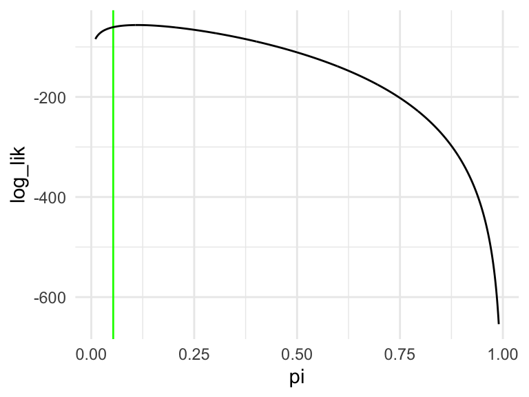

---
output:
  pdf_document: default
  html_document: default
---


As I see it, "regression modeling" in political science is a several-step process:

You begin with a substantive understanding of the way the world works.

1. Choose a regression model. I introduce many.
1. Fit a regression model. Maximum likelihood and Markov chain Monte Carlo methods are powerful and general.
1. Evaluate the fit. What are the properties of the procedure? How well does the model match the data?
1. Interpret the model. I emphasize quantities of interest and confidence intervals, but also discuss hypothesis tests.

You then update your understanding of the world.

This week, I introduce our first "engine": maximum likelihood. As a starting point, we use ML to estimate the parameters of Bernoulli, Poisson, and beta distributions (without covariates). I introduce the parametric bootstrap as a tool to obtain confidence intervals. I introduce the invariance property and show how we can use the invariance property to transform the estimated parameters into other quantities of interest. To evaluate the models, we use the predictive distribution.

## Maximum Likelihood

Suppose we have a random sample from a distribution $f(x; \theta)$. We find the maximum likelihood (ML) estimator $\hat{\theta}$ of $\theta$ by maximizing the likelihood of the observed data with respect to $\theta$.

In short, we take the likelihood of the data (given the model and a particular $\theta$) and find the parameter $\theta$ that maximizes it. 

In practice, to make the math and/or computation a bit easier, we manipulate the likelihood function in two ways:

1. Relabel the likelihood function $f(x; \theta) = L(\theta)$, since it's weird to maximize with respect to a "conditioning variable"fixed" variable. (The notation $f(x; \theta)$ suggests $x$ varies for a particular $\theta$.)
1. Work with $\log L(\theta)$ rather than $L(\theta)$. Because $\log()$ is a monotonically increasing function, the $\theta$ that maximizes $L(\theta)$ also maximizes $\log L(\theta)$. 

Suppose we have samples $x_1, x_2, ..., x_N$ from $f(x; \theta)$. Then the joint density/probability is $f(x; \theta) = \prod_{n = 1}^N f(x_n; \theta)$ and $\log L(\theta) = \sum_{n = 1}^N \log \left[ f(x_n; \theta) \right]$. The ML estimator $\hat{\theta}$ of $\theta$ is $\arg \max \log L(\theta)$.

In applied problems, we might be able to simplify $\log L$ substantially. Occasionally, we can find a nice analytical maximum. In many cases, we have a computer find the parameter that maximizes $\log L$.

### Example: Bernoulli Distribution

As a running example, we use the **toothpaste cap problem**:

> We have a toothpaste cap--one with a wide bottom and a narrow top. We're going to toss the toothpaste cap. It can either end up lying on its side, its (wide) bottom, or its (narrow) top. 

> We want to estimate the probability of the toothpaste cap landing on its top.

> We can model each toss as a Bernoulli trial, thinking of each toss as a random variable $X$ where $X \sim \text{Bernoulli}(\pi)$. If the cap lands on its top, we think of the outcome as 1. If not, as 0. 

Suppose we toss the cap $N$ times and observe $k$ tops. What is the ML estimate $\hat{\pi}$ of $\pi$?

According to the model $f(x_i; \pi) = \pi^{x_i} (1 - \pi)^{(1 - x_i)}$. Because the samples are iid, we can find the *joint* distribution $f(x) = f(x_1) \times ... \times f(x_N) = \prod_{i = 1}^N f(x_i)$. We're just multiplying $k$ $\pi$s (i.e., each of the $k$ ones has probability $\pi$) and $(N - k)$ $(1 - \pi)$s (i.e., each of the $N - k$ zeros has probability $1 - \pi$), so that the $f(x; \pi) = \pi^{k} (1 - \pi)^{(N - k)}$.
$$
\text{the likelihood:  } f(x; \pi) =  \pi^{k} (1 - \pi)^{(N - k)}, \text{where } k = \sum_{n = 1}^N x_n \\
$$
Then, we relabel. 
$$
\text{the likelihood:  } L(\pi) = \pi^{k} (1 - \pi)^{(N - k)}\\
$$
Then, we take the log and simplify. 
$$
\text{the log-likelihood:  } \log L(\pi) = k \log (\pi) + (N - k) \log(1 - \pi)\\
$$
To find the ML estimator, we find $\hat{\pi}$ that maximizes $\log L$. 

The code below plots the log-likelihood function using the 8/150 data.


```r
pi <- seq(0.01, 0.99, length.out = 1000)
data <- tibble(pi = pi) %>%
  mutate(log_lik = 18*log(pi) + (150 - 8)*log(1 - pi))
ggplot(data, aes(x = pi, y = log_lik)) + 
  geom_vline(xintercept = 8/150, color = "green") + 
  geom_line() + 
  theme_minimal()
```



In this case, the analytical optimum is easy.

$$
\begin{aligned}
\frac{d \log L}{d\hat{\pi}} = k \left( \frac{1}{\hat{\pi}}\right) + (N - k) \left( \frac{1}{1 - \hat{\pi}}\right)(-1) &= 0\\
\frac{k}{\hat{\pi}} - \frac{N - y}{1 - \hat{\pi}} &= 0 \\
\frac{k}{\hat{\pi}} &= \frac{N - y}{1 - \hat{\pi}} \\
k(1 - \hat{\pi}) &= (N - y)\hat{\pi} \\
k - y\hat{\pi} &= N\hat{\pi} - y\hat{\pi} \\
k  &= N\hat{\pi} \\
\hat{\pi} &= \frac{k}{N} = \text{avg}(x)\\
\end{aligned}
$$
The ML estimator of $\pi$ is the average of the $N$ Bernoulli trials, or, equivalently, the fraction of successes. 

The collected data consist of 150 trials and 8 successes, so the ML estimate of $\pi$ is $\frac{8}{150} \approx 0.053$.

### Example: Poisson Distribution

Suppose we collect $N$ random samples $x = \{x_1, x_2, ..., x_N\}$ and model each draw as a random variable $X \sim \text{Poisson}(\lambda)$. Find the ML estimator of $\lambda$.

$$
\begin{aligned}
\text{Poisson likelihood: } f(x; \lambda) &= \prod_{n = 1}^N \frac{\lambda^{x_n} e^{-\lambda}}{x_n!} \\
L(\lambda) &= \prod_{n = 1}^N \frac{\lambda^{x_n} e^{-\lambda}}{x_n!} \\
\log L(\lambda) &= \sum_{n = 1}^N \log \left[ \frac{\lambda^{x_n} e^{-\lambda}}{x_n!} \right]\\
&= \sum_{n = 1}^N \left[ x_n \log \lambda + (-\lambda) \log e - \log x_n! \right]\\
&= \log \lambda \left[ \sum_{n = 1}^N x_n \right]  -N\lambda + \sum_{n = 1}^N \log (x_n!) \\
\end{aligned}
$$

To find the ML estimator, we find $\hat{\lambda}$ that maximizes $\log L$. In this case, the analytical optimum is easy.

$$
\begin{aligned}
\frac{d \log L}{d\hat{\lambda}} = \frac{1}{\hat{\lambda}} \left[ \sum_{n = 1}^N x_n \right] - N &= 0\\
\frac{1}{\hat{\lambda}} \left[ \sum_{n = 1}^N x_n \right] &= N \\
\left[ \sum_{n = 1}^N x_n \right] &= N \hat{\lambda} \\
\hat{\lambda} &= \frac{ \sum_{n = 1}^N x_n }{N} = \text{avg}(x)  \\
\end{aligned}
$$
The ML estimator for the Poisson distribution is just the average of the samples. 

### Remarks

The ML estimator is extremely common in political science because they are general, fast, and work extremely well. Lots of models that you've heard of, such as logistic regression, are estimated with ML.

We can even obtain ML estimates for the linear regression model. We assume that the observed data are samples from a normal distribution with mean $\mu_n = \alpha + \beta x_n$ and variance $\sigma^2$. For this model, the least-squares estimate that we learned earlier is also the ML estimate. 

### Example: Beta Distribution

Questions:

1.  What is the \textit{support} of the beta distribution? $[0, 1]$
1. Is $y$ a discrete random variable or a continuous random variable? Continuous.
1. What is the pdf/pmf? $f(y_i; \alpha, \beta) = \dfrac{y_i^{\alpha - 1}(1 - y_i)^{\beta - 1}}{B(\alpha, \beta)}$, where $B(\alpha, \beta) = \displaystyle \int_0^1 t^{\alpha - 1}(1 - t)^{\beta - 1}dt$.

With the beta distribution, we add two complications that typically occur when using ML.

1. multiple parameters
1. an intractable log-likelihood

Start with the probability model $Y_i \sim f(y_i; \theta)$. In the case of the beta model, we have $Y_i \sim \text{beta}(y_i; \alpha, \beta)$. The $\alpha$ and $\beta$ here don't have a convenient interpretation. They are "shape" parameters. You can think of $\alpha$ as pushing the distribution to the right and $\beta$ as pushing the distribution to the left.


```r
alphas <- c(0.8, 1, 2, 5, 25)
betas <- c(0.8, 1, 2, 5, 25)

x <- seq(0, 1, length.out = 100)

pdfs <- crossing(alpha = alphas, 
                 beta = betas, 
                 x = x) %>%
  mutate(pdf = dbeta(x, alpha, beta)) %>%
  mutate(alpha_lbl = paste0("alpha == ", alpha),
         beta_lbl = paste0("beta == ", beta)) 

ggplot(pdfs, aes(x = x, y = pdf)) + 
  facet_grid(rows = vars(beta_lbl), cols = vars(alpha_lbl), 
             labeller = "label_parsed", scales = "free") + 
  geom_line()
```


We now have two parameters to estimate and we're going to assume that we have multiple observations, so that $y = [y_1, y_2, ,..., y_n]$.

In general, this is how we do ML:

**Step 1** Write down the likelihood function. Recall that we can obtain the joint density of $y_1$ AND $y_2$ AND ... AND $y_n$ by multiplying the probabilities of each (assuming independence).
$$
\begin{aligned}
L(\alpha, \beta) = \displaystyle\prod_{i = 1}^n \overbrace{f(y_i;\alpha, \beta)}^{\text{density}} = \displaystyle\prod_{i = 1}^n \dfrac{y_i^{\alpha - 1}(1 - y_i)^{\beta - 1}}{B(\alpha, \beta)}
\end{aligned}
$$
We see again, as will be usual, that we have this complicated product that will make our lives difficult.

**Step 2** Take the log and simplify.
$$
\begin{aligned}
L(\alpha, \beta) &= \displaystyle\prod_{i = 1}^n \dfrac{y_i^{\alpha - 1}(1 - y_i)^{\beta - 1}}{B(\alpha, \beta)}\\
\log L(\alpha, \beta) &= \displaystyle\sum_{i = 1}^n \log \dfrac{y_i^{\alpha - 1}(1 - y_i)^{\beta - 1}}{B(\alpha, \beta)}\\
&= \displaystyle\sum_{i = 1}^n \left[ \log y_i^{\alpha - 1} + \log (1 - y_i)^{\beta - 1} - \log B(\alpha, \beta)\right]\\
&= \displaystyle\sum_{i = 1}^n \left[ (\alpha - 1)\log y_i + (\beta - 1)\log (1 - y_i) - \log B(\alpha, \beta)\right]\\
&= \displaystyle\sum_{i = 1}^n \left[ (\alpha - 1)\log y_i + (\beta - 1)\log (1 - y_i)\right] - n \log B(\alpha, \beta)\\
\log L(\alpha, \beta) &= (\alpha - 1) \sum_{i = 1}^n \log y_i + (\beta - 1) \sum_{i = 1}^n \log (1 - y_i) - n \log B(\alpha, \beta)
\end{aligned}
$$
**Step 3** Maximize

If we wanted, we could work on this one analytically. 

1. Take the derivative w.r.t. $\alpha$.
1. Take the derivative w.r.t. $\beta$.
1. Set both equal to zero and solve. (Two equations and two unknowns.)

But the last term $B(\alpha, \beta) = \int_0^1 t^{\alpha - 1}(1 - t)^{\beta - 1}dt$ is tricky! So let's do it numerically.

To perform the optimization, we need a data set. For now, let's simulate a fake data set with known parameters


```r
y <- rbeta(1000, shape1 = 10, shape2 = 10)
```

Let's plot the log-likelihood function to see what we're dealing with.


```r
library(plotly)

alpha <- seq(0.1, 25, length.out = 100)
beta  <- seq(0.1, 25, length.out = 100)
data <- crossing(alpha, beta) %>%
  mutate(log_lik = alpha*sum(log(y)) + beta*sum(log(1 - y)) - 
           length(y)*log(beta(alpha, beta)))

plot_ly(x = ~alpha, y = ~beta, z = ~log_lik, data = data) %>%
  add_mesh(labels = c("alpha", "beta", "log-likelihood"))
```

```{=html}
<div id="htmlwidget-563ba503d392518d01d9" style="width:672px;height:480px;" class="plotly html-widget"></div>
<script type="application/json" data-for="htmlwidget-563ba503d392518d01d9">{"x":{"visdat":{"16875338068e4":["function () ","plotlyVisDat"]},"cur_data":"16875338068e4","attrs":{"16875338068e4":{"x":{},"y":{},"z":{},"alpha_stroke":1,"sizes":[10,100],"spans":[1,20],"type":"mesh3d","labels":["alpha","beta","log-likelihood"],"inherit":true}},"layout":{"margin":{"b":40,"l":60,"t":25,"r":10},"scene":{"xaxis":{"title":"alpha"},"yaxis":{"title":"beta"},"zaxis":{"title":"log_lik"}},"hovermode":"closest","showlegend":false,"legend":{"yanchor":"top","y":0.5}},"source":"A","config":{"modeBarButtonsToAdd":["hoverclosest","hovercompare"],"showSendToCloud":false},"data":[{"colorbar":{"title":"log_lik","ticklen":2,"len":0.5,"lenmode":"fraction","y":1,"yanchor":"top"},"colorscale":[["0","rgba(68,1,84,1)"],["0.0416666666666667","rgba(70,19,97,1)"],["0.0833333333333333","rgba(72,32,111,1)"],["0.125","rgba(71,45,122,1)"],["0.166666666666667","rgba(68,58,128,1)"],["0.208333333333333","rgba(64,70,135,1)"],["0.25","rgba(60,82,138,1)"],["0.291666666666667","rgba(56,93,140,1)"],["0.333333333333333","rgba(49,104,142,1)"],["0.375","rgba(46,114,142,1)"],["0.416666666666667","rgba(42,123,142,1)"],["0.458333333333333","rgba(38,133,141,1)"],["0.5","rgba(37,144,140,1)"],["0.541666666666667","rgba(33,154,138,1)"],["0.583333333333333","rgba(39,164,133,1)"],["0.625","rgba(47,174,127,1)"],["0.666666666666667","rgba(53,183,121,1)"],["0.708333333333333","rgba(79,191,110,1)"],["0.75","rgba(98,199,98,1)"],["0.791666666666667","rgba(119,207,85,1)"],["0.833333333333333","rgba(147,214,70,1)"],["0.875","rgba(172,220,52,1)"],["0.916666666666667","rgba(199,225,42,1)"],["0.958333333333333","rgba(226,228,40,1)"],["1","rgba(253,231,37,1)"]],"showscale":true,"x":[0.1,0.1,0.1,0.1,0.1,0.1,0.1,0.1,0.1,0.1,0.1,0.1,0.1,0.1,0.1,0.1,0.1,0.1,0.1,0.1,0.1,0.1,0.1,0.1,0.1,0.1,0.1,0.1,0.1,0.1,0.1,0.1,0.1,0.1,0.1,0.1,0.1,0.1,0.1,0.1,0.1,0.1,0.1,0.1,0.1,0.1,0.1,0.1,0.1,0.1,0.1,0.1,0.1,0.1,0.1,0.1,0.1,0.1,0.1,0.1,0.1,0.1,0.1,0.1,0.1,0.1,0.1,0.1,0.1,0.1,0.1,0.1,0.1,0.1,0.1,0.1,0.1,0.1,0.1,0.1,0.1,0.1,0.1,0.1,0.1,0.1,0.1,0.1,0.1,0.1,0.1,0.1,0.1,0.1,0.1,0.1,0.1,0.1,0.1,0.1,0.351515151515152,0.351515151515152,0.351515151515152,0.351515151515152,0.351515151515152,0.351515151515152,0.351515151515152,0.351515151515152,0.351515151515152,0.351515151515152,0.351515151515152,0.351515151515152,0.351515151515152,0.351515151515152,0.351515151515152,0.351515151515152,0.351515151515152,0.351515151515152,0.351515151515152,0.351515151515152,0.351515151515152,0.351515151515152,0.351515151515152,0.351515151515152,0.351515151515152,0.351515151515152,0.351515151515152,0.351515151515152,0.351515151515152,0.351515151515152,0.351515151515152,0.351515151515152,0.351515151515152,0.351515151515152,0.351515151515152,0.351515151515152,0.351515151515152,0.351515151515152,0.351515151515152,0.351515151515152,0.351515151515152,0.351515151515152,0.351515151515152,0.351515151515152,0.351515151515152,0.351515151515152,0.351515151515152,0.351515151515152,0.351515151515152,0.351515151515152,0.351515151515152,0.351515151515152,0.351515151515152,0.351515151515152,0.351515151515152,0.351515151515152,0.351515151515152,0.351515151515152,0.351515151515152,0.351515151515152,0.351515151515152,0.351515151515152,0.351515151515152,0.351515151515152,0.351515151515152,0.351515151515152,0.351515151515152,0.351515151515152,0.351515151515152,0.351515151515152,0.351515151515152,0.351515151515152,0.351515151515152,0.351515151515152,0.351515151515152,0.351515151515152,0.351515151515152,0.351515151515152,0.351515151515152,0.351515151515152,0.351515151515152,0.351515151515152,0.351515151515152,0.351515151515152,0.351515151515152,0.351515151515152,0.351515151515152,0.351515151515152,0.351515151515152,0.351515151515152,0.351515151515152,0.351515151515152,0.351515151515152,0.351515151515152,0.351515151515152,0.351515151515152,0.351515151515152,0.351515151515152,0.351515151515152,0.351515151515152,0.603030303030303,0.603030303030303,0.603030303030303,0.603030303030303,0.603030303030303,0.603030303030303,0.603030303030303,0.603030303030303,0.603030303030303,0.603030303030303,0.603030303030303,0.603030303030303,0.603030303030303,0.603030303030303,0.603030303030303,0.603030303030303,0.603030303030303,0.603030303030303,0.603030303030303,0.603030303030303,0.603030303030303,0.603030303030303,0.603030303030303,0.603030303030303,0.603030303030303,0.603030303030303,0.603030303030303,0.603030303030303,0.603030303030303,0.603030303030303,0.603030303030303,0.603030303030303,0.603030303030303,0.603030303030303,0.603030303030303,0.603030303030303,0.603030303030303,0.603030303030303,0.603030303030303,0.603030303030303,0.603030303030303,0.603030303030303,0.603030303030303,0.603030303030303,0.603030303030303,0.603030303030303,0.603030303030303,0.603030303030303,0.603030303030303,0.603030303030303,0.603030303030303,0.603030303030303,0.603030303030303,0.603030303030303,0.603030303030303,0.603030303030303,0.603030303030303,0.603030303030303,0.603030303030303,0.603030303030303,0.603030303030303,0.603030303030303,0.603030303030303,0.603030303030303,0.603030303030303,0.603030303030303,0.603030303030303,0.603030303030303,0.603030303030303,0.603030303030303,0.603030303030303,0.603030303030303,0.603030303030303,0.603030303030303,0.603030303030303,0.603030303030303,0.603030303030303,0.603030303030303,0.603030303030303,0.603030303030303,0.603030303030303,0.603030303030303,0.603030303030303,0.603030303030303,0.603030303030303,0.603030303030303,0.603030303030303,0.603030303030303,0.603030303030303,0.603030303030303,0.603030303030303,0.603030303030303,0.603030303030303,0.603030303030303,0.603030303030303,0.603030303030303,0.603030303030303,0.603030303030303,0.603030303030303,0.603030303030303,0.854545454545455,0.854545454545455,0.854545454545455,0.854545454545455,0.854545454545455,0.854545454545455,0.854545454545455,0.854545454545455,0.854545454545455,0.854545454545455,0.854545454545455,0.854545454545455,0.854545454545455,0.854545454545455,0.854545454545455,0.854545454545455,0.854545454545455,0.854545454545455,0.854545454545455,0.854545454545455,0.854545454545455,0.854545454545455,0.854545454545455,0.854545454545455,0.854545454545455,0.854545454545455,0.854545454545455,0.854545454545455,0.854545454545455,0.854545454545455,0.854545454545455,0.854545454545455,0.854545454545455,0.854545454545455,0.854545454545455,0.854545454545455,0.854545454545455,0.854545454545455,0.854545454545455,0.854545454545455,0.854545454545455,0.854545454545455,0.854545454545455,0.854545454545455,0.854545454545455,0.854545454545455,0.854545454545455,0.854545454545455,0.854545454545455,0.854545454545455,0.854545454545455,0.854545454545455,0.854545454545455,0.854545454545455,0.854545454545455,0.854545454545455,0.854545454545455,0.854545454545455,0.854545454545455,0.854545454545455,0.854545454545455,0.854545454545455,0.854545454545455,0.854545454545455,0.854545454545455,0.854545454545455,0.854545454545455,0.854545454545455,0.854545454545455,0.854545454545455,0.854545454545455,0.854545454545455,0.854545454545455,0.854545454545455,0.854545454545455,0.854545454545455,0.854545454545455,0.854545454545455,0.854545454545455,0.854545454545455,0.854545454545455,0.854545454545455,0.854545454545455,0.854545454545455,0.854545454545455,0.854545454545455,0.854545454545455,0.854545454545455,0.854545454545455,0.854545454545455,0.854545454545455,0.854545454545455,0.854545454545455,0.854545454545455,0.854545454545455,0.854545454545455,0.854545454545455,0.854545454545455,0.854545454545455,0.854545454545455,1.10606060606061,1.10606060606061,1.10606060606061,1.10606060606061,1.10606060606061,1.10606060606061,1.10606060606061,1.10606060606061,1.10606060606061,1.10606060606061,1.10606060606061,1.10606060606061,1.10606060606061,1.10606060606061,1.10606060606061,1.10606060606061,1.10606060606061,1.10606060606061,1.10606060606061,1.10606060606061,1.10606060606061,1.10606060606061,1.10606060606061,1.10606060606061,1.10606060606061,1.10606060606061,1.10606060606061,1.10606060606061,1.10606060606061,1.10606060606061,1.10606060606061,1.10606060606061,1.10606060606061,1.10606060606061,1.10606060606061,1.10606060606061,1.10606060606061,1.10606060606061,1.10606060606061,1.10606060606061,1.10606060606061,1.10606060606061,1.10606060606061,1.10606060606061,1.10606060606061,1.10606060606061,1.10606060606061,1.10606060606061,1.10606060606061,1.10606060606061,1.10606060606061,1.10606060606061,1.10606060606061,1.10606060606061,1.10606060606061,1.10606060606061,1.10606060606061,1.10606060606061,1.10606060606061,1.10606060606061,1.10606060606061,1.10606060606061,1.10606060606061,1.10606060606061,1.10606060606061,1.10606060606061,1.10606060606061,1.10606060606061,1.10606060606061,1.10606060606061,1.10606060606061,1.10606060606061,1.10606060606061,1.10606060606061,1.10606060606061,1.10606060606061,1.10606060606061,1.10606060606061,1.10606060606061,1.10606060606061,1.10606060606061,1.10606060606061,1.10606060606061,1.10606060606061,1.10606060606061,1.10606060606061,1.10606060606061,1.10606060606061,1.10606060606061,1.10606060606061,1.10606060606061,1.10606060606061,1.10606060606061,1.10606060606061,1.10606060606061,1.10606060606061,1.10606060606061,1.10606060606061,1.10606060606061,1.10606060606061,1.35757575757576,1.35757575757576,1.35757575757576,1.35757575757576,1.35757575757576,1.35757575757576,1.35757575757576,1.35757575757576,1.35757575757576,1.35757575757576,1.35757575757576,1.35757575757576,1.35757575757576,1.35757575757576,1.35757575757576,1.35757575757576,1.35757575757576,1.35757575757576,1.35757575757576,1.35757575757576,1.35757575757576,1.35757575757576,1.35757575757576,1.35757575757576,1.35757575757576,1.35757575757576,1.35757575757576,1.35757575757576,1.35757575757576,1.35757575757576,1.35757575757576,1.35757575757576,1.35757575757576,1.35757575757576,1.35757575757576,1.35757575757576,1.35757575757576,1.35757575757576,1.35757575757576,1.35757575757576,1.35757575757576,1.35757575757576,1.35757575757576,1.35757575757576,1.35757575757576,1.35757575757576,1.35757575757576,1.35757575757576,1.35757575757576,1.35757575757576,1.35757575757576,1.35757575757576,1.35757575757576,1.35757575757576,1.35757575757576,1.35757575757576,1.35757575757576,1.35757575757576,1.35757575757576,1.35757575757576,1.35757575757576,1.35757575757576,1.35757575757576,1.35757575757576,1.35757575757576,1.35757575757576,1.35757575757576,1.35757575757576,1.35757575757576,1.35757575757576,1.35757575757576,1.35757575757576,1.35757575757576,1.35757575757576,1.35757575757576,1.35757575757576,1.35757575757576,1.35757575757576,1.35757575757576,1.35757575757576,1.35757575757576,1.35757575757576,1.35757575757576,1.35757575757576,1.35757575757576,1.35757575757576,1.35757575757576,1.35757575757576,1.35757575757576,1.35757575757576,1.35757575757576,1.35757575757576,1.35757575757576,1.35757575757576,1.35757575757576,1.35757575757576,1.35757575757576,1.35757575757576,1.35757575757576,1.35757575757576,1.60909090909091,1.60909090909091,1.60909090909091,1.60909090909091,1.60909090909091,1.60909090909091,1.60909090909091,1.60909090909091,1.60909090909091,1.60909090909091,1.60909090909091,1.60909090909091,1.60909090909091,1.60909090909091,1.60909090909091,1.60909090909091,1.60909090909091,1.60909090909091,1.60909090909091,1.60909090909091,1.60909090909091,1.60909090909091,1.60909090909091,1.60909090909091,1.60909090909091,1.60909090909091,1.60909090909091,1.60909090909091,1.60909090909091,1.60909090909091,1.60909090909091,1.60909090909091,1.60909090909091,1.60909090909091,1.60909090909091,1.60909090909091,1.60909090909091,1.60909090909091,1.60909090909091,1.60909090909091,1.60909090909091,1.60909090909091,1.60909090909091,1.60909090909091,1.60909090909091,1.60909090909091,1.60909090909091,1.60909090909091,1.60909090909091,1.60909090909091,1.60909090909091,1.60909090909091,1.60909090909091,1.60909090909091,1.60909090909091,1.60909090909091,1.60909090909091,1.60909090909091,1.60909090909091,1.60909090909091,1.60909090909091,1.60909090909091,1.60909090909091,1.60909090909091,1.60909090909091,1.60909090909091,1.60909090909091,1.60909090909091,1.60909090909091,1.60909090909091,1.60909090909091,1.60909090909091,1.60909090909091,1.60909090909091,1.60909090909091,1.60909090909091,1.60909090909091,1.60909090909091,1.60909090909091,1.60909090909091,1.60909090909091,1.60909090909091,1.60909090909091,1.60909090909091,1.60909090909091,1.60909090909091,1.60909090909091,1.60909090909091,1.60909090909091,1.60909090909091,1.60909090909091,1.60909090909091,1.60909090909091,1.60909090909091,1.60909090909091,1.60909090909091,1.60909090909091,1.60909090909091,1.60909090909091,1.60909090909091,1.86060606060606,1.86060606060606,1.86060606060606,1.86060606060606,1.86060606060606,1.86060606060606,1.86060606060606,1.86060606060606,1.86060606060606,1.86060606060606,1.86060606060606,1.86060606060606,1.86060606060606,1.86060606060606,1.86060606060606,1.86060606060606,1.86060606060606,1.86060606060606,1.86060606060606,1.86060606060606,1.86060606060606,1.86060606060606,1.86060606060606,1.86060606060606,1.86060606060606,1.86060606060606,1.86060606060606,1.86060606060606,1.86060606060606,1.86060606060606,1.86060606060606,1.86060606060606,1.86060606060606,1.86060606060606,1.86060606060606,1.86060606060606,1.86060606060606,1.86060606060606,1.86060606060606,1.86060606060606,1.86060606060606,1.86060606060606,1.86060606060606,1.86060606060606,1.86060606060606,1.86060606060606,1.86060606060606,1.86060606060606,1.86060606060606,1.86060606060606,1.86060606060606,1.86060606060606,1.86060606060606,1.86060606060606,1.86060606060606,1.86060606060606,1.86060606060606,1.86060606060606,1.86060606060606,1.86060606060606,1.86060606060606,1.86060606060606,1.86060606060606,1.86060606060606,1.86060606060606,1.86060606060606,1.86060606060606,1.86060606060606,1.86060606060606,1.86060606060606,1.86060606060606,1.86060606060606,1.86060606060606,1.86060606060606,1.86060606060606,1.86060606060606,1.86060606060606,1.86060606060606,1.86060606060606,1.86060606060606,1.86060606060606,1.86060606060606,1.86060606060606,1.86060606060606,1.86060606060606,1.86060606060606,1.86060606060606,1.86060606060606,1.86060606060606,1.86060606060606,1.86060606060606,1.86060606060606,1.86060606060606,1.86060606060606,1.86060606060606,1.86060606060606,1.86060606060606,1.86060606060606,1.86060606060606,1.86060606060606,2.11212121212121,2.11212121212121,2.11212121212121,2.11212121212121,2.11212121212121,2.11212121212121,2.11212121212121,2.11212121212121,2.11212121212121,2.11212121212121,2.11212121212121,2.11212121212121,2.11212121212121,2.11212121212121,2.11212121212121,2.11212121212121,2.11212121212121,2.11212121212121,2.11212121212121,2.11212121212121,2.11212121212121,2.11212121212121,2.11212121212121,2.11212121212121,2.11212121212121,2.11212121212121,2.11212121212121,2.11212121212121,2.11212121212121,2.11212121212121,2.11212121212121,2.11212121212121,2.11212121212121,2.11212121212121,2.11212121212121,2.11212121212121,2.11212121212121,2.11212121212121,2.11212121212121,2.11212121212121,2.11212121212121,2.11212121212121,2.11212121212121,2.11212121212121,2.11212121212121,2.11212121212121,2.11212121212121,2.11212121212121,2.11212121212121,2.11212121212121,2.11212121212121,2.11212121212121,2.11212121212121,2.11212121212121,2.11212121212121,2.11212121212121,2.11212121212121,2.11212121212121,2.11212121212121,2.11212121212121,2.11212121212121,2.11212121212121,2.11212121212121,2.11212121212121,2.11212121212121,2.11212121212121,2.11212121212121,2.11212121212121,2.11212121212121,2.11212121212121,2.11212121212121,2.11212121212121,2.11212121212121,2.11212121212121,2.11212121212121,2.11212121212121,2.11212121212121,2.11212121212121,2.11212121212121,2.11212121212121,2.11212121212121,2.11212121212121,2.11212121212121,2.11212121212121,2.11212121212121,2.11212121212121,2.11212121212121,2.11212121212121,2.11212121212121,2.11212121212121,2.11212121212121,2.11212121212121,2.11212121212121,2.11212121212121,2.11212121212121,2.11212121212121,2.11212121212121,2.11212121212121,2.11212121212121,2.11212121212121,2.36363636363636,2.36363636363636,2.36363636363636,2.36363636363636,2.36363636363636,2.36363636363636,2.36363636363636,2.36363636363636,2.36363636363636,2.36363636363636,2.36363636363636,2.36363636363636,2.36363636363636,2.36363636363636,2.36363636363636,2.36363636363636,2.36363636363636,2.36363636363636,2.36363636363636,2.36363636363636,2.36363636363636,2.36363636363636,2.36363636363636,2.36363636363636,2.36363636363636,2.36363636363636,2.36363636363636,2.36363636363636,2.36363636363636,2.36363636363636,2.36363636363636,2.36363636363636,2.36363636363636,2.36363636363636,2.36363636363636,2.36363636363636,2.36363636363636,2.36363636363636,2.36363636363636,2.36363636363636,2.36363636363636,2.36363636363636,2.36363636363636,2.36363636363636,2.36363636363636,2.36363636363636,2.36363636363636,2.36363636363636,2.36363636363636,2.36363636363636,2.36363636363636,2.36363636363636,2.36363636363636,2.36363636363636,2.36363636363636,2.36363636363636,2.36363636363636,2.36363636363636,2.36363636363636,2.36363636363636,2.36363636363636,2.36363636363636,2.36363636363636,2.36363636363636,2.36363636363636,2.36363636363636,2.36363636363636,2.36363636363636,2.36363636363636,2.36363636363636,2.36363636363636,2.36363636363636,2.36363636363636,2.36363636363636,2.36363636363636,2.36363636363636,2.36363636363636,2.36363636363636,2.36363636363636,2.36363636363636,2.36363636363636,2.36363636363636,2.36363636363636,2.36363636363636,2.36363636363636,2.36363636363636,2.36363636363636,2.36363636363636,2.36363636363636,2.36363636363636,2.36363636363636,2.36363636363636,2.36363636363636,2.36363636363636,2.36363636363636,2.36363636363636,2.36363636363636,2.36363636363636,2.36363636363636,2.36363636363636,2.61515151515152,2.61515151515152,2.61515151515152,2.61515151515152,2.61515151515152,2.61515151515152,2.61515151515152,2.61515151515152,2.61515151515152,2.61515151515152,2.61515151515152,2.61515151515152,2.61515151515152,2.61515151515152,2.61515151515152,2.61515151515152,2.61515151515152,2.61515151515152,2.61515151515152,2.61515151515152,2.61515151515152,2.61515151515152,2.61515151515152,2.61515151515152,2.61515151515152,2.61515151515152,2.61515151515152,2.61515151515152,2.61515151515152,2.61515151515152,2.61515151515152,2.61515151515152,2.61515151515152,2.61515151515152,2.61515151515152,2.61515151515152,2.61515151515152,2.61515151515152,2.61515151515152,2.61515151515152,2.61515151515152,2.61515151515152,2.61515151515152,2.61515151515152,2.61515151515152,2.61515151515152,2.61515151515152,2.61515151515152,2.61515151515152,2.61515151515152,2.61515151515152,2.61515151515152,2.61515151515152,2.61515151515152,2.61515151515152,2.61515151515152,2.61515151515152,2.61515151515152,2.61515151515152,2.61515151515152,2.61515151515152,2.61515151515152,2.61515151515152,2.61515151515152,2.61515151515152,2.61515151515152,2.61515151515152,2.61515151515152,2.61515151515152,2.61515151515152,2.61515151515152,2.61515151515152,2.61515151515152,2.61515151515152,2.61515151515152,2.61515151515152,2.61515151515152,2.61515151515152,2.61515151515152,2.61515151515152,2.61515151515152,2.61515151515152,2.61515151515152,2.61515151515152,2.61515151515152,2.61515151515152,2.61515151515152,2.61515151515152,2.61515151515152,2.61515151515152,2.61515151515152,2.61515151515152,2.61515151515152,2.61515151515152,2.61515151515152,2.61515151515152,2.61515151515152,2.61515151515152,2.61515151515152,2.61515151515152,2.86666666666667,2.86666666666667,2.86666666666667,2.86666666666667,2.86666666666667,2.86666666666667,2.86666666666667,2.86666666666667,2.86666666666667,2.86666666666667,2.86666666666667,2.86666666666667,2.86666666666667,2.86666666666667,2.86666666666667,2.86666666666667,2.86666666666667,2.86666666666667,2.86666666666667,2.86666666666667,2.86666666666667,2.86666666666667,2.86666666666667,2.86666666666667,2.86666666666667,2.86666666666667,2.86666666666667,2.86666666666667,2.86666666666667,2.86666666666667,2.86666666666667,2.86666666666667,2.86666666666667,2.86666666666667,2.86666666666667,2.86666666666667,2.86666666666667,2.86666666666667,2.86666666666667,2.86666666666667,2.86666666666667,2.86666666666667,2.86666666666667,2.86666666666667,2.86666666666667,2.86666666666667,2.86666666666667,2.86666666666667,2.86666666666667,2.86666666666667,2.86666666666667,2.86666666666667,2.86666666666667,2.86666666666667,2.86666666666667,2.86666666666667,2.86666666666667,2.86666666666667,2.86666666666667,2.86666666666667,2.86666666666667,2.86666666666667,2.86666666666667,2.86666666666667,2.86666666666667,2.86666666666667,2.86666666666667,2.86666666666667,2.86666666666667,2.86666666666667,2.86666666666667,2.86666666666667,2.86666666666667,2.86666666666667,2.86666666666667,2.86666666666667,2.86666666666667,2.86666666666667,2.86666666666667,2.86666666666667,2.86666666666667,2.86666666666667,2.86666666666667,2.86666666666667,2.86666666666667,2.86666666666667,2.86666666666667,2.86666666666667,2.86666666666667,2.86666666666667,2.86666666666667,2.86666666666667,2.86666666666667,2.86666666666667,2.86666666666667,2.86666666666667,2.86666666666667,2.86666666666667,2.86666666666667,2.86666666666667,3.11818181818182,3.11818181818182,3.11818181818182,3.11818181818182,3.11818181818182,3.11818181818182,3.11818181818182,3.11818181818182,3.11818181818182,3.11818181818182,3.11818181818182,3.11818181818182,3.11818181818182,3.11818181818182,3.11818181818182,3.11818181818182,3.11818181818182,3.11818181818182,3.11818181818182,3.11818181818182,3.11818181818182,3.11818181818182,3.11818181818182,3.11818181818182,3.11818181818182,3.11818181818182,3.11818181818182,3.11818181818182,3.11818181818182,3.11818181818182,3.11818181818182,3.11818181818182,3.11818181818182,3.11818181818182,3.11818181818182,3.11818181818182,3.11818181818182,3.11818181818182,3.11818181818182,3.11818181818182,3.11818181818182,3.11818181818182,3.11818181818182,3.11818181818182,3.11818181818182,3.11818181818182,3.11818181818182,3.11818181818182,3.11818181818182,3.11818181818182,3.11818181818182,3.11818181818182,3.11818181818182,3.11818181818182,3.11818181818182,3.11818181818182,3.11818181818182,3.11818181818182,3.11818181818182,3.11818181818182,3.11818181818182,3.11818181818182,3.11818181818182,3.11818181818182,3.11818181818182,3.11818181818182,3.11818181818182,3.11818181818182,3.11818181818182,3.11818181818182,3.11818181818182,3.11818181818182,3.11818181818182,3.11818181818182,3.11818181818182,3.11818181818182,3.11818181818182,3.11818181818182,3.11818181818182,3.11818181818182,3.11818181818182,3.11818181818182,3.11818181818182,3.11818181818182,3.11818181818182,3.11818181818182,3.11818181818182,3.11818181818182,3.11818181818182,3.11818181818182,3.11818181818182,3.11818181818182,3.11818181818182,3.11818181818182,3.11818181818182,3.11818181818182,3.11818181818182,3.11818181818182,3.11818181818182,3.11818181818182,3.36969696969697,3.36969696969697,3.36969696969697,3.36969696969697,3.36969696969697,3.36969696969697,3.36969696969697,3.36969696969697,3.36969696969697,3.36969696969697,3.36969696969697,3.36969696969697,3.36969696969697,3.36969696969697,3.36969696969697,3.36969696969697,3.36969696969697,3.36969696969697,3.36969696969697,3.36969696969697,3.36969696969697,3.36969696969697,3.36969696969697,3.36969696969697,3.36969696969697,3.36969696969697,3.36969696969697,3.36969696969697,3.36969696969697,3.36969696969697,3.36969696969697,3.36969696969697,3.36969696969697,3.36969696969697,3.36969696969697,3.36969696969697,3.36969696969697,3.36969696969697,3.36969696969697,3.36969696969697,3.36969696969697,3.36969696969697,3.36969696969697,3.36969696969697,3.36969696969697,3.36969696969697,3.36969696969697,3.36969696969697,3.36969696969697,3.36969696969697,3.36969696969697,3.36969696969697,3.36969696969697,3.36969696969697,3.36969696969697,3.36969696969697,3.36969696969697,3.36969696969697,3.36969696969697,3.36969696969697,3.36969696969697,3.36969696969697,3.36969696969697,3.36969696969697,3.36969696969697,3.36969696969697,3.36969696969697,3.36969696969697,3.36969696969697,3.36969696969697,3.36969696969697,3.36969696969697,3.36969696969697,3.36969696969697,3.36969696969697,3.36969696969697,3.36969696969697,3.36969696969697,3.36969696969697,3.36969696969697,3.36969696969697,3.36969696969697,3.36969696969697,3.36969696969697,3.36969696969697,3.36969696969697,3.36969696969697,3.36969696969697,3.36969696969697,3.36969696969697,3.36969696969697,3.36969696969697,3.36969696969697,3.36969696969697,3.36969696969697,3.36969696969697,3.36969696969697,3.36969696969697,3.36969696969697,3.36969696969697,3.62121212121212,3.62121212121212,3.62121212121212,3.62121212121212,3.62121212121212,3.62121212121212,3.62121212121212,3.62121212121212,3.62121212121212,3.62121212121212,3.62121212121212,3.62121212121212,3.62121212121212,3.62121212121212,3.62121212121212,3.62121212121212,3.62121212121212,3.62121212121212,3.62121212121212,3.62121212121212,3.62121212121212,3.62121212121212,3.62121212121212,3.62121212121212,3.62121212121212,3.62121212121212,3.62121212121212,3.62121212121212,3.62121212121212,3.62121212121212,3.62121212121212,3.62121212121212,3.62121212121212,3.62121212121212,3.62121212121212,3.62121212121212,3.62121212121212,3.62121212121212,3.62121212121212,3.62121212121212,3.62121212121212,3.62121212121212,3.62121212121212,3.62121212121212,3.62121212121212,3.62121212121212,3.62121212121212,3.62121212121212,3.62121212121212,3.62121212121212,3.62121212121212,3.62121212121212,3.62121212121212,3.62121212121212,3.62121212121212,3.62121212121212,3.62121212121212,3.62121212121212,3.62121212121212,3.62121212121212,3.62121212121212,3.62121212121212,3.62121212121212,3.62121212121212,3.62121212121212,3.62121212121212,3.62121212121212,3.62121212121212,3.62121212121212,3.62121212121212,3.62121212121212,3.62121212121212,3.62121212121212,3.62121212121212,3.62121212121212,3.62121212121212,3.62121212121212,3.62121212121212,3.62121212121212,3.62121212121212,3.62121212121212,3.62121212121212,3.62121212121212,3.62121212121212,3.62121212121212,3.62121212121212,3.62121212121212,3.62121212121212,3.62121212121212,3.62121212121212,3.62121212121212,3.62121212121212,3.62121212121212,3.62121212121212,3.62121212121212,3.62121212121212,3.62121212121212,3.62121212121212,3.62121212121212,3.62121212121212,3.87272727272727,3.87272727272727,3.87272727272727,3.87272727272727,3.87272727272727,3.87272727272727,3.87272727272727,3.87272727272727,3.87272727272727,3.87272727272727,3.87272727272727,3.87272727272727,3.87272727272727,3.87272727272727,3.87272727272727,3.87272727272727,3.87272727272727,3.87272727272727,3.87272727272727,3.87272727272727,3.87272727272727,3.87272727272727,3.87272727272727,3.87272727272727,3.87272727272727,3.87272727272727,3.87272727272727,3.87272727272727,3.87272727272727,3.87272727272727,3.87272727272727,3.87272727272727,3.87272727272727,3.87272727272727,3.87272727272727,3.87272727272727,3.87272727272727,3.87272727272727,3.87272727272727,3.87272727272727,3.87272727272727,3.87272727272727,3.87272727272727,3.87272727272727,3.87272727272727,3.87272727272727,3.87272727272727,3.87272727272727,3.87272727272727,3.87272727272727,3.87272727272727,3.87272727272727,3.87272727272727,3.87272727272727,3.87272727272727,3.87272727272727,3.87272727272727,3.87272727272727,3.87272727272727,3.87272727272727,3.87272727272727,3.87272727272727,3.87272727272727,3.87272727272727,3.87272727272727,3.87272727272727,3.87272727272727,3.87272727272727,3.87272727272727,3.87272727272727,3.87272727272727,3.87272727272727,3.87272727272727,3.87272727272727,3.87272727272727,3.87272727272727,3.87272727272727,3.87272727272727,3.87272727272727,3.87272727272727,3.87272727272727,3.87272727272727,3.87272727272727,3.87272727272727,3.87272727272727,3.87272727272727,3.87272727272727,3.87272727272727,3.87272727272727,3.87272727272727,3.87272727272727,3.87272727272727,3.87272727272727,3.87272727272727,3.87272727272727,3.87272727272727,3.87272727272727,3.87272727272727,3.87272727272727,3.87272727272727,4.12424242424242,4.12424242424242,4.12424242424242,4.12424242424242,4.12424242424242,4.12424242424242,4.12424242424242,4.12424242424242,4.12424242424242,4.12424242424242,4.12424242424242,4.12424242424242,4.12424242424242,4.12424242424242,4.12424242424242,4.12424242424242,4.12424242424242,4.12424242424242,4.12424242424242,4.12424242424242,4.12424242424242,4.12424242424242,4.12424242424242,4.12424242424242,4.12424242424242,4.12424242424242,4.12424242424242,4.12424242424242,4.12424242424242,4.12424242424242,4.12424242424242,4.12424242424242,4.12424242424242,4.12424242424242,4.12424242424242,4.12424242424242,4.12424242424242,4.12424242424242,4.12424242424242,4.12424242424242,4.12424242424242,4.12424242424242,4.12424242424242,4.12424242424242,4.12424242424242,4.12424242424242,4.12424242424242,4.12424242424242,4.12424242424242,4.12424242424242,4.12424242424242,4.12424242424242,4.12424242424242,4.12424242424242,4.12424242424242,4.12424242424242,4.12424242424242,4.12424242424242,4.12424242424242,4.12424242424242,4.12424242424242,4.12424242424242,4.12424242424242,4.12424242424242,4.12424242424242,4.12424242424242,4.12424242424242,4.12424242424242,4.12424242424242,4.12424242424242,4.12424242424242,4.12424242424242,4.12424242424242,4.12424242424242,4.12424242424242,4.12424242424242,4.12424242424242,4.12424242424242,4.12424242424242,4.12424242424242,4.12424242424242,4.12424242424242,4.12424242424242,4.12424242424242,4.12424242424242,4.12424242424242,4.12424242424242,4.12424242424242,4.12424242424242,4.12424242424242,4.12424242424242,4.12424242424242,4.12424242424242,4.12424242424242,4.12424242424242,4.12424242424242,4.12424242424242,4.12424242424242,4.12424242424242,4.12424242424242,4.37575757575758,4.37575757575758,4.37575757575758,4.37575757575758,4.37575757575758,4.37575757575758,4.37575757575758,4.37575757575758,4.37575757575758,4.37575757575758,4.37575757575758,4.37575757575758,4.37575757575758,4.37575757575758,4.37575757575758,4.37575757575758,4.37575757575758,4.37575757575758,4.37575757575758,4.37575757575758,4.37575757575758,4.37575757575758,4.37575757575758,4.37575757575758,4.37575757575758,4.37575757575758,4.37575757575758,4.37575757575758,4.37575757575758,4.37575757575758,4.37575757575758,4.37575757575758,4.37575757575758,4.37575757575758,4.37575757575758,4.37575757575758,4.37575757575758,4.37575757575758,4.37575757575758,4.37575757575758,4.37575757575758,4.37575757575758,4.37575757575758,4.37575757575758,4.37575757575758,4.37575757575758,4.37575757575758,4.37575757575758,4.37575757575758,4.37575757575758,4.37575757575758,4.37575757575758,4.37575757575758,4.37575757575758,4.37575757575758,4.37575757575758,4.37575757575758,4.37575757575758,4.37575757575758,4.37575757575758,4.37575757575758,4.37575757575758,4.37575757575758,4.37575757575758,4.37575757575758,4.37575757575758,4.37575757575758,4.37575757575758,4.37575757575758,4.37575757575758,4.37575757575758,4.37575757575758,4.37575757575758,4.37575757575758,4.37575757575758,4.37575757575758,4.37575757575758,4.37575757575758,4.37575757575758,4.37575757575758,4.37575757575758,4.37575757575758,4.37575757575758,4.37575757575758,4.37575757575758,4.37575757575758,4.37575757575758,4.37575757575758,4.37575757575758,4.37575757575758,4.37575757575758,4.37575757575758,4.37575757575758,4.37575757575758,4.37575757575758,4.37575757575758,4.37575757575758,4.37575757575758,4.37575757575758,4.37575757575758,4.62727272727273,4.62727272727273,4.62727272727273,4.62727272727273,4.62727272727273,4.62727272727273,4.62727272727273,4.62727272727273,4.62727272727273,4.62727272727273,4.62727272727273,4.62727272727273,4.62727272727273,4.62727272727273,4.62727272727273,4.62727272727273,4.62727272727273,4.62727272727273,4.62727272727273,4.62727272727273,4.62727272727273,4.62727272727273,4.62727272727273,4.62727272727273,4.62727272727273,4.62727272727273,4.62727272727273,4.62727272727273,4.62727272727273,4.62727272727273,4.62727272727273,4.62727272727273,4.62727272727273,4.62727272727273,4.62727272727273,4.62727272727273,4.62727272727273,4.62727272727273,4.62727272727273,4.62727272727273,4.62727272727273,4.62727272727273,4.62727272727273,4.62727272727273,4.62727272727273,4.62727272727273,4.62727272727273,4.62727272727273,4.62727272727273,4.62727272727273,4.62727272727273,4.62727272727273,4.62727272727273,4.62727272727273,4.62727272727273,4.62727272727273,4.62727272727273,4.62727272727273,4.62727272727273,4.62727272727273,4.62727272727273,4.62727272727273,4.62727272727273,4.62727272727273,4.62727272727273,4.62727272727273,4.62727272727273,4.62727272727273,4.62727272727273,4.62727272727273,4.62727272727273,4.62727272727273,4.62727272727273,4.62727272727273,4.62727272727273,4.62727272727273,4.62727272727273,4.62727272727273,4.62727272727273,4.62727272727273,4.62727272727273,4.62727272727273,4.62727272727273,4.62727272727273,4.62727272727273,4.62727272727273,4.62727272727273,4.62727272727273,4.62727272727273,4.62727272727273,4.62727272727273,4.62727272727273,4.62727272727273,4.62727272727273,4.62727272727273,4.62727272727273,4.62727272727273,4.62727272727273,4.62727272727273,4.62727272727273,4.87878787878788,4.87878787878788,4.87878787878788,4.87878787878788,4.87878787878788,4.87878787878788,4.87878787878788,4.87878787878788,4.87878787878788,4.87878787878788,4.87878787878788,4.87878787878788,4.87878787878788,4.87878787878788,4.87878787878788,4.87878787878788,4.87878787878788,4.87878787878788,4.87878787878788,4.87878787878788,4.87878787878788,4.87878787878788,4.87878787878788,4.87878787878788,4.87878787878788,4.87878787878788,4.87878787878788,4.87878787878788,4.87878787878788,4.87878787878788,4.87878787878788,4.87878787878788,4.87878787878788,4.87878787878788,4.87878787878788,4.87878787878788,4.87878787878788,4.87878787878788,4.87878787878788,4.87878787878788,4.87878787878788,4.87878787878788,4.87878787878788,4.87878787878788,4.87878787878788,4.87878787878788,4.87878787878788,4.87878787878788,4.87878787878788,4.87878787878788,4.87878787878788,4.87878787878788,4.87878787878788,4.87878787878788,4.87878787878788,4.87878787878788,4.87878787878788,4.87878787878788,4.87878787878788,4.87878787878788,4.87878787878788,4.87878787878788,4.87878787878788,4.87878787878788,4.87878787878788,4.87878787878788,4.87878787878788,4.87878787878788,4.87878787878788,4.87878787878788,4.87878787878788,4.87878787878788,4.87878787878788,4.87878787878788,4.87878787878788,4.87878787878788,4.87878787878788,4.87878787878788,4.87878787878788,4.87878787878788,4.87878787878788,4.87878787878788,4.87878787878788,4.87878787878788,4.87878787878788,4.87878787878788,4.87878787878788,4.87878787878788,4.87878787878788,4.87878787878788,4.87878787878788,4.87878787878788,4.87878787878788,4.87878787878788,4.87878787878788,4.87878787878788,4.87878787878788,4.87878787878788,4.87878787878788,4.87878787878788,5.13030303030303,5.13030303030303,5.13030303030303,5.13030303030303,5.13030303030303,5.13030303030303,5.13030303030303,5.13030303030303,5.13030303030303,5.13030303030303,5.13030303030303,5.13030303030303,5.13030303030303,5.13030303030303,5.13030303030303,5.13030303030303,5.13030303030303,5.13030303030303,5.13030303030303,5.13030303030303,5.13030303030303,5.13030303030303,5.13030303030303,5.13030303030303,5.13030303030303,5.13030303030303,5.13030303030303,5.13030303030303,5.13030303030303,5.13030303030303,5.13030303030303,5.13030303030303,5.13030303030303,5.13030303030303,5.13030303030303,5.13030303030303,5.13030303030303,5.13030303030303,5.13030303030303,5.13030303030303,5.13030303030303,5.13030303030303,5.13030303030303,5.13030303030303,5.13030303030303,5.13030303030303,5.13030303030303,5.13030303030303,5.13030303030303,5.13030303030303,5.13030303030303,5.13030303030303,5.13030303030303,5.13030303030303,5.13030303030303,5.13030303030303,5.13030303030303,5.13030303030303,5.13030303030303,5.13030303030303,5.13030303030303,5.13030303030303,5.13030303030303,5.13030303030303,5.13030303030303,5.13030303030303,5.13030303030303,5.13030303030303,5.13030303030303,5.13030303030303,5.13030303030303,5.13030303030303,5.13030303030303,5.13030303030303,5.13030303030303,5.13030303030303,5.13030303030303,5.13030303030303,5.13030303030303,5.13030303030303,5.13030303030303,5.13030303030303,5.13030303030303,5.13030303030303,5.13030303030303,5.13030303030303,5.13030303030303,5.13030303030303,5.13030303030303,5.13030303030303,5.13030303030303,5.13030303030303,5.13030303030303,5.13030303030303,5.13030303030303,5.13030303030303,5.13030303030303,5.13030303030303,5.13030303030303,5.13030303030303,5.38181818181818,5.38181818181818,5.38181818181818,5.38181818181818,5.38181818181818,5.38181818181818,5.38181818181818,5.38181818181818,5.38181818181818,5.38181818181818,5.38181818181818,5.38181818181818,5.38181818181818,5.38181818181818,5.38181818181818,5.38181818181818,5.38181818181818,5.38181818181818,5.38181818181818,5.38181818181818,5.38181818181818,5.38181818181818,5.38181818181818,5.38181818181818,5.38181818181818,5.38181818181818,5.38181818181818,5.38181818181818,5.38181818181818,5.38181818181818,5.38181818181818,5.38181818181818,5.38181818181818,5.38181818181818,5.38181818181818,5.38181818181818,5.38181818181818,5.38181818181818,5.38181818181818,5.38181818181818,5.38181818181818,5.38181818181818,5.38181818181818,5.38181818181818,5.38181818181818,5.38181818181818,5.38181818181818,5.38181818181818,5.38181818181818,5.38181818181818,5.38181818181818,5.38181818181818,5.38181818181818,5.38181818181818,5.38181818181818,5.38181818181818,5.38181818181818,5.38181818181818,5.38181818181818,5.38181818181818,5.38181818181818,5.38181818181818,5.38181818181818,5.38181818181818,5.38181818181818,5.38181818181818,5.38181818181818,5.38181818181818,5.38181818181818,5.38181818181818,5.38181818181818,5.38181818181818,5.38181818181818,5.38181818181818,5.38181818181818,5.38181818181818,5.38181818181818,5.38181818181818,5.38181818181818,5.38181818181818,5.38181818181818,5.38181818181818,5.38181818181818,5.38181818181818,5.38181818181818,5.38181818181818,5.38181818181818,5.38181818181818,5.38181818181818,5.38181818181818,5.38181818181818,5.38181818181818,5.38181818181818,5.38181818181818,5.38181818181818,5.38181818181818,5.38181818181818,5.38181818181818,5.38181818181818,5.38181818181818,5.63333333333333,5.63333333333333,5.63333333333333,5.63333333333333,5.63333333333333,5.63333333333333,5.63333333333333,5.63333333333333,5.63333333333333,5.63333333333333,5.63333333333333,5.63333333333333,5.63333333333333,5.63333333333333,5.63333333333333,5.63333333333333,5.63333333333333,5.63333333333333,5.63333333333333,5.63333333333333,5.63333333333333,5.63333333333333,5.63333333333333,5.63333333333333,5.63333333333333,5.63333333333333,5.63333333333333,5.63333333333333,5.63333333333333,5.63333333333333,5.63333333333333,5.63333333333333,5.63333333333333,5.63333333333333,5.63333333333333,5.63333333333333,5.63333333333333,5.63333333333333,5.63333333333333,5.63333333333333,5.63333333333333,5.63333333333333,5.63333333333333,5.63333333333333,5.63333333333333,5.63333333333333,5.63333333333333,5.63333333333333,5.63333333333333,5.63333333333333,5.63333333333333,5.63333333333333,5.63333333333333,5.63333333333333,5.63333333333333,5.63333333333333,5.63333333333333,5.63333333333333,5.63333333333333,5.63333333333333,5.63333333333333,5.63333333333333,5.63333333333333,5.63333333333333,5.63333333333333,5.63333333333333,5.63333333333333,5.63333333333333,5.63333333333333,5.63333333333333,5.63333333333333,5.63333333333333,5.63333333333333,5.63333333333333,5.63333333333333,5.63333333333333,5.63333333333333,5.63333333333333,5.63333333333333,5.63333333333333,5.63333333333333,5.63333333333333,5.63333333333333,5.63333333333333,5.63333333333333,5.63333333333333,5.63333333333333,5.63333333333333,5.63333333333333,5.63333333333333,5.63333333333333,5.63333333333333,5.63333333333333,5.63333333333333,5.63333333333333,5.63333333333333,5.63333333333333,5.63333333333333,5.63333333333333,5.63333333333333,5.88484848484848,5.88484848484848,5.88484848484848,5.88484848484848,5.88484848484848,5.88484848484848,5.88484848484848,5.88484848484848,5.88484848484848,5.88484848484848,5.88484848484848,5.88484848484848,5.88484848484848,5.88484848484848,5.88484848484848,5.88484848484848,5.88484848484848,5.88484848484848,5.88484848484848,5.88484848484848,5.88484848484848,5.88484848484848,5.88484848484848,5.88484848484848,5.88484848484848,5.88484848484848,5.88484848484848,5.88484848484848,5.88484848484848,5.88484848484848,5.88484848484848,5.88484848484848,5.88484848484848,5.88484848484848,5.88484848484848,5.88484848484848,5.88484848484848,5.88484848484848,5.88484848484848,5.88484848484848,5.88484848484848,5.88484848484848,5.88484848484848,5.88484848484848,5.88484848484848,5.88484848484848,5.88484848484848,5.88484848484848,5.88484848484848,5.88484848484848,5.88484848484848,5.88484848484848,5.88484848484848,5.88484848484848,5.88484848484848,5.88484848484848,5.88484848484848,5.88484848484848,5.88484848484848,5.88484848484848,5.88484848484848,5.88484848484848,5.88484848484848,5.88484848484848,5.88484848484848,5.88484848484848,5.88484848484848,5.88484848484848,5.88484848484848,5.88484848484848,5.88484848484848,5.88484848484848,5.88484848484848,5.88484848484848,5.88484848484848,5.88484848484848,5.88484848484848,5.88484848484848,5.88484848484848,5.88484848484848,5.88484848484848,5.88484848484848,5.88484848484848,5.88484848484848,5.88484848484848,5.88484848484848,5.88484848484848,5.88484848484848,5.88484848484848,5.88484848484848,5.88484848484848,5.88484848484848,5.88484848484848,5.88484848484848,5.88484848484848,5.88484848484848,5.88484848484848,5.88484848484848,5.88484848484848,5.88484848484848,6.13636363636364,6.13636363636364,6.13636363636364,6.13636363636364,6.13636363636364,6.13636363636364,6.13636363636364,6.13636363636364,6.13636363636364,6.13636363636364,6.13636363636364,6.13636363636364,6.13636363636364,6.13636363636364,6.13636363636364,6.13636363636364,6.13636363636364,6.13636363636364,6.13636363636364,6.13636363636364,6.13636363636364,6.13636363636364,6.13636363636364,6.13636363636364,6.13636363636364,6.13636363636364,6.13636363636364,6.13636363636364,6.13636363636364,6.13636363636364,6.13636363636364,6.13636363636364,6.13636363636364,6.13636363636364,6.13636363636364,6.13636363636364,6.13636363636364,6.13636363636364,6.13636363636364,6.13636363636364,6.13636363636364,6.13636363636364,6.13636363636364,6.13636363636364,6.13636363636364,6.13636363636364,6.13636363636364,6.13636363636364,6.13636363636364,6.13636363636364,6.13636363636364,6.13636363636364,6.13636363636364,6.13636363636364,6.13636363636364,6.13636363636364,6.13636363636364,6.13636363636364,6.13636363636364,6.13636363636364,6.13636363636364,6.13636363636364,6.13636363636364,6.13636363636364,6.13636363636364,6.13636363636364,6.13636363636364,6.13636363636364,6.13636363636364,6.13636363636364,6.13636363636364,6.13636363636364,6.13636363636364,6.13636363636364,6.13636363636364,6.13636363636364,6.13636363636364,6.13636363636364,6.13636363636364,6.13636363636364,6.13636363636364,6.13636363636364,6.13636363636364,6.13636363636364,6.13636363636364,6.13636363636364,6.13636363636364,6.13636363636364,6.13636363636364,6.13636363636364,6.13636363636364,6.13636363636364,6.13636363636364,6.13636363636364,6.13636363636364,6.13636363636364,6.13636363636364,6.13636363636364,6.13636363636364,6.13636363636364,6.38787878787879,6.38787878787879,6.38787878787879,6.38787878787879,6.38787878787879,6.38787878787879,6.38787878787879,6.38787878787879,6.38787878787879,6.38787878787879,6.38787878787879,6.38787878787879,6.38787878787879,6.38787878787879,6.38787878787879,6.38787878787879,6.38787878787879,6.38787878787879,6.38787878787879,6.38787878787879,6.38787878787879,6.38787878787879,6.38787878787879,6.38787878787879,6.38787878787879,6.38787878787879,6.38787878787879,6.38787878787879,6.38787878787879,6.38787878787879,6.38787878787879,6.38787878787879,6.38787878787879,6.38787878787879,6.38787878787879,6.38787878787879,6.38787878787879,6.38787878787879,6.38787878787879,6.38787878787879,6.38787878787879,6.38787878787879,6.38787878787879,6.38787878787879,6.38787878787879,6.38787878787879,6.38787878787879,6.38787878787879,6.38787878787879,6.38787878787879,6.38787878787879,6.38787878787879,6.38787878787879,6.38787878787879,6.38787878787879,6.38787878787879,6.38787878787879,6.38787878787879,6.38787878787879,6.38787878787879,6.38787878787879,6.38787878787879,6.38787878787879,6.38787878787879,6.38787878787879,6.38787878787879,6.38787878787879,6.38787878787879,6.38787878787879,6.38787878787879,6.38787878787879,6.38787878787879,6.38787878787879,6.38787878787879,6.38787878787879,6.38787878787879,6.38787878787879,6.38787878787879,6.38787878787879,6.38787878787879,6.38787878787879,6.38787878787879,6.38787878787879,6.38787878787879,6.38787878787879,6.38787878787879,6.38787878787879,6.38787878787879,6.38787878787879,6.38787878787879,6.38787878787879,6.38787878787879,6.38787878787879,6.38787878787879,6.38787878787879,6.38787878787879,6.38787878787879,6.38787878787879,6.38787878787879,6.38787878787879,6.63939393939394,6.63939393939394,6.63939393939394,6.63939393939394,6.63939393939394,6.63939393939394,6.63939393939394,6.63939393939394,6.63939393939394,6.63939393939394,6.63939393939394,6.63939393939394,6.63939393939394,6.63939393939394,6.63939393939394,6.63939393939394,6.63939393939394,6.63939393939394,6.63939393939394,6.63939393939394,6.63939393939394,6.63939393939394,6.63939393939394,6.63939393939394,6.63939393939394,6.63939393939394,6.63939393939394,6.63939393939394,6.63939393939394,6.63939393939394,6.63939393939394,6.63939393939394,6.63939393939394,6.63939393939394,6.63939393939394,6.63939393939394,6.63939393939394,6.63939393939394,6.63939393939394,6.63939393939394,6.63939393939394,6.63939393939394,6.63939393939394,6.63939393939394,6.63939393939394,6.63939393939394,6.63939393939394,6.63939393939394,6.63939393939394,6.63939393939394,6.63939393939394,6.63939393939394,6.63939393939394,6.63939393939394,6.63939393939394,6.63939393939394,6.63939393939394,6.63939393939394,6.63939393939394,6.63939393939394,6.63939393939394,6.63939393939394,6.63939393939394,6.63939393939394,6.63939393939394,6.63939393939394,6.63939393939394,6.63939393939394,6.63939393939394,6.63939393939394,6.63939393939394,6.63939393939394,6.63939393939394,6.63939393939394,6.63939393939394,6.63939393939394,6.63939393939394,6.63939393939394,6.63939393939394,6.63939393939394,6.63939393939394,6.63939393939394,6.63939393939394,6.63939393939394,6.63939393939394,6.63939393939394,6.63939393939394,6.63939393939394,6.63939393939394,6.63939393939394,6.63939393939394,6.63939393939394,6.63939393939394,6.63939393939394,6.63939393939394,6.63939393939394,6.63939393939394,6.63939393939394,6.63939393939394,6.63939393939394,6.89090909090909,6.89090909090909,6.89090909090909,6.89090909090909,6.89090909090909,6.89090909090909,6.89090909090909,6.89090909090909,6.89090909090909,6.89090909090909,6.89090909090909,6.89090909090909,6.89090909090909,6.89090909090909,6.89090909090909,6.89090909090909,6.89090909090909,6.89090909090909,6.89090909090909,6.89090909090909,6.89090909090909,6.89090909090909,6.89090909090909,6.89090909090909,6.89090909090909,6.89090909090909,6.89090909090909,6.89090909090909,6.89090909090909,6.89090909090909,6.89090909090909,6.89090909090909,6.89090909090909,6.89090909090909,6.89090909090909,6.89090909090909,6.89090909090909,6.89090909090909,6.89090909090909,6.89090909090909,6.89090909090909,6.89090909090909,6.89090909090909,6.89090909090909,6.89090909090909,6.89090909090909,6.89090909090909,6.89090909090909,6.89090909090909,6.89090909090909,6.89090909090909,6.89090909090909,6.89090909090909,6.89090909090909,6.89090909090909,6.89090909090909,6.89090909090909,6.89090909090909,6.89090909090909,6.89090909090909,6.89090909090909,6.89090909090909,6.89090909090909,6.89090909090909,6.89090909090909,6.89090909090909,6.89090909090909,6.89090909090909,6.89090909090909,6.89090909090909,6.89090909090909,6.89090909090909,6.89090909090909,6.89090909090909,6.89090909090909,6.89090909090909,6.89090909090909,6.89090909090909,6.89090909090909,6.89090909090909,6.89090909090909,6.89090909090909,6.89090909090909,6.89090909090909,6.89090909090909,6.89090909090909,6.89090909090909,6.89090909090909,6.89090909090909,6.89090909090909,6.89090909090909,6.89090909090909,6.89090909090909,6.89090909090909,6.89090909090909,6.89090909090909,6.89090909090909,6.89090909090909,6.89090909090909,6.89090909090909,7.14242424242424,7.14242424242424,7.14242424242424,7.14242424242424,7.14242424242424,7.14242424242424,7.14242424242424,7.14242424242424,7.14242424242424,7.14242424242424,7.14242424242424,7.14242424242424,7.14242424242424,7.14242424242424,7.14242424242424,7.14242424242424,7.14242424242424,7.14242424242424,7.14242424242424,7.14242424242424,7.14242424242424,7.14242424242424,7.14242424242424,7.14242424242424,7.14242424242424,7.14242424242424,7.14242424242424,7.14242424242424,7.14242424242424,7.14242424242424,7.14242424242424,7.14242424242424,7.14242424242424,7.14242424242424,7.14242424242424,7.14242424242424,7.14242424242424,7.14242424242424,7.14242424242424,7.14242424242424,7.14242424242424,7.14242424242424,7.14242424242424,7.14242424242424,7.14242424242424,7.14242424242424,7.14242424242424,7.14242424242424,7.14242424242424,7.14242424242424,7.14242424242424,7.14242424242424,7.14242424242424,7.14242424242424,7.14242424242424,7.14242424242424,7.14242424242424,7.14242424242424,7.14242424242424,7.14242424242424,7.14242424242424,7.14242424242424,7.14242424242424,7.14242424242424,7.14242424242424,7.14242424242424,7.14242424242424,7.14242424242424,7.14242424242424,7.14242424242424,7.14242424242424,7.14242424242424,7.14242424242424,7.14242424242424,7.14242424242424,7.14242424242424,7.14242424242424,7.14242424242424,7.14242424242424,7.14242424242424,7.14242424242424,7.14242424242424,7.14242424242424,7.14242424242424,7.14242424242424,7.14242424242424,7.14242424242424,7.14242424242424,7.14242424242424,7.14242424242424,7.14242424242424,7.14242424242424,7.14242424242424,7.14242424242424,7.14242424242424,7.14242424242424,7.14242424242424,7.14242424242424,7.14242424242424,7.14242424242424,7.39393939393939,7.39393939393939,7.39393939393939,7.39393939393939,7.39393939393939,7.39393939393939,7.39393939393939,7.39393939393939,7.39393939393939,7.39393939393939,7.39393939393939,7.39393939393939,7.39393939393939,7.39393939393939,7.39393939393939,7.39393939393939,7.39393939393939,7.39393939393939,7.39393939393939,7.39393939393939,7.39393939393939,7.39393939393939,7.39393939393939,7.39393939393939,7.39393939393939,7.39393939393939,7.39393939393939,7.39393939393939,7.39393939393939,7.39393939393939,7.39393939393939,7.39393939393939,7.39393939393939,7.39393939393939,7.39393939393939,7.39393939393939,7.39393939393939,7.39393939393939,7.39393939393939,7.39393939393939,7.39393939393939,7.39393939393939,7.39393939393939,7.39393939393939,7.39393939393939,7.39393939393939,7.39393939393939,7.39393939393939,7.39393939393939,7.39393939393939,7.39393939393939,7.39393939393939,7.39393939393939,7.39393939393939,7.39393939393939,7.39393939393939,7.39393939393939,7.39393939393939,7.39393939393939,7.39393939393939,7.39393939393939,7.39393939393939,7.39393939393939,7.39393939393939,7.39393939393939,7.39393939393939,7.39393939393939,7.39393939393939,7.39393939393939,7.39393939393939,7.39393939393939,7.39393939393939,7.39393939393939,7.39393939393939,7.39393939393939,7.39393939393939,7.39393939393939,7.39393939393939,7.39393939393939,7.39393939393939,7.39393939393939,7.39393939393939,7.39393939393939,7.39393939393939,7.39393939393939,7.39393939393939,7.39393939393939,7.39393939393939,7.39393939393939,7.39393939393939,7.39393939393939,7.39393939393939,7.39393939393939,7.39393939393939,7.39393939393939,7.39393939393939,7.39393939393939,7.39393939393939,7.39393939393939,7.39393939393939,7.64545454545455,7.64545454545455,7.64545454545455,7.64545454545455,7.64545454545455,7.64545454545455,7.64545454545455,7.64545454545455,7.64545454545455,7.64545454545455,7.64545454545455,7.64545454545455,7.64545454545455,7.64545454545455,7.64545454545455,7.64545454545455,7.64545454545455,7.64545454545455,7.64545454545455,7.64545454545455,7.64545454545455,7.64545454545455,7.64545454545455,7.64545454545455,7.64545454545455,7.64545454545455,7.64545454545455,7.64545454545455,7.64545454545455,7.64545454545455,7.64545454545455,7.64545454545455,7.64545454545455,7.64545454545455,7.64545454545455,7.64545454545455,7.64545454545455,7.64545454545455,7.64545454545455,7.64545454545455,7.64545454545455,7.64545454545455,7.64545454545455,7.64545454545455,7.64545454545455,7.64545454545455,7.64545454545455,7.64545454545455,7.64545454545455,7.64545454545455,7.64545454545455,7.64545454545455,7.64545454545455,7.64545454545455,7.64545454545455,7.64545454545455,7.64545454545455,7.64545454545455,7.64545454545455,7.64545454545455,7.64545454545455,7.64545454545455,7.64545454545455,7.64545454545455,7.64545454545455,7.64545454545455,7.64545454545455,7.64545454545455,7.64545454545455,7.64545454545455,7.64545454545455,7.64545454545455,7.64545454545455,7.64545454545455,7.64545454545455,7.64545454545455,7.64545454545455,7.64545454545455,7.64545454545455,7.64545454545455,7.64545454545455,7.64545454545455,7.64545454545455,7.64545454545455,7.64545454545455,7.64545454545455,7.64545454545455,7.64545454545455,7.64545454545455,7.64545454545455,7.64545454545455,7.64545454545455,7.64545454545455,7.64545454545455,7.64545454545455,7.64545454545455,7.64545454545455,7.64545454545455,7.64545454545455,7.64545454545455,7.8969696969697,7.8969696969697,7.8969696969697,7.8969696969697,7.8969696969697,7.8969696969697,7.8969696969697,7.8969696969697,7.8969696969697,7.8969696969697,7.8969696969697,7.8969696969697,7.8969696969697,7.8969696969697,7.8969696969697,7.8969696969697,7.8969696969697,7.8969696969697,7.8969696969697,7.8969696969697,7.8969696969697,7.8969696969697,7.8969696969697,7.8969696969697,7.8969696969697,7.8969696969697,7.8969696969697,7.8969696969697,7.8969696969697,7.8969696969697,7.8969696969697,7.8969696969697,7.8969696969697,7.8969696969697,7.8969696969697,7.8969696969697,7.8969696969697,7.8969696969697,7.8969696969697,7.8969696969697,7.8969696969697,7.8969696969697,7.8969696969697,7.8969696969697,7.8969696969697,7.8969696969697,7.8969696969697,7.8969696969697,7.8969696969697,7.8969696969697,7.8969696969697,7.8969696969697,7.8969696969697,7.8969696969697,7.8969696969697,7.8969696969697,7.8969696969697,7.8969696969697,7.8969696969697,7.8969696969697,7.8969696969697,7.8969696969697,7.8969696969697,7.8969696969697,7.8969696969697,7.8969696969697,7.8969696969697,7.8969696969697,7.8969696969697,7.8969696969697,7.8969696969697,7.8969696969697,7.8969696969697,7.8969696969697,7.8969696969697,7.8969696969697,7.8969696969697,7.8969696969697,7.8969696969697,7.8969696969697,7.8969696969697,7.8969696969697,7.8969696969697,7.8969696969697,7.8969696969697,7.8969696969697,7.8969696969697,7.8969696969697,7.8969696969697,7.8969696969697,7.8969696969697,7.8969696969697,7.8969696969697,7.8969696969697,7.8969696969697,7.8969696969697,7.8969696969697,7.8969696969697,7.8969696969697,7.8969696969697,8.14848484848485,8.14848484848485,8.14848484848485,8.14848484848485,8.14848484848485,8.14848484848485,8.14848484848485,8.14848484848485,8.14848484848485,8.14848484848485,8.14848484848485,8.14848484848485,8.14848484848485,8.14848484848485,8.14848484848485,8.14848484848485,8.14848484848485,8.14848484848485,8.14848484848485,8.14848484848485,8.14848484848485,8.14848484848485,8.14848484848485,8.14848484848485,8.14848484848485,8.14848484848485,8.14848484848485,8.14848484848485,8.14848484848485,8.14848484848485,8.14848484848485,8.14848484848485,8.14848484848485,8.14848484848485,8.14848484848485,8.14848484848485,8.14848484848485,8.14848484848485,8.14848484848485,8.14848484848485,8.14848484848485,8.14848484848485,8.14848484848485,8.14848484848485,8.14848484848485,8.14848484848485,8.14848484848485,8.14848484848485,8.14848484848485,8.14848484848485,8.14848484848485,8.14848484848485,8.14848484848485,8.14848484848485,8.14848484848485,8.14848484848485,8.14848484848485,8.14848484848485,8.14848484848485,8.14848484848485,8.14848484848485,8.14848484848485,8.14848484848485,8.14848484848485,8.14848484848485,8.14848484848485,8.14848484848485,8.14848484848485,8.14848484848485,8.14848484848485,8.14848484848485,8.14848484848485,8.14848484848485,8.14848484848485,8.14848484848485,8.14848484848485,8.14848484848485,8.14848484848485,8.14848484848485,8.14848484848485,8.14848484848485,8.14848484848485,8.14848484848485,8.14848484848485,8.14848484848485,8.14848484848485,8.14848484848485,8.14848484848485,8.14848484848485,8.14848484848485,8.14848484848485,8.14848484848485,8.14848484848485,8.14848484848485,8.14848484848485,8.14848484848485,8.14848484848485,8.14848484848485,8.14848484848485,8.14848484848485,8.4,8.4,8.4,8.4,8.4,8.4,8.4,8.4,8.4,8.4,8.4,8.4,8.4,8.4,8.4,8.4,8.4,8.4,8.4,8.4,8.4,8.4,8.4,8.4,8.4,8.4,8.4,8.4,8.4,8.4,8.4,8.4,8.4,8.4,8.4,8.4,8.4,8.4,8.4,8.4,8.4,8.4,8.4,8.4,8.4,8.4,8.4,8.4,8.4,8.4,8.4,8.4,8.4,8.4,8.4,8.4,8.4,8.4,8.4,8.4,8.4,8.4,8.4,8.4,8.4,8.4,8.4,8.4,8.4,8.4,8.4,8.4,8.4,8.4,8.4,8.4,8.4,8.4,8.4,8.4,8.4,8.4,8.4,8.4,8.4,8.4,8.4,8.4,8.4,8.4,8.4,8.4,8.4,8.4,8.4,8.4,8.4,8.4,8.4,8.4,8.65151515151515,8.65151515151515,8.65151515151515,8.65151515151515,8.65151515151515,8.65151515151515,8.65151515151515,8.65151515151515,8.65151515151515,8.65151515151515,8.65151515151515,8.65151515151515,8.65151515151515,8.65151515151515,8.65151515151515,8.65151515151515,8.65151515151515,8.65151515151515,8.65151515151515,8.65151515151515,8.65151515151515,8.65151515151515,8.65151515151515,8.65151515151515,8.65151515151515,8.65151515151515,8.65151515151515,8.65151515151515,8.65151515151515,8.65151515151515,8.65151515151515,8.65151515151515,8.65151515151515,8.65151515151515,8.65151515151515,8.65151515151515,8.65151515151515,8.65151515151515,8.65151515151515,8.65151515151515,8.65151515151515,8.65151515151515,8.65151515151515,8.65151515151515,8.65151515151515,8.65151515151515,8.65151515151515,8.65151515151515,8.65151515151515,8.65151515151515,8.65151515151515,8.65151515151515,8.65151515151515,8.65151515151515,8.65151515151515,8.65151515151515,8.65151515151515,8.65151515151515,8.65151515151515,8.65151515151515,8.65151515151515,8.65151515151515,8.65151515151515,8.65151515151515,8.65151515151515,8.65151515151515,8.65151515151515,8.65151515151515,8.65151515151515,8.65151515151515,8.65151515151515,8.65151515151515,8.65151515151515,8.65151515151515,8.65151515151515,8.65151515151515,8.65151515151515,8.65151515151515,8.65151515151515,8.65151515151515,8.65151515151515,8.65151515151515,8.65151515151515,8.65151515151515,8.65151515151515,8.65151515151515,8.65151515151515,8.65151515151515,8.65151515151515,8.65151515151515,8.65151515151515,8.65151515151515,8.65151515151515,8.65151515151515,8.65151515151515,8.65151515151515,8.65151515151515,8.65151515151515,8.65151515151515,8.65151515151515,8.9030303030303,8.9030303030303,8.9030303030303,8.9030303030303,8.9030303030303,8.9030303030303,8.9030303030303,8.9030303030303,8.9030303030303,8.9030303030303,8.9030303030303,8.9030303030303,8.9030303030303,8.9030303030303,8.9030303030303,8.9030303030303,8.9030303030303,8.9030303030303,8.9030303030303,8.9030303030303,8.9030303030303,8.9030303030303,8.9030303030303,8.9030303030303,8.9030303030303,8.9030303030303,8.9030303030303,8.9030303030303,8.9030303030303,8.9030303030303,8.9030303030303,8.9030303030303,8.9030303030303,8.9030303030303,8.9030303030303,8.9030303030303,8.9030303030303,8.9030303030303,8.9030303030303,8.9030303030303,8.9030303030303,8.9030303030303,8.9030303030303,8.9030303030303,8.9030303030303,8.9030303030303,8.9030303030303,8.9030303030303,8.9030303030303,8.9030303030303,8.9030303030303,8.9030303030303,8.9030303030303,8.9030303030303,8.9030303030303,8.9030303030303,8.9030303030303,8.9030303030303,8.9030303030303,8.9030303030303,8.9030303030303,8.9030303030303,8.9030303030303,8.9030303030303,8.9030303030303,8.9030303030303,8.9030303030303,8.9030303030303,8.9030303030303,8.9030303030303,8.9030303030303,8.9030303030303,8.9030303030303,8.9030303030303,8.9030303030303,8.9030303030303,8.9030303030303,8.9030303030303,8.9030303030303,8.9030303030303,8.9030303030303,8.9030303030303,8.9030303030303,8.9030303030303,8.9030303030303,8.9030303030303,8.9030303030303,8.9030303030303,8.9030303030303,8.9030303030303,8.9030303030303,8.9030303030303,8.9030303030303,8.9030303030303,8.9030303030303,8.9030303030303,8.9030303030303,8.9030303030303,8.9030303030303,8.9030303030303,9.15454545454545,9.15454545454545,9.15454545454545,9.15454545454545,9.15454545454545,9.15454545454545,9.15454545454545,9.15454545454545,9.15454545454545,9.15454545454545,9.15454545454545,9.15454545454545,9.15454545454545,9.15454545454545,9.15454545454545,9.15454545454545,9.15454545454545,9.15454545454545,9.15454545454545,9.15454545454545,9.15454545454545,9.15454545454545,9.15454545454545,9.15454545454545,9.15454545454545,9.15454545454545,9.15454545454545,9.15454545454545,9.15454545454545,9.15454545454545,9.15454545454545,9.15454545454545,9.15454545454545,9.15454545454545,9.15454545454545,9.15454545454545,9.15454545454545,9.15454545454545,9.15454545454545,9.15454545454545,9.15454545454545,9.15454545454545,9.15454545454545,9.15454545454545,9.15454545454545,9.15454545454545,9.15454545454545,9.15454545454545,9.15454545454545,9.15454545454545,9.15454545454545,9.15454545454545,9.15454545454545,9.15454545454545,9.15454545454545,9.15454545454545,9.15454545454545,9.15454545454545,9.15454545454545,9.15454545454545,9.15454545454545,9.15454545454545,9.15454545454545,9.15454545454545,9.15454545454545,9.15454545454545,9.15454545454545,9.15454545454545,9.15454545454545,9.15454545454545,9.15454545454545,9.15454545454545,9.15454545454545,9.15454545454545,9.15454545454545,9.15454545454545,9.15454545454545,9.15454545454545,9.15454545454545,9.15454545454545,9.15454545454545,9.15454545454545,9.15454545454545,9.15454545454545,9.15454545454545,9.15454545454545,9.15454545454545,9.15454545454545,9.15454545454545,9.15454545454545,9.15454545454545,9.15454545454545,9.15454545454545,9.15454545454545,9.15454545454545,9.15454545454545,9.15454545454545,9.15454545454545,9.15454545454545,9.15454545454545,9.40606060606061,9.40606060606061,9.40606060606061,9.40606060606061,9.40606060606061,9.40606060606061,9.40606060606061,9.40606060606061,9.40606060606061,9.40606060606061,9.40606060606061,9.40606060606061,9.40606060606061,9.40606060606061,9.40606060606061,9.40606060606061,9.40606060606061,9.40606060606061,9.40606060606061,9.40606060606061,9.40606060606061,9.40606060606061,9.40606060606061,9.40606060606061,9.40606060606061,9.40606060606061,9.40606060606061,9.40606060606061,9.40606060606061,9.40606060606061,9.40606060606061,9.40606060606061,9.40606060606061,9.40606060606061,9.40606060606061,9.40606060606061,9.40606060606061,9.40606060606061,9.40606060606061,9.40606060606061,9.40606060606061,9.40606060606061,9.40606060606061,9.40606060606061,9.40606060606061,9.40606060606061,9.40606060606061,9.40606060606061,9.40606060606061,9.40606060606061,9.40606060606061,9.40606060606061,9.40606060606061,9.40606060606061,9.40606060606061,9.40606060606061,9.40606060606061,9.40606060606061,9.40606060606061,9.40606060606061,9.40606060606061,9.40606060606061,9.40606060606061,9.40606060606061,9.40606060606061,9.40606060606061,9.40606060606061,9.40606060606061,9.40606060606061,9.40606060606061,9.40606060606061,9.40606060606061,9.40606060606061,9.40606060606061,9.40606060606061,9.40606060606061,9.40606060606061,9.40606060606061,9.40606060606061,9.40606060606061,9.40606060606061,9.40606060606061,9.40606060606061,9.40606060606061,9.40606060606061,9.40606060606061,9.40606060606061,9.40606060606061,9.40606060606061,9.40606060606061,9.40606060606061,9.40606060606061,9.40606060606061,9.40606060606061,9.40606060606061,9.40606060606061,9.40606060606061,9.40606060606061,9.40606060606061,9.40606060606061,9.65757575757576,9.65757575757576,9.65757575757576,9.65757575757576,9.65757575757576,9.65757575757576,9.65757575757576,9.65757575757576,9.65757575757576,9.65757575757576,9.65757575757576,9.65757575757576,9.65757575757576,9.65757575757576,9.65757575757576,9.65757575757576,9.65757575757576,9.65757575757576,9.65757575757576,9.65757575757576,9.65757575757576,9.65757575757576,9.65757575757576,9.65757575757576,9.65757575757576,9.65757575757576,9.65757575757576,9.65757575757576,9.65757575757576,9.65757575757576,9.65757575757576,9.65757575757576,9.65757575757576,9.65757575757576,9.65757575757576,9.65757575757576,9.65757575757576,9.65757575757576,9.65757575757576,9.65757575757576,9.65757575757576,9.65757575757576,9.65757575757576,9.65757575757576,9.65757575757576,9.65757575757576,9.65757575757576,9.65757575757576,9.65757575757576,9.65757575757576,9.65757575757576,9.65757575757576,9.65757575757576,9.65757575757576,9.65757575757576,9.65757575757576,9.65757575757576,9.65757575757576,9.65757575757576,9.65757575757576,9.65757575757576,9.65757575757576,9.65757575757576,9.65757575757576,9.65757575757576,9.65757575757576,9.65757575757576,9.65757575757576,9.65757575757576,9.65757575757576,9.65757575757576,9.65757575757576,9.65757575757576,9.65757575757576,9.65757575757576,9.65757575757576,9.65757575757576,9.65757575757576,9.65757575757576,9.65757575757576,9.65757575757576,9.65757575757576,9.65757575757576,9.65757575757576,9.65757575757576,9.65757575757576,9.65757575757576,9.65757575757576,9.65757575757576,9.65757575757576,9.65757575757576,9.65757575757576,9.65757575757576,9.65757575757576,9.65757575757576,9.65757575757576,9.65757575757576,9.65757575757576,9.65757575757576,9.65757575757576,9.90909090909091,9.90909090909091,9.90909090909091,9.90909090909091,9.90909090909091,9.90909090909091,9.90909090909091,9.90909090909091,9.90909090909091,9.90909090909091,9.90909090909091,9.90909090909091,9.90909090909091,9.90909090909091,9.90909090909091,9.90909090909091,9.90909090909091,9.90909090909091,9.90909090909091,9.90909090909091,9.90909090909091,9.90909090909091,9.90909090909091,9.90909090909091,9.90909090909091,9.90909090909091,9.90909090909091,9.90909090909091,9.90909090909091,9.90909090909091,9.90909090909091,9.90909090909091,9.90909090909091,9.90909090909091,9.90909090909091,9.90909090909091,9.90909090909091,9.90909090909091,9.90909090909091,9.90909090909091,9.90909090909091,9.90909090909091,9.90909090909091,9.90909090909091,9.90909090909091,9.90909090909091,9.90909090909091,9.90909090909091,9.90909090909091,9.90909090909091,9.90909090909091,9.90909090909091,9.90909090909091,9.90909090909091,9.90909090909091,9.90909090909091,9.90909090909091,9.90909090909091,9.90909090909091,9.90909090909091,9.90909090909091,9.90909090909091,9.90909090909091,9.90909090909091,9.90909090909091,9.90909090909091,9.90909090909091,9.90909090909091,9.90909090909091,9.90909090909091,9.90909090909091,9.90909090909091,9.90909090909091,9.90909090909091,9.90909090909091,9.90909090909091,9.90909090909091,9.90909090909091,9.90909090909091,9.90909090909091,9.90909090909091,9.90909090909091,9.90909090909091,9.90909090909091,9.90909090909091,9.90909090909091,9.90909090909091,9.90909090909091,9.90909090909091,9.90909090909091,9.90909090909091,9.90909090909091,9.90909090909091,9.90909090909091,9.90909090909091,9.90909090909091,9.90909090909091,9.90909090909091,9.90909090909091,9.90909090909091,10.1606060606061,10.1606060606061,10.1606060606061,10.1606060606061,10.1606060606061,10.1606060606061,10.1606060606061,10.1606060606061,10.1606060606061,10.1606060606061,10.1606060606061,10.1606060606061,10.1606060606061,10.1606060606061,10.1606060606061,10.1606060606061,10.1606060606061,10.1606060606061,10.1606060606061,10.1606060606061,10.1606060606061,10.1606060606061,10.1606060606061,10.1606060606061,10.1606060606061,10.1606060606061,10.1606060606061,10.1606060606061,10.1606060606061,10.1606060606061,10.1606060606061,10.1606060606061,10.1606060606061,10.1606060606061,10.1606060606061,10.1606060606061,10.1606060606061,10.1606060606061,10.1606060606061,10.1606060606061,10.1606060606061,10.1606060606061,10.1606060606061,10.1606060606061,10.1606060606061,10.1606060606061,10.1606060606061,10.1606060606061,10.1606060606061,10.1606060606061,10.1606060606061,10.1606060606061,10.1606060606061,10.1606060606061,10.1606060606061,10.1606060606061,10.1606060606061,10.1606060606061,10.1606060606061,10.1606060606061,10.1606060606061,10.1606060606061,10.1606060606061,10.1606060606061,10.1606060606061,10.1606060606061,10.1606060606061,10.1606060606061,10.1606060606061,10.1606060606061,10.1606060606061,10.1606060606061,10.1606060606061,10.1606060606061,10.1606060606061,10.1606060606061,10.1606060606061,10.1606060606061,10.1606060606061,10.1606060606061,10.1606060606061,10.1606060606061,10.1606060606061,10.1606060606061,10.1606060606061,10.1606060606061,10.1606060606061,10.1606060606061,10.1606060606061,10.1606060606061,10.1606060606061,10.1606060606061,10.1606060606061,10.1606060606061,10.1606060606061,10.1606060606061,10.1606060606061,10.1606060606061,10.1606060606061,10.1606060606061,10.4121212121212,10.4121212121212,10.4121212121212,10.4121212121212,10.4121212121212,10.4121212121212,10.4121212121212,10.4121212121212,10.4121212121212,10.4121212121212,10.4121212121212,10.4121212121212,10.4121212121212,10.4121212121212,10.4121212121212,10.4121212121212,10.4121212121212,10.4121212121212,10.4121212121212,10.4121212121212,10.4121212121212,10.4121212121212,10.4121212121212,10.4121212121212,10.4121212121212,10.4121212121212,10.4121212121212,10.4121212121212,10.4121212121212,10.4121212121212,10.4121212121212,10.4121212121212,10.4121212121212,10.4121212121212,10.4121212121212,10.4121212121212,10.4121212121212,10.4121212121212,10.4121212121212,10.4121212121212,10.4121212121212,10.4121212121212,10.4121212121212,10.4121212121212,10.4121212121212,10.4121212121212,10.4121212121212,10.4121212121212,10.4121212121212,10.4121212121212,10.4121212121212,10.4121212121212,10.4121212121212,10.4121212121212,10.4121212121212,10.4121212121212,10.4121212121212,10.4121212121212,10.4121212121212,10.4121212121212,10.4121212121212,10.4121212121212,10.4121212121212,10.4121212121212,10.4121212121212,10.4121212121212,10.4121212121212,10.4121212121212,10.4121212121212,10.4121212121212,10.4121212121212,10.4121212121212,10.4121212121212,10.4121212121212,10.4121212121212,10.4121212121212,10.4121212121212,10.4121212121212,10.4121212121212,10.4121212121212,10.4121212121212,10.4121212121212,10.4121212121212,10.4121212121212,10.4121212121212,10.4121212121212,10.4121212121212,10.4121212121212,10.4121212121212,10.4121212121212,10.4121212121212,10.4121212121212,10.4121212121212,10.4121212121212,10.4121212121212,10.4121212121212,10.4121212121212,10.4121212121212,10.4121212121212,10.4121212121212,10.6636363636364,10.6636363636364,10.6636363636364,10.6636363636364,10.6636363636364,10.6636363636364,10.6636363636364,10.6636363636364,10.6636363636364,10.6636363636364,10.6636363636364,10.6636363636364,10.6636363636364,10.6636363636364,10.6636363636364,10.6636363636364,10.6636363636364,10.6636363636364,10.6636363636364,10.6636363636364,10.6636363636364,10.6636363636364,10.6636363636364,10.6636363636364,10.6636363636364,10.6636363636364,10.6636363636364,10.6636363636364,10.6636363636364,10.6636363636364,10.6636363636364,10.6636363636364,10.6636363636364,10.6636363636364,10.6636363636364,10.6636363636364,10.6636363636364,10.6636363636364,10.6636363636364,10.6636363636364,10.6636363636364,10.6636363636364,10.6636363636364,10.6636363636364,10.6636363636364,10.6636363636364,10.6636363636364,10.6636363636364,10.6636363636364,10.6636363636364,10.6636363636364,10.6636363636364,10.6636363636364,10.6636363636364,10.6636363636364,10.6636363636364,10.6636363636364,10.6636363636364,10.6636363636364,10.6636363636364,10.6636363636364,10.6636363636364,10.6636363636364,10.6636363636364,10.6636363636364,10.6636363636364,10.6636363636364,10.6636363636364,10.6636363636364,10.6636363636364,10.6636363636364,10.6636363636364,10.6636363636364,10.6636363636364,10.6636363636364,10.6636363636364,10.6636363636364,10.6636363636364,10.6636363636364,10.6636363636364,10.6636363636364,10.6636363636364,10.6636363636364,10.6636363636364,10.6636363636364,10.6636363636364,10.6636363636364,10.6636363636364,10.6636363636364,10.6636363636364,10.6636363636364,10.6636363636364,10.6636363636364,10.6636363636364,10.6636363636364,10.6636363636364,10.6636363636364,10.6636363636364,10.6636363636364,10.6636363636364,10.9151515151515,10.9151515151515,10.9151515151515,10.9151515151515,10.9151515151515,10.9151515151515,10.9151515151515,10.9151515151515,10.9151515151515,10.9151515151515,10.9151515151515,10.9151515151515,10.9151515151515,10.9151515151515,10.9151515151515,10.9151515151515,10.9151515151515,10.9151515151515,10.9151515151515,10.9151515151515,10.9151515151515,10.9151515151515,10.9151515151515,10.9151515151515,10.9151515151515,10.9151515151515,10.9151515151515,10.9151515151515,10.9151515151515,10.9151515151515,10.9151515151515,10.9151515151515,10.9151515151515,10.9151515151515,10.9151515151515,10.9151515151515,10.9151515151515,10.9151515151515,10.9151515151515,10.9151515151515,10.9151515151515,10.9151515151515,10.9151515151515,10.9151515151515,10.9151515151515,10.9151515151515,10.9151515151515,10.9151515151515,10.9151515151515,10.9151515151515,10.9151515151515,10.9151515151515,10.9151515151515,10.9151515151515,10.9151515151515,10.9151515151515,10.9151515151515,10.9151515151515,10.9151515151515,10.9151515151515,10.9151515151515,10.9151515151515,10.9151515151515,10.9151515151515,10.9151515151515,10.9151515151515,10.9151515151515,10.9151515151515,10.9151515151515,10.9151515151515,10.9151515151515,10.9151515151515,10.9151515151515,10.9151515151515,10.9151515151515,10.9151515151515,10.9151515151515,10.9151515151515,10.9151515151515,10.9151515151515,10.9151515151515,10.9151515151515,10.9151515151515,10.9151515151515,10.9151515151515,10.9151515151515,10.9151515151515,10.9151515151515,10.9151515151515,10.9151515151515,10.9151515151515,10.9151515151515,10.9151515151515,10.9151515151515,10.9151515151515,10.9151515151515,10.9151515151515,10.9151515151515,10.9151515151515,10.9151515151515,11.1666666666667,11.1666666666667,11.1666666666667,11.1666666666667,11.1666666666667,11.1666666666667,11.1666666666667,11.1666666666667,11.1666666666667,11.1666666666667,11.1666666666667,11.1666666666667,11.1666666666667,11.1666666666667,11.1666666666667,11.1666666666667,11.1666666666667,11.1666666666667,11.1666666666667,11.1666666666667,11.1666666666667,11.1666666666667,11.1666666666667,11.1666666666667,11.1666666666667,11.1666666666667,11.1666666666667,11.1666666666667,11.1666666666667,11.1666666666667,11.1666666666667,11.1666666666667,11.1666666666667,11.1666666666667,11.1666666666667,11.1666666666667,11.1666666666667,11.1666666666667,11.1666666666667,11.1666666666667,11.1666666666667,11.1666666666667,11.1666666666667,11.1666666666667,11.1666666666667,11.1666666666667,11.1666666666667,11.1666666666667,11.1666666666667,11.1666666666667,11.1666666666667,11.1666666666667,11.1666666666667,11.1666666666667,11.1666666666667,11.1666666666667,11.1666666666667,11.1666666666667,11.1666666666667,11.1666666666667,11.1666666666667,11.1666666666667,11.1666666666667,11.1666666666667,11.1666666666667,11.1666666666667,11.1666666666667,11.1666666666667,11.1666666666667,11.1666666666667,11.1666666666667,11.1666666666667,11.1666666666667,11.1666666666667,11.1666666666667,11.1666666666667,11.1666666666667,11.1666666666667,11.1666666666667,11.1666666666667,11.1666666666667,11.1666666666667,11.1666666666667,11.1666666666667,11.1666666666667,11.1666666666667,11.1666666666667,11.1666666666667,11.1666666666667,11.1666666666667,11.1666666666667,11.1666666666667,11.1666666666667,11.1666666666667,11.1666666666667,11.1666666666667,11.1666666666667,11.1666666666667,11.1666666666667,11.1666666666667,11.4181818181818,11.4181818181818,11.4181818181818,11.4181818181818,11.4181818181818,11.4181818181818,11.4181818181818,11.4181818181818,11.4181818181818,11.4181818181818,11.4181818181818,11.4181818181818,11.4181818181818,11.4181818181818,11.4181818181818,11.4181818181818,11.4181818181818,11.4181818181818,11.4181818181818,11.4181818181818,11.4181818181818,11.4181818181818,11.4181818181818,11.4181818181818,11.4181818181818,11.4181818181818,11.4181818181818,11.4181818181818,11.4181818181818,11.4181818181818,11.4181818181818,11.4181818181818,11.4181818181818,11.4181818181818,11.4181818181818,11.4181818181818,11.4181818181818,11.4181818181818,11.4181818181818,11.4181818181818,11.4181818181818,11.4181818181818,11.4181818181818,11.4181818181818,11.4181818181818,11.4181818181818,11.4181818181818,11.4181818181818,11.4181818181818,11.4181818181818,11.4181818181818,11.4181818181818,11.4181818181818,11.4181818181818,11.4181818181818,11.4181818181818,11.4181818181818,11.4181818181818,11.4181818181818,11.4181818181818,11.4181818181818,11.4181818181818,11.4181818181818,11.4181818181818,11.4181818181818,11.4181818181818,11.4181818181818,11.4181818181818,11.4181818181818,11.4181818181818,11.4181818181818,11.4181818181818,11.4181818181818,11.4181818181818,11.4181818181818,11.4181818181818,11.4181818181818,11.4181818181818,11.4181818181818,11.4181818181818,11.4181818181818,11.4181818181818,11.4181818181818,11.4181818181818,11.4181818181818,11.4181818181818,11.4181818181818,11.4181818181818,11.4181818181818,11.4181818181818,11.4181818181818,11.4181818181818,11.4181818181818,11.4181818181818,11.4181818181818,11.4181818181818,11.4181818181818,11.4181818181818,11.4181818181818,11.4181818181818,11.669696969697,11.669696969697,11.669696969697,11.669696969697,11.669696969697,11.669696969697,11.669696969697,11.669696969697,11.669696969697,11.669696969697,11.669696969697,11.669696969697,11.669696969697,11.669696969697,11.669696969697,11.669696969697,11.669696969697,11.669696969697,11.669696969697,11.669696969697,11.669696969697,11.669696969697,11.669696969697,11.669696969697,11.669696969697,11.669696969697,11.669696969697,11.669696969697,11.669696969697,11.669696969697,11.669696969697,11.669696969697,11.669696969697,11.669696969697,11.669696969697,11.669696969697,11.669696969697,11.669696969697,11.669696969697,11.669696969697,11.669696969697,11.669696969697,11.669696969697,11.669696969697,11.669696969697,11.669696969697,11.669696969697,11.669696969697,11.669696969697,11.669696969697,11.669696969697,11.669696969697,11.669696969697,11.669696969697,11.669696969697,11.669696969697,11.669696969697,11.669696969697,11.669696969697,11.669696969697,11.669696969697,11.669696969697,11.669696969697,11.669696969697,11.669696969697,11.669696969697,11.669696969697,11.669696969697,11.669696969697,11.669696969697,11.669696969697,11.669696969697,11.669696969697,11.669696969697,11.669696969697,11.669696969697,11.669696969697,11.669696969697,11.669696969697,11.669696969697,11.669696969697,11.669696969697,11.669696969697,11.669696969697,11.669696969697,11.669696969697,11.669696969697,11.669696969697,11.669696969697,11.669696969697,11.669696969697,11.669696969697,11.669696969697,11.669696969697,11.669696969697,11.669696969697,11.669696969697,11.669696969697,11.669696969697,11.669696969697,11.9212121212121,11.9212121212121,11.9212121212121,11.9212121212121,11.9212121212121,11.9212121212121,11.9212121212121,11.9212121212121,11.9212121212121,11.9212121212121,11.9212121212121,11.9212121212121,11.9212121212121,11.9212121212121,11.9212121212121,11.9212121212121,11.9212121212121,11.9212121212121,11.9212121212121,11.9212121212121,11.9212121212121,11.9212121212121,11.9212121212121,11.9212121212121,11.9212121212121,11.9212121212121,11.9212121212121,11.9212121212121,11.9212121212121,11.9212121212121,11.9212121212121,11.9212121212121,11.9212121212121,11.9212121212121,11.9212121212121,11.9212121212121,11.9212121212121,11.9212121212121,11.9212121212121,11.9212121212121,11.9212121212121,11.9212121212121,11.9212121212121,11.9212121212121,11.9212121212121,11.9212121212121,11.9212121212121,11.9212121212121,11.9212121212121,11.9212121212121,11.9212121212121,11.9212121212121,11.9212121212121,11.9212121212121,11.9212121212121,11.9212121212121,11.9212121212121,11.9212121212121,11.9212121212121,11.9212121212121,11.9212121212121,11.9212121212121,11.9212121212121,11.9212121212121,11.9212121212121,11.9212121212121,11.9212121212121,11.9212121212121,11.9212121212121,11.9212121212121,11.9212121212121,11.9212121212121,11.9212121212121,11.9212121212121,11.9212121212121,11.9212121212121,11.9212121212121,11.9212121212121,11.9212121212121,11.9212121212121,11.9212121212121,11.9212121212121,11.9212121212121,11.9212121212121,11.9212121212121,11.9212121212121,11.9212121212121,11.9212121212121,11.9212121212121,11.9212121212121,11.9212121212121,11.9212121212121,11.9212121212121,11.9212121212121,11.9212121212121,11.9212121212121,11.9212121212121,11.9212121212121,11.9212121212121,11.9212121212121,12.1727272727273,12.1727272727273,12.1727272727273,12.1727272727273,12.1727272727273,12.1727272727273,12.1727272727273,12.1727272727273,12.1727272727273,12.1727272727273,12.1727272727273,12.1727272727273,12.1727272727273,12.1727272727273,12.1727272727273,12.1727272727273,12.1727272727273,12.1727272727273,12.1727272727273,12.1727272727273,12.1727272727273,12.1727272727273,12.1727272727273,12.1727272727273,12.1727272727273,12.1727272727273,12.1727272727273,12.1727272727273,12.1727272727273,12.1727272727273,12.1727272727273,12.1727272727273,12.1727272727273,12.1727272727273,12.1727272727273,12.1727272727273,12.1727272727273,12.1727272727273,12.1727272727273,12.1727272727273,12.1727272727273,12.1727272727273,12.1727272727273,12.1727272727273,12.1727272727273,12.1727272727273,12.1727272727273,12.1727272727273,12.1727272727273,12.1727272727273,12.1727272727273,12.1727272727273,12.1727272727273,12.1727272727273,12.1727272727273,12.1727272727273,12.1727272727273,12.1727272727273,12.1727272727273,12.1727272727273,12.1727272727273,12.1727272727273,12.1727272727273,12.1727272727273,12.1727272727273,12.1727272727273,12.1727272727273,12.1727272727273,12.1727272727273,12.1727272727273,12.1727272727273,12.1727272727273,12.1727272727273,12.1727272727273,12.1727272727273,12.1727272727273,12.1727272727273,12.1727272727273,12.1727272727273,12.1727272727273,12.1727272727273,12.1727272727273,12.1727272727273,12.1727272727273,12.1727272727273,12.1727272727273,12.1727272727273,12.1727272727273,12.1727272727273,12.1727272727273,12.1727272727273,12.1727272727273,12.1727272727273,12.1727272727273,12.1727272727273,12.1727272727273,12.1727272727273,12.1727272727273,12.1727272727273,12.1727272727273,12.4242424242424,12.4242424242424,12.4242424242424,12.4242424242424,12.4242424242424,12.4242424242424,12.4242424242424,12.4242424242424,12.4242424242424,12.4242424242424,12.4242424242424,12.4242424242424,12.4242424242424,12.4242424242424,12.4242424242424,12.4242424242424,12.4242424242424,12.4242424242424,12.4242424242424,12.4242424242424,12.4242424242424,12.4242424242424,12.4242424242424,12.4242424242424,12.4242424242424,12.4242424242424,12.4242424242424,12.4242424242424,12.4242424242424,12.4242424242424,12.4242424242424,12.4242424242424,12.4242424242424,12.4242424242424,12.4242424242424,12.4242424242424,12.4242424242424,12.4242424242424,12.4242424242424,12.4242424242424,12.4242424242424,12.4242424242424,12.4242424242424,12.4242424242424,12.4242424242424,12.4242424242424,12.4242424242424,12.4242424242424,12.4242424242424,12.4242424242424,12.4242424242424,12.4242424242424,12.4242424242424,12.4242424242424,12.4242424242424,12.4242424242424,12.4242424242424,12.4242424242424,12.4242424242424,12.4242424242424,12.4242424242424,12.4242424242424,12.4242424242424,12.4242424242424,12.4242424242424,12.4242424242424,12.4242424242424,12.4242424242424,12.4242424242424,12.4242424242424,12.4242424242424,12.4242424242424,12.4242424242424,12.4242424242424,12.4242424242424,12.4242424242424,12.4242424242424,12.4242424242424,12.4242424242424,12.4242424242424,12.4242424242424,12.4242424242424,12.4242424242424,12.4242424242424,12.4242424242424,12.4242424242424,12.4242424242424,12.4242424242424,12.4242424242424,12.4242424242424,12.4242424242424,12.4242424242424,12.4242424242424,12.4242424242424,12.4242424242424,12.4242424242424,12.4242424242424,12.4242424242424,12.4242424242424,12.4242424242424,12.6757575757576,12.6757575757576,12.6757575757576,12.6757575757576,12.6757575757576,12.6757575757576,12.6757575757576,12.6757575757576,12.6757575757576,12.6757575757576,12.6757575757576,12.6757575757576,12.6757575757576,12.6757575757576,12.6757575757576,12.6757575757576,12.6757575757576,12.6757575757576,12.6757575757576,12.6757575757576,12.6757575757576,12.6757575757576,12.6757575757576,12.6757575757576,12.6757575757576,12.6757575757576,12.6757575757576,12.6757575757576,12.6757575757576,12.6757575757576,12.6757575757576,12.6757575757576,12.6757575757576,12.6757575757576,12.6757575757576,12.6757575757576,12.6757575757576,12.6757575757576,12.6757575757576,12.6757575757576,12.6757575757576,12.6757575757576,12.6757575757576,12.6757575757576,12.6757575757576,12.6757575757576,12.6757575757576,12.6757575757576,12.6757575757576,12.6757575757576,12.6757575757576,12.6757575757576,12.6757575757576,12.6757575757576,12.6757575757576,12.6757575757576,12.6757575757576,12.6757575757576,12.6757575757576,12.6757575757576,12.6757575757576,12.6757575757576,12.6757575757576,12.6757575757576,12.6757575757576,12.6757575757576,12.6757575757576,12.6757575757576,12.6757575757576,12.6757575757576,12.6757575757576,12.6757575757576,12.6757575757576,12.6757575757576,12.6757575757576,12.6757575757576,12.6757575757576,12.6757575757576,12.6757575757576,12.6757575757576,12.6757575757576,12.6757575757576,12.6757575757576,12.6757575757576,12.6757575757576,12.6757575757576,12.6757575757576,12.6757575757576,12.6757575757576,12.6757575757576,12.6757575757576,12.6757575757576,12.6757575757576,12.6757575757576,12.6757575757576,12.6757575757576,12.6757575757576,12.6757575757576,12.6757575757576,12.6757575757576,12.9272727272727,12.9272727272727,12.9272727272727,12.9272727272727,12.9272727272727,12.9272727272727,12.9272727272727,12.9272727272727,12.9272727272727,12.9272727272727,12.9272727272727,12.9272727272727,12.9272727272727,12.9272727272727,12.9272727272727,12.9272727272727,12.9272727272727,12.9272727272727,12.9272727272727,12.9272727272727,12.9272727272727,12.9272727272727,12.9272727272727,12.9272727272727,12.9272727272727,12.9272727272727,12.9272727272727,12.9272727272727,12.9272727272727,12.9272727272727,12.9272727272727,12.9272727272727,12.9272727272727,12.9272727272727,12.9272727272727,12.9272727272727,12.9272727272727,12.9272727272727,12.9272727272727,12.9272727272727,12.9272727272727,12.9272727272727,12.9272727272727,12.9272727272727,12.9272727272727,12.9272727272727,12.9272727272727,12.9272727272727,12.9272727272727,12.9272727272727,12.9272727272727,12.9272727272727,12.9272727272727,12.9272727272727,12.9272727272727,12.9272727272727,12.9272727272727,12.9272727272727,12.9272727272727,12.9272727272727,12.9272727272727,12.9272727272727,12.9272727272727,12.9272727272727,12.9272727272727,12.9272727272727,12.9272727272727,12.9272727272727,12.9272727272727,12.9272727272727,12.9272727272727,12.9272727272727,12.9272727272727,12.9272727272727,12.9272727272727,12.9272727272727,12.9272727272727,12.9272727272727,12.9272727272727,12.9272727272727,12.9272727272727,12.9272727272727,12.9272727272727,12.9272727272727,12.9272727272727,12.9272727272727,12.9272727272727,12.9272727272727,12.9272727272727,12.9272727272727,12.9272727272727,12.9272727272727,12.9272727272727,12.9272727272727,12.9272727272727,12.9272727272727,12.9272727272727,12.9272727272727,12.9272727272727,12.9272727272727,13.1787878787879,13.1787878787879,13.1787878787879,13.1787878787879,13.1787878787879,13.1787878787879,13.1787878787879,13.1787878787879,13.1787878787879,13.1787878787879,13.1787878787879,13.1787878787879,13.1787878787879,13.1787878787879,13.1787878787879,13.1787878787879,13.1787878787879,13.1787878787879,13.1787878787879,13.1787878787879,13.1787878787879,13.1787878787879,13.1787878787879,13.1787878787879,13.1787878787879,13.1787878787879,13.1787878787879,13.1787878787879,13.1787878787879,13.1787878787879,13.1787878787879,13.1787878787879,13.1787878787879,13.1787878787879,13.1787878787879,13.1787878787879,13.1787878787879,13.1787878787879,13.1787878787879,13.1787878787879,13.1787878787879,13.1787878787879,13.1787878787879,13.1787878787879,13.1787878787879,13.1787878787879,13.1787878787879,13.1787878787879,13.1787878787879,13.1787878787879,13.1787878787879,13.1787878787879,13.1787878787879,13.1787878787879,13.1787878787879,13.1787878787879,13.1787878787879,13.1787878787879,13.1787878787879,13.1787878787879,13.1787878787879,13.1787878787879,13.1787878787879,13.1787878787879,13.1787878787879,13.1787878787879,13.1787878787879,13.1787878787879,13.1787878787879,13.1787878787879,13.1787878787879,13.1787878787879,13.1787878787879,13.1787878787879,13.1787878787879,13.1787878787879,13.1787878787879,13.1787878787879,13.1787878787879,13.1787878787879,13.1787878787879,13.1787878787879,13.1787878787879,13.1787878787879,13.1787878787879,13.1787878787879,13.1787878787879,13.1787878787879,13.1787878787879,13.1787878787879,13.1787878787879,13.1787878787879,13.1787878787879,13.1787878787879,13.1787878787879,13.1787878787879,13.1787878787879,13.1787878787879,13.1787878787879,13.1787878787879,13.430303030303,13.430303030303,13.430303030303,13.430303030303,13.430303030303,13.430303030303,13.430303030303,13.430303030303,13.430303030303,13.430303030303,13.430303030303,13.430303030303,13.430303030303,13.430303030303,13.430303030303,13.430303030303,13.430303030303,13.430303030303,13.430303030303,13.430303030303,13.430303030303,13.430303030303,13.430303030303,13.430303030303,13.430303030303,13.430303030303,13.430303030303,13.430303030303,13.430303030303,13.430303030303,13.430303030303,13.430303030303,13.430303030303,13.430303030303,13.430303030303,13.430303030303,13.430303030303,13.430303030303,13.430303030303,13.430303030303,13.430303030303,13.430303030303,13.430303030303,13.430303030303,13.430303030303,13.430303030303,13.430303030303,13.430303030303,13.430303030303,13.430303030303,13.430303030303,13.430303030303,13.430303030303,13.430303030303,13.430303030303,13.430303030303,13.430303030303,13.430303030303,13.430303030303,13.430303030303,13.430303030303,13.430303030303,13.430303030303,13.430303030303,13.430303030303,13.430303030303,13.430303030303,13.430303030303,13.430303030303,13.430303030303,13.430303030303,13.430303030303,13.430303030303,13.430303030303,13.430303030303,13.430303030303,13.430303030303,13.430303030303,13.430303030303,13.430303030303,13.430303030303,13.430303030303,13.430303030303,13.430303030303,13.430303030303,13.430303030303,13.430303030303,13.430303030303,13.430303030303,13.430303030303,13.430303030303,13.430303030303,13.430303030303,13.430303030303,13.430303030303,13.430303030303,13.430303030303,13.430303030303,13.430303030303,13.430303030303,13.6818181818182,13.6818181818182,13.6818181818182,13.6818181818182,13.6818181818182,13.6818181818182,13.6818181818182,13.6818181818182,13.6818181818182,13.6818181818182,13.6818181818182,13.6818181818182,13.6818181818182,13.6818181818182,13.6818181818182,13.6818181818182,13.6818181818182,13.6818181818182,13.6818181818182,13.6818181818182,13.6818181818182,13.6818181818182,13.6818181818182,13.6818181818182,13.6818181818182,13.6818181818182,13.6818181818182,13.6818181818182,13.6818181818182,13.6818181818182,13.6818181818182,13.6818181818182,13.6818181818182,13.6818181818182,13.6818181818182,13.6818181818182,13.6818181818182,13.6818181818182,13.6818181818182,13.6818181818182,13.6818181818182,13.6818181818182,13.6818181818182,13.6818181818182,13.6818181818182,13.6818181818182,13.6818181818182,13.6818181818182,13.6818181818182,13.6818181818182,13.6818181818182,13.6818181818182,13.6818181818182,13.6818181818182,13.6818181818182,13.6818181818182,13.6818181818182,13.6818181818182,13.6818181818182,13.6818181818182,13.6818181818182,13.6818181818182,13.6818181818182,13.6818181818182,13.6818181818182,13.6818181818182,13.6818181818182,13.6818181818182,13.6818181818182,13.6818181818182,13.6818181818182,13.6818181818182,13.6818181818182,13.6818181818182,13.6818181818182,13.6818181818182,13.6818181818182,13.6818181818182,13.6818181818182,13.6818181818182,13.6818181818182,13.6818181818182,13.6818181818182,13.6818181818182,13.6818181818182,13.6818181818182,13.6818181818182,13.6818181818182,13.6818181818182,13.6818181818182,13.6818181818182,13.6818181818182,13.6818181818182,13.6818181818182,13.6818181818182,13.6818181818182,13.6818181818182,13.6818181818182,13.6818181818182,13.6818181818182,13.9333333333333,13.9333333333333,13.9333333333333,13.9333333333333,13.9333333333333,13.9333333333333,13.9333333333333,13.9333333333333,13.9333333333333,13.9333333333333,13.9333333333333,13.9333333333333,13.9333333333333,13.9333333333333,13.9333333333333,13.9333333333333,13.9333333333333,13.9333333333333,13.9333333333333,13.9333333333333,13.9333333333333,13.9333333333333,13.9333333333333,13.9333333333333,13.9333333333333,13.9333333333333,13.9333333333333,13.9333333333333,13.9333333333333,13.9333333333333,13.9333333333333,13.9333333333333,13.9333333333333,13.9333333333333,13.9333333333333,13.9333333333333,13.9333333333333,13.9333333333333,13.9333333333333,13.9333333333333,13.9333333333333,13.9333333333333,13.9333333333333,13.9333333333333,13.9333333333333,13.9333333333333,13.9333333333333,13.9333333333333,13.9333333333333,13.9333333333333,13.9333333333333,13.9333333333333,13.9333333333333,13.9333333333333,13.9333333333333,13.9333333333333,13.9333333333333,13.9333333333333,13.9333333333333,13.9333333333333,13.9333333333333,13.9333333333333,13.9333333333333,13.9333333333333,13.9333333333333,13.9333333333333,13.9333333333333,13.9333333333333,13.9333333333333,13.9333333333333,13.9333333333333,13.9333333333333,13.9333333333333,13.9333333333333,13.9333333333333,13.9333333333333,13.9333333333333,13.9333333333333,13.9333333333333,13.9333333333333,13.9333333333333,13.9333333333333,13.9333333333333,13.9333333333333,13.9333333333333,13.9333333333333,13.9333333333333,13.9333333333333,13.9333333333333,13.9333333333333,13.9333333333333,13.9333333333333,13.9333333333333,13.9333333333333,13.9333333333333,13.9333333333333,13.9333333333333,13.9333333333333,13.9333333333333,13.9333333333333,14.1848484848485,14.1848484848485,14.1848484848485,14.1848484848485,14.1848484848485,14.1848484848485,14.1848484848485,14.1848484848485,14.1848484848485,14.1848484848485,14.1848484848485,14.1848484848485,14.1848484848485,14.1848484848485,14.1848484848485,14.1848484848485,14.1848484848485,14.1848484848485,14.1848484848485,14.1848484848485,14.1848484848485,14.1848484848485,14.1848484848485,14.1848484848485,14.1848484848485,14.1848484848485,14.1848484848485,14.1848484848485,14.1848484848485,14.1848484848485,14.1848484848485,14.1848484848485,14.1848484848485,14.1848484848485,14.1848484848485,14.1848484848485,14.1848484848485,14.1848484848485,14.1848484848485,14.1848484848485,14.1848484848485,14.1848484848485,14.1848484848485,14.1848484848485,14.1848484848485,14.1848484848485,14.1848484848485,14.1848484848485,14.1848484848485,14.1848484848485,14.1848484848485,14.1848484848485,14.1848484848485,14.1848484848485,14.1848484848485,14.1848484848485,14.1848484848485,14.1848484848485,14.1848484848485,14.1848484848485,14.1848484848485,14.1848484848485,14.1848484848485,14.1848484848485,14.1848484848485,14.1848484848485,14.1848484848485,14.1848484848485,14.1848484848485,14.1848484848485,14.1848484848485,14.1848484848485,14.1848484848485,14.1848484848485,14.1848484848485,14.1848484848485,14.1848484848485,14.1848484848485,14.1848484848485,14.1848484848485,14.1848484848485,14.1848484848485,14.1848484848485,14.1848484848485,14.1848484848485,14.1848484848485,14.1848484848485,14.1848484848485,14.1848484848485,14.1848484848485,14.1848484848485,14.1848484848485,14.1848484848485,14.1848484848485,14.1848484848485,14.1848484848485,14.1848484848485,14.1848484848485,14.1848484848485,14.1848484848485,14.4363636363636,14.4363636363636,14.4363636363636,14.4363636363636,14.4363636363636,14.4363636363636,14.4363636363636,14.4363636363636,14.4363636363636,14.4363636363636,14.4363636363636,14.4363636363636,14.4363636363636,14.4363636363636,14.4363636363636,14.4363636363636,14.4363636363636,14.4363636363636,14.4363636363636,14.4363636363636,14.4363636363636,14.4363636363636,14.4363636363636,14.4363636363636,14.4363636363636,14.4363636363636,14.4363636363636,14.4363636363636,14.4363636363636,14.4363636363636,14.4363636363636,14.4363636363636,14.4363636363636,14.4363636363636,14.4363636363636,14.4363636363636,14.4363636363636,14.4363636363636,14.4363636363636,14.4363636363636,14.4363636363636,14.4363636363636,14.4363636363636,14.4363636363636,14.4363636363636,14.4363636363636,14.4363636363636,14.4363636363636,14.4363636363636,14.4363636363636,14.4363636363636,14.4363636363636,14.4363636363636,14.4363636363636,14.4363636363636,14.4363636363636,14.4363636363636,14.4363636363636,14.4363636363636,14.4363636363636,14.4363636363636,14.4363636363636,14.4363636363636,14.4363636363636,14.4363636363636,14.4363636363636,14.4363636363636,14.4363636363636,14.4363636363636,14.4363636363636,14.4363636363636,14.4363636363636,14.4363636363636,14.4363636363636,14.4363636363636,14.4363636363636,14.4363636363636,14.4363636363636,14.4363636363636,14.4363636363636,14.4363636363636,14.4363636363636,14.4363636363636,14.4363636363636,14.4363636363636,14.4363636363636,14.4363636363636,14.4363636363636,14.4363636363636,14.4363636363636,14.4363636363636,14.4363636363636,14.4363636363636,14.4363636363636,14.4363636363636,14.4363636363636,14.4363636363636,14.4363636363636,14.4363636363636,14.4363636363636,14.6878787878788,14.6878787878788,14.6878787878788,14.6878787878788,14.6878787878788,14.6878787878788,14.6878787878788,14.6878787878788,14.6878787878788,14.6878787878788,14.6878787878788,14.6878787878788,14.6878787878788,14.6878787878788,14.6878787878788,14.6878787878788,14.6878787878788,14.6878787878788,14.6878787878788,14.6878787878788,14.6878787878788,14.6878787878788,14.6878787878788,14.6878787878788,14.6878787878788,14.6878787878788,14.6878787878788,14.6878787878788,14.6878787878788,14.6878787878788,14.6878787878788,14.6878787878788,14.6878787878788,14.6878787878788,14.6878787878788,14.6878787878788,14.6878787878788,14.6878787878788,14.6878787878788,14.6878787878788,14.6878787878788,14.6878787878788,14.6878787878788,14.6878787878788,14.6878787878788,14.6878787878788,14.6878787878788,14.6878787878788,14.6878787878788,14.6878787878788,14.6878787878788,14.6878787878788,14.6878787878788,14.6878787878788,14.6878787878788,14.6878787878788,14.6878787878788,14.6878787878788,14.6878787878788,14.6878787878788,14.6878787878788,14.6878787878788,14.6878787878788,14.6878787878788,14.6878787878788,14.6878787878788,14.6878787878788,14.6878787878788,14.6878787878788,14.6878787878788,14.6878787878788,14.6878787878788,14.6878787878788,14.6878787878788,14.6878787878788,14.6878787878788,14.6878787878788,14.6878787878788,14.6878787878788,14.6878787878788,14.6878787878788,14.6878787878788,14.6878787878788,14.6878787878788,14.6878787878788,14.6878787878788,14.6878787878788,14.6878787878788,14.6878787878788,14.6878787878788,14.6878787878788,14.6878787878788,14.6878787878788,14.6878787878788,14.6878787878788,14.6878787878788,14.6878787878788,14.6878787878788,14.6878787878788,14.6878787878788,14.9393939393939,14.9393939393939,14.9393939393939,14.9393939393939,14.9393939393939,14.9393939393939,14.9393939393939,14.9393939393939,14.9393939393939,14.9393939393939,14.9393939393939,14.9393939393939,14.9393939393939,14.9393939393939,14.9393939393939,14.9393939393939,14.9393939393939,14.9393939393939,14.9393939393939,14.9393939393939,14.9393939393939,14.9393939393939,14.9393939393939,14.9393939393939,14.9393939393939,14.9393939393939,14.9393939393939,14.9393939393939,14.9393939393939,14.9393939393939,14.9393939393939,14.9393939393939,14.9393939393939,14.9393939393939,14.9393939393939,14.9393939393939,14.9393939393939,14.9393939393939,14.9393939393939,14.9393939393939,14.9393939393939,14.9393939393939,14.9393939393939,14.9393939393939,14.9393939393939,14.9393939393939,14.9393939393939,14.9393939393939,14.9393939393939,14.9393939393939,14.9393939393939,14.9393939393939,14.9393939393939,14.9393939393939,14.9393939393939,14.9393939393939,14.9393939393939,14.9393939393939,14.9393939393939,14.9393939393939,14.9393939393939,14.9393939393939,14.9393939393939,14.9393939393939,14.9393939393939,14.9393939393939,14.9393939393939,14.9393939393939,14.9393939393939,14.9393939393939,14.9393939393939,14.9393939393939,14.9393939393939,14.9393939393939,14.9393939393939,14.9393939393939,14.9393939393939,14.9393939393939,14.9393939393939,14.9393939393939,14.9393939393939,14.9393939393939,14.9393939393939,14.9393939393939,14.9393939393939,14.9393939393939,14.9393939393939,14.9393939393939,14.9393939393939,14.9393939393939,14.9393939393939,14.9393939393939,14.9393939393939,14.9393939393939,14.9393939393939,14.9393939393939,14.9393939393939,14.9393939393939,14.9393939393939,14.9393939393939,15.1909090909091,15.1909090909091,15.1909090909091,15.1909090909091,15.1909090909091,15.1909090909091,15.1909090909091,15.1909090909091,15.1909090909091,15.1909090909091,15.1909090909091,15.1909090909091,15.1909090909091,15.1909090909091,15.1909090909091,15.1909090909091,15.1909090909091,15.1909090909091,15.1909090909091,15.1909090909091,15.1909090909091,15.1909090909091,15.1909090909091,15.1909090909091,15.1909090909091,15.1909090909091,15.1909090909091,15.1909090909091,15.1909090909091,15.1909090909091,15.1909090909091,15.1909090909091,15.1909090909091,15.1909090909091,15.1909090909091,15.1909090909091,15.1909090909091,15.1909090909091,15.1909090909091,15.1909090909091,15.1909090909091,15.1909090909091,15.1909090909091,15.1909090909091,15.1909090909091,15.1909090909091,15.1909090909091,15.1909090909091,15.1909090909091,15.1909090909091,15.1909090909091,15.1909090909091,15.1909090909091,15.1909090909091,15.1909090909091,15.1909090909091,15.1909090909091,15.1909090909091,15.1909090909091,15.1909090909091,15.1909090909091,15.1909090909091,15.1909090909091,15.1909090909091,15.1909090909091,15.1909090909091,15.1909090909091,15.1909090909091,15.1909090909091,15.1909090909091,15.1909090909091,15.1909090909091,15.1909090909091,15.1909090909091,15.1909090909091,15.1909090909091,15.1909090909091,15.1909090909091,15.1909090909091,15.1909090909091,15.1909090909091,15.1909090909091,15.1909090909091,15.1909090909091,15.1909090909091,15.1909090909091,15.1909090909091,15.1909090909091,15.1909090909091,15.1909090909091,15.1909090909091,15.1909090909091,15.1909090909091,15.1909090909091,15.1909090909091,15.1909090909091,15.1909090909091,15.1909090909091,15.1909090909091,15.1909090909091,15.4424242424242,15.4424242424242,15.4424242424242,15.4424242424242,15.4424242424242,15.4424242424242,15.4424242424242,15.4424242424242,15.4424242424242,15.4424242424242,15.4424242424242,15.4424242424242,15.4424242424242,15.4424242424242,15.4424242424242,15.4424242424242,15.4424242424242,15.4424242424242,15.4424242424242,15.4424242424242,15.4424242424242,15.4424242424242,15.4424242424242,15.4424242424242,15.4424242424242,15.4424242424242,15.4424242424242,15.4424242424242,15.4424242424242,15.4424242424242,15.4424242424242,15.4424242424242,15.4424242424242,15.4424242424242,15.4424242424242,15.4424242424242,15.4424242424242,15.4424242424242,15.4424242424242,15.4424242424242,15.4424242424242,15.4424242424242,15.4424242424242,15.4424242424242,15.4424242424242,15.4424242424242,15.4424242424242,15.4424242424242,15.4424242424242,15.4424242424242,15.4424242424242,15.4424242424242,15.4424242424242,15.4424242424242,15.4424242424242,15.4424242424242,15.4424242424242,15.4424242424242,15.4424242424242,15.4424242424242,15.4424242424242,15.4424242424242,15.4424242424242,15.4424242424242,15.4424242424242,15.4424242424242,15.4424242424242,15.4424242424242,15.4424242424242,15.4424242424242,15.4424242424242,15.4424242424242,15.4424242424242,15.4424242424242,15.4424242424242,15.4424242424242,15.4424242424242,15.4424242424242,15.4424242424242,15.4424242424242,15.4424242424242,15.4424242424242,15.4424242424242,15.4424242424242,15.4424242424242,15.4424242424242,15.4424242424242,15.4424242424242,15.4424242424242,15.4424242424242,15.4424242424242,15.4424242424242,15.4424242424242,15.4424242424242,15.4424242424242,15.4424242424242,15.4424242424242,15.4424242424242,15.4424242424242,15.4424242424242,15.6939393939394,15.6939393939394,15.6939393939394,15.6939393939394,15.6939393939394,15.6939393939394,15.6939393939394,15.6939393939394,15.6939393939394,15.6939393939394,15.6939393939394,15.6939393939394,15.6939393939394,15.6939393939394,15.6939393939394,15.6939393939394,15.6939393939394,15.6939393939394,15.6939393939394,15.6939393939394,15.6939393939394,15.6939393939394,15.6939393939394,15.6939393939394,15.6939393939394,15.6939393939394,15.6939393939394,15.6939393939394,15.6939393939394,15.6939393939394,15.6939393939394,15.6939393939394,15.6939393939394,15.6939393939394,15.6939393939394,15.6939393939394,15.6939393939394,15.6939393939394,15.6939393939394,15.6939393939394,15.6939393939394,15.6939393939394,15.6939393939394,15.6939393939394,15.6939393939394,15.6939393939394,15.6939393939394,15.6939393939394,15.6939393939394,15.6939393939394,15.6939393939394,15.6939393939394,15.6939393939394,15.6939393939394,15.6939393939394,15.6939393939394,15.6939393939394,15.6939393939394,15.6939393939394,15.6939393939394,15.6939393939394,15.6939393939394,15.6939393939394,15.6939393939394,15.6939393939394,15.6939393939394,15.6939393939394,15.6939393939394,15.6939393939394,15.6939393939394,15.6939393939394,15.6939393939394,15.6939393939394,15.6939393939394,15.6939393939394,15.6939393939394,15.6939393939394,15.6939393939394,15.6939393939394,15.6939393939394,15.6939393939394,15.6939393939394,15.6939393939394,15.6939393939394,15.6939393939394,15.6939393939394,15.6939393939394,15.6939393939394,15.6939393939394,15.6939393939394,15.6939393939394,15.6939393939394,15.6939393939394,15.6939393939394,15.6939393939394,15.6939393939394,15.6939393939394,15.6939393939394,15.6939393939394,15.6939393939394,15.9454545454545,15.9454545454545,15.9454545454545,15.9454545454545,15.9454545454545,15.9454545454545,15.9454545454545,15.9454545454545,15.9454545454545,15.9454545454545,15.9454545454545,15.9454545454545,15.9454545454545,15.9454545454545,15.9454545454545,15.9454545454545,15.9454545454545,15.9454545454545,15.9454545454545,15.9454545454545,15.9454545454545,15.9454545454545,15.9454545454545,15.9454545454545,15.9454545454545,15.9454545454545,15.9454545454545,15.9454545454545,15.9454545454545,15.9454545454545,15.9454545454545,15.9454545454545,15.9454545454545,15.9454545454545,15.9454545454545,15.9454545454545,15.9454545454545,15.9454545454545,15.9454545454545,15.9454545454545,15.9454545454545,15.9454545454545,15.9454545454545,15.9454545454545,15.9454545454545,15.9454545454545,15.9454545454545,15.9454545454545,15.9454545454545,15.9454545454545,15.9454545454545,15.9454545454545,15.9454545454545,15.9454545454545,15.9454545454545,15.9454545454545,15.9454545454545,15.9454545454545,15.9454545454545,15.9454545454545,15.9454545454545,15.9454545454545,15.9454545454545,15.9454545454545,15.9454545454545,15.9454545454545,15.9454545454545,15.9454545454545,15.9454545454545,15.9454545454545,15.9454545454545,15.9454545454545,15.9454545454545,15.9454545454545,15.9454545454545,15.9454545454545,15.9454545454545,15.9454545454545,15.9454545454545,15.9454545454545,15.9454545454545,15.9454545454545,15.9454545454545,15.9454545454545,15.9454545454545,15.9454545454545,15.9454545454545,15.9454545454545,15.9454545454545,15.9454545454545,15.9454545454545,15.9454545454545,15.9454545454545,15.9454545454545,15.9454545454545,15.9454545454545,15.9454545454545,15.9454545454545,15.9454545454545,15.9454545454545,16.1969696969697,16.1969696969697,16.1969696969697,16.1969696969697,16.1969696969697,16.1969696969697,16.1969696969697,16.1969696969697,16.1969696969697,16.1969696969697,16.1969696969697,16.1969696969697,16.1969696969697,16.1969696969697,16.1969696969697,16.1969696969697,16.1969696969697,16.1969696969697,16.1969696969697,16.1969696969697,16.1969696969697,16.1969696969697,16.1969696969697,16.1969696969697,16.1969696969697,16.1969696969697,16.1969696969697,16.1969696969697,16.1969696969697,16.1969696969697,16.1969696969697,16.1969696969697,16.1969696969697,16.1969696969697,16.1969696969697,16.1969696969697,16.1969696969697,16.1969696969697,16.1969696969697,16.1969696969697,16.1969696969697,16.1969696969697,16.1969696969697,16.1969696969697,16.1969696969697,16.1969696969697,16.1969696969697,16.1969696969697,16.1969696969697,16.1969696969697,16.1969696969697,16.1969696969697,16.1969696969697,16.1969696969697,16.1969696969697,16.1969696969697,16.1969696969697,16.1969696969697,16.1969696969697,16.1969696969697,16.1969696969697,16.1969696969697,16.1969696969697,16.1969696969697,16.1969696969697,16.1969696969697,16.1969696969697,16.1969696969697,16.1969696969697,16.1969696969697,16.1969696969697,16.1969696969697,16.1969696969697,16.1969696969697,16.1969696969697,16.1969696969697,16.1969696969697,16.1969696969697,16.1969696969697,16.1969696969697,16.1969696969697,16.1969696969697,16.1969696969697,16.1969696969697,16.1969696969697,16.1969696969697,16.1969696969697,16.1969696969697,16.1969696969697,16.1969696969697,16.1969696969697,16.1969696969697,16.1969696969697,16.1969696969697,16.1969696969697,16.1969696969697,16.1969696969697,16.1969696969697,16.1969696969697,16.1969696969697,16.4484848484848,16.4484848484848,16.4484848484848,16.4484848484848,16.4484848484848,16.4484848484848,16.4484848484848,16.4484848484848,16.4484848484848,16.4484848484848,16.4484848484848,16.4484848484848,16.4484848484848,16.4484848484848,16.4484848484848,16.4484848484848,16.4484848484848,16.4484848484848,16.4484848484848,16.4484848484848,16.4484848484848,16.4484848484848,16.4484848484848,16.4484848484848,16.4484848484848,16.4484848484848,16.4484848484848,16.4484848484848,16.4484848484848,16.4484848484848,16.4484848484848,16.4484848484848,16.4484848484848,16.4484848484848,16.4484848484848,16.4484848484848,16.4484848484848,16.4484848484848,16.4484848484848,16.4484848484848,16.4484848484848,16.4484848484848,16.4484848484848,16.4484848484848,16.4484848484848,16.4484848484848,16.4484848484848,16.4484848484848,16.4484848484848,16.4484848484848,16.4484848484848,16.4484848484848,16.4484848484848,16.4484848484848,16.4484848484848,16.4484848484848,16.4484848484848,16.4484848484848,16.4484848484848,16.4484848484848,16.4484848484848,16.4484848484848,16.4484848484848,16.4484848484848,16.4484848484848,16.4484848484848,16.4484848484848,16.4484848484848,16.4484848484848,16.4484848484848,16.4484848484848,16.4484848484848,16.4484848484848,16.4484848484848,16.4484848484848,16.4484848484848,16.4484848484848,16.4484848484848,16.4484848484848,16.4484848484848,16.4484848484848,16.4484848484848,16.4484848484848,16.4484848484848,16.4484848484848,16.4484848484848,16.4484848484848,16.4484848484848,16.4484848484848,16.4484848484848,16.4484848484848,16.4484848484848,16.4484848484848,16.4484848484848,16.4484848484848,16.4484848484848,16.4484848484848,16.4484848484848,16.4484848484848,16.4484848484848,16.7,16.7,16.7,16.7,16.7,16.7,16.7,16.7,16.7,16.7,16.7,16.7,16.7,16.7,16.7,16.7,16.7,16.7,16.7,16.7,16.7,16.7,16.7,16.7,16.7,16.7,16.7,16.7,16.7,16.7,16.7,16.7,16.7,16.7,16.7,16.7,16.7,16.7,16.7,16.7,16.7,16.7,16.7,16.7,16.7,16.7,16.7,16.7,16.7,16.7,16.7,16.7,16.7,16.7,16.7,16.7,16.7,16.7,16.7,16.7,16.7,16.7,16.7,16.7,16.7,16.7,16.7,16.7,16.7,16.7,16.7,16.7,16.7,16.7,16.7,16.7,16.7,16.7,16.7,16.7,16.7,16.7,16.7,16.7,16.7,16.7,16.7,16.7,16.7,16.7,16.7,16.7,16.7,16.7,16.7,16.7,16.7,16.7,16.7,16.7,16.9515151515152,16.9515151515152,16.9515151515152,16.9515151515152,16.9515151515152,16.9515151515152,16.9515151515152,16.9515151515152,16.9515151515152,16.9515151515152,16.9515151515152,16.9515151515152,16.9515151515152,16.9515151515152,16.9515151515152,16.9515151515152,16.9515151515152,16.9515151515152,16.9515151515152,16.9515151515152,16.9515151515152,16.9515151515152,16.9515151515152,16.9515151515152,16.9515151515152,16.9515151515152,16.9515151515152,16.9515151515152,16.9515151515152,16.9515151515152,16.9515151515152,16.9515151515152,16.9515151515152,16.9515151515152,16.9515151515152,16.9515151515152,16.9515151515152,16.9515151515152,16.9515151515152,16.9515151515152,16.9515151515152,16.9515151515152,16.9515151515152,16.9515151515152,16.9515151515152,16.9515151515152,16.9515151515152,16.9515151515152,16.9515151515152,16.9515151515152,16.9515151515152,16.9515151515152,16.9515151515152,16.9515151515152,16.9515151515152,16.9515151515152,16.9515151515152,16.9515151515152,16.9515151515152,16.9515151515152,16.9515151515152,16.9515151515152,16.9515151515152,16.9515151515152,16.9515151515152,16.9515151515152,16.9515151515152,16.9515151515152,16.9515151515152,16.9515151515152,16.9515151515152,16.9515151515152,16.9515151515152,16.9515151515152,16.9515151515152,16.9515151515152,16.9515151515152,16.9515151515152,16.9515151515152,16.9515151515152,16.9515151515152,16.9515151515152,16.9515151515152,16.9515151515152,16.9515151515152,16.9515151515152,16.9515151515152,16.9515151515152,16.9515151515152,16.9515151515152,16.9515151515152,16.9515151515152,16.9515151515152,16.9515151515152,16.9515151515152,16.9515151515152,16.9515151515152,16.9515151515152,16.9515151515152,16.9515151515152,17.2030303030303,17.2030303030303,17.2030303030303,17.2030303030303,17.2030303030303,17.2030303030303,17.2030303030303,17.2030303030303,17.2030303030303,17.2030303030303,17.2030303030303,17.2030303030303,17.2030303030303,17.2030303030303,17.2030303030303,17.2030303030303,17.2030303030303,17.2030303030303,17.2030303030303,17.2030303030303,17.2030303030303,17.2030303030303,17.2030303030303,17.2030303030303,17.2030303030303,17.2030303030303,17.2030303030303,17.2030303030303,17.2030303030303,17.2030303030303,17.2030303030303,17.2030303030303,17.2030303030303,17.2030303030303,17.2030303030303,17.2030303030303,17.2030303030303,17.2030303030303,17.2030303030303,17.2030303030303,17.2030303030303,17.2030303030303,17.2030303030303,17.2030303030303,17.2030303030303,17.2030303030303,17.2030303030303,17.2030303030303,17.2030303030303,17.2030303030303,17.2030303030303,17.2030303030303,17.2030303030303,17.2030303030303,17.2030303030303,17.2030303030303,17.2030303030303,17.2030303030303,17.2030303030303,17.2030303030303,17.2030303030303,17.2030303030303,17.2030303030303,17.2030303030303,17.2030303030303,17.2030303030303,17.2030303030303,17.2030303030303,17.2030303030303,17.2030303030303,17.2030303030303,17.2030303030303,17.2030303030303,17.2030303030303,17.2030303030303,17.2030303030303,17.2030303030303,17.2030303030303,17.2030303030303,17.2030303030303,17.2030303030303,17.2030303030303,17.2030303030303,17.2030303030303,17.2030303030303,17.2030303030303,17.2030303030303,17.2030303030303,17.2030303030303,17.2030303030303,17.2030303030303,17.2030303030303,17.2030303030303,17.2030303030303,17.2030303030303,17.2030303030303,17.2030303030303,17.2030303030303,17.2030303030303,17.2030303030303,17.4545454545455,17.4545454545455,17.4545454545455,17.4545454545455,17.4545454545455,17.4545454545455,17.4545454545455,17.4545454545455,17.4545454545455,17.4545454545455,17.4545454545455,17.4545454545455,17.4545454545455,17.4545454545455,17.4545454545455,17.4545454545455,17.4545454545455,17.4545454545455,17.4545454545455,17.4545454545455,17.4545454545455,17.4545454545455,17.4545454545455,17.4545454545455,17.4545454545455,17.4545454545455,17.4545454545455,17.4545454545455,17.4545454545455,17.4545454545455,17.4545454545455,17.4545454545455,17.4545454545455,17.4545454545455,17.4545454545455,17.4545454545455,17.4545454545455,17.4545454545455,17.4545454545455,17.4545454545455,17.4545454545455,17.4545454545455,17.4545454545455,17.4545454545455,17.4545454545455,17.4545454545455,17.4545454545455,17.4545454545455,17.4545454545455,17.4545454545455,17.4545454545455,17.4545454545455,17.4545454545455,17.4545454545455,17.4545454545455,17.4545454545455,17.4545454545455,17.4545454545455,17.4545454545455,17.4545454545455,17.4545454545455,17.4545454545455,17.4545454545455,17.4545454545455,17.4545454545455,17.4545454545455,17.4545454545455,17.4545454545455,17.4545454545455,17.4545454545455,17.4545454545455,17.4545454545455,17.4545454545455,17.4545454545455,17.4545454545455,17.4545454545455,17.4545454545455,17.4545454545455,17.4545454545455,17.4545454545455,17.4545454545455,17.4545454545455,17.4545454545455,17.4545454545455,17.4545454545455,17.4545454545455,17.4545454545455,17.4545454545455,17.4545454545455,17.4545454545455,17.4545454545455,17.4545454545455,17.4545454545455,17.4545454545455,17.4545454545455,17.4545454545455,17.4545454545455,17.4545454545455,17.4545454545455,17.4545454545455,17.7060606060606,17.7060606060606,17.7060606060606,17.7060606060606,17.7060606060606,17.7060606060606,17.7060606060606,17.7060606060606,17.7060606060606,17.7060606060606,17.7060606060606,17.7060606060606,17.7060606060606,17.7060606060606,17.7060606060606,17.7060606060606,17.7060606060606,17.7060606060606,17.7060606060606,17.7060606060606,17.7060606060606,17.7060606060606,17.7060606060606,17.7060606060606,17.7060606060606,17.7060606060606,17.7060606060606,17.7060606060606,17.7060606060606,17.7060606060606,17.7060606060606,17.7060606060606,17.7060606060606,17.7060606060606,17.7060606060606,17.7060606060606,17.7060606060606,17.7060606060606,17.7060606060606,17.7060606060606,17.7060606060606,17.7060606060606,17.7060606060606,17.7060606060606,17.7060606060606,17.7060606060606,17.7060606060606,17.7060606060606,17.7060606060606,17.7060606060606,17.7060606060606,17.7060606060606,17.7060606060606,17.7060606060606,17.7060606060606,17.7060606060606,17.7060606060606,17.7060606060606,17.7060606060606,17.7060606060606,17.7060606060606,17.7060606060606,17.7060606060606,17.7060606060606,17.7060606060606,17.7060606060606,17.7060606060606,17.7060606060606,17.7060606060606,17.7060606060606,17.7060606060606,17.7060606060606,17.7060606060606,17.7060606060606,17.7060606060606,17.7060606060606,17.7060606060606,17.7060606060606,17.7060606060606,17.7060606060606,17.7060606060606,17.7060606060606,17.7060606060606,17.7060606060606,17.7060606060606,17.7060606060606,17.7060606060606,17.7060606060606,17.7060606060606,17.7060606060606,17.7060606060606,17.7060606060606,17.7060606060606,17.7060606060606,17.7060606060606,17.7060606060606,17.7060606060606,17.7060606060606,17.7060606060606,17.7060606060606,17.9575757575758,17.9575757575758,17.9575757575758,17.9575757575758,17.9575757575758,17.9575757575758,17.9575757575758,17.9575757575758,17.9575757575758,17.9575757575758,17.9575757575758,17.9575757575758,17.9575757575758,17.9575757575758,17.9575757575758,17.9575757575758,17.9575757575758,17.9575757575758,17.9575757575758,17.9575757575758,17.9575757575758,17.9575757575758,17.9575757575758,17.9575757575758,17.9575757575758,17.9575757575758,17.9575757575758,17.9575757575758,17.9575757575758,17.9575757575758,17.9575757575758,17.9575757575758,17.9575757575758,17.9575757575758,17.9575757575758,17.9575757575758,17.9575757575758,17.9575757575758,17.9575757575758,17.9575757575758,17.9575757575758,17.9575757575758,17.9575757575758,17.9575757575758,17.9575757575758,17.9575757575758,17.9575757575758,17.9575757575758,17.9575757575758,17.9575757575758,17.9575757575758,17.9575757575758,17.9575757575758,17.9575757575758,17.9575757575758,17.9575757575758,17.9575757575758,17.9575757575758,17.9575757575758,17.9575757575758,17.9575757575758,17.9575757575758,17.9575757575758,17.9575757575758,17.9575757575758,17.9575757575758,17.9575757575758,17.9575757575758,17.9575757575758,17.9575757575758,17.9575757575758,17.9575757575758,17.9575757575758,17.9575757575758,17.9575757575758,17.9575757575758,17.9575757575758,17.9575757575758,17.9575757575758,17.9575757575758,17.9575757575758,17.9575757575758,17.9575757575758,17.9575757575758,17.9575757575758,17.9575757575758,17.9575757575758,17.9575757575758,17.9575757575758,17.9575757575758,17.9575757575758,17.9575757575758,17.9575757575758,17.9575757575758,17.9575757575758,17.9575757575758,17.9575757575758,17.9575757575758,17.9575757575758,17.9575757575758,18.2090909090909,18.2090909090909,18.2090909090909,18.2090909090909,18.2090909090909,18.2090909090909,18.2090909090909,18.2090909090909,18.2090909090909,18.2090909090909,18.2090909090909,18.2090909090909,18.2090909090909,18.2090909090909,18.2090909090909,18.2090909090909,18.2090909090909,18.2090909090909,18.2090909090909,18.2090909090909,18.2090909090909,18.2090909090909,18.2090909090909,18.2090909090909,18.2090909090909,18.2090909090909,18.2090909090909,18.2090909090909,18.2090909090909,18.2090909090909,18.2090909090909,18.2090909090909,18.2090909090909,18.2090909090909,18.2090909090909,18.2090909090909,18.2090909090909,18.2090909090909,18.2090909090909,18.2090909090909,18.2090909090909,18.2090909090909,18.2090909090909,18.2090909090909,18.2090909090909,18.2090909090909,18.2090909090909,18.2090909090909,18.2090909090909,18.2090909090909,18.2090909090909,18.2090909090909,18.2090909090909,18.2090909090909,18.2090909090909,18.2090909090909,18.2090909090909,18.2090909090909,18.2090909090909,18.2090909090909,18.2090909090909,18.2090909090909,18.2090909090909,18.2090909090909,18.2090909090909,18.2090909090909,18.2090909090909,18.2090909090909,18.2090909090909,18.2090909090909,18.2090909090909,18.2090909090909,18.2090909090909,18.2090909090909,18.2090909090909,18.2090909090909,18.2090909090909,18.2090909090909,18.2090909090909,18.2090909090909,18.2090909090909,18.2090909090909,18.2090909090909,18.2090909090909,18.2090909090909,18.2090909090909,18.2090909090909,18.2090909090909,18.2090909090909,18.2090909090909,18.2090909090909,18.2090909090909,18.2090909090909,18.2090909090909,18.2090909090909,18.2090909090909,18.2090909090909,18.2090909090909,18.2090909090909,18.2090909090909,18.4606060606061,18.4606060606061,18.4606060606061,18.4606060606061,18.4606060606061,18.4606060606061,18.4606060606061,18.4606060606061,18.4606060606061,18.4606060606061,18.4606060606061,18.4606060606061,18.4606060606061,18.4606060606061,18.4606060606061,18.4606060606061,18.4606060606061,18.4606060606061,18.4606060606061,18.4606060606061,18.4606060606061,18.4606060606061,18.4606060606061,18.4606060606061,18.4606060606061,18.4606060606061,18.4606060606061,18.4606060606061,18.4606060606061,18.4606060606061,18.4606060606061,18.4606060606061,18.4606060606061,18.4606060606061,18.4606060606061,18.4606060606061,18.4606060606061,18.4606060606061,18.4606060606061,18.4606060606061,18.4606060606061,18.4606060606061,18.4606060606061,18.4606060606061,18.4606060606061,18.4606060606061,18.4606060606061,18.4606060606061,18.4606060606061,18.4606060606061,18.4606060606061,18.4606060606061,18.4606060606061,18.4606060606061,18.4606060606061,18.4606060606061,18.4606060606061,18.4606060606061,18.4606060606061,18.4606060606061,18.4606060606061,18.4606060606061,18.4606060606061,18.4606060606061,18.4606060606061,18.4606060606061,18.4606060606061,18.4606060606061,18.4606060606061,18.4606060606061,18.4606060606061,18.4606060606061,18.4606060606061,18.4606060606061,18.4606060606061,18.4606060606061,18.4606060606061,18.4606060606061,18.4606060606061,18.4606060606061,18.4606060606061,18.4606060606061,18.4606060606061,18.4606060606061,18.4606060606061,18.4606060606061,18.4606060606061,18.4606060606061,18.4606060606061,18.4606060606061,18.4606060606061,18.4606060606061,18.4606060606061,18.4606060606061,18.4606060606061,18.4606060606061,18.4606060606061,18.4606060606061,18.4606060606061,18.4606060606061,18.7121212121212,18.7121212121212,18.7121212121212,18.7121212121212,18.7121212121212,18.7121212121212,18.7121212121212,18.7121212121212,18.7121212121212,18.7121212121212,18.7121212121212,18.7121212121212,18.7121212121212,18.7121212121212,18.7121212121212,18.7121212121212,18.7121212121212,18.7121212121212,18.7121212121212,18.7121212121212,18.7121212121212,18.7121212121212,18.7121212121212,18.7121212121212,18.7121212121212,18.7121212121212,18.7121212121212,18.7121212121212,18.7121212121212,18.7121212121212,18.7121212121212,18.7121212121212,18.7121212121212,18.7121212121212,18.7121212121212,18.7121212121212,18.7121212121212,18.7121212121212,18.7121212121212,18.7121212121212,18.7121212121212,18.7121212121212,18.7121212121212,18.7121212121212,18.7121212121212,18.7121212121212,18.7121212121212,18.7121212121212,18.7121212121212,18.7121212121212,18.7121212121212,18.7121212121212,18.7121212121212,18.7121212121212,18.7121212121212,18.7121212121212,18.7121212121212,18.7121212121212,18.7121212121212,18.7121212121212,18.7121212121212,18.7121212121212,18.7121212121212,18.7121212121212,18.7121212121212,18.7121212121212,18.7121212121212,18.7121212121212,18.7121212121212,18.7121212121212,18.7121212121212,18.7121212121212,18.7121212121212,18.7121212121212,18.7121212121212,18.7121212121212,18.7121212121212,18.7121212121212,18.7121212121212,18.7121212121212,18.7121212121212,18.7121212121212,18.7121212121212,18.7121212121212,18.7121212121212,18.7121212121212,18.7121212121212,18.7121212121212,18.7121212121212,18.7121212121212,18.7121212121212,18.7121212121212,18.7121212121212,18.7121212121212,18.7121212121212,18.7121212121212,18.7121212121212,18.7121212121212,18.7121212121212,18.7121212121212,18.9636363636364,18.9636363636364,18.9636363636364,18.9636363636364,18.9636363636364,18.9636363636364,18.9636363636364,18.9636363636364,18.9636363636364,18.9636363636364,18.9636363636364,18.9636363636364,18.9636363636364,18.9636363636364,18.9636363636364,18.9636363636364,18.9636363636364,18.9636363636364,18.9636363636364,18.9636363636364,18.9636363636364,18.9636363636364,18.9636363636364,18.9636363636364,18.9636363636364,18.9636363636364,18.9636363636364,18.9636363636364,18.9636363636364,18.9636363636364,18.9636363636364,18.9636363636364,18.9636363636364,18.9636363636364,18.9636363636364,18.9636363636364,18.9636363636364,18.9636363636364,18.9636363636364,18.9636363636364,18.9636363636364,18.9636363636364,18.9636363636364,18.9636363636364,18.9636363636364,18.9636363636364,18.9636363636364,18.9636363636364,18.9636363636364,18.9636363636364,18.9636363636364,18.9636363636364,18.9636363636364,18.9636363636364,18.9636363636364,18.9636363636364,18.9636363636364,18.9636363636364,18.9636363636364,18.9636363636364,18.9636363636364,18.9636363636364,18.9636363636364,18.9636363636364,18.9636363636364,18.9636363636364,18.9636363636364,18.9636363636364,18.9636363636364,18.9636363636364,18.9636363636364,18.9636363636364,18.9636363636364,18.9636363636364,18.9636363636364,18.9636363636364,18.9636363636364,18.9636363636364,18.9636363636364,18.9636363636364,18.9636363636364,18.9636363636364,18.9636363636364,18.9636363636364,18.9636363636364,18.9636363636364,18.9636363636364,18.9636363636364,18.9636363636364,18.9636363636364,18.9636363636364,18.9636363636364,18.9636363636364,18.9636363636364,18.9636363636364,18.9636363636364,18.9636363636364,18.9636363636364,18.9636363636364,18.9636363636364,19.2151515151515,19.2151515151515,19.2151515151515,19.2151515151515,19.2151515151515,19.2151515151515,19.2151515151515,19.2151515151515,19.2151515151515,19.2151515151515,19.2151515151515,19.2151515151515,19.2151515151515,19.2151515151515,19.2151515151515,19.2151515151515,19.2151515151515,19.2151515151515,19.2151515151515,19.2151515151515,19.2151515151515,19.2151515151515,19.2151515151515,19.2151515151515,19.2151515151515,19.2151515151515,19.2151515151515,19.2151515151515,19.2151515151515,19.2151515151515,19.2151515151515,19.2151515151515,19.2151515151515,19.2151515151515,19.2151515151515,19.2151515151515,19.2151515151515,19.2151515151515,19.2151515151515,19.2151515151515,19.2151515151515,19.2151515151515,19.2151515151515,19.2151515151515,19.2151515151515,19.2151515151515,19.2151515151515,19.2151515151515,19.2151515151515,19.2151515151515,19.2151515151515,19.2151515151515,19.2151515151515,19.2151515151515,19.2151515151515,19.2151515151515,19.2151515151515,19.2151515151515,19.2151515151515,19.2151515151515,19.2151515151515,19.2151515151515,19.2151515151515,19.2151515151515,19.2151515151515,19.2151515151515,19.2151515151515,19.2151515151515,19.2151515151515,19.2151515151515,19.2151515151515,19.2151515151515,19.2151515151515,19.2151515151515,19.2151515151515,19.2151515151515,19.2151515151515,19.2151515151515,19.2151515151515,19.2151515151515,19.2151515151515,19.2151515151515,19.2151515151515,19.2151515151515,19.2151515151515,19.2151515151515,19.2151515151515,19.2151515151515,19.2151515151515,19.2151515151515,19.2151515151515,19.2151515151515,19.2151515151515,19.2151515151515,19.2151515151515,19.2151515151515,19.2151515151515,19.2151515151515,19.2151515151515,19.2151515151515,19.4666666666667,19.4666666666667,19.4666666666667,19.4666666666667,19.4666666666667,19.4666666666667,19.4666666666667,19.4666666666667,19.4666666666667,19.4666666666667,19.4666666666667,19.4666666666667,19.4666666666667,19.4666666666667,19.4666666666667,19.4666666666667,19.4666666666667,19.4666666666667,19.4666666666667,19.4666666666667,19.4666666666667,19.4666666666667,19.4666666666667,19.4666666666667,19.4666666666667,19.4666666666667,19.4666666666667,19.4666666666667,19.4666666666667,19.4666666666667,19.4666666666667,19.4666666666667,19.4666666666667,19.4666666666667,19.4666666666667,19.4666666666667,19.4666666666667,19.4666666666667,19.4666666666667,19.4666666666667,19.4666666666667,19.4666666666667,19.4666666666667,19.4666666666667,19.4666666666667,19.4666666666667,19.4666666666667,19.4666666666667,19.4666666666667,19.4666666666667,19.4666666666667,19.4666666666667,19.4666666666667,19.4666666666667,19.4666666666667,19.4666666666667,19.4666666666667,19.4666666666667,19.4666666666667,19.4666666666667,19.4666666666667,19.4666666666667,19.4666666666667,19.4666666666667,19.4666666666667,19.4666666666667,19.4666666666667,19.4666666666667,19.4666666666667,19.4666666666667,19.4666666666667,19.4666666666667,19.4666666666667,19.4666666666667,19.4666666666667,19.4666666666667,19.4666666666667,19.4666666666667,19.4666666666667,19.4666666666667,19.4666666666667,19.4666666666667,19.4666666666667,19.4666666666667,19.4666666666667,19.4666666666667,19.4666666666667,19.4666666666667,19.4666666666667,19.4666666666667,19.4666666666667,19.4666666666667,19.4666666666667,19.4666666666667,19.4666666666667,19.4666666666667,19.4666666666667,19.4666666666667,19.4666666666667,19.4666666666667,19.7181818181818,19.7181818181818,19.7181818181818,19.7181818181818,19.7181818181818,19.7181818181818,19.7181818181818,19.7181818181818,19.7181818181818,19.7181818181818,19.7181818181818,19.7181818181818,19.7181818181818,19.7181818181818,19.7181818181818,19.7181818181818,19.7181818181818,19.7181818181818,19.7181818181818,19.7181818181818,19.7181818181818,19.7181818181818,19.7181818181818,19.7181818181818,19.7181818181818,19.7181818181818,19.7181818181818,19.7181818181818,19.7181818181818,19.7181818181818,19.7181818181818,19.7181818181818,19.7181818181818,19.7181818181818,19.7181818181818,19.7181818181818,19.7181818181818,19.7181818181818,19.7181818181818,19.7181818181818,19.7181818181818,19.7181818181818,19.7181818181818,19.7181818181818,19.7181818181818,19.7181818181818,19.7181818181818,19.7181818181818,19.7181818181818,19.7181818181818,19.7181818181818,19.7181818181818,19.7181818181818,19.7181818181818,19.7181818181818,19.7181818181818,19.7181818181818,19.7181818181818,19.7181818181818,19.7181818181818,19.7181818181818,19.7181818181818,19.7181818181818,19.7181818181818,19.7181818181818,19.7181818181818,19.7181818181818,19.7181818181818,19.7181818181818,19.7181818181818,19.7181818181818,19.7181818181818,19.7181818181818,19.7181818181818,19.7181818181818,19.7181818181818,19.7181818181818,19.7181818181818,19.7181818181818,19.7181818181818,19.7181818181818,19.7181818181818,19.7181818181818,19.7181818181818,19.7181818181818,19.7181818181818,19.7181818181818,19.7181818181818,19.7181818181818,19.7181818181818,19.7181818181818,19.7181818181818,19.7181818181818,19.7181818181818,19.7181818181818,19.7181818181818,19.7181818181818,19.7181818181818,19.7181818181818,19.7181818181818,19.969696969697,19.969696969697,19.969696969697,19.969696969697,19.969696969697,19.969696969697,19.969696969697,19.969696969697,19.969696969697,19.969696969697,19.969696969697,19.969696969697,19.969696969697,19.969696969697,19.969696969697,19.969696969697,19.969696969697,19.969696969697,19.969696969697,19.969696969697,19.969696969697,19.969696969697,19.969696969697,19.969696969697,19.969696969697,19.969696969697,19.969696969697,19.969696969697,19.969696969697,19.969696969697,19.969696969697,19.969696969697,19.969696969697,19.969696969697,19.969696969697,19.969696969697,19.969696969697,19.969696969697,19.969696969697,19.969696969697,19.969696969697,19.969696969697,19.969696969697,19.969696969697,19.969696969697,19.969696969697,19.969696969697,19.969696969697,19.969696969697,19.969696969697,19.969696969697,19.969696969697,19.969696969697,19.969696969697,19.969696969697,19.969696969697,19.969696969697,19.969696969697,19.969696969697,19.969696969697,19.969696969697,19.969696969697,19.969696969697,19.969696969697,19.969696969697,19.969696969697,19.969696969697,19.969696969697,19.969696969697,19.969696969697,19.969696969697,19.969696969697,19.969696969697,19.969696969697,19.969696969697,19.969696969697,19.969696969697,19.969696969697,19.969696969697,19.969696969697,19.969696969697,19.969696969697,19.969696969697,19.969696969697,19.969696969697,19.969696969697,19.969696969697,19.969696969697,19.969696969697,19.969696969697,19.969696969697,19.969696969697,19.969696969697,19.969696969697,19.969696969697,19.969696969697,19.969696969697,19.969696969697,19.969696969697,19.969696969697,20.2212121212121,20.2212121212121,20.2212121212121,20.2212121212121,20.2212121212121,20.2212121212121,20.2212121212121,20.2212121212121,20.2212121212121,20.2212121212121,20.2212121212121,20.2212121212121,20.2212121212121,20.2212121212121,20.2212121212121,20.2212121212121,20.2212121212121,20.2212121212121,20.2212121212121,20.2212121212121,20.2212121212121,20.2212121212121,20.2212121212121,20.2212121212121,20.2212121212121,20.2212121212121,20.2212121212121,20.2212121212121,20.2212121212121,20.2212121212121,20.2212121212121,20.2212121212121,20.2212121212121,20.2212121212121,20.2212121212121,20.2212121212121,20.2212121212121,20.2212121212121,20.2212121212121,20.2212121212121,20.2212121212121,20.2212121212121,20.2212121212121,20.2212121212121,20.2212121212121,20.2212121212121,20.2212121212121,20.2212121212121,20.2212121212121,20.2212121212121,20.2212121212121,20.2212121212121,20.2212121212121,20.2212121212121,20.2212121212121,20.2212121212121,20.2212121212121,20.2212121212121,20.2212121212121,20.2212121212121,20.2212121212121,20.2212121212121,20.2212121212121,20.2212121212121,20.2212121212121,20.2212121212121,20.2212121212121,20.2212121212121,20.2212121212121,20.2212121212121,20.2212121212121,20.2212121212121,20.2212121212121,20.2212121212121,20.2212121212121,20.2212121212121,20.2212121212121,20.2212121212121,20.2212121212121,20.2212121212121,20.2212121212121,20.2212121212121,20.2212121212121,20.2212121212121,20.2212121212121,20.2212121212121,20.2212121212121,20.2212121212121,20.2212121212121,20.2212121212121,20.2212121212121,20.2212121212121,20.2212121212121,20.2212121212121,20.2212121212121,20.2212121212121,20.2212121212121,20.2212121212121,20.2212121212121,20.2212121212121,20.4727272727273,20.4727272727273,20.4727272727273,20.4727272727273,20.4727272727273,20.4727272727273,20.4727272727273,20.4727272727273,20.4727272727273,20.4727272727273,20.4727272727273,20.4727272727273,20.4727272727273,20.4727272727273,20.4727272727273,20.4727272727273,20.4727272727273,20.4727272727273,20.4727272727273,20.4727272727273,20.4727272727273,20.4727272727273,20.4727272727273,20.4727272727273,20.4727272727273,20.4727272727273,20.4727272727273,20.4727272727273,20.4727272727273,20.4727272727273,20.4727272727273,20.4727272727273,20.4727272727273,20.4727272727273,20.4727272727273,20.4727272727273,20.4727272727273,20.4727272727273,20.4727272727273,20.4727272727273,20.4727272727273,20.4727272727273,20.4727272727273,20.4727272727273,20.4727272727273,20.4727272727273,20.4727272727273,20.4727272727273,20.4727272727273,20.4727272727273,20.4727272727273,20.4727272727273,20.4727272727273,20.4727272727273,20.4727272727273,20.4727272727273,20.4727272727273,20.4727272727273,20.4727272727273,20.4727272727273,20.4727272727273,20.4727272727273,20.4727272727273,20.4727272727273,20.4727272727273,20.4727272727273,20.4727272727273,20.4727272727273,20.4727272727273,20.4727272727273,20.4727272727273,20.4727272727273,20.4727272727273,20.4727272727273,20.4727272727273,20.4727272727273,20.4727272727273,20.4727272727273,20.4727272727273,20.4727272727273,20.4727272727273,20.4727272727273,20.4727272727273,20.4727272727273,20.4727272727273,20.4727272727273,20.4727272727273,20.4727272727273,20.4727272727273,20.4727272727273,20.4727272727273,20.4727272727273,20.4727272727273,20.4727272727273,20.4727272727273,20.4727272727273,20.4727272727273,20.4727272727273,20.4727272727273,20.4727272727273,20.7242424242424,20.7242424242424,20.7242424242424,20.7242424242424,20.7242424242424,20.7242424242424,20.7242424242424,20.7242424242424,20.7242424242424,20.7242424242424,20.7242424242424,20.7242424242424,20.7242424242424,20.7242424242424,20.7242424242424,20.7242424242424,20.7242424242424,20.7242424242424,20.7242424242424,20.7242424242424,20.7242424242424,20.7242424242424,20.7242424242424,20.7242424242424,20.7242424242424,20.7242424242424,20.7242424242424,20.7242424242424,20.7242424242424,20.7242424242424,20.7242424242424,20.7242424242424,20.7242424242424,20.7242424242424,20.7242424242424,20.7242424242424,20.7242424242424,20.7242424242424,20.7242424242424,20.7242424242424,20.7242424242424,20.7242424242424,20.7242424242424,20.7242424242424,20.7242424242424,20.7242424242424,20.7242424242424,20.7242424242424,20.7242424242424,20.7242424242424,20.7242424242424,20.7242424242424,20.7242424242424,20.7242424242424,20.7242424242424,20.7242424242424,20.7242424242424,20.7242424242424,20.7242424242424,20.7242424242424,20.7242424242424,20.7242424242424,20.7242424242424,20.7242424242424,20.7242424242424,20.7242424242424,20.7242424242424,20.7242424242424,20.7242424242424,20.7242424242424,20.7242424242424,20.7242424242424,20.7242424242424,20.7242424242424,20.7242424242424,20.7242424242424,20.7242424242424,20.7242424242424,20.7242424242424,20.7242424242424,20.7242424242424,20.7242424242424,20.7242424242424,20.7242424242424,20.7242424242424,20.7242424242424,20.7242424242424,20.7242424242424,20.7242424242424,20.7242424242424,20.7242424242424,20.7242424242424,20.7242424242424,20.7242424242424,20.7242424242424,20.7242424242424,20.7242424242424,20.7242424242424,20.7242424242424,20.7242424242424,20.9757575757576,20.9757575757576,20.9757575757576,20.9757575757576,20.9757575757576,20.9757575757576,20.9757575757576,20.9757575757576,20.9757575757576,20.9757575757576,20.9757575757576,20.9757575757576,20.9757575757576,20.9757575757576,20.9757575757576,20.9757575757576,20.9757575757576,20.9757575757576,20.9757575757576,20.9757575757576,20.9757575757576,20.9757575757576,20.9757575757576,20.9757575757576,20.9757575757576,20.9757575757576,20.9757575757576,20.9757575757576,20.9757575757576,20.9757575757576,20.9757575757576,20.9757575757576,20.9757575757576,20.9757575757576,20.9757575757576,20.9757575757576,20.9757575757576,20.9757575757576,20.9757575757576,20.9757575757576,20.9757575757576,20.9757575757576,20.9757575757576,20.9757575757576,20.9757575757576,20.9757575757576,20.9757575757576,20.9757575757576,20.9757575757576,20.9757575757576,20.9757575757576,20.9757575757576,20.9757575757576,20.9757575757576,20.9757575757576,20.9757575757576,20.9757575757576,20.9757575757576,20.9757575757576,20.9757575757576,20.9757575757576,20.9757575757576,20.9757575757576,20.9757575757576,20.9757575757576,20.9757575757576,20.9757575757576,20.9757575757576,20.9757575757576,20.9757575757576,20.9757575757576,20.9757575757576,20.9757575757576,20.9757575757576,20.9757575757576,20.9757575757576,20.9757575757576,20.9757575757576,20.9757575757576,20.9757575757576,20.9757575757576,20.9757575757576,20.9757575757576,20.9757575757576,20.9757575757576,20.9757575757576,20.9757575757576,20.9757575757576,20.9757575757576,20.9757575757576,20.9757575757576,20.9757575757576,20.9757575757576,20.9757575757576,20.9757575757576,20.9757575757576,20.9757575757576,20.9757575757576,20.9757575757576,20.9757575757576,21.2272727272727,21.2272727272727,21.2272727272727,21.2272727272727,21.2272727272727,21.2272727272727,21.2272727272727,21.2272727272727,21.2272727272727,21.2272727272727,21.2272727272727,21.2272727272727,21.2272727272727,21.2272727272727,21.2272727272727,21.2272727272727,21.2272727272727,21.2272727272727,21.2272727272727,21.2272727272727,21.2272727272727,21.2272727272727,21.2272727272727,21.2272727272727,21.2272727272727,21.2272727272727,21.2272727272727,21.2272727272727,21.2272727272727,21.2272727272727,21.2272727272727,21.2272727272727,21.2272727272727,21.2272727272727,21.2272727272727,21.2272727272727,21.2272727272727,21.2272727272727,21.2272727272727,21.2272727272727,21.2272727272727,21.2272727272727,21.2272727272727,21.2272727272727,21.2272727272727,21.2272727272727,21.2272727272727,21.2272727272727,21.2272727272727,21.2272727272727,21.2272727272727,21.2272727272727,21.2272727272727,21.2272727272727,21.2272727272727,21.2272727272727,21.2272727272727,21.2272727272727,21.2272727272727,21.2272727272727,21.2272727272727,21.2272727272727,21.2272727272727,21.2272727272727,21.2272727272727,21.2272727272727,21.2272727272727,21.2272727272727,21.2272727272727,21.2272727272727,21.2272727272727,21.2272727272727,21.2272727272727,21.2272727272727,21.2272727272727,21.2272727272727,21.2272727272727,21.2272727272727,21.2272727272727,21.2272727272727,21.2272727272727,21.2272727272727,21.2272727272727,21.2272727272727,21.2272727272727,21.2272727272727,21.2272727272727,21.2272727272727,21.2272727272727,21.2272727272727,21.2272727272727,21.2272727272727,21.2272727272727,21.2272727272727,21.2272727272727,21.2272727272727,21.2272727272727,21.2272727272727,21.2272727272727,21.2272727272727,21.4787878787879,21.4787878787879,21.4787878787879,21.4787878787879,21.4787878787879,21.4787878787879,21.4787878787879,21.4787878787879,21.4787878787879,21.4787878787879,21.4787878787879,21.4787878787879,21.4787878787879,21.4787878787879,21.4787878787879,21.4787878787879,21.4787878787879,21.4787878787879,21.4787878787879,21.4787878787879,21.4787878787879,21.4787878787879,21.4787878787879,21.4787878787879,21.4787878787879,21.4787878787879,21.4787878787879,21.4787878787879,21.4787878787879,21.4787878787879,21.4787878787879,21.4787878787879,21.4787878787879,21.4787878787879,21.4787878787879,21.4787878787879,21.4787878787879,21.4787878787879,21.4787878787879,21.4787878787879,21.4787878787879,21.4787878787879,21.4787878787879,21.4787878787879,21.4787878787879,21.4787878787879,21.4787878787879,21.4787878787879,21.4787878787879,21.4787878787879,21.4787878787879,21.4787878787879,21.4787878787879,21.4787878787879,21.4787878787879,21.4787878787879,21.4787878787879,21.4787878787879,21.4787878787879,21.4787878787879,21.4787878787879,21.4787878787879,21.4787878787879,21.4787878787879,21.4787878787879,21.4787878787879,21.4787878787879,21.4787878787879,21.4787878787879,21.4787878787879,21.4787878787879,21.4787878787879,21.4787878787879,21.4787878787879,21.4787878787879,21.4787878787879,21.4787878787879,21.4787878787879,21.4787878787879,21.4787878787879,21.4787878787879,21.4787878787879,21.4787878787879,21.4787878787879,21.4787878787879,21.4787878787879,21.4787878787879,21.4787878787879,21.4787878787879,21.4787878787879,21.4787878787879,21.4787878787879,21.4787878787879,21.4787878787879,21.4787878787879,21.4787878787879,21.4787878787879,21.4787878787879,21.4787878787879,21.4787878787879,21.730303030303,21.730303030303,21.730303030303,21.730303030303,21.730303030303,21.730303030303,21.730303030303,21.730303030303,21.730303030303,21.730303030303,21.730303030303,21.730303030303,21.730303030303,21.730303030303,21.730303030303,21.730303030303,21.730303030303,21.730303030303,21.730303030303,21.730303030303,21.730303030303,21.730303030303,21.730303030303,21.730303030303,21.730303030303,21.730303030303,21.730303030303,21.730303030303,21.730303030303,21.730303030303,21.730303030303,21.730303030303,21.730303030303,21.730303030303,21.730303030303,21.730303030303,21.730303030303,21.730303030303,21.730303030303,21.730303030303,21.730303030303,21.730303030303,21.730303030303,21.730303030303,21.730303030303,21.730303030303,21.730303030303,21.730303030303,21.730303030303,21.730303030303,21.730303030303,21.730303030303,21.730303030303,21.730303030303,21.730303030303,21.730303030303,21.730303030303,21.730303030303,21.730303030303,21.730303030303,21.730303030303,21.730303030303,21.730303030303,21.730303030303,21.730303030303,21.730303030303,21.730303030303,21.730303030303,21.730303030303,21.730303030303,21.730303030303,21.730303030303,21.730303030303,21.730303030303,21.730303030303,21.730303030303,21.730303030303,21.730303030303,21.730303030303,21.730303030303,21.730303030303,21.730303030303,21.730303030303,21.730303030303,21.730303030303,21.730303030303,21.730303030303,21.730303030303,21.730303030303,21.730303030303,21.730303030303,21.730303030303,21.730303030303,21.730303030303,21.730303030303,21.730303030303,21.730303030303,21.730303030303,21.730303030303,21.730303030303,21.9818181818182,21.9818181818182,21.9818181818182,21.9818181818182,21.9818181818182,21.9818181818182,21.9818181818182,21.9818181818182,21.9818181818182,21.9818181818182,21.9818181818182,21.9818181818182,21.9818181818182,21.9818181818182,21.9818181818182,21.9818181818182,21.9818181818182,21.9818181818182,21.9818181818182,21.9818181818182,21.9818181818182,21.9818181818182,21.9818181818182,21.9818181818182,21.9818181818182,21.9818181818182,21.9818181818182,21.9818181818182,21.9818181818182,21.9818181818182,21.9818181818182,21.9818181818182,21.9818181818182,21.9818181818182,21.9818181818182,21.9818181818182,21.9818181818182,21.9818181818182,21.9818181818182,21.9818181818182,21.9818181818182,21.9818181818182,21.9818181818182,21.9818181818182,21.9818181818182,21.9818181818182,21.9818181818182,21.9818181818182,21.9818181818182,21.9818181818182,21.9818181818182,21.9818181818182,21.9818181818182,21.9818181818182,21.9818181818182,21.9818181818182,21.9818181818182,21.9818181818182,21.9818181818182,21.9818181818182,21.9818181818182,21.9818181818182,21.9818181818182,21.9818181818182,21.9818181818182,21.9818181818182,21.9818181818182,21.9818181818182,21.9818181818182,21.9818181818182,21.9818181818182,21.9818181818182,21.9818181818182,21.9818181818182,21.9818181818182,21.9818181818182,21.9818181818182,21.9818181818182,21.9818181818182,21.9818181818182,21.9818181818182,21.9818181818182,21.9818181818182,21.9818181818182,21.9818181818182,21.9818181818182,21.9818181818182,21.9818181818182,21.9818181818182,21.9818181818182,21.9818181818182,21.9818181818182,21.9818181818182,21.9818181818182,21.9818181818182,21.9818181818182,21.9818181818182,21.9818181818182,21.9818181818182,21.9818181818182,22.2333333333333,22.2333333333333,22.2333333333333,22.2333333333333,22.2333333333333,22.2333333333333,22.2333333333333,22.2333333333333,22.2333333333333,22.2333333333333,22.2333333333333,22.2333333333333,22.2333333333333,22.2333333333333,22.2333333333333,22.2333333333333,22.2333333333333,22.2333333333333,22.2333333333333,22.2333333333333,22.2333333333333,22.2333333333333,22.2333333333333,22.2333333333333,22.2333333333333,22.2333333333333,22.2333333333333,22.2333333333333,22.2333333333333,22.2333333333333,22.2333333333333,22.2333333333333,22.2333333333333,22.2333333333333,22.2333333333333,22.2333333333333,22.2333333333333,22.2333333333333,22.2333333333333,22.2333333333333,22.2333333333333,22.2333333333333,22.2333333333333,22.2333333333333,22.2333333333333,22.2333333333333,22.2333333333333,22.2333333333333,22.2333333333333,22.2333333333333,22.2333333333333,22.2333333333333,22.2333333333333,22.2333333333333,22.2333333333333,22.2333333333333,22.2333333333333,22.2333333333333,22.2333333333333,22.2333333333333,22.2333333333333,22.2333333333333,22.2333333333333,22.2333333333333,22.2333333333333,22.2333333333333,22.2333333333333,22.2333333333333,22.2333333333333,22.2333333333333,22.2333333333333,22.2333333333333,22.2333333333333,22.2333333333333,22.2333333333333,22.2333333333333,22.2333333333333,22.2333333333333,22.2333333333333,22.2333333333333,22.2333333333333,22.2333333333333,22.2333333333333,22.2333333333333,22.2333333333333,22.2333333333333,22.2333333333333,22.2333333333333,22.2333333333333,22.2333333333333,22.2333333333333,22.2333333333333,22.2333333333333,22.2333333333333,22.2333333333333,22.2333333333333,22.2333333333333,22.2333333333333,22.2333333333333,22.2333333333333,22.4848484848485,22.4848484848485,22.4848484848485,22.4848484848485,22.4848484848485,22.4848484848485,22.4848484848485,22.4848484848485,22.4848484848485,22.4848484848485,22.4848484848485,22.4848484848485,22.4848484848485,22.4848484848485,22.4848484848485,22.4848484848485,22.4848484848485,22.4848484848485,22.4848484848485,22.4848484848485,22.4848484848485,22.4848484848485,22.4848484848485,22.4848484848485,22.4848484848485,22.4848484848485,22.4848484848485,22.4848484848485,22.4848484848485,22.4848484848485,22.4848484848485,22.4848484848485,22.4848484848485,22.4848484848485,22.4848484848485,22.4848484848485,22.4848484848485,22.4848484848485,22.4848484848485,22.4848484848485,22.4848484848485,22.4848484848485,22.4848484848485,22.4848484848485,22.4848484848485,22.4848484848485,22.4848484848485,22.4848484848485,22.4848484848485,22.4848484848485,22.4848484848485,22.4848484848485,22.4848484848485,22.4848484848485,22.4848484848485,22.4848484848485,22.4848484848485,22.4848484848485,22.4848484848485,22.4848484848485,22.4848484848485,22.4848484848485,22.4848484848485,22.4848484848485,22.4848484848485,22.4848484848485,22.4848484848485,22.4848484848485,22.4848484848485,22.4848484848485,22.4848484848485,22.4848484848485,22.4848484848485,22.4848484848485,22.4848484848485,22.4848484848485,22.4848484848485,22.4848484848485,22.4848484848485,22.4848484848485,22.4848484848485,22.4848484848485,22.4848484848485,22.4848484848485,22.4848484848485,22.4848484848485,22.4848484848485,22.4848484848485,22.4848484848485,22.4848484848485,22.4848484848485,22.4848484848485,22.4848484848485,22.4848484848485,22.4848484848485,22.4848484848485,22.4848484848485,22.4848484848485,22.4848484848485,22.4848484848485,22.7363636363636,22.7363636363636,22.7363636363636,22.7363636363636,22.7363636363636,22.7363636363636,22.7363636363636,22.7363636363636,22.7363636363636,22.7363636363636,22.7363636363636,22.7363636363636,22.7363636363636,22.7363636363636,22.7363636363636,22.7363636363636,22.7363636363636,22.7363636363636,22.7363636363636,22.7363636363636,22.7363636363636,22.7363636363636,22.7363636363636,22.7363636363636,22.7363636363636,22.7363636363636,22.7363636363636,22.7363636363636,22.7363636363636,22.7363636363636,22.7363636363636,22.7363636363636,22.7363636363636,22.7363636363636,22.7363636363636,22.7363636363636,22.7363636363636,22.7363636363636,22.7363636363636,22.7363636363636,22.7363636363636,22.7363636363636,22.7363636363636,22.7363636363636,22.7363636363636,22.7363636363636,22.7363636363636,22.7363636363636,22.7363636363636,22.7363636363636,22.7363636363636,22.7363636363636,22.7363636363636,22.7363636363636,22.7363636363636,22.7363636363636,22.7363636363636,22.7363636363636,22.7363636363636,22.7363636363636,22.7363636363636,22.7363636363636,22.7363636363636,22.7363636363636,22.7363636363636,22.7363636363636,22.7363636363636,22.7363636363636,22.7363636363636,22.7363636363636,22.7363636363636,22.7363636363636,22.7363636363636,22.7363636363636,22.7363636363636,22.7363636363636,22.7363636363636,22.7363636363636,22.7363636363636,22.7363636363636,22.7363636363636,22.7363636363636,22.7363636363636,22.7363636363636,22.7363636363636,22.7363636363636,22.7363636363636,22.7363636363636,22.7363636363636,22.7363636363636,22.7363636363636,22.7363636363636,22.7363636363636,22.7363636363636,22.7363636363636,22.7363636363636,22.7363636363636,22.7363636363636,22.7363636363636,22.7363636363636,22.9878787878788,22.9878787878788,22.9878787878788,22.9878787878788,22.9878787878788,22.9878787878788,22.9878787878788,22.9878787878788,22.9878787878788,22.9878787878788,22.9878787878788,22.9878787878788,22.9878787878788,22.9878787878788,22.9878787878788,22.9878787878788,22.9878787878788,22.9878787878788,22.9878787878788,22.9878787878788,22.9878787878788,22.9878787878788,22.9878787878788,22.9878787878788,22.9878787878788,22.9878787878788,22.9878787878788,22.9878787878788,22.9878787878788,22.9878787878788,22.9878787878788,22.9878787878788,22.9878787878788,22.9878787878788,22.9878787878788,22.9878787878788,22.9878787878788,22.9878787878788,22.9878787878788,22.9878787878788,22.9878787878788,22.9878787878788,22.9878787878788,22.9878787878788,22.9878787878788,22.9878787878788,22.9878787878788,22.9878787878788,22.9878787878788,22.9878787878788,22.9878787878788,22.9878787878788,22.9878787878788,22.9878787878788,22.9878787878788,22.9878787878788,22.9878787878788,22.9878787878788,22.9878787878788,22.9878787878788,22.9878787878788,22.9878787878788,22.9878787878788,22.9878787878788,22.9878787878788,22.9878787878788,22.9878787878788,22.9878787878788,22.9878787878788,22.9878787878788,22.9878787878788,22.9878787878788,22.9878787878788,22.9878787878788,22.9878787878788,22.9878787878788,22.9878787878788,22.9878787878788,22.9878787878788,22.9878787878788,22.9878787878788,22.9878787878788,22.9878787878788,22.9878787878788,22.9878787878788,22.9878787878788,22.9878787878788,22.9878787878788,22.9878787878788,22.9878787878788,22.9878787878788,22.9878787878788,22.9878787878788,22.9878787878788,22.9878787878788,22.9878787878788,22.9878787878788,22.9878787878788,22.9878787878788,22.9878787878788,23.2393939393939,23.2393939393939,23.2393939393939,23.2393939393939,23.2393939393939,23.2393939393939,23.2393939393939,23.2393939393939,23.2393939393939,23.2393939393939,23.2393939393939,23.2393939393939,23.2393939393939,23.2393939393939,23.2393939393939,23.2393939393939,23.2393939393939,23.2393939393939,23.2393939393939,23.2393939393939,23.2393939393939,23.2393939393939,23.2393939393939,23.2393939393939,23.2393939393939,23.2393939393939,23.2393939393939,23.2393939393939,23.2393939393939,23.2393939393939,23.2393939393939,23.2393939393939,23.2393939393939,23.2393939393939,23.2393939393939,23.2393939393939,23.2393939393939,23.2393939393939,23.2393939393939,23.2393939393939,23.2393939393939,23.2393939393939,23.2393939393939,23.2393939393939,23.2393939393939,23.2393939393939,23.2393939393939,23.2393939393939,23.2393939393939,23.2393939393939,23.2393939393939,23.2393939393939,23.2393939393939,23.2393939393939,23.2393939393939,23.2393939393939,23.2393939393939,23.2393939393939,23.2393939393939,23.2393939393939,23.2393939393939,23.2393939393939,23.2393939393939,23.2393939393939,23.2393939393939,23.2393939393939,23.2393939393939,23.2393939393939,23.2393939393939,23.2393939393939,23.2393939393939,23.2393939393939,23.2393939393939,23.2393939393939,23.2393939393939,23.2393939393939,23.2393939393939,23.2393939393939,23.2393939393939,23.2393939393939,23.2393939393939,23.2393939393939,23.2393939393939,23.2393939393939,23.2393939393939,23.2393939393939,23.2393939393939,23.2393939393939,23.2393939393939,23.2393939393939,23.2393939393939,23.2393939393939,23.2393939393939,23.2393939393939,23.2393939393939,23.2393939393939,23.2393939393939,23.2393939393939,23.2393939393939,23.2393939393939,23.4909090909091,23.4909090909091,23.4909090909091,23.4909090909091,23.4909090909091,23.4909090909091,23.4909090909091,23.4909090909091,23.4909090909091,23.4909090909091,23.4909090909091,23.4909090909091,23.4909090909091,23.4909090909091,23.4909090909091,23.4909090909091,23.4909090909091,23.4909090909091,23.4909090909091,23.4909090909091,23.4909090909091,23.4909090909091,23.4909090909091,23.4909090909091,23.4909090909091,23.4909090909091,23.4909090909091,23.4909090909091,23.4909090909091,23.4909090909091,23.4909090909091,23.4909090909091,23.4909090909091,23.4909090909091,23.4909090909091,23.4909090909091,23.4909090909091,23.4909090909091,23.4909090909091,23.4909090909091,23.4909090909091,23.4909090909091,23.4909090909091,23.4909090909091,23.4909090909091,23.4909090909091,23.4909090909091,23.4909090909091,23.4909090909091,23.4909090909091,23.4909090909091,23.4909090909091,23.4909090909091,23.4909090909091,23.4909090909091,23.4909090909091,23.4909090909091,23.4909090909091,23.4909090909091,23.4909090909091,23.4909090909091,23.4909090909091,23.4909090909091,23.4909090909091,23.4909090909091,23.4909090909091,23.4909090909091,23.4909090909091,23.4909090909091,23.4909090909091,23.4909090909091,23.4909090909091,23.4909090909091,23.4909090909091,23.4909090909091,23.4909090909091,23.4909090909091,23.4909090909091,23.4909090909091,23.4909090909091,23.4909090909091,23.4909090909091,23.4909090909091,23.4909090909091,23.4909090909091,23.4909090909091,23.4909090909091,23.4909090909091,23.4909090909091,23.4909090909091,23.4909090909091,23.4909090909091,23.4909090909091,23.4909090909091,23.4909090909091,23.4909090909091,23.4909090909091,23.4909090909091,23.4909090909091,23.4909090909091,23.7424242424242,23.7424242424242,23.7424242424242,23.7424242424242,23.7424242424242,23.7424242424242,23.7424242424242,23.7424242424242,23.7424242424242,23.7424242424242,23.7424242424242,23.7424242424242,23.7424242424242,23.7424242424242,23.7424242424242,23.7424242424242,23.7424242424242,23.7424242424242,23.7424242424242,23.7424242424242,23.7424242424242,23.7424242424242,23.7424242424242,23.7424242424242,23.7424242424242,23.7424242424242,23.7424242424242,23.7424242424242,23.7424242424242,23.7424242424242,23.7424242424242,23.7424242424242,23.7424242424242,23.7424242424242,23.7424242424242,23.7424242424242,23.7424242424242,23.7424242424242,23.7424242424242,23.7424242424242,23.7424242424242,23.7424242424242,23.7424242424242,23.7424242424242,23.7424242424242,23.7424242424242,23.7424242424242,23.7424242424242,23.7424242424242,23.7424242424242,23.7424242424242,23.7424242424242,23.7424242424242,23.7424242424242,23.7424242424242,23.7424242424242,23.7424242424242,23.7424242424242,23.7424242424242,23.7424242424242,23.7424242424242,23.7424242424242,23.7424242424242,23.7424242424242,23.7424242424242,23.7424242424242,23.7424242424242,23.7424242424242,23.7424242424242,23.7424242424242,23.7424242424242,23.7424242424242,23.7424242424242,23.7424242424242,23.7424242424242,23.7424242424242,23.7424242424242,23.7424242424242,23.7424242424242,23.7424242424242,23.7424242424242,23.7424242424242,23.7424242424242,23.7424242424242,23.7424242424242,23.7424242424242,23.7424242424242,23.7424242424242,23.7424242424242,23.7424242424242,23.7424242424242,23.7424242424242,23.7424242424242,23.7424242424242,23.7424242424242,23.7424242424242,23.7424242424242,23.7424242424242,23.7424242424242,23.7424242424242,23.9939393939394,23.9939393939394,23.9939393939394,23.9939393939394,23.9939393939394,23.9939393939394,23.9939393939394,23.9939393939394,23.9939393939394,23.9939393939394,23.9939393939394,23.9939393939394,23.9939393939394,23.9939393939394,23.9939393939394,23.9939393939394,23.9939393939394,23.9939393939394,23.9939393939394,23.9939393939394,23.9939393939394,23.9939393939394,23.9939393939394,23.9939393939394,23.9939393939394,23.9939393939394,23.9939393939394,23.9939393939394,23.9939393939394,23.9939393939394,23.9939393939394,23.9939393939394,23.9939393939394,23.9939393939394,23.9939393939394,23.9939393939394,23.9939393939394,23.9939393939394,23.9939393939394,23.9939393939394,23.9939393939394,23.9939393939394,23.9939393939394,23.9939393939394,23.9939393939394,23.9939393939394,23.9939393939394,23.9939393939394,23.9939393939394,23.9939393939394,23.9939393939394,23.9939393939394,23.9939393939394,23.9939393939394,23.9939393939394,23.9939393939394,23.9939393939394,23.9939393939394,23.9939393939394,23.9939393939394,23.9939393939394,23.9939393939394,23.9939393939394,23.9939393939394,23.9939393939394,23.9939393939394,23.9939393939394,23.9939393939394,23.9939393939394,23.9939393939394,23.9939393939394,23.9939393939394,23.9939393939394,23.9939393939394,23.9939393939394,23.9939393939394,23.9939393939394,23.9939393939394,23.9939393939394,23.9939393939394,23.9939393939394,23.9939393939394,23.9939393939394,23.9939393939394,23.9939393939394,23.9939393939394,23.9939393939394,23.9939393939394,23.9939393939394,23.9939393939394,23.9939393939394,23.9939393939394,23.9939393939394,23.9939393939394,23.9939393939394,23.9939393939394,23.9939393939394,23.9939393939394,23.9939393939394,23.9939393939394,24.2454545454545,24.2454545454545,24.2454545454545,24.2454545454545,24.2454545454545,24.2454545454545,24.2454545454545,24.2454545454545,24.2454545454545,24.2454545454545,24.2454545454545,24.2454545454545,24.2454545454545,24.2454545454545,24.2454545454545,24.2454545454545,24.2454545454545,24.2454545454545,24.2454545454545,24.2454545454545,24.2454545454545,24.2454545454545,24.2454545454545,24.2454545454545,24.2454545454545,24.2454545454545,24.2454545454545,24.2454545454545,24.2454545454545,24.2454545454545,24.2454545454545,24.2454545454545,24.2454545454545,24.2454545454545,24.2454545454545,24.2454545454545,24.2454545454545,24.2454545454545,24.2454545454545,24.2454545454545,24.2454545454545,24.2454545454545,24.2454545454545,24.2454545454545,24.2454545454545,24.2454545454545,24.2454545454545,24.2454545454545,24.2454545454545,24.2454545454545,24.2454545454545,24.2454545454545,24.2454545454545,24.2454545454545,24.2454545454545,24.2454545454545,24.2454545454545,24.2454545454545,24.2454545454545,24.2454545454545,24.2454545454545,24.2454545454545,24.2454545454545,24.2454545454545,24.2454545454545,24.2454545454545,24.2454545454545,24.2454545454545,24.2454545454545,24.2454545454545,24.2454545454545,24.2454545454545,24.2454545454545,24.2454545454545,24.2454545454545,24.2454545454545,24.2454545454545,24.2454545454545,24.2454545454545,24.2454545454545,24.2454545454545,24.2454545454545,24.2454545454545,24.2454545454545,24.2454545454545,24.2454545454545,24.2454545454545,24.2454545454545,24.2454545454545,24.2454545454545,24.2454545454545,24.2454545454545,24.2454545454545,24.2454545454545,24.2454545454545,24.2454545454545,24.2454545454545,24.2454545454545,24.2454545454545,24.2454545454545,24.4969696969697,24.4969696969697,24.4969696969697,24.4969696969697,24.4969696969697,24.4969696969697,24.4969696969697,24.4969696969697,24.4969696969697,24.4969696969697,24.4969696969697,24.4969696969697,24.4969696969697,24.4969696969697,24.4969696969697,24.4969696969697,24.4969696969697,24.4969696969697,24.4969696969697,24.4969696969697,24.4969696969697,24.4969696969697,24.4969696969697,24.4969696969697,24.4969696969697,24.4969696969697,24.4969696969697,24.4969696969697,24.4969696969697,24.4969696969697,24.4969696969697,24.4969696969697,24.4969696969697,24.4969696969697,24.4969696969697,24.4969696969697,24.4969696969697,24.4969696969697,24.4969696969697,24.4969696969697,24.4969696969697,24.4969696969697,24.4969696969697,24.4969696969697,24.4969696969697,24.4969696969697,24.4969696969697,24.4969696969697,24.4969696969697,24.4969696969697,24.4969696969697,24.4969696969697,24.4969696969697,24.4969696969697,24.4969696969697,24.4969696969697,24.4969696969697,24.4969696969697,24.4969696969697,24.4969696969697,24.4969696969697,24.4969696969697,24.4969696969697,24.4969696969697,24.4969696969697,24.4969696969697,24.4969696969697,24.4969696969697,24.4969696969697,24.4969696969697,24.4969696969697,24.4969696969697,24.4969696969697,24.4969696969697,24.4969696969697,24.4969696969697,24.4969696969697,24.4969696969697,24.4969696969697,24.4969696969697,24.4969696969697,24.4969696969697,24.4969696969697,24.4969696969697,24.4969696969697,24.4969696969697,24.4969696969697,24.4969696969697,24.4969696969697,24.4969696969697,24.4969696969697,24.4969696969697,24.4969696969697,24.4969696969697,24.4969696969697,24.4969696969697,24.4969696969697,24.4969696969697,24.4969696969697,24.4969696969697,24.7484848484848,24.7484848484848,24.7484848484848,24.7484848484848,24.7484848484848,24.7484848484848,24.7484848484848,24.7484848484848,24.7484848484848,24.7484848484848,24.7484848484848,24.7484848484848,24.7484848484848,24.7484848484848,24.7484848484848,24.7484848484848,24.7484848484848,24.7484848484848,24.7484848484848,24.7484848484848,24.7484848484848,24.7484848484848,24.7484848484848,24.7484848484848,24.7484848484848,24.7484848484848,24.7484848484848,24.7484848484848,24.7484848484848,24.7484848484848,24.7484848484848,24.7484848484848,24.7484848484848,24.7484848484848,24.7484848484848,24.7484848484848,24.7484848484848,24.7484848484848,24.7484848484848,24.7484848484848,24.7484848484848,24.7484848484848,24.7484848484848,24.7484848484848,24.7484848484848,24.7484848484848,24.7484848484848,24.7484848484848,24.7484848484848,24.7484848484848,24.7484848484848,24.7484848484848,24.7484848484848,24.7484848484848,24.7484848484848,24.7484848484848,24.7484848484848,24.7484848484848,24.7484848484848,24.7484848484848,24.7484848484848,24.7484848484848,24.7484848484848,24.7484848484848,24.7484848484848,24.7484848484848,24.7484848484848,24.7484848484848,24.7484848484848,24.7484848484848,24.7484848484848,24.7484848484848,24.7484848484848,24.7484848484848,24.7484848484848,24.7484848484848,24.7484848484848,24.7484848484848,24.7484848484848,24.7484848484848,24.7484848484848,24.7484848484848,24.7484848484848,24.7484848484848,24.7484848484848,24.7484848484848,24.7484848484848,24.7484848484848,24.7484848484848,24.7484848484848,24.7484848484848,24.7484848484848,24.7484848484848,24.7484848484848,24.7484848484848,24.7484848484848,24.7484848484848,24.7484848484848,24.7484848484848,24.7484848484848,25,25,25,25,25,25,25,25,25,25,25,25,25,25,25,25,25,25,25,25,25,25,25,25,25,25,25,25,25,25,25,25,25,25,25,25,25,25,25,25,25,25,25,25,25,25,25,25,25,25,25,25,25,25,25,25,25,25,25,25,25,25,25,25,25,25,25,25,25,25,25,25,25,25,25,25,25,25,25,25,25,25,25,25,25,25,25,25,25,25,25,25,25,25,25,25,25,25,25,25],"y":[0.1,0.351515151515152,0.603030303030303,0.854545454545455,1.10606060606061,1.35757575757576,1.60909090909091,1.86060606060606,2.11212121212121,2.36363636363636,2.61515151515152,2.86666666666667,3.11818181818182,3.36969696969697,3.62121212121212,3.87272727272727,4.12424242424242,4.37575757575758,4.62727272727273,4.87878787878788,5.13030303030303,5.38181818181818,5.63333333333333,5.88484848484848,6.13636363636364,6.38787878787879,6.63939393939394,6.89090909090909,7.14242424242424,7.39393939393939,7.64545454545455,7.8969696969697,8.14848484848485,8.4,8.65151515151515,8.9030303030303,9.15454545454545,9.40606060606061,9.65757575757576,9.90909090909091,10.1606060606061,10.4121212121212,10.6636363636364,10.9151515151515,11.1666666666667,11.4181818181818,11.669696969697,11.9212121212121,12.1727272727273,12.4242424242424,12.6757575757576,12.9272727272727,13.1787878787879,13.430303030303,13.6818181818182,13.9333333333333,14.1848484848485,14.4363636363636,14.6878787878788,14.9393939393939,15.1909090909091,15.4424242424242,15.6939393939394,15.9454545454545,16.1969696969697,16.4484848484848,16.7,16.9515151515152,17.2030303030303,17.4545454545455,17.7060606060606,17.9575757575758,18.2090909090909,18.4606060606061,18.7121212121212,18.9636363636364,19.2151515151515,19.4666666666667,19.7181818181818,19.969696969697,20.2212121212121,20.4727272727273,20.7242424242424,20.9757575757576,21.2272727272727,21.4787878787879,21.730303030303,21.9818181818182,22.2333333333333,22.4848484848485,22.7363636363636,22.9878787878788,23.2393939393939,23.4909090909091,23.7424242424242,23.9939393939394,24.2454545454545,24.4969696969697,24.7484848484848,25,0.1,0.351515151515152,0.603030303030303,0.854545454545455,1.10606060606061,1.35757575757576,1.60909090909091,1.86060606060606,2.11212121212121,2.36363636363636,2.61515151515152,2.86666666666667,3.11818181818182,3.36969696969697,3.62121212121212,3.87272727272727,4.12424242424242,4.37575757575758,4.62727272727273,4.87878787878788,5.13030303030303,5.38181818181818,5.63333333333333,5.88484848484848,6.13636363636364,6.38787878787879,6.63939393939394,6.89090909090909,7.14242424242424,7.39393939393939,7.64545454545455,7.8969696969697,8.14848484848485,8.4,8.65151515151515,8.9030303030303,9.15454545454545,9.40606060606061,9.65757575757576,9.90909090909091,10.1606060606061,10.4121212121212,10.6636363636364,10.9151515151515,11.1666666666667,11.4181818181818,11.669696969697,11.9212121212121,12.1727272727273,12.4242424242424,12.6757575757576,12.9272727272727,13.1787878787879,13.430303030303,13.6818181818182,13.9333333333333,14.1848484848485,14.4363636363636,14.6878787878788,14.9393939393939,15.1909090909091,15.4424242424242,15.6939393939394,15.9454545454545,16.1969696969697,16.4484848484848,16.7,16.9515151515152,17.2030303030303,17.4545454545455,17.7060606060606,17.9575757575758,18.2090909090909,18.4606060606061,18.7121212121212,18.9636363636364,19.2151515151515,19.4666666666667,19.7181818181818,19.969696969697,20.2212121212121,20.4727272727273,20.7242424242424,20.9757575757576,21.2272727272727,21.4787878787879,21.730303030303,21.9818181818182,22.2333333333333,22.4848484848485,22.7363636363636,22.9878787878788,23.2393939393939,23.4909090909091,23.7424242424242,23.9939393939394,24.2454545454545,24.4969696969697,24.7484848484848,25,0.1,0.351515151515152,0.603030303030303,0.854545454545455,1.10606060606061,1.35757575757576,1.60909090909091,1.86060606060606,2.11212121212121,2.36363636363636,2.61515151515152,2.86666666666667,3.11818181818182,3.36969696969697,3.62121212121212,3.87272727272727,4.12424242424242,4.37575757575758,4.62727272727273,4.87878787878788,5.13030303030303,5.38181818181818,5.63333333333333,5.88484848484848,6.13636363636364,6.38787878787879,6.63939393939394,6.89090909090909,7.14242424242424,7.39393939393939,7.64545454545455,7.8969696969697,8.14848484848485,8.4,8.65151515151515,8.9030303030303,9.15454545454545,9.40606060606061,9.65757575757576,9.90909090909091,10.1606060606061,10.4121212121212,10.6636363636364,10.9151515151515,11.1666666666667,11.4181818181818,11.669696969697,11.9212121212121,12.1727272727273,12.4242424242424,12.6757575757576,12.9272727272727,13.1787878787879,13.430303030303,13.6818181818182,13.9333333333333,14.1848484848485,14.4363636363636,14.6878787878788,14.9393939393939,15.1909090909091,15.4424242424242,15.6939393939394,15.9454545454545,16.1969696969697,16.4484848484848,16.7,16.9515151515152,17.2030303030303,17.4545454545455,17.7060606060606,17.9575757575758,18.2090909090909,18.4606060606061,18.7121212121212,18.9636363636364,19.2151515151515,19.4666666666667,19.7181818181818,19.969696969697,20.2212121212121,20.4727272727273,20.7242424242424,20.9757575757576,21.2272727272727,21.4787878787879,21.730303030303,21.9818181818182,22.2333333333333,22.4848484848485,22.7363636363636,22.9878787878788,23.2393939393939,23.4909090909091,23.7424242424242,23.9939393939394,24.2454545454545,24.4969696969697,24.7484848484848,25,0.1,0.351515151515152,0.603030303030303,0.854545454545455,1.10606060606061,1.35757575757576,1.60909090909091,1.86060606060606,2.11212121212121,2.36363636363636,2.61515151515152,2.86666666666667,3.11818181818182,3.36969696969697,3.62121212121212,3.87272727272727,4.12424242424242,4.37575757575758,4.62727272727273,4.87878787878788,5.13030303030303,5.38181818181818,5.63333333333333,5.88484848484848,6.13636363636364,6.38787878787879,6.63939393939394,6.89090909090909,7.14242424242424,7.39393939393939,7.64545454545455,7.8969696969697,8.14848484848485,8.4,8.65151515151515,8.9030303030303,9.15454545454545,9.40606060606061,9.65757575757576,9.90909090909091,10.1606060606061,10.4121212121212,10.6636363636364,10.9151515151515,11.1666666666667,11.4181818181818,11.669696969697,11.9212121212121,12.1727272727273,12.4242424242424,12.6757575757576,12.9272727272727,13.1787878787879,13.430303030303,13.6818181818182,13.9333333333333,14.1848484848485,14.4363636363636,14.6878787878788,14.9393939393939,15.1909090909091,15.4424242424242,15.6939393939394,15.9454545454545,16.1969696969697,16.4484848484848,16.7,16.9515151515152,17.2030303030303,17.4545454545455,17.7060606060606,17.9575757575758,18.2090909090909,18.4606060606061,18.7121212121212,18.9636363636364,19.2151515151515,19.4666666666667,19.7181818181818,19.969696969697,20.2212121212121,20.4727272727273,20.7242424242424,20.9757575757576,21.2272727272727,21.4787878787879,21.730303030303,21.9818181818182,22.2333333333333,22.4848484848485,22.7363636363636,22.9878787878788,23.2393939393939,23.4909090909091,23.7424242424242,23.9939393939394,24.2454545454545,24.4969696969697,24.7484848484848,25,0.1,0.351515151515152,0.603030303030303,0.854545454545455,1.10606060606061,1.35757575757576,1.60909090909091,1.86060606060606,2.11212121212121,2.36363636363636,2.61515151515152,2.86666666666667,3.11818181818182,3.36969696969697,3.62121212121212,3.87272727272727,4.12424242424242,4.37575757575758,4.62727272727273,4.87878787878788,5.13030303030303,5.38181818181818,5.63333333333333,5.88484848484848,6.13636363636364,6.38787878787879,6.63939393939394,6.89090909090909,7.14242424242424,7.39393939393939,7.64545454545455,7.8969696969697,8.14848484848485,8.4,8.65151515151515,8.9030303030303,9.15454545454545,9.40606060606061,9.65757575757576,9.90909090909091,10.1606060606061,10.4121212121212,10.6636363636364,10.9151515151515,11.1666666666667,11.4181818181818,11.669696969697,11.9212121212121,12.1727272727273,12.4242424242424,12.6757575757576,12.9272727272727,13.1787878787879,13.430303030303,13.6818181818182,13.9333333333333,14.1848484848485,14.4363636363636,14.6878787878788,14.9393939393939,15.1909090909091,15.4424242424242,15.6939393939394,15.9454545454545,16.1969696969697,16.4484848484848,16.7,16.9515151515152,17.2030303030303,17.4545454545455,17.7060606060606,17.9575757575758,18.2090909090909,18.4606060606061,18.7121212121212,18.9636363636364,19.2151515151515,19.4666666666667,19.7181818181818,19.969696969697,20.2212121212121,20.4727272727273,20.7242424242424,20.9757575757576,21.2272727272727,21.4787878787879,21.730303030303,21.9818181818182,22.2333333333333,22.4848484848485,22.7363636363636,22.9878787878788,23.2393939393939,23.4909090909091,23.7424242424242,23.9939393939394,24.2454545454545,24.4969696969697,24.7484848484848,25,0.1,0.351515151515152,0.603030303030303,0.854545454545455,1.10606060606061,1.35757575757576,1.60909090909091,1.86060606060606,2.11212121212121,2.36363636363636,2.61515151515152,2.86666666666667,3.11818181818182,3.36969696969697,3.62121212121212,3.87272727272727,4.12424242424242,4.37575757575758,4.62727272727273,4.87878787878788,5.13030303030303,5.38181818181818,5.63333333333333,5.88484848484848,6.13636363636364,6.38787878787879,6.63939393939394,6.89090909090909,7.14242424242424,7.39393939393939,7.64545454545455,7.8969696969697,8.14848484848485,8.4,8.65151515151515,8.9030303030303,9.15454545454545,9.40606060606061,9.65757575757576,9.90909090909091,10.1606060606061,10.4121212121212,10.6636363636364,10.9151515151515,11.1666666666667,11.4181818181818,11.669696969697,11.9212121212121,12.1727272727273,12.4242424242424,12.6757575757576,12.9272727272727,13.1787878787879,13.430303030303,13.6818181818182,13.9333333333333,14.1848484848485,14.4363636363636,14.6878787878788,14.9393939393939,15.1909090909091,15.4424242424242,15.6939393939394,15.9454545454545,16.1969696969697,16.4484848484848,16.7,16.9515151515152,17.2030303030303,17.4545454545455,17.7060606060606,17.9575757575758,18.2090909090909,18.4606060606061,18.7121212121212,18.9636363636364,19.2151515151515,19.4666666666667,19.7181818181818,19.969696969697,20.2212121212121,20.4727272727273,20.7242424242424,20.9757575757576,21.2272727272727,21.4787878787879,21.730303030303,21.9818181818182,22.2333333333333,22.4848484848485,22.7363636363636,22.9878787878788,23.2393939393939,23.4909090909091,23.7424242424242,23.9939393939394,24.2454545454545,24.4969696969697,24.7484848484848,25,0.1,0.351515151515152,0.603030303030303,0.854545454545455,1.10606060606061,1.35757575757576,1.60909090909091,1.86060606060606,2.11212121212121,2.36363636363636,2.61515151515152,2.86666666666667,3.11818181818182,3.36969696969697,3.62121212121212,3.87272727272727,4.12424242424242,4.37575757575758,4.62727272727273,4.87878787878788,5.13030303030303,5.38181818181818,5.63333333333333,5.88484848484848,6.13636363636364,6.38787878787879,6.63939393939394,6.89090909090909,7.14242424242424,7.39393939393939,7.64545454545455,7.8969696969697,8.14848484848485,8.4,8.65151515151515,8.9030303030303,9.15454545454545,9.40606060606061,9.65757575757576,9.90909090909091,10.1606060606061,10.4121212121212,10.6636363636364,10.9151515151515,11.1666666666667,11.4181818181818,11.669696969697,11.9212121212121,12.1727272727273,12.4242424242424,12.6757575757576,12.9272727272727,13.1787878787879,13.430303030303,13.6818181818182,13.9333333333333,14.1848484848485,14.4363636363636,14.6878787878788,14.9393939393939,15.1909090909091,15.4424242424242,15.6939393939394,15.9454545454545,16.1969696969697,16.4484848484848,16.7,16.9515151515152,17.2030303030303,17.4545454545455,17.7060606060606,17.9575757575758,18.2090909090909,18.4606060606061,18.7121212121212,18.9636363636364,19.2151515151515,19.4666666666667,19.7181818181818,19.969696969697,20.2212121212121,20.4727272727273,20.7242424242424,20.9757575757576,21.2272727272727,21.4787878787879,21.730303030303,21.9818181818182,22.2333333333333,22.4848484848485,22.7363636363636,22.9878787878788,23.2393939393939,23.4909090909091,23.7424242424242,23.9939393939394,24.2454545454545,24.4969696969697,24.7484848484848,25,0.1,0.351515151515152,0.603030303030303,0.854545454545455,1.10606060606061,1.35757575757576,1.60909090909091,1.86060606060606,2.11212121212121,2.36363636363636,2.61515151515152,2.86666666666667,3.11818181818182,3.36969696969697,3.62121212121212,3.87272727272727,4.12424242424242,4.37575757575758,4.62727272727273,4.87878787878788,5.13030303030303,5.38181818181818,5.63333333333333,5.88484848484848,6.13636363636364,6.38787878787879,6.63939393939394,6.89090909090909,7.14242424242424,7.39393939393939,7.64545454545455,7.8969696969697,8.14848484848485,8.4,8.65151515151515,8.9030303030303,9.15454545454545,9.40606060606061,9.65757575757576,9.90909090909091,10.1606060606061,10.4121212121212,10.6636363636364,10.9151515151515,11.1666666666667,11.4181818181818,11.669696969697,11.9212121212121,12.1727272727273,12.4242424242424,12.6757575757576,12.9272727272727,13.1787878787879,13.430303030303,13.6818181818182,13.9333333333333,14.1848484848485,14.4363636363636,14.6878787878788,14.9393939393939,15.1909090909091,15.4424242424242,15.6939393939394,15.9454545454545,16.1969696969697,16.4484848484848,16.7,16.9515151515152,17.2030303030303,17.4545454545455,17.7060606060606,17.9575757575758,18.2090909090909,18.4606060606061,18.7121212121212,18.9636363636364,19.2151515151515,19.4666666666667,19.7181818181818,19.969696969697,20.2212121212121,20.4727272727273,20.7242424242424,20.9757575757576,21.2272727272727,21.4787878787879,21.730303030303,21.9818181818182,22.2333333333333,22.4848484848485,22.7363636363636,22.9878787878788,23.2393939393939,23.4909090909091,23.7424242424242,23.9939393939394,24.2454545454545,24.4969696969697,24.7484848484848,25,0.1,0.351515151515152,0.603030303030303,0.854545454545455,1.10606060606061,1.35757575757576,1.60909090909091,1.86060606060606,2.11212121212121,2.36363636363636,2.61515151515152,2.86666666666667,3.11818181818182,3.36969696969697,3.62121212121212,3.87272727272727,4.12424242424242,4.37575757575758,4.62727272727273,4.87878787878788,5.13030303030303,5.38181818181818,5.63333333333333,5.88484848484848,6.13636363636364,6.38787878787879,6.63939393939394,6.89090909090909,7.14242424242424,7.39393939393939,7.64545454545455,7.8969696969697,8.14848484848485,8.4,8.65151515151515,8.9030303030303,9.15454545454545,9.40606060606061,9.65757575757576,9.90909090909091,10.1606060606061,10.4121212121212,10.6636363636364,10.9151515151515,11.1666666666667,11.4181818181818,11.669696969697,11.9212121212121,12.1727272727273,12.4242424242424,12.6757575757576,12.9272727272727,13.1787878787879,13.430303030303,13.6818181818182,13.9333333333333,14.1848484848485,14.4363636363636,14.6878787878788,14.9393939393939,15.1909090909091,15.4424242424242,15.6939393939394,15.9454545454545,16.1969696969697,16.4484848484848,16.7,16.9515151515152,17.2030303030303,17.4545454545455,17.7060606060606,17.9575757575758,18.2090909090909,18.4606060606061,18.7121212121212,18.9636363636364,19.2151515151515,19.4666666666667,19.7181818181818,19.969696969697,20.2212121212121,20.4727272727273,20.7242424242424,20.9757575757576,21.2272727272727,21.4787878787879,21.730303030303,21.9818181818182,22.2333333333333,22.4848484848485,22.7363636363636,22.9878787878788,23.2393939393939,23.4909090909091,23.7424242424242,23.9939393939394,24.2454545454545,24.4969696969697,24.7484848484848,25,0.1,0.351515151515152,0.603030303030303,0.854545454545455,1.10606060606061,1.35757575757576,1.60909090909091,1.86060606060606,2.11212121212121,2.36363636363636,2.61515151515152,2.86666666666667,3.11818181818182,3.36969696969697,3.62121212121212,3.87272727272727,4.12424242424242,4.37575757575758,4.62727272727273,4.87878787878788,5.13030303030303,5.38181818181818,5.63333333333333,5.88484848484848,6.13636363636364,6.38787878787879,6.63939393939394,6.89090909090909,7.14242424242424,7.39393939393939,7.64545454545455,7.8969696969697,8.14848484848485,8.4,8.65151515151515,8.9030303030303,9.15454545454545,9.40606060606061,9.65757575757576,9.90909090909091,10.1606060606061,10.4121212121212,10.6636363636364,10.9151515151515,11.1666666666667,11.4181818181818,11.669696969697,11.9212121212121,12.1727272727273,12.4242424242424,12.6757575757576,12.9272727272727,13.1787878787879,13.430303030303,13.6818181818182,13.9333333333333,14.1848484848485,14.4363636363636,14.6878787878788,14.9393939393939,15.1909090909091,15.4424242424242,15.6939393939394,15.9454545454545,16.1969696969697,16.4484848484848,16.7,16.9515151515152,17.2030303030303,17.4545454545455,17.7060606060606,17.9575757575758,18.2090909090909,18.4606060606061,18.7121212121212,18.9636363636364,19.2151515151515,19.4666666666667,19.7181818181818,19.969696969697,20.2212121212121,20.4727272727273,20.7242424242424,20.9757575757576,21.2272727272727,21.4787878787879,21.730303030303,21.9818181818182,22.2333333333333,22.4848484848485,22.7363636363636,22.9878787878788,23.2393939393939,23.4909090909091,23.7424242424242,23.9939393939394,24.2454545454545,24.4969696969697,24.7484848484848,25,0.1,0.351515151515152,0.603030303030303,0.854545454545455,1.10606060606061,1.35757575757576,1.60909090909091,1.86060606060606,2.11212121212121,2.36363636363636,2.61515151515152,2.86666666666667,3.11818181818182,3.36969696969697,3.62121212121212,3.87272727272727,4.12424242424242,4.37575757575758,4.62727272727273,4.87878787878788,5.13030303030303,5.38181818181818,5.63333333333333,5.88484848484848,6.13636363636364,6.38787878787879,6.63939393939394,6.89090909090909,7.14242424242424,7.39393939393939,7.64545454545455,7.8969696969697,8.14848484848485,8.4,8.65151515151515,8.9030303030303,9.15454545454545,9.40606060606061,9.65757575757576,9.90909090909091,10.1606060606061,10.4121212121212,10.6636363636364,10.9151515151515,11.1666666666667,11.4181818181818,11.669696969697,11.9212121212121,12.1727272727273,12.4242424242424,12.6757575757576,12.9272727272727,13.1787878787879,13.430303030303,13.6818181818182,13.9333333333333,14.1848484848485,14.4363636363636,14.6878787878788,14.9393939393939,15.1909090909091,15.4424242424242,15.6939393939394,15.9454545454545,16.1969696969697,16.4484848484848,16.7,16.9515151515152,17.2030303030303,17.4545454545455,17.7060606060606,17.9575757575758,18.2090909090909,18.4606060606061,18.7121212121212,18.9636363636364,19.2151515151515,19.4666666666667,19.7181818181818,19.969696969697,20.2212121212121,20.4727272727273,20.7242424242424,20.9757575757576,21.2272727272727,21.4787878787879,21.730303030303,21.9818181818182,22.2333333333333,22.4848484848485,22.7363636363636,22.9878787878788,23.2393939393939,23.4909090909091,23.7424242424242,23.9939393939394,24.2454545454545,24.4969696969697,24.7484848484848,25,0.1,0.351515151515152,0.603030303030303,0.854545454545455,1.10606060606061,1.35757575757576,1.60909090909091,1.86060606060606,2.11212121212121,2.36363636363636,2.61515151515152,2.86666666666667,3.11818181818182,3.36969696969697,3.62121212121212,3.87272727272727,4.12424242424242,4.37575757575758,4.62727272727273,4.87878787878788,5.13030303030303,5.38181818181818,5.63333333333333,5.88484848484848,6.13636363636364,6.38787878787879,6.63939393939394,6.89090909090909,7.14242424242424,7.39393939393939,7.64545454545455,7.8969696969697,8.14848484848485,8.4,8.65151515151515,8.9030303030303,9.15454545454545,9.40606060606061,9.65757575757576,9.90909090909091,10.1606060606061,10.4121212121212,10.6636363636364,10.9151515151515,11.1666666666667,11.4181818181818,11.669696969697,11.9212121212121,12.1727272727273,12.4242424242424,12.6757575757576,12.9272727272727,13.1787878787879,13.430303030303,13.6818181818182,13.9333333333333,14.1848484848485,14.4363636363636,14.6878787878788,14.9393939393939,15.1909090909091,15.4424242424242,15.6939393939394,15.9454545454545,16.1969696969697,16.4484848484848,16.7,16.9515151515152,17.2030303030303,17.4545454545455,17.7060606060606,17.9575757575758,18.2090909090909,18.4606060606061,18.7121212121212,18.9636363636364,19.2151515151515,19.4666666666667,19.7181818181818,19.969696969697,20.2212121212121,20.4727272727273,20.7242424242424,20.9757575757576,21.2272727272727,21.4787878787879,21.730303030303,21.9818181818182,22.2333333333333,22.4848484848485,22.7363636363636,22.9878787878788,23.2393939393939,23.4909090909091,23.7424242424242,23.9939393939394,24.2454545454545,24.4969696969697,24.7484848484848,25,0.1,0.351515151515152,0.603030303030303,0.854545454545455,1.10606060606061,1.35757575757576,1.60909090909091,1.86060606060606,2.11212121212121,2.36363636363636,2.61515151515152,2.86666666666667,3.11818181818182,3.36969696969697,3.62121212121212,3.87272727272727,4.12424242424242,4.37575757575758,4.62727272727273,4.87878787878788,5.13030303030303,5.38181818181818,5.63333333333333,5.88484848484848,6.13636363636364,6.38787878787879,6.63939393939394,6.89090909090909,7.14242424242424,7.39393939393939,7.64545454545455,7.8969696969697,8.14848484848485,8.4,8.65151515151515,8.9030303030303,9.15454545454545,9.40606060606061,9.65757575757576,9.90909090909091,10.1606060606061,10.4121212121212,10.6636363636364,10.9151515151515,11.1666666666667,11.4181818181818,11.669696969697,11.9212121212121,12.1727272727273,12.4242424242424,12.6757575757576,12.9272727272727,13.1787878787879,13.430303030303,13.6818181818182,13.9333333333333,14.1848484848485,14.4363636363636,14.6878787878788,14.9393939393939,15.1909090909091,15.4424242424242,15.6939393939394,15.9454545454545,16.1969696969697,16.4484848484848,16.7,16.9515151515152,17.2030303030303,17.4545454545455,17.7060606060606,17.9575757575758,18.2090909090909,18.4606060606061,18.7121212121212,18.9636363636364,19.2151515151515,19.4666666666667,19.7181818181818,19.969696969697,20.2212121212121,20.4727272727273,20.7242424242424,20.9757575757576,21.2272727272727,21.4787878787879,21.730303030303,21.9818181818182,22.2333333333333,22.4848484848485,22.7363636363636,22.9878787878788,23.2393939393939,23.4909090909091,23.7424242424242,23.9939393939394,24.2454545454545,24.4969696969697,24.7484848484848,25,0.1,0.351515151515152,0.603030303030303,0.854545454545455,1.10606060606061,1.35757575757576,1.60909090909091,1.86060606060606,2.11212121212121,2.36363636363636,2.61515151515152,2.86666666666667,3.11818181818182,3.36969696969697,3.62121212121212,3.87272727272727,4.12424242424242,4.37575757575758,4.62727272727273,4.87878787878788,5.13030303030303,5.38181818181818,5.63333333333333,5.88484848484848,6.13636363636364,6.38787878787879,6.63939393939394,6.89090909090909,7.14242424242424,7.39393939393939,7.64545454545455,7.8969696969697,8.14848484848485,8.4,8.65151515151515,8.9030303030303,9.15454545454545,9.40606060606061,9.65757575757576,9.90909090909091,10.1606060606061,10.4121212121212,10.6636363636364,10.9151515151515,11.1666666666667,11.4181818181818,11.669696969697,11.9212121212121,12.1727272727273,12.4242424242424,12.6757575757576,12.9272727272727,13.1787878787879,13.430303030303,13.6818181818182,13.9333333333333,14.1848484848485,14.4363636363636,14.6878787878788,14.9393939393939,15.1909090909091,15.4424242424242,15.6939393939394,15.9454545454545,16.1969696969697,16.4484848484848,16.7,16.9515151515152,17.2030303030303,17.4545454545455,17.7060606060606,17.9575757575758,18.2090909090909,18.4606060606061,18.7121212121212,18.9636363636364,19.2151515151515,19.4666666666667,19.7181818181818,19.969696969697,20.2212121212121,20.4727272727273,20.7242424242424,20.9757575757576,21.2272727272727,21.4787878787879,21.730303030303,21.9818181818182,22.2333333333333,22.4848484848485,22.7363636363636,22.9878787878788,23.2393939393939,23.4909090909091,23.7424242424242,23.9939393939394,24.2454545454545,24.4969696969697,24.7484848484848,25,0.1,0.351515151515152,0.603030303030303,0.854545454545455,1.10606060606061,1.35757575757576,1.60909090909091,1.86060606060606,2.11212121212121,2.36363636363636,2.61515151515152,2.86666666666667,3.11818181818182,3.36969696969697,3.62121212121212,3.87272727272727,4.12424242424242,4.37575757575758,4.62727272727273,4.87878787878788,5.13030303030303,5.38181818181818,5.63333333333333,5.88484848484848,6.13636363636364,6.38787878787879,6.63939393939394,6.89090909090909,7.14242424242424,7.39393939393939,7.64545454545455,7.8969696969697,8.14848484848485,8.4,8.65151515151515,8.9030303030303,9.15454545454545,9.40606060606061,9.65757575757576,9.90909090909091,10.1606060606061,10.4121212121212,10.6636363636364,10.9151515151515,11.1666666666667,11.4181818181818,11.669696969697,11.9212121212121,12.1727272727273,12.4242424242424,12.6757575757576,12.9272727272727,13.1787878787879,13.430303030303,13.6818181818182,13.9333333333333,14.1848484848485,14.4363636363636,14.6878787878788,14.9393939393939,15.1909090909091,15.4424242424242,15.6939393939394,15.9454545454545,16.1969696969697,16.4484848484848,16.7,16.9515151515152,17.2030303030303,17.4545454545455,17.7060606060606,17.9575757575758,18.2090909090909,18.4606060606061,18.7121212121212,18.9636363636364,19.2151515151515,19.4666666666667,19.7181818181818,19.969696969697,20.2212121212121,20.4727272727273,20.7242424242424,20.9757575757576,21.2272727272727,21.4787878787879,21.730303030303,21.9818181818182,22.2333333333333,22.4848484848485,22.7363636363636,22.9878787878788,23.2393939393939,23.4909090909091,23.7424242424242,23.9939393939394,24.2454545454545,24.4969696969697,24.7484848484848,25,0.1,0.351515151515152,0.603030303030303,0.854545454545455,1.10606060606061,1.35757575757576,1.60909090909091,1.86060606060606,2.11212121212121,2.36363636363636,2.61515151515152,2.86666666666667,3.11818181818182,3.36969696969697,3.62121212121212,3.87272727272727,4.12424242424242,4.37575757575758,4.62727272727273,4.87878787878788,5.13030303030303,5.38181818181818,5.63333333333333,5.88484848484848,6.13636363636364,6.38787878787879,6.63939393939394,6.89090909090909,7.14242424242424,7.39393939393939,7.64545454545455,7.8969696969697,8.14848484848485,8.4,8.65151515151515,8.9030303030303,9.15454545454545,9.40606060606061,9.65757575757576,9.90909090909091,10.1606060606061,10.4121212121212,10.6636363636364,10.9151515151515,11.1666666666667,11.4181818181818,11.669696969697,11.9212121212121,12.1727272727273,12.4242424242424,12.6757575757576,12.9272727272727,13.1787878787879,13.430303030303,13.6818181818182,13.9333333333333,14.1848484848485,14.4363636363636,14.6878787878788,14.9393939393939,15.1909090909091,15.4424242424242,15.6939393939394,15.9454545454545,16.1969696969697,16.4484848484848,16.7,16.9515151515152,17.2030303030303,17.4545454545455,17.7060606060606,17.9575757575758,18.2090909090909,18.4606060606061,18.7121212121212,18.9636363636364,19.2151515151515,19.4666666666667,19.7181818181818,19.969696969697,20.2212121212121,20.4727272727273,20.7242424242424,20.9757575757576,21.2272727272727,21.4787878787879,21.730303030303,21.9818181818182,22.2333333333333,22.4848484848485,22.7363636363636,22.9878787878788,23.2393939393939,23.4909090909091,23.7424242424242,23.9939393939394,24.2454545454545,24.4969696969697,24.7484848484848,25,0.1,0.351515151515152,0.603030303030303,0.854545454545455,1.10606060606061,1.35757575757576,1.60909090909091,1.86060606060606,2.11212121212121,2.36363636363636,2.61515151515152,2.86666666666667,3.11818181818182,3.36969696969697,3.62121212121212,3.87272727272727,4.12424242424242,4.37575757575758,4.62727272727273,4.87878787878788,5.13030303030303,5.38181818181818,5.63333333333333,5.88484848484848,6.13636363636364,6.38787878787879,6.63939393939394,6.89090909090909,7.14242424242424,7.39393939393939,7.64545454545455,7.8969696969697,8.14848484848485,8.4,8.65151515151515,8.9030303030303,9.15454545454545,9.40606060606061,9.65757575757576,9.90909090909091,10.1606060606061,10.4121212121212,10.6636363636364,10.9151515151515,11.1666666666667,11.4181818181818,11.669696969697,11.9212121212121,12.1727272727273,12.4242424242424,12.6757575757576,12.9272727272727,13.1787878787879,13.430303030303,13.6818181818182,13.9333333333333,14.1848484848485,14.4363636363636,14.6878787878788,14.9393939393939,15.1909090909091,15.4424242424242,15.6939393939394,15.9454545454545,16.1969696969697,16.4484848484848,16.7,16.9515151515152,17.2030303030303,17.4545454545455,17.7060606060606,17.9575757575758,18.2090909090909,18.4606060606061,18.7121212121212,18.9636363636364,19.2151515151515,19.4666666666667,19.7181818181818,19.969696969697,20.2212121212121,20.4727272727273,20.7242424242424,20.9757575757576,21.2272727272727,21.4787878787879,21.730303030303,21.9818181818182,22.2333333333333,22.4848484848485,22.7363636363636,22.9878787878788,23.2393939393939,23.4909090909091,23.7424242424242,23.9939393939394,24.2454545454545,24.4969696969697,24.7484848484848,25,0.1,0.351515151515152,0.603030303030303,0.854545454545455,1.10606060606061,1.35757575757576,1.60909090909091,1.86060606060606,2.11212121212121,2.36363636363636,2.61515151515152,2.86666666666667,3.11818181818182,3.36969696969697,3.62121212121212,3.87272727272727,4.12424242424242,4.37575757575758,4.62727272727273,4.87878787878788,5.13030303030303,5.38181818181818,5.63333333333333,5.88484848484848,6.13636363636364,6.38787878787879,6.63939393939394,6.89090909090909,7.14242424242424,7.39393939393939,7.64545454545455,7.8969696969697,8.14848484848485,8.4,8.65151515151515,8.9030303030303,9.15454545454545,9.40606060606061,9.65757575757576,9.90909090909091,10.1606060606061,10.4121212121212,10.6636363636364,10.9151515151515,11.1666666666667,11.4181818181818,11.669696969697,11.9212121212121,12.1727272727273,12.4242424242424,12.6757575757576,12.9272727272727,13.1787878787879,13.430303030303,13.6818181818182,13.9333333333333,14.1848484848485,14.4363636363636,14.6878787878788,14.9393939393939,15.1909090909091,15.4424242424242,15.6939393939394,15.9454545454545,16.1969696969697,16.4484848484848,16.7,16.9515151515152,17.2030303030303,17.4545454545455,17.7060606060606,17.9575757575758,18.2090909090909,18.4606060606061,18.7121212121212,18.9636363636364,19.2151515151515,19.4666666666667,19.7181818181818,19.969696969697,20.2212121212121,20.4727272727273,20.7242424242424,20.9757575757576,21.2272727272727,21.4787878787879,21.730303030303,21.9818181818182,22.2333333333333,22.4848484848485,22.7363636363636,22.9878787878788,23.2393939393939,23.4909090909091,23.7424242424242,23.9939393939394,24.2454545454545,24.4969696969697,24.7484848484848,25,0.1,0.351515151515152,0.603030303030303,0.854545454545455,1.10606060606061,1.35757575757576,1.60909090909091,1.86060606060606,2.11212121212121,2.36363636363636,2.61515151515152,2.86666666666667,3.11818181818182,3.36969696969697,3.62121212121212,3.87272727272727,4.12424242424242,4.37575757575758,4.62727272727273,4.87878787878788,5.13030303030303,5.38181818181818,5.63333333333333,5.88484848484848,6.13636363636364,6.38787878787879,6.63939393939394,6.89090909090909,7.14242424242424,7.39393939393939,7.64545454545455,7.8969696969697,8.14848484848485,8.4,8.65151515151515,8.9030303030303,9.15454545454545,9.40606060606061,9.65757575757576,9.90909090909091,10.1606060606061,10.4121212121212,10.6636363636364,10.9151515151515,11.1666666666667,11.4181818181818,11.669696969697,11.9212121212121,12.1727272727273,12.4242424242424,12.6757575757576,12.9272727272727,13.1787878787879,13.430303030303,13.6818181818182,13.9333333333333,14.1848484848485,14.4363636363636,14.6878787878788,14.9393939393939,15.1909090909091,15.4424242424242,15.6939393939394,15.9454545454545,16.1969696969697,16.4484848484848,16.7,16.9515151515152,17.2030303030303,17.4545454545455,17.7060606060606,17.9575757575758,18.2090909090909,18.4606060606061,18.7121212121212,18.9636363636364,19.2151515151515,19.4666666666667,19.7181818181818,19.969696969697,20.2212121212121,20.4727272727273,20.7242424242424,20.9757575757576,21.2272727272727,21.4787878787879,21.730303030303,21.9818181818182,22.2333333333333,22.4848484848485,22.7363636363636,22.9878787878788,23.2393939393939,23.4909090909091,23.7424242424242,23.9939393939394,24.2454545454545,24.4969696969697,24.7484848484848,25,0.1,0.351515151515152,0.603030303030303,0.854545454545455,1.10606060606061,1.35757575757576,1.60909090909091,1.86060606060606,2.11212121212121,2.36363636363636,2.61515151515152,2.86666666666667,3.11818181818182,3.36969696969697,3.62121212121212,3.87272727272727,4.12424242424242,4.37575757575758,4.62727272727273,4.87878787878788,5.13030303030303,5.38181818181818,5.63333333333333,5.88484848484848,6.13636363636364,6.38787878787879,6.63939393939394,6.89090909090909,7.14242424242424,7.39393939393939,7.64545454545455,7.8969696969697,8.14848484848485,8.4,8.65151515151515,8.9030303030303,9.15454545454545,9.40606060606061,9.65757575757576,9.90909090909091,10.1606060606061,10.4121212121212,10.6636363636364,10.9151515151515,11.1666666666667,11.4181818181818,11.669696969697,11.9212121212121,12.1727272727273,12.4242424242424,12.6757575757576,12.9272727272727,13.1787878787879,13.430303030303,13.6818181818182,13.9333333333333,14.1848484848485,14.4363636363636,14.6878787878788,14.9393939393939,15.1909090909091,15.4424242424242,15.6939393939394,15.9454545454545,16.1969696969697,16.4484848484848,16.7,16.9515151515152,17.2030303030303,17.4545454545455,17.7060606060606,17.9575757575758,18.2090909090909,18.4606060606061,18.7121212121212,18.9636363636364,19.2151515151515,19.4666666666667,19.7181818181818,19.969696969697,20.2212121212121,20.4727272727273,20.7242424242424,20.9757575757576,21.2272727272727,21.4787878787879,21.730303030303,21.9818181818182,22.2333333333333,22.4848484848485,22.7363636363636,22.9878787878788,23.2393939393939,23.4909090909091,23.7424242424242,23.9939393939394,24.2454545454545,24.4969696969697,24.7484848484848,25,0.1,0.351515151515152,0.603030303030303,0.854545454545455,1.10606060606061,1.35757575757576,1.60909090909091,1.86060606060606,2.11212121212121,2.36363636363636,2.61515151515152,2.86666666666667,3.11818181818182,3.36969696969697,3.62121212121212,3.87272727272727,4.12424242424242,4.37575757575758,4.62727272727273,4.87878787878788,5.13030303030303,5.38181818181818,5.63333333333333,5.88484848484848,6.13636363636364,6.38787878787879,6.63939393939394,6.89090909090909,7.14242424242424,7.39393939393939,7.64545454545455,7.8969696969697,8.14848484848485,8.4,8.65151515151515,8.9030303030303,9.15454545454545,9.40606060606061,9.65757575757576,9.90909090909091,10.1606060606061,10.4121212121212,10.6636363636364,10.9151515151515,11.1666666666667,11.4181818181818,11.669696969697,11.9212121212121,12.1727272727273,12.4242424242424,12.6757575757576,12.9272727272727,13.1787878787879,13.430303030303,13.6818181818182,13.9333333333333,14.1848484848485,14.4363636363636,14.6878787878788,14.9393939393939,15.1909090909091,15.4424242424242,15.6939393939394,15.9454545454545,16.1969696969697,16.4484848484848,16.7,16.9515151515152,17.2030303030303,17.4545454545455,17.7060606060606,17.9575757575758,18.2090909090909,18.4606060606061,18.7121212121212,18.9636363636364,19.2151515151515,19.4666666666667,19.7181818181818,19.969696969697,20.2212121212121,20.4727272727273,20.7242424242424,20.9757575757576,21.2272727272727,21.4787878787879,21.730303030303,21.9818181818182,22.2333333333333,22.4848484848485,22.7363636363636,22.9878787878788,23.2393939393939,23.4909090909091,23.7424242424242,23.9939393939394,24.2454545454545,24.4969696969697,24.7484848484848,25,0.1,0.351515151515152,0.603030303030303,0.854545454545455,1.10606060606061,1.35757575757576,1.60909090909091,1.86060606060606,2.11212121212121,2.36363636363636,2.61515151515152,2.86666666666667,3.11818181818182,3.36969696969697,3.62121212121212,3.87272727272727,4.12424242424242,4.37575757575758,4.62727272727273,4.87878787878788,5.13030303030303,5.38181818181818,5.63333333333333,5.88484848484848,6.13636363636364,6.38787878787879,6.63939393939394,6.89090909090909,7.14242424242424,7.39393939393939,7.64545454545455,7.8969696969697,8.14848484848485,8.4,8.65151515151515,8.9030303030303,9.15454545454545,9.40606060606061,9.65757575757576,9.90909090909091,10.1606060606061,10.4121212121212,10.6636363636364,10.9151515151515,11.1666666666667,11.4181818181818,11.669696969697,11.9212121212121,12.1727272727273,12.4242424242424,12.6757575757576,12.9272727272727,13.1787878787879,13.430303030303,13.6818181818182,13.9333333333333,14.1848484848485,14.4363636363636,14.6878787878788,14.9393939393939,15.1909090909091,15.4424242424242,15.6939393939394,15.9454545454545,16.1969696969697,16.4484848484848,16.7,16.9515151515152,17.2030303030303,17.4545454545455,17.7060606060606,17.9575757575758,18.2090909090909,18.4606060606061,18.7121212121212,18.9636363636364,19.2151515151515,19.4666666666667,19.7181818181818,19.969696969697,20.2212121212121,20.4727272727273,20.7242424242424,20.9757575757576,21.2272727272727,21.4787878787879,21.730303030303,21.9818181818182,22.2333333333333,22.4848484848485,22.7363636363636,22.9878787878788,23.2393939393939,23.4909090909091,23.7424242424242,23.9939393939394,24.2454545454545,24.4969696969697,24.7484848484848,25,0.1,0.351515151515152,0.603030303030303,0.854545454545455,1.10606060606061,1.35757575757576,1.60909090909091,1.86060606060606,2.11212121212121,2.36363636363636,2.61515151515152,2.86666666666667,3.11818181818182,3.36969696969697,3.62121212121212,3.87272727272727,4.12424242424242,4.37575757575758,4.62727272727273,4.87878787878788,5.13030303030303,5.38181818181818,5.63333333333333,5.88484848484848,6.13636363636364,6.38787878787879,6.63939393939394,6.89090909090909,7.14242424242424,7.39393939393939,7.64545454545455,7.8969696969697,8.14848484848485,8.4,8.65151515151515,8.9030303030303,9.15454545454545,9.40606060606061,9.65757575757576,9.90909090909091,10.1606060606061,10.4121212121212,10.6636363636364,10.9151515151515,11.1666666666667,11.4181818181818,11.669696969697,11.9212121212121,12.1727272727273,12.4242424242424,12.6757575757576,12.9272727272727,13.1787878787879,13.430303030303,13.6818181818182,13.9333333333333,14.1848484848485,14.4363636363636,14.6878787878788,14.9393939393939,15.1909090909091,15.4424242424242,15.6939393939394,15.9454545454545,16.1969696969697,16.4484848484848,16.7,16.9515151515152,17.2030303030303,17.4545454545455,17.7060606060606,17.9575757575758,18.2090909090909,18.4606060606061,18.7121212121212,18.9636363636364,19.2151515151515,19.4666666666667,19.7181818181818,19.969696969697,20.2212121212121,20.4727272727273,20.7242424242424,20.9757575757576,21.2272727272727,21.4787878787879,21.730303030303,21.9818181818182,22.2333333333333,22.4848484848485,22.7363636363636,22.9878787878788,23.2393939393939,23.4909090909091,23.7424242424242,23.9939393939394,24.2454545454545,24.4969696969697,24.7484848484848,25,0.1,0.351515151515152,0.603030303030303,0.854545454545455,1.10606060606061,1.35757575757576,1.60909090909091,1.86060606060606,2.11212121212121,2.36363636363636,2.61515151515152,2.86666666666667,3.11818181818182,3.36969696969697,3.62121212121212,3.87272727272727,4.12424242424242,4.37575757575758,4.62727272727273,4.87878787878788,5.13030303030303,5.38181818181818,5.63333333333333,5.88484848484848,6.13636363636364,6.38787878787879,6.63939393939394,6.89090909090909,7.14242424242424,7.39393939393939,7.64545454545455,7.8969696969697,8.14848484848485,8.4,8.65151515151515,8.9030303030303,9.15454545454545,9.40606060606061,9.65757575757576,9.90909090909091,10.1606060606061,10.4121212121212,10.6636363636364,10.9151515151515,11.1666666666667,11.4181818181818,11.669696969697,11.9212121212121,12.1727272727273,12.4242424242424,12.6757575757576,12.9272727272727,13.1787878787879,13.430303030303,13.6818181818182,13.9333333333333,14.1848484848485,14.4363636363636,14.6878787878788,14.9393939393939,15.1909090909091,15.4424242424242,15.6939393939394,15.9454545454545,16.1969696969697,16.4484848484848,16.7,16.9515151515152,17.2030303030303,17.4545454545455,17.7060606060606,17.9575757575758,18.2090909090909,18.4606060606061,18.7121212121212,18.9636363636364,19.2151515151515,19.4666666666667,19.7181818181818,19.969696969697,20.2212121212121,20.4727272727273,20.7242424242424,20.9757575757576,21.2272727272727,21.4787878787879,21.730303030303,21.9818181818182,22.2333333333333,22.4848484848485,22.7363636363636,22.9878787878788,23.2393939393939,23.4909090909091,23.7424242424242,23.9939393939394,24.2454545454545,24.4969696969697,24.7484848484848,25,0.1,0.351515151515152,0.603030303030303,0.854545454545455,1.10606060606061,1.35757575757576,1.60909090909091,1.86060606060606,2.11212121212121,2.36363636363636,2.61515151515152,2.86666666666667,3.11818181818182,3.36969696969697,3.62121212121212,3.87272727272727,4.12424242424242,4.37575757575758,4.62727272727273,4.87878787878788,5.13030303030303,5.38181818181818,5.63333333333333,5.88484848484848,6.13636363636364,6.38787878787879,6.63939393939394,6.89090909090909,7.14242424242424,7.39393939393939,7.64545454545455,7.8969696969697,8.14848484848485,8.4,8.65151515151515,8.9030303030303,9.15454545454545,9.40606060606061,9.65757575757576,9.90909090909091,10.1606060606061,10.4121212121212,10.6636363636364,10.9151515151515,11.1666666666667,11.4181818181818,11.669696969697,11.9212121212121,12.1727272727273,12.4242424242424,12.6757575757576,12.9272727272727,13.1787878787879,13.430303030303,13.6818181818182,13.9333333333333,14.1848484848485,14.4363636363636,14.6878787878788,14.9393939393939,15.1909090909091,15.4424242424242,15.6939393939394,15.9454545454545,16.1969696969697,16.4484848484848,16.7,16.9515151515152,17.2030303030303,17.4545454545455,17.7060606060606,17.9575757575758,18.2090909090909,18.4606060606061,18.7121212121212,18.9636363636364,19.2151515151515,19.4666666666667,19.7181818181818,19.969696969697,20.2212121212121,20.4727272727273,20.7242424242424,20.9757575757576,21.2272727272727,21.4787878787879,21.730303030303,21.9818181818182,22.2333333333333,22.4848484848485,22.7363636363636,22.9878787878788,23.2393939393939,23.4909090909091,23.7424242424242,23.9939393939394,24.2454545454545,24.4969696969697,24.7484848484848,25,0.1,0.351515151515152,0.603030303030303,0.854545454545455,1.10606060606061,1.35757575757576,1.60909090909091,1.86060606060606,2.11212121212121,2.36363636363636,2.61515151515152,2.86666666666667,3.11818181818182,3.36969696969697,3.62121212121212,3.87272727272727,4.12424242424242,4.37575757575758,4.62727272727273,4.87878787878788,5.13030303030303,5.38181818181818,5.63333333333333,5.88484848484848,6.13636363636364,6.38787878787879,6.63939393939394,6.89090909090909,7.14242424242424,7.39393939393939,7.64545454545455,7.8969696969697,8.14848484848485,8.4,8.65151515151515,8.9030303030303,9.15454545454545,9.40606060606061,9.65757575757576,9.90909090909091,10.1606060606061,10.4121212121212,10.6636363636364,10.9151515151515,11.1666666666667,11.4181818181818,11.669696969697,11.9212121212121,12.1727272727273,12.4242424242424,12.6757575757576,12.9272727272727,13.1787878787879,13.430303030303,13.6818181818182,13.9333333333333,14.1848484848485,14.4363636363636,14.6878787878788,14.9393939393939,15.1909090909091,15.4424242424242,15.6939393939394,15.9454545454545,16.1969696969697,16.4484848484848,16.7,16.9515151515152,17.2030303030303,17.4545454545455,17.7060606060606,17.9575757575758,18.2090909090909,18.4606060606061,18.7121212121212,18.9636363636364,19.2151515151515,19.4666666666667,19.7181818181818,19.969696969697,20.2212121212121,20.4727272727273,20.7242424242424,20.9757575757576,21.2272727272727,21.4787878787879,21.730303030303,21.9818181818182,22.2333333333333,22.4848484848485,22.7363636363636,22.9878787878788,23.2393939393939,23.4909090909091,23.7424242424242,23.9939393939394,24.2454545454545,24.4969696969697,24.7484848484848,25,0.1,0.351515151515152,0.603030303030303,0.854545454545455,1.10606060606061,1.35757575757576,1.60909090909091,1.86060606060606,2.11212121212121,2.36363636363636,2.61515151515152,2.86666666666667,3.11818181818182,3.36969696969697,3.62121212121212,3.87272727272727,4.12424242424242,4.37575757575758,4.62727272727273,4.87878787878788,5.13030303030303,5.38181818181818,5.63333333333333,5.88484848484848,6.13636363636364,6.38787878787879,6.63939393939394,6.89090909090909,7.14242424242424,7.39393939393939,7.64545454545455,7.8969696969697,8.14848484848485,8.4,8.65151515151515,8.9030303030303,9.15454545454545,9.40606060606061,9.65757575757576,9.90909090909091,10.1606060606061,10.4121212121212,10.6636363636364,10.9151515151515,11.1666666666667,11.4181818181818,11.669696969697,11.9212121212121,12.1727272727273,12.4242424242424,12.6757575757576,12.9272727272727,13.1787878787879,13.430303030303,13.6818181818182,13.9333333333333,14.1848484848485,14.4363636363636,14.6878787878788,14.9393939393939,15.1909090909091,15.4424242424242,15.6939393939394,15.9454545454545,16.1969696969697,16.4484848484848,16.7,16.9515151515152,17.2030303030303,17.4545454545455,17.7060606060606,17.9575757575758,18.2090909090909,18.4606060606061,18.7121212121212,18.9636363636364,19.2151515151515,19.4666666666667,19.7181818181818,19.969696969697,20.2212121212121,20.4727272727273,20.7242424242424,20.9757575757576,21.2272727272727,21.4787878787879,21.730303030303,21.9818181818182,22.2333333333333,22.4848484848485,22.7363636363636,22.9878787878788,23.2393939393939,23.4909090909091,23.7424242424242,23.9939393939394,24.2454545454545,24.4969696969697,24.7484848484848,25,0.1,0.351515151515152,0.603030303030303,0.854545454545455,1.10606060606061,1.35757575757576,1.60909090909091,1.86060606060606,2.11212121212121,2.36363636363636,2.61515151515152,2.86666666666667,3.11818181818182,3.36969696969697,3.62121212121212,3.87272727272727,4.12424242424242,4.37575757575758,4.62727272727273,4.87878787878788,5.13030303030303,5.38181818181818,5.63333333333333,5.88484848484848,6.13636363636364,6.38787878787879,6.63939393939394,6.89090909090909,7.14242424242424,7.39393939393939,7.64545454545455,7.8969696969697,8.14848484848485,8.4,8.65151515151515,8.9030303030303,9.15454545454545,9.40606060606061,9.65757575757576,9.90909090909091,10.1606060606061,10.4121212121212,10.6636363636364,10.9151515151515,11.1666666666667,11.4181818181818,11.669696969697,11.9212121212121,12.1727272727273,12.4242424242424,12.6757575757576,12.9272727272727,13.1787878787879,13.430303030303,13.6818181818182,13.9333333333333,14.1848484848485,14.4363636363636,14.6878787878788,14.9393939393939,15.1909090909091,15.4424242424242,15.6939393939394,15.9454545454545,16.1969696969697,16.4484848484848,16.7,16.9515151515152,17.2030303030303,17.4545454545455,17.7060606060606,17.9575757575758,18.2090909090909,18.4606060606061,18.7121212121212,18.9636363636364,19.2151515151515,19.4666666666667,19.7181818181818,19.969696969697,20.2212121212121,20.4727272727273,20.7242424242424,20.9757575757576,21.2272727272727,21.4787878787879,21.730303030303,21.9818181818182,22.2333333333333,22.4848484848485,22.7363636363636,22.9878787878788,23.2393939393939,23.4909090909091,23.7424242424242,23.9939393939394,24.2454545454545,24.4969696969697,24.7484848484848,25,0.1,0.351515151515152,0.603030303030303,0.854545454545455,1.10606060606061,1.35757575757576,1.60909090909091,1.86060606060606,2.11212121212121,2.36363636363636,2.61515151515152,2.86666666666667,3.11818181818182,3.36969696969697,3.62121212121212,3.87272727272727,4.12424242424242,4.37575757575758,4.62727272727273,4.87878787878788,5.13030303030303,5.38181818181818,5.63333333333333,5.88484848484848,6.13636363636364,6.38787878787879,6.63939393939394,6.89090909090909,7.14242424242424,7.39393939393939,7.64545454545455,7.8969696969697,8.14848484848485,8.4,8.65151515151515,8.9030303030303,9.15454545454545,9.40606060606061,9.65757575757576,9.90909090909091,10.1606060606061,10.4121212121212,10.6636363636364,10.9151515151515,11.1666666666667,11.4181818181818,11.669696969697,11.9212121212121,12.1727272727273,12.4242424242424,12.6757575757576,12.9272727272727,13.1787878787879,13.430303030303,13.6818181818182,13.9333333333333,14.1848484848485,14.4363636363636,14.6878787878788,14.9393939393939,15.1909090909091,15.4424242424242,15.6939393939394,15.9454545454545,16.1969696969697,16.4484848484848,16.7,16.9515151515152,17.2030303030303,17.4545454545455,17.7060606060606,17.9575757575758,18.2090909090909,18.4606060606061,18.7121212121212,18.9636363636364,19.2151515151515,19.4666666666667,19.7181818181818,19.969696969697,20.2212121212121,20.4727272727273,20.7242424242424,20.9757575757576,21.2272727272727,21.4787878787879,21.730303030303,21.9818181818182,22.2333333333333,22.4848484848485,22.7363636363636,22.9878787878788,23.2393939393939,23.4909090909091,23.7424242424242,23.9939393939394,24.2454545454545,24.4969696969697,24.7484848484848,25,0.1,0.351515151515152,0.603030303030303,0.854545454545455,1.10606060606061,1.35757575757576,1.60909090909091,1.86060606060606,2.11212121212121,2.36363636363636,2.61515151515152,2.86666666666667,3.11818181818182,3.36969696969697,3.62121212121212,3.87272727272727,4.12424242424242,4.37575757575758,4.62727272727273,4.87878787878788,5.13030303030303,5.38181818181818,5.63333333333333,5.88484848484848,6.13636363636364,6.38787878787879,6.63939393939394,6.89090909090909,7.14242424242424,7.39393939393939,7.64545454545455,7.8969696969697,8.14848484848485,8.4,8.65151515151515,8.9030303030303,9.15454545454545,9.40606060606061,9.65757575757576,9.90909090909091,10.1606060606061,10.4121212121212,10.6636363636364,10.9151515151515,11.1666666666667,11.4181818181818,11.669696969697,11.9212121212121,12.1727272727273,12.4242424242424,12.6757575757576,12.9272727272727,13.1787878787879,13.430303030303,13.6818181818182,13.9333333333333,14.1848484848485,14.4363636363636,14.6878787878788,14.9393939393939,15.1909090909091,15.4424242424242,15.6939393939394,15.9454545454545,16.1969696969697,16.4484848484848,16.7,16.9515151515152,17.2030303030303,17.4545454545455,17.7060606060606,17.9575757575758,18.2090909090909,18.4606060606061,18.7121212121212,18.9636363636364,19.2151515151515,19.4666666666667,19.7181818181818,19.969696969697,20.2212121212121,20.4727272727273,20.7242424242424,20.9757575757576,21.2272727272727,21.4787878787879,21.730303030303,21.9818181818182,22.2333333333333,22.4848484848485,22.7363636363636,22.9878787878788,23.2393939393939,23.4909090909091,23.7424242424242,23.9939393939394,24.2454545454545,24.4969696969697,24.7484848484848,25,0.1,0.351515151515152,0.603030303030303,0.854545454545455,1.10606060606061,1.35757575757576,1.60909090909091,1.86060606060606,2.11212121212121,2.36363636363636,2.61515151515152,2.86666666666667,3.11818181818182,3.36969696969697,3.62121212121212,3.87272727272727,4.12424242424242,4.37575757575758,4.62727272727273,4.87878787878788,5.13030303030303,5.38181818181818,5.63333333333333,5.88484848484848,6.13636363636364,6.38787878787879,6.63939393939394,6.89090909090909,7.14242424242424,7.39393939393939,7.64545454545455,7.8969696969697,8.14848484848485,8.4,8.65151515151515,8.9030303030303,9.15454545454545,9.40606060606061,9.65757575757576,9.90909090909091,10.1606060606061,10.4121212121212,10.6636363636364,10.9151515151515,11.1666666666667,11.4181818181818,11.669696969697,11.9212121212121,12.1727272727273,12.4242424242424,12.6757575757576,12.9272727272727,13.1787878787879,13.430303030303,13.6818181818182,13.9333333333333,14.1848484848485,14.4363636363636,14.6878787878788,14.9393939393939,15.1909090909091,15.4424242424242,15.6939393939394,15.9454545454545,16.1969696969697,16.4484848484848,16.7,16.9515151515152,17.2030303030303,17.4545454545455,17.7060606060606,17.9575757575758,18.2090909090909,18.4606060606061,18.7121212121212,18.9636363636364,19.2151515151515,19.4666666666667,19.7181818181818,19.969696969697,20.2212121212121,20.4727272727273,20.7242424242424,20.9757575757576,21.2272727272727,21.4787878787879,21.730303030303,21.9818181818182,22.2333333333333,22.4848484848485,22.7363636363636,22.9878787878788,23.2393939393939,23.4909090909091,23.7424242424242,23.9939393939394,24.2454545454545,24.4969696969697,24.7484848484848,25,0.1,0.351515151515152,0.603030303030303,0.854545454545455,1.10606060606061,1.35757575757576,1.60909090909091,1.86060606060606,2.11212121212121,2.36363636363636,2.61515151515152,2.86666666666667,3.11818181818182,3.36969696969697,3.62121212121212,3.87272727272727,4.12424242424242,4.37575757575758,4.62727272727273,4.87878787878788,5.13030303030303,5.38181818181818,5.63333333333333,5.88484848484848,6.13636363636364,6.38787878787879,6.63939393939394,6.89090909090909,7.14242424242424,7.39393939393939,7.64545454545455,7.8969696969697,8.14848484848485,8.4,8.65151515151515,8.9030303030303,9.15454545454545,9.40606060606061,9.65757575757576,9.90909090909091,10.1606060606061,10.4121212121212,10.6636363636364,10.9151515151515,11.1666666666667,11.4181818181818,11.669696969697,11.9212121212121,12.1727272727273,12.4242424242424,12.6757575757576,12.9272727272727,13.1787878787879,13.430303030303,13.6818181818182,13.9333333333333,14.1848484848485,14.4363636363636,14.6878787878788,14.9393939393939,15.1909090909091,15.4424242424242,15.6939393939394,15.9454545454545,16.1969696969697,16.4484848484848,16.7,16.9515151515152,17.2030303030303,17.4545454545455,17.7060606060606,17.9575757575758,18.2090909090909,18.4606060606061,18.7121212121212,18.9636363636364,19.2151515151515,19.4666666666667,19.7181818181818,19.969696969697,20.2212121212121,20.4727272727273,20.7242424242424,20.9757575757576,21.2272727272727,21.4787878787879,21.730303030303,21.9818181818182,22.2333333333333,22.4848484848485,22.7363636363636,22.9878787878788,23.2393939393939,23.4909090909091,23.7424242424242,23.9939393939394,24.2454545454545,24.4969696969697,24.7484848484848,25,0.1,0.351515151515152,0.603030303030303,0.854545454545455,1.10606060606061,1.35757575757576,1.60909090909091,1.86060606060606,2.11212121212121,2.36363636363636,2.61515151515152,2.86666666666667,3.11818181818182,3.36969696969697,3.62121212121212,3.87272727272727,4.12424242424242,4.37575757575758,4.62727272727273,4.87878787878788,5.13030303030303,5.38181818181818,5.63333333333333,5.88484848484848,6.13636363636364,6.38787878787879,6.63939393939394,6.89090909090909,7.14242424242424,7.39393939393939,7.64545454545455,7.8969696969697,8.14848484848485,8.4,8.65151515151515,8.9030303030303,9.15454545454545,9.40606060606061,9.65757575757576,9.90909090909091,10.1606060606061,10.4121212121212,10.6636363636364,10.9151515151515,11.1666666666667,11.4181818181818,11.669696969697,11.9212121212121,12.1727272727273,12.4242424242424,12.6757575757576,12.9272727272727,13.1787878787879,13.430303030303,13.6818181818182,13.9333333333333,14.1848484848485,14.4363636363636,14.6878787878788,14.9393939393939,15.1909090909091,15.4424242424242,15.6939393939394,15.9454545454545,16.1969696969697,16.4484848484848,16.7,16.9515151515152,17.2030303030303,17.4545454545455,17.7060606060606,17.9575757575758,18.2090909090909,18.4606060606061,18.7121212121212,18.9636363636364,19.2151515151515,19.4666666666667,19.7181818181818,19.969696969697,20.2212121212121,20.4727272727273,20.7242424242424,20.9757575757576,21.2272727272727,21.4787878787879,21.730303030303,21.9818181818182,22.2333333333333,22.4848484848485,22.7363636363636,22.9878787878788,23.2393939393939,23.4909090909091,23.7424242424242,23.9939393939394,24.2454545454545,24.4969696969697,24.7484848484848,25,0.1,0.351515151515152,0.603030303030303,0.854545454545455,1.10606060606061,1.35757575757576,1.60909090909091,1.86060606060606,2.11212121212121,2.36363636363636,2.61515151515152,2.86666666666667,3.11818181818182,3.36969696969697,3.62121212121212,3.87272727272727,4.12424242424242,4.37575757575758,4.62727272727273,4.87878787878788,5.13030303030303,5.38181818181818,5.63333333333333,5.88484848484848,6.13636363636364,6.38787878787879,6.63939393939394,6.89090909090909,7.14242424242424,7.39393939393939,7.64545454545455,7.8969696969697,8.14848484848485,8.4,8.65151515151515,8.9030303030303,9.15454545454545,9.40606060606061,9.65757575757576,9.90909090909091,10.1606060606061,10.4121212121212,10.6636363636364,10.9151515151515,11.1666666666667,11.4181818181818,11.669696969697,11.9212121212121,12.1727272727273,12.4242424242424,12.6757575757576,12.9272727272727,13.1787878787879,13.430303030303,13.6818181818182,13.9333333333333,14.1848484848485,14.4363636363636,14.6878787878788,14.9393939393939,15.1909090909091,15.4424242424242,15.6939393939394,15.9454545454545,16.1969696969697,16.4484848484848,16.7,16.9515151515152,17.2030303030303,17.4545454545455,17.7060606060606,17.9575757575758,18.2090909090909,18.4606060606061,18.7121212121212,18.9636363636364,19.2151515151515,19.4666666666667,19.7181818181818,19.969696969697,20.2212121212121,20.4727272727273,20.7242424242424,20.9757575757576,21.2272727272727,21.4787878787879,21.730303030303,21.9818181818182,22.2333333333333,22.4848484848485,22.7363636363636,22.9878787878788,23.2393939393939,23.4909090909091,23.7424242424242,23.9939393939394,24.2454545454545,24.4969696969697,24.7484848484848,25,0.1,0.351515151515152,0.603030303030303,0.854545454545455,1.10606060606061,1.35757575757576,1.60909090909091,1.86060606060606,2.11212121212121,2.36363636363636,2.61515151515152,2.86666666666667,3.11818181818182,3.36969696969697,3.62121212121212,3.87272727272727,4.12424242424242,4.37575757575758,4.62727272727273,4.87878787878788,5.13030303030303,5.38181818181818,5.63333333333333,5.88484848484848,6.13636363636364,6.38787878787879,6.63939393939394,6.89090909090909,7.14242424242424,7.39393939393939,7.64545454545455,7.8969696969697,8.14848484848485,8.4,8.65151515151515,8.9030303030303,9.15454545454545,9.40606060606061,9.65757575757576,9.90909090909091,10.1606060606061,10.4121212121212,10.6636363636364,10.9151515151515,11.1666666666667,11.4181818181818,11.669696969697,11.9212121212121,12.1727272727273,12.4242424242424,12.6757575757576,12.9272727272727,13.1787878787879,13.430303030303,13.6818181818182,13.9333333333333,14.1848484848485,14.4363636363636,14.6878787878788,14.9393939393939,15.1909090909091,15.4424242424242,15.6939393939394,15.9454545454545,16.1969696969697,16.4484848484848,16.7,16.9515151515152,17.2030303030303,17.4545454545455,17.7060606060606,17.9575757575758,18.2090909090909,18.4606060606061,18.7121212121212,18.9636363636364,19.2151515151515,19.4666666666667,19.7181818181818,19.969696969697,20.2212121212121,20.4727272727273,20.7242424242424,20.9757575757576,21.2272727272727,21.4787878787879,21.730303030303,21.9818181818182,22.2333333333333,22.4848484848485,22.7363636363636,22.9878787878788,23.2393939393939,23.4909090909091,23.7424242424242,23.9939393939394,24.2454545454545,24.4969696969697,24.7484848484848,25,0.1,0.351515151515152,0.603030303030303,0.854545454545455,1.10606060606061,1.35757575757576,1.60909090909091,1.86060606060606,2.11212121212121,2.36363636363636,2.61515151515152,2.86666666666667,3.11818181818182,3.36969696969697,3.62121212121212,3.87272727272727,4.12424242424242,4.37575757575758,4.62727272727273,4.87878787878788,5.13030303030303,5.38181818181818,5.63333333333333,5.88484848484848,6.13636363636364,6.38787878787879,6.63939393939394,6.89090909090909,7.14242424242424,7.39393939393939,7.64545454545455,7.8969696969697,8.14848484848485,8.4,8.65151515151515,8.9030303030303,9.15454545454545,9.40606060606061,9.65757575757576,9.90909090909091,10.1606060606061,10.4121212121212,10.6636363636364,10.9151515151515,11.1666666666667,11.4181818181818,11.669696969697,11.9212121212121,12.1727272727273,12.4242424242424,12.6757575757576,12.9272727272727,13.1787878787879,13.430303030303,13.6818181818182,13.9333333333333,14.1848484848485,14.4363636363636,14.6878787878788,14.9393939393939,15.1909090909091,15.4424242424242,15.6939393939394,15.9454545454545,16.1969696969697,16.4484848484848,16.7,16.9515151515152,17.2030303030303,17.4545454545455,17.7060606060606,17.9575757575758,18.2090909090909,18.4606060606061,18.7121212121212,18.9636363636364,19.2151515151515,19.4666666666667,19.7181818181818,19.969696969697,20.2212121212121,20.4727272727273,20.7242424242424,20.9757575757576,21.2272727272727,21.4787878787879,21.730303030303,21.9818181818182,22.2333333333333,22.4848484848485,22.7363636363636,22.9878787878788,23.2393939393939,23.4909090909091,23.7424242424242,23.9939393939394,24.2454545454545,24.4969696969697,24.7484848484848,25,0.1,0.351515151515152,0.603030303030303,0.854545454545455,1.10606060606061,1.35757575757576,1.60909090909091,1.86060606060606,2.11212121212121,2.36363636363636,2.61515151515152,2.86666666666667,3.11818181818182,3.36969696969697,3.62121212121212,3.87272727272727,4.12424242424242,4.37575757575758,4.62727272727273,4.87878787878788,5.13030303030303,5.38181818181818,5.63333333333333,5.88484848484848,6.13636363636364,6.38787878787879,6.63939393939394,6.89090909090909,7.14242424242424,7.39393939393939,7.64545454545455,7.8969696969697,8.14848484848485,8.4,8.65151515151515,8.9030303030303,9.15454545454545,9.40606060606061,9.65757575757576,9.90909090909091,10.1606060606061,10.4121212121212,10.6636363636364,10.9151515151515,11.1666666666667,11.4181818181818,11.669696969697,11.9212121212121,12.1727272727273,12.4242424242424,12.6757575757576,12.9272727272727,13.1787878787879,13.430303030303,13.6818181818182,13.9333333333333,14.1848484848485,14.4363636363636,14.6878787878788,14.9393939393939,15.1909090909091,15.4424242424242,15.6939393939394,15.9454545454545,16.1969696969697,16.4484848484848,16.7,16.9515151515152,17.2030303030303,17.4545454545455,17.7060606060606,17.9575757575758,18.2090909090909,18.4606060606061,18.7121212121212,18.9636363636364,19.2151515151515,19.4666666666667,19.7181818181818,19.969696969697,20.2212121212121,20.4727272727273,20.7242424242424,20.9757575757576,21.2272727272727,21.4787878787879,21.730303030303,21.9818181818182,22.2333333333333,22.4848484848485,22.7363636363636,22.9878787878788,23.2393939393939,23.4909090909091,23.7424242424242,23.9939393939394,24.2454545454545,24.4969696969697,24.7484848484848,25,0.1,0.351515151515152,0.603030303030303,0.854545454545455,1.10606060606061,1.35757575757576,1.60909090909091,1.86060606060606,2.11212121212121,2.36363636363636,2.61515151515152,2.86666666666667,3.11818181818182,3.36969696969697,3.62121212121212,3.87272727272727,4.12424242424242,4.37575757575758,4.62727272727273,4.87878787878788,5.13030303030303,5.38181818181818,5.63333333333333,5.88484848484848,6.13636363636364,6.38787878787879,6.63939393939394,6.89090909090909,7.14242424242424,7.39393939393939,7.64545454545455,7.8969696969697,8.14848484848485,8.4,8.65151515151515,8.9030303030303,9.15454545454545,9.40606060606061,9.65757575757576,9.90909090909091,10.1606060606061,10.4121212121212,10.6636363636364,10.9151515151515,11.1666666666667,11.4181818181818,11.669696969697,11.9212121212121,12.1727272727273,12.4242424242424,12.6757575757576,12.9272727272727,13.1787878787879,13.430303030303,13.6818181818182,13.9333333333333,14.1848484848485,14.4363636363636,14.6878787878788,14.9393939393939,15.1909090909091,15.4424242424242,15.6939393939394,15.9454545454545,16.1969696969697,16.4484848484848,16.7,16.9515151515152,17.2030303030303,17.4545454545455,17.7060606060606,17.9575757575758,18.2090909090909,18.4606060606061,18.7121212121212,18.9636363636364,19.2151515151515,19.4666666666667,19.7181818181818,19.969696969697,20.2212121212121,20.4727272727273,20.7242424242424,20.9757575757576,21.2272727272727,21.4787878787879,21.730303030303,21.9818181818182,22.2333333333333,22.4848484848485,22.7363636363636,22.9878787878788,23.2393939393939,23.4909090909091,23.7424242424242,23.9939393939394,24.2454545454545,24.4969696969697,24.7484848484848,25,0.1,0.351515151515152,0.603030303030303,0.854545454545455,1.10606060606061,1.35757575757576,1.60909090909091,1.86060606060606,2.11212121212121,2.36363636363636,2.61515151515152,2.86666666666667,3.11818181818182,3.36969696969697,3.62121212121212,3.87272727272727,4.12424242424242,4.37575757575758,4.62727272727273,4.87878787878788,5.13030303030303,5.38181818181818,5.63333333333333,5.88484848484848,6.13636363636364,6.38787878787879,6.63939393939394,6.89090909090909,7.14242424242424,7.39393939393939,7.64545454545455,7.8969696969697,8.14848484848485,8.4,8.65151515151515,8.9030303030303,9.15454545454545,9.40606060606061,9.65757575757576,9.90909090909091,10.1606060606061,10.4121212121212,10.6636363636364,10.9151515151515,11.1666666666667,11.4181818181818,11.669696969697,11.9212121212121,12.1727272727273,12.4242424242424,12.6757575757576,12.9272727272727,13.1787878787879,13.430303030303,13.6818181818182,13.9333333333333,14.1848484848485,14.4363636363636,14.6878787878788,14.9393939393939,15.1909090909091,15.4424242424242,15.6939393939394,15.9454545454545,16.1969696969697,16.4484848484848,16.7,16.9515151515152,17.2030303030303,17.4545454545455,17.7060606060606,17.9575757575758,18.2090909090909,18.4606060606061,18.7121212121212,18.9636363636364,19.2151515151515,19.4666666666667,19.7181818181818,19.969696969697,20.2212121212121,20.4727272727273,20.7242424242424,20.9757575757576,21.2272727272727,21.4787878787879,21.730303030303,21.9818181818182,22.2333333333333,22.4848484848485,22.7363636363636,22.9878787878788,23.2393939393939,23.4909090909091,23.7424242424242,23.9939393939394,24.2454545454545,24.4969696969697,24.7484848484848,25,0.1,0.351515151515152,0.603030303030303,0.854545454545455,1.10606060606061,1.35757575757576,1.60909090909091,1.86060606060606,2.11212121212121,2.36363636363636,2.61515151515152,2.86666666666667,3.11818181818182,3.36969696969697,3.62121212121212,3.87272727272727,4.12424242424242,4.37575757575758,4.62727272727273,4.87878787878788,5.13030303030303,5.38181818181818,5.63333333333333,5.88484848484848,6.13636363636364,6.38787878787879,6.63939393939394,6.89090909090909,7.14242424242424,7.39393939393939,7.64545454545455,7.8969696969697,8.14848484848485,8.4,8.65151515151515,8.9030303030303,9.15454545454545,9.40606060606061,9.65757575757576,9.90909090909091,10.1606060606061,10.4121212121212,10.6636363636364,10.9151515151515,11.1666666666667,11.4181818181818,11.669696969697,11.9212121212121,12.1727272727273,12.4242424242424,12.6757575757576,12.9272727272727,13.1787878787879,13.430303030303,13.6818181818182,13.9333333333333,14.1848484848485,14.4363636363636,14.6878787878788,14.9393939393939,15.1909090909091,15.4424242424242,15.6939393939394,15.9454545454545,16.1969696969697,16.4484848484848,16.7,16.9515151515152,17.2030303030303,17.4545454545455,17.7060606060606,17.9575757575758,18.2090909090909,18.4606060606061,18.7121212121212,18.9636363636364,19.2151515151515,19.4666666666667,19.7181818181818,19.969696969697,20.2212121212121,20.4727272727273,20.7242424242424,20.9757575757576,21.2272727272727,21.4787878787879,21.730303030303,21.9818181818182,22.2333333333333,22.4848484848485,22.7363636363636,22.9878787878788,23.2393939393939,23.4909090909091,23.7424242424242,23.9939393939394,24.2454545454545,24.4969696969697,24.7484848484848,25,0.1,0.351515151515152,0.603030303030303,0.854545454545455,1.10606060606061,1.35757575757576,1.60909090909091,1.86060606060606,2.11212121212121,2.36363636363636,2.61515151515152,2.86666666666667,3.11818181818182,3.36969696969697,3.62121212121212,3.87272727272727,4.12424242424242,4.37575757575758,4.62727272727273,4.87878787878788,5.13030303030303,5.38181818181818,5.63333333333333,5.88484848484848,6.13636363636364,6.38787878787879,6.63939393939394,6.89090909090909,7.14242424242424,7.39393939393939,7.64545454545455,7.8969696969697,8.14848484848485,8.4,8.65151515151515,8.9030303030303,9.15454545454545,9.40606060606061,9.65757575757576,9.90909090909091,10.1606060606061,10.4121212121212,10.6636363636364,10.9151515151515,11.1666666666667,11.4181818181818,11.669696969697,11.9212121212121,12.1727272727273,12.4242424242424,12.6757575757576,12.9272727272727,13.1787878787879,13.430303030303,13.6818181818182,13.9333333333333,14.1848484848485,14.4363636363636,14.6878787878788,14.9393939393939,15.1909090909091,15.4424242424242,15.6939393939394,15.9454545454545,16.1969696969697,16.4484848484848,16.7,16.9515151515152,17.2030303030303,17.4545454545455,17.7060606060606,17.9575757575758,18.2090909090909,18.4606060606061,18.7121212121212,18.9636363636364,19.2151515151515,19.4666666666667,19.7181818181818,19.969696969697,20.2212121212121,20.4727272727273,20.7242424242424,20.9757575757576,21.2272727272727,21.4787878787879,21.730303030303,21.9818181818182,22.2333333333333,22.4848484848485,22.7363636363636,22.9878787878788,23.2393939393939,23.4909090909091,23.7424242424242,23.9939393939394,24.2454545454545,24.4969696969697,24.7484848484848,25,0.1,0.351515151515152,0.603030303030303,0.854545454545455,1.10606060606061,1.35757575757576,1.60909090909091,1.86060606060606,2.11212121212121,2.36363636363636,2.61515151515152,2.86666666666667,3.11818181818182,3.36969696969697,3.62121212121212,3.87272727272727,4.12424242424242,4.37575757575758,4.62727272727273,4.87878787878788,5.13030303030303,5.38181818181818,5.63333333333333,5.88484848484848,6.13636363636364,6.38787878787879,6.63939393939394,6.89090909090909,7.14242424242424,7.39393939393939,7.64545454545455,7.8969696969697,8.14848484848485,8.4,8.65151515151515,8.9030303030303,9.15454545454545,9.40606060606061,9.65757575757576,9.90909090909091,10.1606060606061,10.4121212121212,10.6636363636364,10.9151515151515,11.1666666666667,11.4181818181818,11.669696969697,11.9212121212121,12.1727272727273,12.4242424242424,12.6757575757576,12.9272727272727,13.1787878787879,13.430303030303,13.6818181818182,13.9333333333333,14.1848484848485,14.4363636363636,14.6878787878788,14.9393939393939,15.1909090909091,15.4424242424242,15.6939393939394,15.9454545454545,16.1969696969697,16.4484848484848,16.7,16.9515151515152,17.2030303030303,17.4545454545455,17.7060606060606,17.9575757575758,18.2090909090909,18.4606060606061,18.7121212121212,18.9636363636364,19.2151515151515,19.4666666666667,19.7181818181818,19.969696969697,20.2212121212121,20.4727272727273,20.7242424242424,20.9757575757576,21.2272727272727,21.4787878787879,21.730303030303,21.9818181818182,22.2333333333333,22.4848484848485,22.7363636363636,22.9878787878788,23.2393939393939,23.4909090909091,23.7424242424242,23.9939393939394,24.2454545454545,24.4969696969697,24.7484848484848,25,0.1,0.351515151515152,0.603030303030303,0.854545454545455,1.10606060606061,1.35757575757576,1.60909090909091,1.86060606060606,2.11212121212121,2.36363636363636,2.61515151515152,2.86666666666667,3.11818181818182,3.36969696969697,3.62121212121212,3.87272727272727,4.12424242424242,4.37575757575758,4.62727272727273,4.87878787878788,5.13030303030303,5.38181818181818,5.63333333333333,5.88484848484848,6.13636363636364,6.38787878787879,6.63939393939394,6.89090909090909,7.14242424242424,7.39393939393939,7.64545454545455,7.8969696969697,8.14848484848485,8.4,8.65151515151515,8.9030303030303,9.15454545454545,9.40606060606061,9.65757575757576,9.90909090909091,10.1606060606061,10.4121212121212,10.6636363636364,10.9151515151515,11.1666666666667,11.4181818181818,11.669696969697,11.9212121212121,12.1727272727273,12.4242424242424,12.6757575757576,12.9272727272727,13.1787878787879,13.430303030303,13.6818181818182,13.9333333333333,14.1848484848485,14.4363636363636,14.6878787878788,14.9393939393939,15.1909090909091,15.4424242424242,15.6939393939394,15.9454545454545,16.1969696969697,16.4484848484848,16.7,16.9515151515152,17.2030303030303,17.4545454545455,17.7060606060606,17.9575757575758,18.2090909090909,18.4606060606061,18.7121212121212,18.9636363636364,19.2151515151515,19.4666666666667,19.7181818181818,19.969696969697,20.2212121212121,20.4727272727273,20.7242424242424,20.9757575757576,21.2272727272727,21.4787878787879,21.730303030303,21.9818181818182,22.2333333333333,22.4848484848485,22.7363636363636,22.9878787878788,23.2393939393939,23.4909090909091,23.7424242424242,23.9939393939394,24.2454545454545,24.4969696969697,24.7484848484848,25,0.1,0.351515151515152,0.603030303030303,0.854545454545455,1.10606060606061,1.35757575757576,1.60909090909091,1.86060606060606,2.11212121212121,2.36363636363636,2.61515151515152,2.86666666666667,3.11818181818182,3.36969696969697,3.62121212121212,3.87272727272727,4.12424242424242,4.37575757575758,4.62727272727273,4.87878787878788,5.13030303030303,5.38181818181818,5.63333333333333,5.88484848484848,6.13636363636364,6.38787878787879,6.63939393939394,6.89090909090909,7.14242424242424,7.39393939393939,7.64545454545455,7.8969696969697,8.14848484848485,8.4,8.65151515151515,8.9030303030303,9.15454545454545,9.40606060606061,9.65757575757576,9.90909090909091,10.1606060606061,10.4121212121212,10.6636363636364,10.9151515151515,11.1666666666667,11.4181818181818,11.669696969697,11.9212121212121,12.1727272727273,12.4242424242424,12.6757575757576,12.9272727272727,13.1787878787879,13.430303030303,13.6818181818182,13.9333333333333,14.1848484848485,14.4363636363636,14.6878787878788,14.9393939393939,15.1909090909091,15.4424242424242,15.6939393939394,15.9454545454545,16.1969696969697,16.4484848484848,16.7,16.9515151515152,17.2030303030303,17.4545454545455,17.7060606060606,17.9575757575758,18.2090909090909,18.4606060606061,18.7121212121212,18.9636363636364,19.2151515151515,19.4666666666667,19.7181818181818,19.969696969697,20.2212121212121,20.4727272727273,20.7242424242424,20.9757575757576,21.2272727272727,21.4787878787879,21.730303030303,21.9818181818182,22.2333333333333,22.4848484848485,22.7363636363636,22.9878787878788,23.2393939393939,23.4909090909091,23.7424242424242,23.9939393939394,24.2454545454545,24.4969696969697,24.7484848484848,25,0.1,0.351515151515152,0.603030303030303,0.854545454545455,1.10606060606061,1.35757575757576,1.60909090909091,1.86060606060606,2.11212121212121,2.36363636363636,2.61515151515152,2.86666666666667,3.11818181818182,3.36969696969697,3.62121212121212,3.87272727272727,4.12424242424242,4.37575757575758,4.62727272727273,4.87878787878788,5.13030303030303,5.38181818181818,5.63333333333333,5.88484848484848,6.13636363636364,6.38787878787879,6.63939393939394,6.89090909090909,7.14242424242424,7.39393939393939,7.64545454545455,7.8969696969697,8.14848484848485,8.4,8.65151515151515,8.9030303030303,9.15454545454545,9.40606060606061,9.65757575757576,9.90909090909091,10.1606060606061,10.4121212121212,10.6636363636364,10.9151515151515,11.1666666666667,11.4181818181818,11.669696969697,11.9212121212121,12.1727272727273,12.4242424242424,12.6757575757576,12.9272727272727,13.1787878787879,13.430303030303,13.6818181818182,13.9333333333333,14.1848484848485,14.4363636363636,14.6878787878788,14.9393939393939,15.1909090909091,15.4424242424242,15.6939393939394,15.9454545454545,16.1969696969697,16.4484848484848,16.7,16.9515151515152,17.2030303030303,17.4545454545455,17.7060606060606,17.9575757575758,18.2090909090909,18.4606060606061,18.7121212121212,18.9636363636364,19.2151515151515,19.4666666666667,19.7181818181818,19.969696969697,20.2212121212121,20.4727272727273,20.7242424242424,20.9757575757576,21.2272727272727,21.4787878787879,21.730303030303,21.9818181818182,22.2333333333333,22.4848484848485,22.7363636363636,22.9878787878788,23.2393939393939,23.4909090909091,23.7424242424242,23.9939393939394,24.2454545454545,24.4969696969697,24.7484848484848,25,0.1,0.351515151515152,0.603030303030303,0.854545454545455,1.10606060606061,1.35757575757576,1.60909090909091,1.86060606060606,2.11212121212121,2.36363636363636,2.61515151515152,2.86666666666667,3.11818181818182,3.36969696969697,3.62121212121212,3.87272727272727,4.12424242424242,4.37575757575758,4.62727272727273,4.87878787878788,5.13030303030303,5.38181818181818,5.63333333333333,5.88484848484848,6.13636363636364,6.38787878787879,6.63939393939394,6.89090909090909,7.14242424242424,7.39393939393939,7.64545454545455,7.8969696969697,8.14848484848485,8.4,8.65151515151515,8.9030303030303,9.15454545454545,9.40606060606061,9.65757575757576,9.90909090909091,10.1606060606061,10.4121212121212,10.6636363636364,10.9151515151515,11.1666666666667,11.4181818181818,11.669696969697,11.9212121212121,12.1727272727273,12.4242424242424,12.6757575757576,12.9272727272727,13.1787878787879,13.430303030303,13.6818181818182,13.9333333333333,14.1848484848485,14.4363636363636,14.6878787878788,14.9393939393939,15.1909090909091,15.4424242424242,15.6939393939394,15.9454545454545,16.1969696969697,16.4484848484848,16.7,16.9515151515152,17.2030303030303,17.4545454545455,17.7060606060606,17.9575757575758,18.2090909090909,18.4606060606061,18.7121212121212,18.9636363636364,19.2151515151515,19.4666666666667,19.7181818181818,19.969696969697,20.2212121212121,20.4727272727273,20.7242424242424,20.9757575757576,21.2272727272727,21.4787878787879,21.730303030303,21.9818181818182,22.2333333333333,22.4848484848485,22.7363636363636,22.9878787878788,23.2393939393939,23.4909090909091,23.7424242424242,23.9939393939394,24.2454545454545,24.4969696969697,24.7484848484848,25,0.1,0.351515151515152,0.603030303030303,0.854545454545455,1.10606060606061,1.35757575757576,1.60909090909091,1.86060606060606,2.11212121212121,2.36363636363636,2.61515151515152,2.86666666666667,3.11818181818182,3.36969696969697,3.62121212121212,3.87272727272727,4.12424242424242,4.37575757575758,4.62727272727273,4.87878787878788,5.13030303030303,5.38181818181818,5.63333333333333,5.88484848484848,6.13636363636364,6.38787878787879,6.63939393939394,6.89090909090909,7.14242424242424,7.39393939393939,7.64545454545455,7.8969696969697,8.14848484848485,8.4,8.65151515151515,8.9030303030303,9.15454545454545,9.40606060606061,9.65757575757576,9.90909090909091,10.1606060606061,10.4121212121212,10.6636363636364,10.9151515151515,11.1666666666667,11.4181818181818,11.669696969697,11.9212121212121,12.1727272727273,12.4242424242424,12.6757575757576,12.9272727272727,13.1787878787879,13.430303030303,13.6818181818182,13.9333333333333,14.1848484848485,14.4363636363636,14.6878787878788,14.9393939393939,15.1909090909091,15.4424242424242,15.6939393939394,15.9454545454545,16.1969696969697,16.4484848484848,16.7,16.9515151515152,17.2030303030303,17.4545454545455,17.7060606060606,17.9575757575758,18.2090909090909,18.4606060606061,18.7121212121212,18.9636363636364,19.2151515151515,19.4666666666667,19.7181818181818,19.969696969697,20.2212121212121,20.4727272727273,20.7242424242424,20.9757575757576,21.2272727272727,21.4787878787879,21.730303030303,21.9818181818182,22.2333333333333,22.4848484848485,22.7363636363636,22.9878787878788,23.2393939393939,23.4909090909091,23.7424242424242,23.9939393939394,24.2454545454545,24.4969696969697,24.7484848484848,25,0.1,0.351515151515152,0.603030303030303,0.854545454545455,1.10606060606061,1.35757575757576,1.60909090909091,1.86060606060606,2.11212121212121,2.36363636363636,2.61515151515152,2.86666666666667,3.11818181818182,3.36969696969697,3.62121212121212,3.87272727272727,4.12424242424242,4.37575757575758,4.62727272727273,4.87878787878788,5.13030303030303,5.38181818181818,5.63333333333333,5.88484848484848,6.13636363636364,6.38787878787879,6.63939393939394,6.89090909090909,7.14242424242424,7.39393939393939,7.64545454545455,7.8969696969697,8.14848484848485,8.4,8.65151515151515,8.9030303030303,9.15454545454545,9.40606060606061,9.65757575757576,9.90909090909091,10.1606060606061,10.4121212121212,10.6636363636364,10.9151515151515,11.1666666666667,11.4181818181818,11.669696969697,11.9212121212121,12.1727272727273,12.4242424242424,12.6757575757576,12.9272727272727,13.1787878787879,13.430303030303,13.6818181818182,13.9333333333333,14.1848484848485,14.4363636363636,14.6878787878788,14.9393939393939,15.1909090909091,15.4424242424242,15.6939393939394,15.9454545454545,16.1969696969697,16.4484848484848,16.7,16.9515151515152,17.2030303030303,17.4545454545455,17.7060606060606,17.9575757575758,18.2090909090909,18.4606060606061,18.7121212121212,18.9636363636364,19.2151515151515,19.4666666666667,19.7181818181818,19.969696969697,20.2212121212121,20.4727272727273,20.7242424242424,20.9757575757576,21.2272727272727,21.4787878787879,21.730303030303,21.9818181818182,22.2333333333333,22.4848484848485,22.7363636363636,22.9878787878788,23.2393939393939,23.4909090909091,23.7424242424242,23.9939393939394,24.2454545454545,24.4969696969697,24.7484848484848,25,0.1,0.351515151515152,0.603030303030303,0.854545454545455,1.10606060606061,1.35757575757576,1.60909090909091,1.86060606060606,2.11212121212121,2.36363636363636,2.61515151515152,2.86666666666667,3.11818181818182,3.36969696969697,3.62121212121212,3.87272727272727,4.12424242424242,4.37575757575758,4.62727272727273,4.87878787878788,5.13030303030303,5.38181818181818,5.63333333333333,5.88484848484848,6.13636363636364,6.38787878787879,6.63939393939394,6.89090909090909,7.14242424242424,7.39393939393939,7.64545454545455,7.8969696969697,8.14848484848485,8.4,8.65151515151515,8.9030303030303,9.15454545454545,9.40606060606061,9.65757575757576,9.90909090909091,10.1606060606061,10.4121212121212,10.6636363636364,10.9151515151515,11.1666666666667,11.4181818181818,11.669696969697,11.9212121212121,12.1727272727273,12.4242424242424,12.6757575757576,12.9272727272727,13.1787878787879,13.430303030303,13.6818181818182,13.9333333333333,14.1848484848485,14.4363636363636,14.6878787878788,14.9393939393939,15.1909090909091,15.4424242424242,15.6939393939394,15.9454545454545,16.1969696969697,16.4484848484848,16.7,16.9515151515152,17.2030303030303,17.4545454545455,17.7060606060606,17.9575757575758,18.2090909090909,18.4606060606061,18.7121212121212,18.9636363636364,19.2151515151515,19.4666666666667,19.7181818181818,19.969696969697,20.2212121212121,20.4727272727273,20.7242424242424,20.9757575757576,21.2272727272727,21.4787878787879,21.730303030303,21.9818181818182,22.2333333333333,22.4848484848485,22.7363636363636,22.9878787878788,23.2393939393939,23.4909090909091,23.7424242424242,23.9939393939394,24.2454545454545,24.4969696969697,24.7484848484848,25,0.1,0.351515151515152,0.603030303030303,0.854545454545455,1.10606060606061,1.35757575757576,1.60909090909091,1.86060606060606,2.11212121212121,2.36363636363636,2.61515151515152,2.86666666666667,3.11818181818182,3.36969696969697,3.62121212121212,3.87272727272727,4.12424242424242,4.37575757575758,4.62727272727273,4.87878787878788,5.13030303030303,5.38181818181818,5.63333333333333,5.88484848484848,6.13636363636364,6.38787878787879,6.63939393939394,6.89090909090909,7.14242424242424,7.39393939393939,7.64545454545455,7.8969696969697,8.14848484848485,8.4,8.65151515151515,8.9030303030303,9.15454545454545,9.40606060606061,9.65757575757576,9.90909090909091,10.1606060606061,10.4121212121212,10.6636363636364,10.9151515151515,11.1666666666667,11.4181818181818,11.669696969697,11.9212121212121,12.1727272727273,12.4242424242424,12.6757575757576,12.9272727272727,13.1787878787879,13.430303030303,13.6818181818182,13.9333333333333,14.1848484848485,14.4363636363636,14.6878787878788,14.9393939393939,15.1909090909091,15.4424242424242,15.6939393939394,15.9454545454545,16.1969696969697,16.4484848484848,16.7,16.9515151515152,17.2030303030303,17.4545454545455,17.7060606060606,17.9575757575758,18.2090909090909,18.4606060606061,18.7121212121212,18.9636363636364,19.2151515151515,19.4666666666667,19.7181818181818,19.969696969697,20.2212121212121,20.4727272727273,20.7242424242424,20.9757575757576,21.2272727272727,21.4787878787879,21.730303030303,21.9818181818182,22.2333333333333,22.4848484848485,22.7363636363636,22.9878787878788,23.2393939393939,23.4909090909091,23.7424242424242,23.9939393939394,24.2454545454545,24.4969696969697,24.7484848484848,25,0.1,0.351515151515152,0.603030303030303,0.854545454545455,1.10606060606061,1.35757575757576,1.60909090909091,1.86060606060606,2.11212121212121,2.36363636363636,2.61515151515152,2.86666666666667,3.11818181818182,3.36969696969697,3.62121212121212,3.87272727272727,4.12424242424242,4.37575757575758,4.62727272727273,4.87878787878788,5.13030303030303,5.38181818181818,5.63333333333333,5.88484848484848,6.13636363636364,6.38787878787879,6.63939393939394,6.89090909090909,7.14242424242424,7.39393939393939,7.64545454545455,7.8969696969697,8.14848484848485,8.4,8.65151515151515,8.9030303030303,9.15454545454545,9.40606060606061,9.65757575757576,9.90909090909091,10.1606060606061,10.4121212121212,10.6636363636364,10.9151515151515,11.1666666666667,11.4181818181818,11.669696969697,11.9212121212121,12.1727272727273,12.4242424242424,12.6757575757576,12.9272727272727,13.1787878787879,13.430303030303,13.6818181818182,13.9333333333333,14.1848484848485,14.4363636363636,14.6878787878788,14.9393939393939,15.1909090909091,15.4424242424242,15.6939393939394,15.9454545454545,16.1969696969697,16.4484848484848,16.7,16.9515151515152,17.2030303030303,17.4545454545455,17.7060606060606,17.9575757575758,18.2090909090909,18.4606060606061,18.7121212121212,18.9636363636364,19.2151515151515,19.4666666666667,19.7181818181818,19.969696969697,20.2212121212121,20.4727272727273,20.7242424242424,20.9757575757576,21.2272727272727,21.4787878787879,21.730303030303,21.9818181818182,22.2333333333333,22.4848484848485,22.7363636363636,22.9878787878788,23.2393939393939,23.4909090909091,23.7424242424242,23.9939393939394,24.2454545454545,24.4969696969697,24.7484848484848,25,0.1,0.351515151515152,0.603030303030303,0.854545454545455,1.10606060606061,1.35757575757576,1.60909090909091,1.86060606060606,2.11212121212121,2.36363636363636,2.61515151515152,2.86666666666667,3.11818181818182,3.36969696969697,3.62121212121212,3.87272727272727,4.12424242424242,4.37575757575758,4.62727272727273,4.87878787878788,5.13030303030303,5.38181818181818,5.63333333333333,5.88484848484848,6.13636363636364,6.38787878787879,6.63939393939394,6.89090909090909,7.14242424242424,7.39393939393939,7.64545454545455,7.8969696969697,8.14848484848485,8.4,8.65151515151515,8.9030303030303,9.15454545454545,9.40606060606061,9.65757575757576,9.90909090909091,10.1606060606061,10.4121212121212,10.6636363636364,10.9151515151515,11.1666666666667,11.4181818181818,11.669696969697,11.9212121212121,12.1727272727273,12.4242424242424,12.6757575757576,12.9272727272727,13.1787878787879,13.430303030303,13.6818181818182,13.9333333333333,14.1848484848485,14.4363636363636,14.6878787878788,14.9393939393939,15.1909090909091,15.4424242424242,15.6939393939394,15.9454545454545,16.1969696969697,16.4484848484848,16.7,16.9515151515152,17.2030303030303,17.4545454545455,17.7060606060606,17.9575757575758,18.2090909090909,18.4606060606061,18.7121212121212,18.9636363636364,19.2151515151515,19.4666666666667,19.7181818181818,19.969696969697,20.2212121212121,20.4727272727273,20.7242424242424,20.9757575757576,21.2272727272727,21.4787878787879,21.730303030303,21.9818181818182,22.2333333333333,22.4848484848485,22.7363636363636,22.9878787878788,23.2393939393939,23.4909090909091,23.7424242424242,23.9939393939394,24.2454545454545,24.4969696969697,24.7484848484848,25,0.1,0.351515151515152,0.603030303030303,0.854545454545455,1.10606060606061,1.35757575757576,1.60909090909091,1.86060606060606,2.11212121212121,2.36363636363636,2.61515151515152,2.86666666666667,3.11818181818182,3.36969696969697,3.62121212121212,3.87272727272727,4.12424242424242,4.37575757575758,4.62727272727273,4.87878787878788,5.13030303030303,5.38181818181818,5.63333333333333,5.88484848484848,6.13636363636364,6.38787878787879,6.63939393939394,6.89090909090909,7.14242424242424,7.39393939393939,7.64545454545455,7.8969696969697,8.14848484848485,8.4,8.65151515151515,8.9030303030303,9.15454545454545,9.40606060606061,9.65757575757576,9.90909090909091,10.1606060606061,10.4121212121212,10.6636363636364,10.9151515151515,11.1666666666667,11.4181818181818,11.669696969697,11.9212121212121,12.1727272727273,12.4242424242424,12.6757575757576,12.9272727272727,13.1787878787879,13.430303030303,13.6818181818182,13.9333333333333,14.1848484848485,14.4363636363636,14.6878787878788,14.9393939393939,15.1909090909091,15.4424242424242,15.6939393939394,15.9454545454545,16.1969696969697,16.4484848484848,16.7,16.9515151515152,17.2030303030303,17.4545454545455,17.7060606060606,17.9575757575758,18.2090909090909,18.4606060606061,18.7121212121212,18.9636363636364,19.2151515151515,19.4666666666667,19.7181818181818,19.969696969697,20.2212121212121,20.4727272727273,20.7242424242424,20.9757575757576,21.2272727272727,21.4787878787879,21.730303030303,21.9818181818182,22.2333333333333,22.4848484848485,22.7363636363636,22.9878787878788,23.2393939393939,23.4909090909091,23.7424242424242,23.9939393939394,24.2454545454545,24.4969696969697,24.7484848484848,25,0.1,0.351515151515152,0.603030303030303,0.854545454545455,1.10606060606061,1.35757575757576,1.60909090909091,1.86060606060606,2.11212121212121,2.36363636363636,2.61515151515152,2.86666666666667,3.11818181818182,3.36969696969697,3.62121212121212,3.87272727272727,4.12424242424242,4.37575757575758,4.62727272727273,4.87878787878788,5.13030303030303,5.38181818181818,5.63333333333333,5.88484848484848,6.13636363636364,6.38787878787879,6.63939393939394,6.89090909090909,7.14242424242424,7.39393939393939,7.64545454545455,7.8969696969697,8.14848484848485,8.4,8.65151515151515,8.9030303030303,9.15454545454545,9.40606060606061,9.65757575757576,9.90909090909091,10.1606060606061,10.4121212121212,10.6636363636364,10.9151515151515,11.1666666666667,11.4181818181818,11.669696969697,11.9212121212121,12.1727272727273,12.4242424242424,12.6757575757576,12.9272727272727,13.1787878787879,13.430303030303,13.6818181818182,13.9333333333333,14.1848484848485,14.4363636363636,14.6878787878788,14.9393939393939,15.1909090909091,15.4424242424242,15.6939393939394,15.9454545454545,16.1969696969697,16.4484848484848,16.7,16.9515151515152,17.2030303030303,17.4545454545455,17.7060606060606,17.9575757575758,18.2090909090909,18.4606060606061,18.7121212121212,18.9636363636364,19.2151515151515,19.4666666666667,19.7181818181818,19.969696969697,20.2212121212121,20.4727272727273,20.7242424242424,20.9757575757576,21.2272727272727,21.4787878787879,21.730303030303,21.9818181818182,22.2333333333333,22.4848484848485,22.7363636363636,22.9878787878788,23.2393939393939,23.4909090909091,23.7424242424242,23.9939393939394,24.2454545454545,24.4969696969697,24.7484848484848,25,0.1,0.351515151515152,0.603030303030303,0.854545454545455,1.10606060606061,1.35757575757576,1.60909090909091,1.86060606060606,2.11212121212121,2.36363636363636,2.61515151515152,2.86666666666667,3.11818181818182,3.36969696969697,3.62121212121212,3.87272727272727,4.12424242424242,4.37575757575758,4.62727272727273,4.87878787878788,5.13030303030303,5.38181818181818,5.63333333333333,5.88484848484848,6.13636363636364,6.38787878787879,6.63939393939394,6.89090909090909,7.14242424242424,7.39393939393939,7.64545454545455,7.8969696969697,8.14848484848485,8.4,8.65151515151515,8.9030303030303,9.15454545454545,9.40606060606061,9.65757575757576,9.90909090909091,10.1606060606061,10.4121212121212,10.6636363636364,10.9151515151515,11.1666666666667,11.4181818181818,11.669696969697,11.9212121212121,12.1727272727273,12.4242424242424,12.6757575757576,12.9272727272727,13.1787878787879,13.430303030303,13.6818181818182,13.9333333333333,14.1848484848485,14.4363636363636,14.6878787878788,14.9393939393939,15.1909090909091,15.4424242424242,15.6939393939394,15.9454545454545,16.1969696969697,16.4484848484848,16.7,16.9515151515152,17.2030303030303,17.4545454545455,17.7060606060606,17.9575757575758,18.2090909090909,18.4606060606061,18.7121212121212,18.9636363636364,19.2151515151515,19.4666666666667,19.7181818181818,19.969696969697,20.2212121212121,20.4727272727273,20.7242424242424,20.9757575757576,21.2272727272727,21.4787878787879,21.730303030303,21.9818181818182,22.2333333333333,22.4848484848485,22.7363636363636,22.9878787878788,23.2393939393939,23.4909090909091,23.7424242424242,23.9939393939394,24.2454545454545,24.4969696969697,24.7484848484848,25,0.1,0.351515151515152,0.603030303030303,0.854545454545455,1.10606060606061,1.35757575757576,1.60909090909091,1.86060606060606,2.11212121212121,2.36363636363636,2.61515151515152,2.86666666666667,3.11818181818182,3.36969696969697,3.62121212121212,3.87272727272727,4.12424242424242,4.37575757575758,4.62727272727273,4.87878787878788,5.13030303030303,5.38181818181818,5.63333333333333,5.88484848484848,6.13636363636364,6.38787878787879,6.63939393939394,6.89090909090909,7.14242424242424,7.39393939393939,7.64545454545455,7.8969696969697,8.14848484848485,8.4,8.65151515151515,8.9030303030303,9.15454545454545,9.40606060606061,9.65757575757576,9.90909090909091,10.1606060606061,10.4121212121212,10.6636363636364,10.9151515151515,11.1666666666667,11.4181818181818,11.669696969697,11.9212121212121,12.1727272727273,12.4242424242424,12.6757575757576,12.9272727272727,13.1787878787879,13.430303030303,13.6818181818182,13.9333333333333,14.1848484848485,14.4363636363636,14.6878787878788,14.9393939393939,15.1909090909091,15.4424242424242,15.6939393939394,15.9454545454545,16.1969696969697,16.4484848484848,16.7,16.9515151515152,17.2030303030303,17.4545454545455,17.7060606060606,17.9575757575758,18.2090909090909,18.4606060606061,18.7121212121212,18.9636363636364,19.2151515151515,19.4666666666667,19.7181818181818,19.969696969697,20.2212121212121,20.4727272727273,20.7242424242424,20.9757575757576,21.2272727272727,21.4787878787879,21.730303030303,21.9818181818182,22.2333333333333,22.4848484848485,22.7363636363636,22.9878787878788,23.2393939393939,23.4909090909091,23.7424242424242,23.9939393939394,24.2454545454545,24.4969696969697,24.7484848484848,25,0.1,0.351515151515152,0.603030303030303,0.854545454545455,1.10606060606061,1.35757575757576,1.60909090909091,1.86060606060606,2.11212121212121,2.36363636363636,2.61515151515152,2.86666666666667,3.11818181818182,3.36969696969697,3.62121212121212,3.87272727272727,4.12424242424242,4.37575757575758,4.62727272727273,4.87878787878788,5.13030303030303,5.38181818181818,5.63333333333333,5.88484848484848,6.13636363636364,6.38787878787879,6.63939393939394,6.89090909090909,7.14242424242424,7.39393939393939,7.64545454545455,7.8969696969697,8.14848484848485,8.4,8.65151515151515,8.9030303030303,9.15454545454545,9.40606060606061,9.65757575757576,9.90909090909091,10.1606060606061,10.4121212121212,10.6636363636364,10.9151515151515,11.1666666666667,11.4181818181818,11.669696969697,11.9212121212121,12.1727272727273,12.4242424242424,12.6757575757576,12.9272727272727,13.1787878787879,13.430303030303,13.6818181818182,13.9333333333333,14.1848484848485,14.4363636363636,14.6878787878788,14.9393939393939,15.1909090909091,15.4424242424242,15.6939393939394,15.9454545454545,16.1969696969697,16.4484848484848,16.7,16.9515151515152,17.2030303030303,17.4545454545455,17.7060606060606,17.9575757575758,18.2090909090909,18.4606060606061,18.7121212121212,18.9636363636364,19.2151515151515,19.4666666666667,19.7181818181818,19.969696969697,20.2212121212121,20.4727272727273,20.7242424242424,20.9757575757576,21.2272727272727,21.4787878787879,21.730303030303,21.9818181818182,22.2333333333333,22.4848484848485,22.7363636363636,22.9878787878788,23.2393939393939,23.4909090909091,23.7424242424242,23.9939393939394,24.2454545454545,24.4969696969697,24.7484848484848,25,0.1,0.351515151515152,0.603030303030303,0.854545454545455,1.10606060606061,1.35757575757576,1.60909090909091,1.86060606060606,2.11212121212121,2.36363636363636,2.61515151515152,2.86666666666667,3.11818181818182,3.36969696969697,3.62121212121212,3.87272727272727,4.12424242424242,4.37575757575758,4.62727272727273,4.87878787878788,5.13030303030303,5.38181818181818,5.63333333333333,5.88484848484848,6.13636363636364,6.38787878787879,6.63939393939394,6.89090909090909,7.14242424242424,7.39393939393939,7.64545454545455,7.8969696969697,8.14848484848485,8.4,8.65151515151515,8.9030303030303,9.15454545454545,9.40606060606061,9.65757575757576,9.90909090909091,10.1606060606061,10.4121212121212,10.6636363636364,10.9151515151515,11.1666666666667,11.4181818181818,11.669696969697,11.9212121212121,12.1727272727273,12.4242424242424,12.6757575757576,12.9272727272727,13.1787878787879,13.430303030303,13.6818181818182,13.9333333333333,14.1848484848485,14.4363636363636,14.6878787878788,14.9393939393939,15.1909090909091,15.4424242424242,15.6939393939394,15.9454545454545,16.1969696969697,16.4484848484848,16.7,16.9515151515152,17.2030303030303,17.4545454545455,17.7060606060606,17.9575757575758,18.2090909090909,18.4606060606061,18.7121212121212,18.9636363636364,19.2151515151515,19.4666666666667,19.7181818181818,19.969696969697,20.2212121212121,20.4727272727273,20.7242424242424,20.9757575757576,21.2272727272727,21.4787878787879,21.730303030303,21.9818181818182,22.2333333333333,22.4848484848485,22.7363636363636,22.9878787878788,23.2393939393939,23.4909090909091,23.7424242424242,23.9939393939394,24.2454545454545,24.4969696969697,24.7484848484848,25,0.1,0.351515151515152,0.603030303030303,0.854545454545455,1.10606060606061,1.35757575757576,1.60909090909091,1.86060606060606,2.11212121212121,2.36363636363636,2.61515151515152,2.86666666666667,3.11818181818182,3.36969696969697,3.62121212121212,3.87272727272727,4.12424242424242,4.37575757575758,4.62727272727273,4.87878787878788,5.13030303030303,5.38181818181818,5.63333333333333,5.88484848484848,6.13636363636364,6.38787878787879,6.63939393939394,6.89090909090909,7.14242424242424,7.39393939393939,7.64545454545455,7.8969696969697,8.14848484848485,8.4,8.65151515151515,8.9030303030303,9.15454545454545,9.40606060606061,9.65757575757576,9.90909090909091,10.1606060606061,10.4121212121212,10.6636363636364,10.9151515151515,11.1666666666667,11.4181818181818,11.669696969697,11.9212121212121,12.1727272727273,12.4242424242424,12.6757575757576,12.9272727272727,13.1787878787879,13.430303030303,13.6818181818182,13.9333333333333,14.1848484848485,14.4363636363636,14.6878787878788,14.9393939393939,15.1909090909091,15.4424242424242,15.6939393939394,15.9454545454545,16.1969696969697,16.4484848484848,16.7,16.9515151515152,17.2030303030303,17.4545454545455,17.7060606060606,17.9575757575758,18.2090909090909,18.4606060606061,18.7121212121212,18.9636363636364,19.2151515151515,19.4666666666667,19.7181818181818,19.969696969697,20.2212121212121,20.4727272727273,20.7242424242424,20.9757575757576,21.2272727272727,21.4787878787879,21.730303030303,21.9818181818182,22.2333333333333,22.4848484848485,22.7363636363636,22.9878787878788,23.2393939393939,23.4909090909091,23.7424242424242,23.9939393939394,24.2454545454545,24.4969696969697,24.7484848484848,25,0.1,0.351515151515152,0.603030303030303,0.854545454545455,1.10606060606061,1.35757575757576,1.60909090909091,1.86060606060606,2.11212121212121,2.36363636363636,2.61515151515152,2.86666666666667,3.11818181818182,3.36969696969697,3.62121212121212,3.87272727272727,4.12424242424242,4.37575757575758,4.62727272727273,4.87878787878788,5.13030303030303,5.38181818181818,5.63333333333333,5.88484848484848,6.13636363636364,6.38787878787879,6.63939393939394,6.89090909090909,7.14242424242424,7.39393939393939,7.64545454545455,7.8969696969697,8.14848484848485,8.4,8.65151515151515,8.9030303030303,9.15454545454545,9.40606060606061,9.65757575757576,9.90909090909091,10.1606060606061,10.4121212121212,10.6636363636364,10.9151515151515,11.1666666666667,11.4181818181818,11.669696969697,11.9212121212121,12.1727272727273,12.4242424242424,12.6757575757576,12.9272727272727,13.1787878787879,13.430303030303,13.6818181818182,13.9333333333333,14.1848484848485,14.4363636363636,14.6878787878788,14.9393939393939,15.1909090909091,15.4424242424242,15.6939393939394,15.9454545454545,16.1969696969697,16.4484848484848,16.7,16.9515151515152,17.2030303030303,17.4545454545455,17.7060606060606,17.9575757575758,18.2090909090909,18.4606060606061,18.7121212121212,18.9636363636364,19.2151515151515,19.4666666666667,19.7181818181818,19.969696969697,20.2212121212121,20.4727272727273,20.7242424242424,20.9757575757576,21.2272727272727,21.4787878787879,21.730303030303,21.9818181818182,22.2333333333333,22.4848484848485,22.7363636363636,22.9878787878788,23.2393939393939,23.4909090909091,23.7424242424242,23.9939393939394,24.2454545454545,24.4969696969697,24.7484848484848,25,0.1,0.351515151515152,0.603030303030303,0.854545454545455,1.10606060606061,1.35757575757576,1.60909090909091,1.86060606060606,2.11212121212121,2.36363636363636,2.61515151515152,2.86666666666667,3.11818181818182,3.36969696969697,3.62121212121212,3.87272727272727,4.12424242424242,4.37575757575758,4.62727272727273,4.87878787878788,5.13030303030303,5.38181818181818,5.63333333333333,5.88484848484848,6.13636363636364,6.38787878787879,6.63939393939394,6.89090909090909,7.14242424242424,7.39393939393939,7.64545454545455,7.8969696969697,8.14848484848485,8.4,8.65151515151515,8.9030303030303,9.15454545454545,9.40606060606061,9.65757575757576,9.90909090909091,10.1606060606061,10.4121212121212,10.6636363636364,10.9151515151515,11.1666666666667,11.4181818181818,11.669696969697,11.9212121212121,12.1727272727273,12.4242424242424,12.6757575757576,12.9272727272727,13.1787878787879,13.430303030303,13.6818181818182,13.9333333333333,14.1848484848485,14.4363636363636,14.6878787878788,14.9393939393939,15.1909090909091,15.4424242424242,15.6939393939394,15.9454545454545,16.1969696969697,16.4484848484848,16.7,16.9515151515152,17.2030303030303,17.4545454545455,17.7060606060606,17.9575757575758,18.2090909090909,18.4606060606061,18.7121212121212,18.9636363636364,19.2151515151515,19.4666666666667,19.7181818181818,19.969696969697,20.2212121212121,20.4727272727273,20.7242424242424,20.9757575757576,21.2272727272727,21.4787878787879,21.730303030303,21.9818181818182,22.2333333333333,22.4848484848485,22.7363636363636,22.9878787878788,23.2393939393939,23.4909090909091,23.7424242424242,23.9939393939394,24.2454545454545,24.4969696969697,24.7484848484848,25,0.1,0.351515151515152,0.603030303030303,0.854545454545455,1.10606060606061,1.35757575757576,1.60909090909091,1.86060606060606,2.11212121212121,2.36363636363636,2.61515151515152,2.86666666666667,3.11818181818182,3.36969696969697,3.62121212121212,3.87272727272727,4.12424242424242,4.37575757575758,4.62727272727273,4.87878787878788,5.13030303030303,5.38181818181818,5.63333333333333,5.88484848484848,6.13636363636364,6.38787878787879,6.63939393939394,6.89090909090909,7.14242424242424,7.39393939393939,7.64545454545455,7.8969696969697,8.14848484848485,8.4,8.65151515151515,8.9030303030303,9.15454545454545,9.40606060606061,9.65757575757576,9.90909090909091,10.1606060606061,10.4121212121212,10.6636363636364,10.9151515151515,11.1666666666667,11.4181818181818,11.669696969697,11.9212121212121,12.1727272727273,12.4242424242424,12.6757575757576,12.9272727272727,13.1787878787879,13.430303030303,13.6818181818182,13.9333333333333,14.1848484848485,14.4363636363636,14.6878787878788,14.9393939393939,15.1909090909091,15.4424242424242,15.6939393939394,15.9454545454545,16.1969696969697,16.4484848484848,16.7,16.9515151515152,17.2030303030303,17.4545454545455,17.7060606060606,17.9575757575758,18.2090909090909,18.4606060606061,18.7121212121212,18.9636363636364,19.2151515151515,19.4666666666667,19.7181818181818,19.969696969697,20.2212121212121,20.4727272727273,20.7242424242424,20.9757575757576,21.2272727272727,21.4787878787879,21.730303030303,21.9818181818182,22.2333333333333,22.4848484848485,22.7363636363636,22.9878787878788,23.2393939393939,23.4909090909091,23.7424242424242,23.9939393939394,24.2454545454545,24.4969696969697,24.7484848484848,25,0.1,0.351515151515152,0.603030303030303,0.854545454545455,1.10606060606061,1.35757575757576,1.60909090909091,1.86060606060606,2.11212121212121,2.36363636363636,2.61515151515152,2.86666666666667,3.11818181818182,3.36969696969697,3.62121212121212,3.87272727272727,4.12424242424242,4.37575757575758,4.62727272727273,4.87878787878788,5.13030303030303,5.38181818181818,5.63333333333333,5.88484848484848,6.13636363636364,6.38787878787879,6.63939393939394,6.89090909090909,7.14242424242424,7.39393939393939,7.64545454545455,7.8969696969697,8.14848484848485,8.4,8.65151515151515,8.9030303030303,9.15454545454545,9.40606060606061,9.65757575757576,9.90909090909091,10.1606060606061,10.4121212121212,10.6636363636364,10.9151515151515,11.1666666666667,11.4181818181818,11.669696969697,11.9212121212121,12.1727272727273,12.4242424242424,12.6757575757576,12.9272727272727,13.1787878787879,13.430303030303,13.6818181818182,13.9333333333333,14.1848484848485,14.4363636363636,14.6878787878788,14.9393939393939,15.1909090909091,15.4424242424242,15.6939393939394,15.9454545454545,16.1969696969697,16.4484848484848,16.7,16.9515151515152,17.2030303030303,17.4545454545455,17.7060606060606,17.9575757575758,18.2090909090909,18.4606060606061,18.7121212121212,18.9636363636364,19.2151515151515,19.4666666666667,19.7181818181818,19.969696969697,20.2212121212121,20.4727272727273,20.7242424242424,20.9757575757576,21.2272727272727,21.4787878787879,21.730303030303,21.9818181818182,22.2333333333333,22.4848484848485,22.7363636363636,22.9878787878788,23.2393939393939,23.4909090909091,23.7424242424242,23.9939393939394,24.2454545454545,24.4969696969697,24.7484848484848,25,0.1,0.351515151515152,0.603030303030303,0.854545454545455,1.10606060606061,1.35757575757576,1.60909090909091,1.86060606060606,2.11212121212121,2.36363636363636,2.61515151515152,2.86666666666667,3.11818181818182,3.36969696969697,3.62121212121212,3.87272727272727,4.12424242424242,4.37575757575758,4.62727272727273,4.87878787878788,5.13030303030303,5.38181818181818,5.63333333333333,5.88484848484848,6.13636363636364,6.38787878787879,6.63939393939394,6.89090909090909,7.14242424242424,7.39393939393939,7.64545454545455,7.8969696969697,8.14848484848485,8.4,8.65151515151515,8.9030303030303,9.15454545454545,9.40606060606061,9.65757575757576,9.90909090909091,10.1606060606061,10.4121212121212,10.6636363636364,10.9151515151515,11.1666666666667,11.4181818181818,11.669696969697,11.9212121212121,12.1727272727273,12.4242424242424,12.6757575757576,12.9272727272727,13.1787878787879,13.430303030303,13.6818181818182,13.9333333333333,14.1848484848485,14.4363636363636,14.6878787878788,14.9393939393939,15.1909090909091,15.4424242424242,15.6939393939394,15.9454545454545,16.1969696969697,16.4484848484848,16.7,16.9515151515152,17.2030303030303,17.4545454545455,17.7060606060606,17.9575757575758,18.2090909090909,18.4606060606061,18.7121212121212,18.9636363636364,19.2151515151515,19.4666666666667,19.7181818181818,19.969696969697,20.2212121212121,20.4727272727273,20.7242424242424,20.9757575757576,21.2272727272727,21.4787878787879,21.730303030303,21.9818181818182,22.2333333333333,22.4848484848485,22.7363636363636,22.9878787878788,23.2393939393939,23.4909090909091,23.7424242424242,23.9939393939394,24.2454545454545,24.4969696969697,24.7484848484848,25,0.1,0.351515151515152,0.603030303030303,0.854545454545455,1.10606060606061,1.35757575757576,1.60909090909091,1.86060606060606,2.11212121212121,2.36363636363636,2.61515151515152,2.86666666666667,3.11818181818182,3.36969696969697,3.62121212121212,3.87272727272727,4.12424242424242,4.37575757575758,4.62727272727273,4.87878787878788,5.13030303030303,5.38181818181818,5.63333333333333,5.88484848484848,6.13636363636364,6.38787878787879,6.63939393939394,6.89090909090909,7.14242424242424,7.39393939393939,7.64545454545455,7.8969696969697,8.14848484848485,8.4,8.65151515151515,8.9030303030303,9.15454545454545,9.40606060606061,9.65757575757576,9.90909090909091,10.1606060606061,10.4121212121212,10.6636363636364,10.9151515151515,11.1666666666667,11.4181818181818,11.669696969697,11.9212121212121,12.1727272727273,12.4242424242424,12.6757575757576,12.9272727272727,13.1787878787879,13.430303030303,13.6818181818182,13.9333333333333,14.1848484848485,14.4363636363636,14.6878787878788,14.9393939393939,15.1909090909091,15.4424242424242,15.6939393939394,15.9454545454545,16.1969696969697,16.4484848484848,16.7,16.9515151515152,17.2030303030303,17.4545454545455,17.7060606060606,17.9575757575758,18.2090909090909,18.4606060606061,18.7121212121212,18.9636363636364,19.2151515151515,19.4666666666667,19.7181818181818,19.969696969697,20.2212121212121,20.4727272727273,20.7242424242424,20.9757575757576,21.2272727272727,21.4787878787879,21.730303030303,21.9818181818182,22.2333333333333,22.4848484848485,22.7363636363636,22.9878787878788,23.2393939393939,23.4909090909091,23.7424242424242,23.9939393939394,24.2454545454545,24.4969696969697,24.7484848484848,25,0.1,0.351515151515152,0.603030303030303,0.854545454545455,1.10606060606061,1.35757575757576,1.60909090909091,1.86060606060606,2.11212121212121,2.36363636363636,2.61515151515152,2.86666666666667,3.11818181818182,3.36969696969697,3.62121212121212,3.87272727272727,4.12424242424242,4.37575757575758,4.62727272727273,4.87878787878788,5.13030303030303,5.38181818181818,5.63333333333333,5.88484848484848,6.13636363636364,6.38787878787879,6.63939393939394,6.89090909090909,7.14242424242424,7.39393939393939,7.64545454545455,7.8969696969697,8.14848484848485,8.4,8.65151515151515,8.9030303030303,9.15454545454545,9.40606060606061,9.65757575757576,9.90909090909091,10.1606060606061,10.4121212121212,10.6636363636364,10.9151515151515,11.1666666666667,11.4181818181818,11.669696969697,11.9212121212121,12.1727272727273,12.4242424242424,12.6757575757576,12.9272727272727,13.1787878787879,13.430303030303,13.6818181818182,13.9333333333333,14.1848484848485,14.4363636363636,14.6878787878788,14.9393939393939,15.1909090909091,15.4424242424242,15.6939393939394,15.9454545454545,16.1969696969697,16.4484848484848,16.7,16.9515151515152,17.2030303030303,17.4545454545455,17.7060606060606,17.9575757575758,18.2090909090909,18.4606060606061,18.7121212121212,18.9636363636364,19.2151515151515,19.4666666666667,19.7181818181818,19.969696969697,20.2212121212121,20.4727272727273,20.7242424242424,20.9757575757576,21.2272727272727,21.4787878787879,21.730303030303,21.9818181818182,22.2333333333333,22.4848484848485,22.7363636363636,22.9878787878788,23.2393939393939,23.4909090909091,23.7424242424242,23.9939393939394,24.2454545454545,24.4969696969697,24.7484848484848,25,0.1,0.351515151515152,0.603030303030303,0.854545454545455,1.10606060606061,1.35757575757576,1.60909090909091,1.86060606060606,2.11212121212121,2.36363636363636,2.61515151515152,2.86666666666667,3.11818181818182,3.36969696969697,3.62121212121212,3.87272727272727,4.12424242424242,4.37575757575758,4.62727272727273,4.87878787878788,5.13030303030303,5.38181818181818,5.63333333333333,5.88484848484848,6.13636363636364,6.38787878787879,6.63939393939394,6.89090909090909,7.14242424242424,7.39393939393939,7.64545454545455,7.8969696969697,8.14848484848485,8.4,8.65151515151515,8.9030303030303,9.15454545454545,9.40606060606061,9.65757575757576,9.90909090909091,10.1606060606061,10.4121212121212,10.6636363636364,10.9151515151515,11.1666666666667,11.4181818181818,11.669696969697,11.9212121212121,12.1727272727273,12.4242424242424,12.6757575757576,12.9272727272727,13.1787878787879,13.430303030303,13.6818181818182,13.9333333333333,14.1848484848485,14.4363636363636,14.6878787878788,14.9393939393939,15.1909090909091,15.4424242424242,15.6939393939394,15.9454545454545,16.1969696969697,16.4484848484848,16.7,16.9515151515152,17.2030303030303,17.4545454545455,17.7060606060606,17.9575757575758,18.2090909090909,18.4606060606061,18.7121212121212,18.9636363636364,19.2151515151515,19.4666666666667,19.7181818181818,19.969696969697,20.2212121212121,20.4727272727273,20.7242424242424,20.9757575757576,21.2272727272727,21.4787878787879,21.730303030303,21.9818181818182,22.2333333333333,22.4848484848485,22.7363636363636,22.9878787878788,23.2393939393939,23.4909090909091,23.7424242424242,23.9939393939394,24.2454545454545,24.4969696969697,24.7484848484848,25,0.1,0.351515151515152,0.603030303030303,0.854545454545455,1.10606060606061,1.35757575757576,1.60909090909091,1.86060606060606,2.11212121212121,2.36363636363636,2.61515151515152,2.86666666666667,3.11818181818182,3.36969696969697,3.62121212121212,3.87272727272727,4.12424242424242,4.37575757575758,4.62727272727273,4.87878787878788,5.13030303030303,5.38181818181818,5.63333333333333,5.88484848484848,6.13636363636364,6.38787878787879,6.63939393939394,6.89090909090909,7.14242424242424,7.39393939393939,7.64545454545455,7.8969696969697,8.14848484848485,8.4,8.65151515151515,8.9030303030303,9.15454545454545,9.40606060606061,9.65757575757576,9.90909090909091,10.1606060606061,10.4121212121212,10.6636363636364,10.9151515151515,11.1666666666667,11.4181818181818,11.669696969697,11.9212121212121,12.1727272727273,12.4242424242424,12.6757575757576,12.9272727272727,13.1787878787879,13.430303030303,13.6818181818182,13.9333333333333,14.1848484848485,14.4363636363636,14.6878787878788,14.9393939393939,15.1909090909091,15.4424242424242,15.6939393939394,15.9454545454545,16.1969696969697,16.4484848484848,16.7,16.9515151515152,17.2030303030303,17.4545454545455,17.7060606060606,17.9575757575758,18.2090909090909,18.4606060606061,18.7121212121212,18.9636363636364,19.2151515151515,19.4666666666667,19.7181818181818,19.969696969697,20.2212121212121,20.4727272727273,20.7242424242424,20.9757575757576,21.2272727272727,21.4787878787879,21.730303030303,21.9818181818182,22.2333333333333,22.4848484848485,22.7363636363636,22.9878787878788,23.2393939393939,23.4909090909091,23.7424242424242,23.9939393939394,24.2454545454545,24.4969696969697,24.7484848484848,25,0.1,0.351515151515152,0.603030303030303,0.854545454545455,1.10606060606061,1.35757575757576,1.60909090909091,1.86060606060606,2.11212121212121,2.36363636363636,2.61515151515152,2.86666666666667,3.11818181818182,3.36969696969697,3.62121212121212,3.87272727272727,4.12424242424242,4.37575757575758,4.62727272727273,4.87878787878788,5.13030303030303,5.38181818181818,5.63333333333333,5.88484848484848,6.13636363636364,6.38787878787879,6.63939393939394,6.89090909090909,7.14242424242424,7.39393939393939,7.64545454545455,7.8969696969697,8.14848484848485,8.4,8.65151515151515,8.9030303030303,9.15454545454545,9.40606060606061,9.65757575757576,9.90909090909091,10.1606060606061,10.4121212121212,10.6636363636364,10.9151515151515,11.1666666666667,11.4181818181818,11.669696969697,11.9212121212121,12.1727272727273,12.4242424242424,12.6757575757576,12.9272727272727,13.1787878787879,13.430303030303,13.6818181818182,13.9333333333333,14.1848484848485,14.4363636363636,14.6878787878788,14.9393939393939,15.1909090909091,15.4424242424242,15.6939393939394,15.9454545454545,16.1969696969697,16.4484848484848,16.7,16.9515151515152,17.2030303030303,17.4545454545455,17.7060606060606,17.9575757575758,18.2090909090909,18.4606060606061,18.7121212121212,18.9636363636364,19.2151515151515,19.4666666666667,19.7181818181818,19.969696969697,20.2212121212121,20.4727272727273,20.7242424242424,20.9757575757576,21.2272727272727,21.4787878787879,21.730303030303,21.9818181818182,22.2333333333333,22.4848484848485,22.7363636363636,22.9878787878788,23.2393939393939,23.4909090909091,23.7424242424242,23.9939393939394,24.2454545454545,24.4969696969697,24.7484848484848,25,0.1,0.351515151515152,0.603030303030303,0.854545454545455,1.10606060606061,1.35757575757576,1.60909090909091,1.86060606060606,2.11212121212121,2.36363636363636,2.61515151515152,2.86666666666667,3.11818181818182,3.36969696969697,3.62121212121212,3.87272727272727,4.12424242424242,4.37575757575758,4.62727272727273,4.87878787878788,5.13030303030303,5.38181818181818,5.63333333333333,5.88484848484848,6.13636363636364,6.38787878787879,6.63939393939394,6.89090909090909,7.14242424242424,7.39393939393939,7.64545454545455,7.8969696969697,8.14848484848485,8.4,8.65151515151515,8.9030303030303,9.15454545454545,9.40606060606061,9.65757575757576,9.90909090909091,10.1606060606061,10.4121212121212,10.6636363636364,10.9151515151515,11.1666666666667,11.4181818181818,11.669696969697,11.9212121212121,12.1727272727273,12.4242424242424,12.6757575757576,12.9272727272727,13.1787878787879,13.430303030303,13.6818181818182,13.9333333333333,14.1848484848485,14.4363636363636,14.6878787878788,14.9393939393939,15.1909090909091,15.4424242424242,15.6939393939394,15.9454545454545,16.1969696969697,16.4484848484848,16.7,16.9515151515152,17.2030303030303,17.4545454545455,17.7060606060606,17.9575757575758,18.2090909090909,18.4606060606061,18.7121212121212,18.9636363636364,19.2151515151515,19.4666666666667,19.7181818181818,19.969696969697,20.2212121212121,20.4727272727273,20.7242424242424,20.9757575757576,21.2272727272727,21.4787878787879,21.730303030303,21.9818181818182,22.2333333333333,22.4848484848485,22.7363636363636,22.9878787878788,23.2393939393939,23.4909090909091,23.7424242424242,23.9939393939394,24.2454545454545,24.4969696969697,24.7484848484848,25,0.1,0.351515151515152,0.603030303030303,0.854545454545455,1.10606060606061,1.35757575757576,1.60909090909091,1.86060606060606,2.11212121212121,2.36363636363636,2.61515151515152,2.86666666666667,3.11818181818182,3.36969696969697,3.62121212121212,3.87272727272727,4.12424242424242,4.37575757575758,4.62727272727273,4.87878787878788,5.13030303030303,5.38181818181818,5.63333333333333,5.88484848484848,6.13636363636364,6.38787878787879,6.63939393939394,6.89090909090909,7.14242424242424,7.39393939393939,7.64545454545455,7.8969696969697,8.14848484848485,8.4,8.65151515151515,8.9030303030303,9.15454545454545,9.40606060606061,9.65757575757576,9.90909090909091,10.1606060606061,10.4121212121212,10.6636363636364,10.9151515151515,11.1666666666667,11.4181818181818,11.669696969697,11.9212121212121,12.1727272727273,12.4242424242424,12.6757575757576,12.9272727272727,13.1787878787879,13.430303030303,13.6818181818182,13.9333333333333,14.1848484848485,14.4363636363636,14.6878787878788,14.9393939393939,15.1909090909091,15.4424242424242,15.6939393939394,15.9454545454545,16.1969696969697,16.4484848484848,16.7,16.9515151515152,17.2030303030303,17.4545454545455,17.7060606060606,17.9575757575758,18.2090909090909,18.4606060606061,18.7121212121212,18.9636363636364,19.2151515151515,19.4666666666667,19.7181818181818,19.969696969697,20.2212121212121,20.4727272727273,20.7242424242424,20.9757575757576,21.2272727272727,21.4787878787879,21.730303030303,21.9818181818182,22.2333333333333,22.4848484848485,22.7363636363636,22.9878787878788,23.2393939393939,23.4909090909091,23.7424242424242,23.9939393939394,24.2454545454545,24.4969696969697,24.7484848484848,25,0.1,0.351515151515152,0.603030303030303,0.854545454545455,1.10606060606061,1.35757575757576,1.60909090909091,1.86060606060606,2.11212121212121,2.36363636363636,2.61515151515152,2.86666666666667,3.11818181818182,3.36969696969697,3.62121212121212,3.87272727272727,4.12424242424242,4.37575757575758,4.62727272727273,4.87878787878788,5.13030303030303,5.38181818181818,5.63333333333333,5.88484848484848,6.13636363636364,6.38787878787879,6.63939393939394,6.89090909090909,7.14242424242424,7.39393939393939,7.64545454545455,7.8969696969697,8.14848484848485,8.4,8.65151515151515,8.9030303030303,9.15454545454545,9.40606060606061,9.65757575757576,9.90909090909091,10.1606060606061,10.4121212121212,10.6636363636364,10.9151515151515,11.1666666666667,11.4181818181818,11.669696969697,11.9212121212121,12.1727272727273,12.4242424242424,12.6757575757576,12.9272727272727,13.1787878787879,13.430303030303,13.6818181818182,13.9333333333333,14.1848484848485,14.4363636363636,14.6878787878788,14.9393939393939,15.1909090909091,15.4424242424242,15.6939393939394,15.9454545454545,16.1969696969697,16.4484848484848,16.7,16.9515151515152,17.2030303030303,17.4545454545455,17.7060606060606,17.9575757575758,18.2090909090909,18.4606060606061,18.7121212121212,18.9636363636364,19.2151515151515,19.4666666666667,19.7181818181818,19.969696969697,20.2212121212121,20.4727272727273,20.7242424242424,20.9757575757576,21.2272727272727,21.4787878787879,21.730303030303,21.9818181818182,22.2333333333333,22.4848484848485,22.7363636363636,22.9878787878788,23.2393939393939,23.4909090909091,23.7424242424242,23.9939393939394,24.2454545454545,24.4969696969697,24.7484848484848,25,0.1,0.351515151515152,0.603030303030303,0.854545454545455,1.10606060606061,1.35757575757576,1.60909090909091,1.86060606060606,2.11212121212121,2.36363636363636,2.61515151515152,2.86666666666667,3.11818181818182,3.36969696969697,3.62121212121212,3.87272727272727,4.12424242424242,4.37575757575758,4.62727272727273,4.87878787878788,5.13030303030303,5.38181818181818,5.63333333333333,5.88484848484848,6.13636363636364,6.38787878787879,6.63939393939394,6.89090909090909,7.14242424242424,7.39393939393939,7.64545454545455,7.8969696969697,8.14848484848485,8.4,8.65151515151515,8.9030303030303,9.15454545454545,9.40606060606061,9.65757575757576,9.90909090909091,10.1606060606061,10.4121212121212,10.6636363636364,10.9151515151515,11.1666666666667,11.4181818181818,11.669696969697,11.9212121212121,12.1727272727273,12.4242424242424,12.6757575757576,12.9272727272727,13.1787878787879,13.430303030303,13.6818181818182,13.9333333333333,14.1848484848485,14.4363636363636,14.6878787878788,14.9393939393939,15.1909090909091,15.4424242424242,15.6939393939394,15.9454545454545,16.1969696969697,16.4484848484848,16.7,16.9515151515152,17.2030303030303,17.4545454545455,17.7060606060606,17.9575757575758,18.2090909090909,18.4606060606061,18.7121212121212,18.9636363636364,19.2151515151515,19.4666666666667,19.7181818181818,19.969696969697,20.2212121212121,20.4727272727273,20.7242424242424,20.9757575757576,21.2272727272727,21.4787878787879,21.730303030303,21.9818181818182,22.2333333333333,22.4848484848485,22.7363636363636,22.9878787878788,23.2393939393939,23.4909090909091,23.7424242424242,23.9939393939394,24.2454545454545,24.4969696969697,24.7484848484848,25,0.1,0.351515151515152,0.603030303030303,0.854545454545455,1.10606060606061,1.35757575757576,1.60909090909091,1.86060606060606,2.11212121212121,2.36363636363636,2.61515151515152,2.86666666666667,3.11818181818182,3.36969696969697,3.62121212121212,3.87272727272727,4.12424242424242,4.37575757575758,4.62727272727273,4.87878787878788,5.13030303030303,5.38181818181818,5.63333333333333,5.88484848484848,6.13636363636364,6.38787878787879,6.63939393939394,6.89090909090909,7.14242424242424,7.39393939393939,7.64545454545455,7.8969696969697,8.14848484848485,8.4,8.65151515151515,8.9030303030303,9.15454545454545,9.40606060606061,9.65757575757576,9.90909090909091,10.1606060606061,10.4121212121212,10.6636363636364,10.9151515151515,11.1666666666667,11.4181818181818,11.669696969697,11.9212121212121,12.1727272727273,12.4242424242424,12.6757575757576,12.9272727272727,13.1787878787879,13.430303030303,13.6818181818182,13.9333333333333,14.1848484848485,14.4363636363636,14.6878787878788,14.9393939393939,15.1909090909091,15.4424242424242,15.6939393939394,15.9454545454545,16.1969696969697,16.4484848484848,16.7,16.9515151515152,17.2030303030303,17.4545454545455,17.7060606060606,17.9575757575758,18.2090909090909,18.4606060606061,18.7121212121212,18.9636363636364,19.2151515151515,19.4666666666667,19.7181818181818,19.969696969697,20.2212121212121,20.4727272727273,20.7242424242424,20.9757575757576,21.2272727272727,21.4787878787879,21.730303030303,21.9818181818182,22.2333333333333,22.4848484848485,22.7363636363636,22.9878787878788,23.2393939393939,23.4909090909091,23.7424242424242,23.9939393939394,24.2454545454545,24.4969696969697,24.7484848484848,25,0.1,0.351515151515152,0.603030303030303,0.854545454545455,1.10606060606061,1.35757575757576,1.60909090909091,1.86060606060606,2.11212121212121,2.36363636363636,2.61515151515152,2.86666666666667,3.11818181818182,3.36969696969697,3.62121212121212,3.87272727272727,4.12424242424242,4.37575757575758,4.62727272727273,4.87878787878788,5.13030303030303,5.38181818181818,5.63333333333333,5.88484848484848,6.13636363636364,6.38787878787879,6.63939393939394,6.89090909090909,7.14242424242424,7.39393939393939,7.64545454545455,7.8969696969697,8.14848484848485,8.4,8.65151515151515,8.9030303030303,9.15454545454545,9.40606060606061,9.65757575757576,9.90909090909091,10.1606060606061,10.4121212121212,10.6636363636364,10.9151515151515,11.1666666666667,11.4181818181818,11.669696969697,11.9212121212121,12.1727272727273,12.4242424242424,12.6757575757576,12.9272727272727,13.1787878787879,13.430303030303,13.6818181818182,13.9333333333333,14.1848484848485,14.4363636363636,14.6878787878788,14.9393939393939,15.1909090909091,15.4424242424242,15.6939393939394,15.9454545454545,16.1969696969697,16.4484848484848,16.7,16.9515151515152,17.2030303030303,17.4545454545455,17.7060606060606,17.9575757575758,18.2090909090909,18.4606060606061,18.7121212121212,18.9636363636364,19.2151515151515,19.4666666666667,19.7181818181818,19.969696969697,20.2212121212121,20.4727272727273,20.7242424242424,20.9757575757576,21.2272727272727,21.4787878787879,21.730303030303,21.9818181818182,22.2333333333333,22.4848484848485,22.7363636363636,22.9878787878788,23.2393939393939,23.4909090909091,23.7424242424242,23.9939393939394,24.2454545454545,24.4969696969697,24.7484848484848,25,0.1,0.351515151515152,0.603030303030303,0.854545454545455,1.10606060606061,1.35757575757576,1.60909090909091,1.86060606060606,2.11212121212121,2.36363636363636,2.61515151515152,2.86666666666667,3.11818181818182,3.36969696969697,3.62121212121212,3.87272727272727,4.12424242424242,4.37575757575758,4.62727272727273,4.87878787878788,5.13030303030303,5.38181818181818,5.63333333333333,5.88484848484848,6.13636363636364,6.38787878787879,6.63939393939394,6.89090909090909,7.14242424242424,7.39393939393939,7.64545454545455,7.8969696969697,8.14848484848485,8.4,8.65151515151515,8.9030303030303,9.15454545454545,9.40606060606061,9.65757575757576,9.90909090909091,10.1606060606061,10.4121212121212,10.6636363636364,10.9151515151515,11.1666666666667,11.4181818181818,11.669696969697,11.9212121212121,12.1727272727273,12.4242424242424,12.6757575757576,12.9272727272727,13.1787878787879,13.430303030303,13.6818181818182,13.9333333333333,14.1848484848485,14.4363636363636,14.6878787878788,14.9393939393939,15.1909090909091,15.4424242424242,15.6939393939394,15.9454545454545,16.1969696969697,16.4484848484848,16.7,16.9515151515152,17.2030303030303,17.4545454545455,17.7060606060606,17.9575757575758,18.2090909090909,18.4606060606061,18.7121212121212,18.9636363636364,19.2151515151515,19.4666666666667,19.7181818181818,19.969696969697,20.2212121212121,20.4727272727273,20.7242424242424,20.9757575757576,21.2272727272727,21.4787878787879,21.730303030303,21.9818181818182,22.2333333333333,22.4848484848485,22.7363636363636,22.9878787878788,23.2393939393939,23.4909090909091,23.7424242424242,23.9939393939394,24.2454545454545,24.4969696969697,24.7484848484848,25,0.1,0.351515151515152,0.603030303030303,0.854545454545455,1.10606060606061,1.35757575757576,1.60909090909091,1.86060606060606,2.11212121212121,2.36363636363636,2.61515151515152,2.86666666666667,3.11818181818182,3.36969696969697,3.62121212121212,3.87272727272727,4.12424242424242,4.37575757575758,4.62727272727273,4.87878787878788,5.13030303030303,5.38181818181818,5.63333333333333,5.88484848484848,6.13636363636364,6.38787878787879,6.63939393939394,6.89090909090909,7.14242424242424,7.39393939393939,7.64545454545455,7.8969696969697,8.14848484848485,8.4,8.65151515151515,8.9030303030303,9.15454545454545,9.40606060606061,9.65757575757576,9.90909090909091,10.1606060606061,10.4121212121212,10.6636363636364,10.9151515151515,11.1666666666667,11.4181818181818,11.669696969697,11.9212121212121,12.1727272727273,12.4242424242424,12.6757575757576,12.9272727272727,13.1787878787879,13.430303030303,13.6818181818182,13.9333333333333,14.1848484848485,14.4363636363636,14.6878787878788,14.9393939393939,15.1909090909091,15.4424242424242,15.6939393939394,15.9454545454545,16.1969696969697,16.4484848484848,16.7,16.9515151515152,17.2030303030303,17.4545454545455,17.7060606060606,17.9575757575758,18.2090909090909,18.4606060606061,18.7121212121212,18.9636363636364,19.2151515151515,19.4666666666667,19.7181818181818,19.969696969697,20.2212121212121,20.4727272727273,20.7242424242424,20.9757575757576,21.2272727272727,21.4787878787879,21.730303030303,21.9818181818182,22.2333333333333,22.4848484848485,22.7363636363636,22.9878787878788,23.2393939393939,23.4909090909091,23.7424242424242,23.9939393939394,24.2454545454545,24.4969696969697,24.7484848484848,25,0.1,0.351515151515152,0.603030303030303,0.854545454545455,1.10606060606061,1.35757575757576,1.60909090909091,1.86060606060606,2.11212121212121,2.36363636363636,2.61515151515152,2.86666666666667,3.11818181818182,3.36969696969697,3.62121212121212,3.87272727272727,4.12424242424242,4.37575757575758,4.62727272727273,4.87878787878788,5.13030303030303,5.38181818181818,5.63333333333333,5.88484848484848,6.13636363636364,6.38787878787879,6.63939393939394,6.89090909090909,7.14242424242424,7.39393939393939,7.64545454545455,7.8969696969697,8.14848484848485,8.4,8.65151515151515,8.9030303030303,9.15454545454545,9.40606060606061,9.65757575757576,9.90909090909091,10.1606060606061,10.4121212121212,10.6636363636364,10.9151515151515,11.1666666666667,11.4181818181818,11.669696969697,11.9212121212121,12.1727272727273,12.4242424242424,12.6757575757576,12.9272727272727,13.1787878787879,13.430303030303,13.6818181818182,13.9333333333333,14.1848484848485,14.4363636363636,14.6878787878788,14.9393939393939,15.1909090909091,15.4424242424242,15.6939393939394,15.9454545454545,16.1969696969697,16.4484848484848,16.7,16.9515151515152,17.2030303030303,17.4545454545455,17.7060606060606,17.9575757575758,18.2090909090909,18.4606060606061,18.7121212121212,18.9636363636364,19.2151515151515,19.4666666666667,19.7181818181818,19.969696969697,20.2212121212121,20.4727272727273,20.7242424242424,20.9757575757576,21.2272727272727,21.4787878787879,21.730303030303,21.9818181818182,22.2333333333333,22.4848484848485,22.7363636363636,22.9878787878788,23.2393939393939,23.4909090909091,23.7424242424242,23.9939393939394,24.2454545454545,24.4969696969697,24.7484848484848,25,0.1,0.351515151515152,0.603030303030303,0.854545454545455,1.10606060606061,1.35757575757576,1.60909090909091,1.86060606060606,2.11212121212121,2.36363636363636,2.61515151515152,2.86666666666667,3.11818181818182,3.36969696969697,3.62121212121212,3.87272727272727,4.12424242424242,4.37575757575758,4.62727272727273,4.87878787878788,5.13030303030303,5.38181818181818,5.63333333333333,5.88484848484848,6.13636363636364,6.38787878787879,6.63939393939394,6.89090909090909,7.14242424242424,7.39393939393939,7.64545454545455,7.8969696969697,8.14848484848485,8.4,8.65151515151515,8.9030303030303,9.15454545454545,9.40606060606061,9.65757575757576,9.90909090909091,10.1606060606061,10.4121212121212,10.6636363636364,10.9151515151515,11.1666666666667,11.4181818181818,11.669696969697,11.9212121212121,12.1727272727273,12.4242424242424,12.6757575757576,12.9272727272727,13.1787878787879,13.430303030303,13.6818181818182,13.9333333333333,14.1848484848485,14.4363636363636,14.6878787878788,14.9393939393939,15.1909090909091,15.4424242424242,15.6939393939394,15.9454545454545,16.1969696969697,16.4484848484848,16.7,16.9515151515152,17.2030303030303,17.4545454545455,17.7060606060606,17.9575757575758,18.2090909090909,18.4606060606061,18.7121212121212,18.9636363636364,19.2151515151515,19.4666666666667,19.7181818181818,19.969696969697,20.2212121212121,20.4727272727273,20.7242424242424,20.9757575757576,21.2272727272727,21.4787878787879,21.730303030303,21.9818181818182,22.2333333333333,22.4848484848485,22.7363636363636,22.9878787878788,23.2393939393939,23.4909090909091,23.7424242424242,23.9939393939394,24.2454545454545,24.4969696969697,24.7484848484848,25,0.1,0.351515151515152,0.603030303030303,0.854545454545455,1.10606060606061,1.35757575757576,1.60909090909091,1.86060606060606,2.11212121212121,2.36363636363636,2.61515151515152,2.86666666666667,3.11818181818182,3.36969696969697,3.62121212121212,3.87272727272727,4.12424242424242,4.37575757575758,4.62727272727273,4.87878787878788,5.13030303030303,5.38181818181818,5.63333333333333,5.88484848484848,6.13636363636364,6.38787878787879,6.63939393939394,6.89090909090909,7.14242424242424,7.39393939393939,7.64545454545455,7.8969696969697,8.14848484848485,8.4,8.65151515151515,8.9030303030303,9.15454545454545,9.40606060606061,9.65757575757576,9.90909090909091,10.1606060606061,10.4121212121212,10.6636363636364,10.9151515151515,11.1666666666667,11.4181818181818,11.669696969697,11.9212121212121,12.1727272727273,12.4242424242424,12.6757575757576,12.9272727272727,13.1787878787879,13.430303030303,13.6818181818182,13.9333333333333,14.1848484848485,14.4363636363636,14.6878787878788,14.9393939393939,15.1909090909091,15.4424242424242,15.6939393939394,15.9454545454545,16.1969696969697,16.4484848484848,16.7,16.9515151515152,17.2030303030303,17.4545454545455,17.7060606060606,17.9575757575758,18.2090909090909,18.4606060606061,18.7121212121212,18.9636363636364,19.2151515151515,19.4666666666667,19.7181818181818,19.969696969697,20.2212121212121,20.4727272727273,20.7242424242424,20.9757575757576,21.2272727272727,21.4787878787879,21.730303030303,21.9818181818182,22.2333333333333,22.4848484848485,22.7363636363636,22.9878787878788,23.2393939393939,23.4909090909091,23.7424242424242,23.9939393939394,24.2454545454545,24.4969696969697,24.7484848484848,25,0.1,0.351515151515152,0.603030303030303,0.854545454545455,1.10606060606061,1.35757575757576,1.60909090909091,1.86060606060606,2.11212121212121,2.36363636363636,2.61515151515152,2.86666666666667,3.11818181818182,3.36969696969697,3.62121212121212,3.87272727272727,4.12424242424242,4.37575757575758,4.62727272727273,4.87878787878788,5.13030303030303,5.38181818181818,5.63333333333333,5.88484848484848,6.13636363636364,6.38787878787879,6.63939393939394,6.89090909090909,7.14242424242424,7.39393939393939,7.64545454545455,7.8969696969697,8.14848484848485,8.4,8.65151515151515,8.9030303030303,9.15454545454545,9.40606060606061,9.65757575757576,9.90909090909091,10.1606060606061,10.4121212121212,10.6636363636364,10.9151515151515,11.1666666666667,11.4181818181818,11.669696969697,11.9212121212121,12.1727272727273,12.4242424242424,12.6757575757576,12.9272727272727,13.1787878787879,13.430303030303,13.6818181818182,13.9333333333333,14.1848484848485,14.4363636363636,14.6878787878788,14.9393939393939,15.1909090909091,15.4424242424242,15.6939393939394,15.9454545454545,16.1969696969697,16.4484848484848,16.7,16.9515151515152,17.2030303030303,17.4545454545455,17.7060606060606,17.9575757575758,18.2090909090909,18.4606060606061,18.7121212121212,18.9636363636364,19.2151515151515,19.4666666666667,19.7181818181818,19.969696969697,20.2212121212121,20.4727272727273,20.7242424242424,20.9757575757576,21.2272727272727,21.4787878787879,21.730303030303,21.9818181818182,22.2333333333333,22.4848484848485,22.7363636363636,22.9878787878788,23.2393939393939,23.4909090909091,23.7424242424242,23.9939393939394,24.2454545454545,24.4969696969697,24.7484848484848,25,0.1,0.351515151515152,0.603030303030303,0.854545454545455,1.10606060606061,1.35757575757576,1.60909090909091,1.86060606060606,2.11212121212121,2.36363636363636,2.61515151515152,2.86666666666667,3.11818181818182,3.36969696969697,3.62121212121212,3.87272727272727,4.12424242424242,4.37575757575758,4.62727272727273,4.87878787878788,5.13030303030303,5.38181818181818,5.63333333333333,5.88484848484848,6.13636363636364,6.38787878787879,6.63939393939394,6.89090909090909,7.14242424242424,7.39393939393939,7.64545454545455,7.8969696969697,8.14848484848485,8.4,8.65151515151515,8.9030303030303,9.15454545454545,9.40606060606061,9.65757575757576,9.90909090909091,10.1606060606061,10.4121212121212,10.6636363636364,10.9151515151515,11.1666666666667,11.4181818181818,11.669696969697,11.9212121212121,12.1727272727273,12.4242424242424,12.6757575757576,12.9272727272727,13.1787878787879,13.430303030303,13.6818181818182,13.9333333333333,14.1848484848485,14.4363636363636,14.6878787878788,14.9393939393939,15.1909090909091,15.4424242424242,15.6939393939394,15.9454545454545,16.1969696969697,16.4484848484848,16.7,16.9515151515152,17.2030303030303,17.4545454545455,17.7060606060606,17.9575757575758,18.2090909090909,18.4606060606061,18.7121212121212,18.9636363636364,19.2151515151515,19.4666666666667,19.7181818181818,19.969696969697,20.2212121212121,20.4727272727273,20.7242424242424,20.9757575757576,21.2272727272727,21.4787878787879,21.730303030303,21.9818181818182,22.2333333333333,22.4848484848485,22.7363636363636,22.9878787878788,23.2393939393939,23.4909090909091,23.7424242424242,23.9939393939394,24.2454545454545,24.4969696969697,24.7484848484848,25,0.1,0.351515151515152,0.603030303030303,0.854545454545455,1.10606060606061,1.35757575757576,1.60909090909091,1.86060606060606,2.11212121212121,2.36363636363636,2.61515151515152,2.86666666666667,3.11818181818182,3.36969696969697,3.62121212121212,3.87272727272727,4.12424242424242,4.37575757575758,4.62727272727273,4.87878787878788,5.13030303030303,5.38181818181818,5.63333333333333,5.88484848484848,6.13636363636364,6.38787878787879,6.63939393939394,6.89090909090909,7.14242424242424,7.39393939393939,7.64545454545455,7.8969696969697,8.14848484848485,8.4,8.65151515151515,8.9030303030303,9.15454545454545,9.40606060606061,9.65757575757576,9.90909090909091,10.1606060606061,10.4121212121212,10.6636363636364,10.9151515151515,11.1666666666667,11.4181818181818,11.669696969697,11.9212121212121,12.1727272727273,12.4242424242424,12.6757575757576,12.9272727272727,13.1787878787879,13.430303030303,13.6818181818182,13.9333333333333,14.1848484848485,14.4363636363636,14.6878787878788,14.9393939393939,15.1909090909091,15.4424242424242,15.6939393939394,15.9454545454545,16.1969696969697,16.4484848484848,16.7,16.9515151515152,17.2030303030303,17.4545454545455,17.7060606060606,17.9575757575758,18.2090909090909,18.4606060606061,18.7121212121212,18.9636363636364,19.2151515151515,19.4666666666667,19.7181818181818,19.969696969697,20.2212121212121,20.4727272727273,20.7242424242424,20.9757575757576,21.2272727272727,21.4787878787879,21.730303030303,21.9818181818182,22.2333333333333,22.4848484848485,22.7363636363636,22.9878787878788,23.2393939393939,23.4909090909091,23.7424242424242,23.9939393939394,24.2454545454545,24.4969696969697,24.7484848484848,25,0.1,0.351515151515152,0.603030303030303,0.854545454545455,1.10606060606061,1.35757575757576,1.60909090909091,1.86060606060606,2.11212121212121,2.36363636363636,2.61515151515152,2.86666666666667,3.11818181818182,3.36969696969697,3.62121212121212,3.87272727272727,4.12424242424242,4.37575757575758,4.62727272727273,4.87878787878788,5.13030303030303,5.38181818181818,5.63333333333333,5.88484848484848,6.13636363636364,6.38787878787879,6.63939393939394,6.89090909090909,7.14242424242424,7.39393939393939,7.64545454545455,7.8969696969697,8.14848484848485,8.4,8.65151515151515,8.9030303030303,9.15454545454545,9.40606060606061,9.65757575757576,9.90909090909091,10.1606060606061,10.4121212121212,10.6636363636364,10.9151515151515,11.1666666666667,11.4181818181818,11.669696969697,11.9212121212121,12.1727272727273,12.4242424242424,12.6757575757576,12.9272727272727,13.1787878787879,13.430303030303,13.6818181818182,13.9333333333333,14.1848484848485,14.4363636363636,14.6878787878788,14.9393939393939,15.1909090909091,15.4424242424242,15.6939393939394,15.9454545454545,16.1969696969697,16.4484848484848,16.7,16.9515151515152,17.2030303030303,17.4545454545455,17.7060606060606,17.9575757575758,18.2090909090909,18.4606060606061,18.7121212121212,18.9636363636364,19.2151515151515,19.4666666666667,19.7181818181818,19.969696969697,20.2212121212121,20.4727272727273,20.7242424242424,20.9757575757576,21.2272727272727,21.4787878787879,21.730303030303,21.9818181818182,22.2333333333333,22.4848484848485,22.7363636363636,22.9878787878788,23.2393939393939,23.4909090909091,23.7424242424242,23.9939393939394,24.2454545454545,24.4969696969697,24.7484848484848,25,0.1,0.351515151515152,0.603030303030303,0.854545454545455,1.10606060606061,1.35757575757576,1.60909090909091,1.86060606060606,2.11212121212121,2.36363636363636,2.61515151515152,2.86666666666667,3.11818181818182,3.36969696969697,3.62121212121212,3.87272727272727,4.12424242424242,4.37575757575758,4.62727272727273,4.87878787878788,5.13030303030303,5.38181818181818,5.63333333333333,5.88484848484848,6.13636363636364,6.38787878787879,6.63939393939394,6.89090909090909,7.14242424242424,7.39393939393939,7.64545454545455,7.8969696969697,8.14848484848485,8.4,8.65151515151515,8.9030303030303,9.15454545454545,9.40606060606061,9.65757575757576,9.90909090909091,10.1606060606061,10.4121212121212,10.6636363636364,10.9151515151515,11.1666666666667,11.4181818181818,11.669696969697,11.9212121212121,12.1727272727273,12.4242424242424,12.6757575757576,12.9272727272727,13.1787878787879,13.430303030303,13.6818181818182,13.9333333333333,14.1848484848485,14.4363636363636,14.6878787878788,14.9393939393939,15.1909090909091,15.4424242424242,15.6939393939394,15.9454545454545,16.1969696969697,16.4484848484848,16.7,16.9515151515152,17.2030303030303,17.4545454545455,17.7060606060606,17.9575757575758,18.2090909090909,18.4606060606061,18.7121212121212,18.9636363636364,19.2151515151515,19.4666666666667,19.7181818181818,19.969696969697,20.2212121212121,20.4727272727273,20.7242424242424,20.9757575757576,21.2272727272727,21.4787878787879,21.730303030303,21.9818181818182,22.2333333333333,22.4848484848485,22.7363636363636,22.9878787878788,23.2393939393939,23.4909090909091,23.7424242424242,23.9939393939394,24.2454545454545,24.4969696969697,24.7484848484848,25,0.1,0.351515151515152,0.603030303030303,0.854545454545455,1.10606060606061,1.35757575757576,1.60909090909091,1.86060606060606,2.11212121212121,2.36363636363636,2.61515151515152,2.86666666666667,3.11818181818182,3.36969696969697,3.62121212121212,3.87272727272727,4.12424242424242,4.37575757575758,4.62727272727273,4.87878787878788,5.13030303030303,5.38181818181818,5.63333333333333,5.88484848484848,6.13636363636364,6.38787878787879,6.63939393939394,6.89090909090909,7.14242424242424,7.39393939393939,7.64545454545455,7.8969696969697,8.14848484848485,8.4,8.65151515151515,8.9030303030303,9.15454545454545,9.40606060606061,9.65757575757576,9.90909090909091,10.1606060606061,10.4121212121212,10.6636363636364,10.9151515151515,11.1666666666667,11.4181818181818,11.669696969697,11.9212121212121,12.1727272727273,12.4242424242424,12.6757575757576,12.9272727272727,13.1787878787879,13.430303030303,13.6818181818182,13.9333333333333,14.1848484848485,14.4363636363636,14.6878787878788,14.9393939393939,15.1909090909091,15.4424242424242,15.6939393939394,15.9454545454545,16.1969696969697,16.4484848484848,16.7,16.9515151515152,17.2030303030303,17.4545454545455,17.7060606060606,17.9575757575758,18.2090909090909,18.4606060606061,18.7121212121212,18.9636363636364,19.2151515151515,19.4666666666667,19.7181818181818,19.969696969697,20.2212121212121,20.4727272727273,20.7242424242424,20.9757575757576,21.2272727272727,21.4787878787879,21.730303030303,21.9818181818182,22.2333333333333,22.4848484848485,22.7363636363636,22.9878787878788,23.2393939393939,23.4909090909091,23.7424242424242,23.9939393939394,24.2454545454545,24.4969696969697,24.7484848484848,25,0.1,0.351515151515152,0.603030303030303,0.854545454545455,1.10606060606061,1.35757575757576,1.60909090909091,1.86060606060606,2.11212121212121,2.36363636363636,2.61515151515152,2.86666666666667,3.11818181818182,3.36969696969697,3.62121212121212,3.87272727272727,4.12424242424242,4.37575757575758,4.62727272727273,4.87878787878788,5.13030303030303,5.38181818181818,5.63333333333333,5.88484848484848,6.13636363636364,6.38787878787879,6.63939393939394,6.89090909090909,7.14242424242424,7.39393939393939,7.64545454545455,7.8969696969697,8.14848484848485,8.4,8.65151515151515,8.9030303030303,9.15454545454545,9.40606060606061,9.65757575757576,9.90909090909091,10.1606060606061,10.4121212121212,10.6636363636364,10.9151515151515,11.1666666666667,11.4181818181818,11.669696969697,11.9212121212121,12.1727272727273,12.4242424242424,12.6757575757576,12.9272727272727,13.1787878787879,13.430303030303,13.6818181818182,13.9333333333333,14.1848484848485,14.4363636363636,14.6878787878788,14.9393939393939,15.1909090909091,15.4424242424242,15.6939393939394,15.9454545454545,16.1969696969697,16.4484848484848,16.7,16.9515151515152,17.2030303030303,17.4545454545455,17.7060606060606,17.9575757575758,18.2090909090909,18.4606060606061,18.7121212121212,18.9636363636364,19.2151515151515,19.4666666666667,19.7181818181818,19.969696969697,20.2212121212121,20.4727272727273,20.7242424242424,20.9757575757576,21.2272727272727,21.4787878787879,21.730303030303,21.9818181818182,22.2333333333333,22.4848484848485,22.7363636363636,22.9878787878788,23.2393939393939,23.4909090909091,23.7424242424242,23.9939393939394,24.2454545454545,24.4969696969697,24.7484848484848,25,0.1,0.351515151515152,0.603030303030303,0.854545454545455,1.10606060606061,1.35757575757576,1.60909090909091,1.86060606060606,2.11212121212121,2.36363636363636,2.61515151515152,2.86666666666667,3.11818181818182,3.36969696969697,3.62121212121212,3.87272727272727,4.12424242424242,4.37575757575758,4.62727272727273,4.87878787878788,5.13030303030303,5.38181818181818,5.63333333333333,5.88484848484848,6.13636363636364,6.38787878787879,6.63939393939394,6.89090909090909,7.14242424242424,7.39393939393939,7.64545454545455,7.8969696969697,8.14848484848485,8.4,8.65151515151515,8.9030303030303,9.15454545454545,9.40606060606061,9.65757575757576,9.90909090909091,10.1606060606061,10.4121212121212,10.6636363636364,10.9151515151515,11.1666666666667,11.4181818181818,11.669696969697,11.9212121212121,12.1727272727273,12.4242424242424,12.6757575757576,12.9272727272727,13.1787878787879,13.430303030303,13.6818181818182,13.9333333333333,14.1848484848485,14.4363636363636,14.6878787878788,14.9393939393939,15.1909090909091,15.4424242424242,15.6939393939394,15.9454545454545,16.1969696969697,16.4484848484848,16.7,16.9515151515152,17.2030303030303,17.4545454545455,17.7060606060606,17.9575757575758,18.2090909090909,18.4606060606061,18.7121212121212,18.9636363636364,19.2151515151515,19.4666666666667,19.7181818181818,19.969696969697,20.2212121212121,20.4727272727273,20.7242424242424,20.9757575757576,21.2272727272727,21.4787878787879,21.730303030303,21.9818181818182,22.2333333333333,22.4848484848485,22.7363636363636,22.9878787878788,23.2393939393939,23.4909090909091,23.7424242424242,23.9939393939394,24.2454545454545,24.4969696969697,24.7484848484848,25,0.1,0.351515151515152,0.603030303030303,0.854545454545455,1.10606060606061,1.35757575757576,1.60909090909091,1.86060606060606,2.11212121212121,2.36363636363636,2.61515151515152,2.86666666666667,3.11818181818182,3.36969696969697,3.62121212121212,3.87272727272727,4.12424242424242,4.37575757575758,4.62727272727273,4.87878787878788,5.13030303030303,5.38181818181818,5.63333333333333,5.88484848484848,6.13636363636364,6.38787878787879,6.63939393939394,6.89090909090909,7.14242424242424,7.39393939393939,7.64545454545455,7.8969696969697,8.14848484848485,8.4,8.65151515151515,8.9030303030303,9.15454545454545,9.40606060606061,9.65757575757576,9.90909090909091,10.1606060606061,10.4121212121212,10.6636363636364,10.9151515151515,11.1666666666667,11.4181818181818,11.669696969697,11.9212121212121,12.1727272727273,12.4242424242424,12.6757575757576,12.9272727272727,13.1787878787879,13.430303030303,13.6818181818182,13.9333333333333,14.1848484848485,14.4363636363636,14.6878787878788,14.9393939393939,15.1909090909091,15.4424242424242,15.6939393939394,15.9454545454545,16.1969696969697,16.4484848484848,16.7,16.9515151515152,17.2030303030303,17.4545454545455,17.7060606060606,17.9575757575758,18.2090909090909,18.4606060606061,18.7121212121212,18.9636363636364,19.2151515151515,19.4666666666667,19.7181818181818,19.969696969697,20.2212121212121,20.4727272727273,20.7242424242424,20.9757575757576,21.2272727272727,21.4787878787879,21.730303030303,21.9818181818182,22.2333333333333,22.4848484848485,22.7363636363636,22.9878787878788,23.2393939393939,23.4909090909091,23.7424242424242,23.9939393939394,24.2454545454545,24.4969696969697,24.7484848484848,25,0.1,0.351515151515152,0.603030303030303,0.854545454545455,1.10606060606061,1.35757575757576,1.60909090909091,1.86060606060606,2.11212121212121,2.36363636363636,2.61515151515152,2.86666666666667,3.11818181818182,3.36969696969697,3.62121212121212,3.87272727272727,4.12424242424242,4.37575757575758,4.62727272727273,4.87878787878788,5.13030303030303,5.38181818181818,5.63333333333333,5.88484848484848,6.13636363636364,6.38787878787879,6.63939393939394,6.89090909090909,7.14242424242424,7.39393939393939,7.64545454545455,7.8969696969697,8.14848484848485,8.4,8.65151515151515,8.9030303030303,9.15454545454545,9.40606060606061,9.65757575757576,9.90909090909091,10.1606060606061,10.4121212121212,10.6636363636364,10.9151515151515,11.1666666666667,11.4181818181818,11.669696969697,11.9212121212121,12.1727272727273,12.4242424242424,12.6757575757576,12.9272727272727,13.1787878787879,13.430303030303,13.6818181818182,13.9333333333333,14.1848484848485,14.4363636363636,14.6878787878788,14.9393939393939,15.1909090909091,15.4424242424242,15.6939393939394,15.9454545454545,16.1969696969697,16.4484848484848,16.7,16.9515151515152,17.2030303030303,17.4545454545455,17.7060606060606,17.9575757575758,18.2090909090909,18.4606060606061,18.7121212121212,18.9636363636364,19.2151515151515,19.4666666666667,19.7181818181818,19.969696969697,20.2212121212121,20.4727272727273,20.7242424242424,20.9757575757576,21.2272727272727,21.4787878787879,21.730303030303,21.9818181818182,22.2333333333333,22.4848484848485,22.7363636363636,22.9878787878788,23.2393939393939,23.4909090909091,23.7424242424242,23.9939393939394,24.2454545454545,24.4969696969697,24.7484848484848,25,0.1,0.351515151515152,0.603030303030303,0.854545454545455,1.10606060606061,1.35757575757576,1.60909090909091,1.86060606060606,2.11212121212121,2.36363636363636,2.61515151515152,2.86666666666667,3.11818181818182,3.36969696969697,3.62121212121212,3.87272727272727,4.12424242424242,4.37575757575758,4.62727272727273,4.87878787878788,5.13030303030303,5.38181818181818,5.63333333333333,5.88484848484848,6.13636363636364,6.38787878787879,6.63939393939394,6.89090909090909,7.14242424242424,7.39393939393939,7.64545454545455,7.8969696969697,8.14848484848485,8.4,8.65151515151515,8.9030303030303,9.15454545454545,9.40606060606061,9.65757575757576,9.90909090909091,10.1606060606061,10.4121212121212,10.6636363636364,10.9151515151515,11.1666666666667,11.4181818181818,11.669696969697,11.9212121212121,12.1727272727273,12.4242424242424,12.6757575757576,12.9272727272727,13.1787878787879,13.430303030303,13.6818181818182,13.9333333333333,14.1848484848485,14.4363636363636,14.6878787878788,14.9393939393939,15.1909090909091,15.4424242424242,15.6939393939394,15.9454545454545,16.1969696969697,16.4484848484848,16.7,16.9515151515152,17.2030303030303,17.4545454545455,17.7060606060606,17.9575757575758,18.2090909090909,18.4606060606061,18.7121212121212,18.9636363636364,19.2151515151515,19.4666666666667,19.7181818181818,19.969696969697,20.2212121212121,20.4727272727273,20.7242424242424,20.9757575757576,21.2272727272727,21.4787878787879,21.730303030303,21.9818181818182,22.2333333333333,22.4848484848485,22.7363636363636,22.9878787878788,23.2393939393939,23.4909090909091,23.7424242424242,23.9939393939394,24.2454545454545,24.4969696969697,24.7484848484848,25,0.1,0.351515151515152,0.603030303030303,0.854545454545455,1.10606060606061,1.35757575757576,1.60909090909091,1.86060606060606,2.11212121212121,2.36363636363636,2.61515151515152,2.86666666666667,3.11818181818182,3.36969696969697,3.62121212121212,3.87272727272727,4.12424242424242,4.37575757575758,4.62727272727273,4.87878787878788,5.13030303030303,5.38181818181818,5.63333333333333,5.88484848484848,6.13636363636364,6.38787878787879,6.63939393939394,6.89090909090909,7.14242424242424,7.39393939393939,7.64545454545455,7.8969696969697,8.14848484848485,8.4,8.65151515151515,8.9030303030303,9.15454545454545,9.40606060606061,9.65757575757576,9.90909090909091,10.1606060606061,10.4121212121212,10.6636363636364,10.9151515151515,11.1666666666667,11.4181818181818,11.669696969697,11.9212121212121,12.1727272727273,12.4242424242424,12.6757575757576,12.9272727272727,13.1787878787879,13.430303030303,13.6818181818182,13.9333333333333,14.1848484848485,14.4363636363636,14.6878787878788,14.9393939393939,15.1909090909091,15.4424242424242,15.6939393939394,15.9454545454545,16.1969696969697,16.4484848484848,16.7,16.9515151515152,17.2030303030303,17.4545454545455,17.7060606060606,17.9575757575758,18.2090909090909,18.4606060606061,18.7121212121212,18.9636363636364,19.2151515151515,19.4666666666667,19.7181818181818,19.969696969697,20.2212121212121,20.4727272727273,20.7242424242424,20.9757575757576,21.2272727272727,21.4787878787879,21.730303030303,21.9818181818182,22.2333333333333,22.4848484848485,22.7363636363636,22.9878787878788,23.2393939393939,23.4909090909091,23.7424242424242,23.9939393939394,24.2454545454545,24.4969696969697,24.7484848484848,25,0.1,0.351515151515152,0.603030303030303,0.854545454545455,1.10606060606061,1.35757575757576,1.60909090909091,1.86060606060606,2.11212121212121,2.36363636363636,2.61515151515152,2.86666666666667,3.11818181818182,3.36969696969697,3.62121212121212,3.87272727272727,4.12424242424242,4.37575757575758,4.62727272727273,4.87878787878788,5.13030303030303,5.38181818181818,5.63333333333333,5.88484848484848,6.13636363636364,6.38787878787879,6.63939393939394,6.89090909090909,7.14242424242424,7.39393939393939,7.64545454545455,7.8969696969697,8.14848484848485,8.4,8.65151515151515,8.9030303030303,9.15454545454545,9.40606060606061,9.65757575757576,9.90909090909091,10.1606060606061,10.4121212121212,10.6636363636364,10.9151515151515,11.1666666666667,11.4181818181818,11.669696969697,11.9212121212121,12.1727272727273,12.4242424242424,12.6757575757576,12.9272727272727,13.1787878787879,13.430303030303,13.6818181818182,13.9333333333333,14.1848484848485,14.4363636363636,14.6878787878788,14.9393939393939,15.1909090909091,15.4424242424242,15.6939393939394,15.9454545454545,16.1969696969697,16.4484848484848,16.7,16.9515151515152,17.2030303030303,17.4545454545455,17.7060606060606,17.9575757575758,18.2090909090909,18.4606060606061,18.7121212121212,18.9636363636364,19.2151515151515,19.4666666666667,19.7181818181818,19.969696969697,20.2212121212121,20.4727272727273,20.7242424242424,20.9757575757576,21.2272727272727,21.4787878787879,21.730303030303,21.9818181818182,22.2333333333333,22.4848484848485,22.7363636363636,22.9878787878788,23.2393939393939,23.4909090909091,23.7424242424242,23.9939393939394,24.2454545454545,24.4969696969697,24.7484848484848,25,0.1,0.351515151515152,0.603030303030303,0.854545454545455,1.10606060606061,1.35757575757576,1.60909090909091,1.86060606060606,2.11212121212121,2.36363636363636,2.61515151515152,2.86666666666667,3.11818181818182,3.36969696969697,3.62121212121212,3.87272727272727,4.12424242424242,4.37575757575758,4.62727272727273,4.87878787878788,5.13030303030303,5.38181818181818,5.63333333333333,5.88484848484848,6.13636363636364,6.38787878787879,6.63939393939394,6.89090909090909,7.14242424242424,7.39393939393939,7.64545454545455,7.8969696969697,8.14848484848485,8.4,8.65151515151515,8.9030303030303,9.15454545454545,9.40606060606061,9.65757575757576,9.90909090909091,10.1606060606061,10.4121212121212,10.6636363636364,10.9151515151515,11.1666666666667,11.4181818181818,11.669696969697,11.9212121212121,12.1727272727273,12.4242424242424,12.6757575757576,12.9272727272727,13.1787878787879,13.430303030303,13.6818181818182,13.9333333333333,14.1848484848485,14.4363636363636,14.6878787878788,14.9393939393939,15.1909090909091,15.4424242424242,15.6939393939394,15.9454545454545,16.1969696969697,16.4484848484848,16.7,16.9515151515152,17.2030303030303,17.4545454545455,17.7060606060606,17.9575757575758,18.2090909090909,18.4606060606061,18.7121212121212,18.9636363636364,19.2151515151515,19.4666666666667,19.7181818181818,19.969696969697,20.2212121212121,20.4727272727273,20.7242424242424,20.9757575757576,21.2272727272727,21.4787878787879,21.730303030303,21.9818181818182,22.2333333333333,22.4848484848485,22.7363636363636,22.9878787878788,23.2393939393939,23.4909090909091,23.7424242424242,23.9939393939394,24.2454545454545,24.4969696969697,24.7484848484848,25,0.1,0.351515151515152,0.603030303030303,0.854545454545455,1.10606060606061,1.35757575757576,1.60909090909091,1.86060606060606,2.11212121212121,2.36363636363636,2.61515151515152,2.86666666666667,3.11818181818182,3.36969696969697,3.62121212121212,3.87272727272727,4.12424242424242,4.37575757575758,4.62727272727273,4.87878787878788,5.13030303030303,5.38181818181818,5.63333333333333,5.88484848484848,6.13636363636364,6.38787878787879,6.63939393939394,6.89090909090909,7.14242424242424,7.39393939393939,7.64545454545455,7.8969696969697,8.14848484848485,8.4,8.65151515151515,8.9030303030303,9.15454545454545,9.40606060606061,9.65757575757576,9.90909090909091,10.1606060606061,10.4121212121212,10.6636363636364,10.9151515151515,11.1666666666667,11.4181818181818,11.669696969697,11.9212121212121,12.1727272727273,12.4242424242424,12.6757575757576,12.9272727272727,13.1787878787879,13.430303030303,13.6818181818182,13.9333333333333,14.1848484848485,14.4363636363636,14.6878787878788,14.9393939393939,15.1909090909091,15.4424242424242,15.6939393939394,15.9454545454545,16.1969696969697,16.4484848484848,16.7,16.9515151515152,17.2030303030303,17.4545454545455,17.7060606060606,17.9575757575758,18.2090909090909,18.4606060606061,18.7121212121212,18.9636363636364,19.2151515151515,19.4666666666667,19.7181818181818,19.969696969697,20.2212121212121,20.4727272727273,20.7242424242424,20.9757575757576,21.2272727272727,21.4787878787879,21.730303030303,21.9818181818182,22.2333333333333,22.4848484848485,22.7363636363636,22.9878787878788,23.2393939393939,23.4909090909091,23.7424242424242,23.9939393939394,24.2454545454545,24.4969696969697,24.7484848484848,25,0.1,0.351515151515152,0.603030303030303,0.854545454545455,1.10606060606061,1.35757575757576,1.60909090909091,1.86060606060606,2.11212121212121,2.36363636363636,2.61515151515152,2.86666666666667,3.11818181818182,3.36969696969697,3.62121212121212,3.87272727272727,4.12424242424242,4.37575757575758,4.62727272727273,4.87878787878788,5.13030303030303,5.38181818181818,5.63333333333333,5.88484848484848,6.13636363636364,6.38787878787879,6.63939393939394,6.89090909090909,7.14242424242424,7.39393939393939,7.64545454545455,7.8969696969697,8.14848484848485,8.4,8.65151515151515,8.9030303030303,9.15454545454545,9.40606060606061,9.65757575757576,9.90909090909091,10.1606060606061,10.4121212121212,10.6636363636364,10.9151515151515,11.1666666666667,11.4181818181818,11.669696969697,11.9212121212121,12.1727272727273,12.4242424242424,12.6757575757576,12.9272727272727,13.1787878787879,13.430303030303,13.6818181818182,13.9333333333333,14.1848484848485,14.4363636363636,14.6878787878788,14.9393939393939,15.1909090909091,15.4424242424242,15.6939393939394,15.9454545454545,16.1969696969697,16.4484848484848,16.7,16.9515151515152,17.2030303030303,17.4545454545455,17.7060606060606,17.9575757575758,18.2090909090909,18.4606060606061,18.7121212121212,18.9636363636364,19.2151515151515,19.4666666666667,19.7181818181818,19.969696969697,20.2212121212121,20.4727272727273,20.7242424242424,20.9757575757576,21.2272727272727,21.4787878787879,21.730303030303,21.9818181818182,22.2333333333333,22.4848484848485,22.7363636363636,22.9878787878788,23.2393939393939,23.4909090909091,23.7424242424242,23.9939393939394,24.2454545454545,24.4969696969697,24.7484848484848,25,0.1,0.351515151515152,0.603030303030303,0.854545454545455,1.10606060606061,1.35757575757576,1.60909090909091,1.86060606060606,2.11212121212121,2.36363636363636,2.61515151515152,2.86666666666667,3.11818181818182,3.36969696969697,3.62121212121212,3.87272727272727,4.12424242424242,4.37575757575758,4.62727272727273,4.87878787878788,5.13030303030303,5.38181818181818,5.63333333333333,5.88484848484848,6.13636363636364,6.38787878787879,6.63939393939394,6.89090909090909,7.14242424242424,7.39393939393939,7.64545454545455,7.8969696969697,8.14848484848485,8.4,8.65151515151515,8.9030303030303,9.15454545454545,9.40606060606061,9.65757575757576,9.90909090909091,10.1606060606061,10.4121212121212,10.6636363636364,10.9151515151515,11.1666666666667,11.4181818181818,11.669696969697,11.9212121212121,12.1727272727273,12.4242424242424,12.6757575757576,12.9272727272727,13.1787878787879,13.430303030303,13.6818181818182,13.9333333333333,14.1848484848485,14.4363636363636,14.6878787878788,14.9393939393939,15.1909090909091,15.4424242424242,15.6939393939394,15.9454545454545,16.1969696969697,16.4484848484848,16.7,16.9515151515152,17.2030303030303,17.4545454545455,17.7060606060606,17.9575757575758,18.2090909090909,18.4606060606061,18.7121212121212,18.9636363636364,19.2151515151515,19.4666666666667,19.7181818181818,19.969696969697,20.2212121212121,20.4727272727273,20.7242424242424,20.9757575757576,21.2272727272727,21.4787878787879,21.730303030303,21.9818181818182,22.2333333333333,22.4848484848485,22.7363636363636,22.9878787878788,23.2393939393939,23.4909090909091,23.7424242424242,23.9939393939394,24.2454545454545,24.4969696969697,24.7484848484848,25,0.1,0.351515151515152,0.603030303030303,0.854545454545455,1.10606060606061,1.35757575757576,1.60909090909091,1.86060606060606,2.11212121212121,2.36363636363636,2.61515151515152,2.86666666666667,3.11818181818182,3.36969696969697,3.62121212121212,3.87272727272727,4.12424242424242,4.37575757575758,4.62727272727273,4.87878787878788,5.13030303030303,5.38181818181818,5.63333333333333,5.88484848484848,6.13636363636364,6.38787878787879,6.63939393939394,6.89090909090909,7.14242424242424,7.39393939393939,7.64545454545455,7.8969696969697,8.14848484848485,8.4,8.65151515151515,8.9030303030303,9.15454545454545,9.40606060606061,9.65757575757576,9.90909090909091,10.1606060606061,10.4121212121212,10.6636363636364,10.9151515151515,11.1666666666667,11.4181818181818,11.669696969697,11.9212121212121,12.1727272727273,12.4242424242424,12.6757575757576,12.9272727272727,13.1787878787879,13.430303030303,13.6818181818182,13.9333333333333,14.1848484848485,14.4363636363636,14.6878787878788,14.9393939393939,15.1909090909091,15.4424242424242,15.6939393939394,15.9454545454545,16.1969696969697,16.4484848484848,16.7,16.9515151515152,17.2030303030303,17.4545454545455,17.7060606060606,17.9575757575758,18.2090909090909,18.4606060606061,18.7121212121212,18.9636363636364,19.2151515151515,19.4666666666667,19.7181818181818,19.969696969697,20.2212121212121,20.4727272727273,20.7242424242424,20.9757575757576,21.2272727272727,21.4787878787879,21.730303030303,21.9818181818182,22.2333333333333,22.4848484848485,22.7363636363636,22.9878787878788,23.2393939393939,23.4909090909091,23.7424242424242,23.9939393939394,24.2454545454545,24.4969696969697,24.7484848484848,25,0.1,0.351515151515152,0.603030303030303,0.854545454545455,1.10606060606061,1.35757575757576,1.60909090909091,1.86060606060606,2.11212121212121,2.36363636363636,2.61515151515152,2.86666666666667,3.11818181818182,3.36969696969697,3.62121212121212,3.87272727272727,4.12424242424242,4.37575757575758,4.62727272727273,4.87878787878788,5.13030303030303,5.38181818181818,5.63333333333333,5.88484848484848,6.13636363636364,6.38787878787879,6.63939393939394,6.89090909090909,7.14242424242424,7.39393939393939,7.64545454545455,7.8969696969697,8.14848484848485,8.4,8.65151515151515,8.9030303030303,9.15454545454545,9.40606060606061,9.65757575757576,9.90909090909091,10.1606060606061,10.4121212121212,10.6636363636364,10.9151515151515,11.1666666666667,11.4181818181818,11.669696969697,11.9212121212121,12.1727272727273,12.4242424242424,12.6757575757576,12.9272727272727,13.1787878787879,13.430303030303,13.6818181818182,13.9333333333333,14.1848484848485,14.4363636363636,14.6878787878788,14.9393939393939,15.1909090909091,15.4424242424242,15.6939393939394,15.9454545454545,16.1969696969697,16.4484848484848,16.7,16.9515151515152,17.2030303030303,17.4545454545455,17.7060606060606,17.9575757575758,18.2090909090909,18.4606060606061,18.7121212121212,18.9636363636364,19.2151515151515,19.4666666666667,19.7181818181818,19.969696969697,20.2212121212121,20.4727272727273,20.7242424242424,20.9757575757576,21.2272727272727,21.4787878787879,21.730303030303,21.9818181818182,22.2333333333333,22.4848484848485,22.7363636363636,22.9878787878788,23.2393939393939,23.4909090909091,23.7424242424242,23.9939393939394,24.2454545454545,24.4969696969697,24.7484848484848,25,0.1,0.351515151515152,0.603030303030303,0.854545454545455,1.10606060606061,1.35757575757576,1.60909090909091,1.86060606060606,2.11212121212121,2.36363636363636,2.61515151515152,2.86666666666667,3.11818181818182,3.36969696969697,3.62121212121212,3.87272727272727,4.12424242424242,4.37575757575758,4.62727272727273,4.87878787878788,5.13030303030303,5.38181818181818,5.63333333333333,5.88484848484848,6.13636363636364,6.38787878787879,6.63939393939394,6.89090909090909,7.14242424242424,7.39393939393939,7.64545454545455,7.8969696969697,8.14848484848485,8.4,8.65151515151515,8.9030303030303,9.15454545454545,9.40606060606061,9.65757575757576,9.90909090909091,10.1606060606061,10.4121212121212,10.6636363636364,10.9151515151515,11.1666666666667,11.4181818181818,11.669696969697,11.9212121212121,12.1727272727273,12.4242424242424,12.6757575757576,12.9272727272727,13.1787878787879,13.430303030303,13.6818181818182,13.9333333333333,14.1848484848485,14.4363636363636,14.6878787878788,14.9393939393939,15.1909090909091,15.4424242424242,15.6939393939394,15.9454545454545,16.1969696969697,16.4484848484848,16.7,16.9515151515152,17.2030303030303,17.4545454545455,17.7060606060606,17.9575757575758,18.2090909090909,18.4606060606061,18.7121212121212,18.9636363636364,19.2151515151515,19.4666666666667,19.7181818181818,19.969696969697,20.2212121212121,20.4727272727273,20.7242424242424,20.9757575757576,21.2272727272727,21.4787878787879,21.730303030303,21.9818181818182,22.2333333333333,22.4848484848485,22.7363636363636,22.9878787878788,23.2393939393939,23.4909090909091,23.7424242424242,23.9939393939394,24.2454545454545,24.4969696969697,24.7484848484848,25],"z":[-3125.29039947383,-2832.1227657878,-2891.24183810406,-3008.6977075595,-3147.73278051971,-3297.55046323123,-3453.71465482996,-3614.02011573729,-3777.22565317494,-3942.56879492845,-4109.54972642141,-4277.82400084228,-4447.14463489148,-4617.32873535565,-4788.23721329288,-4959.76189952436,-5131.81705339172,-5304.33358813621,-5477.25503597219,-5650.53466150992,-5824.13335352521,-5998.01805674377,-6172.16058612792,-6346.53671715977,-6521.12547861284,-6695.90859613324,-6870.87004968593,-7045.9957180493,-7221.2730906207,-7396.69103181931,-7572.23958698817,-7747.90982133317,-7923.69368538135,-8099.58390189167,-8275.5738702447,-8451.65758516997,-8627.82956730835,-8804.08480360187,-8980.41869588914,-9156.82701638853,-9333.30586899126,-9509.85165547836,-9686.461045929,-9863.13095271182,-10039.8585075512,-10216.6410412425,-10393.4760656578,-10570.3612577387,-10747.2944452189,-10924.273593856,-11101.2967959877,-11278.3622602477,-11455.4683023057,-11632.6133365105,-11809.7958683325,-11987.0144875159,-12164.2678618625,-12341.5547315768,-12518.8739041157,-12696.2242494864,-12873.6046959487,-13051.0142260802,-13228.451873168,-13405.9167178945,-13583.4078852904,-13760.924541928,-13938.4658933332,-14116.0311815959,-14293.6196831607,-14471.2307067823,-14648.8635916302,-14826.5177055307,-15004.1924433343,-15181.8872253965,-15359.601496166,-15537.3347228667,-15715.0863942709,-15892.8560195523,-16070.6431272149,-16248.4472640921,-16426.2679944079,-16604.1048988992,-16781.9575739918,-16959.8256310275,-17137.708695538,-17315.6064065626,-17493.5184160067,-17671.4443880369,-17849.3839985127,-18027.3369344495,-18205.3028935127,-18383.2815835399,-18561.27272209,-18739.2760360165,-18917.2912610639,-19095.3181414866,-19273.3564296871,-19451.4058858732,-19629.4662777342,-19807.5373801323,-2835.92431139841,-2108.92913508429,-1980.72963458233,-1984.0553712382,-2042.38829771603,-2130.23107187882,-2236.26591504525,-2354.56244050623,-2481.65278238352,-2615.34402428404,-2754.16572668926,-2897.08594156979,-3043.35361189284,-3192.40562648453,-3343.809225506,-3497.22481576043,-3652.38111758855,-3809.05805508198,-3967.07467200372,-4126.28040456712,-4286.54865348907,-4447.77196630562,-4609.85836992351,-4772.72853947577,-4936.31358500166,-5100.5533011816,-5265.39476871444,-5430.79122595089,-5596.70115052943,-5763.08750585384,-5929.91711817713,-6097.16015806586,-6264.78970595774,-6432.78138597686,-6601.113055541,-6769.76454087078,-6938.71741049554,-7107.95478039349,-7277.46114561223,-7447.22223416847,-7617.22487978326,-7787.45691061357,-7957.90705162836,-8128.5648386703,-8299.42054256497,-8470.46510190062,-8641.69006331722,-8813.0875283203,-8984.65010578295,-9156.37086942137,-9328.24331963248,-9500.26134916713,-9672.41921218608,-9844.7114963064,-10017.1330972981,-10189.6791961356,-10362.3452381451,-10535.1269140237,-10708.0201425309,-10881.0210546794,-11054.1259792724,-11227.3314296513,-11400.6340915349,-11574.0308118439,-11747.5185884164,-11921.0945605302,-12094.7560001575,-12268.5003038856,-12442.3249854423,-12616.2276687735,-12790.2060816257,-12964.2580495868,-13138.3814905503,-13312.574409564,-13486.8348940344,-13661.161109255,-13835.5512942352,-14010.0037578036,-14184.5168749667,-14359.0890835002,-14533.7188807585,-14708.4048206833,-14883.1455109985,-15057.9396105753,-15232.7858269587,-15407.6829140397,-15582.6296698666,-15757.6249345828,-15932.6675884844,-16107.7565501881,-16282.8907749024,-16458.0692527957,-16633.2910074535,-16808.5550944204,-16983.8605998207,-17159.2066390526,-17334.5923555508,-17510.0169196146,-17685.4795272962,-17860.9793993459,-2898.84492932529,-1984.53118019294,-1742.20154689141,-1664.82513706491,-1661.18315499401,-1698.89658072449,-1762.92248844457,-1845.10381834519,-1940.54226036949,-2046.07427318227,-2159.54191604715,-2279.40916720154,-2404.54475165211,-2534.09188732804,-2667.38639037246,-2803.90312858764,-2943.2198331647,-3084.99193974389,-3228.93466369131,-3374.80995316136,-3522.4168116813,-3671.5839987316,-3822.16444086989,-3974.03089449498,-4127.0725386804,-4281.19226884049,-4436.30452524642,-4592.33353449,-4749.21187319435,-4906.87928567319,-5065.2817035402,-5224.37042727263,-5384.10143867332,-5544.43481990354,-5705.33425987219,-5866.76663268835,-6028.70163591755,-6191.11147874697,-6353.97061202256,-6517.25549359086,-6680.94438354886,-6845.01716494332,-7009.45518621723,-7174.24112231447,-7339.35885185351,-7504.79334819044,-7670.53058252917,-7836.55743751478,-8002.86162997871,-8169.43164169656,-8336.25665718234,-8503.32650767792,-8670.63162061237,-8838.16297390239,-9005.91205454809,-9173.87082104852,-9342.03166922232,-9510.38740106926,-9678.93119635435,-9847.65658663358,-10016.5574314739,-10185.6278966485,-10354.8624341146,-10524.2557636003,-10693.8028556489,-10863.4989159849,-11033.3393710777,-11203.3198547976,-11373.4361960639,-11543.6844073994,-11714.0606743121,-11884.5613454332,-12055.1829233481,-12225.9220560628,-12396.7755290531,-12567.7402578496,-12738.8132811169,-12909.9917541858,-13081.2729430052,-13252.6542184811,-13424.133051173,-13595.7070063204,-13767.3737391767,-13939.1309906264,-14110.9765830661,-14282.90841653,-14454.9244650428,-14627.0227731848,-14799.2014528533,-14971.4586802082,-15143.7926927886,-15316.2017867896,-15488.6843144878,-15661.2386818076,-15833.8633460171,-16006.5568135467,-16179.3176379225,-16352.1444178069,-16525.0357951402,-16697.9904533768,-3020.10234439134,-1991.65846245943,-1668.62668267552,-1529.27536430029,-1475.50403379708,-1471.20852408122,-1499.11923624093,-1549.64866628856,-1616.92787922513,-1697.10583249756,-1787.5205116363,-1886.2556769182,-1991.88638245301,-2103.32442215189,-2219.72007315707,-2340.3972141212,-2464.80908778402,-2592.50730138889,-2723.11958224295,-2856.33348131099,-2991.88421406468,-3129.54543963538,-3269.1221658465,-3410.44521813112,-3553.3668762967,-3697.75739532987,-3843.50220374293,-3990.49962711232,-4138.65902297109,-4287.89924099366,-4438.14734270438,-4589.33752994561,-4741.4102425574,-4894.31139419214,-5047.99172164716,-5202.40622806776,-5357.51370422843,-5513.2763151147,-5669.65924140235,-5826.63036731386,-5984.16000783601,-6142.22066948958,-6300.78683981879,-6459.83480156042,-6619.34246810073,-6779.28923735979,-6939.65586168105,-7100.42433166794,-7261.57777221129,-7423.10034920382,-7584.97718565052,-7747.19428606161,-7909.73846816579,-8072.59730110978,-8235.75904941846,-8399.21262208318,-8562.94752622528,-8726.95382485011,-8891.22209826589,-9055.74340879241,-9220.5092684285,-9385.51160918568,-9550.74275582838,-9716.19540079017,-9881.86258106103,-10047.7376568624,-10213.814291947,-10380.0864353766,-10546.5483046472,-10713.1943700433,-10880.0193401159,-11047.0181481885,-11214.1859398043,-11381.5180610389,-11549.0100476051,-11716.6576146888,-11884.4566474565,-12052.4031921816,-12220.4934479435,-12388.7237588531,-12557.0906067675,-12725.5906044561,-12894.2204891852,-13062.9771166913,-13231.8574555138,-13400.8585816635,-13569.9776736022,-13739.2120075111,-13908.5589528308,-14078.0159680518,-14247.5805967399,-14417.2504637813,-14587.0232718324,-14756.8967979614,-14926.8688904686,-15096.9374658759,-15267.1005060723,-15437.3560556083,-15607.7022191285,-15778.1371589337,-3162.93896296215,-2053.79293454786,-1668.78624621523,-1479.30557940769,-1383.52531345813,-1343.11460818191,-1339.37342048864,-1361.74362144853,-1403.66877484475,-1460.79376439105,-1530.0763576573,-1609.30664402344,-1696.8282535812,-1791.36744124084,-1891.92349499496,-1997.69580504484,-2108.03378573334,-2222.40155624485,-2340.35244669692,-2461.5102199987,-2585.55499127279,-2712.21250091632,-2841.24582578697,-2972.44889205175,-3105.6413390904,-3240.66441013071,-3377.37763266958,-3515.6561131934,-3655.3883145959,-3796.47421646217,-3938.82378168169,-4082.35567013403,-4226.99615315033,-4372.67819227144,-4519.34065333091,-4666.92763268297,-4815.38787690049,-4964.67428079882,-5114.74345142968,-5265.55532790534,-5417.07284868661,-5569.26165939549,-5722.08985536907,-5875.52775411197,-6029.54769357442,-6184.123852816,-6339.23209213853,-6494.84981020487,-6650.95581602288,-6807.53021397635,-6964.55430033856,-7122.01046991935,-7279.8821316775,-7438.15363228449,-7596.81018675746,-7755.83781539048,-7915.22328631047,-8074.95406306599,-8235.01825672906,-8395.40458205138,-8556.10231727,-8717.10126720377,-8878.39172932263,-9039.96446250662,-9201.81065824291,-9363.9219140361,-9526.29020883042,-9688.90788026425,-9851.76760359539,-10014.8623721514,-10178.1854791755,-10341.730500949,-10505.4912810847,-10669.4619158952,-10833.6367407486,-10998.0103173327,-11162.5774217567,-11327.3330334243,-11492.2723246198,-11657.3906507519,-11822.6835412075,-11988.1466907689,-12153.7759515544,-12319.5673254433,-12485.5169569517,-12651.6211265273,-12817.8762442328,-12984.278843793,-13150.8255769788,-13317.5132083074,-13484.3386100359,-13651.2987574302,-13818.3907242905,-13985.6116787172,-14152.9588791021,-14320.4296703299,-14488.021480178,-14655.7318159009,-14823.5582609896,-14991.498472094,-3316.55819128428,-2145.43725432127,-1710.30121755633,-1478.81161530244,-1346.91615379252,-1274.85354866331,-1242.9531318823,-1239.96927330185,-1258.84146297193,-1294.83436664574,-1344.61208099623,-1405.73327138532,-1476.35602890384,-1555.05561931242,-1640.7068421523,-1732.40525922786,-1829.412796823,-1931.11917693252,-2037.01394161832,-2146.66575344051,-2259.70680878742,-2375.82091709049,-2494.73425594129,-2616.20811107915,-2740.03311012495,-2866.02459529106,-2994.01887498435,-3123.8701610519,-3255.4480462981,-3388.63541167317,-3523.3266781038,-3659.42633696065,-3796.84770746333,-3935.51188018888,-4075.34681417981,-4216.28656158873,-4358.2705988183,-4501.24324705985,-4645.15316825485,-4789.95292498964,-4935.5985948262,-5082.04943117946,-5229.26756415432,-5377.21773581934,-5525.86706526431,-5675.18483950718,-5825.14232690916,-5975.71261025014,-6126.87043702909,-6278.59208489807,-6430.85524042998,-6583.63888966477,-6736.92321908589,-6890.68952585717,-7044.92013629844,-7199.59833170935,-7354.70828076003,-7510.23497776285,-7666.16418622172,-7822.48238712657,-7979.17673152177,-8136.23499693172,-8293.64554727276,-8451.39729592218,-8609.47967165028,-8767.88258715318,-8926.59640995173,-9085.61193544613,-9244.92036193719,-9404.51326744471,-9564.38258816976,-9724.52059846309,-9884.91989217476,-10045.5733652724,-10206.4741996261,-10367.6158478665,-10528.992019233,-10690.5966663343,-10852.4239727523,-11014.4683414256,-11176.724383754,-11339.1869093718,-11501.8509165401,-11664.7115831149,-11827.7642580491,-11991.0044533916,-12154.4278367484,-12318.0302241746,-12481.807573468,-12645.7559778371,-12809.8716599185,-12974.150966122,-13138.59036128,-13303.1864235844,-13467.9358397899,-13632.8354006694,-13797.8819967043,-13963.0726139958,-14128.4043303837,-14293.8743117601,-3476.52392849363,-2255.27364309831,-1778.12867088702,-1510.52387307277,-1346.97651170986,-1246.75467749291,-1189.50020117156,-1163.46337886497,-1161.20348266256,-1177.69150742061,-1209.36012579405,-1253.58246414391,-1308.36562441136,-1372.16038390571,-1443.73771377126,-1522.10568775347,-1606.45183494661,-1696.10208928986,-1790.49089249607,-1889.13898839109,-1991.63664239754,-2097.63076468076,-2206.81489240464,-2318.92129954963,-2433.71471272123,-2550.98725504177,-2670.55434027879,-2792.25131019004,-2915.93065894505,-3041.45972553122,-3168.71876236636,-3297.59930870959,-3428.00281281671,-3559.83945847373,-3693.02716052151,-3827.49070094248,-3963.16098251527,-4099.97438132096,-4237.87218277509,-4376.80008856517,-4516.70778404611,-4657.54855740065,-4799.27896329763,-4941.85852494519,-5085.24946939143,-5229.41649171374,-5374.32654439038,-5519.9486486923,-5666.25372538676,-5813.21444242543,-5960.80507761134,-6109.0013945091,-6257.78053009452,-6407.1208928341,-6557.00207005326,-6707.40474359487,-6858.31061289284,-7009.70232469145,-7161.56340873285,-7313.8782188143,-7466.63187868567,-7619.81023231779,-7773.39979812427,-7927.38772676549,-8081.7617622033,-8236.51020571044,-8391.62188256957,-8547.0861112239,-8702.89267466644,-8859.03179387489,-9015.49410311978,-9172.27062698908,-9329.3527589879,-9486.73224158593,-9644.40114759596,-9802.35186277888,-9960.57706957897,-10119.0697319027,-10277.8230808619,-10436.830601408,-10596.0860197928,-10755.5832917934,-10915.3165916476,-11075.2803016482,-11235.4690023494,-11395.8774633432,-11556.500634566,-11717.3336380998,-11878.3717604337,-12039.6104451557,-12201.0452860463,-12362.6720205475,-12524.4865235831,-12686.4848017081,-12848.6629875652,-13011.0173346316,-13173.5442122351,-13336.2401008258,-13499.1015874858,-13662.1253616641,-3640.63093501157,-2377.3717141699,-1864.11154639825,-1564.85484873101,-1373.14825828036,-1247.57236452307,-1167.26492447558,-1120.0960162965,-1098.33124117833,-1096.71016995934,-1111.47993629354,-1139.86267739233,-1179.74100674555,-1229.46187326557,-1287.70876003776,-1353.41534361797,-1425.70536504485,-1503.84965790851,-1587.23474518755,-1675.3394397421,-1767.7171077287,-1863.982018885,-1963.79869861602,-2066.87351988682,-2172.94799021284,-2281.79333807711,-2393.20610715784,-2507.00454057789,-2623.02559054399,-2741.12242753469,-2861.1623518562,-2983.02503180387,-3106.60100884246,-3231.79042255633,-3358.50191761616,-3486.65170238035,-3616.16273451728,-3746.9640135821,-3878.98996409152,-4012.17989552598,-4146.4775280082,-4281.83057428486,-4418.19037016438,-4555.51154681322,-4693.7517393389,-4832.87132693586,-4972.83320057343,-5113.60255479086,-5255.14670065504,-5397.43489734769,-5540.43820019657,-5684.12932325863,-5828.48251481235,-5973.47344432981,-6119.07909967967,-6265.27769346857,-6412.04857756234,-6559.37216494349,-6707.22985816148,-6855.60398371909,-7004.47773181265,-7153.8351009102,-7303.66084670848,-7453.94043505942,-7604.65999850146,-7755.80629606918,-7907.36667608823,-8059.32904169404,-8211.68181883751,-8364.41392656581,-8517.51474938667,-8670.97411154313,-8824.78225304229,-8978.92980729667,-9133.40778024919,-9288.20753086571,-9443.32075288831,-9598.73945775326,-9754.45595858529,-9910.46285518775,-10066.7530199553,-10223.3195846418,-10380.1559279219,-10537.2556636894,-10694.6126300418,-10852.2208789016,-11010.0746662321,-11168.1684428064,-11326.4968454932,-11485.0546890243,-11643.8369582127,-11802.8388005915,-11962.0555194477,-12121.4825672244,-12281.1155392684,-12440.9501679034,-12600.982316806,-12761.2079756688,-12921.6232551306,-13082.2243819605,-3807.63801805983,-2508.2636016578,-1963.35153403316,-1635.93560727818,-1418.87495728719,-1270.24609980376,-1168.80657388378,-1102.13278678894,-1062.25891569373,-1043.73899243549,-1042.66916151863,-1056.14707170318,-1081.95150808208,-1118.34193150874,-1163.92742787894,-1217.57788569289,-1278.36194564018,-1345.50252257666,-1418.34420851523,-1496.32891704993,-1578.97737390962,-1665.87483707305,-1756.65993092988,-1851.0158093551,-1948.66308522485,-2049.35411693283,-2152.86834952235,-2259.0084841535,-2367.59730452413,-2478.47502900119,-2591.49708692715,-2706.53223980629,-2823.46098490172,-2942.17419162765,-3062.5719310307,-3184.56246635903,-3308.0613787551,-3432.9908068752,-3559.27878302901,-3686.85865146475,-3815.66855686909,-3945.65099312828,-4076.75240400908,-4208.92282873735,-4342.11558653769,-4476.28699509559,-4611.39611864868,-4747.40454203581,-4884.27616755396,-5021.97703190961,-5160.47514092277,-5299.74031995313,-5439.74407828474,-5580.4594859329,-5721.86106153005,-5863.92467011474,-6006.62742979105,-6149.94762634878,-6293.86463504294,-6438.35884882274,-6583.41161238172,-6729.00516147109,-6875.12256697908,-7021.74768333425,-7168.86510083686,-7316.46010156451,-7464.51861853503,-7613.02719784177,-7761.9729635051,-7911.34358480936,-8061.12724591738,-8211.31261757418,-8361.88883072969,-8512.84545192656,-8664.17246031269,-8815.86022615172,-8967.89949071549,-9120.28134745329,-9272.99722434166,-9426.03886732693,-9579.39832478044,-9733.06793289277,-9887.04030193976,-10041.3083033585,-10195.865057577,-10350.7039225444,-10505.8184829153,-10661.2025398425,-10816.8501013385,-10972.7553731673,-11128.9127502333,-11285.3168084328,-11441.9622969407,-11598.8441309042,-11755.9573845168,-11913.2972844509,-12070.8592036257,-12228.6386552903,-12386.6312874037,-12544.8328772927,-3976.78270542395,-2645.75638916893,-2072.68509245655,-1719.91510616123,-1479.8014924441,-1310.04054908818,-1189.09614425245,-1104.31326118056,-1047.5405380461,-1013.1810175368,-997.206355705705,-996.610372915934,-1009.08436620147,-1032.81339922614,-1066.34276983007,-1108.48726616443,-1158.26761018454,-1214.86478578056,-1277.58648569929,-1345.84198310707,-1419.12299197389,-1496.98886926313,-1579.05502027438,-1664.98370424333,-1754.47666395679,-1847.26915917356,-1943.12509297419,-2041.83299800986,-2143.20270586686,-2247.06256394837,-2353.25709480579,-2461.64501574178,-2572.09755384927,-2684.49700491841,-2798.73549488561,-2914.71391047307,-3032.34097192442,-3151.53242568891,-3272.21033884399,-3394.30248020185,-3517.74177558873,-3642.46582684919,-3768.41648580943,-3895.53947581236,-4023.78405457365,-4153.10271304705,-4283.45090576983,-4414.78680881095,-4547.07110199209,-4680.26677251202,-4814.3389374935,-4949.25468330174,-5084.98291976405,-5221.49424765949,-5358.76083805244,-5496.75632221967,-5635.45569107256,-5774.83520310646,-5914.87230002281,-6055.54552926803,-6196.83447281883,-6338.71968161789,-6481.18261513012,-6624.20558554587,-6767.77170620842,-6911.86484388754,-7056.46957455899,-7201.57114238559,-7347.15542162488,-7493.2088812163,-7639.71855182466,-7786.67199513781,-7934.05727523582,-8081.86293186629,-8230.07795547492,-8378.69176385512,-8527.69418029174,-8677.0754130859,-8826.82603635708,-8976.93697202829,-9127.3994729076,-9278.20510678686,-9429.34574148507,-9580.81353076988,-9732.60090109597,-9884.70053910385,-10037.1053798277,-10189.808595564,-10342.8035853578,-10496.0839650643,-10649.6435579508,-10803.4763858019,-10957.5766604967,-11111.9387760288,-11266.5573009405,-11421.4269711468,-11576.5426831234,-11731.8994874395,-11887.4925826121,-12043.3173092639,-4147.56518252752,-2788.37963718476,-2189.95428093204,-1814.13133091058,-1552.88563132096,-1363.61980904929,-1224.5663082365,-1122.88457312537,-1050.27225273985,-1001.00790131632,-970.959346510894,-957.032920627766,-956.845523511307,-968.51843076971,-990.541839894057,-1021.68262030123,-1060.91956298088,-1107.39675255705,-1160.38924134886,-1219.27729076378,-1283.5267137564,-1352.67364820007,-1426.31260475505,-1504.08697256771,-1585.68139578996,-1670.81559221784,-1759.23929642299,-1850.72808894503,-1945.07993040647,-2042.11226141945,-2141.65956033372,-2243.57127428176,-2347.71005673246,-2453.95025836575,-2562.17662859207,-2672.28319323483,-2784.17228033056,-2897.75367109633,-3012.94385717353,-3129.66538851392,-3247.84629890208,-3367.41959824198,-3488.32282247688,-3610.49763344074,-3733.88946211754,-3858.44718976065,-3984.12286213742,-4110.87143284152,-4238.65053218694,-4367.42025867517,-4497.14299043454,-4627.78321437348,-4759.30737108308,-4891.68371377432,-5024.8821797498,-5158.87427309363,-5293.63295742268,-5429.13255767876,-5565.34867006054,-5702.25807929757,-5839.83868255809,-5978.06941936139,-6116.93020693419,-6256.40188050986,-6396.46613812389,-6537.10548950394,-6678.30320869524,-6820.04329009779,-6962.31040762425,-7105.08987671602,-7248.36761898072,-7392.13012923635,-7536.36444476797,-7681.05811662096,-7826.19918277076,-7971.77614302383,-8117.77793551679,-8264.19391469373,-8411.01383065085,-8558.22780974789,-8705.82633639413,-8853.8002359246,-9002.14065848886,-9150.8390638813,-9299.88720724787,-9449.27712560869,-9599.00112514165,-9749.05176917574,-9899.42186684708,-10050.1044623742,-10201.0928249124,-10352.3804389504,-10503.9609952138,-10655.828382045,-10807.9766772289,-10960.400140237,-11113.0932048651,-11266.0504722404,-11419.2667041758,-11572.7368168511,-4319.641002559,-2935.1013976759,-2313.62307769704,-1916.66804180309,-1635.91746329772,-1428.54254504899,-1272.59019219696,-1155.06885983477,-1067.55170853502,-1004.21346413716,-960.834466238377,-934.246649953252,-922.00312707053,-922.170072849344,-933.18976604651,-953.787145113222,-982.904101773026,-1019.65208022228,-1063.27712102122,-1113.13358456194,-1168.66406470899,-1229.38380469639,-1294.86844509507,-1364.74427641653,-1438.68040084989,-1516.38236768229,-1597.58695937381,-1682.05788550029,-1769.5821998932,-1859.96729896302,-1953.03839088935,-2048.6363491806,-2146.61588219546,-2246.84396408787,-2349.19848336949,-2453.56707365662,-2559.84609775363,-2667.93976144152,-2777.75933750126,-2889.22248384292,-3002.25264231052,-3116.77850692509,-3232.73355212091,-3350.05561300029,-3468.68651084678,-3588.57171814388,-3709.66005818363,-3831.90343505203,-3955.25659036575,-4079.67688363187,-4205.12409352194,-4331.56023770817,-4458.94940921356,-4587.25762748734,-4716.45270263941,-4846.50411145939,-4977.38288401064,-5109.06149973216,-5241.51379210573,-5374.71486105248,-5508.64099231722,-5643.2695831811,-5778.57907391384,-5914.54888444098,-6051.15935575593,-6188.39169565583,-6326.22792842311,-6464.65084811282,-6603.64397513961,-6743.19151588772,-6883.27832509493,-7023.88987078417,-7165.01220153829,-7306.63191593244,-7448.73613395509,-7591.31247026451,-7734.34900914028,-7877.83428100318,-8021.7572403861,-8166.10724525006,-8310.87403754753,-8456.04772494405,-8601.61876361594,-8747.57794204886,-8893.91636576834,-9040.62544293827,-9187.69687076899,-9335.12262268073,-9482.89493617267,-9631.00630135146,-9779.44945007656,-9928.2173456831,-10077.3031732456,-10226.700330349,-10376.4024183347,-10526.4032339943,-10676.6967616816,-10827.2771658198,-10978.1387837786,-11129.2761191017,-4492.76318221881,-3085.17061360957,-2442.56020775822,-2026.10029294851,-1727.24061846609,-1502.96684817812,-1331.17489807503,-1198.74873479861,-1097.15769052453,-1020.48900303331,-964.44861473253,-925.804672681143,-902.055188318832,-891.218418170465,-891.694710027168,-902.172103074035,-921.559848606918,-948.940379063307,-983.533833988051,-1024.6713546832,-1071.77464037399,-1124.34006420508,-1181.92616811257,-1244.14370064513,-1310.647595483,-1381.13044980177,-1455.31717509774,-1532.96057415568,-1613.83765660544,-1697.74654868732,-1784.50388495686,-1873.94259381227,-1965.91000708624,-2060.26623803395,-2156.88278295995,-2255.64131024835,-2356.43260726749,-2459.15566093791,-2563.71685199893,-2670.02924642003,-2778.01197016229,-2887.58965573778,-2998.69195084912,-3111.25308089821,-3225.21145839868,-3340.50933335877,-3457.09247956281,-3574.90991239951,-3693.91363449112,-3814.05840588793,-3935.30153602529,-4057.60269500732,-4180.92374209525,-4305.22856954562,-4430.48296017384,-4556.65445721602,-4683.71224523269,-4811.62704094602,-4940.37099302931,-5069.91758998028,-5200.2415753056,-5331.31886932941,-5463.12649701362,-5595.6425212417,-5728.8459810765,-5862.71683455237,-5997.2359056068,-6132.38483479686,-6268.14603348,-6404.50264117061,-6541.43848581141,-6678.93804672316,-6816.98642001845,-6955.56928628545,-7094.67288036447,-7234.28396305668,-7374.3897946184,-7514.9781099071,-7656.03709505695,-7797.55536557213,-7939.52194573565,-8081.9262492398,-8224.75806095216,-8368.00751973802,-8511.66510226661,-8655.72160773431,-8800.16814344265,-8944.99611117499,-9090.19719431861,-9235.76334568425,-9381.68677597793,-9527.95994288363,-9674.57554071828,-9821.52649062348,-9968.8059312607,-10116.4072099795,-10264.3238744296,-10412.5496645913,-10561.0785051979,-10709.9044985291,-4666.7488282936,-3238.02417381187,-2575.90888904476,-2141.33987825801,-1825.58135173635,-1585.46798419731,-1398.77120317999,-1252.27114692924,-1137.3496595618,-1048.01958166858,-979.923067601545,-929.773164070567,-895.019963781076,-873.639792292246,-863.996098129103,-864.744280049049,-874.76457758907,-893.11352217126,-918.988034250435,-951.698360489313,-990.647330023799,-1035.3142173637,-1085.24202248229,-1140.02732541937,-1199.31210774361,-1262.77709566682,-1330.13629389425,-1401.13246100905,-1475.53333647087,-1553.12847289596,-1633.72655972965,-1717.15314884418,-1803.24871117345,-1891.86696776554,-1982.87344969281,-2076.14424990334,-2171.56493690501,-2269.02960557671,-2368.44004471716,-2469.70500441293,-2572.73954911611,-2677.46448460713,-2783.80584888817,-2891.69445859123,-3001.0655037547,-3111.85818487906,-3224.01538705141,-3337.48338666599,-3452.2115868883,-3568.15227853241,-3685.26042346556,-3803.49345803012,-3922.81111429463,-4043.17525722117,-4164.5497360716,-4286.90024857919,-4410.19421658768,-4534.4006720107,-4659.49015209823,-4785.43460310979,-4912.20729159503,-5039.78272257032,-5168.13656395546,-5297.24557670338,-5427.08755011415,-5557.64124187717,-5688.88632243195,-5820.80332327836,-5953.37358890399,-6086.5792320282,-6220.40309189151,-6354.82869534444,-6489.84022051258,-6625.42246283594,-6761.56080329774,-6898.2411786759,-7035.45005366343,-7173.17439471906,-7311.40164552014,-7450.11970390136,-7589.3169001725,-7728.98197671715,-7869.10406878242,-8009.67268637738,-8150.67769720375,-8292.10931054907,-8433.95806207804,-8576.21479946205,-8718.87066879252,-8861.91710172673,-9005.34580331957,-9149.1487404974,-9293.3181311339,-9437.8464336906,-9582.72633738701,-9727.95075286862,-9873.51280334227,-10019.4058161517,-10165.6233147664,-10312.1590111606,-4841.45885184144,-3393.22931844395,-2713.00493769979,-2261.5370748738,-1929.93895110107,-1674.9207526478,-1474.15007865615,-1314.31957931204,-1186.73670154261,-1085.35049788313,-1005.7480223365,-944.594402878343,-899.297801248391,-867.797643739715,-848.424738449651,-839.805472376736,-840.794184042556,-850.424185779177,-867.871503402083,-892.427513484663,-923.477946527947,-960.486535078951,-1002.98211060206,-1050.54830102551,-1102.8152169542,-1159.45267780887,-1220.16464409316,-1284.68460422001,-1352.77172402504,-1424.20761101428,-1498.79357810709,-1576.34831627692,-1656.70590425057,-1739.71409784393,-1825.23285269333,-1913.13304288639,-2003.29534488933,-2095.60926164048,-2189.97226605559,-2286.2890467123,-2384.47084133099,-2484.4348459917,-2586.10368992673,-2689.40496729277,-2794.27081862053,-2900.6375557132,-3008.44532466343,-3117.63780240871,-3228.16192287831,-3339.96762931822,-3453.0076498339,-3567.23729357505,-3682.61426531573,-3799.09849646446,-3916.6519907803,-4035.23868327971,-4154.8243109979,-4275.37629442517,-4396.86362857327,-4519.25678274475,-4642.52760818148,-4766.64925285768,-4891.59608276267,-5017.34360908657,-5143.8684207845,-5271.14812204787,-5399.16127425899,-5527.8873420479,-5657.30664310713,-5787.40030145385,-5918.15020385833,-6049.5389591841,-6181.54986040861,-6314.16684911476,-6447.37448226251,-6581.15790106647,-6715.50280182093,-6850.39540852779,-6985.82244719491,-7121.77112168376,-7258.22909099539,-7395.18444789294,-7532.62569876735,-7670.54174466008,-7808.92186336407,-7947.75569252998,-8087.03321371062,-8226.7447372815,-8366.88088818055,-8507.43259241392,-8648.39106427887,-8789.74779425855,-8931.49453754657,-9073.62330316245,-9216.12634362168,-9358.99614512681,-9502.22541824821,-9645.80708906569,-9789.73429074348,-9934.00035551358,-5016.78508368353,-3550.44645430898,-2853.32322152559,-2386.01576144853,-2039.51280676157,-1770.42071533398,-1556.31959824897,-1383.82770850286,-1244.18870496717,-1131.2965398281,-1040.69034835429,-968.993327555667,-913.576739905869,-872.347371270272,-843.607017987348,-825.956166040233,-818.225934860483,-819.428742140833,-828.721743607439,-845.379217198822,-868.77135145321,-898.347710408731,-933.624173418207,-974.1724974461,-1019.61188630626,-1069.60211521779,-1123.83787451413,-1182.04407898419,-1243.97194935337,-1309.39571660173,-1378.10983274984,-1449.92659656404,-1524.67412153897,-1602.19458805445,-1682.34273288639,-1764.98453808073,-1849.99608816311,-1937.26257018891,-2026.67739556495,-2118.14142613717,-2211.56228992557,-2306.85377424027,-2403.93528583828,-2502.73136936861,-2603.17127666467,-2705.18858053523,-2808.72082761616,-2913.70922560873,-3020.09836087413,-3127.83594289656,-3236.87257258884,-3347.16153180615,-3458.65859176902,-3571.32183838317,-3685.11151269083,-3799.98986489996,-3915.92102062238,-4032.87085811021,-4150.80689541825,-4269.69818654121,-4389.51522567886,-4510.22985887492,-4631.81520235587,-4754.24556696693,-4877.4963881652,-5001.54416108492,-5126.36638023853,-5251.94148346103,-5378.24879974278,-5505.26850063067,-5632.98155490803,-5761.36968629014,-5890.41533389742,-6020.10161528954,-6150.4122918631,-6281.33173643398,-6412.84490283965,-6544.93729741257,-6677.59495218731,-6810.80439971666,-6944.55264938121,-7078.82716508788,-7213.61584426003,-7348.90699803038,-7484.68933255499,-7620.95193137259,-7757.68423874007,-7894.87604387952,-8032.51746607773,-8170.59894058322,-8309.11120525004,-8448.04528788122,-8587.39249422842,-8727.14439660712,-8867.29282308987,-9007.82984724275,-9148.74777837222,-9290.03915225278,-9431.69672230642,-9573.71345120835,-5192.6417831615,-3709.40430174772,-2996.44147171326,-2514.22918072197,-2153.65233306068,-1871.22979853973,-1644.46729105272,-1459.91927554035,-1308.77431052507,-1184.87842945882,-1083.72883664455,-1001.91182982608,-936.766031049362,-886.169214420904,-848.397275263779,-822.027480471093,-805.870054835074,-798.918545959126,-800.313010934536,-809.312185737019,-825.272090395924,-847.629336837816,-875.887933451734,-909.608730411101,-948.400887328106,-991.914909251692,-1039.83691289124,-1091.88386792545,-1147.79961855376,-1207.35153485741,-1270.3276766499,-1336.53437746539,-1405.79417536243,-1477.94403186045,-1552.83379169367,-1630.32484496744,-1710.28896032448,-1792.60726331121,-1877.16933860278,-1963.8724383447,-2052.62078178707,-2143.32493376476,-2235.90125152705,-2330.2713910257,-2426.36186509964,-2524.10364710089,-2623.43181442911,-2724.28522721748,-2826.60623806541,-2930.34042926444,-3035.43637443287,-3141.84542187238,-3249.52149730068,-3358.42092390663,-3468.50225792401,-3579.72613813735,-3692.05514792036,-3805.45368856813,-3919.88786282764,-4035.32536765153,-4151.73539530902,-4269.08854208106,-4387.35672384918,-4506.51309796056,-4626.53199081518,-4747.38883067739,-4869.06008526461,-4991.52320370962,-5114.75656253254,-5238.73941529328,-5363.45184562697,-5488.87472339189,-5614.98966368514,-5741.77898850305,-5869.22569084354,-5997.31340106565,-6126.02635533738,-6255.34936601791,-6385.26779383314,-6515.76752171538,-6646.83493018906,-6778.45687419349,-6910.62066124329,-7043.31403083424,-7176.52513501052,-7310.24252001498,-7444.45510895104,-7579.15218538965,-7714.32337785997,-7849.95864516732,-7986.04826248564,-8122.58280817601,-8259.55315128604,-8396.95043968825,-8534.76608881875,-8672.9917709797,-8811.61940517225,-8950.64114742867,-9090.04938161413,-9229.83671067147,-5368.9598635166,-3869.88278485176,-3142.01512390306,-2645.72893993744,-2271.8216491828,-1976.73772425985,-1737.91909100658,-1541.86511401463,-1379.71643307216,-1245.27715066545,-1134.00757183133,-1042.46135388594,-967.948107116364,-908.319704613706,-861.828822611011,-827.031833362055,-802.720091569738,-787.87004620259,-781.6062123891,-783.173157596106,-791.913949741382,-807.253329787716,-828.684399333107,-855.757964349314,-888.073914278382,-925.274180545173,-967.036934748872,-1013.07177004222,-1063.1156697258,-1116.92961167384,-1174.29569046761,-1235.01466420521,-1298.9038520848,-1365.7953235841,-1435.53433149674,-1507.97795004518,-1582.99388636315,-1660.45943926541,-1740.26058372667,-1822.29116312256,-1906.45217422794,-1992.6511323699,-2080.8015061005,-2170.82221237703,-2262.63716458167,-2356.17486683022,-2451.36804895423,-2548.15333732513,-2646.47095734965,-2746.26446402484,-2847.48049741547,-2950.06856032041,-3053.98081574051,-3159.17190205618,-3265.59876407778,-3373.22049835171,-3481.99821129463,-3591.89488889389,-3702.87527685433,-3814.90577019805,-3927.95431143152,-4041.99029649071,-4156.98448775917,-4272.90893352692,-4389.73689332403,-4507.44276861984,-4626.00203842957,-4745.39119941575,-4865.58771011152,-4986.56993892862,-5108.31711564512,-5230.80928609598,-5354.02726981503,-5477.95262039986,-5602.56758839158,-5727.85508647974,-5853.7986568591,-5980.38244058011,-6107.59114874827,-6235.41003543963,-6363.82487221107,-6492.82192409312,-6622.38792696351,-6752.51006620616,-6883.17595656929,-7014.37362314232,-7146.09148337754,-7278.31833008826,-7411.04331536046,-7544.25593531931,-7677.94601569681,-7812.10369815,-7946.71942728353,-8081.7839383335,-8217.28824547207,-8353.22363069611,-8489.58163326451,-8626.35403965275,-8763.53287399362,-8901.11038897687,-5545.6828569632,-4031.70094738412,-3289.75939346109,-2780.14276640212,-2393.57408524548,-2086.43403455627,-1836.10943982341,-1629.05174690427,-1456.35966462134,-1311.80039619479,-1190.80160623375,-1089.8879402955,-1006.34310765172,-937.995762303491,-883.077685844528,-840.126380439273,-807.916102155758,-785.40775799971,-771.711694590739,-766.059527284116,-767.782453033834,-776.294306011641,-791.078143613873,-811.675501642143,-837.677695914417,-868.718712745361,-904.469347208188,-944.632331556822,-988.93825688479,-1037.14213583411,-1089.02048754999,-1144.36885127013,-1202.99965415099,-1264.74037372973,-1329.43194691704,-1396.92738642642,-1467.0905726599,-1539.79519473184,-1614.92381884709,-1692.36706590598,-1772.02288317564,-1853.79589728591,-1937.5968377944,-2023.34202220162,-2110.95289465355,-2200.35561169789,-2291.48066940444,-2384.26256695193,-2478.63950245261,-2574.55309735,-2671.94814620605,-2770.77238910279,-2870.97630423261,-2972.51291855252,-3075.33763463468,-3179.40807206854,-3284.68392196295,-3391.12681326313,-3498.70018974342,-3607.36919666312,-3717.10057618374,-3827.86257074327,-3939.62483366808,-4052.35834637832,-4166.03534160903,-4280.62923212735,-4396.11454447825,-4512.46685733731,-4629.66274408941,-4747.67971928929,-4866.49618869173,-4986.09140256842,-5106.4454120544,-5227.53902829045,-5349.35378414821,-5471.871898344,-5595.07624176385,-5718.95030583779,-5843.47817281507,-5968.64448780417,-6094.43443245323,-6220.8337001559,-6347.82847267799,-6475.40539810746,-6603.55157003917,-6732.25450791136,-6861.50213841871,-6991.2827779313,-7121.58511585499,-7252.39819887302,-7383.71141601334,-7515.51448449005,-7647.79743627133,-7780.55060532939,-7913.76461553102,-8047.43036913091,-8181.53903583114,-8316.08204237479,-8451.05106264156,-8586.43800821714,-5722.76402811153,-4194.70822555812,-3439.43622854175,-2917.15821108078,-2518.53340415787,-2199.88739198907,-1938.55908132903,-1720.95798706943,-1538.14591876666,-1383.85743921318,-1253.49120125928,-1143.54594944683,-1051.28217395748,-974.507634152981,-911.435241537721,-860.585399641266,-820.716822568853,-790.776248817328,-769.861072894727,-757.191039192544,-752.086437873735,-753.951058908383,-762.258689522679,-776.542291894155,-796.385236730584,-821.414133820655,-851.292917338764,-885.717927331781,-924.41378966103,-967.129941532467,-1013.6376832309,-1063.7276619523,-1117.20771291261,-1173.900997766,-1233.64439191424,-1296.28708133913,-1361.68933674231,-1429.72143846825,-1500.26273024647,-1573.20078346965,-1648.43065670761,-1725.85423759577,-1805.37965623496,-1886.92076088947,-1970.3966481372,-2055.73124076408,-2142.85290764722,-2231.69412067087,-2322.19114439374,-2414.28375475655,-2507.91498360441,-2603.03088621087,-2699.58032934492,-2797.51479772539,-2896.78821696749,-2997.35679135283,-3099.17885494817,-3202.21473476819,-3306.42662482445,-3411.7784700313,-3518.23585905227,-3625.76592526816,-3734.33725513546,-3843.9198032793,-3954.48481373252,-4066.00474679201,-4178.45321101576,-4291.80489993115,-4406.03553306607,-4521.12180095191,-4637.04131378016,-4753.77255342377,-4871.29482856096,-4989.58823266307,-5108.63360462846,-5228.41249186473,-5348.90711563748,-5470.10033852054,-5591.97563379558,-5714.51705666233,-5837.70921713199,-5961.53725448634,-6085.98681319527,-6211.04402019334,-6336.6954634242,-6462.9281715685,-6589.7295948777,-6717.0875870418,-6844.99038802467,-6973.42660780554,-7102.38521096937,-7231.85550209383,-7361.82711188319,-7492.28998400431,-7623.23436258181,-7754.65078031352,-7886.53004716915,-8018.86323963868,-8151.64169049781,-8284.85697906152,-5900.16426573744,-4358.77802009068,-3590.84463267231,-3056.51048944507,-2646.37972104257,-2316.7299929466,-2044.8582809461,-1817.13720066665,-1624.59592123695,-1460.93999369061,-1321.54216986252,-1202.8779752045,-1102.18700525888,-1017.25814929808,-946.287220191615,-887.779079506266,-840.47827283837,-803.318586573216,-775.385544255057,-755.887983484347,-744.136150222381,-739.52456426909,-741.518439226598,-749.642792162221,-763.473617257778,-782.630663403136,-806.771472565629,-835.586419559927,-868.794554811292,-906.140096665269,-947.389453364964,-992.328680165816,-1040.76129640078,-1092.5064022151,-1147.39704627886,-1205.27880487346,-1266.00853993062,-1329.45330931954,-1395.48940726205,-1464.00151645353,-1534.88195646938,-1608.03001548824,-1683.35135437471,-1760.75747382503,-1840.16523665528,-1921.49643845875,-2004.67742081805,-2089.6387220639,-2176.3147612522,-2264.64355160681,-2354.56644016439,-2446.02787077507,-2538.9751679697,-2633.35833951011,-2729.12989570369,-2826.24468378995,-2924.65973590513,-3024.33412930113,-3125.22885764456,-3227.30671235174,-3330.53217302906,-3434.87130618744,-3540.29167148833,-3646.76223485468,-3754.25328784908,-3862.73637278144,-3972.18421306154,-4082.57064835973,-4193.87057418059,-4306.05988549223,-4419.1154240874,-4533.01492938224,-4647.73699238549,-4763.26101259522,-4879.56715760109,-4996.63632519029,-5114.45010777215,-5232.99075895298,-5352.24116210563,-5472.18480079299,-5592.80573091433,-5714.08855445553,-5836.01839473305,-5958.58087303027,-6081.76208653325,-6205.54858747942,-6329.92736344012,-6454.8858186634,-6580.41175640908,-6706.49336221346,-6833.11918802505,-6960.27813715759,-7087.95945001002,-7216.15269050699,-7344.84773321632,-7474.03475110344,-7603.70420388496,-7733.84682694686,-7864.45362079409,-7995.51584100191,-6077.85051456661,-4523.80287851785,-3743.81336533321,-3197.97326062639,-2776.83877629671,-2436.64564686027,-2154.65394883992,-1917.20365743356,-1715.294930011,-1542.60741659046,-1394.49064991679,-1267.3992608025,-1158.55397470058,-1065.72658224859,-987.09735435323,-921.1569840724,-866.637064890873,-822.459512230161,-787.698942843475,-761.554150129606,-743.326109879701,-732.400768269618,-728.235393791273,-730.347626986031,-738.30660113687,-751.725672926612,-770.256419090386,-793.583639006799,-821.421164240709,-853.508321095953,-889.606925875096,-929.498717950604,-972.983155146492,-1019.87551087635,-1070.0052241098,-1123.21446235836,-1179.35686507853,-1238.29644063173,-1299.90659454255,-1364.06927051191,-1430.67418865846,-1499.61816792461,-1570.80452160688,-1644.14251663973,-1719.54688864658,-1796.9374059262,-1876.2384765077,-1957.37879321897,-2040.29101239908,-2124.91146246341,-2211.17987902521,-2299.03916369647,-2388.43516405102,-2479.31647254291,-2571.63424243742,-2665.34201904353,-2760.39558473468,-2856.75281641783,-2954.37355426159,-3053.21948062514,-3153.25400824495,-3254.44217683693,-3356.75055736033,-3460.14716326786,-3564.6013681351,-3670.08382912381,-3776.5664157867,-3884.02214377084,-3992.42511301751,-4101.75045009609,-4211.97425434249,-4323.07354750337,-4435.02622661424,-4547.81101986446,-4661.40744522324,-4775.79577162155,-4890.95698250119,-5006.87274155964,-5123.52536053289,-5240.89776887195,-5358.97348518014,-5477.73659028991,-5597.17170186658,-5717.26395043592,-5837.99895674076,-5959.36281033844,-6081.34204935833,-6203.92364134443,-6327.09496511363,-6450.84379356576,-6575.15827738542,-6700.02692958103,-6825.43861080932,-6951.38251543811,-7077.84815830284,-7204.82536211585,-7332.30424548973,-7460.27521153975,-7588.72893703112,-7717.65636204058,-6255.79458956137,-4689.69082774634,-3898.19535308212,-3341.35153244811,-2909.67364677798,-2559.36053132169,-2267.63962217442,-2020.82188277519,-1809.88156947843,-1628.47511321233,-1471.93115208239,-1336.6854468118,-1219.94162421868,-1119.45593297779,-1033.39447548695,-960.234992692487,-898.697207115402,-847.692127386164,-806.28432605632,-773.663326354513,-749.121530447821,-732.036939401885,-721.859445182667,-718.099827432712,-720.320827227935,-728.129836018958,-741.172855104847,-759.1294650038,-781.708605238977,-808.645010173668,-839.696180227469,-874.639793263925,-913.271480375322,-955.402905274857,-1000.8600981623,-1049.48200407386,-1101.11921295831,-1155.63284447981,-1212.89356516852,-1272.78071926858,-1335.18155766241,-1399.99055172436,-1467.10878098916,-1536.44338519861,-1607.90707268163,-1681.41767818344,-1756.89776423036,-1834.27426093343,-1913.47813982326,-1994.44411789182,-2077.11038851419,-2161.41837634538,-2247.31251365142,-2334.74003584423,-2423.6507942586,-2513.99708444067,-2605.73348841897,-2698.81672960247,-2793.20553910258,-2888.86053240863,-2985.74409546203,-3083.82027927652,-3183.0547023411,-3283.4144601215,-3384.86804104508,-3487.38524841658,-3590.93712776542,-3695.49589917536,-3801.03489418896,-3907.52849691876,-4014.95208903121,-4123.28199829971,-4232.49545045107,-4342.5705240542,-4453.48610822211,-4565.22186291819,-4677.75818167545,-4791.07615655449,-4905.15754517944,-5019.98473970534,-5135.54073758212,-5251.80911399104,-5368.77399583983,-5486.42003721103,-5604.73239616738,-5723.69671282423,-5843.29908860695,-5963.52606661655,-6084.36461303351,-6205.80209949372,-6327.82628637646,-6450.42530694792,-6573.58765230803,-6697.30215709224,-6821.55798588285,-6946.34462028822,-7071.65184665022,-7197.46974434437,-7323.78867463736,-7450.59927007166,-6433.97226620384,-4856.36254290922,-4053.86335231782,-3486.47613034335,-3044.67825865337,-2684.63593207015,-2383.54757493003,-2127.6982496566,-1908.03899351427,-1718.20534279189,-1553.50706550565,-1410.36282374387,-1285.96070236185,-1178.04278152548,-1084.76221152101,-1004.58486233099,-936.219549685382,-878.567238012982,-830.6832296952,-791.748474336602,-761.047428994057,-737.950718207254,-721.901373043323,-712.403780937749,-709.014717734251,-711.33599944739,-719.008408515825,-731.706633416043,-749.135021730668,-771.023991940019,-797.126982954742,-827.217845906707,-861.088602187809,-898.547506741339,-939.41736729176,-983.534079367611,-1030.74534422036,-1080.90954251976,-1133.89474133916,-1189.57781568651,-1247.84366887614,-1308.58453852062,-1371.69937696202,-1437.09329664761,-1504.67707235282,-1574.36669332007,-1646.08295935879,-1719.75111577159,-1795.30052266564,-1872.66435479477,-1951.77932857708,-2032.58545335975,-2115.02580436671,-2199.04631507938,-2284.5955870697,-2371.62471553893,-2460.08712901759,-2549.93844185744,-2641.13631830004,-2733.64034703968,-2827.41192531559,-2922.41415167126,-3018.61172660871,-3115.97086044543,-3214.45918775181,-3314.04568780925,-3414.70061058392,-3516.39540776079,-3619.1026684256,-3722.79605902145,-3827.45026724152,-3933.04094955052,-4039.5446820548,-4146.93891446706,-4255.20192693271,-4364.31278950641,-4474.25132408429,-4584.99806861502,-4696.5342434268,-4808.84171952128,-4921.90298869721,-5035.70113537826,-5150.21981002891,-5265.44320405162,-5381.35602606714,-5497.94347948682,-5615.19124129305,-5733.0854419504,-5851.61264637545,-5970.75983589872,-6090.51439115731,-6210.8640758606,-6331.79702137613,-6453.30171208624,-6575.36697146918,-6697.98194886267,-6821.13610686882,-6944.81920936458,-7069.02131008241,-7193.73274172847,-6612.36257326751,-5023.74913404572,-4210.70654211385,-3633.19933411954,-3181.67225130263,-2812.26247672656,-2502.14253371223,-2237.57426559323,-2009.48781499463,-1811.49984811596,-1638.90303433852,-1488.10049378784,-1356.26614281034,-1241.12910946034,-1140.83067306031,-1053.82579680176,-978.813252212997,-914.684733552662,-860.486969578085,-815.392964783641,-778.679799700223,-749.711237968704,-727.923918449156,-712.81626334486,-703.939473063485,-700.890144759163,-703.304168828872,-710.851641808533,-723.232595397811,-740.173386568089,-761.423627498345,-786.753559619994,-815.951795555089,-848.8233677716,-885.188034486311,-924.87880253046,-967.7406341611,-1013.62931059119,-1062.41042965788,-1113.95851880103,-1168.1562475732,-1224.89372639427,-1284.06788031183,-1345.58188821961,-1409.34467939025,-1475.2704803493,-1543.27840609775,-1613.29209051476,-1685.23935146938,-1759.05188675845,-1834.66499749224,-1912.01733597584,-1991.05067550264,-2071.70969979127,-2153.94181006876,-2237.69694803834,-2322.92743317334,-2409.58781295568,-2497.63472483188,-2587.02676879403,-2677.72438961112,-2769.68976783966,-2862.88671883344,-2957.28059905296,-3052.8382190453,-3149.52776252855,-3247.31871107013,-3346.18177389823,-3446.0888224291,-3547.01282913257,-3648.92781039312,-3751.80877305503,-3855.63166436842,-3960.37332507844,-4066.01144542174,-4172.52452381604,-4279.8918280456,-4388.09335876318,-4497.10981514355,-4606.92256253718,-4717.51360198522,-4828.86554146813,-4940.96156877029,-5053.78542585217,-5167.32138463054,-5281.55422407372,-5396.4692085277,-5512.05206719314,-5628.28897468125,-5745.16653258038,-5862.67175197079,-5980.79203682948,-6099.51516827089,-6218.82928957335,-6338.72289194445,-6459.18480098207,-6580.20416378983,-6701.77043671042,-6823.87337364001,-6946.50301489211,-6790.94723639852,-5191.79039583627,-4368.62781788456,-3781.39139876332,-3320.49686795355,-2942.05550750329,-2623.21662164339,-2350.22115906812,-2113.98039231322,-1908.09388894335,-1727.83877637701,-1569.60400623085,-1430.55054273972,-1308.39564299416,-1201.2696795256,-1107.6175713239,-1026.12881974719,-955.686545430065,-895.329532019642,-844.223407484323,-801.638391456193,-766.931855369059,-739.534472850794,-718.939090668613,-704.691690369777,-696.383977066722,-693.64724921587,-696.147287470196,-703.580062020403,-715.668103106207,-732.157413206147,-752.81482498179,-777.425728579878,-805.792106960665,-837.730829643684,-873.072164465719,-911.658474227052,-953.343070904433,-997.989204766927,-1045.4691694926,-1095.66350744137,-1148.46030173859,-1203.75454387835,-1261.44756725156,-1321.446538414,-1383.66399908277,-1448.01745283544,-1514.42899131304,-1582.82495542759,-1653.13562766813,-1725.29495210285,-1799.24027910629,-1874.91213220907,-1952.25399478487,-2031.21211456269,-2111.73532418862,-2193.77487626611,-2277.28429148205,-2362.21921858075,-2448.53730508408,-2536.19807777405,-2625.1628320589,-2715.39452943549,-2806.85770234097,-2899.51836575911,-2993.34393500928,-3088.3031492021,-3184.36599989624,-3281.50366453473,-3379.68844427869,-3478.89370589217,-3579.09382736319,-3680.26414697436,-3782.38091556199,-3885.42125172589,-3989.36309977188,-4094.18519018828,-4199.86700247444,-4306.38873015397,-4413.73124781972,-4521.87608006963,-4630.80537220404,-4740.50186256537,-4850.94885641007,-4962.13020121195,-5074.03026330289,-5186.63390576495,-5299.92646749346,-5413.89374335742,-5528.52196538837,-5643.7977849342,-5759.70825571878,-5876.24081775256,-5993.38328204313,-6111.12381605836,-6229.45092989759,-6348.35346313018,-6467.82057226256,-6587.84171879818,-6708.40665785694,-6969.71023556183,-5360.43340897973,-4527.54161990109,-3930.93775278699,-3461.01163610303,-3073.85133280719,-2746.58525249102,-2465.43547375945,-2221.29617051336,-2007.75136835459,-1820.06402619277,-1654.61014353298,-1508.53881364629,-1379.5563868322,-1265.78319142049,-1165.65487623085,-1077.85236899735,-1001.25084524437,-934.881712093079,-877.903736613043,-829.580746229297,-789.264147143443,-756.379037547293,-730.413045347657,-710.907260050095,-697.448794826481,-689.664632250284,-687.216491465537,-689.796515931275,-697.123626186762,-708.940415940695,-725.010495379331,-745.116205141685,-769.056639490791,-796.645928951693,-827.711741904423,-862.093971913051,-899.643583386229,-940.221592831253,-983.698166733528,-1029.95182015844,-1078.86870267787,-1130.34196028305,-1184.27116364807,-1240.56179452022,-1299.12478319322,-1359.87609100646,-1422.73633264399,-1487.63043371003,-1554.48731965149,-1623.23963260606,-1693.82347318548,-1766.1781645754,-1840.24603665154,-1915.97222808571,-1993.30450465413,-2072.19309216524,-2152.59052260368,-2234.45149224356,-2317.73273061976,-2402.39287936604,-2488.39238003371,-2575.69337009625,-2664.25958642751,-2754.05627561259,-2845.05011051399,-2937.20911257285,-3030.50257937462,-3124.9010170536,-3220.37607715047,-3316.90049757306,-3414.44804734185,-3512.99347483064,-3612.5124592389,-3712.98156505447,-3814.37819928731,-3916.68057127229,-4019.8676548576,-4123.91915280925,-4228.81546327686,-4334.53764817827,-4441.06740337187,-4548.38703049603,-4656.47941036425,-4765.32797781387,-4874.91669791289,-4985.23004343801,-5096.25297354238,-5207.97091353817,-5320.36973572453,-5433.43574119624,-5547.15564257318,-5661.51654759507,-5776.50594352978,-5892.11168234664,-6008.3219666107,-6125.12533605506,-6242.51065479346,-6360.46709913574,-6478.98414597289,-7148.63744953581,-5529.63141182679,-4687.37217475529,-4081.73672176699,-3603.09166223746,-3207.50416448535,-2872.08376801288,-2583.03545279011,-2331.23785075512,-2110.26081900087,-1915.35436432542,-1742.88261527007,-1589.98375831486,-1454.35409955761,-1334.10469715796,-1227.66262631153,-1133.70086964218,-1051.08722614833,-978.846242052324,-916.130292216672,-862.197238834208,-816.392912670467,-778.137193056857,-746.912815858488,-722.256278640367,-703.750378691419,-691.018037076148,-683.717146206929,-681.536239842351,-684.190829751833,-691.420287168758,-702.985172771667,-718.664938502332,-738.255939629327,-761.569707220922,-788.431440420942,-818.678685225368,-852.160172281076,-888.734790902698,-928.270680281141,-970.644421928237,-1015.74031991309,-1063.44975751007,-1113.67062058481,-1166.3067794612,-1221.26762219476,-1278.46763316794,-1337.82601175695,-1399.26632652391,-1462.71620098523,-1528.10702751576,-1595.37370638233,-1664.45440727261,-1735.29035100509,-1807.82560938176,-1882.00692138378,-1957.78352411738,-2035.10699709701,-2113.93111860976,-2194.21173304229,-2275.90662817138,-2358.97542152498,-2443.37945501331,-2529.08169711152,-2616.04665194783,-2704.24027471528,-2793.62989288177,-2884.18413272401,-2975.8728507559,-3068.66706966191,-3162.53891838227,-3257.46157602867,-3353.40921933806,-3450.356973398,-3548.28086540043,-3647.15778120185,-3746.96542448598,-3847.68227834341,-3949.28756909692,-4051.76123221604,-4155.08388017663,-4259.23677213306,-4364.20178528072,-4469.96138779669,-4576.49861325439,-4683.79703641649,-4791.84075031747,-4900.61434455365,-5010.10288470486,-5120.2918928171,-5231.16732888118,-5342.71557324624,-5454.92340991226,-5567.77801064858,-5681.26691989026,-5795.37804036611,-5910.09961941649,-6025.42023596156,-6141.32878808223,-6257.81448118034,-7327.71636771782,-5699.34288201594,-4848.05205907024,-4233.69766323637,-3746.62540925057,-3342.88359534216,-2999.5646623785,-2702.85804836683,-2443.62821673636,-2215.43207246848,-2013.50775139747,-1834.20847527359,-1674.66238637522,-1532.55652063004,-1405.9933625736,-1293.39204229131,-1193.41816588109,-1104.93267144253,-1026.9537129909,-958.627700156532,-899.206919696183,-848.03198351499,-804.517878902647,-768.142749783725,-738.438777840258,-714.984698852237,-697.399607152498,-685.337785452963,-678.484358742377,-676.551616314851,-679.275879896044,-686.414821467262,-697.745153975824,-713.060633233506,-732.170321072394,-754.897069068214,-781.076189455169,-810.554285687478,-843.188219785252,-878.844197385873,-917.396954498412,-958.72903247507,-1002.73012978177,-1049.29652086073,-1098.33053379769,-1149.74007969119,-1203.43822761585,-1259.34281990579,-1317.37612319259,-1377.46451122988,-1439.53817604757,-1503.53086441448,-1569.37963696112,-1637.02464763609,-1706.40894144636,-1777.47826867089,-1850.18091394566,-1924.46753879816,-2000.29103636724,-2077.60639718257,-2156.3705849976,-2236.54242177702,-2318.08248103228,-2400.95298878172,-2485.11773148406,-2570.54197035914,-2657.19236156611,-2745.03688176129,-2834.04475860231,-2924.18640580604,-3015.43336240403,-3107.75823587105,-3201.13464883213,-3295.5371890789,-3390.94136264991,-3487.32354975048,-3584.66096330675,-3682.93160996604,-3782.11425337106,-3882.18837954934,-3983.13416427276,-4084.93244225271,-4187.56467804812,-4291.01293857218,-4395.25986709294,-4500.28865863089,-4606.08303666369,-4712.6272310553,-4819.9059571324,-4927.90439583698,-5036.60817488917,-5146.00335089838,-5256.07639236602,-5366.81416352718,-5478.20390898062,-5590.23323906249,-5702.89011591956,-5816.16284024301,-5930.04003862464,-6044.51065150101,-7506.93585452704,-5869.53078295096,-5009.52101715969,-4386.73942686956,-3891.51285672745,-3479.87250632784,-3128.89527457528,-2824.75643096814,-2558.30748682403,-2323.09347616059,-2114.34162802106,-1928.39511995403,-1762.37282406772,-1613.95320266574,-1481.23079517345,-1362.61735515029,-1256.77162779536,-1162.54815900118,-1078.95913755084,-1005.14539763858,-940.354007160771,-883.920685980844,-835.255829447948,-793.833265603686,-759.181114621146,-730.874285548653,-708.528263018596,-691.793920973056,-680.353161925463,-673.915225662211,-672.213545211713,-675.003053560818,-682.057864200069,-693.169263705049,-708.143966339736,-726.802589918083,-748.978319481637,-774.515731190097,-803.269753510067,-835.104746576135,-869.893683680462,-907.517421366836,-947.864046677762,-990.828291817303,-1036.31100791419,-1084.21869075917,-1134.46305238476,-1186.96063319453,-1241.63245005732,-1298.40367638177,-1357.2033506998,-1417.96411072306,-1480.62195021218,-1545.11599632075,-1611.38830535353,-1679.38367511923,-1749.04947226689,-1820.3354731757,-1893.19371712759,-1967.57837062887,-2043.4456018697,-2120.75346441605,-2199.46178932254,-2279.53208493802,-2360.92744374799,-2443.61245566355,-2527.55312722343,-2612.71680622773,-2699.0721113665,-2786.58886644789,-2875.23803886647,-2964.99168198518,-3055.8228811331,-3147.70570294846,-3240.61514781863,-3334.52710519131,-3429.41831154943,-3525.26631086023,-3622.04941732443,-3719.74668026556,-3818.33785101248,-3917.80335164017,-4018.12424544366,-4119.28220903079,-4221.25950592742,-4324.03896159718,-4427.6039397854,-4531.93832010288,-4637.02647677233,-4742.85325846505,-4849.40396916138,-4956.6643499722,-5064.62056186466,-5173.2591692376,-5282.56712429708,-5392.53175218561,-5503.14073682103,-5614.38210740545,-5726.24422556537,-5838.71577308853,-7686.28595530651,-6040.16194088486,-5171.72498063732,-4540.78907419089,-4037.66396755759,-3618.36531836908,-3259.95585702104,-2948.59790090026,-2675.1310903606,-2433.08955262863,-2217.69047254594,-2025.26775749097,-1852.93170594787,-1698.35283511004,-1559.61830787687,-1435.13301690901,-1323.54931519846,-1223.71578340556,-1134.63903487733,-1055.45468494762,-985.404909471079,-923.820836370598,-870.10854511236,-823.737802229021,-784.232901162013,-751.165141259204,-724.14659838314,-702.824924000592,-686.878971117267,-676.015090822324,-669.963977149722,-668.477963629519,-671.328694516063,-678.305108816841,-689.21168703406,-703.866919789003,-722.101964828709,-743.759464759367,-768.692502544762,-796.763675602617,-827.844272416682,-861.813538107277,-898.558017478781,-937.970965778251,-979.951818826617,-1024.40571537253,-1071.24306551795,-1120.37915990371,-1171.73381505365,-1225.23105087843,-1280.79879685282,-1338.36862381857,-1397.8754987413,-1459.25756007237,-1522.45591164633,-1587.41443328491,-1654.07960648887,-1722.40035378051,-1792.32789041834,-1863.81558734541,-1936.81884435319,-2011.29497255076,-2087.2030853233,-2164.50399704641,-2243.16012889686,-2323.13542116535,-2404.39525153434,-2486.9063588364,-2570.63677185281,-2655.55574275479,-2741.63368482506,-2828.84211413062,-2917.15359484712,-3006.54168796163,-3096.98090310391,-3188.44665327846,-3280.91521228809,-3374.36367465807,-3468.76991788507,-3564.11256684972,-3660.37096024439,-3757.52511888016,-3855.55571574673,-3954.44404770971,-4054.17200873816,-4154.72206456334,-4256.07722867744,-4358.22103958729,-4461.13753924486,-4564.81125258171,-4669.22716807965,-4774.3707193153,-4880.22776741955,-4986.78458439851,-5094.02783726465,-5201.94457293158,-5310.52220382796,-5419.74849419063,-5529.61154699735,-5640.09979150437,-7865.75773526212,-6211.2065263842,-5334.61524998036,-4695.78080704273,-4184.99740162054,-3758.26652283654,-3392.63794897487,-3074.26212645854,-2793.96778885035,-2545.27901917523,-2323.4037321046,-2124.66726139283,-1946.17196041388,-1785.58096983518,-1640.97459165731,-1510.75132633382,-1393.55756162456,-1288.23630275377,-1193.78894420808,-1109.34620927964,-1034.14568188254,-967.514174056718,-908.853703759427,-857.630210791598,-813.364378894274,-775.624098645458,-744.018223432387,-718.19135521411,-697.819458299096,-682.606144782041,-672.279509240128,-666.589415967223,-665.305161649563,-668.213451532871,-675.116638926685,-685.831187157803,-700.186320419687,-718.022835815769,-739.192053592971,-763.554886360545,-790.981011178845,-821.348130930008,-854.541313461441,-890.452398712392,-928.979465461684,-970.026350527452,-1013.50221424884,-1059.32114692175,-1107.40181157203,-1157.66711905317,-1210.04393197005,-1264.4627943694,-1320.85768451463,-1379.16578838688,-1439.32729183371,-1501.28518952861,-1564.98510911539,-1630.37514909295,-1697.40572915659,-1766.02945185061,-1836.20097450961,-1907.87689057323,-1981.01561945339,-2055.57730421697,-2131.52371642037,-2208.81816749798,-2287.42542616471,-2367.31164134439,-2448.44427018141,-2530.79201073508,-2614.32473899219,-2699.01344986632,-2784.83020188198,-2871.74806526862,-2959.74107321277,-3048.78417603883,-3138.85319810762,-3229.92479724042,-3321.97642649095,-3414.98629810334,-3508.93334950611,-3603.79721120494,-3699.55817644736,-3796.19717254216,-3893.69573372604,-3992.03597547711,-4091.20057018354,-4191.17272408151,-4291.93615538321,-4393.47507352169,-4495.77415944448,-4598.81854689188,-4702.59380460215,-4807.08591938778,-4912.28128003233,-5018.1666619602,-5124.72921263485,-5231.95643764434,-5339.83618743489,-5448.35664465745,-8045.34314492092,-6382.6376198867,-5498.14780699166,-4851.65506526513,-4333.43943024745,-3899.48943894983,-3526.8429986926,-3201.63964910774,-2914.6980795564,-2659.53310289333,-2431.34406016591,-2226.4483400183,-2041.94091929847,-1875.47807777506,-1725.13372524157,-1589.30039691936,-1466.61890513221,-1355.92703624397,-1256.22129269955,-1166.62780585055,-1086.37984372812,-1014.80015686322,-951.286936481436,-895.302512683311,-846.36416043998,-804.036547854157,-767.925478805355,-737.672666555389,-712.951336418269,-693.462501031905,-678.931785737286,-669.106707260176,-663.754328525049,-662.659227584953,-665.621730454921,-672.456366908216,-682.990515635543,-697.063211023433,-714.524088510354,-735.232449282163,-759.056428161013,-785.87225107212,-815.563570555034,-848.020869506914,-883.14092477606,-920.826323417779,-960.985025426331,-1003.52996759958,-1048.37870390622,-1095.45307832985,-1144.67892668033,-1195.98580430219,-1249.30673698859,-1304.57799273372,-1361.73887223687,-1420.73151631458,-1481.50072858729,-1543.99381199068,-1608.16041782124,-1673.95240616648,-1741.32371669153,-1810.23024886276,-1880.62975078341,-1952.48171589993,-2025.74728691242,-2100.38916628779,-2176.37153283218,-2253.65996383245,-2332.22136232115,-2412.02388906167,-2493.03689888737,-2575.23088106066,-2658.57740334842,-2743.04905953692,-2828.61942013258,-2915.26298601781,-3002.95514484944,-3091.67213000575,-3181.39098190403,-3272.0895115245,-3363.74626599034,-3456.34049606503,-3549.85212543927,-3644.26172168949,-3739.55046879923,-3835.70014114266,-3932.69307883724,-4030.51216437934,-4129.14080048265,-4228.56288904596,-4328.76281118051,-4429.72540823396,-4531.4359637509,-4633.88018631491,-4737.04419322038,-4840.91449492655,-4945.47798024802,-5050.72190224134,-5156.63386474743,-5263.20180955351,-8225.03490704185,-6554.43084551642,-5662.28273383249,-5008.35776251048,-4482.92301497917,-4041.955157286,-3662.48118996023,-3330.63060843222,-3037.21283189294,-2775.73409957308,-2541.38580740981,-2330.47796752132,-2140.09869585679,-1967.89787997776,-1811.94346444555,-1670.62240904546,-1542.57030724085,-1426.62005335388,-1321.7635578889,-1227.12263631456,-1141.92649515305,-1065.49405820368,-997.219906991582,-936.562962847453,-883.037278267102,-836.204471845555,-795.66745876507,-761.065213292992,-732.068361286561,-708.375446147495,-689.709745648674,-675.816542754093,-666.460773195564,-661.42498773162,-660.507578823775,-663.521230742506,-670.291559461639,-680.655914559247,-694.46232005039,-711.568534882763,-731.841216921559,-755.155176784145,-781.392709967988,-810.442997439706,-842.201566284819,-876.569803213701,-913.454514722605,-952.767528552207,-994.425331801327,-1038.34874165856,-1084.46260523154,-1132.69552539458,-1182.97960995386,-1235.25024175531,-1289.44586764127,-1345.50780440491,-1403.38006010345,-1463.00916927376,-1524.34404075555,-1587.33581696683,-1651.9377435995,-1718.10504881123,-1785.79483108481,-1854.96595501045,-1925.57895432067,-1997.59594157366,-2070.98052393867,-2145.69772459063,-2221.71390926617,-2298.99671757527,-2377.51499870012,-2457.23875114553,-2538.13906623517,-2620.18807507517,-2703.35889873,-2787.62560137806,-2872.96314623321,-2959.34735403727,-3046.75486394364,-3135.16309662716,-3224.55021946885,-3314.89511367537,-3406.17734320503,-3498.37712538114,-3591.47530308322,-3685.45331841477,-3780.29318775349,-3875.97747809721,-3972.48928462536,-4069.81220940043,-4167.93034114101,-4266.82823600113,-4366.49089929646,-4466.90376812142,-4568.05269480516,-4669.92393115813,-4772.50411346345,-4875.78024817232,-4979.73969826192,-5084.37017022127,-8404.82642100549,-6726.56406069117,-5826.98371941175,-5165.83963557611,-4633.38702164925,-4185.59163688754,-3799.47043761863,-3461.14364910267,-3161.41211690659,-2893.77413515089,-2653.41372324675,-2436.63403241355,-2240.5167863934,-2062.70590751565,-1901.26376490555,-1754.572099488,-1621.26161268467,-1500.16060687714,-1390.25667668682,-1290.66757607341,-1200.61868482742,-1119.42531704775,-1046.47864548963,-981.234369008487,-923.203490592425,-871.944740139186,-827.058293836584,-788.1805264952,-754.979594736062,-727.151694392793,-704.417869476503,-686.52127575852,-673.224821676142,-664.309124434387,-659.570730991989,-658.820562902514,-661.882551331366,-668.592434433196,-678.796693984912,-692.351611977221,-709.122430967498,-728.982604531013,-751.813126234694,-777.501927282387,-805.943334414653,-837.037580843888,-870.690364009139,-906.81244478123,-945.31928346395,-986.130708543689,-1029.17061465785,-1074.36668669377,-1121.65014730935,-1170.95552549362,-1222.22044406551,-1275.38542425498,-1330.39370572044,-1387.19108054197,-1445.72573988981,-1505.94813220872,-1567.81083188187,-1631.26841744654,-1696.27735852923,-1762.7959107526,-1830.78401794048,-1900.20322101407,-1971.01657303075,-2043.18855986957,-2116.68502611369,-2191.47310572195,-2267.52115711891,-2344.79870236618,-2423.27637010732,-2502.92584200651,-2583.71980242417,-2665.63189109573,-2748.63665859863,-2832.70952441077,-2917.82673738021,-3003.9653384396,-3091.1031254131,-3179.21861977503,-3268.29103523057,-3358.30024799904,-3449.22676868926,-3541.05171566494,-3633.75678980527,-3727.32425057382,-3821.73689331374,-3916.97802769485,-4013.03145724209,-4109.88145988057,-4207.51276943686,-4305.91055804012,-4405.06041937068,-4504.94835270747,-4605.56074772829,-4706.88437002069,-4808.90634726355,-4911.61415604238,-8584.71168154136,-6899.01709163156,-5992.21763783852,-5324.05568760732,-4784.77554661193,-4330.33292990707,-3937.73552365021,-3593.09497947746,-3287.20419784554,-3013.55409634896,-2767.32183350011,-2544.80416831129,-2343.07685929242,-2159.77825333679,-1992.96550070923,-1841.01545029295,-1702.55421156905,-1576.40577103619,-1461.55366180681,-1357.11181110891,-1262.30198903263,-1176.43610090692,-1098.90209701181,-1029.15262669495,-966.695804247185,-911.08762057183,-861.925652399925,-818.843805305833,-781.507888342492,-749.611863581751,-722.87464784206,-701.037369600248,-683.86100374005,-671.124321963729,-662.622108513126,-658.163600133372,-657.571116566458,-660.678853728854,-667.331816440506,-677.384871384289,-690.701904075493,-707.155066158861,-726.624101438507,-748.995740773356,-774.163157405968,-802.02547549155,-832.487325599295,-865.458441804985,-900.853295710216,-938.590763331125,-978.593821318163,-1020.7892694104,-1065.1074764088,-1111.48214727901,-1159.85010927671,-1210.1511152331,-1262.32766234979,-1316.32482503737,-1372.09010049283,-1429.57326585222,-1488.72624587831,-1549.50299025209,-1611.85935963253,-1675.75301973353,-1741.14334274202,-1807.99131546729,-1876.25945367083,-1945.91172207822,-2016.91345962149,-2089.23130950187,-2162.8331537007,-2237.68805159947,-2313.76618239979,-2391.0387910618,-2469.47813750297,-2549.05744882229,-2629.75087433326,-2711.53344320849,-2794.38102455376,-2878.27028974498,-2963.1786768739,-3049.08435716171,-3135.96620320962,-3223.8037589662,-3312.57721130056,-3402.26736307785,-3492.85560764302,-3584.32390462334,-3676.65475696929,-3769.83118915706,-3863.8367264827,-3958.65537538213,-4054.27160471671,-4150.67032796673,-4247.83688628115,-4345.75703233349,-4444.41691493784,-4543.80306438348,-4643.90237844583,-4744.70210903828,-8764.68520929036,-7071.77150686693,-6157.95418667833,-5482.9647093786,-4937.03733644005,-4476.11851274726,-4077.20735083361,-3726.40755722501,-3414.50465585222,-3134.98270341093,-2883.01246620645,-2654.88473801891,-2447.66970192216,-2259.00048594907,-2086.92934832278,-1929.82854598595,-1786.31987253671,-1655.22325296477,-1535.51839365091,-1426.31561212271,-1326.8332697004,-1236.3800492377,-1154.34085150687,-1080.1654371583,-1013.35918148844,-953.475475943775,-900.109428019165,-852.892595720868,-811.488554340058,-775.589138755917,-744.911238492376,-719.194048472744,-698.196698077989,-681.696196293473,-669.485642552589,-661.372662177069,-657.17803267071,-656.734472993048,-659.885572656181,-666.484841300893,-676.39486251195,-689.48653817127,-705.63841173808,-724.736060573279,-746.671548862238,-771.342933890315,-798.653819431654,-828.512950859855,-860.833847306259,-895.534466800045,-932.536900843405,-971.767095318444,-1013.15459500278,-1056.6323092988,-1102.13629706344,-1149.60556867106,-1198.98190365379,-1250.20968244899,-1303.23573094493,-1358.00917665726,-1414.48131549247,-1472.60548816398,-1532.33696542205,-1593.63284134366,-1656.45193400385,-1720.75469291596,-1786.50311268807,-1853.66065239462,-1922.19216021003,-1992.06380289226,-2063.2429997426,-2135.69836070054,-2209.39962826369,-2284.31762294922,-2360.42419203813,-2437.69216136554,-2516.09528993957,-2595.60822719065,-2676.20647266775,-2757.86633801439,-2840.56491106921,-2924.28002194935,-3008.99021098538,-3094.67469838609,-3181.31335552208,-3268.88667772421,-3357.37575850113,-3446.76226508748,-3537.0284152401,-3628.15695520628,-3720.13113879286,-3812.93470747056,-3906.55187145193,-4000.96729168581,-4096.16606271577,-4192.13369635163,-4288.85610610924,-4386.31959237436,-4484.51082825034,-4583.4168460523,-8944.74199119449,-7244.8104223755,-6324.16557511837,-5642.52886587549,-5090.125285949,-4622.89270659941,-4217.82229524991,-3861.01038190044,-3543.23562958293,-3257.97570278603,-3000.39540258283,-2766.77994731741,-2554.1943012032,-2360.26670023139,-2183.04481068454,-2020.89657362236,-1872.43972113405,-1736.49035147763,-1612.02456133346,-1498.14925945925,-1394.07958469994,-1299.12117040151,-1212.65602863898,-1134.13118106831,-1063.04940352914,-998.96161823177,-941.460585102956,-890.175628387189,-844.76819618298,-804.928096074989,-770.370284033646,-740.832109479437,-716.07093907649,-695.862097001693,-679.99707126503,-668.281944950078,-660.53601860366,-656.59059587748,-656.287909241541,-659.480166406107,-666.028701193114,-675.803215139596,-688.681098206758,-704.546818698305,-723.29137392976,-744.811794391429,-769.010695155277,-795.795869124655,-825.079917443934,-856.779912994043,-890.817093420206,-927.116580581182,-965.607123691343,-1006.22086375428,-1048.89311717015,-1093.56217664381,-1140.16912773417,-1188.65767956985,-1238.97400841873,-1291.06661294018,-1344.88618007312,-1400.38546062226,-1457.51915370093,-1516.24379927425,-1576.51767812127,-1638.30071860198,-1701.55440967324,-1766.2417196519,-1832.32702026916,-1899.7760156029,-1968.55567551242,-2038.6341732332,-2109.98082681986,-2182.56604415313,-2256.36127125012,-2331.3389436406,-2407.4724405905,-2484.73604197339,-2563.10488760591,-2642.55493887842,-2723.06294252559,-2804.60639639388,-2887.16351707404,-2970.71320927636,-3055.23503683718,-3140.70919525108,-3227.11648563404,-3314.43829002706,-3402.65654795806,-3491.75373418516,-3581.71283755004,-3672.51734087457,-3764.15120183976,-3856.59883478919,-3949.84509340264,-4043.87525419175,-4138.67500076888,-4234.23040884763,-4330.52793193311,-4427.55438766434,-9124.87742909237,-7418.11833320485,-6490.82625400457,-5802.71333777374,-5243.99600219046,-4770.60417340502,-4359.52164231465,-3996.83787802047,-3673.32515134735,-3382.45516155172,-3119.38713427065,-2880.40106898776,-2662.55703787483,-2463.47868498245,-2281.20936071026,-2114.11294460901,-1960.80334203623,-1820.0930415495,-1690.95473105931,-1572.49209684809,-1463.91722825306,-1364.53286992294,-1273.7182949383,-1190.91792549832,-1115.63206820644,-1047.40929770487,-985.840140158589,-930.551792619422,-881.203675891364,-837.483664005569,-799.104867429653,-765.802872867251,-737.333362174022,-713.470048103447,-694.002876427357,-678.73645327234,-667.488663877404,-660.08945485215,-656.379756736051,-656.210527476582,-659.441900550755,-665.942423997587,-675.588378721097,-688.263166155131,-703.856756820187,-722.265192504363,-743.39013580939,-767.138461651643,-793.421886027232,-822.156627960156,-853.263101072254,-886.665631659052,-922.292200536143,-960.074206250307,-999.946247532222,-1041.8459231135,-1085.71364724434,-1131.49247943297,-1179.12796709096,-1228.56799991014,-1279.76267492071,-1332.66417129047,-1387.22663402083,-1443.40606578098,-1501.16022619659,-1560.44853797644,-1621.23199931984,-1683.47310210036,-1747.13575536912,-1812.18521376204,-1878.58801043439,-1946.31189417868,-2015.32577041308,-2085.59964575442,-2157.1045759145,-2229.81261668083,-2303.69677776255,-2378.73097930086,-2454.89001085928,-2532.14949272413,-2610.48583935941,-2689.87622487185,-2770.29855035363,-2851.73141298079,-2934.15407675336,-3017.54644477329,-3101.88903296293,-3187.16294513433,-3273.3498493263,-3360.43195533166,-3448.39199334334,-3537.21319365171,-3626.87926733245,-3717.3743878654,-3808.6831736321,-3900.7906712407,-3993.68233963145,-4087.34403491971,-4181.76199593447,-4276.92283041479,-9305.08729520238,-7591.68096737171,-6657.91268118348,-5963.48600929586,-5398.60942427673,-4919.20547575042,-4502.25109371534,-4133.82935506554,-3804.7065653937,-3508.34884852019,-3239.91021122165,-2995.66576094004,-2772.67097790654,-2568.54519028882,-2381.32768697759,-2209.37852079185,-2051.30798738876,-1905.92516655601,-1772.19952372882,-1649.23169568188,-1536.23088305514,-1432.49709150292,-1337.40699464897,-1250.40254545629,-1170.9817029602,-1098.69080804116,-1033.11825967148,-973.889227608475,-920.661199102598,-873.120202682248,-830.977586098117,-793.967251245436,-761.84326855644,-734.377808546431,-711.359340030278,-692.591053826734,-677.889478132727,-667.08325762733,-660.012073087193,-656.525682114898,-656.483064689397,-659.751659792577,-666.206681458581,-675.730504326217,-688.212110213772,-703.546588439129,-721.634683617029,-742.382385515602,-765.700556274011,-791.504590892877,-819.714107430778,-850.252663784504,-883.047498312822,-918.029291893037,-955.13194928257,-994.29239790433,-1035.45040238811,-1078.54839338585,-1123.53130934159,-1170.34645003839,-1218.94334086957,-1269.27360689102,-1321.29085580822,-1374.95056913697,-1430.21000085172,-1487.02808290369,-1545.36533704895,-1605.18379248099,-1666.44690880892,-1729.11950396467,-1793.16768666052,-1858.55879305256,-1925.26132729506,-1993.24490569947,-2062.48020423539,-2132.93890913354,-2204.59367037069,-2277.41805783489,-2351.38651998565,-2426.47434483863,-2502.65762311804,-2579.91321343209,-2658.21870933871,-2737.55240817763,-2817.89328155624,-2899.22094738283,-2981.51564335086,-3064.75820178322,-3148.93002575344,-3234.01306640564,-3319.98980140113,-3406.84321442505,-3494.55677568932,-3583.11442337553,-3672.50054596171,-3762.69996538393,-3853.69792098419,-3945.48005420173,-4038.03239396558,-4131.34134275045,-9485.36769341572,-7765.48515859711,-6825.40311675209,-6124.81719542863,-5553.92849066862,-5068.6526911976,-4645.9603348069,-4271.92853315838,-3937.31801640865,-3635.58968951768,-3361.89266722042,-3112.49746501825,-2884.45524725941,-2675.38128060262,-2483.31102720689,-2306.60093019085,-2143.85787644175,-1993.887723272,-1855.65688660909,-1728.26311453045,-1610.91286868161,-1502.90355526007,-1403.60937865342,-1312.46994425653,-1228.98097734298,-1152.68669160054,-1083.173458707,-1020.06451486618,-963.015501825748,-911.710685397187,-865.859728522795,-825.194921674347,-789.468793045902,-758.452036195838,-731.931704631166,-709.70963212855,-691.601044954396,-677.433338024946,-667.044991771978,-660.284610300008,-657.010064530879,-657.087726576556,-660.391783676154,-666.803621766296,-676.211270195028,-688.50890029326,-703.596371527481,-721.378819808859,-741.766283253202,-764.673361297871,-790.018903602722,-817.725725607674,-847.720348002033,-879.932757689876,-914.296188119877,-950.746917094588,-989.224080387485,-1029.66949968295,-1072.02752351632,-1116.24488003374,-1162.27054051661,-1210.0555927249,-1259.5531232107,-1310.71810783859,-1363.50730982546,-1417.8791846793,-1473.79379147605,-1531.21270996726,-1590.09896305803,-1650.41694423729,-1712.13234958089,-1775.21211398101,-1839.62435128657,-1905.33829806685,-1972.3242607346,-2040.55356578816,-2109.99851295117,-2180.63233100773,-2252.42913614662,-2325.36389264375,-2399.41237572477,-2474.55113646365,-2550.75746858204,-2628.009377027,-2706.28554821227,-2785.56532181725,-2865.82866404621,-2947.05614225686,-3029.22890087388,-3112.32863850993,-3196.33758622097,-3281.23848682838,-3367.0145752459,-3453.64955975158,-3541.12760415142,-3629.43331078316,-3718.55170431269,-3808.46821627931,-3899.16867034772,-3990.63926822824,-9665.71502551343,-7939.51873503802,-6993.27744375716,-6286.67940269282,-5709.91884698811,-5218.90507316147,-4790.60265377204,-4411.08312504564,-4071.10199827846,-3764.11528638875,-3485.26751217094,-3230.82487524342,-2997.83447844551,-2783.90776170425,-2587.0765774782,-2405.69396011616,-2238.36357403005,-2083.88822702457,-1941.23144632997,-1809.48824102922,-1687.86247331108,-1575.64908013683,-1472.21991832597,-1377.01235951162,-1289.52000177466,-1209.28503150837,-1135.89188683704,-1068.96195846165,-1008.14912541302,-953.135968694172,-903.630539824002,-859.363587036121,-820.08616156762,-785.567541669036,-755.593423805292,-729.964339822529,-708.494266224327,-691.00939758204,-677.347060829421,-667.3547510138,-660.889272187167,-657.815969666435,-658.008041988542,-661.345922619861,-667.716722921472,-677.013729076025,-689.13594669305,-703.987687660361,-721.478194530528,-741.521298342126,-764.035106298203,-788.941716169194,-816.166954671173,-845.640137399494,-877.293848182449,-911.063735966269,-946.888327556899,-984.708854730001,-1024.46909438397,-1066.11522055309,-1109.59566722281,-1154.86100099969,-1201.86380278463,-1250.55855768463,-1300.90155247338,-1352.85077997873,-1406.36584983464,-1461.40790508868,-1517.93954420297,-1575.92474802997,-1635.32881138166,-1696.11827884485,-1758.26088452626,-1821.72549543836,-1886.48205826153,-1952.50154924099,-2019.75592699634,-2088.21808804101,-2157.86182482403,-2228.66178612278,-2300.59343962866,-2373.63303657929,-2447.7575783037,-2522.94478455533,-2599.173063519,-2676.42148338494,-2754.66974539216,-2833.89815824961,-2914.08761385048,-2995.21956420207,-3077.27599949663,-3160.23942725729,-3244.0928524943,-3328.81975881361,-3414.40409042297,-3500.83023498398,-3588.08300726255,-3676.14763353376,-3765.00973669781,-3854.65532207032,-9846.12596157467,-8113.77042166342,-7161.51701064168,-6449.04711863264,-5866.5485885723,-5369.92475174694,-4936.13460527964,-4551.24446653578,-4206.00495476986,-3893.8674909596,-3609.97228201644,-3350.58146604986,-3112.73831916746,-2894.05067159591,-2692.54696702385,-2506.57701732478,-2334.74143740295,-2175.84014636579,-2028.83393244907,-1892.81520527902,-1766.98535780816,-1650.63697942972,-1543.13969320139,-1443.92874356364,-1352.49570130283,-1268.38081925874,-1191.16669005283,-1120.47294166924,-1055.95176833033,-997.284139615709,-944.176564806117,-896.358315178166,-853.579026661148,-815.606620463492,-782.225491119585,-753.234920712788,-728.44768540175,-707.688826259815,-690.794561163544,-677.611318290416,-667.994874897377,-661.809587599155,-658.927702462435,-659.228734966633,-662.598911324563,-668.930663861918,-678.122174164881,-690.076958558018,-704.703491195109,-721.914860657935,-741.628456480052,-763.765682458663,-788.251694001136,-815.015157082387,-843.988026674459,-875.105342756015,-908.305042224274,-943.527785217993,-980.716794523654,-1019.81770687961,-1060.77843511792,-1103.54904019394,-1148.081612251,-1194.33015995287,-1242.25050739311,-1291.80019795764,-1342.93840457639,-1395.62584585395,-1449.82470761598,-1505.49856945106,-1562.61233586582,-1621.13217170487,-1681.0254415181,-1742.26065258561,-1804.80740133465,-1868.63632290647,-1933.71904364996,-2000.02813633877,-2067.5370779234,-2136.22020964698,-2206.05269936462,-2277.0105059213,-2349.07034545237,-2422.20965948239,-2496.40658470699,-2571.63992435122,-2647.88912100526,-2725.13423084654,-2803.35589916295,-2882.53533709803,-2962.65429954585,-3043.69506412603,-3125.64041117666,-3208.47360470548,-3292.17837424411,-3376.73889755421,-3462.13978413737,-3548.36605950419,-3635.40315016024,-3723.2368692697,-10026.5974139681,-8288.22975431598,-7330.10449234954,-6611.89662598487,-6023.78803292581,-5521.67646902257,-5082.51571253781,-4692.36718879523,-4341.97692510874,-4024.79202657314,-3735.94863859091,-3471.70507253985,-3229.10099482716,-3005.74082690957,-2799.6497900005,-2609.17464646573,-2432.9131225122,-2269.66239825293,-2118.3806624669,-1978.15785554414,-1848.19302286909,-1727.77652007318,-1616.27584302144,-1513.12420885984,-1417.81125482122,-1329.87538824257,-1248.89743902846,-1174.49535035459,-1106.3197050199,-1044.04993036586,-987.391058716199,-936.070946039728,-889.837871223637,-848.45845354582,-811.715837777889,-779.408105658247,-751.346879847559,-727.356092361972,-707.270894208188,-690.936686768662,-678.20825859813,-668.949013841084,-663.030280577244,-660.330689137749,-660.735611878496,-664.136657101788,-670.431210830571,-679.522020990635,-691.316819278949,-705.727976607821,-722.672188537557,-742.070187556663,-763.846479452066,-787.929101342437,-814.249399232238,-842.741823191427,-873.343738480304,-905.995251125711,-940.639046618209,-977.220240542763,-1015.68624008021,-1055.98661542835,-1098.07298028728,-1141.89888064066,-1187.41969114007,-1234.59251846742,-1283.3761111097,-1333.73077503499,-1385.61829480509,-1439.00185970326,-1493.84599449387,-1550.11649446475,-1607.7803644334,-1666.8057614268,-1727.16194076819,-1788.81920532811,-1851.74885771575,-1915.92315520618,-1981.31526721565,-2047.89923515098,-2115.64993447465,-2184.543038838,-2254.55498614747,-2325.66294643844,-2397.8447914413,-2471.07906573233,-2545.34495937023,-2620.62228192704,-2696.89143782698,-2774.13340291531,-2852.32970218262,-2931.46238857643,-3011.51402283657,-3092.46765429466,-3174.30680258233,-3257.01544019701,-3340.57797587584,-3424.97923873466,-3510.20446312765,-3596.23927419019,-10207.1265144181,-8462.88700382125,-7499.02376749918,-6775.2058381358,-6181.60951799887,-5674.12734407816,-5229.70820259466,-4834.40892693152,-4478.9712285197,-4156.83815094505,-3863.14201287832,-3594.13751599696,-3346.86091793825,-3118.91341768366,-2908.31718693887,-2713.4160993724,-2532.80514219675,-2365.27889606817,-2209.79308052944,-2065.43528840248,-1931.40233130995,-1806.98243769064,-1691.54107611508,-1584.50953017566,-1485.37559160247,-1393.67590501561,-1308.98961551122,-1230.93305484159,-1159.15526356747,-1093.33419207336,-1033.17345737517,-978.399558399633,-928.759472103397,-884.018568001544,-843.958790520766,-808.377067901471,-777.083913747128,-749.90219320404,-726.666030483855,-707.219838266828,-691.417452637474,-679.121359753306,-670.202002545784,-664.537157489107,-662.011372915797,-662.51546156489,-665.946041060604,-672.205116871894,-681.199703026256,-692.841476462754,-707.046461432968,-723.734740805008,-742.830191509529,-764.260241697644,-787.955647465074,-813.850287244866,-841.88097218543,-871.987271017675,-904.111348078783,-938.197813302471,-974.193583112035,-1012.04775126205,-1051.71146877248,-1093.13783218504,-1136.28177944728,-1181.09999279813,-1227.55080808816,-1275.59413002155,-1325.19135285472,-1376.30528612873,-1428.90008505116,-1482.94118517745,-1538.395241072,-1595.23006865773,-1653.41459098726,-1712.91878719132,-1773.71364438058,-1835.77111229584,-1899.06406051707,-1963.56623805844,-2029.25223518877,-2096.09744733051,-2164.07804090093,-2233.17092097017,-2303.35370061986,-2374.60467189471,-2446.90277824815,-2520.22758838849,-2594.55927144169,-2669.8785733495,-2746.16679443043,-2823.40576803375,-2901.57784022316,-2980.66585043034,-3060.6531130226,-3141.5233997329,-3223.26092290372,-3305.85031949948,-3389.27663584555,-3473.52531305323,-10387.71059372,-8637.73310876752,-7668.25980944673,-6938.95415300546,-6339.98722285107,-5827.24666393163,-5377.67677052759,-4977.33006013909,-4616.94418268821,-4289.95835502906,-3991.50128613204,-3717.82426890467,-3465.96033850894,-3233.50764441863,-3018.48546964215,-2819.23494885357,-2634.34846980862,-2462.61814392734,-2302.9973431844,-2154.57142663997,-2016.53507872404,-1888.17450058088,-1768.8532272275,-1658.00069675352,-1555.10293817214,-1459.694911295,-1371.35414979483,-1289.69544318576,-1214.36635507159,-1145.04342052895,-1081.4288995317,-1023.24798907601,-970.246416355725,-922.188350541037,-878.854582560612,-840.040931597663,-805.556844385817,-775.22415927632,-748.876011778642,-726.355862102797,-707.516628346317,-692.21991151847,-680.335300693752,-671.739748323011,-666.317007175501,-663.957121591546,-664.555966738484,-668.014830415816,-674.240032677797,-683.142579154774,-694.637844477937,-708.64528265909,-725.088161661348,-743.893319727085,-764.990941315125,-788.314350746619,-813.799821874021,-841.386402274864,-871.01575063511,-902.631986130909,-936.181548742352,-971.613069543873,-1008.87725011348,-1047.92675028884,-1088.71608357461,-1131.20151957322,-1175.34099287132,-1221.09401786778,-1268.42160907681,-1317.28620648264,-1367.65160556049,-1419.48289161265,-1472.74637809955,-1527.40954867343,-1583.44100264709,-1640.81040365276,-1699.48843126684,-1759.44673539387,-1820.65789322115,-1883.09536856919,-1946.73347347791,-2011.54733188057,-2077.51284522928,-2144.60665994532,-2212.80613657886,-2282.08932056926,-2352.43491450619,-2423.82225179977,-2496.23127167246,-2569.64249539393,-2644.03700368437,-2719.39641521696,-2795.70286615547,-2872.9389906672,-2951.0879023551,-3030.1331765574,-3110.05883346516,-3190.84932201396,-3272.48950450518,-3354.96464191854,-10568.3471637459,-8812.75961579474,-7837.79858939607,-7103.12232293734,-6498.89700778421,-5981.00569694422,-5526.38836881483,-5121.09347938727,-4755.85485185191,-4424.10809336245,-4120.97850411942,-3842.71415455503,-3586.34503032359,-3349.46639220159,-3130.094784203,-2926.56874154511,-2737.47818274745,-2561.61287166196,-2397.92394650156,-2245.49463913373,-2103.51760669395,-1971.27711677298,-1848.13485888503,-1733.51850840285,-1626.9124095312,-1527.84991065827,-1435.90700321869,-1350.69699976955,-1271.86604860685,-1199.08932776515,-1132.06779528774,-1070.52539840801,-1014.20666397489,-962.874607660553,-916.308911336475,-874.30432731602,-836.669275537768,-803.224605650777,-773.802500694281,-748.245502891308,-726.405645191149,-708.143674746107,-693.328356607324,-681.835847662405,-673.549132281827,-668.357512349092,-666.156145362076,-666.845625147025,-670.331600449495,-676.524427279412,-685.338851411689,-696.693717890575,-710.511704770463,-726.71907865681,-745.245469896548,-766.023665514876,-788.98941821088,-814.081269910854,-841.240388543214,-870.410416840899,-901.537332103846,-934.569315964527,-969.456633296948,-1006.15151949585,-1044.60807542936,-1084.78216943606,-1126.63134579721,-1170.11473916953,-1215.19299451039,-1261.82819207164,-1309.98377707539,-1359.62449371989,-1410.7163231949,-1463.22642541292,-1517.1230841882,-1572.37565561871,-1628.95451944455,-1686.83103317761,-1745.97748881155,-1806.36707193798,-1867.97382310767,-1930.77260128859,-1994.7390492841,-2059.84956098399,-2126.08125033307,-2193.41192190699,-2261.82004299717,-2331.28471711025,-2401.78565879656,-2473.30316972754,-2545.81811594726,-2619.31190622889,-2693.76647147197,-2769.16424507936,-2845.48814425927,-2922.72155219851,-3000.84830105931,-3079.8526557533,-3159.71929845019,-3240.43331378128,-10749.0339014375,-8987.95862640843,-8007.62698999229,-7267.69233853484,-6658.31627146115,-6135.37752589582,-5675.81201872736,-5265.66437921532,-4895.66482084966,-4559.24554201419,-4251.52862043414,-3968.75907703403,-3707.9640087709,-3466.73593742678,-3243.08880755889,-3035.35868514829,-2842.13314114643,-2662.19970564347,-2494.50738965966,-2338.13739776799,-2192.28045355041,-2056.21897909487,-1929.31290119872,-1810.98821042626,-1700.72763955882,-1598.06299474648,-1502.56879046683,-1413.85692396917,-1331.5721865074,-1255.38845418554,-1185.0054352841,-1120.14587669153,-1060.55315175876,-1005.98916710077,-956.232537719177,-911.076989132322,-870.32995257658,-833.811325230767,-801.352372147145,-772.794750400493,-747.989639083138,-726.796961324029,-709.084686611073,-694.72820343308,-683.609753703728,-675.617921637038,-670.647170757637,-668.59742358308,-669.373679238488,-672.885664877515,-679.047517307528,-687.777491664045,-698.997694364545,-712.633837902587,-728.61501532916,-746.873492516086,-767.344516511221,-789.966138483327,-814.679049917555,-841.426430866744,-870.153809188854,-900.808929812367,-933.341633168311,-967.703742014954,-1003.84895595655,-1041.73275302631,-1081.31229776334,-1122.54635526746,-1165.39521076373,-1209.82059425086,-1255.78560984696,-1303.25466947961,-1352.19343059875,-1402.56873761839,-1454.34856681849,-1507.50197446077,-1561.99904789265,-1617.81085943237,-1674.9094228447,-1733.26765223207,-1792.85932318004,-1853.65903600779,-1915.64218098712,-1978.78490540255,-2043.06408233513,-2108.4572810623,-2174.942738972,-2242.4993348987,-2311.10656379452,-2380.74451265478,-2451.39383762358,-2523.03574220979,-2595.6519565485,-2669.22471764788,-2743.73675056474,-2819.17125045701,-2895.51186546301,-2972.74268036267,-3050.84820097729,-3129.81333926777,-10929.7686345282,-9163.32274948168,-8177.73272806683,-7432.6473246888,-6818.22382288978,-6290.33689828538,-5825.91864103244,-5411.0100706901,-5036.33799197841,-4695.33138080593,-4383.10926539017,-4095.91377795837,-3830.76927647313,-3585.2656832597,-3357.4144736391,-3145.5493660243,-2948.25569760497,-2764.3188712786,-2592.68587077095,-2432.43596710146,-2282.75803834932,-2142.93274388559,-2012.31832569915,-1890.33916293092,-1776.47644612406,-1670.26050447165,-1571.26443714348,-1479.09878434675,-1393.40703540482,-1313.86181665893,-1240.16163604465,-1172.02808695242,-1109.203433676,-1051.4485159605,-998.540922012509,-950.273388648164,-906.452394633596,-866.896919160659,-831.437342133346,-799.914466769513,-772.178648138093,-748.089013804807,-727.512764858777,-710.324547332006,-696.405885468701,-685.644669509631,-677.934691670718,-673.175224849103,-671.270639313592,-672.130053250381,-675.667013558024,-681.799203735161,-690.448176087346,-701.539105812222,-715.0005648074,-730.764313293457,-748.765107560725,-768.940522334695,-791.23078642043,-815.578630428779,-841.929145513725,-870.22965216075,-900.429578164443,-932.480345019183,-966.335262023826,-1001.94942746945,-1039.2796363383,-1078.28429399784,-1118.92333542001,-1161.15814949948,-1204.95150808369,-1250.26749936049,-1297.07146528125,-1345.32994272569,-1395.01060813758,-1446.08222538589,-1498.51459662445,-1552.27851594255,-1607.34572561584,-1663.68887478147,-1721.28148037623,-1780.09789018785,-1840.11324788272,-1901.30345988167,-1963.6451639675,-2027.11569951416,-2091.69307923748,-2157.3559623737,-2224.08362919879,-2291.85595680809,-2360.65339608147,-2430.45694976336,-2501.24815159405,-2573.00904643037,-2645.72217130027,-2719.37053733773,-2793.9376125494,-2869.4073053668,-2945.7639489408,-3022.99228613841,-11110.549328776,-9338.84505873071,-8348.1042853953,-7597.97144729194,-6978.59976645386,-6445.86009176497,-5976.68090368172,-5557.09981299336,-5177.84040194467,-4832.32859693647,-4515.68053748902,-4224.1356168351,-3954.71559348055,-3705.00792051442,-3473.02172568961,-3257.08849365735,-3055.79143441461,-2867.9139235644,-2692.40101127895,-2528.33012307489,-2374.88837431454,-2231.35473956053,-2097.08584937833,-1971.50454067066,-1854.09052702373,-1744.3727223228,-1641.92286869556,-1546.35020441868,-1457.29696905272,-1374.434588594,-1297.46041748005,-1226.09494004417,-1160.07935371024,-1099.17347142834,-1043.15389270286,-991.812401879684,-944.954559737993,-902.398460321378,-863.973629676881,-829.52004699899,-798.887271793374,-771.933663227017,-748.525679932214,-728.537250271489,-711.849204515811,-698.348761597219,-687.929064111246,-680.488756098737,-675.931598860996,-674.166120675392,-675.105296803642,-678.66625663247,-684.770015171493,-693.341226464971,-704.30795675929,-717.601475517466,-733.156062586593,-750.908830012075,-770.799557156988,-792.770537928143,-816.766439036612,-842.73416833139,-870.622752343177,-900.383222260964,-931.968507641479,-965.333337218912,-1000.43414624319,-1037.22898982863,-1075.67746184312,-1115.74061891073,-1157.38090913908,-1200.56210521748,-1245.24924156308,-1291.4085552193,-1339.00743023721,-1388.01434529219,-1438.39882430913,-1490.1313898882,-1543.18351933974,-1597.5276031522,-1653.13690573079,-1709.98552825794,-1768.04837353634,-1827.30111268855,-1887.72015359386,-1949.28261095415,-2011.96627788698,-2075.74959895247,-2140.61164452664,-2206.53208644053,-2273.49117480953,-2341.46971598341,-2410.44905155105,-2480.41103834045,-2551.3380293555,-2623.21285559863,-2696.01880872803,-2769.73962450481,-2844.35946698596,-2919.8629134228,-11291.3740765182,-9514.51905455244,-8518.73084649168,-7763.64982934925,-7139.42539842668,-6601.92479290749,-6128.07308447824,-5703.90466145286,-5320.14005656845,-4970.20230752856,-4649.204814859,-4353.38437233578,-4079.76026922852,-3825.91761105818,-3589.86329181591,-3369.92666896024,-3164.68892519366,-2972.93150256565,-2793.59760574561,-2625.76289753337,-2468.61280848274,-2321.42470173294,-2183.55366561131,-2054.42106006359,-1933.50518336814,-1820.33359236814,-1714.47672726073,-1615.54257655982,-1523.17217948102,-1437.03580852263,-1356.82970906504,-1282.27329857167,-1213.10674767133,-1149.08888061194,-1089.99534442763,-1035.61700547733,-985.758539391963,-940.237186358154,-898.881648399591,-861.531109147503,-828.034359708836,-798.249016793701,-772.040821364943,-749.283007811837,-729.855735096637,-713.645572530993,-700.545033854134,-690.452154139359,-683.270104779247,-678.906842414257,-677.274788194201,-678.290534209864,-681.874574317488,-687.951056910108,-696.447557476531,-707.294869036592,-720.426808757224,-735.780039241869,-753.293903149592,-772.910269944296,-794.573393700499,-818.229781003374,-843.828068078215,-871.318906371853,-900.654855884201,-931.790285617055,-964.681280567191,-999.285554744987,-1035.56236974761,-1073.47245845937,-1112.97795348932,-1154.04231999256,-1196.63029254993,-1240.70781581219,-1286.24198863676,-1333.20101147013,-1381.554136748,-1431.27162210536,-1482.3246862037,-1534.68546700001,-1588.32698229414,-1643.22309240478,-1699.34846483643,-1756.67854080813,-1815.1895035271,-1874.85824809689,-1935.662352959,-1997.58005277357,-2060.5902126523,-2124.67230366184,-2189.80637952284,-2255.97305443366,-2323.15348195434,-2391.32933488889,-2460.48278610965,-2530.59649027052,-2601.65356635929,-2673.63758104321,-2746.53253276359,-2820.32283653989,-11472.2410863888,-9690.3386296977,-8689.60224259787,-7929.66847537096,-7300.68311361808,-6758.50998775289,-6280.07094698661,-5851.39733012553,-5463.20678120942,-5108.91959894742,-4783.64658440855,-4483.62206213262,-4205.86297382116,-3947.95219123335,-3707.89448116767,-3484.01717378816,-3274.89951824378,-3079.32111108119,-2896.22339425297,-2724.68034575044,-2563.87578470403,-2413.08553201481,-2271.66319905311,-2139.02873045687,-2014.65906746235,-1898.08046498219,-1788.86211345076,-1686.610801037,-1590.96641345855,-1501.59811415651,-1418.20108164141,-1340.49370658163,-1268.2151709038,-1201.12334638559,-1138.99296207416,-1081.61399918018,-1028.79027947761,-980.338219129741,-936.085724597,-895.87121111184,-859.542727324399,-826.957172275308,-797.979592954165,-772.482552441554,-750.345560079288,-731.454556322758,-715.701445943636,-702.98367410649,-693.203840566995,-686.269347853693,-682.092079820475,-680.588107404736,-681.677418811494,-685.283671676229,-691.333965044534,-699.758629256095,-710.491032035894,-723.46739928337,-738.626649214613,-755.910238657059,-775.26202042136,-796.628110787289,-819.956766237981,-845.198268663447,-872.304818331217,-901.230433989964,-931.93085953244,-964.363476698349,-998.487223345128,-1034.26251685849,-1071.65118231329,-1110.61638502828,-1151.12256719168,-1193.13538826061,-1236.62166886358,-1281.5493379579,-1327.88738301404,-1375.60580301819,-1424.67556410038,-1475.06855761223,-1526.75756048989,-1579.71619775378,-1633.91890700492,-1689.34090479024,-1745.95815471872,-1803.74733721779,-1862.68582082894,-1922.7516349481,-1983.92344392248,-2046.18052242403,-2109.50273202197,-2173.87049888583,-2239.2647925517,-2305.66710569192,-2373.0594348304,-2441.42426195066,-2510.74453694656,-2581.00366086972,-2652.18546992955,-2724.27422020552,-11653.1486740575,-9866.29803832726,-8860.70890114294,-8096.01420308574,-7462.35632098684,-6915.59586278463,-6432.65162818265,-5999.55206728987,-5607.01208515164,-5248.44938102034,-4918.97228672875,-4614.81277924863,-4332.9855665197,-4071.07139310848,-3827.07299851896,-3599.31577936164,-3386.37713928269,-3187.03491211191,-3000.2288549934,-2825.03133449509,-2660.62462750926,-2506.28307797998,-2361.35888196976,-2225.27062707444,-2097.49395259976,-1977.55386369558,-1865.0183504513,-1759.49304753789,-1660.61673161579,-1568.05749925624,-1481.50950217475,-1400.69014233747,-1325.33764920082,-1255.20897655548,-1190.07796830036,-1129.7337517892,-1073.97932477257,-1022.63030785051,-975.513839084702,-932.467591250766,-893.338895329369,-857.983956387898,-826.267150107245,-798.060389947568,-773.24255639442,-751.698980935624,-733.320978434131,-718.005422417602,-705.654358529791,-696.174652003327,-689.47766553871,-685.478964422102,-684.098046100989,-685.258091767595,-688.885737787405,-694.910865058129,-703.266404600763,-713.888157871748,-726.714630450744,-741.686877901288,-758.748362728638,-777.844821470419,-798.924141052939,-821.936243633831,-846.83297922746,-873.568025478562,-902.09679400918,-932.376342819225,-964.365294267616,-998.023758205807,-1033.31325987238,-1070.19667219341,-1108.63815216347,-1148.60308101076,-1190.05800787469,-1232.9705967473,-1277.30957645026,-1323.04469343824,-1370.14666723597,-1418.58714833132,-1468.33867836222,-1519.37465244564,-1571.6692835104,-1625.19756850523,-1679.93525636299,-1735.85881761114,-1792.94541552688,-1851.17287874166,-1910.51967520803,-1970.96488744652,-2032.4881889975,-2095.06982200654,-2158.69057587809,-2223.33176693604,-2288.97521903392,-2355.60324506131,-2423.19862929645,-2491.74461055905,-2561.22486611855,-2631.62349631823,-11834.0952538729,-10042.3918680582,-9032.04180004357,-8262.67458164035,-7624.42936720444,-7073.16371516652,-6585.79353653283,-6148.34454241794,-5751.52903841041,-5388.76225452639,-5055.15017503061,-4746.92254313301,-4461.09193958068,-4195.23708164562,-3947.3587752783,-3715.78057158641,-3499.07811149925,-3296.02754403819,-3105.56701492392,-2926.76734848618,-2758.80934466028,-2600.96593208247,-2452.58794977318,-2313.09268339772,-2181.954522499,-2058.69727188199,-1942.88776813804,-1834.13053688098,-1732.06328790137,-1636.35309097542,-1546.69310911643,-1462.79979182033,-1384.41045055656,-1311.28115396754,-1243.18489209524,-1179.90996827002,-1121.25858467919,-1067.04559352407,-1017.09739040948,-971.250930441596,-929.35285062782,-891.25868472683,-856.832158799112,-825.944557448551,-798.474152193146,-774.305684611976,-753.329897931086,-735.443111566256,-720.546833865279,-708.547408907416,-699.355693741942,-692.886762897451,-689.059637378203,-687.797035696312,-689.025144775303,-692.673408808838,-698.674334374991,-706.96331029373,-717.478440880819,-730.160391394413,-744.952244597622,-761.799367471223,-780.649287209166,-801.451575715953,-824.157741901934,-848.721131141152,-875.096831315906,-903.24158492756,-933.113706800785,-964.673006950758,-997.880718223354,-1032.69942835105,-1069.0930160995,-1107.02659120774,-1146.46643784996,-1187.37996136934,-1229.73563805615,-1273.50296775968,-1318.65242914093,-1365.15543738953,-1412.98430423993,-1462.11220013697,-1512.51311841124,-1564.16184133534,-1617.03390794219,-1671.10558349489,-1726.35383050628,-1782.75628121306,-1840.29121141637,-1898.93751560789,-1958.67468330407,-2019.48277651879,-2081.34240830805,-2144.2347223254,-2208.14137333041,-2273.04450859704,-2338.92675017163,-2405.7711779339,-2473.56131341711,-2542.28110434627,-12015.0793313055,-10218.6150146605,-9203.59242629988,-8429.63787555964,-7786.88746728802,-7231.1958712184,-6739.4762593626,-6297.75174337841,-5896.73215961817,-5529.83039052995,-5192.1501866167,-4879.9191638957,-4590.14787581952,-4320.41310610666,-4068.71381520476,-3833.37179150467,-3612.96099112724,-3406.2559516704,-3212.19327661669,-3029.84231333889,-2858.38244646447,-2697.0852475876,-2545.30025379816,-2402.44350099865,-2267.9881783871,-2141.45693727042,-2022.41550518283,-1910.46734086827,-1805.24912732225,-1706.42694561881,-1613.693006301,-1526.76284087777,-1445.37287567032,-1369.27832546411,-1298.25135627774,-1232.07947587832,-1170.56411805444,-1113.51939255054,-1060.770977302,-1012.15513344174,-967.517826668436,-926.713941120397,-889.606574001795,-856.066400948963,-825.971103571188,-799.204851810631,-775.657834781439,-755.22583460344,-737.809838471068,-723.315684812347,-711.653739918976,-702.738601876372,-696.488829008627,-692.826690385911,-691.677936227701,-692.971586284781,-696.639734498673,-702.617368425508,-710.842202075648,-721.254520965093,-733.79703830013,-748.414761329157,-765.054866992992,-783.666586092117,-804.201095266217,-826.611416149564,-850.852321125949,-876.880245162443,-904.653203247421,-934.130713003426,-965.273722082682,-998.044539988776,-1032.40677399818,-1068.3252688847,-1105.7660501737,-1144.69627067694,-1185.0841600793,-1226.89897736634,-1270.11096590086,-1314.69131096894,-1360.61209963296,-1407.84628273951,-1456.36763894306,-1506.15074061624,-1557.17092152763,-1609.40424617599,-1662.82748067938,-1717.4180651231,-1773.15408727949,-1830.01425761617,-1887.97788551801,-1947.02485665046,-2007.13561139912,-2068.2911243236,-2130.47288456783,-2193.66287717391,-2257.84356524818,-2322.99787293417,-2389.10916914685,-2456.16125202848,-12196.0994960996,-10394.9626591086,-9375.35273841092,-8596.89299383497,-7949.71664153165,-7389.67561223992,-6893.68047851482,-6447.75188277791,-6042.59731381348,-5671.62742030779,-5329.94382557114,-5013.77211832629,-4720.12091847231,-4446.56516422487,-4191.10205331477,-3952.05168932441,-3727.9864169512,-3517.67923155494,-3320.06525966116,-3134.21243333484,-2959.29878016135,-2794.59456980431,-2639.44808959084,-2493.27417507849,-2355.54486196729,-2225.78169250696,-2103.54932736186,-1988.4501984809,-1880.12000015739,-1778.22386099513,-1682.45307355019,-1592.52228418329,-1508.16706535864,-1429.14180783836,-1355.21788207781,-1286.18202744533,-1221.83493527267,-1161.98999763482,-1106.47219849389,-1055.11712767411,-1007.77010125375,-964.285374514828,-924.525435693962,-888.360370518763,-855.667288961591,-826.329806852733,-800.237576010379,-777.285857400977,-757.37513256774,-740.410749181134,-726.302597089645,-714.964811698541,-706.315501889963,-700.276500030061,-696.773131895392,-695.73400460021,-697.090810822199,-700.778147812089,-706.733349838083,-714.896332859356,-725.209450349812,-737.617359304732,-752.066895560911,-768.506957648147,-786.888398466395,-807.163924151355,-829.287999552569,-853.216759800831,-878.907927491851,-906.320735054516,-935.415851912163,-966.155316079185,-998.502469866886,-1032.42189940022,-1067.87937767306,-1104.84181089183,-1143.27718787768,-1183.15453231797,-1224.44385767198,-1267.11612455372,-1311.14320042725,-1356.49782146308,-1403.15355641571,-1451.08477239345,-1500.26660240048,-1550.67491454084,-1602.28628278117,-1655.07795917793,-1709.02784747947,-1764.11447802186,-1820.31698384143,-1877.61507793327,-1935.98903158907,-1995.41965375278,-2055.88827133646,-2117.37671044221,-2179.86727844017,-2243.34274685563,-2307.78633502078,-2373.18169445059,-12377.1544160567,-10571.4302467287,-9547.31513219533,-8764.42944358768,-8112.90365806225,-7548.58710690121,-7048.3878934234,-6598.3243124823,-6189.10161910039,-5814.12833477129,-5468.5040555108,-5148.45243648815,-4850.98025209959,-4573.66067784396,-4314.48922664357,-4071.78439065744,-3844.11697234481,-3630.25849010848,-3429.14265516618,-3239.83604254079,-3061.51537788714,-2893.44968110608,-2734.98603917976,-2585.53813416776,-2444.57689271291,-2311.62279019506,-2186.23946048358,-2068.02834682511,-1956.62419104278,-1851.6912037534,-1752.91979236477,-1660.02374938068,-1572.73782324197,-1490.81560914751,-1414.02770915389,-1342.16012017263,-1275.01281586602,-1212.39849433578,-1154.14146823535,-1100.0766777685,-1050.04881015727,-1003.91151171607,-961.526680772833,-922.763831418251,-887.499519512767,-855.616823590746,-827.004874316994,-801.558427006719,-779.177472445615,-759.766881860876,-743.236082420892,-729.498760088951,-718.472587043208,-710.078971206825,-704.242825719895,-700.892356432814,-699.958865717854,-701.376571083594,-705.082437241417,-711.016020418112,-719.11932383446,-729.336663381713,-741.614542626015,-755.901536357385,-772.14818197726,-790.306878087067,-810.331789700031,-832.178759554325,-855.805225052016,-881.170140393071,-908.233903511675,-936.958287456961,-967.306375891454,-999.242502408651,-1032.73219339703,-1067.74211419932,-1104.24001833843,-1142.19469959821,-1181.57594676584,-1222.35450085709,-1264.50201465989,-1307.99101444476,-1352.79486370197,-1398.88772877537,-1446.2445462744,-1494.8409921517,-1544.65345234508,-1595.65899488702,-1647.83534339424,-1701.16085185436,-1755.61448063332,-1811.17577363228,-1867.82483652731,-1925.54231603047,-1984.30938011384,-2044.1076991433,-2104.91942787073,-2166.72718823866,-2229.514052952,-2293.26352977633,-12558.2428313817,-10748.0134682179,-9719.47240965288,-8932.23728782312,-8276.43598042839,-7707.91534951464,-7203.58115083263,-6749.44944547405,-6336.22336126873,-5957.30939241581,-5607.80520137749,-5283.93259782028,-4982.69659342353,-4701.6686788776,-4438.84275568146,-4192.53577375589,-3961.31705860319,-3743.95671331834,-3539.38709207698,-3346.67346797142,-3164.99131689375,-2993.60845839984,-2831.87082597387,-2679.19099261822,-2535.03881810586,-2398.93375102162,-2270.43843653264,-2149.15336541535,-2034.71236150589,-1926.77875027281,-1825.04208526701,-1729.21533496885,-1639.03245225596,-1554.24626392843,-1474.62662958603,-1399.95882847082,-1330.04214027183,-1264.68859178208,-1203.72184603458,-1146.97621437685,-1094.29577506335,-1045.53358449978,-1000.55096937716,-959.21688967427,-921.407363955623,-887.0049496022,-855.898271627582,-827.981594589441,-803.154432830197,-781.321194896966,-762.390858516148,-746.276672947039,-732.895885924809,-722.169492736175,-714.022005257339,-708.381239033311,-705.178116694206,-704.346486191775,-705.822952505016,-709.546721607607,-715.459455616281,-723.505138151661,-733.629949040096,-745.782147573093,-759.911963617797,-775.971495939371,-793.914617158378,-813.696884819336,-835.275458095388,-858.6090196974,-883.657702594293,-910.383021186404,-938.747806604722,-968.716145837418,-1000.25332440933,-1033.32577236487,-1067.9010133235,-1103.94761639691,-1141.43515077404,-1180.33414279457,-1220.61603534646,-1262.25314943591,-1305.21864778875,-1349.48650035413,-1395.03145159012,-1441.82898942045,-1489.85531575902,-1539.08731850663,-1589.50254493158,-1641.07917635109,-1693.79600403719,-1747.63240627538,-1802.56832650986,-1858.5842525127,-1915.66119651975,-1973.78067627868,-2032.92469695861,-2093.07573387472,-2154.21671598258,-2216.33101010189,-12739.3635495312,-10924.7082423357,-9891.81775054858,-9100.30710684952,-8440.30171970207,-7867.64610358412,-7359.24378048464,-6901.10868430266,-6483.94191557351,-6101.14803494277,-5747.82285936989,-5420.18643580447,-5115.24209111744,-4830.55970457575,-4564.13163544017,-4314.27335667454,-4079.55277847331,-3858.73864688939,-3650.76201416787,-3454.68690363829,-3269.68759084779,-3095.03074185421,-2930.06118108458,-2774.19041467143,-2626.88727559267,-2487.67022373093,-2356.10095178312,-2231.77903253871,-2114.33740468558,-2003.43853983532,-1898.77116751546,-1800.0474606431,-1707.00060369714,-1619.38268102083,-1536.96283454449,-1459.5256495369,-1386.86973437838,-1318.80646624157,-1255.15887930319,-1195.76067594321,-1140.45534450733,-1089.09536976437,-1041.54152429344,-997.66223077738,-957.332986627342,-920.435843573057,-886.85893587055,-856.496051634284,-829.246242526544,-805.013467652487,-783.706268034482,-765.237468488893,-749.523904114412,-736.486168933876,-726.048384518093,-718.137986669914,-712.68552846264,-709.624498115627,-708.891150354764,-710.424350049692,-714.165427046501,-720.058041226006,-728.048056916057,-738.083425873901,-750.114078130369,-764.091820057973,-779.970239083643,-797.704614522983,-817.251834060004,-838.570315440302,-861.619932983962,-886.361948559927,-912.758946693793,-940.774773510017,-970.374479235164,-1001.52426401021,-1034.19142678245,-1068.34431706537,-1103.95228937178,-1140.98566014139,-1179.41566699784,-1219.21443018294,-1260.35491602777,-1302.8109023301,-1346.55694551912,-1391.56834949465,-1437.82113603889,-1485.29201670423,-1533.95836608857,-1583.79819641521,-1634.79013334054,-1686.91339291818,-1740.14775965234,-1794.47356557888,-1849.87167031541,-1906.32344202681,-1963.81073925492,-2022.31589356556,-2081.82169296839,-2142.31136606801,-12920.5154405124,-11101.5107000949,-10064.3446864384,-9268.62996298665,-8604.489590635,-8027.76585009959,-7515.3601361767,-7053.28435547088,-6632.23767496392,-6245.6228097986,-5888.53381421753,-5557.18905036183,-5248.59023367902,-4960.30570119791,-4690.32633522226,-4436.96619340811,-4198.79182890782,-3974.57068584373,-3763.23256669818,-3563.84029445576,-3375.56699116559,-3197.67821382838,-3029.51772000125,-2870.49598902169,-2720.08086516543,-2577.78985584487,-2443.18373576994,-2315.86119258185,-2195.45431111152,-2081.62473894722,-1974.06041005314,-1872.47272894773,-1776.59413765299,-1686.17600284273,-1600.986772474,-1520.81036050689,-1445.44472570132,-1374.70061637363,-1308.40045773298,-1246.37736225062,-1188.47424663535,-1134.5430415441,-1084.44398226,-1038.04497031255,-995.220997461642,-955.853624679468,-919.830509778843,-887.044978194081,-857.395632145504,-830.785994034257,-807.124180439798,-786.32260354195,-768.297697175563,-752.969665058081,-740.262249018153,-730.102515301802,-722.420657249946,-717.149812828829,-714.225895660304,-713.587438343347,-715.175446984289,-718.933265965421,-724.806452080316,-732.742657249913,-742.69151911241,-754.604558846677,-768.435085650748,-784.138107351049,-801.670246666326,-820.989662693424,-842.055977220938,-864.830205512448,-889.274691229832,-915.353045199307,-943.030087743948,-972.271794332617,-1003.04524431437,-1035.31857252656,-1069.06092358206,-1104.24240865621,-1140.8340646083,-1178.80781528541,-1218.13643486719,-1258.7935131226,-1300.75342245677,-1343.99128663796,-1388.48295109993,-1434.20495472467,-1481.13450301614,-1529.249442582,-1578.52823684678,-1628.94994292412,-1680.49418958198,-1733.141156238,-1786.871552927,-1841.66660118657,-1897.50801580922,-1954.37798741482,-2012.25916579796,-2071.13464400884,-13101.6974325853,-11278.4171702985,-10237.0470768893,-9437.19736823334,-8768.98887146423,-8188.2617401054,-7671.91534165868,-7205.95964917505,-6781.09198413351,-6390.71329896,-6029.91596308865,-5694.91672723717,-5382.71576461494,-5090.87993529376,-4817.3987062696,-4560.58477815637,-4319.00340217592,-4091.42077268781,-3876.76549182941,-3674.09922908734,-3482.59399745351,-3301.5142870588,-3130.20282866526,-2968.06911290821,-2814.58003159313,-2669.25217414545,-2531.64543012682,-2401.35763332155,-2278.02004453716,-2161.29351579866,-2050.86521267153,-1946.44579721734,-1847.76699378865,-1754.57947508601,-1666.65101775777,-1583.7648861436,-1505.71841014714,-1432.32172911718,-1363.39667835416,-1298.77579869242,-1238.30145272884,-1181.82503382442,-1129.20625610893,-1080.3125154606,-1035.01831288182,-993.204732901526,-954.758970652405,-919.573902126802,-887.547692841061,-858.583440753337,-832.588849806612,-809.475930916866,-789.160727613529,-771.563063871898,-756.606311963798,-744.217178402869,-734.325506276906,-726.864092448119,-721.768518267723,-718.976992594897,-718.430206037465,-720.071195443445,-723.845217770093,-729.699632545729,-737.583792214889,-747.448939727543,-759.248112792546,-772.936054271137,-788.469128233239,-805.805241244161,-824.90376848722,-845.725484362214,-868.232497232853,-892.388188021851,-918.157152380114,-945.505146178293,-974.399034089322,-1004.8067410506,-1036.69720641065,-1070.04034058045,-1104.80698402454,-1140.96886843859,-1178.49857997341,-1217.36952437396,-1257.55589391385,-1299.03263601278,-1341.77542343413,-1385.760625966,-1430.96528349671,-1477.36708040202,-1524.94432116647,-1573.67590716749,-1623.54131455483,-1674.52057316331,-1726.59424640052,-1779.74341205463,-1833.94964397224,-1889.19499455816,-1945.46197805256,-2002.73355454412,-13282.9085083275,-11455.424166288,-10409.9190876746,-9606.00125460114,-8933.78936700861,-8349.12155112595,-7828.89524090141,-7359.11856388322,-6930.48707883349,-6536.40005336968,-6171.94824550257,-5833.34686371167,-5517.59460424937,-5222.25691187967,-4945.32189655642,-4685.10095696304,-4440.15809455857,-4209.25830335761,-3991.32903199956,-3785.43084091384,-3590.7346762225,-3406.50400126139,-3232.08055809036,-3066.87288487448,-2910.34695543228,-2762.01847404091,-2621.44647640511,-2488.22797228576,-2361.99342692719,-2242.40292395561,-2129.14288647971,-2021.92325889157,-1920.47507157049,-1824.54832590834,-1733.91014893304,-1648.34317612798,-1567.64412842927,-1491.62255527694,-1420.09972033453,-1352.90761032447,-1289.88805054774,-1230.89191321192,-1175.77840679555,-1124.41443641936,-1076.67402664244,-1032.43779931365,-991.592500123697,-954.030568360926,-919.649745098701,-888.352715658726,-860.046782720096,-834.643566893403,-812.058731965921,-792.211732356114,-775.025580603437,-760.4266329684,-748.344391434766,-738.711320594106,-731.462678057844,-726.536357186644,-723.872741054056,-723.414566671789,-725.106798604476,-728.896511186766,-734.732778634327,-742.566572407937,-752.350665251204,-764.039541376591,-777.589312322543,-792.957638049011,-810.10365287559,-828.987895903836,-849.572245593965,-871.819858196588,-895.695109764361,-921.163541491813,-948.191808151885,-976.747629417747,-1006.79974387345,-1038.31786553526,-1071.27264271629,-1105.63561908338,-1141.37919676338,-1178.47660136961,-1216.90184882723,-1256.62971388554,-1297.63570021402,-1339.89601198513,-1383.38752685528,-1428.08777026028,-1473.97489094844,-1521.02763767894,-1569.22533701874,-1618.54787217541,-1668.97566280714,-1720.48964575622,-1773.07125665412,-1826.70241235129,-1881.36549412638,-1937.04333163397,-13464.1477010259,-11632.5283737821,-10582.9551707513,-9775.03394685445,-9098.88137473808,-8510.33364707761,-7986.28635231851,-7512.74585529211,-7080.4060299521,-6682.66453249253,-6314.61057868598,-5972.45790005501,-5653.20377754418,-5354.41229887542,-5074.07027207202,-4810.48784605461,-4562.22782193731,-4328.05404023668,-4106.89284053498,-3897.80371639175,-3699.95658713401,-3512.6139273954,-3335.11652676555,-3166.87200542255,-3007.34545203667,-2856.05171702811,-2712.54901207826,-2576.43355138471,-2447.33503179307,-2324.91279447272,-2208.85254486286,-2098.86353338235,-1994.67611910175,-1896.03965379254,-1802.72063562635,-1714.50109111904,-1631.17715129795,-1552.55779396622,-1478.46372867551,-1408.72640485228,-1343.18712664415,-1281.69626060747,-1224.11252446322,-1170.3023468889,-1120.13928976349,-1073.50352549387,-1030.28136306673,-990.364817327481,-953.651216713002,-920.042845281125,-889.446615405552,-861.773767954703,-836.939597159053,-814.863197704672,-795.467231877883,-778.67771483519,-764.423816289684,-752.637677093149,-743.254239358503,-736.211088912154,-731.448308991316,-728.908344215088,-728.535873954443,-730.277694315118,-734.08260802364,-739.901321575515,-747.686349065596,-757.391922174815,-768.973905836308,-782.389719146293,-797.598261126139,-814.55984097387,-833.236112477622,-853.590012289755,-875.585701786804,-899.188512263336,-924.36489322799,-951.082363589478,-979.309465537171,-1009.01572093592,-1040.17159007004,-1072.74843258227,-1106.71847046795,-1142.05475299191,-1178.73112340891,-1216.72218737436,-1256.00328294208,-1296.55045205263,-1338.34041342246,-1381.35053675117,-1425.55881816881,-1470.94385685177,-1517.48483273976,-1565.16148529095,-1613.95409321765,-1663.84345514705,-1714.81087115619,-1766.83812513406,-1819.90746792517,-1874.00160121325,-13645.414091363,-11809.7266397018,-10756.1500458476,-9944.28813742686,-9264.25565353269,-8671.88694133764,-8144.07582657034,-7666.82698925366,-7230.83269191787,-6829.48904851888,-6457.88379787226,-6112.22925619277,-5789.52134738288,-5487.32285723395,-5203.61934400653,-4936.71975627627,-4685.1857416593,-4447.78003161504,-4223.42789885583,-4011.1878101462,-3810.22869611097,-3619.81207891354,-3439.27783015656,-3268.03268486988,-3105.5408778668,-2951.3164355442,-2804.91677402013,-2665.93733909353,-2534.00708515312,-2408.78463569881,-2289.95500219658,-2177.22676375653,-2070.32962982889,-1969.01232332879,-1873.04073346034,-1782.19629683065,-1696.27457283017,-1615.08398515014,-1538.44470604626,-1466.18766379164,-1398.15365688265,-1334.19256111808,-1274.16261777571,-1217.92979285289,-1165.36719878665,-1116.35457127984,-1070.77779487624,-1028.52847178474,-989.50352917835,-953.604860809523,-920.738999309804,-890.816815990784,-863.753245350556,-839.467031822067,-817.880496587619,-798.919322533038,-782.512355631668,-768.591421236761,-757.091153926955,-747.948839692359,-741.104269377563,-736.499602407988,-734.07923992573,-733.789706547377,-735.579540034159,-739.39918823283,-745.200912706769,-752.938698531525,-762.568169776514,-774.04651023975,-787.332389039071,-802.385890700472,-819.16844941373,-837.642787155139,-857.772855401272,-879.52378018236,-902.861810242666,-927.754268096145,-954.169503780784,-982.07685113257,-1011.44658641184,-1042.24988912979,-1074.45880493319,-1108.04621041654,-1142.98577974068,-1179.25195294536,-1216.81990585253,-1255.66552146276,-1295.7653627563,-1337.09664681445,-1379.63722018456,-1423.36553541572,-1468.26062869824,-1514.30209854441,-1561.47008545142,-1609.74525249207,-1659.10876678191,-1709.5422817758,-1761.02792034741,-1813.54825861171,-13826.7068043696,-11987.0159618849,-10929.4986835068,-10113.7568633083,-9429.90339487959,-8833.77086267635,-8302.25140761876,-7821.34809830631,-7381.7516550311,-6976.85671479204,-6601.7496010969,-6252.64127311833,-5926.52635282829,-5620.96637625533,-5333.94570131507,-5063.77212308516,-4809.00618012452,-4568.40953702277,-4340.90643969715,-4125.55436621003,-3921.52129471598,-3728.06782939139,-3544.53295669075,-3370.32255778687,-3204.90004346975,-3047.77864457295,-2898.51500881582,-2756.70383954045,-2621.97337346607,-2493.98154011939,-2372.41267965765,-2256.97472157055,-2147.39674645198,-2043.42686824963,-1944.83038625883,-1851.38816544975,-1762.89521110096,-1679.15940960778,-1600.00041207248,-1525.248641117,-1454.74440448013,-1388.33710151744,-1325.88451082656,-1267.25214896291,-1212.31269165951,-1160.94545017622,-1113.03589642037,-1068.47523133694,-1027.15999179361,-988.991691800649,-953.87649443276,-921.724911269161,-892.451526554796,-865.974743618663,-842.21655137233,-821.102308961898,-802.560546862151,-786.522782892072,-772.923351794037,-761.69924716547,-752.789974657335,-746.137415466161,-741.685699244863,-739.381085644771,-739.171853778349,-741.008198960873,-744.842136150313,-750.627409558605,-758.319407956875,-767.875085239601,-779.252885852547,-792.412674723455,-807.315671365988,-823.924387856438,-842.20257040716,-862.115144283896,-883.628161836168,-906.708753426636,-931.325081064308,-957.446294561287,-985.042490046224,-1014.0846706819,-1044.54470944469,-1076.39531383518,-1109.60999239854,-1144.16302294267,-1180.0294223495,-1217.18491788344,-1255.60591990645,-1295.2694959171,-1336.1533458354,-1378.23577846109,-1421.49568903857,-1465.91253786505,-1511.46632988329,-1558.13759520463,-1605.9073705105,-1654.75718128486,-1704.66902483272,-1755.62535404246,-14008.0250066178,-12164.3934796093,-11102.9962894534,-10283.4334847203,-9595.81619628339,-8995.97532378986,-8460.80139673651,-7976.29594148463,-7533.14820136935,-7124.75139808177,-6746.19049808756,-6393.67515862884,-6064.19875191477,-5755.32161362896,-5465.02694818905,-5191.62144161549,-4933.66456559735,-4689.91695792919,-4459.30187582608,-4240.87584488013,-4033.80592525896,-3837.3518359907,-3650.85170967287,-3473.71060345493,-3305.39113256361,-3145.40575943374,-2993.31038932784,-2848.69900791851,-2711.19915795176,-2580.46809764556,-2456.18951753675,-2338.07071825876,-2225.84017143797,-2119.24540111323,-2018.05113494302,-1922.03768378563,-1830.99951562369,-1744.7439956991,-1663.09026946295,-1585.86826877959,-1512.91782494458,-1444.0878746334,-1379.2357470017,-1318.22652190087,-1260.93245062097,-1207.23243178544,-1157.01153603768,-1110.16057401732,-1066.57570284984,-1026.15806698869,-988.813469776225,-954.452072538523,-922.988118416506,-894.339678468488,-868.428417866293,-845.179380257468,-824.520788582569,-806.383860824262,-790.702639332252,-777.413832510345,-766.456667780603,-757.772754850383,-751.305958407345,-747.002279454053,-744.809744571481,-744.678302469551,-746.559727242526,-750.407527804051,-756.176863021818,-763.824462118169,-773.308549940626,-784.588776740806,-797.626152132427,-812.382982927455,-828.822814573799,-846.910375942531,-866.611527231787,-887.893210775248,-910.723404558114,-935.071078260768,-960.906151663428,-988.199455258502,-1016.92269292843,-1047.04840655815,-1078.54994246096,-1111.40141950476,-1145.5776988353,-1181.05435509872,-1217.8076490742,-1255.81450163303,-1295.05246894584,-1335.49971886651,-1377.13500842431,-1419.93766236204,-1463.88755266098,-1508.96507899833,-1555.15115008468,-1602.42716583532,-1650.77500032857,-1700.17698551044,-14189.3679036336,-12341.8564648473,-11276.6382901568,-10453.3116654156,-9761.98603668832,-9158.49069219902,-8619.71461920625,-8131.6578671143,-7685.00826395049,-7273.15767436384,-6891.18976288947,-6535.31293700673,-6202.51936857981,-5890.36823979435,-5596.84164601078,-5320.2452063797,-5059.13736579518,-4812.27777334953,-4578.5887337876,-4357.1258547145,-4147.05531114966,-3947.63596826422,-3758.20513463232,-3578.16707184021,-3406.98362671581,-3244.16651923716,-3089.27093699731,-2941.8901716956,-2801.65109476934,-2668.21031481605,-2541.25089351635,-2420.47952253611,-2305.62408359296,-2196.43152908884,-2092.66603257032,-1994.10736759978,-1900.54948100641,-1811.79923238097,-1727.67527641695,-1648.00706853546,-1572.63397735194,-1501.40449009993,-1434.17549923107,-1370.81166015376,-1311.18481152161,-1255.17345069416,-1202.66225800944,-1153.54166436496,-1107.7074573293,-1065.06042162358,-1025.50601033697,-988.95404369161,-955.318432557739,-924.516924253854,-896.470868453285,-871.10500126929,-848.347245806144,-828.12852765388,-810.382603968534,-795.045904925028,-782.057386456214,-771.358393304257,-762.892531508041,-756.605549538606,-752.445227371536,-750.361272853137,-750.305224779393,-752.230362160411,-756.0916191918,-761.845505497662,-769.450031249391,-778.864636798615,-790.050126494822,-802.968606385472,-817.583425523804,-833.859120629528,-851.761363871818,-871.256913560472,-892.313567549008,-914.90011916939,-938.986315531442,-964.542818033638,-991.541164942799,-1019.95373591196,-1049.75371831444,-1080.91507528196,-1113.41251534199,-1147.22146355787,-1182.31803408154,-1218.67900403489,-1256.28178864268,-1295.10441754363,-1335.12551221268,-1376.32426443111,-1418.68041574608,-1462.17423786391,-1506.78651392655,-1552.49852062259,-1599.29201108797,-1647.14919855469,-14370.7347375068,-12519.402314186,-11450.4203194873,-10623.3853544557,-9928.40525373276,-9321.30776330404,-8778.9803934712,-8287.42177833072,-7837.31838886784,-7422.06078780104,-7036.73138990264,-6677.53740230706,-6341.46984338048,-6026.08678625137,-5729.3692594103,-5449.62185521282,-5185.4020298508,-4935.46847994632,-4698.74259225727,-4474.2790892405,-4261.24329205847,-4058.89324185896,-3866.56545165287,-3683.66341462768,-3509.64823515451,-3344.03091554191,-3186.36594940968,-3036.24595714846,-2893.29716057513,-2757.17553943096,-2627.56354642902,-2504.1672833264,-2386.71406020385,-2274.95027535142,-2168.63956501974,-2067.56118161778,-1971.50856632357,-1880.28808797024,-1793.71792480809,-1711.62706957811,-1633.85444145377,-1560.24809096458,-1490.66448611923,-1424.96786968966,-1363.02967906561,-1304.72802130123,-1249.94719699237,-1198.57726747969,-1150.51366059946,-1105.65681081963,-1063.91183012538,-1025.18820646813,-989.399526978395,-956.463223476119,-926.300338100391,-898.835307128167,-873.995761271046,-851.712340925449,-831.918525018489,-814.55047223594,-799.546873545416,-786.848815040259,-776.399650227871,-768.14488097397,-762.032046390439,-758.010619025274,-756.031907771026,-756.048966965671,-758.016511206566,-761.890835441704,-767.62973994252,-775.192459796323,-784.539598588148,-795.633065970796,-808.436018846114,-822.912805904831,-839.028915292318,-856.75092518664,-876.046457092903,-896.884131672679,-919.233526941869,-943.065138683294,-968.350342931906,-995.061360400749,-1023.17122272693,-1052.65374042392,-1083.48347243642,-1115.63569720049,-1149.08638511868,-1183.81217236701,-1219.79033595511,-1256.99876996731,-1295.41596291706,-1335.0209761515,-1375.79342324694,-1417.71345034105,-1460.76171734909,-1504.91938001726,-1550.1680727675,-1596.48989229134,-14552.1247846823,-12697.0285413532,-11624.3382063642,-10793.6487693369,-10095.0665226745,-9484.4177354057,-8938.58850252434,-8443.5761010848,-7990.06570014178,-7571.44661265095,-7182.80005303971,-6820.33207494446,-6481.03258767423,-6162.45859748761,-5862.59010608014,-5579.73071710518,-5312.43693428433,-5059.4665362527,-4819.74002461997,-4592.31126798602,-4376.34476348993,-4171.09775671625,-3975.90599227709,-3790.17222090311,-3613.356829296,-3444.97012579102,-3284.56593269928,-3131.73622079097,-2986.10658302676,-2847.33239018035,-2715.09550505604,-2589.10145777403,-2469.07700430316,-2354.76800563756,-2245.93757687447,-2142.36446477167,-2043.84161974959,-1950.17493419811,-1861.18212368746,-1776.69173151665,-1696.54224015515,-1620.58127568947,-1548.66489349187,-1480.65693507038,-1416.42844750939,-1355.85715812087,-1298.82699794384,-1245.22766858657,-1194.95424763224,-1147.90682844473,-1103.99019073862,-1063.11349872552,-1025.1900240374,-990.136890959951,-957.87484179598,-928.328020429799,-901.423772379352,-877.092459812116,-855.267290166117,-835.884157161825,-818.88149311813,-804.200131596823,-791.783179499977,-781.575897829571,-773.52559039932,-767.581499853648,-763.694710413023,-761.818056817177,-761.906038987301,-763.914741971526,-767.801760776925,-773.52612972635,-781.04825601017,-790.329857129847,-801.333901958162,-814.024555162068,-828.367124755227,-844.328012567275,-861.87466743293,-880.97554091983,-901.600045428248,-923.71851450911,-947.302165257399,-972.32306264995,-998.754085705634,-1026.56889535509,-1055.74190391578,-1086.24824607437,-1118.06375128753,-1151.16491751614,-1185.5288862155,-1221.13341850841,-1257.95687247417,-1295.97818148909,-1335.17683356082,-1375.53285160033,-1417.0267745805,-1459.63963953352,-1503.35296434089,-1548.14873127476,-14733.5373539145,-12874.7327702951,-11798.3879633104,-10964.0963803436,-10261.9628368412,-9647.81218652384,-9098.5291673434,-8600.10975442371,-8143.23786705665,-7721.30161785298,-7329.38106774209,-6963.68116130318,-6621.19074097545,-6299.46578622244,-5996.48531003747,-5710.55196360368,-5440.22133265568,-5184.25031068041,-4941.55854543047,-4711.19908148248,-4492.33562041219,-4284.22463940544,-4086.2011406175,-3897.66715710957,-3718.08238161008,-3546.95645114559,-3383.84253840675,-3228.33198530758,-3080.04977584111,-2938.65069087235,-2803.81602156863,-2675.25074393831,-2552.68107665429,-2435.85235955728,-2324.52720209334,-2218.48386026265,-2117.51480804243,-2021.42547514247,-1930.03312769099,-1843.16587228301,-1760.66176694502,-1682.36802512709,-1608.14030093757,-1537.84204557915,-1471.34392639402,-1408.52330113732,-1349.26374111571,-1293.45459768431,-1240.99060732232,-1191.77153112296,-1145.70182506098,-1102.6903378495,-1062.6500335862,-1025.49773672054,-991.153897162592,-959.542373603075,-930.590233331019,-904.227567024736,-880.387317157027,-859.005118799538,-840.01915173966,-823.370002933902,-809.000538420576,-796.855783903418,-786.882813292661,-779.030644560615,-773.250142329496,-769.493926662926,-767.716287582134,-767.873104870941,-769.921772771962,-773.821129213382,-779.531389234187,-787.014082306865,-796.231993280369,-807.149106689943,-819.730554200833,-833.942564972273,-849.752418745065,-867.128401471193,-886.039763319066,-906.456678899598,-928.350209571599,-951.692267693626,-976.455582701772,-1002.61366889942,-1030.14079485463,-1059.01195430819,-1089.20283850166,-1120.68980984154,-1153.44987682158,-1187.46067013051,-1222.70041987674,-1259.14793386794,-1296.78257688507,-1335.58425089671,-1375.53337616173,-1416.61087317188,-1458.79814538928,-1502.07706273666,-14914.971784373,-13052.5127287579,-11972.5657758337,-11134.7228960269,-10429.0874894759,-9811.4830528595,-9258.79302219891,-8757.01212285519,-8296.82307377528,-7871.61283407195,-7476.46035561741,-7107.569516121,-6761.92813122687,-6437.09119169636,-6131.03675805256,-5842.06656349165,-5568.73530859998,-5309.79903300752,-5064.17656044352,-4830.92013992133,-4609.19270461797,-4398.24998926244,-4197.42627834056,-4006.12291094025,-3823.79890848124,-3649.96325836968,-3484.16850443996,-3326.00537963855,-3175.09827804971,-3031.10140890154,-2893.69550924951,-2762.58501780603,-2637.4956320906,-2518.17218629274,-2404.37679910092,-2295.8872500721,-2192.49555050339,-2094.00668066259,-2000.23746997395,-1911.01560058947,-1826.17871789923,-1745.5736340894,-1669.05561296294,-1596.48772598038,-1527.74027092705,-1462.69024582578,-1401.22087173006,-1343.22115889102,-1288.58551151714,-1237.21336696191,-1189.00886570155,-1143.88054891491,-1101.74108086338,-1062.50699360375,-1026.09845185246,-992.43903607133,-961.455542060234,-933.077795532241,-907.238480311298,-883.872978937663,-862.919224593334,-844.317563371089,-828.01062601103,-813.943208313354,-802.062159516216,-792.316277993683,-784.656213691836,-779.034376774351,-775.404851998148,-773.723318382574,-773.94697377559,-776.034463953998,-779.9458159278,-785.64237514566,-793.08674632484,-802.242737652148,-813.075308122417,-825.550517800999,-839.635480813024,-855.298320878603,-872.508129226146,-891.234924730397,-911.449616131868,-933.12396620636,-956.230557762694,-980.742761354861,-1006.63470460504,-1033.88124303892,-1062.45793234365,-1092.34100196421,-1123.50732996027,-1155.93441904967,-1189.60037377219,-1224.48387870878,-1260.56417769805,-1297.82105399453,-1336.23481131669,-1375.78625573686,-1416.45667836777,-1458.22783880291,-15096.4274438842,-13230.3662423296,-12146.8679925654,-11305.5232497101,-10596.43405686,-9975.42260876344,-9419.37109167882,-8914.27303062225,-8450.8099910427,-8022.36782299571,-7624.02441148365,-7251.98260742085,-6903.22923774923,-6575.3183407599,-6266.22705898895,-5974.25624048437,-5697.95973197552,-5436.09274906899,-5187.57331993083,-4951.45292517555,-4726.89375552342,-4513.15082803393,-4309.55773321967,-4115.51513885986,-3930.48141675376,-3753.96492545131,-3585.51759981936,-3424.72958289558,-3271.22469712734,-3124.65659763086,-2984.70548416568,-2851.07527429078,-2723.4911598745,-2601.69748434877,-2485.4558899588,-2374.54369358148,-2268.75245707194,-2167.88672399399,-2071.76289932886,-1980.20825259213,-1893.06002790996,-1810.16464716319,-1731.3769944126,-1656.55977156186,-1585.58291666396,-1518.32307748855,-1454.66313398517,-1394.49176413428,-1337.70304840455,-1284.19610865093,-1233.8747778154,-1186.64729724051,-1142.42603879502,-1101.12724934205,-1062.67081536917,-1026.98004584897,-993.981471616131,-963.604659734963,-935.782041497874,-910.448752839784,-887.542486078943,-867.00335200995,-848.773751469369,-832.798255585363,-819.023493997731,-807.398050404474,-797.872364851672,-790.398642238768,-784.930766558187,-781.424220434605,-779.836009564609,-780.124591696051,-782.249809815046,-786.172829238578,-791.856078335488,-799.263192622184,-808.35896199958,-819.10928091739,-831.481101268866,-845.442387834104,-860.962076105359,-878.010032339113,-896.557015693048,-916.574642315722,-938.035351266586,-960.912372153722,-985.179694384191,-1010.81203792932,-1037.78482551474,-1066.07415615133,-1095.65677992787,-1126.51007399357,-1158.61201966148,-1191.94118057021,-1226.47668184432,-1262.19819019794,-1299.0858949301,-1337.12048976379,-1376.28315548245,-1416.55554332252,-15277.9037272983,-13408.2912289037,-12321.2911160909,-11476.4925869365,-10763.9963826063,-10139.6234480857,-9580.25476928825,-9071.88271773203,-8605.18774980882,-8173.55464870433,-7772.06027262587,-7396.90648378558,-7045.07915665513,-6714.13141153865,-6402.03950582406,-6107.10343370227,-5827.87621787937,-5563.11227839865,-5311.72887502741,-5072.77674592337,-4845.41736413728,-4628.90505275542,-4422.57273098164,-4225.82041697476,-4038.10585367777,-3858.93679067309,-3687.86457291876,-3524.47877181557,-3368.40265569902,-3219.28934238939,-3076.81851049279,-2940.69357191704,-2810.63922777288,-2686.39934504902,-2567.73510331055,-2454.42336999241,-2346.2552702457,-2243.03492319125,-2144.57832117387,-2050.71233244524,-1961.27381082614,-1876.10879845521,-1795.07180983644,-1718.02518714113,-1644.83851816912,-1575.38810958606,-1509.5565090708,-1447.23207086404,-1388.30855993592,-1332.68479060715,-1280.26429598338,-1230.95502501452,-1184.6690643757,-1141.32238270111,-1100.83459498919,-1063.12874524728,-1028.13110566124,-995.770990763896,-965.980585242352,-938.694784167776,-913.85104456019,-891.38924731069,-871.251568583735,-853.382359909232,-837.728036250879,-824.236971406703,-812.85940015849,-803.547326641205,-796.254438452615,-790.936026066025,-787.548907149023,-786.051355425654,-786.403033750321,-788.564931091583,-792.499303147877,-798.169616341715,-805.540494958343,-814.577671215604,-825.247938066754,-837.519104555704,-851.359953556432,-866.74020174265,-883.630461644771,-902.002205661975,-921.827731907801,-943.080131775256,-965.733259116976,-989.7617009428,-1015.14074954424,-1041.8463759613,-1069.85520471412,-1099.14448972521,-1129.69209136526,-1161.47645455883,-1194.47658789008,-1228.67204365372,-1264.0428987994,-1300.56973672084,-1338.23362984444,-1377.01612297483,-15459.4000549712,-13586.2856935281,-12495.8317944163,-11647.6262537817,-10931.7685630274,-10304.078466794,-9741.43579749689,-9229.83181759702,-8759.9459166163,-8325.16185094541,-7920.55549008947,-7542.32774379034,-7187.46356853275,-6853.51519947262,-6538.45804014082,-6240.59126070499,-5958.46708830789,-5690.8391745941,-5436.62403687407,-5194.87169563609,-4964.74292995762,-4745.49139161625,-4536.44935019538,-4337.01619499762,-4146.6490599984,-3964.85510487133,-3791.18510293763,-3625.22807148612,-3466.60674155641,-3314.97370981536,-3170.00814921792,-3031.41298091429,-2898.91242957198,-2772.24989949962,-2651.18612082035,-2535.49752426504,-2424.97481054184,-2319.42168613513,-2218.65374212582,-2122.49745646025,-2030.78930321703,-1943.37495497793,-1860.10856651456,-1780.85212974514,-1705.47489136546,-1633.85282577054,-1565.86815689943,-1501.40892349428,-1440.36858299098,-1382.64564987397,-1328.14336485625,-1276.76939169406,-1228.4355388336,-1183.05750341997,-1140.55463548631,-1100.84972039123,-1063.86877778904,-1029.5408756072,-997.797957669191,-968.574683747865,-941.808280959798,-917.438405523924,-895.40701400648,-875.658243261252,-858.13829835194,-842.795347812345,-829.579425659755,-818.442339634465,-809.337585182904,-802.22026474931,-797.047011977498,-793.775920459801,-792.366476702195,-792.779497002834,-794.977067966265,-798.922490399331,-804.5802263554,-811.915849112334,-820.895995887193,-831.488323105648,-843.661464058841,-857.384988793241,-872.629366089892,-889.365927402065,-907.566832628178,-927.205037606884,-948.254263229312,-970.688966071149,-994.484310453059,-1019.61614184643,-1046.06096154464,-1073.79590252787,-1102.79870645276,-1133.04770170346,-1164.52178244472,-1197.20038862188,-1231.06348685529,-1266.09155218166,-1302.26555059558,-1339.56692235004,-15640.9158713512,-13764.347723609,-12670.4868130171,-11818.9197859585,-11099.7449334914,-10468.7808467583,-9902.90624911753,-9388.11133616015,-8915.07447061304,-8477.17842016466,-8069.49810184988,-7688.23350742361,-7330.36870822237,-6993.45508554503,-6675.46721889919,-6374.70348288917,-6089.71533625899,-5819.25568819642,-5562.24033834245,-5317.71861321208,-5084.8506205741,-4862.88936258564,-4651.1664799739,-4449.08075307389,-4256.08872595231,-4071.69698664584,-3895.45575436382,-3726.95350909916,-3565.81246073803,-3411.68470029614,-3264.24890997081,-3123.20753446906,-2988.28433577825,-2859.22226876506,-2735.78162684862,-2617.73841631681,-2504.88292524136,-2397.01845884274,-2293.96021789651,-2195.53430060679,-2101.57681149539,-2011.9330634117,-1926.45686087422,-1845.00985469714,-1767.4609593056,-1693.68582535482,-1623.56636128532,-1556.99029830499,-1493.85079401347,-1434.0460705025,-1377.47908329143,-1324.05721790764,-1273.69201130814,-1226.2988956728,-1181.79696238593,-1140.10874427468,-1101.16001438803,-1064.87959978972,-1031.19920900495,-1000.05327190312,-971.378790928673,-945.115202702313,-921.20424911414,-899.589857117993,-880.218026513274,-863.036725069302,-847.995790408695,-835.046838120397,-824.14317562183,-815.239721333426,-808.292928767285,-803.260715167322,-800.1023943691,-798.77861357688,-799.251293779544,-801.483573552057,-805.439756007803,-811.085258688447,-818.386566192781,-827.311185363698,-837.82760286508,-849.905244994003,-863.514439585622,-878.626379878111,-895.213090215475,-913.247393474878,-932.702880113324,-953.553878735631,-975.775428093824,-999.343250432587,-1024.23372610294,-1050.423869371,-1077.89130535303,-1106.61424801376,-1136.57147916853,-1167.74232843345,-1200.10665407179,-1233.64482468848,-1268.33770172647,-1304.16662272298,-15822.4506436626,-13942.4754844403,-12845.2530874243,-11990.3688986528,-11267.9200556861,-10633.7240406093,-10064.6585099111,-9546.71263238728,-9070.56378206268,-8629.59377415547,-8218.87660771357,-7834.61138934363,-7473.7813365252,-7133.9370065338,-6813.05218331376,-6509.42447307066,-6221.60459209172,-5948.3447318952,-5688.55999814884,-5441.29904605896,-5205.72133377391,-4981.07923459456,-4766.70378028059,-4561.9931612582,-4366.40334995722,-4179.44038030244,-4000.65393420726,-3829.63197051119,-3665.99619344922,-3509.39820327944,-3359.51620575598,-3216.05218290573,-3078.7294472741,-2947.29051702374,-2821.4952611308,-2701.11927324674,-2585.95244017939,-2475.79767684383,-2370.46980427345,-2269.79455111555,-2173.60766215956,-2081.75410000177,-1994.08732805664,-1910.46866486768,-1830.76670112027,-1754.8567719711,-1682.62047832644,-1613.94525155789,-1548.7239568724,-1486.85453116808,-1428.23965173541,-1372.78643261257,-1320.40614579136,-1271.01396480279,-1224.52872849978,-1180.87272310406,-1139.97148080094,-1101.75359335588,-1066.1505393906,-1033.0965241024,-1002.52833033746,-974.385180040372,-948.608605201283,-925.142327509697,-903.932146000621,-884.925832048644,-868.073031125026,-853.325170789722,-840.635374436348,-829.958380353612,-821.250465705201,-814.469375064629,-809.574253173549,-806.525581620554,-805.285119162672,-805.81584543486,-808.081907814314,-812.048571224434,-817.682170681233,-824.950066400332,-833.82060129624,-844.263060720135,-856.247634292067,-869.745379695811,-884.728188313871,-901.168752589285,-919.040535008207,-938.317738606798,-958.975278910388,-980.988757221279,-1004.33443517648,-1028.98921050168,-1054.93059389373,-1082.13668696797,-1110.5861612105,-1140.25823788034,-1171.13266880901,-1203.18971804977,-1236.4101443298,-1270.77518426405,-16004.0038606774,-14120.667215031,-13020.1276563022,-12161.9694770311,-11436.2887057207,-10798.9017575864,-10226.6852623218,-9705.6274000205,-9226.40459223706,-8782.3977362027,-8368.67994581714,-7981.44947383002,-7617.68871369752,-7274.94742713195,-6951.19862967884,-6644.73918508695,-6354.11909197406,-6078.08984788516,-5815.5658871793,-5565.59521544233,-5327.33666196639,-5100.04199108481,-4883.04164464847,-4675.73324144669,-4477.57219979739,-4288.06401632946,-4106.75785180285,-3933.24115940594,-3767.13515261609,-3608.09095524816,-3455.78631037621,-3309.92275058513,-3170.22315171634,-3036.4296074895,-2908.30157424431,-2785.61424436833,-2668.15711436402,-2555.73271940434,-2448.15551096579,-2345.2508579633,-2246.85415493318,-2152.81002336774,-2062.97159441074,-1977.19986286593,-1895.36310392014,-1817.33634519579,-1743.00088776289,-1672.24387060038,-1604.95787372156,-1541.04055579564,-1480.3943226239,-1422.92602327932,-1368.54667110493,-1317.17118710022,-1268.71816351275,-1223.10964570052,-1180.27093055065,-1140.13037992511,-1102.61924777345,-1067.67151969476,-1035.2237638591,-1005.21499231106,-977.586531776549,-952.281903180614,-929.246709163504,-908.428528948516,-889.776819977931,-873.24282578782,-858.779489640117,-846.341373475108,-835.884581786086,-827.36669005264,-820.746677400788,-815.984863187234,-813.042847229026,-811.883453424925,-812.470676533878,-814.769631896466,-818.746507901451,-824.368521015072,-831.603873205953,-840.421711610132,-850.792090293318,-862.685933977755,-876.075003611844,-890.931863667731,-907.229851062952,-924.943045606939,-944.046241882661,-964.5149224784,-986.32523249073,-1009.45395522594,-1033.87848903151,-1059.57682519351,-1086.52752684095,-1114.70970880111,-1144.10301835388,-1174.68761683668,-1206.44416205446,-1239.35379145149,-16185.5750315693,-14298.9212242101,-13195.1076749816,-12333.7175673669,-11604.845862999,-10964.3079502983,-10388.9794702562,-9864.84765049605,-9382.58799458547,-8935.58051460747,-8518.89747060469,-8128.73629130353,-7762.07857459684,-7416.47331379819,-7089.8927819963,-6780.63312527047,-6487.2436482652,-6208.47517721679,-5943.24149686386,-5690.589983936,-5449.67885875782,-5219.75929575387,-5000.16116513812,-4790.28153158803,-4589.57527612558,-4397.54737422623,-4213.74648099878,-4037.75955887398,-3869.207344886,-3707.74050016958,-3553.0363183568,-3404.79589532855,-3262.74168248327,-3126.61536090416,-2996.17598566706,-2871.19835885416,-2751.47159722571,-2636.79786639784,-2526.99125811471,-2421.87679103812,-2321.28951860035,-2225.07373002302,-2133.08223271016,-2045.17570596696,-1961.22211744601,-1881.09619493344,-1804.67894710656,-1731.85722775072,-1662.52333865028,-1596.57466698531,-1533.91335359186,-1474.44598889408,-1418.08333370352,-1364.74006241435,-1314.3345264104,-1266.78853575142,-1222.02715742105,-1179.97852860914,-1140.57368366699,-1103.74639351757,-1069.43301643099,-1037.57235918753,-1008.10554774864,-980.975906644704,-956.12884636458,-933.511758102584,-913.073915277197,-894.766381292753,-878.541923062781,-864.354929857163,-852.161337075278,-841.918554581058,-833.585399268664,-827.12203155478,-822.489895520281,-819.651662445656,-818.571177507074,-819.213409417844,-821.544402817355,-825.531233225953,-831.141964397142,-838.345607912579,-847.112084876459,-857.412189576906,-869.217554991475,-882.500620023642,-897.234598364255,-913.393448880379,-930.951847440945,-949.885160093818,-970.169417516168,-991.781290664898,-1014.69806755822,-1038.89763112515,-1064.35843806291,-1091.05949864714,-1118.98035744195,-1148.10107486251,-1178.40220954306,-1209.86480146866,-16367.1636848426,-14477.2358869838,-13370.1904094116,-12505.6093687394,-11773.586699805,-11129.9368023269,-10551.5343648259,-10024.3656969387,-9539.10541708446,-9089.13268348926,-8669.51893217242,-8276.46079629706,-7906.9391053573,-7558.50211020987,-7229.12136627404,-6917.09232565583,-6620.96362169104,-6339.48543099556,-6071.57090945175,-5816.26682482165,-5572.73080752109,-5340.21346033774,-5118.04409937367,-4905.61925201042,-4702.39327811657,-4507.87064751637,-4321.59952456104,-4143.1663952381,-3972.19153390163,-3808.32515224438,-3651.24410719441,-3500.64907018969,-3356.26207999215,-3217.82441642115,-3085.09474424711,-2957.84748581005,-2835.87138831343,-2718.96825764098,-2606.95183528374,-2499.64679879949,-2396.88786934986,-2298.51901241665,-2204.39271990541,-2114.36936358705,-2028.31661127785,-1946.10889837132,-1867.62694835111,-1792.75733677365,-1721.39209393418,-1653.42834204747,-1588.76796330082,-1527.31729558689,-1468.98685311187,-1413.69106940622,-1361.34806055553,-1311.87940671604,-1265.20995019929,-1221.26760859688,-1179.98320158401,-1141.29029018367,-1105.12502740165,-1071.42601925384,-1040.13419530695,-1011.19268793995,-984.546719612867,-960.143497496061,-937.932114876345,-917.863458809632,-899.890123539044,-883.966329240568,-870.047845697914,-858.091920543146,-848.057211730422,-839.903723940253,-833.592748635227,-829.086807513064,-826.349599122674,-825.345948427967,-826.041759122447,-828.403968511357,-832.400504793804,-838.000246589931,-845.172984569828,-853.889385050781,-864.120955441595,-875.840011419165,-889.019645731911,-903.633698532874,-919.656729150578,-937.063989213475,-955.83139704934,-975.935513285825,-997.353517584077,-1020.06318644133,-1044.04287200316,-1069.27148182944,-1095.72845956199,-1123.39376644532,-1152.24786365445,-1182.27169538782,-16548.7693673304,-14655.6096411279,-13545.3732304982,-12677.6412252596,-11942.5065715478,-11295.7827166108,-10714.3434309827,-10184.1741391518,-9695.94860568034,-9243.04516477109,-8820.53445688007,-8424.61234677163,-8052.25892148309,-7701.02171420171,-7368.8715863735,-7054.10331879578,-6755.2648951839,-6471.10586329754,-6200.53877005147,-5942.60979329902,-5696.47599181906,-5461.38741428741,-5236.67283951019,-5021.72827371552,-4816.00757112081,-4619.01471079273,-4430.29738063926,-4249.44160396783,-4076.06720569052,-3909.82396079612,-3750.38830176968,-3597.46048741269,-3450.76215522324,-3310.03419471528,-3175.03489091711,-3045.53829661189,-2921.33279927068,-2802.2198545241,-2688.0128627592,-2578.53616926308,-2473.62417145759,-2373.12051932602,-2276.8773972396,-2184.75487713299,-2096.62033442984,-2012.34791932998,-1931.81807708816,-1854.91711177163,-1781.53678871043,-1711.57397147054,-1644.93028970774,-1581.51183470936,-1521.22887981783,-1463.99562326543,-1409.72995123423,-1358.35321920839,-1309.79004990115,-1263.96814622802,-1220.81811796423,-1180.27332086844,-1142.26970718207,-1106.74568652626,-1073.64199631632,-1042.90158090235,-1014.46947872046,-988.292716809327,-964.320212107341,-942.502679000016,-922.792542636555,-905.14385757731,-889.512231374109,-875.854752718995,-864.129923829983,-854.297596769316,-846.318913416755,-840.156248842781,-835.77315784691,-833.134324447175,-832.205514121968,-832.953528622111,-835.346163185244,-839.352165997403,-844.941199757774,-852.083805214977,-860.751366551234,-870.916078500937,-882.550915098524,-895.629599956628,-910.126577984352,-926.016988460749,-943.27663938437,-961.881983025774,-981.810092614345,-1003.03864009567,-1025.54587489957,-1049.31060366359,-1074.31217085893,-1100.53044027083,-1127.94577728772,-1156.53903195523,-16730.3916432568,-14834.0409839968,-13720.6536088007,-12849.8096187846,-12111.6010076139,-11461.8403045498,-10877.400394978,-10344.26584953,-9853.10960874446,-9397.30921126101,-8971.93452913692,-8573.18068467971,-8198.02704725722,-7844.02045608346,-7509.13110129574,-7191.65311407095,-6890.13384926818,-6603.32224567958,-6330.13026031113,-6069.60349937928,-5820.89846755101,-5583.26467620621,-5356.03038299757,-5138.59108850205,-4930.40015617946,-4730.96108865325,-4539.82111115128,-4356.56579753903,-4180.81453602455,-4012.21667715366,-3850.44824077496,-3695.20908442607,-3546.22045529968,-3403.22286316758,-3265.97422350123,-3134.24822935141,-3007.83291793611,-2886.52940378188,-2770.15075500509,-2658.52099315311,-2551.47420014923,-2448.8537184425,-2350.51143256785,-2256.30712206727,-2166.10787717078,-2079.7875698493,-1997.22637386845,-1918.31032833021,-1842.9309399158,-1770.98481965974,-1702.37335061248,-1637.00238319762,-1574.78195545934,-1515.62603572644,-1459.45228550885,-1406.18184069253,-1355.73910931457,-1308.05158439052,-1263.04967043129,-1220.66652243114,-1180.83789623677,-1143.50200931791,-1108.59941106104,-1076.07286179223,-1045.86721981601,-1017.9293358226,-992.20795408,-968.653619879817,-947.218592755584,-927.856765035787,-910.523585332259,-895.175986600865,-881.772318441323,-870.272283333121,-860.636876528748,-852.828329349297,-846.810055648399,-842.54660122898,-840.003596015027,-839.147708795852,-839.946604375011,-842.368902967639,-846.38414170429,-851.962738106893,-859.075955415283,-867.695869649826,-877.795338304557,-889.347970572679,-902.328099013921,-916.710752578074,-932.471630906624,-949.587079838344,-968.034068050987,-987.790164774349,-1008.833518516,-1031.14283674281,-1054.69736646671,-1079.47687568638,-1105.46163563741,-1132.63240381037,-16912.0300933587,-15012.5284695323,-13896.0291095587,-13022.1111620837,-12280.865702786,-11628.1043757782,-11040.6992125892,-10504.6339598271,-10010.5807624674,-9551.91639075088,-9123.709974278,-8722.15591768685,-8344.23289637198,-7987.48707823872,-7649.8880038039,-7329.72917538823,-7025.55733888323,-6736.12084317225,-6460.33107362442,-6197.23308234425,-5945.98283670283,-5705.8293269266,-5476.10030501711,-5256.19078079372,-5045.55364127298,-4843.69192639828,-4650.15241195549,-4464.52023510607,-4286.41435961511,-4115.48372339196,-3951.40394502134,-3793.8744917355,-3642.61623098498,-3497.36930298472,-3357.89126347376,-3223.95545524983,-3095.34957442686,-2971.87440326078,-2853.34268612814,-2739.57812907777,-2630.41450649871,-2525.69486100374,-2425.27078473514,-2329.00177204124,-2236.75463492313,-2148.40297386258,-2063.82669765999,-1982.91158676858,-1905.54889533802,-1831.63498779751,-1761.07100633374,-1693.76256607212,-1629.61947515337,-1568.55547723409,-1510.48801422602,-1455.33800733897,-1403.02965471004,-1353.49024409058,-1306.649979227,-1262.44181871886,-1220.80132626143,-1181.66653129561,-1144.97779918389,-1110.67771012079,-1078.7109460623,-1049.02418502828,-1021.56600219281,-996.286777231853,-973.138607447057,-952.075226226934,-933.051926447119,-916.025488445226,-900.954112238152,-887.797353678132,-876.516064268286,-867.072334383804,-859.429439663189,-853.551790355024,-849.404883421768,-846.955257218622,-846.17044857825,-847.01895214718,-849.470181829223,-853.494434203963,-859.062853797197,-866.147400088877,-874.720816153611,-884.756598835254,-896.228970364249,-909.112851333317,-923.38383495219,-939.018162508008,-955.992699962691,-974.284915623804,-993.872858828236,-1014.7351395836,-1036.85090911522,-1060.19984126906,-1084.76211472557,-1110.51839598137,-17093.6843140619,-15191.070705458,-14071.4973880256,-13194.5425924235,-12450.2965091821,-11794.5699285571,-11204.2340580541,-10665.2718487177,-10168.354677125,-9706.8585710597,-9275.85194245288,-8871.52850196934,-8490.86625369496,-8131.4107159146,-7791.13080028892,-7468.31940017099,-7161.52267154364,-6869.48839165325,-6591.12739175711,-6325.48418666379,-6071.71422259095,-5829.06598411387,-5596.86673247651,-5374.51100105498,-5161.45121418574,-4957.18996237022,-4761.27358469027,-4573.28679386434,-4392.84814102113,-4219.60616280607,-4053.23608749852,-3893.43700258854,-3739.92940596984,-3592.45307812499,-3450.76522453991,-3314.63884690836,-3183.8613090735,-3058.23306955155,-2937.56655722053,-2821.685170595,-2710.42238422771,-2603.62094833877,-2501.13216987683,-2402.81526496131,-2308.53677410417,-2218.1700328219,-2131.59469126611,-2048.69627735852,-1969.36579864351,-1893.49937868651,-1820.997924376,-1751.76682093387,-1685.71565182874,-1622.75794111897,-1562.81091604018,-1505.79528790221,-1451.63504957787,-1400.25728805403,-1351.59201068244,-1305.57198391125,-1262.13258340686,-1221.21165458622,-1182.74938268018,-1146.68817153481,-1112.9725304357,-1081.54896830882,-1052.36589471258,-1025.37352709107,-1000.52380380596,-977.770302509547,-957.068163459204,-938.374017409773,-921.645917750884,-906.84327658539,-893.926804470513,-882.85845356635,-873.601363956986,-866.119812929515,-860.379167012274,-856.345836589604,-853.987232925512,-853.271727439838,-854.168613094018,-856.648067753598,-860.681119403973,-866.23961310567,-873.296179583922,-881.824205353321,-891.797804287246,-903.191790546633,-915.981652789575,-930.143529587436,-945.654185979864,-962.490991103761,-980.63189683676,-1000.0554173999,-1020.74060986568,-1042.66705552497,-1065.8148420643,-1090.16454651291,-17275.3539167082,-15369.6663506455,-14247.056185086,-13367.1007655402,-12619.8894286816,-11961.2321407426,-11367.9993136653,-10826.1731300959,-10326.4242241544,-9862.12790595513,-9428.35189345593,-9021.28922601287,-8637.91725809142,-8275.78087912018,-7932.84839179226,-7607.41209955196,-7298.0175867452,-7003.41207650651,-6722.5058627972,-6454.34293927247,-6198.07824649878,-5952.95977829382,-5718.31431945832,-5493.5359406883,-5278.07661687824,-5071.43850182553,-4873.16751016909,-4682.84794199093,-4500.0979471558,-4324.5656720038,-4155.92596507211,-3993.87754429395,-3838.14054783067,-3688.45440591171,-3544.57598291899,-3406.27794827555,-3273.34734208483,-3145.58430736449,-3022.8009654583,-2904.82041504453,-2791.47583828329,-2682.60970020101,-2578.07302951745,-2477.7247708629,-2381.43119978402,-2289.06539314855,-2200.50674857661,-2115.64054738456,-2034.35755625307,-1956.55366344934,-1882.1295459583,-1810.99036432981,-1743.04548243418,-1678.20820965368,-1616.39556332397,-1557.52804949057,-1501.52946026187,-1448.32668623003,-1397.84954259538,-1350.03060777727,-1304.80507341803,-1262.11060480306,-1221.88721081475,-1184.07712262877,-1148.6246804368,-1115.47622754915,-1084.58001129236,-1055.88609017053,-1029.34624680912,-1004.91390624219,-982.544059144311,-962.193189643058,-943.8192073787,-927.381383508178,-912.84029037361,-900.157744580702,-889.296753252034,-880.221463240574,-872.897113103834,-867.289987657423,-863.367374938727,-861.097525425186,-860.449613364213,-861.393700080927,-863.900699141319,-867.942343256542,-873.491152822542,-880.520405996867,-889.004110221114,-898.916975104574,-910.234386589556,-922.932382325169,-936.987628180381,-952.377395832838,-969.079541373605,-987.072484870885,-1006.33519084215,-1026.84714958425,-1048.5883593164,-1071.539309093,-17457.0385268293,-15548.3141126394,-14422.7033231363,-13539.7826499733,-12789.6406058006,-12128.0863612874,-11531.9895599771,-10987.3316420589,-10484.7825239834,-10017.7168218918,-9581.20158243311,-9171.42919534297,-8785.37638623063,-8420.58743555716,-8075.03005610686,-7746.99597968717,-7435.0302365321,-7137.87951248025,-6854.45358033952,-6583.79592811394,-6325.06100561237,-6077.49633020928,-5840.42822402528,-5613.25030831443,-5395.41412126722,-5186.42139223802,-4985.81762322933,-4793.18671305924,-4608.14642128717,-4430.34451451104,-4259.45547171117,-4095.17765108843,-3937.23084055102,-3785.3541292244,-3639.30404921982,-3498.85294622051,-3363.78754483142,-3233.90768053591,-3109.02517484148,-2988.96283403375,-2873.55355507917,-2762.63952477529,-2656.07150035267,-2553.70816147637,-2455.41552504431,-2361.06641539271,-2270.53998353631,-2183.72126992775,-2100.50080594951,-2020.77424996526,-1944.44205428788,-1871.4091598689,-1801.58471590255,-1734.88182187113,-1671.21728984597,-1610.51142510821,-1552.68782337152,-1497.67318307663,-1445.39713139502,-1395.79206272205,-1348.79298856852,-1304.33739787129,-1262.36512684236,-1222.81823756352,-1185.64090461077,-1150.77930906257,-1118.18153930544,-1087.79749810732,-1059.57881547542,-1033.47876686095,-1009.45219631125,-987.45544420453,-967.446279235137,-949.383834344902,-933.228546321589,-918.942098809373,-906.487368496735,-895.828374265751,-886.930229105263,-879.759094604291,-874.282137857728,-870.467490629031,-868.284210625196,-867.70224475193,-868.692394225825,-871.226281428801,-875.276318399719,-880.815676864368,-887.818259712683,-896.258673838209,-906.112204260942,-917.354789459336,-929.962997843111,-943.914005303341,-959.185573778217,-975.756030780976,-993.60424983504,-1012.70963177001,-1033.05208683011,-1054.61201755433,-17638.7377834646,-15727.0127453311,-14598.4367022107,-13712.5853217337,-12959.5463209868,-12295.1281022405,-11696.1995665815,-11148.7414365293,-10643.4229345615,-10173.6180055103,-9734.39304640455,-9321.93981812351,-8933.23443730894,-8565.82059451309,-8217.66543088339,-7887.06012411539,-7572.54916714716,-7272.87872466389,-6986.95806382232,-6713.83018186885,-6452.64905216916,-6202.66172941756,-5963.19408629275,-5733.63930734473,-5513.44850632101,-5302.12299993957,-5099.20788893896,-4904.28668183194,-4716.97675843573,-4536.92551579142,-4363.80707314697,-4197.31943845012,-4037.18205850506,-3883.13369016656,-3734.93054180612,-3592.34464360842,-3455.16241264416,-3323.18338456042,-3196.21908847202,-3074.09204547096,-2956.63487429476,-2843.68949025184,-2735.10638560751,-2630.74398137801,-2530.46804192978,-2434.15114499371,-2341.67220072083,-2252.91601426553,-2167.77288710678,-2086.13825293615,-2007.91234446829,-1932.99988797858,-1861.30982276132,-1792.75504303446,-1727.25216010493,-1664.72128285918,-1605.08581485943,-1548.27226651757,-1494.21008098115,-1442.83147251386,-1394.07127627806,-1347.86680854021,-1304.15773641843,-1262.88595637881,-1223.99548076552,-1187.43233171699,-1153.14444188357,-1121.08156141493,-1091.19517073548,-1063.4383986692,-1037.76594551403,-1014.13401070228,-992.5002247132,-972.82358493422,-955.064395191603,-939.184208695398,-925.145774163237,-912.912984908533,-902.450830693444,-893.725352164602,-886.703597702886,-881.353582531323,-877.644249937504,-875.545434477765,-875.027827039408,-876.062941647313,-878.623083908555,-882.681320997272,-888.211453087628,-895.187986150908,-903.586106036422,-913.381653763376,-924.551101954927,-937.071532349295,-950.920614329647,-966.076584415227,-982.518226662145,-1000.22485392503,-1019.17628993277,-1039.3528521363,-17820.4513385193,-15905.7610467685,-14774.2542963341,-13885.5059592829,-13129.602984303,-12462.3530312079,-11860.6242834149,-11310.3967694704,-10802.339040543,-10329.8243918448,-9887.91859154811,-9472.81279156484,-9081.48251862789,-8711.47089165266,-8360.74449767464,-8027.59397709348,-7710.56330169384,-7408.39813050972,-7120.00723994028,-6844.43315078867,-6580.82937374047,-6328.44251404807,-6086.59800768607,-5854.68861476157,-5632.1650363856,-5418.52818801224,-5213.32278007469,-5016.13194134354,-4826.57268207915,-4644.29203959024,-4468.96378287167,-4300.28557876717,-4137.97654181025,-3981.77510511589,-3831.43716155706,-3686.73443378419,-3547.4530390317,-3413.392220554,-3284.36322227227,-3160.18828704959,-3040.69976213434,-2925.73929786967,-2815.15712787216,-2708.81142062652,-2606.56769389383,-2508.29828454125,-2413.88186742163,-2323.20301778584,-2236.15181244072,-2152.6234654796,-2072.51799494101,-1995.73991720034,-1922.19796628767,-1851.80483565645,-1784.47694021894,-1720.13419671013,-1658.69982066342,-1600.10013846675,-1544.264413136,-1491.12468258644,-1440.61560931003,-1392.67434047931,-1347.24037759675,-1304.25545489659,-1263.66342578295,-1225.41015665814,-1189.44342755422,-1155.71283903804,-1124.16972490678,-1094.76707023502,-1067.45943437482,-1042.20287854336,-1018.95489766554,-997.674356167263,-978.32142744066,-960.857536724929,-945.245307169065,-931.448508859758,-919.432010616802,-909.161734372803,-900.604611968225,-893.728544206664,-888.502362026367,-884.89578965438,-882.879409620942,-882.424629519166,-883.503650404506,-886.089436735263,-890.15568776337,-895.676810289431,-902.627892703509,-910.984680238176,-920.723551363895,-931.821495263743,-944.256090326897,-958.005483605335,-973.048371180215,-989.363979390735,-1006.93204687779,-1025.73280740048,-18002.1788561601,-16084.5578570953,-14950.1541500867,-14058.5418388024,-13299.8071294737,-12629.7569642447,-12025.2588325593,-11472.2920916553,-10961.5246430808,-10486.3291531917,-10041.7707811928,-9624.0400890872,-9230.11203197084,-8857.52917464729,-8504.25756685613,-8168.58732784354,-7849.06192374306,-7544.42652283106,-7253.58942506348,-6975.59268856337,-6709.58937457436,-6454.82565164477,-6210.62653130629,-5976.38436102953,-5751.54944066165,-5535.62229535137,-5328.14725578968,-5128.70708119034,-4936.91842208137,-4752.42796551833,-4574.90913939214,-4404.05927827575,-4239.59717296296,-4081.26094107022,-3928.80616793622,-3782.00427637513,-3640.64109122866,-3504.51557055762,-3373.43868005429,-3247.23239109257,-3125.72878595559,-3008.76925633773,-2896.20378332405,-2787.89028879394,-2683.69404964478,-2583.48716744545,-2487.14808714532,-2394.56115932316,-2305.61624118754,-2220.2083321557,-2138.2372403662,-2059.60727693011,-1984.22697511306,-1912.00883197384,-1842.86907027327,-1776.72741871749,-1713.50690881598,-1653.13368682497,-1595.53683941196,-1540.64823182179,-1488.40235745251,-1438.73619786102,-1391.58909231791,-1346.90261611743,-1304.6204669275,-1264.68835853217,-1227.05392138071,-1191.66660941271,-1158.47761267599,-1127.43977529919,-1098.50751841931,-1071.6367676991,-1046.78488510197,-1023.91060461971,-1002.97397167358,-983.936285934135,-966.760047323663,-951.408904986492,-937.84760902838,-926.041964841515,-915.958789846958,-907.565872498923,-900.831933406374,-895.726588439313,-892.220313696202,-890.284412218494,-889.890982345878,-891.012887614383,-893.623728105271,-897.697813159892,-903.210135381745,-910.136345850577,-918.452730481746,-928.13618746441,-939.164205720426,-951.514844326775,-965.166712849299,-980.098952539127,-996.291218345337,-1013.72366170098,-18183.9200122465,-16263.4020566075,-15126.1343753659,-14231.6903297328,-13470.1554082701,-12797.3358591488,-12190.0985005038,-11634.4220399527,-11120.9737501874,-10643.1256885961,-10195.9424244748,-9775.61394818974,-9379.11466072507,-9003.98658958837,-8648.19526336579,-8310.03029565236,-7988.03466182399,-7680.95305371386,-7387.69330859779,-7107.29703515686,-6838.91685793065,-6581.79852102459,-6335.26662333386,-6098.71311106519,-5871.58789376038,-5653.39111682593,-5443.66674139607,-5241.99716695215,-5047.99869376908,-4861.3176677984,-4681.62718466032,-4508.62425518806,-4342.02735467688,-4181.57429320899,-4027.02035628675,-3878.13667433169,-3734.70878699189,-3596.53537409924,-3463.42712985686,-3335.2057606734,-3211.70309018323,-3092.76025754922,-2978.22699725108,-2867.96099030449,-2761.82727830859,-2659.69773292875,-2561.45057444223,-2466.96993382959,-2376.14545362324,-2288.87192334048,-2205.04894585553,-2124.5806315151,-2047.37531719004,-1973.34530778777,-1902.40663804028,-1834.47885262965,-1769.4848029338,-1707.35045886054,-1648.00473440691,-1591.37932572387,-1537.40856059383,-1486.02925834179,-1437.18059929836,-1390.80400302158,-1346.84301456112,-1305.24319811825,-1265.95203751499,-1228.91884294152,-1194.09466349976,-1161.43220510328,-1130.88575333465,-1102.41110089513,-1075.96547931402,-1051.50749461223,-1028.99706664238,-1008.39537184834,-989.664789209997,-972.768849157666,-957.672185256692,-944.340488479855,-932.740463898812,-922.839789638529,-914.607077950914,-908.011838274171,-903.024442155129,-899.616089919466,-897.758778984593,-897.425273715882,-898.589076735334,-901.224401597727,-905.306146753712,-910.809870728033,-917.711768442015,-925.988648617495,-935.617912201469,-946.577531755465,-958.846031757294,-972.402469766279,-987.226418405444,-1003.29794811789,-18365.6744937939,-16442.2925639219,-15302.1931483314,-14404.9488905644,-13640.6445852093,-12965.0858091285,-12355.1387308364,-11796.7814290944,-11280.6805676269,-10800.2076139132,-10350.4265656125,-9927.52685897914,-9528.48235770132,-9150.8345681332,-8792.54851320977,-8451.91331576846,-8127.47147474195,-7817.96721928332,-7522.30793722642,-7239.53480054833,-6968.80000934565,-6709.34889508733,-6460.50565540468,-6221.66184619906,-5992.26699727012,-5771.8208844675,-5559.86710919304,-5355.987720675,-5159.79867808427,-4970.94599510173,-4789.10244360778,-4613.96471893715,-4445.25098885081,-4282.69876359466,-4126.06303627847,-3975.11465213008,-3829.63887256868,-3689.43410593695,-3554.31078147284,-3424.09034693621,-3298.60437342988,-3177.69375351142,-3061.20798079677,-2949.00450100343,-2840.94812582701,-2736.91050226083,-2636.76963098383,-2540.40942830046,-2447.71932684315,-2358.59391086498,-2272.93258247568,-2190.63925562726,-2111.62207503914,-2035.7931575899,-1963.06835398756,-1893.36702878265,-1826.61185700453,-1762.72863589065,-1701.64611034416,-1643.29581090034,-1587.61190310975,-1534.5310473574,-1483.99226823768,-1435.93683269035,-1390.30813618239,-1347.0515962877,-1306.11455307896,-1267.44617580046,-1230.99737533898,-1196.72072205376,-1164.57036856583,-1134.50197714234,-1106.47265134169,-1080.44087161621,-1056.36643459175,-1034.21039576984,-1013.93501541635,-995.503707421154,-978.880990930196,-964.032444566863,-950.924663073576,-939.525216218208,-929.802609820916,-921.726248768242,-915.266401891266,-910.394168593353,-907.081447121262,-905.300904381114,-905.025947208338,-906.230695004841,-908.889953666308,-912.979190723432,-918.474511630269,-925.35263713371,-933.590881665325,-943.167132698625,-954.059831019618,-966.247951861551,-979.710986857528,-994.428926768458,-18547.4419984677,-16621.2283342468,-15478.3287065224,-14578.315064863,-13811.2715325485,-13133.0030368205,-12520.3751173376,-11959.3652438934,-11440.6394903034,-10957.5687524103,-10505.2164737613,-10079.7715533149,-9678.20733360562,-9298.06481533664,-8937.30853068533,-8594.22712604589,-8267.36263767088,-7955.45884527144,-7657.42269997736,-7372.29494932278,-7099.22738076784,-6837.4649245176,-6586.33138789803,-6345.21794706827,-6113.57376227114,-5890.89824962394,-5676.73466027537,-5470.66470234969,-5272.30400274708,-5081.29825140868,-4897.31990471634,-4720.06535047055,-4549.25245659597,-4384.61844094586,-4225.91801143633,-4072.92173506632,-3925.41460176588,-3783.19475491245,-3646.07236509513,-3513.86862754232,-3386.41486675154,-3263.55173441659,-3145.1284888552,-3031.00234588136,-2921.03789251855,-2815.10655616189,-2713.08612281416,-2614.86029887987,-2520.31831172715,-2429.3545448446,-2341.8682039473,-2257.76301083581,-2176.94692220073,-2099.33187089669,-2024.83352750002,-1953.37108021283,-1884.8670313941,-1819.24700918737,-1756.43959288011,-1696.37615077573,-1638.99068948482,-1584.21971365618,-1532.00209526593,-1482.27895167107,-1434.99353171129,-1390.09110921113,-1347.51888329736,-1307.22588499917,-1269.16288964895,-1233.28233464442,-1199.5382421725,-1167.88614652949,-1138.28302570513,-1110.68723692503,-1085.05845587272,-1061.35761933565,-1039.54687103929,-1019.58951045412,-1001.44994437668,-985.093641101099,-970.487087012738,-957.597745447692,-946.394017674469,-936.84520586384,-928.921477924614,-922.593834089483,-917.834075145955,-914.614772213579,-912.909237974938,-912.691499276923,-913.936271021208,-916.618931271187,-920.715497505946,-926.202603957023,-933.057479967942,-941.257929320407,-950.782310474351,-961.609517673089,-973.718962867555,-987.090558415584,-18729.2222341055,-16800.2083577507,-15654.539346134,-14751.7864775151,-13982.0332255534,-13301.0838886346,-12685.8033974494,-12122.1686318828,-11600.8450941135,-11115.2031258721,-10660.3056334099,-10232.340994532,-9828.28204612193,-9445.66929812508,-9082.46680627562,-8736.96275428768,-8407.69872897187,-8093.41807333525,-7793.02731406468,-7505.56678605785,-7230.18787551099,-6966.13512232382,-6712.7319540801,-6469.36917738217,-6235.49559274045,-6010.61026601913,-5794.25610726292,-5586.01449232536,-5385.5007243669,-5192.36017783011,-5006.26500156259,-4826.91128352856,-4654.01659926003,-4487.31788141659,-4326.56955968542,-4171.54192957637,-4022.01971605419,-3877.80080384758,-3738.69511101412,-3604.52358617685,-3475.11731296956,-3350.31670778786,-3229.97079904599,-3113.93657788578,-3002.07841173248,-2894.26751330509,-2790.3814587064,-2690.3037490767,-2593.92341101965,-2501.13463162909,-2411.83642446873,-2325.93232331028,-2243.33010082039,-2163.94150972202,-2087.68204424308,-2014.47071991528,-1944.22987000368,-1876.88495703617,-1812.36439806836,-1750.59940246368,-1691.52382109645,-1635.07400599728,-1581.1886795595,-1529.80881251285,-1480.8775099476,-1434.3399047424,-1390.14305780892,-1348.23586462199,-1308.56896755247,-1271.09467356396,-1235.76687687251,-1202.54098620579,-1171.37385632683,-1142.22372351887,-1115.0501447514,-1089.81394027146,-1066.47713938511,-1045.00292921346,-1025.35560622377,-1007.50053035311,-991.404081555072,-977.033618614125,-964.357440082942,-953.34474721006,-943.965608733615,-936.190927427047,-929.992408291233,-925.342528293026,-922.214507559867,-920.582281944655,-920.420476881794,-921.704382459739,-924.409929642134,-928.513667572519,-933.992741902603,-940.824874088015,-948.988341598764,-958.461958995962,-969.225059827528,-981.25747930073,-18911.0149182663,-16979.2316580191,-15830.8234194428,-14925.3608311768,-14152.9267380243,-13469.3248294032,-12851.4194460957,-12285.1868963497,-11761.2921282321,-11273.1049461775,-10815.6877352839,-10385.2283677052,-9978.69918956719,-9593.64023437219,-9228.01509517425,-8880.11150624549,-8548.4706176925,-8231.83534807938,-7929.11181145657,-7639.33994145782,-7361.67073397404,-7095.34834916273,-6839.69584505082,-6594.10366850831,-6358.02026979246,-6130.94437366352,-5912.41855789542,-5702.023874602,-5499.37531144515,-5304.11793533318,-5115.92359527745,-4934.48808684945,-4759.52870038758,-4590.78209032253,-4428.00241485232,-4270.95970452156,-4119.43842564617,-3973.23621042339,-3832.16273030547,-3696.03869305172,-3564.69494699769,-3437.97167863548,-3315.71769170722,-3197.78975775652,-3084.05202953251,-2974.3755098542,-2868.63756956009,-2766.72150902601,-2668.51615846095,-2573.91551280734,-2482.81839760002,-2395.12816258676,-2310.75240030254,-2229.6026871219,-2151.59434460235,-2076.64621918169,-2004.68047850932,-1935.62242288125,-1869.40031041312,-1805.94519473216,-1745.19077409439,-1687.07325094769,-1631.5312010581,-1578.50545140597,-1527.93896613569,-1479.77673991082,-1433.96569808858,-1390.45460318234,-1349.19396712885,-1310.1359689208,-1273.23437720564,-1238.44447748432,-1205.72300357749,-1175.02807305437,-1146.31912634404,-1119.55686927412,-1094.70321880129,-1071.72125171739,-1050.57515613264,-1031.23018555229,-1013.65261537832,-997.809701679416,-983.669642085977,-971.201538675883,-960.375362728002,-951.161921229203,-943.532825027563,-937.460458534802,-932.917950884461,-929.879148462107,-928.318588727168,-928.211475252741,-929.533653914452,-932.261590163991,-936.372347327037,-941.843565869254,-948.653443578456,-956.78071661279,-966.204641369528,-976.904977130856,-19092.8197778033,-17158.2972905966,-16007.1793323733,-15099.0359029164,-14323.9492380616,-13637.7224373182,-13017.2192698313,-12448.4154897369,-11921.9755078061,-11431.2686073201,-10971.3566677257,-10538.4270704191,-10129.451685083,-9741.9700825395,-9373.94540640074,-9023.66495423481,-8689.66945170532,-8370.70140473996,-8065.66652612524,-7773.60435918955,-7493.66552008162,-7225.09379940213,-6967.21189544564,-6719.40990482903,-6481.13593670553,-6251.8883835647,-6031.20949944074,-5818.68002094893,-5613.91462821691,-5416.55808831672,-5226.28195786702,-5042.78174724568,-4865.7744685622,-4694.99650475811,-4530.20174906619,-4371.15997338219,-4217.65539149066,-4069.48538898342,-3926.45939644902,-3788.39788634854,-3655.13147711398,-3526.5001305654,-3402.35243084666,-3282.54493482523,-3166.9415853503,-3055.41317997655,-2947.83688877809,-2844.095815736,-2744.07859890789,-2647.67904520735,-2554.79579614518,-2465.3320213376,-2379.19513697111,-2296.29654674985,-2216.55140313744,-2139.87838695601,-2066.19950362309,-1995.43989449471,-1927.52766195028,-1862.39370699878,-1799.97157831349,-1740.19733171498,-1683.0093992199,-1628.34846686275,-1576.15736057278,-1526.38093945916,-1478.96599591762,-1433.8611620274,-1391.01682175437,-1350.38502852261,-1311.91942775285,-1275.57518400366,-1241.30891238167,-1209.07861391569,-1178.84361461537,-1150.56450795898,-1124.2031005739,-1099.72236089493,-1077.0863706005,-1056.26027864423,-1037.2102577123,-1019.90346295114,-1004.30799282049,-990.392851938952,-978.127915798843,-967.483897234186,-958.432314538019,-950.945461128078,-944.996376670555,-940.558819576156,-937.607240788853,-936.116758793742,-936.063135774606,-937.422754857107,-940.17259837695,-944.29022711765,-949.753760463951,-956.541857423472,-964.633698468329,-974.008968155889,-19274.6365484614,-17337.4043416076,-16183.6055421933,-15272.8095410342,-14495.0979840571,-13806.2733991343,-13183.199001299,-12611.8500073916,-12082.8903070293,-11589.6886778425,-11127.3065085202,-10691.9307040154,-10280.5326713308,-9890.65153184653,-9520.24999247059,-9167.61492632817,-8831.28664644643,-8510.00725748915,-8202.68208193748,-7908.35028337766,-7626.16210840156,-7355.36098787747,-7095.26926984687,-6845.27670982259,-6604.83108468724,-6373.43046319054,-6150.61678386821,-5935.97047580122,-5729.10591928097,-5529.66758898682,-5337.32675634378,-5151.77865350084,-4972.74002107829,-4799.94697705246,-4633.15315600736,-4472.12807730722,-4316.65570813123,-4166.53319320748,-4021.56972782634,-3881.58555454533,-3746.41106712444,-3615.88600778537,-3489.85874599591,-3368.18562872351,-3250.73039355317,-3137.36363727506,-3027.96233356862,-2922.40939426348,-2820.5932693884,-2722.40758183301,-2627.75079297655,-2536.5258960867,-2448.64013467959,-2364.00474336548,-2282.53470899228,-2204.1485501503,-2128.76811331707,-2056.31838411237,-1986.72731229742,-1919.92564929839,-1855.84679716131,-1794.42666795732,-1735.60355275722,-1679.31799938038,-1625.51269820163,-1574.13237536871,-1525.1236928432,-1478.43515473345,-1434.01701943672,-1391.82121715036,-1351.80127235272,-1313.91223088838,-1278.11059132353,-1244.35424026756,-1212.60239138076,-1182.81552781212,-1154.95534783195,-1128.9847134433,-1104.86760177294,-1082.56905905874,-1062.05515706456,-1043.29295176618,-1026.2504441641,-1010.89654309033,-997.201029884331,-985.134524825153,-974.668455211788,-965.775024994702,-958.427185865145,-952.598609718385,-948.263662410387,-945.39737873444,-943.975438548259,-943.974143987558,-945.370397705861,-948.141682083668,-952.266039355112,-957.722052602789,-964.48882757387,-972.545975275229,-19456.4649744947,-17516.5519264501,-16360.1005553336,-15446.6796620521,-14666.3703208956,-13974.9745056244,-13349.354893976,-12775.4861816372,-12244.0317525741,-11748.3598936593,-11283.5315171389,-10845.7330652857,-10431.9354956602,-10039.6774929388,-9666.92133958633,-9311.95349609165,-8973.313874218,-8649.7441883238,-8340.14938114798,-8043.56824671998,-7759.15067189929,-7486.13973730109,-7223.85744986285,-6971.69323282669,-6729.09453933547,-6495.55912264038,-6270.62861374288,-6053.88314188768,-5844.93679497345,-5643.43376248596,-5449.04503762132,-5261.46558103933,-5080.41186839507,-4905.61975901603,-4736.84263495476,-4573.84976897017,-4416.4248873777,-4264.3648996072,-4117.47877104555,-3975.58651957817,-3838.51831936679,-3706.11369795699,-3578.22081491661,-3454.6958119488,-3335.40222587408,-3220.21045708796,-3108.99728711847,-3001.64543976636,-2898.04318103647,-2798.08395368676,-2701.66604274802,-2608.69226881756,-2519.0697063176,-2432.70942424271,-2349.52624720897,-2269.43853486667,-2192.36797795714,-2118.23940948191,-2046.98062961943,-1978.52224316858,-1912.79750842603,-1849.74219651701,-1789.29446029722,-1731.39471203163,-1675.98550913358,-1623.01144731667,-1572.41906057164,-1524.15672743817,-1478.17458308684,-1434.42443677261,-1392.85969425982,-1353.43528485261,-1316.10759269778,-1280.83439205533,-1247.57478625628,-1216.28915009257,-1186.93907540273,-1159.48731963815,-1133.89775720983,-1110.13533343337,-1088.16602090198,-1067.95677813216,-1049.47551033785,-1032.69103219822,-1017.5730324977,-1004.09204052134,-992.219394100834,-981.927209211666,-973.188351029748,-965.976406362293,-960.26565737346,-956.031056530461,-953.248202701085,-951.893318338873,-951.943227694283,-953.375335997262,-956.167609556862,-960.298556730733,-965.747209715621,-972.493107118251,-19638.3048083057,-17695.7391885588,-16536.66292532,-15620.6442478591,-14837.7636763542,-14143.8226472699,-13515.6833171901,-12939.3198761504,-12405.3952173595,-11907.2771512466,-11440.0261273777,-10999.8281385836,-10583.653705721,-10189.041089023,-9813.95215831834,-9456.67297283174,-9115.74305402116,-8789.90373650281,-8478.05959345883,-8179.24905918623,-7892.62167029142,-7617.42016628558,-7352.96622183546,-7098.64893644345,-6853.91544775385,-6618.26320148359,-6391.23352879785,-6172.40626654868,-5961.39521744112,-5757.844292732,-5561.42421412831,-5371.82967732459,-5188.77689932715,-5012.00148693197,-4841.25657558619,-4676.31119718514,-4516.94884274592,-4362.96619179494,-4214.17198504691,-4070.38602078904,-3931.43825850693,-3797.16801584618,-3667.42324711038,-3542.05989323824,-3420.94129465551,-3303.93765960634,-3190.92558158988,-3081.78760038296,-2976.41180185875,-2874.69145242676,-2776.52466444742,-2681.81408942408,-2590.46663616335,-2502.39321142791,-2417.50848089386,-2335.73064847523,-2256.98125229519,-2181.18497577245,-2108.26947245816,-2038.16520340183,-1970.80528595425,-1906.12535302551,-1844.06342191698,-1784.55977193209,-1727.55683005007,-1672.99906401363,-1620.83288224489,-1571.00654005682,-1523.47005167762,-1478.17510764824,-1435.07499719258,-1394.12453519538,-1355.27999345407,-1318.49903589935,-1283.74065750524,-1250.96512663185,-1220.13393056611,-1191.20972404357,-1164.15628055299,-1138.93844623932,-1115.52209623649,-1093.87409327439,-1073.96224841424,-1055.75528378009,-1039.22279716238,-1024.33522837887,-1011.06382728633,-999.380623344798,-989.258396642184,-980.670650293894,-973.591584138012,-967.996069651817,-963.859626020901,-961.158397295789,-959.869130576342,-959.969155167477,-961.436362653338,-964.249187841007,-968.38659052716,-973.828038044936,-19820.1558101025,-17874.9652982332,-16713.291250815,-15794.7013430058,-15009.2755576878,-14312.814810172,-13682.1807513914,-13103.3470806238,-12566.9762146347,-12066.4355011733,-11596.7849403636,-11154.2100883323,-10735.6810414932,-10338.735647443,-9961.33537474644,-9601.76589232291,-9258.56634188819,-8930.47768850165,-8616.40414561309,-8315.38379726637,-8026.56583896393,-7749.19267794621,-7482.58566514022,-7226.13358454982,-6979.28326628505,-6741.53185622657,-6512.42039314686,-6291.52842870435,-6078.46948737519,-5872.88720892702,-5674.45205010159,-5482.85844794469,-5297.82236693108,-5119.07916725144,-4946.38174348921,-4779.49889224138,-4618.21387462166,-4462.3231454843,-4311.63522594578,-4165.96969961718,-4025.15631608416,-3889.034187728,-3757.45106808782,-3630.26270170767,-3507.33223686188,-3388.52969376575,-3273.73148189448,-3162.81996089324,-3055.68304028675,-2952.21381381415,-2852.31022474195,-2755.87475895784,-2662.81416303656,-2573.0391848008,-2486.46433419046,-2403.00766250131,-2322.59055827373,-2245.13755829917,-2170.5761723794,-2098.83672061806,-2029.85218215078,-1963.5580543333,-1899.89222150546,-1838.79483253658,-1780.20818643504,-1724.07662537488,-1670.34643455153,-1618.9657483356,-1569.88446224125,-1523.054150269,-1478.42798722336,-1435.96067563968,-1395.60837698612,-1357.32864683634,-1321.08037373255,-1286.82372148322,-1254.52007465952,-1224.13198707474,-1195.62313304694,-1168.95826126183,-1144.10315106677,-1121.02457103884,-1099.69023968414,-1080.06878813281,-1062.12972470795,-1045.84340125236,-1031.18098110746,-1018.11440864524,-1006.61638026178,-996.660316746442,-988.220336947372,-981.27123265963,-975.788444665843,-971.748039865917,-969.126689434619,-967.901647951949,-968.050733451615,-969.55230834055,-972.385261141848,-976.528989017832,-20002.0177475741,-18054.2294515255,-16889.9841737589,-15968.8490521365,-15180.9035483871,-14481.9480721705,-13848.843783662,-13267.5639056963,-12728.7703923587,-12225.8301419565,-11753.8027179096,-11308.8732519018,-10888.0114277105,-10488.7546916684,-10109.0641220348,-9747.22500798716,-9401.77612168426,-9071.45806845314,-8755.17471149047,-8451.96379373611,-8160.97417842178,-7881.4479490482,-7612.70614104382,-7354.13723087826,-7105.18774882525,-6865.35454837281,-6634.17838309976,-6411.23852643564,-6196.14823136744,-5988.55087269755,-5788.11664851892,-5594.53974334585,-5407.53587504778,-5226.84016295166,-5052.20526634268,-4883.39975191434,-4720.20665610824,-4562.4222141804,-4409.85473257116,-4262.32358499164,-4119.65831576318,-3981.69783650266,-3848.28970435447,-3719.28947171127,-3594.56009881856,-3473.97142186758,-3357.39967020198,-3244.72702711846,-3135.84122947136,-3030.63520190591,-2929.00672207294,-2830.85811362828,-2736.09596420667,-2644.63086589463,-2556.37717601375,-2471.25279627707,-2389.17896859768,-2310.08008601765,-2233.88351739284,-2160.51944461181,-2089.92071125579,-2022.02268171901,-1956.76310990718,-1894.0820167188,-1833.92157559351,-1776.22600547875,-1720.94147062754,-1668.01598669645,-1617.39933265923,-1569.042968097,-1522.89995546489,-1478.92488696896,-1437.07381572033,-1397.30419086087,-1359.57479638114,-1323.84569337386,-1290.07816548791,-1258.2346673659,-1228.27877586668,-1200.17514388933,-1173.88945662841,-1149.38839010596,-1126.63957183408,-1105.61154347556,-1086.27372537867,-1068.59638287072,-1052.55059420512,-1038.10822006207,-1025.24187451156,-1013.92489735303,-1004.13132775245,-995.835879101804,-989.013915033189,-983.64142652139,-979.695010016316,-977.151846547451,-975.989681748382,-976.186806752463,-977.722039911969,-980.574709299246,-20183.8903955828,-18233.5308691858,-17066.7403776061,-16143.0855375523,-15352.6453051021,-14651.2195991576,-14015.669103451,-13431.9665781367,-12890.7735278583,-12385.4564142189,-11911.0743761955,-11463.8121328355,-11040.6389666523,-10639.0919336732,-10257.1317324155,-9893.0432824997,-9545.36499635222,-9212.837129047,-8894.36320267666,-8588.98062791043,-8295.83794424021,-8014.17691966826,-7743.31828208873,-7482.65020813493,-7231.61893568796,-6989.72103304217,-6756.49697554752,-6531.52576514436,-6314.42038985441,-6104.82396583133,-5902.40643863655,-5706.86174617902,-5517.90536546447,-5335.27218052162,-5158.71462073211,-4988.00102811741,-4822.91421952082,-4663.25021552225,-4508.81711266208,-4359.43407938713,-4214.93045925431,-4075.14496748578,-3939.92496907455,-3809.12582838442,-3682.61032163685,-3560.24810489155,-3441.91523114368,-3327.49371101956,-3216.8711122796,-3109.94019395337,-3006.59857145985,-2906.74840951486,-2810.29614001697,-2717.15220243439,-2627.23080450599,-2540.44970131749,-2456.72999103262,-2375.99592574756,-2298.17473610308,-2223.19646843329,-2150.99383335797,-2081.5020648372,-2014.65878880587,-1950.40390059372,-1888.67945041386,-1829.42953627123,-1772.60020370486,-1718.13935183091,-1665.99664520371,-1616.123431055,-1568.47266151064,-1522.99882041964,-1479.65785446133,-1438.40710822594,-1399.20526298826,-1362.01227891873,-1326.78934049555,-1293.49880490211,-1262.10415321065,-1232.56994416746,-1204.86177041198,-1178.94621697238,-1154.79082189331,-1132.36403886279,-1111.6352017135,-1092.57449068486,-1075.15290033842,-1059.34220902832,-1045.11494983461,-1032.44438287457,-1021.30446891108,-1011.66984418562,-1003.51579640514,-996.818241819557,-991.553703328282,-987.699289560696,-985.232674876774,-984.132080239047,-984.376254909854,-985.944458929727],"type":"mesh3d","labels":["alpha","beta","log-likelihood"],"frame":null}],"highlight":{"on":"plotly_click","persistent":false,"dynamic":false,"selectize":false,"opacityDim":0.2,"selected":{"opacity":1},"debounce":0},"shinyEvents":["plotly_hover","plotly_click","plotly_selected","plotly_relayout","plotly_brushed","plotly_brushing","plotly_clickannotation","plotly_doubleclick","plotly_deselect","plotly_afterplot","plotly_sunburstclick"],"base_url":"https://plot.ly"},"evals":[],"jsHooks":[]}</script>
```


```r
ggplot(data, aes(x = alpha, y = beta, z = log_lik)) + 
  geom_contour(bins = 100)
```


Now let's program the log-likelihood function in R to handle the optimization numerically.


```r
ll_fn <- function(theta, y) {
  alpha <- theta[1]  # optim() requires a single parameter vector
  beta <- theta[2]
  ll <- alpha*sum(log(y)) + beta*sum(log(1 - y)) - 
           length(y)*log(beta(alpha, beta))
  return(ll)
}
```

Now let's use `optim()` to do the maximization.


```r
est <- optim(par = c(1, 1), fn = ll_fn, y = y,
               control = list(fnscale = -1),
               method = "Nelder-Mead")

print(est$par, digits = 3)
```

```
## [1] 9.62 9.76
```

We can also wrap the `optim()` in a function, to make obtaining the estimates a little bit easier.


```r
est_beta <- function(y) {
  est <- optim(par = c(1, 1), fn = ll_fn, y = y,
               control = list(fnscale = -1),
               method = "Nelder-Mead") # for >1d problems
  if (est$convergence != 0) print("Model did not converge!")
  res <- list(est = est$par)
  return(res)
}

ml_est <- est_beta(y)
print(ml_est, digits = 3)
```

```
## $est
## [1] 9.62 9.76
```
