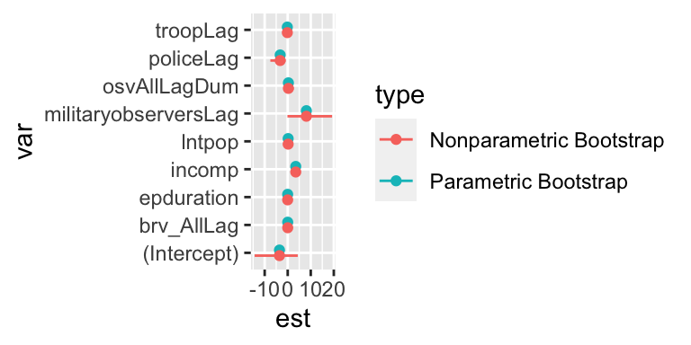

# Week 4: Confidence Intervals

This week, we expand our confidence interval toolkit. We have three core methods:

1. parametric bootstrap, which can be used directly for coefficients or quantities of interest.
1. nonparametric bootstrap, which can be used directly for coefficients or quantities of interest.
1. Wald confidence interval for coefficients, extended to quantities of interest using the delta method.


## The Parametric Bootstrap

We've already seen the parametric bootstrap, but a brief review is worthwhile.

To do compute a confidence interval using the parametric bootstrap, do the following: 

1. Approximate $f(y; \theta)$ with $\hat{f} = f(y; \hat{\theta})$. Simulate a new outcome $y^{\text{bs}}$ from the estimated distribution. 
1. Re-compute the estimate of interest $\hat{\theta}^{\text{bs}}$ or $\hat{\tau}^{\text{bs}}$ using the bootstrapped outcome variable $y^{\text{bs}}$ rather than the observed outcome $y$.
1. Repeat 1 and 2 many times (say 2,000) to obtain many bootstrapped estimates. To obtain the 95% confidence interval, take the 2.5th and 97.5th percentiles of the estimates. In general, to obtain a $100(1 - \alpha)\%$ confidence interval, $\frac{\alpha}{2}$th and $(1 - \frac{\alpha}{2})$th percentiles. This is known as the percentile method.

The parametric bootstrap is a powerful, general tool to obtain confidence intervals for estimates from parametric models, *but it relies heavily on the parametric assumptions*.

## The *Non*parametric Bootstrap

The nonparametric bootstrap works similarly to the parametric bootstrap. But rather than simulate a new outcome from the fitted parametric distribution, we sample (with replacement) a new data set from the observed data set (of the same size).

Suppose a data set $D$ with $N$ rows. To do compute a confidence interval using the *non*parametric bootstrap, do the following: 

1. Sample $N$ rows with replacement from $D$ to create a single bootstrap data set $D^{bs}$. 
1. Re-compute the estimate of interest $\hat{\theta}^{\text{bs}}$ or $\hat{\tau}^{\text{bs}}$ using the bootstrap data set $D^{bs}$ (rather than the observed data set $D$).
1. Repeat 1 and 2 many times (say 2,000) to obtain many bootstrap estimates. To obtain the 95% confidence interval, take the 2.5th and 97.5th percentiles of the estimates. In general, to obtain a $100(1 - \alpha)\%$ confidence interval, $\frac{\alpha}{2}$th and $(1 - \frac{\alpha}{2})$th percentiles. This is known as the percentile method.

**Important**: The parametric bootstrap obtains a single bootstrap data set by simulated a new outcome from the fitted parametric distribution. The *non*parametric bootstrap creates a single bootstrap data set by sampling from the data set with replacement.

### Example: Coefficients from the Civilian Casualties Model


```r
# load hks data
hks <- read_csv("data/hks.csv") %>%
  na.omit()

# fit poisson regression model
f <- osvAll ~ troopLag + policeLag + militaryobserversLag + 
  brv_AllLag + osvAllLagDum + incomp + epduration + 
  lntpop

# fit poisson regression model
fit <- glm(f, data = hks, family = poisson)
texreg::screenreg(fit)
```

```
## 
## =====================================
##                       Model 1        
## -------------------------------------
## (Intercept)                 -3.58 ***
##                             (0.04)   
## troopLag                    -0.17 ***
##                             (0.00)   
## policeLag                   -3.27 ***
##                             (0.02)   
## militaryobserversLag         8.10 ***
##                             (0.01)   
## brv_AllLag                   0.00 ***
##                             (0.00)   
## osvAllLagDum                 0.29 ***
##                             (0.00)   
## incomp                       3.49 ***
##                             (0.02)   
## epduration                  -0.02 ***
##                             (0.00)   
## lntpop                       0.19 ***
##                             (0.00)   
## -------------------------------------
## AIC                    2139137.24    
## BIC                    2139193.29    
## Log Likelihood        -1069559.62    
## Deviance               2134800.81    
## Num. obs.                 3746       
## =====================================
## *** p < 0.001; ** p < 0.01; * p < 0.05
```

First, for comparison, let's using the familiar parametric bootstrap.


```r
# parametric bs for coefficients
n_bs <- 2000
coef_bs <- matrix(nrow = n_bs, ncol = length(coef(fit)))
names(coef_bs) <- names(coef(fit))
for (i in 1:n_bs) {
  lambda_hat <- predict(fit, type = "response")
  y_bs <- rpois(length(lambda_hat), lambda = lambda_hat)
  fit_bs <- update(fit, formula = y_bs ~ .)
  coef_bs[i, ] <- coef(fit_bs)
}

# compute the 2.5th and 97.5th percentiles
cis <- apply(coef_bs, 2, quantile, probs = c(0.05, 0.95)); cis
```

```
##          [,1]       [,2]      [,3]     [,4]         [,5]      [,6]     [,7]
## 5%  -3.651811 -0.1726437 -3.310953 8.080174 0.0005467366 0.2832622 3.454219
## 95% -3.503847 -0.1668833 -3.230958 8.120243 0.0005740558 0.2990284 3.516186
##            [,8]      [,9]
## 5%  -0.02235465 0.1858499
## 95% -0.02209819 0.1928230
```

```r
# put the cis into a nice little data frame for use later
pbs_ci_df <- tibble(var = names(coef(fit)),
                est = coef(fit),
                lwr = cis["5%", ],
                upr = cis["95%", ], 
                type = "Parametric Bootstrap")
```

Now let's use the nonparametric bootstrap. The *two* changed lines are flagged with comments


```r
# nonparametric bs for coefficients
n_bs <- 2000  
coef_bs <- matrix(nrow = n_bs, ncol = length(coef(fit)))
names(coef_bs) <- names(coef(fit))
for (i in 1:n_bs) {
  bs_data <- sample_n(hks, size = nrow(hks), replace = TRUE)  # sample from hks w/ repl.
  fit_bs <- update(fit, data = bs_data)                       # fit same model on resampled data
  coef_bs[i, ] <- coef(fit_bs)
}
cis <- apply(coef_bs, 2, quantile, probs = c(0.05, 0.95)); cis
```

```
##           [,1]        [,2]       [,3]       [,4]          [,5]      [,6]
## 5%  -14.344215 -0.37885418 -7.5344749 -0.1225277 -0.0005440105 -1.726691
## 95%   4.358104  0.05088762 -0.9204064 19.2516538  0.0022893751  2.605080
##         [,7]        [,8]       [,9]
## 5%  2.222256 -0.03827870 -0.5299241
## 95% 4.270703 -0.00653603  1.0733752
```

```r
nbs_ci_df <- tibble(var = names(coef(fit)),
                est = coef(fit),
                lwr = cis["5%", ],
                upr = cis["95%", ], 
                type = "Nonparametric Bootstrap")
```

Now let's compare the estimates.


```r
# combined the two dfs w/ the cis into a single df
ci_df <- bind_rows(pbs_ci_df, nbs_ci_df)

# plots the coefficient estimates and cis
ggplot(ci_df, aes(x = est, xmin = lwr, xmax = upr,
                  y = var, color = type)) + 
  geom_errorbarh(position = position_dodge(width = .4), height = 0) + 
  geom_point(position = position_dodge(width = .4))
```



We could also make a little table.


```r
ci_df %>%
  mutate(ci_chr = paste0("[", scales::number(lwr, 0.001), ", ", scales::number(upr, 0.001), "]"), 
         est_chr = scales::number(est, 0.001)) %>%
  select(var, est_chr, ci_chr, type) %>%
  pivot_wider(names_from = type, values_from = ci_chr) %>%
  rename(`Variable` = var, `Coefficient Estimate` = est_chr) %>%
  kableExtra::kable(format = "markdown")
```


|Variable             |Coefficient Estimate |Parametric Bootstrap |Nonparametric Bootstrap |
|:--------------------|:--------------------|:--------------------|:-----------------------|
|(Intercept)          |-3.579               |[-3.652, -3.504]     |[-14.344, 4.358]        |
|troopLag             |-0.170               |[-0.173, -0.167]     |[-0.379, 0.051]         |
|policeLag            |-3.272               |[-3.311, -3.231]     |[-7.534, -0.920]        |
|militaryobserversLag |8.100                |[8.080, 8.120]       |[-0.123, 19.252]        |
|brv_AllLag           |0.001                |[0.001, 0.001]       |[-0.001, 0.002]         |
|osvAllLagDum         |0.291                |[0.283, 0.299]       |[-1.727, 2.605]         |
|incomp               |3.486                |[3.454, 3.516]       |[2.222, 4.271]          |
|epduration           |-0.022               |[-0.022, -0.022]     |[-0.038, -0.007]        |
|lntpop               |0.189                |[0.186, 0.193]       |[-0.530, 1.073]         |

### Example: First Difference from the Civilian Casualties Model


```r
# load hks data
hks <- read_csv("data/hks.csv") %>%
  na.omit()

# fit poisson regression model
f <- osvAll ~ troopLag + policeLag + militaryobserversLag + 
  brv_AllLag + osvAllLagDum + incomp + epduration + 
  lntpop
fit <- glm(f, data = hks, family = poisson)

# compute qi using the invariance property
X_lo <- tibble(troopLag = 0,
               policeLag = 0, 
               militaryobserversLag = 0, 
               brv_AllLag = 0,
               osvAllLagDum = 0, 
               incomp = 2,
               epduration = 46,
               lntpop = 9.19)
lambda_hat_lo <- predict(fit, newdata = X_lo, type = "response")
X_hi <- mutate(X_lo, troopLag = 29.209)
lambda_hat_hi <- predict(fit, newdata = X_hi, type = "response")
fd_hat <- lambda_hat_hi - lambda_hat_lo; fd_hat
```

```
##         1 
## -60.57989
```

Now let's get a 90% confidence interval for the first difference using the **parametric bootstrap**.


```r
# parametric bs for coefficients
n_bs <- 1000
fd_bs <- numeric(n_bs)
names(coef_bs) <- names(coef(fit))
for (i in 1:n_bs) {
  lambda_hat <- predict(fit, type = "response")
  y_bs <- rpois(length(lambda_hat),  lambda = lambda_hat)
  fit_bs <- update(fit, formula = y_bs ~ .)
  lh_lo_bs <- predict(fit_bs, newdata = X_lo, type = "response")
  lh_hi_bs <- predict(fit_bs, newdata = X_hi, type = "response")
  fd_bs[i] <- lh_hi_bs - lh_lo_bs
}
quantile(fd_bs, probs = c(0.05, 0.95))
```

```
##        5%       95% 
## -60.91010 -60.26159
```

Now let's get a 90% confidence interval for the first difference using the **nonparametric bootstrap**.


```r
# nonparametric bs for coefficients
n_bs <- 1000
fd_bs <- numeric(n_bs)
names(coef_bs) <- names(coef(fit))
for (i in 1:n_bs) {
  bs_data <- sample_n(hks, size = nrow(hks), replace = TRUE)  # sample from hks w/ repl.
  fit_bs <- update(fit, data = bs_data)                       # fit same model on resampled data
  lh_lo_bs <- predict(fit_bs, newdata = X_lo, type = "response")
  lh_hi_bs <- predict(fit_bs, newdata = X_hi, type = "response")
  fd_bs[i] <- lh_hi_bs - lh_lo_bs
}
quantile(fd_bs, probs = c(0.05, 0.95))
```

```
##        5%       95% 
## -90.66696  33.85956
```

