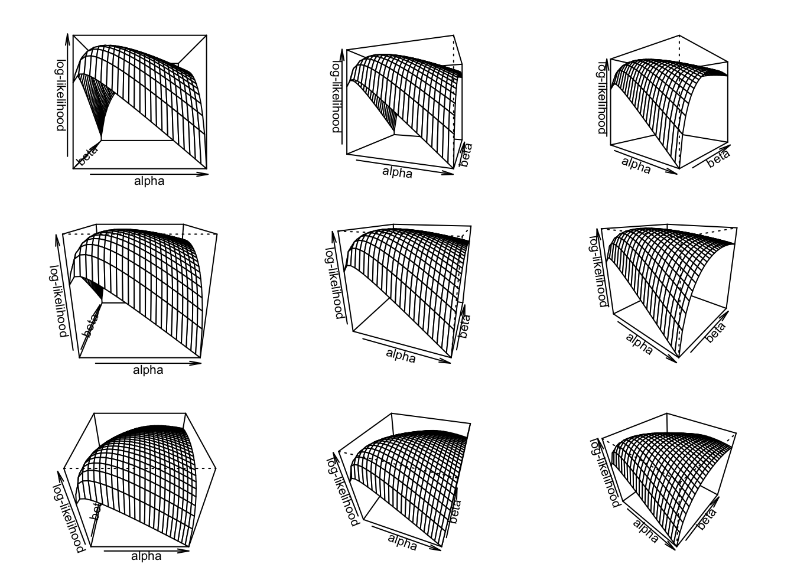

## Wald Confidence Intervals


We can easily use the log-likelihood function to obtain point estimates. It turns out, though, that this same log-likelihood function contains information that helps use estimate the *precision* of those estimates as well.

As an example, consider the following two log-likelihood functions:


Which of these two log-likelihood functions do you think provides a more *precise* estimate? 

*Note: These likelihoods are from a normal model with unknown mean. I simulated 100 observations for $y_1$ and 500 observations for $y_2$. (I centered the data so the sample means both occurred exactly at two.*

**Key Idea**: We can use the curvature around the maximum likelihood estimate to get a sense of the uncertainty.

What quantity tells us about the amount of curvature at the maximum? The second derivative. As the second derivative goes down, the curvature goes up. 
As the curvature goes up, the uncertainty goes down.

### Curvature in a Single Dimmension

To develop our intuition about "curvature" and confidence intervals, I analyze the *Stylized Normal Model* ($\sigma = 1$). Here, we model the data as a normal distribution with $\mu$ unknown (and to be estimated), but $\sigma = 1$ (known; not estimated). That is, $y \sim N(\mu, 1)$.

$$
\begin{aligned}
\log \mathcal{L}(\mu) &= -\frac{n}{2\pi} - \frac{1}{2}\sum_{i = 1}^n (y_i - \mu)^2\\
\dfrac{\partial \log \mathcal{L}(\mu)}{\partial \mu} &= \sum_{i = 1}^n y_i - \mu n\\
\dfrac{\partial^2 \log \mathcal{L}(\mu)}{\partial^2 \mu} &=  - n
\end{aligned}
$$

Facts:

- As $n$ increases, $\frac{\partial^2 \log \mathcal{L}(\mu | y)}{\partial^2 \mu}$ becomes more negative.
- As $\frac{\partial^2 \log \mathcal{L}(\mu | y)}{\partial^2 \mu}$ gets more negative, the curvature increases.
- As the curvature increases, the uncertainty decreases.

Wouldn't it be really nice if we could use $\frac{\partial^2 \log \mathcal{L}(\mu)}{\partial^2 \mu}$ to estimate the standard error?

It turns out that this quantity is a direct, almost magically intuitive estimator of the standard error.

In the single parameter case, we have the following approximation.

$$
\widehat{\text{Var}}(\hat{\theta}) \approx \left[\left. - \frac{\partial^2 \log \mathcal{L}(\theta)}{\partial^2 \theta}\right| _{\theta = \hat{\theta}}\right] ^{-1}
$$

I should be careful here. This is an asymptotic result. As the sample size grows, the variance of $\hat{\beta}$ gets closer and closer to $\left[\left. - \frac{\partial^2 \log \mathcal{L}(\theta)}{\partial^2 \theta}\right| _{\theta = \hat{\theta}}\right] ^{-1}$. I'm interpreting this large sample result as a small sample approximation.

This mean that we find the second derivative, evaluate it at the maximum ($\theta = \hat{\theta}$), and find the inverse ($-1$). That's an estimate of the variance. To convert it to a standard error, just take the square root.

$$
\widehat{\text{SE}}(\hat{\theta}) \approx \sqrt{\left[\left. - \frac{\partial^2 \log \mathcal{L}(\theta)}{\partial^2 \theta}\right| _{\theta = \hat{\theta}}\right] ^{-1}}
$$
If we continue the stylized normal example, we have the following.

$$
\begin{equation*}
\dfrac{\partial^2 \log \mathcal{L}(\mu | y)}{\partial^2 \mu} =  - n
 ~{\color{purple}{\Longrightarrow}}~
\left[\left. - \frac{\partial^2 \log \mathcal{L}(\mu | y)}{\partial^2 \mu}\right| _{\mu = \hat{\mu}}\right] ^{-1} 
 = \dfrac{1}{n} 
\approx \widehat{\text{Var}}(\hat{\mu})
\end{equation*}
$$

And then

$$
\begin{equation*}
\widehat{\text{SE}}(\hat{\mu}) \approx \sqrt{\dfrac{1}{n}} 
\end{equation*}
$$
Does this answer make sense? What is the standard error of the mean from Methods II? Hint: It's $\text{SE}[\text{avg}(y)] \approx \sqrt{\dfrac{\text{population SD}}{n}}$. In this case, the "population SD" is $\sigma = 1$, as assumed by the *stylized* normal model.

### Curvature in a Multiple Dimmensions

To add multiple dimensions, let's consider the beta model from Week 1. Here, we assume that $y \sim \text{Beta}(\alpha, \beta)$, and our goal is to estimate $\alpha$ and $\beta$. The key is that we have *multiple* (i.e., two) parameters to estimate.

It's a bit trickier to think about curvature in multiple dimensions.

Here's what the log-likelihood function might look like for a give data set.



To make more sense, of this 3D plot, let's look at the contour plot.


The curvature around the maximum *vertically* tells use the variance in $\hat{\beta}$.


The curvature around the maximum *horizontally* tells use the variance in $\hat{\alpha}$.


But there's a third direction that's relevant here: the curvature *diagonally*. The diagonal curvature tells us the covariance of $\hat{\alpha}$ and $\hat{\beta}$. That is, if we *over*-estimate $\alpha$, how much do we tend to over- (or under-)estimate $\beta$?


Rather than a single variance, we get a variance **matrix** (sometimes called the "covariance matrix" or the "variance-covariance matrix".

$$
\begin{equation*}
\widehat{\text{Var}}(\hat{\theta})= \widehat{\text{Cov}}(\hat{\theta}) \approx \left. \left[ 
\displaystyle \begin{matrix}
- \frac{\partial^2 \log \mathcal{L}(\theta| y)}{\partial^2 \theta_1} & - \frac{\partial^2 \log \mathcal{L}(\theta| y)}{\partial \theta_1 \partial \theta_2}\\
- \frac{\partial^2 \log \mathcal{L}(\theta| y)}{\partial \theta_2 \partial \theta_1} & - \frac{\partial^2 \log \mathcal{L}(\theta| y)}{\partial^2 \theta_2}\\
\end{matrix}\right]^{-1} \right|_{\theta = \hat{\theta}}
\end{equation*}
$$
The elements along the diagonal (in red) are the variances for each parameter, so the square root of the diagonal gives you the standard errors. This is exactly what we'd expect.

$$
\begin{equation*}
\widehat{\text{Var}}(\hat{\theta}) \approx \left. \left[ 
\displaystyle \begin{matrix}
\color{red}{- \frac{\partial^2 \log \mathcal{L}(\theta| y)}{\partial^2 \theta_1}} & - \frac{\partial^2 \log \mathcal{L}(\theta| y)}{\partial \theta_1 \partial \theta_2}\\
- \frac{\partial^2 \log \mathcal{L}(\theta| y)}{\partial \theta_2 \partial \theta_1} & \color{red}{- \frac{\partial^2 \log \mathcal{L}(\theta| y)}{\partial^2 \theta_2}}\\
\end{matrix}\right]^{-1} \right|_{\theta = \hat{\theta}}
\end{equation*}
$$

The off-diagonal elements (in blue) are the covariances--they'll be really important to us later, but we don't have a direct use for them at the moment.

$$
\begin{equation*}
\widehat{\text{Var}}(\hat{\theta}) \approx \left. \left[ 
\displaystyle \begin{matrix}
- \frac{\partial^2 \log \mathcal{L}(\theta| y)}{\partial^2 \theta_1} & \color{blue}{- \frac{\partial^2 \log \mathcal{L}(\theta| y)}{\partial \theta_1 \partial \theta_2}}\\
\color{blue}{- \frac{\partial^2 \log \mathcal{L}(\theta| y)}{\partial \theta_2 \partial \theta_1}} & - \frac{\partial^2 \log \mathcal{L}(\theta| y)}{\partial^2 \theta_2}\\
\end{matrix}\right]^{-1} \right|_{\theta = \hat{\theta}}
\end{equation*}
$$

But what about more than two parameters? It's exactly what you'd expect. We call this matrix of second-derivatives the "information matrix" $\mathcal{I}(\theta)$. When evaluated at the ML estimate, we call it the "observed information matrix" $\mathcal{I}(\hat{\theta})$.

$$
\begin{equation*}
\begin{aligned}
\widehat{\text{Var}}(\hat{\theta}) &\approx \left. \left[ 
\displaystyle \begin{matrix}
- \frac{\partial^2 \log \mathcal{L}(\theta| y)}{\partial^2 \theta_1} & - \frac{\partial^2 \log \mathcal{L}(\theta| y)}{\partial \theta_1 \partial \theta_2} & \ldots &- \frac{\partial^2 \log \mathcal{L}(\theta| y)}{\partial \theta_1 \partial \theta_k}\\
- \frac{\partial^2 \log \mathcal{L}(\theta| y)}{\partial \theta_2 \partial \theta_1} & - \frac{\partial^2 \log \mathcal{L}(\theta| y)}{\partial^2 \theta_2} & \ldots & - \frac{\partial^2 \log \mathcal{L}(\theta| y)}{\partial \theta_2 \partial \theta_k}\\
\vdots & \vdots & \ddots & \vdots \\
- \frac{\partial^2 \log \mathcal{L}(\theta| y)}{\partial \theta_k \partial \theta_1}     & - \frac{\partial^2 \log \mathcal{L}(\theta| y)}{\partial \theta_k \partial \theta_2} & \ldots & - \frac{\partial^2 \log \mathcal{L}(\theta| y)}{\partial^2 \theta_k}\\
\end{matrix}\right]^{-1} \right|_{\theta = \hat{\theta}}\\
 & \approx \mathcal{I}(\theta)^{-1}|_{\theta = \hat{\theta}}\\
 &\approx \mathcal{I}(\hat{\theta})^{-1}
\end{aligned}
\end{equation*}
$$

### From Curvature to Confidence Intervals

To convert this variance estimate into a confidence interval, we need the following large sample result. It turns out that, as the sample size grows large, the ML estimate converges to a normally distributed random variable with mean $theta_{true}$ and variance $\mathcal{I}(\theta_{true})^{-1}$..

**key fact**: $\hat{\theta} \overset{a}{\sim} N\left[ \theta_{true}, \mathcal{I}(\theta_{true})^{-1}\right]$

\pause In practice, we'll take this to mean it's *approximately* normal.

$$
\begin{align*}
 90\%~\text{C.I.}  &\approx \hat{\theta} \pm 1.64\dfrac{1}{\sqrt{\mathcal{I}(\hat{\theta})}}\\
 95\%~\text{C.I.}  &\approx \hat{\theta} \pm 1.96\dfrac{1}{\sqrt{\mathcal{I}(\hat{\theta})}}
\end{align*}
$$

To work with these intervals, then, we just need the variance matrix $\widehat{\text{Var}}(\hat{\theta}) = \mathcal{I}(\hat{\theta})^{-1}$. Much like we can access the ML estimates of the model coefficients $\hat{\beta}$ with `coef()`, we can access $\widehat{\text{Var}}(\hat{\theta})$. 


```r
# load hks data
hks <- read_csv("data/hks.csv") %>%
  na.omit()

# fit poisson regression model
f <- osvAll ~ troopLag + policeLag + militaryobserversLag + 
  brv_AllLag + osvAllLagDum + incomp + epduration + 
  lntpop
fit <- glm(f, data = hks, family = poisson)

# compute 90% confidence intervals
beta_hat <- coef(fit)
var_hat <- vcov(fit)
se_hat <- sqrt(diag(var_hat))  # keep only the diagonal elements
ci_lwr <- beta_hat - 1.64*se_hat
ci_upr <- beta_hat + 1.64*se_hat

# make a nice table
tibble(`Variable` = names(beta_hat),
       `Coefficient Estimate` = scales::number(beta_hat, 0.001),
       `90% Confidence Interval` = paste0("[", scales::number(ci_lwr, 0.001), ",", scales::number(ci_upr, 0.001), "]")) %>%
  kableExtra::kable(format = "markdown")
```


|Variable             |Coefficient Estimate |90% Confidence Interval |
|:--------------------|:--------------------|:-----------------------|
|(Intercept)          |-3.579               |[-3.649,-3.509]         |
|troopLag             |-0.170               |[-0.173,-0.167]         |
|policeLag            |-3.272               |[-3.313,-3.232]         |
|militaryobserversLag |8.100                |[8.080,8.120]           |
|brv_AllLag           |0.001                |[0.001,0.001]           |
|osvAllLagDum         |0.291                |[0.283,0.299]           |
|incomp               |3.486                |[3.457,3.516]           |
|epduration           |-0.022               |[-0.022,-0.022]         |
|lntpop               |0.189                |[0.186,0.193]           |

Compare these confidence intervals to the parametric and nonparametric intervals from the previous section.

### Final Notes

- The Wald confidence interval does not easily extend to quantities of interest. It turns out that their is a way, called the "delta method." It's a bit tedious and not necessary since we have other methods. But I'll mention it here: "the delta method." King, Tomz, and Wittenberg (2001) give us an easy alternative to the delta method; we'll see their method in a couple of weeks.
- If you use `optim()` to find the ML estimates, then you can have it return the observed information matrix $\mathcal{I}(\hat{\theta})$ to you by supplying the argument `hession = TRUE` to `optim()`. `optim()` returns a list; the component named `"hessian"` is the Hessian matrix. You simple need to find the inverse of the negative of the Hessian to obtain the estimated variance matrix. Something like `est <- optim(..., hessian = TRUE)` followed by `var_hat <- solve(-est$hessian)`.

