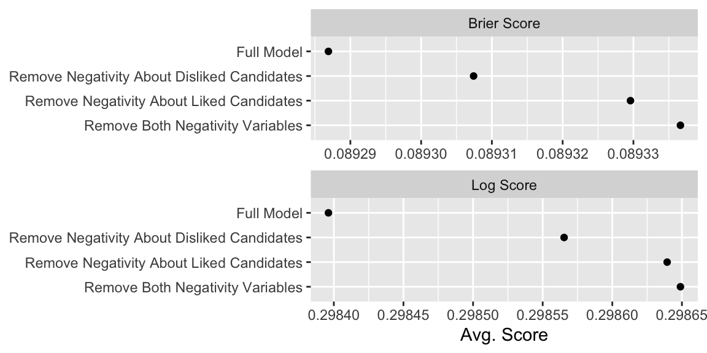
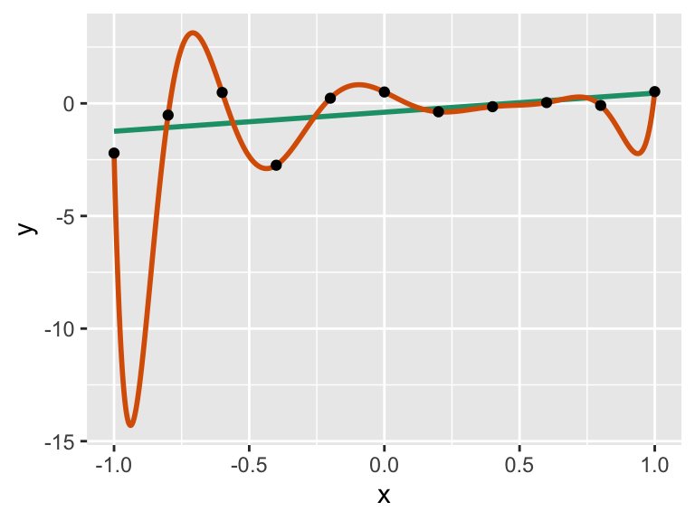
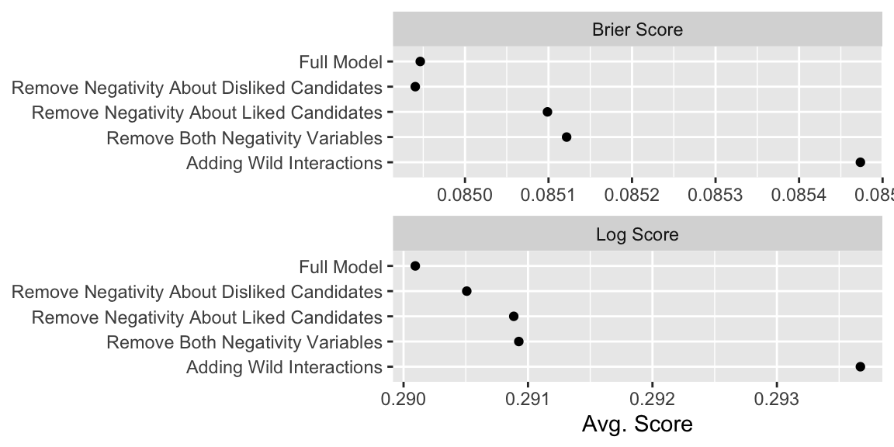
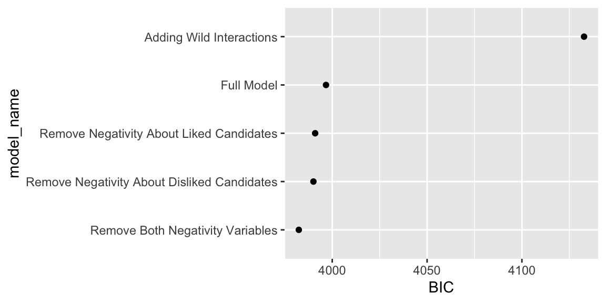
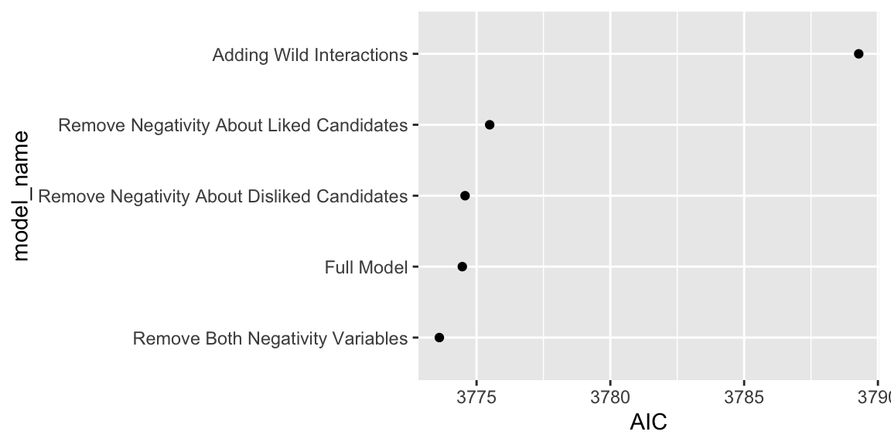

# Week 5: Models of Binary Outcomes and Model Fit Summaries

This week, we have two goals.

1. Develop out measures of model fit beyond the predictive distribution, adding cross validation and information criteria to our tool kit.
1. Modify the usual logit model in subtle and not-so-subtle ways to expand our options for modeling binary data


## Measures of Model Fit 

### Scoring Binary Predictions

Suppose you have a binary outcome $y_i$ for $i = \{1, 2, ..., n\}$ and you develop a set of predictions for each outcome in the from of probabilities $p_i$ for $i = \{1, 2, ..., n\}$ and a competitor develops the set $q_i$ for $i = \{1, 2, ..., n\}$. Intuitively, if the $p_i$s are "closer" to the $y_i$s than the $q_i$s, then the $p_i$s are a better prediction. By extension, the model that produced the $p_i$s is a better model than the model that produced the $q_i$s.

But we need a formal rule for defining what we mean by "closer." There are two common scoring rules at the level of the individual predictions.

1. **Brier Score** The Brier score is squared error of the prediction $p_i$ and the outcome $y_i$, so that $\text{Brier Score_i} =  (p_i -y_i)^2$. This is analogous to linear regression, where we minimize the RMS of the residuals.
1. **Log Score** The log score is the logarithm of the probabilities assigned to the event that occurred. This can be awkward to interpret, since better predictions produce *less negative* values. Therefore, it's common to multiply log scores by $-1$. In practice, we tend to we can compute this as $\text{Log Score}_i =  - [y_i \log(p_i) + (1 - y_i) \log (1 - p_i)]$

To aggregate the scores across the observations, we can use a simple average for both the Brier and log scores.

To see these scoring rules in action, let's fit fit the familiar logit model to data from [Krupnikov (2011)](https://onlinelibrary.wiley.com/doi/10.1111/j.1540-5907.2011.00522.x). In this *AJPS* article, she argues that late campaign negativity targeted toward a liked candidate demobilizes voters while other forms of negativity do not. 

She concludes: 

> ...the substantive results reinforce the conclusion that it is late negativity that targets the individual's preferred candidate that leads to significant changes in the likelihood of turnout. Increases in negativity about the preferred candidate decrease turnout likelihood by as much as 6 percentage points; even more importantly, the decrease in turnout is statistically significant. In contrast, the substantive effects of negativity about the other candidate, as well as overall negativity, are statistically indistinguishable from 0.

In the model below (from her Model 3 in Table 4 on p. 807), she is specifically interested in comparing the effects of `negaboutdislike` and `negaboutlike`. She shows that the estimated coefficient for `negaboutdislike` is not statistically significant, while the estimated coefficient for `negaboutlike` *is* statistically significant.

First, let's reproduce her fitted model results.


```r
# load data
krup_raw <- haven::read_dta("data/krup.dta") 

# model formula (model 3, tab. 4, p. 807, krupnikov 2011)
f <- turnout ~ 
           # negativity
           negaboutdislike + negaboutlike +
           # resources
           income + education + age + unemployed +
           # evaluation of parties and candidates
           PIDStrength + AffectPID + care + AffectPRES +
           # social involvement
           lnYears + Church + homeowners + working + 
           # mobilization
           contacted + 
           # interest, exposure, and efficacy
           external + internal + interest + media_index + 
           # other demographics
           married + black + southern + hispanic + gender + 
           # state conditions
           closeness + governors + primaries + 
           # volume and year controls
           volume2 + dummy1988 + dummy2000 + dummy1992 + dummy1996

# drop rows with missing values from the data set
krup <- krup_raw %>%
  get_all_vars(f, data = .)  %>%
  na.omit()

fit <- glm(f, data = krup, family = "binomial")
```

Now let's compute the Brier scores for each observation and the aggregate to the data set by averaging.


```r
# obtain prediction
p <- predict(fit, type = "response")

# compute brier scores
y <- krup$turnout                           # create a vector to make code more readable
brier_scores <- (y - p)^2                      # compute manually
brier_scores_alt <- scoring::brierscore(y ~ p) # compute with the scoring package

# aggregate by averaging
bs <- mean(brier_scores)
print(bs, digits = 2)
```

```
## [1] 0.089
```

Now let's do the same for the log scores.


```r
# compute log scores
log_scores <- -(y*log(p) + (1 - y)*log(1 - p))
log_scores_alt <- scoring::logscore(y ~ p)

# aggregate by averaging
ls <- mean(log_scores)
print(ls, digits = 2)
```

```
## [1] 0.3
```

It's usually difficult to interpret or act upon the Brier and log scores for a single model. Instead, we typically use them to choose among a set of models. 

As an simple example, I removed the two late-negativity variables from the model (Krupnikov's key explanatory variables)

Important: When using the Brier and log scores, **lower scores indicate a better fit.**


|Model Name                                  | Avg. Log Score| Avg. Brier Score|
|:-------------------------------------------|--------------:|----------------:|
|Full Model                                  |         0.2984|           0.0893|
|Remove Negativity About Disliked Candidates |         0.2986|           0.0893|
|Remove Negativity About Liked Candidates    |         0.2986|           0.0893|
|Remove Both Negativity Variables            |         0.2986|           0.0893|



### Cross-Validation

But here's the dirty little secret: you can **always** make your model better *within your sample* by making the model more complex. As a simple illustration, I added a quadruple interactions between both forms of negativity and education, income, and gender.

```
turnout ~ negaboutdislike*education*income*gender + negaboutlike*education*income*gender + ...
```

This model will better predictions than the baseline model.


|Model Name               | Avg. Log Score| Avg. Brier Score|
|:------------------------|--------------:|----------------:|
|Full Model               |      0.2983961|       0.08928690|
|Adding Wild Interactions |      0.2966916|       0.08876646|


Consider the two models fit trough the data below. A simple line (in green) fits the data quite nicely. However, a 10th-order polynomial (in orange) fits the observed data *even better* (in fact, it has no error at all!). 


```r
set.seed(1234)
n <- 11
x <- seq(-1, 1, length.out = n)
y <- rnorm(n) + x
data <- tibble(y, x)

fit <- lm(y ~ x, data = data)
fit10 <- lm(y ~ poly(x, 10), data = data)

ggplot(data, aes(x, y)) + 
  geom_smooth(method = lm, se = FALSE, color = "#1b9e77") + 
  geom_smooth(method = lm, se = FALSE, formula = y ~ poly(x, 10), n = 1001, color = "#d95f02") + 
  geom_point()
```

```
## `geom_smooth()` using formula 'y ~ x'
```



But if we used the 10th-order polynomial for prediction, it would perform horribly. Why? Because it *overfits* the data. That is, it explains both the *systematic* and *idiosyncratic* features of the observed data. Suppose we need to make a prediction for $x = -0.95$. The complex model generates a prediction of about -14. 

To avoid over-fitting the model, we can use two approaches.

1. cross validation
1. information criteria

Let's start with leave-one-out cross validation.

For each observation $i$ in the data set:

1. Drop that observation $i$. 
1. Fit the model using the remaining data.
1. Predict the dropped observation.
1. Compute the score for that observation.

Because the observation being predicted is left-out and *not in the data set used to fit the model*, the model cannot "cheat" and fit the idiosyncratic variation in the left-out data point. In order to perform well, it must identify systematic variation in the *other* data points and use that information to predict the left-out observation.

If your data set has $n$ observations, then you must fit $n$ models to perform leave-one-out cross validation. Let's estimate the time-cost for Krupnikov's model.


```r
# fit model and store time
time <- system.time( 
  fit <- glm(f, data = krup, family = "binomial")
  )

# multiply elapsed time times number of observations
round(time["elapsed"]*nrow(krup)/(60), 1)  # convert to minutes
```

```
## elapsed 
##     9.7
```

Each model takes about 0.05 seconds to fit. This seems fast, but you need to do it about 6,000 times, which takes about 300 seconds or five minutes.


```r
# note system time
start_time <- Sys.time()

# perform cross validation
results_list <- list()
#for (i in 1:nrow(krup)) {
for (i in 1:10) {
  if (i %% 100 == 0) print(i)
  # create training data and test data, to make code readable
  training <- slice(krup, -i)
  test     <- slice(krup,  i)
  # fit model
  fit_i <- glm(f, data = training, family = "binomial")
  # compute scores for test data (compute scores later)
  y_i <- test$turnout
  p_i <- predict(fit_i, newdata = test, type = "response")
  # store results
  results_list[[i]] <- tibble(case_id = i,
                              y = y_i,
                              p = p_i)
}

# note system time
end_time <- Sys.time()
diff_time <- difftime(end_time, start_time, units = "mins")

# combine results and compute scores
results <- bind_rows(results_list) %>%
  mutate(log_score = -(y*log(p) + (1 - y)*log(1 - p)),
         brier_score = (y - p)^2)

# average scores
print(mean(results$log_score), 3)
```

```
## [1] 0.411
```

```r
print(mean(results$brier_score), 3)
```

```
## [1] 0.13
```


This code took 0) minutes to run. This isn't always practical, especially for large data sets. (It is embarrassingly parallel, though, so it's possible to dramatically shrink this time using parallel computing.)

For large data sets, rather than drop each observation individually, we can divide the data into $k$ equally-sized (or as close to equal as possible) groups. The we repeat the same process but drop and predict each *group* rather than the individual data points. This is called **$k$-fold cross validation**. If $k = n$, then we just have leave-one-out cross-validation.

The code below uses $k = 10$ and finds the average log and Brier scores for out-of-sample prediction using $k$-fold cross-validation for the scobit data.


```r
# cross validation groups
k <- 10  
group <- sample(rep(1:k, length.out = nrow(krup)))

# perform cross validation
results_list <- list()
for (i in 1:k) {
  # create training data and test data, to make code readable
  training <- filter(krup, group != i)
  test     <- filter(krup, group == i)
  # fit model
  fit_i <- glm(f, data = training, family = "binomial")
  # compute scores for test data (compute scores later)
  y_i <- test$turnout
  p_i <- predict(fit_i, newdata = test, type = "response")
  # store results
  results_list[[i]] <- tibble(group = i,
                              y = y_i,
                              p = p_i)
}

# combine results and compute scores
results <- bind_rows(results_list) %>%
  mutate(log_score = -(y*log(p) + (1 - y)*log(1 - p)),
         brier_score = (y - p)^2)

# average scores
print(mean(results$log_score), 3)
```

```
## [1] 0.303
```

```r
print(mean(results$brier_score), 3)
```

```
## [1] 0.0908
```

This result took just a second or two.

To illustrate how we can use $k$-fold cross-validation to evaluate models, I use $k$-fold cross validation to compute the average scores for all seven models (simpler and more complex) models discussed above.

The results are *really* close and can depend on the random assignment to the $k$ groups, so we want a large $k$ (or use leave-one-out cross validation). For the results below, I use 100-fold cross-validation.


|Model Name                                  | Avg. Log Score| Avg. Brier Score|
|:-------------------------------------------|--------------:|----------------:|
|Adding Wild Interactions                    |         0.2937|           0.0855|
|Full Model                                  |         0.2901|           0.0849|
|Remove Both Negativity Variables            |         0.2909|           0.0851|
|Remove Negativity About Disliked Candidates |         0.2905|           0.0849|
|Remove Negativity About Liked Candidates    |         0.2909|           0.0851|



### Information Criteria

As an alternative to cross-validation, we can use information criteria for a similar purpose without needing to refit the model many times. 

Information criteria have the following general structure:

$$
-2 \log L(\hat{\theta}) + [\text{constant}\times k ]
$$

Here, $\log L(\hat{\theta})$ is the value achieved when we maximized the log-likelihood function (not the $\hat{\theta}$, but the value of $\log L$ itself), $k$ is the number of parameters, and $\text{constant}$ is a constant term that varies across information criteria.

The two most common information criteria are:

1. **Akaike Information Criterion (AIC)** $= -2 \log L(\hat{\theta}) + [2 \times k]$
1. **Bayesian Information Criterion (AIC)** $= -2 \log L(\hat{\theta}) + [\log(n) \times k]$

The AIC and BIC have a deep and detailed theoretical development--the choice of constant is not at all arbitrary. It doesn't seem helpful to reproduce the theory here, but instead mention a few practical points.

- The *magnitude* of the IC is generally not of interest. Instead, we focus on the *difference* in the IC between models.
- Both the the AIC and the BIC work to identify the "best" model, but in two difference senses:
   - The AIC roughly compares the observed and predictive distributions are tries to identify the best match.
   - The BIC roughly identifies the model with the highest posterior probability---the most likely model to have generated the data.
- Both AIC and BIC penalize adding parameters. That is, in order to improve the IC, a more complex model must improve the fit enough to offset the additional penalty. That said, the BIC imposes a larger penalty for $n \geq 8$.

ADD SOME DISCUSSION ABOUT THE MAGNITUDE OF THE DIFFERENCE OF AIC AND BIC.

ADD RAFTERY's TABLE HERE.

To compute the AIC and BIC, we have the easy-to-use `AIC()` and `BIC()` functions. 

We can use those to compare models with and without the `negaboutlike` variable, for example. The AIC *slightly* prefers including the variable, but the BIC prefers the model without Krupnikov's key explanatory variable.


```r
# aic and bic for full model
AIC(fit)
```

```
## [1] 3774.467
```

```r
BIC(fit)
```

```
## [1] 3996.707
```

```r
# compare models
fit0 <- update(fit, . ~ . -negaboutlike)
fit1 <- update(fit, . ~ . -negaboutdislike)
fit2 <- update(fit, . ~ . -negaboutdislike - negaboutlike)


AIC(fit, fit0)
```

```
##      df      AIC
## fit  33 3774.467
## fit0 32 3775.490
```

```r
BIC(fit, fit0)
```

```
##      df      BIC
## fit  33 3996.707
## fit0 32 3990.996
```

```r
# compute model weights
# note: in krupnikov's theory, fit1 should be best (fit includes unnecessary variable)
AIC(fit, fit0, fit1, fit2) %>%
  mutate(diff_min = AIC - min(AIC),
         akiaike_weights = exp(-0.5*diff_min)/sum(exp(-0.5*diff_min)))
```

```
##      df      AIC  diff_min akiaike_weights
## fit  33 3774.467 0.8580177       0.2448183
## fit0 32 3775.490 1.8814836       0.1467578
## fit1 32 3774.571 0.9617180       0.2324479
## fit2 31 3773.609 0.0000000       0.3759760
```

```r
BIC(fit, fit0, fit1, fit2) %>%
  mutate(diff_min = BIC - min(BIC),
         post_prob = exp(-0.5*diff_min)/sum(exp(-0.5*diff_min)))
```

```
##      df      BIC  diff_min    post_prob
## fit  33 3996.707 14.327138 0.0007477026
## fit0 32 3990.996  8.616044 0.0129980202
## fit1 32 3990.077  7.696278 0.0205874133
## fit2 31 3982.380  0.000000 0.9656668640
```




