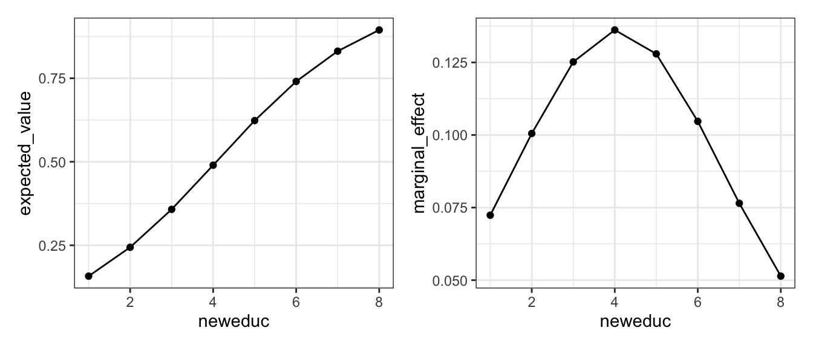
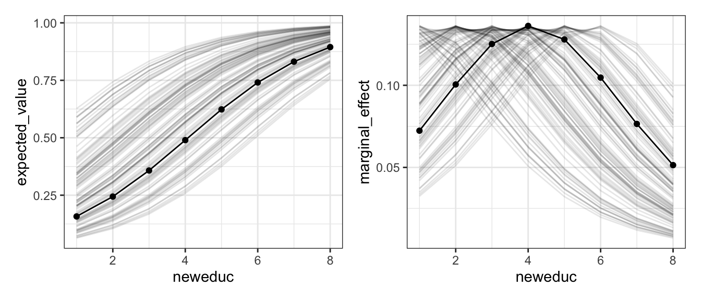
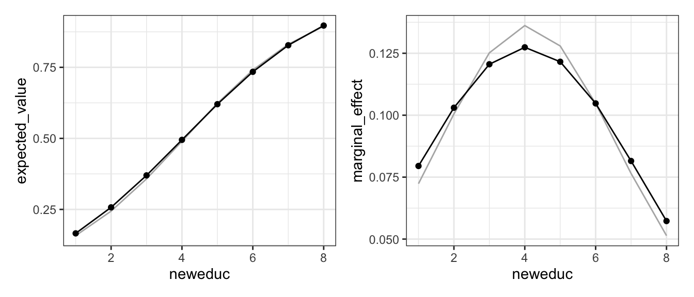
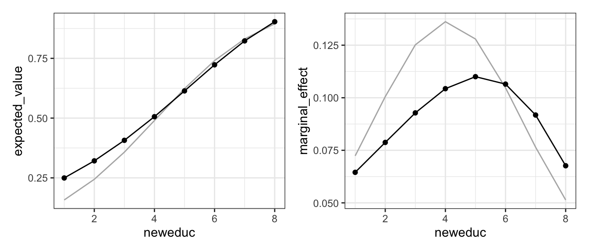
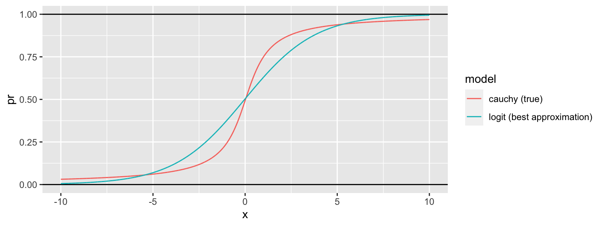
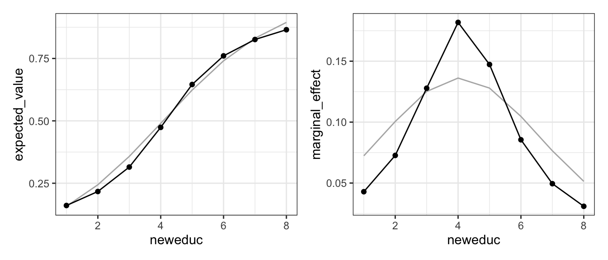
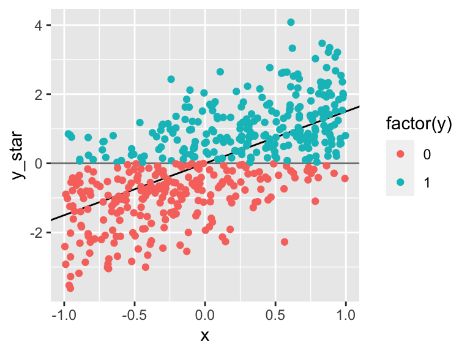
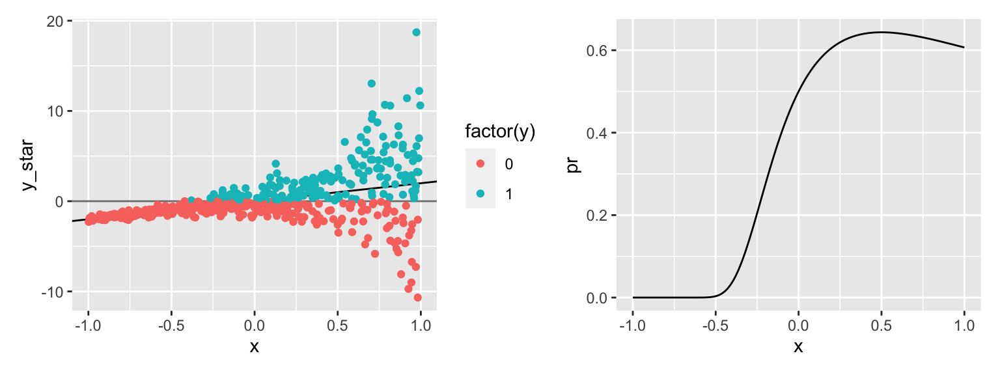
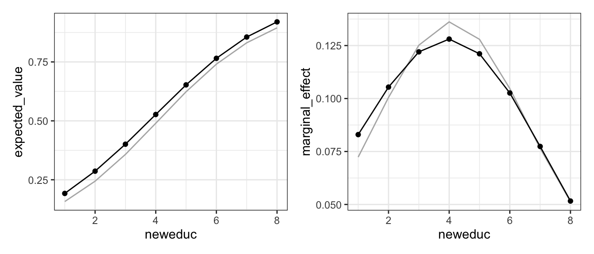

## Models of Binary Outcomes


Here, I describe a diverse collection of models of binary outcomes.

### Logit

$$
y_i \sim \text{Bernoulli}(\pi_i), \text{ where } \pi_i = \text{logit}^{-1}(X_i\beta) \text{ and } \text{logit}^{-1}(x) = \frac{e^x}{1 + e^x} 
$$

| Quantity                        | Description                                                                                              |
|-----------------------          |----------------------------------------------------------------------------------------------------------|
| Distribution                    | $y_i \sim \text{Bernoulli}(\pi_i)$                                                                       |
| Inverse Link Function           | $\pi_i = \text{logit}^{-1}(X_i\beta) = \frac{e^{X_i\beta}}{1 + e^{X_i\beta}}$                            |
| Fit Syntax                      | `glm(formula, data, family = binomial()`
| Expected Value                  | $\hat{E}(\tilde{y} \mid X_s) = \hat{\pi}_s = \text{logit}^{-1}(X_s\hat{\beta})$                          |
| Manual Computation of EV        | `pi_s = plogis(X_s %*% beta_hat)`                                                                        |
| `predict()` Computation of EV   | `pi_s = predict(fit, newdata = X_s, type = "response")`                                                  |
| Marginal Effect                 | $\frac{ \partial \hat{E}(\tilde{y} \mid X_s)}{\partial x_j} = \hat{\beta}_j\hat{\pi}_s(1 - \hat{\pi}_s)$ |
| Computation of Marginal Effect  | `coef(fit)*p_s*(1 - p_s)` |

Note: the marginal effect above assumes that $x_j$ is included in the model *linearly* with no polynomial or interactions.


```r
# load nagler's scobit data
scobit <- haven::read_dta("data/scobit.dta") %>%
  filter(newvote != -1)  # weird -1s in data; unsure if sufficient

# simplest model specification; no polynomials or interactions
f <- newvote ~ neweduc + closing + age + south + gov

# fit model
fit <- glm(f, data = scobit, family = binomial())
```

Now let's compute quantities of interest. Let's first compute the expected value or "predicted probability" as `closing` varies from zero to 50 with all other variables at their medians.


```r
# let education vary across all possible values; else median
s <- tibble(
  neweduc = 1:8,
  closing = median(scobit$closing),
  age = median(scobit$age),
  south = median(scobit$south),
  gov = median(scobit$gov)
)

# expected value or "predicted probability" 
s$expected_value <- predict(fit, newdata = s, type = "response")

# marginal effect of closing on expected value
s$marginal_effect <- coef(fit)["neweduc"]*s$expected_value*(1-s$expected_value)
```

Now let's make a plot of the expected values and marginal effects.


```r
# plot 
gg1 <- ggplot(s, aes(x = neweduc, y = expected_value)) + 
  geom_line() + geom_point() + 
  theme_bw()
gg2 <- ggplot(s, aes(x = neweduc, y = marginal_effect)) + 
  geom_line() + geom_point() + 
  theme_bw()

# combine plots and print
library(patchwork)
```

```
## Warning: package 'patchwork' was built under R version 4.1.2
```

```r
gg1 + gg2
```



For this model, let's briefly consider the *other* predictors in the model. In particular, let's reproduce the figure above, but for every combination of the other covariates that appeared in the data set. (It turns out the *every* combination was overwhelming, so I used a sample of 100 other scenarios from the exhaustive list). 

You can see that as the *other* covariates change, the expected value changes. But more importantly, the maginal effect of education changes as the other covariates change. That's why it's *critical* to develop an appropriate scenario that specifies values for *all* the covariates in the model.


Lastly, before we proceed to the next model, I'm going to save the expected values and marginal effects that I computed for the logit model to compare to the other models we discuss.


```r
s_logit <- s     # estimates of ev and me from logit model
fit_logit <- fit # logit model fit
```

### Probit

The probit model replaced the CDF of the standard logistic distribution with the CDF of the standard normal distribution. Rather than the "inverse logit" inverse link function, we use the CDF of the standard normal distrubtion.

 Quantity                        | Description                                                                                              |
|-----------------------          |----------------------------------------------------------------------------------------------------------|
| Distribution                    | $y_i \sim \text{Bernoulli}(\pi_i)$                                                                    |
| Inverse Link Function           | $\pi_i = \Phi(X_i\beta)$, where $\Phi()$ is the PDF of the standard normal distributio                            |
| Fit Syntax                      | `glm(formula, data, family = binomial(link = "probit")`
| Expected Value                  | $\hat{E}(\tilde{y} \mid X_s) = \hat{\pi}_s = \Phi(X_s\hat{\beta})$                          |
| Manual Computation of EV        | `pi_s = pnorm(X_s %*% beta_hat)`                                                                        |
| `predict()` Computation of EV   | `pi_s = predict(fit, newdata = X_s, type = "response")`                                                  |
| Marginal Effect                 | $\frac{ \partial \hat{E}(\tilde{y} \mid X_s)}{\partial x_j} = \phi(X\hat{\beta}) \hat{\beta}_j$,  where $\phi()$ is the PDF of the standard normal distribution|
| Computation of Marginal Effect  | `dnorm(predict(fit, newdata = X_s, type = "link"))*coef(fit)[j]` |


```r
# fit model
fit <- glm(f, data = scobit, family = binomial(link = "probit"))
```

Now let's compute quantities of interest. Let's first compute the expected value or "predicted probability" as `neweduc` varies from 1 to 8 (all possible values) with all other variables at their medians.


```r
# let education vary across all possible values; else median
s <- tibble(
  neweduc = 1:8,
  closing = median(scobit$closing),
  age = median(scobit$age),
  south = median(scobit$south),
  gov = median(scobit$gov)
)

# expected value or "predicted probability" 
s$expected_value <- predict(fit, newdata = s, type = "response")

# marginal effect of closing on expected value
s$linpred <- predict(fit, newdata = s, type = "link")
s$marginal_effect <- coef(fit)["neweduc"]*dnorm(s$linpred)
```

Now let's make a plot of the expected values and marginal effects. The grey lines show the orginal logit estimates.




```r
AIC(fit, fit_logit) %>%
  mutate(diff_min = min(AIC) - AIC, 
         rel_lik = exp(diff_min/2))
```

```
##           df      AIC  diff_min      rel_lik
## fit        6 113111.1 -182.1109 2.851781e-40
## fit_logit  6 112929.0    0.0000 1.000000e+00
```

```r
BIC(fit, fit_logit)
```

```
##           df      BIC
## fit        6 113168.2
## fit_logit  6 112986.1
```

### Cloglog

 Quantity                        | Description                                                                                              |
|-----------------------          |----------------------------------------------------------------------------------------------------------|
| Distribution                    | $y_i \sim \text{Bernoulli}(\pi_i)$ distribution                                                                    |
| Inverse Link Function           | $\pi_i = 1 - e^{-e^{X_i\beta}}$                            |
| Fit Syntax                      | `glm(formula, data, family = binomial(link = "cloglog")`
| Expected Value                  | $\hat{E}(\tilde{y} \mid X_s) = \hat{\pi}_s = 1 - e^{-e^{X_s\beta}}$                          |
| Manual Computation of EV        | `pi_s = 1 - exp(-exp(X_s %*% beta_hat))`                                                                        |
| `predict()` Computation of EV   | `pi_s = predict(fit, newdata = X_s, type = "response")`                                                  |
| Marginal Effect                 | $\frac{ \partial \hat{E}(\tilde{y} \mid X_s)}{\partial x_j} = e^{-e^{X\hat{\beta}}}e^{X\hat{\beta}}\hat{\beta}_j$|
| Computation of Marginal Effect  | `exp(-exp(linpred))*exp(linpred)*coef(fit)[j]`, where `linpred <- predict(fit, newdata = X_s, type = "link")` |


```r
# fit model
fit <- glm(f, data = scobit, family = binomial(link = "cloglog"))
```

Now let's compute quantities of interest. Let's first compute the expected value or "predicted probability" as `neweduc` varies from 1 to 8 (all possible values) with all other variables at their medians.


```r
# let education vary across all possible values; else median
s <- tibble(
  neweduc = 1:8,
  closing = median(scobit$closing),
  age = median(scobit$age),
  south = median(scobit$south),
  gov = median(scobit$gov)
)

# expected value or "predicted probability" 
s$expected_value <- predict(fit, newdata = s, type = "response")

# marginal effect of closing on expected value
s$linpred <- predict(fit, newdata = s, type = "link")
s$marginal_effect <- exp(-exp(s$linpred))*exp(s$linpred)*coef(fit)["neweduc"]
```

Now let's make a plot of the expected values and marginal effects. The grey lines show the orginial logit estimates.

Importantly, the cloglog model is not symmetric (like logit and probit) around 0.5. 




```r
AIC(fit, fit_logit) %>%
  mutate(diff_min = AIC - min(AIC),
         akiaike_weights = exp(-0.5*diff_min)/sum(exp(-0.5*diff_min)))
```

```
##           df    AIC diff_min akiaike_weights
## fit        6 113664 734.9586   2.545478e-160
## fit_logit  6 112929   0.0000    1.000000e+00
```

```r
BIC(fit, fit_logit) %>%
  mutate(diff_min = BIC - min(BIC),
         post_prob = exp(-0.5*diff_min)/sum(exp(-0.5*diff_min)))
```

```
##           df      BIC diff_min     post_prob
## fit        6 113721.0 734.9586 2.545478e-160
## fit_logit  6 112986.1   0.0000  1.000000e+00
```

### Cauchit

Like the probit uses the normal CDF as the inverse link function, the cauchit uses the Cauchy CDF. Why logit and probit are similar, there is a meaningful difference between the logit and cauchit. Because the Cauchy has heavier tails that the logistic and normal distributions, it behaves more linearly 

 Quantity                        | Description                                                                                              |
|-----------------------          |----------------------------------------------------------------------------------------------------------|
| Distribution                    | $y_i \sim \text{Bernoulli}(\pi_i)$ distribution                                                                    |
| Inverse Link Function           | $\pi_i = \frac{1}{\pi}\text{arctan} (X_i\beta) + \frac{1}{2} = F_{Cauchy}(X_i\beta)$.                            |
| Fit Syntax                      | `glm(formula, data, family = binomial(link = "cauchit")`
| Expected Value                  | $\hat{E}(\tilde{y} \mid X_s) = \hat{\pi}_s = \frac{1}{\pi}\text{arctan} (X_s\beta) + \frac{1}{2}$                          |
| Manual Computation of EV        | `pi_s = (1/pi)*atan(X_s %*% beta_hat) + 0.5`  (Make sure you haven't redefined `pi`!)|
| `predict()` Computation of EV   | `pi_s = predict(fit, newdata = X_s, type = "response")`  |
| Marginal Effect                 | $\frac{ \partial \hat{E}(\tilde{y} \mid X_s)}{\partial x_j} = \pi\left[ 1 + (X_s\hat{\beta})^2 \right]  \hat{\beta}_j = f_{\text{Cauchy}}(X_s\hat{\beta})\hat{\beta}_j$|
| Computation of Marginal Effect  | `dcauchy(linpred)*(coef(fit)[j]`, where `linpred <- predict(fit, newdata = X_s, type = "link")` |

To illustrate the tail behavior of the logit and cauchit model, I simulated a data set using the true cauchit model, and fitted the logit and cauchit models. 

1. The logit curve *smoothly* transitions from flat to steep to flat again.
1. The cauchit model seems to have three distinct sections a roughly linear portion below $\pi = 0.15$, another roughly linear portion between between 0.25 and 0.75, and another roughly linear portion above about 0.85. Between these roughly linear portions, the curve changes slope changes dramatically.




```r
# fit model
fit <- glm(f, data = scobit, family = binomial(link = "cauchit"))
```

Now let's compute quantities of interest. Let's first compute the expected value or "predicted probability" as `neweduc` varies from 1 to 8 (all possible values) with all other variables at their medians.


```r
# let education vary across all possible values; else median
s <- tibble(
  neweduc = 1:8,
  closing = median(scobit$closing),
  age = median(scobit$age),
  south = median(scobit$south),
  gov = median(scobit$gov)
)

# expected value or "predicted probability" 
s$expected_value <- predict(fit, newdata = s, type = "response")

# marginal effect of closing on expected value
s$linpred <- predict(fit, newdata = s, type = "link")
s$marginal_effect <- dcauchy(s$linpred)*coef(fit)["neweduc"]
```

Now let's make a plot of the expected values and marginal effects. The grey lines show the orginial logit estimates.




```r
AIC(fit, fit_logit) %>%
  mutate(diff_min = AIC - min(AIC),
         akiaike_weights = exp(-0.5*diff_min)/sum(exp(-0.5*diff_min)))
```

```
##           df      AIC diff_min akiaike_weights
## fit        6 112650.1   0.0000    1.000000e+00
## fit_logit  6 112929.0 278.9223    2.708833e-61
```

```r
BIC(fit, fit_logit) %>%
  mutate(diff_min = BIC - min(BIC),
         post_prob = exp(-0.5*diff_min)/sum(exp(-0.5*diff_min)))
```

```
##           df      BIC diff_min    post_prob
## fit        6 112707.1   0.0000 1.000000e+00
## fit_logit  6 112986.1 278.9223 2.708833e-61
```

### Scobit

Nagler (1994) argues that we should consider relaxing the assumption that the marginal effect $\frac{ \partial \hat{E}(\tilde{y} \mid X_s)}{\partial x_j}$ is maximized at $\hat{E}(\tilde{y} \mid X_s) = 0.5$ and instead estimate a more general function that allows the point where the marginal effect is maximized to be *estimated* from the data.

While the logit model uses the inverse link function $\pi_i = \frac{1}{ 1 + e^{-X_i\beta}}$, the scobit model uses the inverse link function $\pi_i = \frac{1}{\left[ 1 + e^{-X_i\beta}\right]^\alpha}$.

You can read more about Nagler's Scobit model in is 1994 *AJPS* [article](https://www.jstor.org/stable/2111343).

 Quantity                        | Description                                                                                              |
|-----------------------          |----------------------------------------------------------------------------------------------------------|
| Distribution                    | $y_i \sim \text{Bernoulli}(\pi_i)$ distribution                                                                    |
| Inverse Link Function           | $\pi_i = \frac{1}{\left[ 1 + e^{-X_i\beta}\right]^\alpha}$                            |
| Fit Syntax                      | None. I do not recommend ML. This model is difficult, so I recommend MCMC and weakly informative priors.
| Expected Value                  | $\hat{E}(\tilde{y} \mid X_s) = \frac{1}{\left[ 1 + e^{-X_s\hat{\beta}} \right]^\hat{\alpha}}$                          |
| Manual Computation of EV        | `pi_s = 1/((1 + exp(-X_s %*% beta_hat))^alpha_hat)`                                                                        |
| `predict()` Computation of EV   | None; use generated quantities block in Stan or manual post-processing of posterior simulations. |
| Marginal Effect                 | $\frac{ \partial \hat{E}(\tilde{y} \mid X_s)}{\partial x_j} = \hat{\alpha} [1 + e^{-X\hat{\beta}}][e^{-X\hat{\beta}}]\hat{\beta}_j$|
| Computation of Marginal Effect  | Use generated quantities block in Stan or manual post-processing of posterior simulations. |

These models are notoriously difficult to estimate. Fortunately, we've got very good MCMC algorithms to deal with difficult likelihoods. If you *must* fit this model, you should fit it with Stan and be extra careful.

I've tried fitting this lots of different ways and not had much success. I suggest using Stan's sampling algorithm (or perhaps its optimization routine) and using a fairly strong prior around $\alpha$ to keep it near 1.


```stan
data {
  int<lower=0> N;   // number of data items
  int<lower=0> K;   // number of predictors
  matrix[N, K] X;   // predictor matrix
  int y[N];      // outcome vector
}
parameters {
  vector[K] beta;       // coefficients for X
  real<lower=0> alpha;  // nagler's shape parameter
}
transformed parameters {
  vector[N] pi;
  vector[N] linpred;
  for (i in 1:N) {
    linpred[i] = X[i, ]*beta;
    pi[i] = 1/pow((1 + exp(-(X[i, ]*beta))), alpha);
  }
}
model {
  alpha ~ gamma(6, 5);  // alpha is "near" one; mode of gamma is (a - 1)/b; sd is sqrt(a)/b
  //beta ~ cauchy(0, 10);     // weakly informative prior to rule out very large and small values
  y ~ bernoulli(pi);  // likelihood
}
```


```r
# obtain the model matrix X
set.seed(1234)
scobit_small = sample_n(scobit, 1000)  # small sample to save time
mf <- model.frame(f, data = scobit_small)  # model frame
X <- model.matrix(f, mf)         # model matrix X

# obtain the outcome variable y
y <- model.response(mf)

# fit stan model
stan_data <- list(y = y, X = X, N = nrow(X), K = ncol(X))
stan_opt <- rstan::optimizing(scobit_model, data = stan_data, 
                              algorithm = "Newton")
stan_samp <- rstan::sampling(scobit_model, data = stan_data,
                            pars = c("beta", "alpha"),
                            cores = 3,
                            chains = 3,
                            iter = 2000)
```


```r
# ML results from stan optimization of scobit
print(stan_opt$par[1:7])
```

```
## beta[1] beta[2] beta[3] beta[4] beta[5] beta[6]   alpha 
##       0       0       0       0       0       0       1
```

```r
# ML results from glm() logit 
coef(glm(f, data = scobit_small, family = binomial))
```

```
## (Intercept)     neweduc     closing         age       south         gov 
## -4.04393179  0.62708977 -0.02039651  0.04715321 -0.27764434  0.01848814
```

```r
# summary of stan mcmc samples
print(stan_samp)
```

```
## Inference for Stan model: 2ea053ffa7101a65d510af4b2cb5978b.
## 3 chains, each with iter=2000; warmup=1000; thin=1; 
## post-warmup draws per chain=1000, total post-warmup draws=3000.
## 
##            mean se_mean   sd    2.5%     25%     50%     75%   97.5% n_eff Rhat
## beta[1]   -3.74    0.04 0.98   -5.98   -4.31   -3.61   -3.06   -2.17   619    1
## beta[2]    0.62    0.00 0.08    0.48    0.56    0.61    0.66    0.80   745    1
## beta[3]   -0.02    0.00 0.01   -0.04   -0.03   -0.02   -0.02   -0.01  2219    1
## beta[4]    0.05    0.00 0.01    0.04    0.04    0.05    0.05    0.06   910    1
## beta[5]   -0.27    0.00 0.18   -0.62   -0.38   -0.26   -0.15    0.08  1836    1
## beta[6]    0.02    0.00 0.20   -0.38   -0.12    0.02    0.16    0.41  2150    1
## alpha      1.30    0.02 0.48    0.56    0.95    1.24    1.58    2.40   942    1
## lp__    -561.24    0.07 2.09 -566.24 -562.31 -560.91 -559.75 -558.31   813    1
## 
## Samples were drawn using NUTS(diag_e) at Wed Sep 21 12:11:50 2022.
## For each parameter, n_eff is a crude measure of effective sample size,
## and Rhat is the potential scale reduction factor on split chains (at 
## convergence, Rhat=1).
```

We will leave the analysis of this model to later in the semester when we have more experience with Stan.

### Heteroskedastic Probit

We can develop the probit model using a "latent variable" or "latent utility" approach.

Suppose an unobserved (or "latent") outcome variable $y^*$, so that $y^*_i \sim N(\mu_i, \sigma = 1)$, where $\mu_i = X_i\beta$. Then suppose that if $y^*_i \geq 0$, we observe $y_i = 1$. If $y^*_i < 0$, we observe $y_i = 0$.

A little simulation might help.


```r
n <- 500
x <- runif(n, -1, 1)

b0 <- 0
b1 <- 1.5
mu <- b0 + b1*x

y_star <- rnorm(n, mu, 1)
y <- ifelse(y_star >= 0, 1, 0)
data <- tibble(x, y_star, y)

ggplot(data, aes(x = x, y = y_star, color = factor(y))) + 
  geom_hline(yintercept = 0, color = "grey50") +
  geom_abline(slope = b1, intercept = b0, color = "black") + 
  geom_point() 
```



An implication of this framework is that $\Pr(y_i = 1 \mid X_i) = \Pr(y^*_i \geq 1 \mid X_i) = \Phi(X_i\beta)$, which gives us exactly the probit model. Long (1997) develops this further in Section 3.2.

But we can use this framework to generalize the usual probit model into a *heteroskedastic probit model*. Rather than fix the error of the latent erors to $\sigma = 1$, we could allow them to vary with a set of explanatory variables so that $\sigma = e^{Z\gamma}$. (We use $X\beta$ for the linear predictor that belongs to the mean and $Z\gamma$ for the linear predictor that belongs to $\sigma$.) 

The $Z$ variables have an interesting relationship to $\Pr(y_i = 1 \mid X_i)$. If a variable drives the linear predictor $Z\gamma$ (and therefore the error variance $\sigma^2$) higher, it pushes $\Pr(y_i = 1 \mid X_i)$ toward 0.5. That is, if the probability of an event is near one, increasing the latent variance *decreases* the chance of an event. But if the probability of an event is near zero, increasing the latent variance *increases* the chance of an event. Taken to an extreme, this can produce a non-monotic effect of a variable included linearly in both sets of explanatory variables.


```r
n <- 500
x <- runif(n, -1, 1)

b0 <- 0
b1 <- 2
mu <- b0 + b1*x

g0 <- 0
g1 <- 2
sigma <- exp(g0 + g1*x)

y_star <- rnorm(n, mu, sigma)
y <- ifelse(y_star >= 0, 1, 0)
data <- tibble(x, y_star, y)

gg1 <- ggplot(data, aes(x = x, y = y_star, color = factor(y))) + 
  geom_hline(yintercept = 0, color = "grey50") +
  geom_abline(slope = b1, intercept = b0, color = "black") + 
  geom_point() 

pr <- tibble(x = seq(-1, 1, by = 0.01)) %>%
  mutate(pr = 1 - pnorm(0, mean = b0 + b1*x, sd = exp(g0 + g1*x)))
gg2 <- ggplot(pr, aes(x = x, y = pr)) + 
  geom_line()

gg1 + gg2
```



 
 Quantity                        | Description                                                                                              |
|-----------------------          |----------------------------------------------------------------------------------------------------------|
| Distribution                    | $y_i \sim \text{Bernoulli}(\pi_i)$ distribution                                                                    |
| Inverse Link Function           | $\pi_i = \Phi \left( \frac{X\beta}{e^{Z\gamma}}\right)$                            |
| Fit Syntax                      | `glmx::hetglm(formula, data, family = binomial()` (probit link is default)
| Expected Value                  | $\hat{E}(\tilde{y} \mid X_s) = \Phi \left( \frac{X_s\hat{\beta}}{e^{Z_s\hat{\gamma}}}\right)$                          |
| Manual Computation of EV        | `pi_s = pnorm(X_s %*% beta_hat/exp(Z_s %*% gamma_hat))`                                                                        |
| `predict()` Computation of EV   | `pi_s <- predict(fit, newdata = s, type = "response")` |
| Marginal Effect                 | $\frac{ \partial \hat{E}(\tilde{y} \mid X_s)}{\partial x_j} = \phi \left( \frac{X_s\hat{\beta}}{e^{Z_s\hat{\gamma}}}\right) \left[ \frac{\hat{\beta}_j - (X_s\hat{\beta})\hat{\gamma}_j}{e^{Z_s\hat{\gamma}}}\right]$  This assumes that $x_j$ appears in both $X$ and $Z$. If not, then $\hat{\beta}_j$ or $\hat{\gamma}_j$ is zero and then the marginal effect simplifies.|
| Computation of Marginal Effect  | See below; it's a couple of lines and somewhat unexpected. |


```r
# load packages
library(glmx)
```

```
## Warning: package 'glmx' was built under R version 4.1.2
```

```r
# fit model
fit <- hetglm(newvote ~ neweduc + closing + age + south + gov | neweduc + closing + age + south + gov, 
              data = scobit, family = binomial(link = "probit"))
```

Now let's compute quantities of interest. Let's first compute the expected value or "predicted probability" as `neweduc` varies from 1 to 8 (all possible values) with all other variables at their medians.


```r
# let education vary across all possible values; else median
s <- tibble(
  neweduc = 1:8,
  closing = median(scobit$closing),
  age = median(scobit$age),
  south = median(scobit$south),
  gov = median(scobit$gov)
)

# expected value or "predicted probability" 
s$expected_value <- predict(fit, newdata = s, type = "response")

# marginal effect of closing on expected value, analytically
s$expZg <- predict(fit, newdata = s, type = "scale")
s$Xb_over_expZg <- predict(fit, newdata = s, type = "link")  # <- UNEXPECTED BEHAVIOR (FOR ME)
s$Xb <- s$Xb_over_expZg*s$expZg
s$marginal_effect <- dnorm(s$Xb/s$expZg)*((coef(fit)["neweduc"] - s$Xb*coef(fit)["(scale)_neweduc"])/s$expZg)

# marginal effect of closing on expected value, *numerically*
delta <- 0.00001
s_prime <- s %>%
 mutate(neweduc = neweduc + delta)
s_prime$expected_value <- predict(fit, newdata = s_prime, type = "response")
s$marginal_effect <- (s_prime$expected_value - s$expected_value)/delta
```

Now let's make a plot of the expected values and marginal effects. The grey lines show the original logit estimates.




```r
AIC(fit, fit_logit) %>%
  mutate(diff_min = AIC - min(AIC),
         akiaike_weights = exp(-0.5*diff_min)/sum(exp(-0.5*diff_min)))
```

```
##           df    AIC diff_min akiaike_weights
## fit       11 111876    0.000    1.000000e+00
## fit_logit  6 112929 1053.012   2.194214e-229
```

```r
BIC(fit, fit_logit) %>%
  mutate(diff_min = BIC - min(BIC),
         post_prob = exp(-0.5*diff_min)/sum(exp(-0.5*diff_min)))
```

```
##           df      BIC diff_min     post_prob
## fit       11 111980.6    0.000  1.000000e+00
## fit_logit  6 112986.1 1005.464 4.637491e-219
```

Lastly, here's a replication of Alvarez and Brehm's classic example modeling ambivalence within abortion attitudes.


```r
col_names <- c("abhlth", "abpoor", "absingle", "abnomore", "abdefect", "abany", "abrape", "sexlty",
   "relgty", "sprolfe", "sprochce", "abstrgth", "abimp", "abinfo", "abfirm", 
   "abcare", "abproct", "abconct", "choice", "mhealth", "chealth", "prolife", 
   "fechld", "fefam", "fehelp", "fepresch", "pill", "teenpill", "pillok", 
   "sexeduc", "divlaw", "premarsx", "teensex", "xmarsex", "homosex", "black",  
   "male", "prot", "cath", "jew", "reliten", "attend", "prayer",
   "eraread", "erameans", "era", "eratell")
ab <- read.fwf("data/ABGSS.DAT", 
               widths = list(rep(15, 17), rep(15, 17), rep(15, 13)),
               col.names = col_names) %>%
  mutate(across(.cols = everything(), ~ na_if(.,  99999)))

fit_probit <- glm(abhlth ~ black + male + cath + reliten + attend + erameans + era, 
                  data = ab, family = binomial(link = "probit"))

library(glmx)
fit_hetprobit <- hetglm(abhlth ~ black + male + cath + reliten + attend + erameans + era | 
                       abproct*abconct + abimp + abinfo + abfirm, 
                  data = ab, family = binomial(link = "probit"))
```

And here's a bit of code to use Stan to simulate from the posterior.


```stan
data {
  int<lower=0> N;     // number of data items in X and Z
  int<lower=0> K_x;   // number of predictors in X
  int<lower=0> K_z;   // number of predictors in Z
  matrix[N, K_x] X;   // predictor matrix Z
  matrix[N, K_z] Z;   // predictor matrix Z
  int y[N];           // outcome vector
}
parameters {
  vector[K_x] beta;       // coefficients for X
  vector[K_z] gamma;       // coefficients for Z
}
transformed parameters {
  vector[N] pi;
  vector[N] Xbeta;
  vector[N] Zgamma;
  for (i in 1:N) {
    Xbeta[i] = X[i, ]*beta;
    Zgamma[i] = Z[i, ]*gamma;
    pi[i] = Phi(Xbeta[i]/exp(Zgamma[i]));
  }
}
model {
  y ~ bernoulli(pi);  // likelihood
}
```


```r
# listwise delete missing values from all variables of interest
ab_stan <- ab %>%
  select(abhlth, black, male, cath, reliten, attend, erameans, era, 
         abproct, abconct, abimp, abinfo, abfirm) %>%
  na.omit()

# create X
fx <- abhlth ~ black + male + cath + reliten + attend + erameans + era
mfx <- model.frame(fx, data = ab_stan)  # model frame
X <- model.matrix(fx, mfx)         # model matrix X

# obtain the outcome variable y
y <- model.response(mfx)

# create Z
fz <- ~ abproct*abconct + abimp + abinfo + abfirm - 1
mfz <- model.frame(fz, data = ab_stan)  # model frame
Z <- model.matrix(fz, mfz)         # model matrix X

# fit stan model
library(rstan); options(mc.cores = parallel::detectCores())
stan_data <- list(y = y, X = X, Z = Z,
                  N = nrow(X), K_x = ncol(X), K_z = ncol(Z))
# stan_opt <- optimizing(hetprob_model, data = stan_data)  # keeps crashing
stan_samp <- rstan::sampling(hetprob_model, data = stan_data,
                            pars = c("beta", "gamma"),
                            cores = 3,
                            chains = 3,
                            iter = 2000)
```


