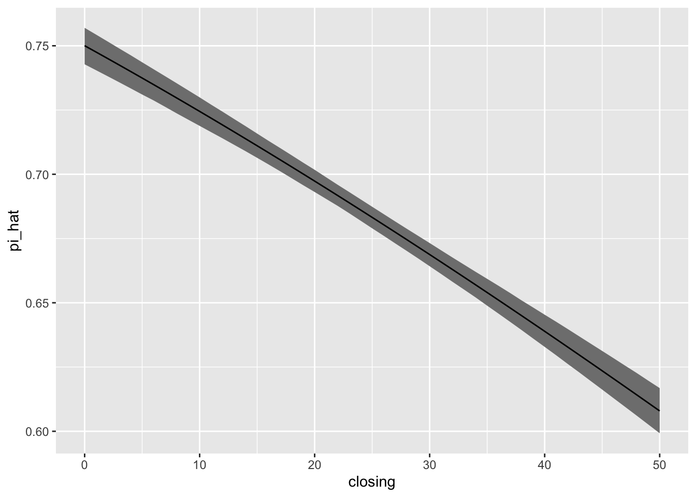
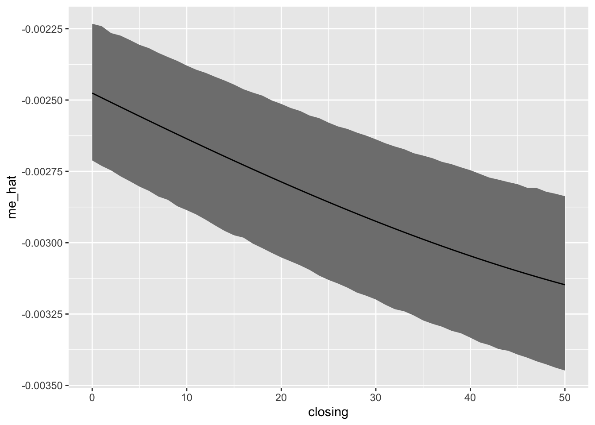

# Week 6: An Explosion of Quantities of Interest

This week, more than others, we will focus on several specific *papers* that are important to the practice of political methodology. They are:

1. King, Tomz, and Wittenberg (2001) on "informal posterior simulation"
1. Brambor, Clark, and Golder (2006) on "marginal effect plots"
1. Berry, Golder, and Milton (2012) on the hypotheses that one can/might derive from an interactive theory.
1. Berry, DeMeritt, and Esarey (2010) on interaction in logit and probit models, along with Rainey's (2016) critique.
1. Hanmer and Kalkan (2013) on the "average case" and "observed value" approaches.


## King, Tomz, and Wittenberg (2001)

King, Tomz, and Wittenberg (2001, KTW) suggest an alternative to the [non]parametric bootstrap (or delta method) to obtain confidence intervals for quantities of interest. I see their approach as simulation from an approximate posterior distribution. However, we might think of it as a faster version of the [non]parametric bootstrap. 

Suppose that we have ML estimates $\hat{\beta}$ and estimated covariance matrix $\widehat{\text{Var}}(\hat{\beta})$. Then we can approximate the [non]parametric bootstrap replications $\hat{\beta}^{bs}$ or the posterior simulations $\tilde{\beta}$ by sampling from $\tilde{\beta}^{KTW} \sim MVN(\hat{\beta}, \widehat{\text{Var}}(\hat{\beta}))$, where $MVN$ is the multivariate normal distribution.

We can then transform each simulation of $\tilde{\beta}^{KTW}_i$ into the quantity of interest $\tilde{\tau}^{KTW}_i = \tau \left( \tilde{\beta}^{KTW}_i \right)$ and compute a confidence interval using using the percentiles (the same way we would for the bootstrap replicates or posterior simulations of the quantity of interest).

In practice, while we can understand KTW's methods as a Bayesian method, we refer to the resulting intervals as "confidence intervals."


```r
# load data
scobit <- haven::read_dta("data/scobit.dta") %>%
  filter(newvote != -1) 

# fit model
f <- newvote ~ poly(neweduc, 2, raw = TRUE) + closing + poly(age, 2, raw = TRUE) + south + gov
fit <- glm(f, data = scobit, family = binomial)

# simulate beta_tildes using KTW's method
beta_tilde <- mvtnorm::rmvnorm(2000, mean = coef(fit), sigma = vcov(fit))

# print first few rows
head(beta_tilde)
```

```
##      (Intercept) poly(neweduc, 2, raw = TRUE)1 poly(neweduc, 2, raw = TRUE)2
## [1,]   -4.016289                     0.2016001                    0.03275628
## [2,]   -4.184576                     0.2821922                    0.02380006
## [3,]   -4.074789                     0.2246211                    0.03001892
## [4,]   -4.112547                     0.2467200                    0.02876137
## [5,]   -4.067749                     0.2195911                    0.03115172
## [6,]   -3.968551                     0.2339342                    0.02824499
##          closing poly(age, 2, raw = TRUE)1 poly(age, 2, raw = TRUE)2      south
## [1,] -0.01274338                 0.1143925             -0.0008225287 -0.2202267
## [2,] -0.01386391                 0.1165889             -0.0008484358 -0.1982116
## [3,] -0.01312896                 0.1161354             -0.0008398087 -0.1942506
## [4,] -0.01330758                 0.1134811             -0.0008103919 -0.1850737
## [5,] -0.01357771                 0.1165762             -0.0008417297 -0.2184424
## [6,] -0.01400237                 0.1140690             -0.0008290698 -0.2039914
##               gov
## [1,] -0.006397118
## [2,]  0.009583674
## [3,]  0.027583637
## [4,]  0.013763097
## [5,] -0.005852715
## [6,] -0.029716690
```

Now we "simply" need to compute the quantity of interest for the scenario(s) of interest. 

Let's use two examples, first, let's compute the predicted probability as `closing` varies from its minimum to its maximum. This will be a bit trickier than using `predict()` because we need to do the matrix multiplication manually.

You should work through this code carefully. It's subtle, but *critical*.


```r
# create scenario of interest
scenario <- tibble(
  neweduc = median(scobit$neweduc),
  closing = min(scobit$closing):max(scobit$closing),
  age = median(scobit$age),
  south = median(scobit$south),
  gov = median(scobit$gov)) 

# convert scenario data frame to matrix X_s
f_scenario <- update(f, NULL ~ .)  # remove lhs for use below
mf <- model.frame(f_scenario, scenario)
X_s <- model.matrix(mf, scenario)

# transform simulations of beta into eta and pi
eta_tilde <- X_s%*%t(beta_tilde)  # simulations of linear predictor
pi_tilde <- plogis(eta_tilde)  # simulations of expected value or, in this case, "predicted probability"

# compute 90% ci with percentiles
pi_ci <- apply(pi_tilde, 1, quantile, probs = c(0.05, 0.95))

# compute ML estimates
# note: we could use predict(), but I do the matrix computations
# another note: I don't recommend using the mean of the *_tildes
eta_hat <- X_s%*%coef(fit)
pi_hat <- plogis(eta_hat)

# add all of this back into scenario
scenario$pi_hat <- pi_hat
scenario$pi_lwr <- pi_ci[1, ]
scenario$pi_upr <- pi_ci[2, ]

# plot the results
ggplot(scenario, aes(x = closing, y = pi_hat, ymin = pi_lwr, ymax = pi_upr)) + 
  geom_ribbon(fill = "grey50") + 
  geom_line()
```



Now let's use KTW's method to obtain a 90% CI around the first-difference as `closing` in increases from its 25th to its 75th percentile.


```r
# create scenarios of interest
scenario_lo <- tibble(
  neweduc = median(scobit$neweduc),
  closing = quantile(scobit$closing, probs = 0.0),
  age = median(scobit$age),
  south = median(scobit$south),
  gov = median(scobit$gov))
scenario_hi <- tibble(
  neweduc = median(scobit$neweduc),
  closing = quantile(scobit$closing, probs = 1.0),
  age = median(scobit$age),
  south = median(scobit$south),
  gov = median(scobit$gov))

# convert scenario data frame to matrix X_s
f_scenario <- update(f, NULL ~ .)  # remove lhs for use below
mf_lo <- model.frame(f_scenario, scenario_lo)
X_lo <- model.matrix(mf, scenario_lo)
mf_hi <- model.frame(f_scenario, scenario_hi)
X_hi <- model.matrix(mf, scenario_hi)

# transform simulations of beta into eta, pi, and fd
eta_lo_tilde <- X_lo%*%t(beta_tilde)  # simulations of linear predictor
eta_hi_tilde <- X_hi%*%t(beta_tilde)
pi_lo_tilde <- plogis(eta_lo_tilde)  # simulations of expected value or, in this case, "predicted probability"
pi_hi_tilde <- plogis(eta_hi_tilde) 
fd_tilde <- as.numeric(pi_hi_tilde - pi_lo_tilde) # simulations of first-difference; as.numeric() needed b/c it's a matrix and I to simplify it to a vector

# compute 90% ci with percentiles
fd_ci <- quantile(fd_tilde, probs = c(0.05, 0.95))

# compute ML estimates
# note: we could use predict(), but I do the matrix computations; predict() will be more reliable
# another note: I don't recommend using the mean of the *_tildes
eta_lo_hat <- X_lo%*%coef(fit)
eta_hi_hat <- X_hi%*%coef(fit)
pi_lo_hat <- plogis(eta_lo_hat)
pi_hi_hat <- plogis(eta_hi_hat)
fd_hat <- pi_hi_hat - pi_lo_hat

# print the results
print(fd_hat, digits = 2)
```

```
##    [,1]
## 1 -0.14
```

```r
print(fd_ci, digits = 4)
```

```
##      5%     95% 
## -0.1554 -0.1284
```

```r
# plot the results
ggplot(scenario, aes(x = closing, y = pi_hat, ymin = pi_lwr, ymax = pi_upr)) + 
  geom_ribbon(fill = "grey50") + 
  geom_line()
```


And lastly, for the marginal effect of `closing` as closing varies from its minimum to it's maximum.


```r
# create scenario of interest
scenario <- tibble(
  neweduc = median(scobit$neweduc),
  closing = min(scobit$closing):max(scobit$closing),
  age = median(scobit$age),
  south = median(scobit$south),
  gov = median(scobit$gov)) 

# convert scenario data frame to matrix X_s
f_scenario <- update(f, NULL ~ .)  # remove lhs for use below
mf <- model.frame(f_scenario, scenario)
X_s <- model.matrix(mf, scenario)

# transform simulations of beta into eta, pi, and me
eta_tilde <- X_s%*%t(beta_tilde)  # simulations of linear predictor
pi_tilde <- plogis(eta_tilde)  # simulations of expected value or, in this case, "predicted probability"
me_tilde <- beta_tilde[, "closing"]*pi_tilde*(1 - pi_tilde)

# compute 90% ci with percentiles
me_ci <- apply(me_tilde, 1, quantile, probs = c(0.05, 0.95))

# compute ML estimates
# note: we could use predict(), but I do the matrix computations
# another note: I don't recommend using the mean of the *_tildes
eta_hat <- X_s%*%coef(fit)
pi_hat <- plogis(eta_hat)
me_hat <- coef(fit)["closing"]*pi_hat*(1 - pi_hat)
  
# add all of this back into scenario
scenario$me_hat <- me_hat
scenario$me_lwr <- me_ci[1, ]
scenario$me_upr <- me_ci[2, ]

# plot the results
ggplot(scenario, aes(x = closing, y = me_hat, ymin = me_lwr, ymax = me_upr)) + 
  geom_ribbon(fill = "grey50") + 
  geom_line()
```


