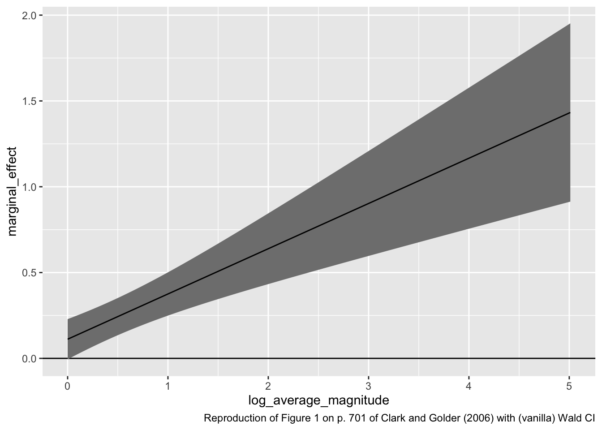
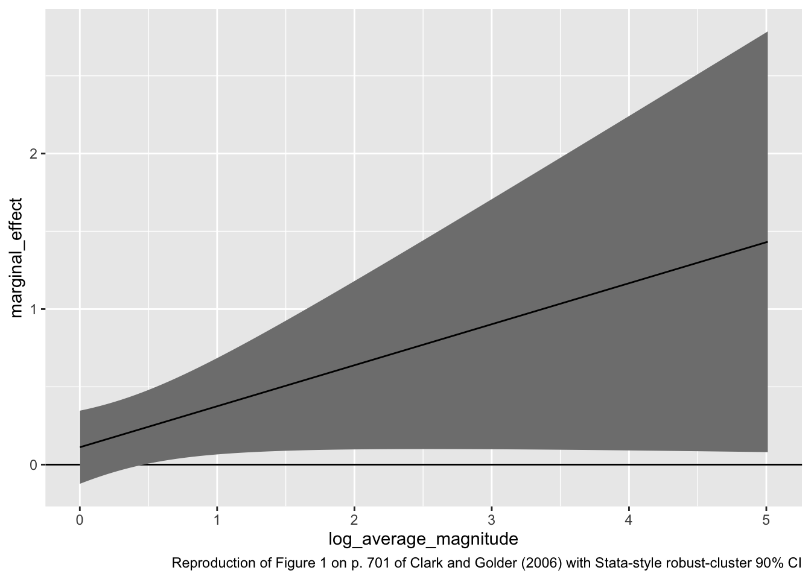

## Brambor, Clark, and Golder (2006)

Brambor, Clark, and Golder (2006, BCG) suggest the use of "marginal effects plots" to understand marginal effects in multiplicative interaction models.

In the case of a linear model, we can write the expected value of the outcome $y$ for a particular scenario $X_s$ as

$$
E(y \mid X_s) = \beta_0 + \beta_x x_s + \beta_z z_s + \beta_{xz} x_s z_s + \text{possibly other terms}.
$$

By taking the first derivative wrt to $x_s$, we can see that the marginal effect of $x_s$ depend on the value of $z_s$.

$$
\frac{\partial E(y \mid X_s)}{\partial x_s} = \beta_x + \beta_{xz} z_s.
$$

Importantly, we can compute the standard error (and then the Wald CI) for this marginal effect

$$
\widehat{\text{SE}} \left( \frac{\partial E(y \mid X_s)}{\partial x_s} \right) = \sqrt{\widehat{\text{Var}}(\hat{\beta_x}) + z_s^2\widehat{\text{Var}}(\hat{\beta_{xz}}) + 2z_s\widehat{\text{Cov}}(\hat{\beta_{x}}, \hat{\beta_{xz}})},
$$

where the variance and covariance terms refer to the respective elements from the covariance matrix (i.e., `vcov()`).

As an example, let's reproduce Figure 1 on p. 701 of Clark and Golder (2006). They use a slightly different approach to compute estimate their standard errors, so my standard errors are somewhat smaller. 


```r
# load data
cg <- read_csv("data/parties.csv") %>%
  filter(established_democracy == 1)  # keep only established democracies
```

```
## Rows: 555 Columns: 11
## ── Column specification ────────────────────────────────────────────────────────
## Delimiter: ","
## chr (3): country, social_heterogeneity, electoral_system
## dbl (8): year, average_magnitude, eneg, enep, upper_tier, en_pres, proximity...
## 
## ℹ Use `spec()` to retrieve the full column specification for this data.
## ℹ Specify the column types or set `show_col_types = FALSE` to quiet this message.
```

```r
# fit model; reproduces coefficients reported in Table 2, p. 698, 1946-2000 Established Democracys of Clark and Golder (2006)
fit <- lm(enep ~ eneg*log(average_magnitude) + eneg*upper_tier + en_pres*proximity, data = cg)

# extract estimates
beta_hat <- coef(fit)
sigma_hat <- vcov(fit)

# compute marginal effects and ses
z <- seq(min(log(cg$average_magnitude)), max(log(cg$average_magnitude)), length.out = 100)
me <- beta_hat["eneg"] + beta_hat["eneg:log(average_magnitude)"]*z
se <- sqrt(sigma_hat["eneg", "eneg"] + 
             (z^2)*sigma_hat["eneg:log(average_magnitude)", "eneg:log(average_magnitude)"] + 
             2*z*sigma_hat["eneg", "eneg:log(average_magnitude)"])

# put into tibble and plot
gg_data <- tibble(log_average_magnitude = z,
       marginal_effect = me, 
       se = se)
ggplot(gg_data, aes(x = log_average_magnitude,
                    y = marginal_effect,
                    ymin = marginal_effect - 1.64*se,
                    ymax = marginal_effect + 1.64*se)) + 
  geom_hline(yintercept = 0) + 
  geom_ribbon(fill = "grey50") + 
  geom_line() + 
  labs(caption = "Reproduction of Figure 1 on p. 701 of Clark and Golder (2006) with (vanilla) Wald CI")
```



To reproduce their "cluster robust" standard errors from Stata, we could do the following, which reproduces the top panel (a) of Figure 1 on p. 701. The code below only changes the calculation for `sigma_hat`.


```r
# calculate cluster-robust standard errors Stata-style
M <- length(unique(cg$country))
N <- length(cg$country)
K <- fit$rank
dfc <- (M/(M - 1)) * ((N - 1)/(N - K))
uj <- apply(sandwich::estfun(fit), 2, function(x) tapply(x, cg$country, sum));
uj <- na.omit(uj)
sigma_hat <- dfc * sandwich::sandwich(fit, meat = crossprod(uj)/N)

# re-compute the standard errors of the marginal effect
se <- sqrt(sigma_hat["eneg", "eneg"] + 
             (z^2)*sigma_hat["eneg:log(average_magnitude)", "eneg:log(average_magnitude)"] + 
             2*z*sigma_hat["eneg", "eneg:log(average_magnitude)"])

# put into tibble and plot
gg_data <- tibble(log_average_magnitude = z,
       marginal_effect = me, 
       se = se)
ggplot(gg_data, aes(x = log_average_magnitude,
                    y = marginal_effect,
                    ymin = marginal_effect - 1.64*se,
                    ymax = marginal_effect + 1.64*se)) + 
  geom_hline(yintercept = 0) + 
  geom_ribbon(fill = "grey50") + 
  geom_line() + 
  labs(caption = "Reproduction of Figure 1 on p. 701 of Clark and Golder (2006) with Stata-style robust-cluster 90% CI")
```



### A Warning about Misinterpreting Marginal Effect Plots

In their Table 2 (final column; 1946-2000, Established Democracies), the coefficient for the product term $\text{ENEG} \times \log(\text{Avg. Magnitude})$ is *not* statistically significant. Regardless of the look of the marginal effect plot, one cannot confidently conclude that the effect of $X$ varies with $Z$ if the coefficient for the product term is not statistically significant.


In the marginal effect plot above, the estimated marginal effect of ENEG is (relatively) small and not statistically significant when the average magnitude is low, but the estimated effect is (relatively larger) and statistically significant when the average magnitude is large. When this happens, you **will** (not *might*, *will*) be tempted to conclude that the effect of $X$ changes with $Z$. However, **that is wrong**. You must remember that the difference between an estimate that is statistically significant (e.g., the RHS of the figure above) and another estimate that is not statistically significant (e.g., the LHS of the figure above) is not necessary statistically significant. (Read that last sentence again; it's subtle but critical.)

To illustrate the temptation, here's what Clark and Golder write about the marginal effect plot on p. 700.

> On the other hand, the coefficient on $\text{Ethic} \times \ln(\text{Magnitude})$ is positive and significant in only half of the models. However, it is important to remember that we are not primarily interested in whether the coefficient on this interaction term is significant. Instead, what we really want to know is whether the marginal effect of ethnic heterogeneity is positive and significant once the electoral system becomes sufficiently permissive... All three figures [including the one reproduced above] clearly illustrate that in established democracies, ethnic heterogeneity significantly increases the number of parties once the electoral system is sufficiently permissive. This is exactly what Duverger’s theory predicts. To be more specific, Figure 1a [the one reproduced above], based on the pooled model with established democracies, indicates that ethnic heterogeneity will increase the number of electoral parties once we move beyond nonpermissive electoral systems with single-member districts—when $\ln(\text{Magnitude}) = 0$.

In this summary, I see three claims:

1. When the magnitude is one (i.e., single-member districts), the effect of social heterogeneity should be negligible.
1. When the magnitude is large (i.e., large-magnitude PR systems), the effect of social heterogeneity should be positive (and meaningful).
1. The effect of social heterogeneity should increase with district magnitude.

From the information above, we have tests of each of these claims:

1. In single-member district systems (the far left side of the figure above), the effect of ENEG is *not* statistically significant. The confidence interval goes up to about 0.4, so we can reject the null hypothesis that the effect is larger than 0.4. This would mean almost one-half of a party for each new ethnic group---this seems like a meaningful effect to me. Most importantly, though, the absence of statistical significance is not evidence that the effect is zero. 
1. In large-magnitude PR systems (the right side of the figure above), the effect of ENEG is statistically significant. So we can reject the null hypothesis that ENEG has no effect in these systems. However, the confidence interval *almost* reaches zero (down to about $\frac{1}{20}$), so we cannot reject the null hypothesis that the effect is negligible (and, by implication, conclude that the effect is meaningful).
1. The coefficient for the product term is not statistically significant, so we cannot reject the null hypothesis that the effect of ENEG is the same across these different electoral systems. In other words, we reject the hypothesis that the line showing the marginal effect plot in the figure above is flat (or even slightly negative).

In sum: is the effect of ENEG positive in large-magnitude PR systems? Yes. Is it also positive in single-member district systems? Maybe. Is the effect the same in single-member district systems? Maybe. When stated this way, Clark and Golder's marginal effect plot presents less evidence for their theory than it initially seems.

Marginal effect plots are a valuable tool for thinking about interaction effects. In my view, they are an indispensible tool. However, they tempt the researcher to draw conclusions that might not be warranted, so please keep these temptations in mind.

Berry, Golder, and Milton (2012) offer a valuable follow-up to Brambor, Clark, and Golder (2006). I highly recommend implementing their suggestions.

## Berry, Golder, and Milton (2012)

Berry, Golder, and Milton (2012, BGM) update BCG's suggestions by providing a specific collection of hypotheses that they suggest researchers posit and test.

They suggest that for each interactive hypothesis, there are actually five quantities of interest that the research hypothesize.

1. $\frac{\partial E(y \mid X_{z_s = \text{lo}})}{\partial x_s}$: the effect of $x_s$ when $z_s$ takes on a low value.
1. $\frac{\partial E(y \mid X_{z_s=\text{hi}})}{\partial x_s}$: the effect of $x_s$ when $z_s$ takes on a high value.
1. $\frac{\partial E(y \mid X_{x_s=\text{lo}})}{\partial z_s}$: the effect of $z_s$ when $x_s$ takes on a low value.
1. $\frac{\partial E(y \mid X_{x=\text{hi}})}{\partial z_s}$: the effect of $z_s$ when $x_s$ takes on a high value.
1. $\frac{\partial E(y \mid X_{s})}{\partial x_s\partial z_s}$: the "interaction effect;" the effect of $z_s$ on the effect of $x_s$ on $(y \mid X_{s})$. This quantity is symmetric, so it's equivalent to the effect of $x_s$ on the effect of $z_s$ on $(y \mid X_{s})$.

In order to fully evaluate all five possible hypotheses, they suggest two marginal effect plots and reporting the statistical significance of the product term.


```r
# load data
cg <- read_csv("data/parties.csv") %>%
  filter(established_democracy == 1)  # keep only established democracies

# fit model; reproduces coefficients reported in Table 2, p. 698, 1946-2000 Established Democracys of Clark and Golder (2006)
fit <- lm(enep ~ eneg*log(average_magnitude) + eneg*upper_tier + en_pres*proximity, data = cg)

# extract coefficient estimates
beta_hat <- coef(fit)

# calculate cluster-robust standard errors Stata-style (rather than the vanilla vcov())
M <- length(unique(cg$country))
N <- length(cg$country)
K <- fit$rank
dfc <- (M/(M - 1)) * ((N - 1)/(N - K))
uj <- apply(sandwich::estfun(fit), 2, function(x) tapply(x, cg$country, sum));
uj <- na.omit(uj)
sigma_hat <- dfc * sandwich::sandwich(fit, meat = crossprod(uj)/N)

# compute marginal effects and ses
z <- seq(min(log(cg$average_magnitude)), max(log(cg$average_magnitude)), length.out = 100)
me <- beta_hat["eneg"] + beta_hat["eneg:log(average_magnitude)"]*z
se <- sqrt(sigma_hat["eneg", "eneg"] + 
             (z^2)*sigma_hat["eneg:log(average_magnitude)", "eneg:log(average_magnitude)"] + 
             2*z*sigma_hat["eneg", "eneg:log(average_magnitude)"])
gg_data <- tibble(log_average_magnitude = z,
       marginal_effect = me, 
       se = se)

# plot the marginal effects
gg0 <- ggplot(gg_data, aes(x = log_average_magnitude,
                    y = marginal_effect,
                    ymin = marginal_effect - 1.64*se,
                    ymax = marginal_effect + 1.64*se)) + 
  geom_hline(yintercept = 0) + 
  geom_ribbon(fill = "grey10", alpha = 0.5) + 
  geom_line() + 
  geom_rug(data = cg, aes(x = log(average_magnitude), 
                          y = NULL, ymin=NULL, ymax = NULL), 
           sides = "b", alpha = 0.2) + 
  labs(x = "log(Average Magnitude)",
       y = "The Marginal Effect of ENEG") + 
  theme_bw()

# now add the histogram; which is harder than I expected
# I used three steps
# 1. compute the bins and counts manually
# 2. grab the axis limits of the me plot
# 3. add the rectangles (rescaled appropriately) *underneath* the layers of the me plot

## first, compute the counts for each bin, manually 
x <- log(cg$average_magnitude)  # variable to histogram (makes code below easier to read)
n_breaks <- 30                  # number of breaks
breaks <- seq(from = min(x), 
              to = max(x), 
              length.out = n_breaks)
### a loop to compute the information for each bin (loop for correctness)
n_bins <- n_breaks - 1
lwr <- upr <- count <- numeric(n_bins)
for (i in 1:n_bins) {
  lwr[i] <- breaks[i]
  upr[i] <- breaks[i + 1]
  count[i] <- ifelse(i == 1, 
                  sum(x <= upr[i] & x >= lwr[i]),  # 1st bin is closed on both sides
                  sum(x <= upr[i] & x  > lwr[i]))  # subsequent bins are open on the left
}
gg_hist <- tibble(lwr, upr, count) %>%
  mutate(rescaled_count = count/max(count))  # rescale counts so that largest is one

## second, get the limits of the marginal effects plot
get_plot_limits <- function(plot) {
    gb = ggplot_build(plot)
    xmin = gb$layout$panel_params[[1]]$x.range[1]
    xmax = gb$layout$panel_params[[1]]$x.range[2]
    ymin = gb$layout$panel_params[[1]]$y.range[1]
    ymax = gb$layout$panel_params[[1]]$y.range[2]
    list(xmin = xmin, xmax = xmax, ymin = ymin, ymax = ymax)
}
lim0 <- get_plot_limits(gg0)


## third, nsert rectangles underneath current layers, rescaling bars to fit vertical axis

### a function to add a layer underneath
### ref: https://stackoverflow.com/questions/20249653/insert-layer-underneath-existing-layers-in-ggplot2-object
`-.gg` <- function(plot, layer) {
    if (missing(layer)) {
        stop("Cannot use `-.gg()` with a single argument. Did you accidentally put - on a new line?")
    }
    if (!is.ggplot(plot)) {
        stop('Need a plot on the left side')
    }
    plot$layers = c(layer, plot$layers)
    plot
}

### create an interaction term report to add to the top of the figure
est <- beta_hat["eneg:log(average_magnitude)"]
se <- sqrt(sigma_hat["eneg:log(average_magnitude)", "eneg:log(average_magnitude)"])
ci_upr <- est + 1.64*se
ci_lwr <- est - 1.64*se
interaction_report <- paste0("Estimated coefficient for product term is not statistically significant (Est. = ",
                             round(est, 2), "; 90% CI = [", round(ci_lwr, 2), ", ", round(ci_upr, 2), "])")
### add histogram and interaction report
gg0 -  # minus adds layer "underneath" the others
  geom_rect(data = gg_hist, aes(xmin = lwr, 
                                xmax = upr, 
                                ymin = 0 + lim0$ymin, 
                                ymax = 1.0*rescaled_count*(lim0$ymax - lim0$ymin)  + lim0$ymin, 
                                x = NULL, y = NULL), 
            alpha = 0.2)  + 
  # now add product term notes
  annotate("text", 
           x = (lim0$xmin + lim0$xmax)/2, 
           y = 0.98*(lim0$ymax - lim0$ymin) + lim0$ymin, 
           label = interaction_report, 
           size = 3)
```


Now we reverse the role of magnitude and ENEG in the marginal effect plot and do the whole think again.


```r
# compute marginal effects and ses
z <- seq(min(cg$eneg), max(cg$eneg), length.out = 100)
me <- beta_hat["log(average_magnitude)"] + beta_hat["eneg:log(average_magnitude)"]*z
se <- sqrt(sigma_hat["log(average_magnitude)", "log(average_magnitude)"] + 
             (z^2)*sigma_hat["eneg:log(average_magnitude)", "eneg:log(average_magnitude)"] + 
             2*z*sigma_hat["log(average_magnitude)", "eneg:log(average_magnitude)"])
gg_data <- tibble(eneg = z,
       marginal_effect = me, 
       se = se)

gg0 <- ggplot(gg_data, aes(x = eneg,
                    y = marginal_effect,
                    ymin = marginal_effect - 1.64*se,
                    ymax = marginal_effect + 1.64*se)) + 
  geom_hline(yintercept = 0) + 
  geom_ribbon(fill = "grey10", alpha = 0.5) + 
  geom_line() + 
  geom_rug(data = cg, aes(x = eneg, 
                          y = NULL, ymin=NULL, ymax = NULL), 
           sides = "b", alpha = 0.2) + 
  labs(x = "ENEG",
       y = "The Marginal Effect of log(Average Magnitude)",
       caption = "Reproduction of Figure 1 on p. 701 of Clark and Golder (2006)") + 
  theme_bw()

# now add the histogram; which is harder than I expected
# I used three steps
# 1. compute the bins and counts manually
# 2. grab the axis limits of the me plot
# 3. add the rectangles (rescaled appropriately) *underneath* the layers of the me plot

## first, compute the counts for each bin, manually 
x <- cg$eneg  # variable to histogram (makes code below easier to read)
n_breaks <- 30                  # number of breaks
breaks <- seq(from = min(x), 
              to = max(x), 
              length.out = n_breaks)
### a loop to compute the information for each bin (loop for correctness)
n_bins <- n_breaks - 1
lwr <- upr <- count <- numeric(n_bins)
for (i in 1:n_bins) {
  lwr[i] <- breaks[i]
  upr[i] <- breaks[i + 1]
  count[i] <- ifelse(i == 1, 
                  sum(x <= upr[i] & x >= lwr[i]),  # 1st bin is closed on both sides
                  sum(x <= upr[i] & x  > lwr[i]))  # subsequent bins are open on the left
}
gg_hist <- tibble(lwr, upr, count) %>%
  mutate(rescaled_count = count/max(count))  # rescale counts so that largest is one

## second, get the limits of the marginal effects plot
get_plot_limits <- function(plot) {
    gb = ggplot_build(plot)
    xmin = gb$layout$panel_params[[1]]$x.range[1]
    xmax = gb$layout$panel_params[[1]]$x.range[2]
    ymin = gb$layout$panel_params[[1]]$y.range[1]
    ymax = gb$layout$panel_params[[1]]$y.range[2]
    list(xmin = xmin, xmax = xmax, ymin = ymin, ymax = ymax)
}
lim0 <- get_plot_limits(gg0)


## third, nsert rectangles underneath current layers, rescaling bars to fit vertical axis
## ref: https://stackoverflow.com/questions/20249653/insert-layer-underneath-existing-layers-in-ggplot2-object
`-.gg` <- function(plot, layer) {
    if (missing(layer)) {
        stop("Cannot use `-.gg()` with a single argument. Did you accidentally put - on a new line?")
    }
    if (!is.ggplot(plot)) {
        stop('Need a plot on the left side')
    }
    plot$layers = c(layer, plot$layers)
    plot
}

gg0 -  # minus adds layer "underneath" the others
  geom_rect(data = gg_hist, aes(xmin = lwr, 
                                xmax = upr, 
                                ymin = 0 + lim0$ymin, 
                                ymax = 1.0*rescaled_count*(lim0$ymax - lim0$ymin)  + lim0$ymin, 
                                x = NULL, y = NULL), 
            alpha = 0.2)  + 
  # now add product term notes
  annotate("text", 
           x = (lim0$xmin + lim0$xmax)/2, 
           y = 0.98*(lim0$ymax - lim0$ymin) + lim0$ymin, 
           label = interaction_report, 
           size = 3)
```


