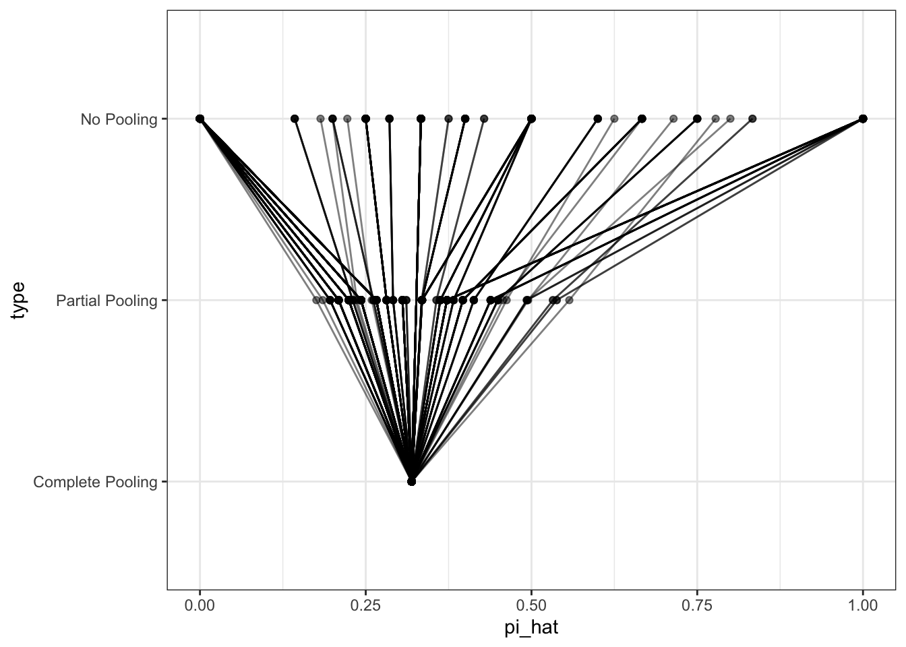

# Week 12: Hierarchical Models


This week, I introduce the idea of a hierarchical model. These fall *a little* outside our standard probability model framework, but require only adding a small idea--the hierarchical bit--to the right-hand side of our models.

## Example: Contact in Finland

In my dissertation, I was interested in how survey self-reports of being contacted by a political party varies across electoral districts. You can see [here](http://www.carlislerainey.com/papers/stratmob.pdf) for the details. For now, let's just estimate the proportion of people in each district that are contacted by a party.

Let's start with Finland.


```r
# load survey data from finland
finland_raw <- read_csv("data/finland.csv") %>%
  glimpse()
```

```
## Rows: 1192 Columns: 2
## ── Column specification ────────────────────────────────────────────────────────
## Delimiter: ","
## dbl (2): District, Contacted
## 
## ℹ Use `spec()` to retrieve the full column specification for this data.
## ℹ Specify the column types or set `show_col_types = FALSE` to quiet this message.
```

```
## Rows: 1,192
## Columns: 2
## $ District  <dbl> 304, 313, 313, 310, 310, 304, 304, 304, 304, 304, 304, 304, …
## $ Contacted <dbl> 0, 0, 1, 0, 1, 1, 0, 0, 0, 1, 0, 0, 0, 0, 0, 0, 1, 0, 1, 1, …
```

It will be convenient in later steps to have `District` be a factor, so let's do that now.


```r
# prep the data for plotting
finland <- finland_raw %>%
  # mutate District to factor ordered by contact rate
  mutate(District = as.factor(District), 
         District = reorder(District, Contacted)) %>%
  glimpse()
```

```
## Rows: 1,192
## Columns: 2
## $ District  <fct> 304, 313, 313, 310, 310, 304, 304, 304, 304, 304, 304, 304, …
## $ Contacted <dbl> 0, 0, 1, 0, 1, 1, 0, 0, 0, 1, 0, 0, 0, 0, 0, 0, 1, 0, 1, 1, …
```

The `Contacted` variable equals 1 if the respondent self-reported being contacted by a political party and 0 if they report not being contacted by a political party (and listwise deleted if missing). The `Distct` variable is an ID number for the electoral district (internal to my analysis).

A scatterplot is a safe and potentially informative way to start.


```r
gg1 <- ggplot(finland, aes(x = District, y = Contacted)) + 
  geom_jitter(shape = 21, alpha = 0.5, size = 1) + 
  theme_bw()
print(gg1)
```


Now let's estimate the probability of being contacted by a political party in each district.

Startt by writing down a probability model for being contacted. This is a binary outcome, so if we're going to assume (conditional) independence, it must be Bernoulli.

$$
\text{Contacted}_i \sim \text{Bernoulli}(\pi_j),
$$
where $i$ indexes the respondent and $j$ indexes the electoral district.

Remember that the ML estimate of $\pi$ is just the sample mean (or sample proportion). We can do this easily for each district with `group_by()` and `summarize()`. Let's also add an estimate of the standard error using $\widehat{\text{SE}}(\hat{\pi}_j) = \frac{\sqrt{\hat{\pi}_j(1 - \hat{\pi}_j)}}{\sqrt{n}}$.


```r
estimates <- finland %>%
  group_by(District) %>%
  summarize(pi_hat = mean(Contacted),
            n = n(),
            se_hat = sqrt(pi_hat*(1 - pi_hat))/sqrt(n)) %>%
  glimpse()
```

```
## Rows: 14
## Columns: 4
## $ District <fct> 312, 316, 305, 315, 306, 310, 311, 304, 307, 317, 314, 313, 3…
## $ pi_hat   <dbl> 0.08955224, 0.11904762, 0.13043478, 0.13461538, 0.17073171, 0…
## $ n        <int> 67, 42, 46, 52, 41, 196, 91, 171, 106, 72, 117, 79, 87, 25
## $ se_hat   <dbl> 0.03488417, 0.04997030, 0.04965567, 0.04733150, 0.05876418, 0…
```

Now let's add these estimates to the scatterplot.


```r
gg2 <- gg1 + 
  geom_errorbar(data = estimates, aes(ymin = pi_hat - 1.64*se_hat,
                                      ymax = pi_hat + 1.64*se_hat, 
                                      y = NULL),
                width = .2, color = "#1b9e77") + 
  geom_point(data = estimates, aes(y = pi_hat), 
             color = "#1b9e77", size = 2)
print(gg2)
```


You can see that the confidence intervals (and sample size) varies by district, so let's add that information to the plot.


```r
gg3 <- gg2 + 
  geom_label(data = estimates, aes(y = pi_hat + 1.64*se_hat,
                                   label = n),
                color = "#1b9e77",
             vjust = -0.2)
print(gg3)
```


Great! Now we're done. We've got ML estimates of the contact rate for all districts. 

But wait... can we do better?

Let's look at district 309 on the far right. We our estimate of the contact rate in this district is the highest. It is also the district with the smallest sample.

Our estimator $\hat{pi}$ is unbiased, but if you had to say, would you say that the turnout rate in district 309 was higher or lower than $\hat{\pi}_{309} = 0.40$?

If your intuition matches mine, you will say *lower*. Why? This "why?" is an important question.

If you think that $\hat{\pi}$ is a good estimator, but you suddenly want to adjust this particular estimate, you must have additional information coming from somewhere. Where?

The answer: the *other districts*. We admit that the contact rate will be different across districts, but it also seems reasonable to assume they will be similar (that's "different, but similar"). Given that 309 has a small sample and looks relatively unlike the other estimates, we want to pull it down *slighly* toward the other estimates.

This is exactly the intuition of hierarchical models. Let's write down this "different, but similar" intuition. To do this, it will be convenient to have our $\pi_j$s on the logit scale.

Start with the likelihood.

$$
\text{Contacted}_i \sim \text{Bernoulli}(\pi_j)
$$

Now tranlate the $\pi$s to the logit scale.

$$
\pi_j = \text{\logit}^{-1}(\alpha_j)
$$
Each of these $\alpha_j$s is like a constant term in a logit model with no covariates. (We could add covariates, but that makes the example less clear.)

Now for the hiearchical part: we want to capture the notion that these $\alpha_j$s are different *but similar*. We can do that by modeling them as draws from normal distribution.

$$
\alpha_j \sim N(\mu, \sigma^2)
$$
The we can estimate $\mu$ (the "typical" $\alpha$) and $\sigma$ (the degree of similarity) from the data. This last portion is the "hierarchical piece." We sometimes refer to batches of parameters modeled as draws from a distribution as "random effects."

To estimate the hierarchical model, use can use ML via the `lme4::lmer()`/`lme4::glmer()` function or MCMC via the `rstanarm::stan_lmer()`/`rstanarm::stan_glmer()` function. The `*lmer()`/*`glmer()` function have the same distinction as the `lm()`/`glm()` functions, but the `*er()` variants allow random effects.


```r
library(lme4)
```

```
## Loading required package: Matrix
```

```
## 
## Attaching package: 'Matrix'
```

```
## The following objects are masked from 'package:tidyr':
## 
##     expand, pack, unpack
```

```r
fit <- glmer(Contacted ~ (1 | District), 
             data = finland,
             family = binomial)

arm::display(fit)
```

```
## glmer(formula = Contacted ~ (1 | District), data = finland, family = binomial)
## coef.est  coef.se 
##    -1.36     0.11 
## 
## Error terms:
##  Groups   Name        Std.Dev.
##  District (Intercept) 0.28    
##  Residual             1.00    
## ---
## number of obs: 1192, groups: District, 14
## AIC = 1222.7, DIC = 1185.4
## deviance = 1202.0
```

From the output above, we estimate $mu$ as -1.36 and $\sigma$ as 0.28. That is, the $\alpha_j$s are about -1.36 give-or-take 0.28 or so.

But here's the useful part. We can take this $\hat{\mu}$ and $\hat{\sigma}$ and use them as a Bayesian prior for the individual $\alpha_j$s. Each $\alpha_j$ has a likelihood (using the data from that district) and a prior (using $\hat{\mu}$ and $\hat{\sigma}$).


```r
re <- ranef(fit)$District[, "(Intercept)"] # this is centered at zero (i.e., alpha - mu)
fe <- fixef(fit)["(Intercept)"]  # mu

alpha_hat <- fe + re
pi_hat <- plogis(fe + re)
```

In this case, it's easy to use `predict()` to get this same estimates. (The `predict()` approach is a little safer because it's easier to keep the `pi_hat` and the `Distrit` label together.)


```r
hier_estimates <- tibble(District = unique(finland$District)) %>%
  mutate(pi_hat = predict(fit, newdata = ., type = "response")) %>%
  glimpse()
```

```
## Rows: 14
## Columns: 2
## $ District <fct> 304, 313, 310, 309, 312, 311, 307, 317, 314, 308, 305, 316, 3…
## $ pi_hat   <dbl> 0.2168025, 0.2430919, 0.1825310, 0.2553104, 0.1541672, 0.1892…
```

We can add this to our plot to see how the estimates changed. Notice that our new estimate for 309 is now at the very bottom of our initial confidence interval.


```r
gg4 <- gg3 + 
  geom_point(data = hier_estimates,
             aes(y = pi_hat), 
             color = "#d95f02",
             shape = 10, size = 3)

print(gg4)
```


We can compare the initial ML estimates to the hierarchical model estimates.


```r
comb <- bind_rows(list("initial ML" = estimates,
                       "hierarchical" = hier_estimates), 
                  .id = "type") %>%
  glimpse()
```

```
## Rows: 28
## Columns: 5
## $ type     <chr> "initial ML", "initial ML", "initial ML", "initial ML", "init…
## $ District <fct> 312, 316, 305, 315, 306, 310, 311, 304, 307, 317, 314, 313, 3…
## $ pi_hat   <dbl> 0.08955224, 0.11904762, 0.13043478, 0.13461538, 0.17073171, 0…
## $ n        <int> 67, 42, 46, 52, 41, 196, 91, 171, 106, 72, 117, 79, 87, 25, N…
## $ se_hat   <dbl> 0.03488417, 0.04997030, 0.04965567, 0.04733150, 0.05876418, 0…
```

```r
ggplot(comb, aes(x = pi_hat, y = type)) + 
  geom_point(alpha = 0.5) + 
  geom_line(aes(group = District), alpha = 0.5) + 
  theme_bw()
```


It's helpful to think of these approaches in terms of the amount of information they borrow across groups.

1. **No Pooling.** Assume the groups are different, and that nothing can be learned from the other groups. Estimate each group separately. 
1. **Complete Pooling**. Assume the groups are identical. Collapse all the groups together to estimate the single, common estimate.
1. **Partial Pooling**. A compromise between the two extremes above. Assume the groups are different, *but similar*. Estimate the amount of similarity using the data, and pool the estimates toward a common estimate accordingly.

We did not implement complete pooling above, but we can do it here to compare the three approaches. 


```r
common_estimate <- tibble(District = unique(finland$District)) %>%
  mutate(pi_hat = mean(finland$Contacted)) %>%
  glimpse()
```

```
## Rows: 14
## Columns: 2
## $ District <fct> 304, 313, 310, 309, 312, 311, 307, 317, 314, 308, 305, 316, 3…
## $ pi_hat   <dbl> 0.2088926, 0.2088926, 0.2088926, 0.2088926, 0.2088926, 0.2088…
```

```r
comb <- bind_rows(list("No Pooling" = estimates,
                       "Partial Pooling" = hier_estimates,
                       "Complete Pooling" = common_estimate), 
                  .id = "type") %>%
  mutate(type = reorder(type, pi_hat, var)) %>%
  glimpse()
```

```
## Rows: 42
## Columns: 5
## $ type     <fct> No Pooling, No Pooling, No Pooling, No Pooling, No Pooling, N…
## $ District <fct> 312, 316, 305, 315, 306, 310, 311, 304, 307, 317, 314, 313, 3…
## $ pi_hat   <dbl> 0.08955224, 0.11904762, 0.13043478, 0.13461538, 0.17073171, 0…
## $ n        <int> 67, 42, 46, 52, 41, 196, 91, 171, 106, 72, 117, 79, 87, 25, N…
## $ se_hat   <dbl> 0.03488417, 0.04997030, 0.04965567, 0.04733150, 0.05876418, 0…
```

```r
ggplot(comb, aes(x = pi_hat, y = type)) + 
  geom_point(alpha = 0.5) + 
  geom_line(aes(group = District), alpha = 0.5) + 
  theme_bw()
```


## Example: Contact in the UK


```r
uk <- read.csv("data/uk.csv") %>%
    mutate(District = as.factor(District), 
         District = reorder(District, Contacted)) %>%
  glimpse()
```

```
## Rows: 858
## Columns: 3
## $ District                 <fct> 492, 492, 492, 492, 492, 374, 350, 350, 350, …
## $ District.Competitiveness <dbl> 0.4842323, 0.4842323, 0.4842323, 0.4842323, 0…
## $ Contacted                <int> 0, 0, 0, 0, 0, 0, 1, 0, 0, 0, 0, 0, 1, 0, 0, …
```


```r
no_pooling <-  uk %>%
  group_by(District) %>%
  summarize(pi_hat = mean(Contacted)) 

complete_pooling <- tibble(District = unique(uk$District)) %>%
  mutate(pi_hat = mean(uk$Contacted)) %>%
  glimpse()
```

```
## Rows: 263
## Columns: 2
## $ District <fct> 492, 374, 350, 463, 393, 392, 366, 432, 375, 385, 377, 378, 4…
## $ pi_hat   <dbl> 0.3193473, 0.3193473, 0.3193473, 0.3193473, 0.3193473, 0.3193…
```

```r
fit <- glmer(Contacted ~ (1 | District), 
             data = uk,
             family = binomial)
partial_pooling <- uk %>%
  select(District, District.Competitiveness) %>%
  distinct() %>%
  mutate(pi_hat = predict(fit, newdata = ., type = "response")) %>%
  glimpse()
```

```
## Rows: 263
## Columns: 3
## $ District                 <fct> 492, 374, 350, 463, 393, 392, 366, 432, 375, …
## $ District.Competitiveness <dbl> 0.4842323, 0.5100964, 0.5395393, 0.4544912, 0…
## $ pi_hat                   <dbl> 0.1962545, 0.2660305, 0.2814319, 0.3054097, 0…
```

```r
comb <- bind_rows(list("No Pooling" = no_pooling,
                       "Partial Pooling" = partial_pooling,
                       "Complete Pooling" = complete_pooling), 
                  .id = "type") %>%
  mutate(type = reorder(type, pi_hat, var)) %>%
  glimpse()
```

```
## Rows: 789
## Columns: 4
## $ type                     <fct> No Pooling, No Pooling, No Pooling, No Poolin…
## $ District                 <fct> 319, 320, 323, 328, 330, 331, 337, 338, 339, …
## $ pi_hat                   <dbl> 0, 0, 0, 0, 0, 0, 0, 0, 0, 0, 0, 0, 0, 0, 0, …
## $ District.Competitiveness <dbl> NA, NA, NA, NA, NA, NA, NA, NA, NA, NA, NA, N…
```

```r
ggplot(comb, aes(x = pi_hat, y = type)) + 
  geom_point(alpha = 0.5) + 
  geom_line(aes(group = District), alpha = 0.5) + 
  theme_bw()
```



We can also add predictors of the random paramaters, such as the competitiveness of the district.


```r
ggplot(partial_pooling, aes(x = District.Competitiveness, y = pi_hat)) + 
  geom_point()
```


```r
fit <- glmer(Contacted ~ District.Competitiveness + (1 | District), 
             data = uk,
             family = binomial)
partial_pooling <- uk %>%
  select(District, District.Competitiveness) %>%
  distinct() %>%
  mutate(pi_hat = predict(fit, newdata = ., type = "response")) %>%
  glimpse()
```

```
## Rows: 263
## Columns: 3
## $ District                 <fct> 492, 374, 350, 463, 393, 392, 366, 432, 375, …
## $ District.Competitiveness <dbl> 0.4842323, 0.5100964, 0.5395393, 0.4544912, 0…
## $ pi_hat                   <dbl> 0.1406727, 0.1813705, 0.2184358, 0.1862562, 0…
```

```r
ggplot(partial_pooling, aes(x = District.Competitiveness, y = pi_hat)) + 
  geom_point()
```


```r
comb <- bind_rows(list("No Pooling" = no_pooling,
                       "Partial Pooling" = partial_pooling,
                       "Complete Pooling" = complete_pooling), 
                  .id = "type") %>%
  mutate(type = reorder(type, pi_hat, var)) %>%
  glimpse()
```

```
## Rows: 789
## Columns: 4
## $ type                     <fct> No Pooling, No Pooling, No Pooling, No Poolin…
## $ District                 <fct> 319, 320, 323, 328, 330, 331, 337, 338, 339, …
## $ pi_hat                   <dbl> 0, 0, 0, 0, 0, 0, 0, 0, 0, 0, 0, 0, 0, 0, 0, …
## $ District.Competitiveness <dbl> NA, NA, NA, NA, NA, NA, NA, NA, NA, NA, NA, N…
```

```r
ggplot(comb, aes(x = pi_hat, y = type)) + 
  geom_point(alpha = 0.5) + 
  geom_line(aes(group = District), alpha = 0.5) + 
  theme_bw()
```


## Hierarchical Models in General

## Rainey (2015)


```r
rainey <- read_csv("data/rainey_ld.csv")

# # model is fragile
# fit <- glmer(Contacted ~ District.Competitiveness*PR +
#   (1 | District.Country) + 
#   (1 + District.Competitiveness | Alpha.Polity),
#   data = rainey, family = binomial)
# 
# arm::display(fit)

library(rstanarm)
stan_fit <- stan_glmer(Contacted ~ District.Competitiveness*PR +
  (1 | District.Country) + 
  (1 + District.Competitiveness | Alpha.Polity),
  data = rainey, family = binomial, chains = 1, iter = 1000)
```


```r
library(tidybayes)

# compute posterior average for each district
pred_district <- rainey %>%
  select(District.Country, Alpha.Polity, District.Competitiveness, PR) %>%
  add_epred_draws(stan_fit) %>%
  summarize(post_avg = mean(.epred)) %>%
  glimpse()
```

```
## `summarise()` has grouped output by 'District.Country', 'Alpha.Polity',
## 'District.Competitiveness', 'PR'. You can override using the `.groups`
## argument.
```

```
## Rows: 5,126
## Columns: 6
## Groups: District.Country, Alpha.Polity, District.Competitiveness, PR [567]
## $ District.Country         <chr> "Canada10001", "Canada10001", "Canada10002", …
## $ Alpha.Polity             <chr> "Canada", "Canada", "Canada", "Canada", "Cana…
## $ District.Competitiveness <dbl> 0.6103417, 0.6103417, 0.8215946, 0.8215946, 0…
## $ PR                       <dbl> 0, 0, 0, 0, 0, 0, 0, 0, 0, 0, 0, 0, 0, 0, 0, …
## $ .row                     <int> 5, 11, 10, 14, 12, 13, 2, 15, 3, 4, 17, 6, 7,…
## $ post_avg                 <dbl> 0.5634674, 0.5634674, 0.7011130, 0.7011130, 0…
```

```r
# compute posterior average for each country (in a 'typical' district)
pred_country <- rainey %>%
  select(District.Country, Alpha.Polity, District.Competitiveness, PR) %>%
  add_epred_draws(stan_fit, re_formula = ~ (1 + District.Competitiveness | Alpha.Polity)) %>%
  summarize(post_avg = mean(.epred)) %>%
  glimpse()
```

```
## `summarise()` has grouped output by 'District.Country', 'Alpha.Polity',
## 'District.Competitiveness', 'PR'. You can override using the `.groups`
## argument.
```

```
## Rows: 5,126
## Columns: 6
## Groups: District.Country, Alpha.Polity, District.Competitiveness, PR [567]
## $ District.Country         <chr> "Canada10001", "Canada10001", "Canada10002", …
## $ Alpha.Polity             <chr> "Canada", "Canada", "Canada", "Canada", "Cana…
## $ District.Competitiveness <dbl> 0.6103417, 0.6103417, 0.8215946, 0.8215946, 0…
## $ PR                       <dbl> 0, 0, 0, 0, 0, 0, 0, 0, 0, 0, 0, 0, 0, 0, 0, …
## $ .row                     <int> 5, 11, 10, 14, 12, 13, 2, 15, 3, 4, 17, 6, 7,…
## $ post_avg                 <dbl> 0.5086295, 0.5086295, 0.7304382, 0.7304382, 0…
```

```r
# plot
ggplot(pred_district, aes(x = District.Competitiveness, y = post_avg)) + 
  facet_wrap(vars(Alpha.Polity)) + 
  geom_point() + 
  geom_line(data = pred_country, color = "red", size = 1.5)
```

```
## Warning: Using `size` aesthetic for lines was deprecated in ggplot2 3.4.0.
## ℹ Please use `linewidth` instead.
```


